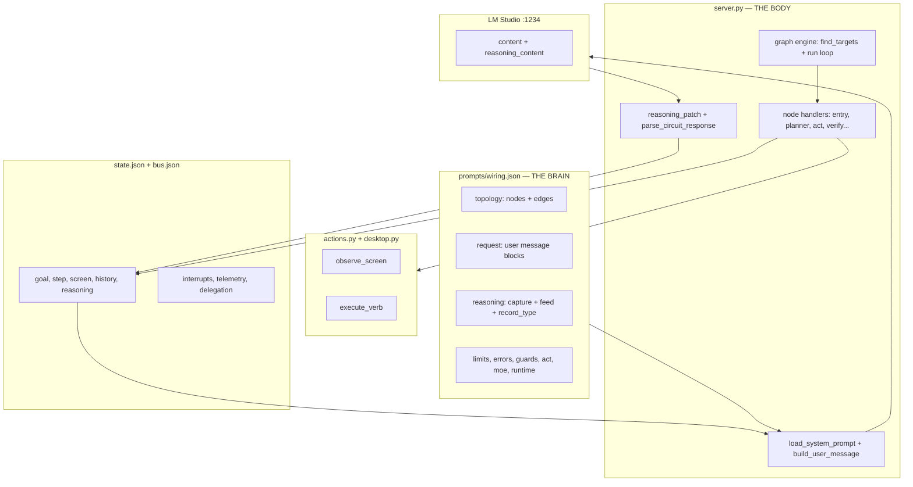
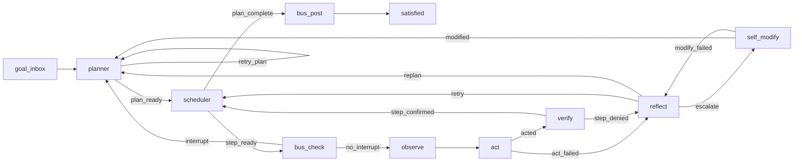
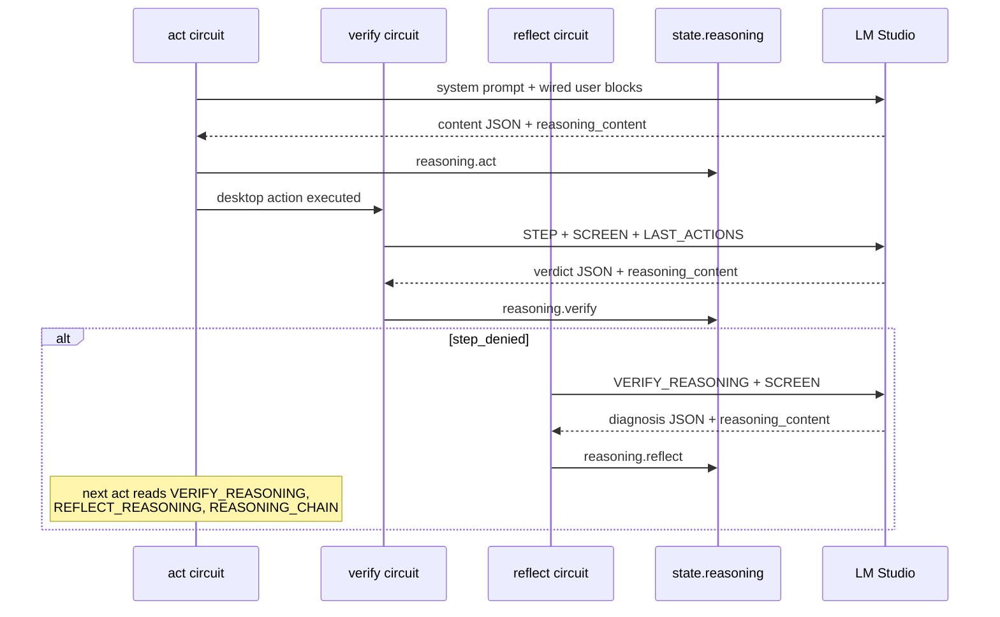

# Architecture — Wiring Separation (honest)

**Tag:** `WIRING-SEPARATION` · **Branch:** `experiment/endgame` · **Date:** 2026-06-20

---

## Vision (what we are building)

A **living desktop organism**: many dumb circuits wired together like brain regions. No single LLM prompt is “the agent.” Intelligence emerges from:

1. **Topology** — which node runs after which signal
2. **Circuits** — specialized LLM roles (plan, act, verify, reflect)
3. **Reasoning loop** — LM Studio `reasoning_content` fed back through `wiring.json` request blocks
4. **Memory** — full `state.json` (screen, history, reasoning chain) with no content truncation in Python
5. **Muscles** — `desktop.py` / `actions.py` execute verbs on real Windows UI

**Ultimate goal:** replace a human for long, arbitrary desktop tasks. **Current reality:** partial — simple goals work (Notepad); complex web goals stall (UIA, LLM latency, reasoning poisoning). See `TEST_RESULTS.md`.

---

## The diagram IS the system



---

## Signal flow (base topology)



---

## Reasoning loop (the nervous feedback)



---

## What wiring.json controls (truth table)

| Concern | In wiring.json? | Notes |
|---------|-------------------|-------|
| Node graph (edges, signals) | **Yes** | `topology.nodes`, `topology.edges` |
| Which LLM circuit each node uses | **Yes** | `node_circuits` (e.g. `act` → `unified`) |
| User message assembly | **Yes** | `request.*.user.blocks` |
| System prompt file per circuit | **Yes** | `request.*.system.file` |
| Reasoning capture & feed-forward | **Yes** | `reasoning.store_as`, request `reasoning.*` sources |
| JSON record_type validation | **Yes** | `reasoning.expected_record_type` |
| Retry/replan/cycle limits | **Yes** | `limits.*` |
| Error strings | **Yes** | `errors.*` |
| Act conclusion rules | **Yes** | `act.valid_conclusions`, `reject_conclusions` |
| Repeat-action guards | **Yes** | `guards.advance_hints` |
| MoE delegation keywords | **Yes** | `moe.*` |
| Initial state shape | **Yes** | `runtime.initial_state` |
| HTTP port formula | **Yes** | `runtime.http_port_base`, `http_port_slot_offset` |
| Persona text | **Partial** | `instance.persona` → file `personalities/*.txt` |
| LLM host/model/temperature | **No** | Still in `prompts/model.json` |
| Node handler implementations | **No** | `NODES` registry in `server.py` |
| Graph engine algorithm | **No** | `find_targets`, `run()` in `server.py` |
| Desktop UIA capture/execute | **No** | `desktop.py`, `actions.py` |
| Colony rod list & ports | **No** | `COLONY` array in `reactor.py` |
| Verb execution semantics | **Partial** | `verbs` in wiring; execution in `actions.py` |

---

## Self-criticism: “changing behavior = edit wiring only” — how true?

### Mostly true for:

- **Routing** — add/remove edges, change `on` signals
- **Prompt inputs** — add/remove/reorder request blocks (e.g. feed `reasoning.reflect` to planner)
- **Limits** — `max_attempts`, `max_replans`, `max_cycles`, `history_depth`
- **Guards** — `advance_hints` without Python changes
- **MoE keywords** — delegation triggers
- **Error messages** — `errors.*`
- **Act policy** — reject DONE, valid conclusions

### Still requires Python (or new node types) for:

- **New node type** — must add handler to `NODES` in `server.py`
- **New circuit** — need handler + `request` block + prompt file + `node_circuits` entry
- **New state source** — extend `_resolve_value()` in `server.py`
- **New desktop verb** — `actions.py` / `desktop.py`
- **Colony topology per persona** — `reactor.py` patches wiring for comms_operator

### Known inconsistencies (documented, not hidden)

| Issue | Impact |
|-------|--------|
| `reactor.py` hardcodes `COLONY` ports (9077–9079) | Colony slot 1 may disagree with `http_port_base + slot` (9078 for slot=1) |
| `run_colony_test.py` polls 9077 for rod 1 | May miss state if rod serves on 9078 |
| `model.json` separate from wiring | Two config files to change for full LLM swap |
| LLM ~90–120s per act+verify cycle | Long goals need 6–8+ minutes minimum |
| UIA misses much web DOM | Search boxes, video players often invisible |
| Reasoning chain can poison downstream | Mitigated by `expected_record_type` + prompt rules; not impossible |

**Honest summary:** wiring.json is the **brain diagram + policy**. Python is the **interpreter + muscles**. Prompts are **static circuit identity**. You change *behavior within existing node types* in JSON. You change *capabilities* in Python.

---

## File roles

```
prompts/wiring.json     Brain: topology, request blocks, reasoning, limits, guards
prompts/*.txt           Static system prompts (never mutated at runtime)
prompts/personalities/  Persona injected via request block
prompts/model.json      LM Studio endpoint + sampling (not yet in wiring)
server.py               Graph engine, node handlers, HTTP/SSE, prompt assembly
actions.py              Bridge: observe_screen, execute_verb
desktop.py              Windows UIA implementation
reactor.py              Colony supervisor (still has hardcoded COLONY)
wiring-editor.html      Visual editor + step/run against /node/{type}
state.json              Per-rod memory (full screen, no truncation)
bus.json                Cross-rod messages
```

---

## HTTP API (rod)

| Endpoint | Purpose |
|----------|---------|
| `GET /health` | `{ok, nodes, slot, port, node_circuits}` |
| `GET /wiring` | Full wiring.json |
| `GET /state` | Current state.json |
| `GET /events` | SSE node events |
| `POST /node/{type}` | Run one handler → `{signals, state_patch}` |
| `POST /run` | Start autonomous loop |
| `POST /resume` | Resume from state.json |
| `POST /interrupt` | Bus goal inject |
| `POST /wiring` | Hot-reload wiring |

**Port:** `http_port_base + slot` when `http_port_slot_offset` true (default slot=1 → **9078**).

---

## Validation tools

```powershell
python validate_stack.py          # wiring structure + prompts + server smoke
python probe_circuits.py --dry all  # print assembled prompts, no LLM
python probe_circuits.py all        # live LLM probe per circuit
```