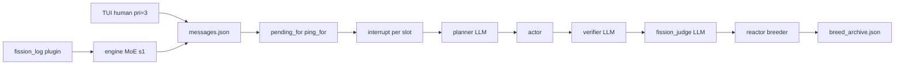

# OBSERVATIONS.md — Colony session evidence and methodology

**Tracked in git.** Append-only session forensics below. **The section immediately under this header is the single cold-start handover** — keep it current after every meaningful change (other AI tools have zero prior context).

| Related | Role |
|---------|------|
| **§ COLD-START HANDOVER PROMPT (below)** | **Copy-paste into any new AI session** |
| `AGENTS.md` | Vision, architecture, constraints, smoke commands |
| `KNOWLEDGE.md` | Protocol and file map |
| `README.md` | Human quick start |
| `sessions/20260614_132940/README.md` | Golden run forensic (109 min) |

---

## COLD-START HANDOVER PROMPT

**Last updated:** 2026-06-14 · **Branch:** `unify-rewrite` · **HEAD:** `5ff4a6c`
**Operator model:** nvidia-nemotron-3-nano-4b via LM Studio · **Profile:** `nemotron_parallel` (MC=5)

Copy everything inside the fence into a new AI coding session (Codex, Claude, Grok, Cursor, etc.). You have **no** conversation history — treat this as the only briefing.

```text
PROJECT: endgame-ai — a self-evolving multi-agent colony on consumer hardware.
Repo: C:/Users/px-wjt/Downloads/endgame-ai (or operator clone). Branch: unify-rewrite.
The LLM is a subroutine. The organism is deterministic Python: pressure → MoE → blackboard
→ scheduler → planner → actor → verifier → fission_judge → reflector → mutator → breeder.

YOU HAVE ZERO PRIOR CONTEXT. Read in this order before changing code:
1. OBSERVATIONS.md (this file) — methodology + session forensics + THIS prompt (keep updated)
2. AGENTS.md — vision, golden-run proof, hard rules, smoke commands
3. KNOWLEDGE.md — bus protocol, pressure math, file map
4. README.md — how to run (one-line startup)
5. sessions/20260614_132940/README.md — golden forensic (109 min, 4137 events)
6. sessions/20260614_185239 section below — post-fix steering run (51 min, 5104 events)

HOW TO RUN (Codex-style — GUI + unconstrained ON by default):
  python tui.py "Your long-term goal as one sentence"
  Example: python tui.py "Evolve plugins until breed.improve survives restart"
  Safer: python tui.py --safe "Colony maintenance only"
  LM Studio must be up at localhost:1234 with nemotron-3-nano-4b loaded.

GOAL MODEL (like Codex /goal):
  Trailing words → LONG_TERM_GOAL in runtime/colony_goal.txt (gitignored) + bus.
  MoE routes workers toward it when no human pri=3 task. No goal → maintenance then idle.
  TUI Enter = pri=3 ACTIVE_TASK override; after verify, colony returns to LONG_TERM_GOAL.

ARCHITECTURE (5 slots):
  s1 comms_operator (fixed MoE router, no LLM for routing)
  s2-5 architect / implementor / reviewer / devops (workers)
  Coordination ONLY via comms.py blackboard — personas never call each other.

PROVEN (log evidence):
  Golden 20260614_132940: 109 min survival, 32 verify confirms, 0 fission (fail-closed OK).
  Session 20260614_185239: 38 breed.improve, 0 LLM empty, 0 plugin.error post-FR fixes.
  Wiring landed: inbox_match, apply_interrupt, decline pri=0, progress TUI, git verify smoke.

NOT PROVEN (do not claim):
  MAP-Elites convergence, restart-persistent elite survival, long run under Codex startup.

IMPLEMENTED POST-GOLDEN (do not re-break):
  FR-1..FR-7 planner gates, FR-2 fission fail-closed, FR-3 fission_log protected,
  colony goal at startup, default open mode, nemotron 4B prompt rewrite.

HARD RULES:
  - Never create new .py files
  - Only README.md, KNOWLEDGE.md, AGENTS.md, OBSERVATIONS.md as editable markdown
  - Bus-only coordination; py_compile changed Python before long runs
  - Do not disable verifier/fission fail-closed to "make demos work"
  - Commit + push regularly; update OBSERVATIONS § COLD-START HANDOVER after material changes

KEY FILES TO TOUCH TOGETHER:
  Bus/human: comms.py (inbox_match, apply_interrupt, set_colony_goal), engine.py (_moe_route)
  Pipeline: agents.py, prompts/*.txt, schemas/*.json
  Operator: tui.py, reactor.py, config.py
  Breeder: reactor.py, plugins/fission_log.py (protected)

SMOKE (no LM Studio required):
  python -m py_compile reactor.py agents.py comms.py engine.py tui.py
  python agents.py --fission-smoke
  python agents.py --git-verify-smoke
  python reactor.py --archive-smoke
  python reactor.py --breed-improve-smoke

CURRENT PRIORITY FOR NEXT SESSION:
  1. Operator runs: python tui.py "<goal>" with LM Studio live
  2. Append new session forensics to OBSERVATIONS.md (do not delete prior sessions)
  3. Prove breed.improve + restart survival on post-7f76124 wiring
  4. Keep § COLD-START HANDOVER PROMPT current (commit SHA, priorities, run command)

RAW TELEMETRY: sessions/<id>/events-*.jsonl and runtime/ are gitignored — archive externally.
Git tracks: OBSERVATIONS.md, session README forensics, benchmark.txt, Colony_Demo/ artifacts.

FRESH START (wipe local runtime before a test):
  python -c "import log; log.cleanup_runtime(deep=True)"
  Clears bus, mode flags, colony_goal.txt, breed_archive, runtime/_* snapshots; preserves sessions/README forensics in git.
```

**Maintainer rule:** After each commit that changes behavior, update HEAD SHA, priorities, and "IMPLEMENTED" lines in this section. Session forensics append below — never delete old sessions.

---

## Why this document exists

Golden runs prove the organism can survive; **observations prove how it behaves under steering** — MoE, bus flow, planner gates, breeder churn, timing, successes and failures — with **fix items tied to components**.

This is **GOLDEN-tier evidence** alongside session `132940`: not just that the colony runs, but **how** each subsystem behaved under real operator steering.

Operator intent (session `185239`): **unconstrained self-evolution** (GUI, git, mutation). Observations record where guardrails block that vision.

---

## Observation methodology (for any AI or human)

### 1. Evidence sources (read in order)

1. `sessions/<session_id>/events-reactor.jsonl` — breeder
2. `sessions/<session_id>/events-child-s1..s5.jsonl` — per-slot pipeline
3. `runtime/comms/messages.json` — blackboard (may be trimmed late-run)
4. `runtime/breed_archive.json` — survivor state
5. On-disk artifacts (`benchmark.txt`, `Colony_Demo/`, etc.)
6. Poll snapshots `runtime/_snapshot_*.json` if present (gitignored)

### 2. Poll protocol

| When | Wait |
|------|------|
| After `@colony` simple file task | 30–45s |
| README / git / multi-step | 90–120s |
| Slot on `llm.request` planner | ≥45s (median planner LLM **32s**) |
| Stuck retry loop | 3–5 min or change task |
| `schedule need_plan` only, no interrupt | Check missing `@colony` |

Capture per poll: event count, last_ts, plans/verify/fission, slot_last phase, human messages, artifacts on disk.

### 3. Multi-perspective analysis (required at session close)

| Perspective | Questions |
|-------------|-----------|
| **MoE** | route/yield/escalate; human pri=3; gate weights |
| **Prompt/schema** | planner.error and actor.fail taxonomies; model biases |
| **Timing** | LLM median by role; interrupt→verify; duty cycle |
| **Bus flow** | human vs internal; interrupt sources; pri=3 pollution |
| **Pipeline** | reconstruct success and failure paths |
| **Breeder** | improve/evict/retain; end-state survivors |
| **Confidence map** | high/medium/low per subsystem |
| **Fix roadmap** | P0–P3 with file coupling |

### 4. Append rules

- **Append only** — never delete prior sessions.
- Add row to **Session index**.
- Add `## Session <id>` + `### FORENSIC HANDOVER` section.
- Raw JSONL never committed; reference path + external archive.

### 5. Human message rules

- TUI posts `from=human`, `pri=3` — do not type `@human` in body.
- **Post-fix (session `185239` wiring):** pri=3 human messages deliver to all colony peers via `comms.inbox_match` without requiring `@colony`. `@colony` / `@persona` still preferred for explicit routing.
- Declines and max-retry exhaustion must post **pri=0** + `human_ack=True` (not pri=3) to avoid bus echo loops.
- Pre-fix deadlock (proven in `185239`): without `@colony`, `human_task_active()` blocked MoE but `pending_for` was empty.

### 6. Paste patterns that worked

```text
@colony create benchmark.txt with colony benchmark ok
@colony create Colony_Demo/audit_report.txt with four sections Architect Implementor Reviewer DevOps each summarizing one plugins folder py file in one sentence
```

### 7. Future: colony-wide progress (proposed)

Post `kind=progress` on bus from deterministic phase hooks; TUI shows goal/step/ETA for **all** slots (human + MoE).

---

## Session index

| Session | Duration | Events | Key proof | Section |
|---------|----------|--------|-----------|---------|
| `20260614_132940` | 109 min | 4,137 | Golden autonomous run | `sessions/20260614_132940/README.md` |
| `20260614_185239` | 51 min | 5,104 | Post-FR file tasks; 38 breed.improve | Below |

**External archive (gitignored):** `sessions/20260614_185239/events-*.jsonl`, `runtime/_forensic_base.json`.

---

## Session 20260614_185239

**Profile:** `nemotron_parallel` + GUI · **Stopped by operator**  
**Window:** `2026-06-14T16:52:39` → `2026-06-14T17:43:33` UTC  
**Headline:** 143 plans, 127 verify, 20 fission / 43 deny, 38 breed.improve, 0 LLM empty, 0 plugin.error  
**Artifacts in git:** `benchmark.txt`, `Colony_Demo/audit_report.txt`

### Poll chronology (abbreviated)

| Poll | UTC | Notes |
|------|-----|-------|
| T0–T4 | 17:01–17:15 | Boot; GUI fail; human.decline; `@colony` works |
| T5–T8 | 17:25–17:30 | benchmark + audit success |
| T9–T12 | 17:31–17:39 | README deadlock; py_compile README loop |
| Final | 17:43 | 5,104 events; all evicted |

### Operator requirements

1. `@colony` mandatory for worker delivery.
2. **Unconstrained mode** — GUI, git, mutation without guardrails (P0).
3. Colony-wide **progress board** on bus + TUI.

---

# FORENSIC HANDOVER — Multi-Perspective Deep Analysis

**Session:** `20260614_185239` · **Stopped by operator** · **Profile:** `nemotron_parallel` + GUI  
**Window:** `2026-06-14T16:52:39` → `2026-06-14T17:43:33` UTC (**~51 min**)  
**Evidence bundle:** `sessions/20260614_185239/events-*.jsonl` (5,104 events), `runtime/comms/messages.json` (trimmed late-run), `runtime/breed_archive.json`, `runtime/_forensic_base.json`, polls `runtime/_snapshot_t*.json`  
**Baseline:** Golden `20260614_132940` (109 min, 4,137 events)  
**Purpose:** Next-session source of truth for any AI coding tool — how the organism **actually** behaved, what worked, what failed, and **which files to change together**.

---

## 1. Executive confidence map

We can now state with log proof:

| Subsystem | Confidence | Evidence |
|-----------|------------|----------|
| **Process survival** | **High** | 51 min, 5 slots + reactor, no crash |
| **Pipeline loop** | **High** | 143 plans → 128 actors → 127 verifies; reflect(100) → mutate(93) → replan |
| **LLM transport** | **High** | 505 req / 502 resp, **0 empty** (post budget fix) |
| **FR-1 planner gates** | **High** | 40 `planner.error`; protected file blocks live |
| **FR-2 fission fail-closed** | **High** | 43 deny / 20 credit; bus-only denied |
| **FR-3 fission_log** | **High** | **0** `plugin.error` |
| **Breeder learning** | **Medium** | 38 `breed.improve`, 14 retain/trial; ended all-evicted |
| **MoE routing** | **Medium** | 32 route / 32 yield; math matches `engine.py` |
| **Human → worker delivery** | **Medium** | Requires `@colony`; deadlock without it proven |
| **GUI / desktop** | **Low** | 0 notepad/chrome actor paths; 8 declines |
| **Git/commit goals** | **Low** | git status empty denials; no push |
| **README editing** | **Low** | Corrupted append at shutdown; py_compile-on-md loop |
| **MAP-Elites / restart** | **Unproven** | improve yes; restart survival not tested |

**Net:** The **deterministic organism loop works**. The **model + guardrails layer** steers toward safe file/bus shortcuts, not operator’s unconstrained/GUI vision.

---

## 2. Architecture — how components relate (proven data flow)

```text
TUI inject (pri=3, from=human)
    → messages.json (blackboard chat)
    → engine._check_interrupt() per worker
         └─ comms.pending_for(persona)  [REQUIRES @colony or @persona]
    → board.goal + interrupt JSONL
    → scheduler → planner (LLM) → actor (exec) → verifier (LLM)
    → fission_judge (LLM) → reflector → mutator → reactor breeder
    → breed_archive.json + bus evolve/status posts
    → plugin.fission_log (pressure) → MoE gate on s1
```



**Coupling rules (fix one → touch others):**

| Change | Touch |
|--------|-------|
| Mention routing / human deadlock | `comms.py` `pending_for`, `human_task_active`, `engine.py` `_moe_route`, `agents.py` interrupt |
| Planner rejections | `agents.py`, `prompts/planner.txt`, `schemas/planner.json` |
| GUI goals | `prompts/planner.txt`, `desktop.py`, `actions.py`, `colony_env.py`, `config.py` `--gui` |
| Fission credit policy | `prompts/fission_judge.txt`, `agents.py` `_fission_review` |
| Breeder churn | `reactor.py`, `plugins/fission_log.py`, verify/fission alignment |
| TUI visibility | `tui.py`, `comms.py` mirror events |
| Unconstrained mode (operator intent) | All above + protected lists in `agents.py` |

---

## 3. MoE perspective (s1 comms_operator)

**Counts:** `moe.route` ×32, `moe.yield` ×32 (no `moe.escalate` this session).

**Behavior observed:**

1. **Boot (16:52–16:53):** Gate 1.0 → `@architect`; then equal split 0.25; then implementor ~0.33 — maintenance scan goal on bus (`comms.route`).
2. **Human pri=3 active:** Yield every ~20s — `human pri=3 task active`. MoE **stops assigning** maintenance while `human_task_active()` true (`engine.py` L233–235).
3. **Between human gaps (17:35+):** Routes resume ~0.27–0.36 gate to implementor/architect when yield lifts briefly.
4. **Telemetry input:** `plugin.fission_log` → stagnation/power; s4 highest **schedule** load (1,132 events) — reviewer polls heavily when not planning.

**MoE successes:**

- Correct yield during human benchmarks after `@colony` delivery.
- Softmax scores logged with each route (auditable).

**MoE failures / gaps:**

- Yield + **no `@colony`** = system frozen (T9): human task “active” but **no worker inbox** → s1 yields forever, s2–s5 idle.
- Retry-exhaustion posts from **workers** (`comms_operator`, `architect`, `reviewer`) arrive as **pri=3 ping** → treated as new human goals → re-yield / nested interrupts (15× interrupt from comms_operator).
- MoE cannot distinguish “human real” vs “human-shaped failure echo” without schema change.

**Fix cluster M1–M3:**

| ID | Fix | Files |
|----|-----|-------|
| M1 | Deliver pri=3 human to comms_operator even without `@colony` | `comms.py`, `engine.py` |
| M2 | Post max-retry as `pri=0` + `human_ack` / `kind=decline` | `agents.py`, `comms.py`, `tui.py` |
| M3 | MoE skip yield if human message has no `@colony` and pending_for empty | `engine.py`, `comms.human_task_active` |

---

## 4. Prompt / schema engineer perspective

**LLM roles (median latency, n, empty):**

| Role | n | Median | Empty |
|------|---|--------|-------|
| planner | 173 | **32.2s** | 0 |
| verifier | 117 | 9.4s | 0 |
| fission_judge | 38 | 19.5s | 0 |
| reflector | 100 | 17.6s | 0 |
| mutator | 74 | 11.8s | 0 |

**Planner.error taxonomy (40 total):**

| Count | Diagnosis | Prompt/schema lever |
|-------|-----------|---------------------|
| 17 | Protected infrastructure file | `agents.py` `_PROTECTED_*`; teach “never comms.py” in `planner.txt` |
| 13 | Bundled bus + artifact `done_when` | FR-1 `done_when` single outcome |
| 6 | Unterminated string in sequence code | JSON-in-string; schema max length / repair |
| 2 | `import Path` | FR-1 pre-import |
| 2 | Invalid syntax in sequence | P12 actor sniff |

**Actor.fail taxonomy (54 total):**

| Count | Error | Root narrative |
|-------|-------|----------------|
| 25 | SyntaxError leading zeros | **py_compile README.md** — arXiv `01701` in md |
| 14 | FileNotFoundError colony.py / agent.py | Phantom paths (FR-4 partial) |
| 13 | SyntaxError invalid syntax | Bad generated code on `file.py` |

**Model behavioral biases (this model, this profile):**

1. Prefers **file_equals / py_compile / bus post** over GUI/desktop.
2. Treats any filename as Python when stressed (README, md).
3. Reuses **stub literal strings** as file content (audit_report one-liner) — verifier `file_equals` accepts.
4. Still attempts **comms.py** patches under pressure (17 blocks).

**Prompt successes:**

- `done_when: file_equals {"path":"benchmark.txt",...}` → **0.2s** verify path.
- `posted message to colony bus` + correct print string → verify OK (fission may still deny).

**Prompt failures:**

- GUI goals never produced `desktop.py` / `actions` plans with evidence.
- Git goals → `git status` empty or py_compile markdown.
- “HUMAN APPROVES” / “ORDER BEGIN MUTATION” — zero schema bypass.

**Fix cluster P1–P5:**

| ID | Fix | Files |
|----|-----|-------|
| P1 | Planner: README/md = `Path.write_text`, never py_compile | `prompts/planner.txt`, `agents.py` actor sniff |
| P2 | GUI profile: explicit desktop template when `gui_mode` | `prompts/planner.txt`, `agents.py` user context |
| P3 | `file_equals` verifier: reject stub content &lt; N chars / no newlines for multi-section asks | `agents.py`, `prompts/verifier.txt` |
| P4 | Expand `AVAILABLE_FILES`; ban `colony.py`, `agent.py` | `agents.py` FR-4 |
| P5 | Unconstrained flag skips planner.error for protected (operator mode) | `config.py`, `agents.py` |

---

## 5. Timing and throughput perspective

**Session duty cycle:**

| Phase | Events | % | Meaning |
|-------|--------|---|---------|
| schedule | 1,357 | 26.6% | Idle poll / need_plan |
| LLM req+resp | 1,007 | 19.7% | Thinking |
| plugin.fission_log | 472 | 9.3% | Pressure telemetry |
| plan→actor→verify | 398 | 7.8% | Real work |
| breed.archive | 147 | 2.9% | Persistence churn |

**Pipeline transitions (top):**

```text
llm.response → plan: 133
plan → actor: 128
llm.response → verify: 117
llm.response → reflect: 100
mutate → planner.pending: 88
```

**Time budgets (operator polling):**

| Path | Interrupt → verify OK |
|------|------------------------|
| file_equals stub | **0.2–2s** |
| Full planner+verifier | **median 41s, p90 52s** |
| Failed retry lap | **~75–90s** |
| schedule tick | **2s** |

**Throughput vs golden:** Similar event rate (~100/min vs golden ~38/min) — this run **more aggressive** breeder + more LLM cycles per minute.

---

## 6. Human vs internal bus flow

### 6.1 Human messages (TUI → bus → interrupts)

Unique human-origin interrupts (**10** distinct goal texts):

| Time | Goal (truncated) | Outcome |
|------|------------------|---------|
| 16:53 | `@colony` notepad + chrome + grok | **Fail** — 8 declines, no GUI |
| 17:04+ | Retry echo from implementor | **Pollution** — nested pri=3 |
| 17:16 | `@colony` notepad only | **Fail** — decline |
| 17:26 | `@colon...
| 17:26 | `@colony create benchmark.txt…` | **SUCCESS** — 2s |
| 17:29 | `@colony Colony_Demo/audit_report.txt…` | **SUCCESS stub** — 1s all slots |
| 17:31 | README rewrite **no @colony** | **DEADLOCK** |
| 17:33–17:39 | `@colony` README + git | **Fail loop** — py_compile README |
| 17:38+ | `@colony append exact line README` | Partial garbled append (reverted pre-commit) |

### 6.2 Internal bus

Interrupt sources (65 total): human 30, comms_operator 15, reviewer 6, architect 5, devops 5, implementor 4. MoE maintenance routes (pri=1) run when yield lifts. Coordination is **emergent** via all-slot interrupt fan-out.

---

## 7. Pipeline — success paths

**benchmark.txt:** interrupt → plan `file_equals` → actor verify → verify confirmed → fission credit (~2s).

**audit_report.txt:** all slots interrupted within 1s; file_equals stub; breed.improve wave (14+ in 1 min).

---

## 8. Pipeline — failure paths

- **GUI:** no desktop actor; 8× human.decline.
- **Mention deadlock:** human_task_active + empty pending_for.
- **README:** py_compile markdown → SyntaxError on arXiv `01701`.
- **Bus loop:** max-retry posted as pri=3 from workers.

---

## 9. Breeder

38 improve, 84 evict, 14 retain/trial. Mid-session all fitness 1.0; shutdown all evicted.

---

## 10. Artifacts

| Path | Status |
|------|--------|
| `benchmark.txt` | OK |
| `Colony_Demo/audit_report.txt` | stub OK |
| `README.md` | corrupted during run — restored from git |

---

## 11. Fix roadmap (P0–P3)

| Pri | Issue | Files | Status |
|-----|-------|-------|--------|
| P0 | pri=3 without `@colony` deadlock | `comms.py`, `engine.py` | **Done** — `inbox_match`, `apply_interrupt` |
| P0 | Retry as pri=3 bus pollution | `agents.py`, `comms.py` | **Done** — pri=0 + `human_ack` |
| P0 | `--unconstrained` operator mode | `config.py`, `agents.py`, `tui.py`, `reactor.py` | **Done** |
| P1 | py_compile on `.md` | `agents.py`, `prompts/planner.txt` | **Done** — planner contract AST guard |
| P1 | GUI planner templates | `agents.py`, `desktop.py` | Open (use `--unconstrained` / `--gui`) |
| P1 | Colony progress bus | `comms.py`, `tui.py`, `engine.py` | **Done** — `post_progress`, `colony_progress`, TUI slot header |
| P2 | Stub file_equals quality | `agents.py`, `prompts/verifier.txt` | Open |
| P2 | Phantom paths | `agents.py` | Partial (FR-4 manifest) |
| P3 | Git milestone schema | `prompts/planner.txt`, `agents.py` | **Done** — `_verify_git_done`, `--git-verify-smoke` |

---

## 12. Successes to preserve

Post-golden fixes (0 LLM empty, 0 plugin.error); `@colony` file path; breed.improve; fail-closed fission; protected plugins.

---

## 13. Unproven

MAP-Elites restart; GUI fission; git push; unconstrained safety.

---

## 14. Session close note (20260614_185239)

Forensic detail for this run is in sections 1–13 above. **Canonical handover for the next AI is § COLD-START HANDOVER PROMPT at file top** (always keep that block current).

*Forensic JSONL (external archive): s1:914 s2:856 s3:962 s4:1132 s5:928 reactor:312.*

---

## Codex-style startup (2026-06-14)

- **Default:** `python tui.py "your long-term goal"` — GUI + unconstrained on, profile `nemotron_parallel`.
- **LONG_TERM_GOAL** persists in `runtime/colony_goal.txt`; MoE routes toward it; maintenance when empty.
- **TUI pri=3** = ACTIVE_TASK override; after verify, idle until MoE resumes long-term work.
- **`--safe`** restores guarded planner behavior.

## Post-fix implementation log (2026-06-14)

Wiring unified per operator request (less code, one interrupt path):

- `comms.inbox_match` / `pending_for` — pri=3 human broadcasts to colony peers; `human_ack` entries excluded from inbox.
- `comms.apply_interrupt` — single interrupt handler; `engine._apply_bus_interrupt` only; removed `agents._apply_human_goal`.
- `human_task_active` — clears on `human_ack`; orphan human (no mentions, empty inbox) no longer blocks MoE.
- `_decline_human_goal` / GUI decline actor code — pri=0, not pri=3.
- `config.unconstrained_enabled()` + `--unconstrained` on `tui.py` / `reactor.py`.
- Planner rejects `py_compile` on non-`.py` paths at plan-parse time.
