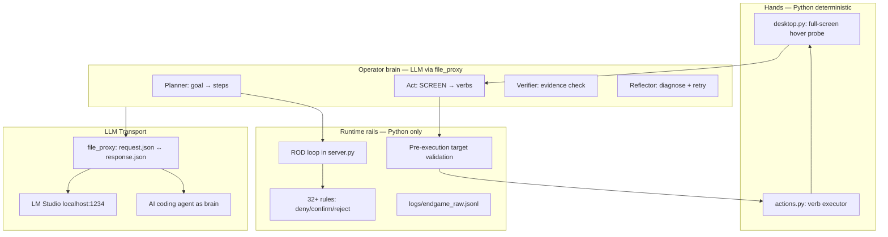
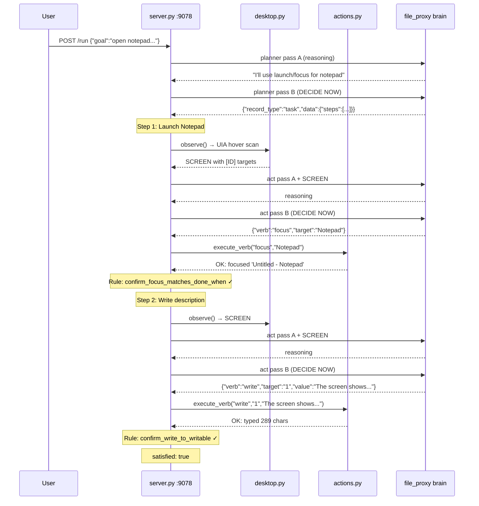

# Endgame-AI

**Local Windows desktop operator. Post a goal. Walk away.**

No pip. No API keys. No per-site integrations. The GUI is the universal API.

---

## What This Is

A self-evolving desktop operator that owns the keyboard and screen on Windows. Python moves the mouse. An LLM (local or remote) decides what to do. Runtime rules are Python-side anti-cheat — never sent to the model.

```
┌─────────────────────────────────────────────────┐
│  YOU: post goal via HTTP or panel                │
│  ↓                                              │
│  ROD LOOP: plan → observe → act → verify        │
│  ↓                                              │
│  HANDS: Python + UIA hover probes + Win32       │
│  ↓                                              │
│  LLM BRAIN: decides JSON, never touches mouse   │
│  ↓                                              │
│  RESULT: satisfied:true or give_up + raw log    │
└─────────────────────────────────────────────────┘
```

---

## Proven Results (June 26, 2026)

| Goal | Result | Verify Rule |
|------|--------|-------------|
| `open notepad and write what you know about the screen` | **satisfied:true** | `confirm_focus_matches_done_when` + `confirm_write_to_writable` |
| `navigate to google.com in chrome` | **satisfied:true** | `confirm_browser_open_url` |

Both runs used real Windows desktop observation (UIA hover probes), real keyboard/mouse actions, and file_proxy LLM transport with an AI coding agent acting as the brain.

---

## Architecture



### Proven ROD Flow (Notepad Goal)



---

## Two-Pass DECIDE NOW Protocol

Every LLM call uses two passes:

| Pass | Input | Output |
|------|-------|--------|
| A | Role prompt + input blocks | Prose reasoning |
| B | Same + `ROD_REASONING_CONTENT` + `DECIDE NOW` | Exactly one JSON object |

JSON may arrive in `content` OR `reasoning_content` (Nemotron-style). Both are parsed.

---

## File Inventory

| File | Role | Lines |
|------|------|-------|
| `server.py` | HTTP API, ROD loop, rules engine, LLM calls, self_modify | ~3480 |
| `desktop.py` | UIA hover probes, SCREEN rendering, window management | ~1620 |
| `actions.py` | Verb dispatch (click, write, press, hotkey, focus, open_url, scroll, wait, launch) | ~290 |
| `colony.py` | Multi-slot process wrapper | ~45 |
| `prompts/wiring.json` | Brain: topology, rules, roles, limits | 33 rules, 12 nodes, 22 edges |
| `prompts/model.json` | LLM transport config | file_proxy or openai |
| `prompts/wiring-schema.json` | Validation schema | — |
| `wiring-editor.html` | Walk-away panel UI | — |

---

## Run It

```powershell
cd C:\Users\YOU\Downloads\endgame-ai
$env:PYTHONIOENCODING = 'utf-8'
python server.py
# Open http://127.0.0.1:9077/ or use API on :9078
```

### Post a goal

```powershell
Invoke-RestMethod -Method Post -Uri http://127.0.0.1:9078/run `
  -ContentType 'application/json' -Body '{"goal":"open notepad and type hello"}'

# Check result:
Invoke-RestMethod http://127.0.0.1:9078/state
```

---

## LLM Transport Options

### Option 1: LM Studio (walk-away)

Edit `prompts/model.json`:
```json
{"transport": "openai", "host": "http://localhost:1234", "model": "your-model"}
```

### Option 2: file_proxy (AI agent as brain)

Default config. The server writes requests to `comms/slot1_cognition/request.json` and polls `comms/slot1_cognition/response.json`.

Any AI agent (Kiro, Grok, Claude, etc.) can act as the brain by:
1. Reading `request.json`
2. Understanding the role (system message) and input (user message)
3. Writing a matching `response.json`

### Option 3: Browser AI via GUI (the endgame)

The operator navigates to grok.com/chatgpt/any-ai via browser, types the request, captures the response. No API key needed.

---

## Prompt for AI Coding Agent (file_proxy brain)

Paste this into any AI coding agent session to make it act as the LLM brain for endgame-ai:

```
You are the LLM brain for endgame-ai, a Windows desktop operator.

TRANSPORT: file_proxy
- Read: comms/slot1_cognition/request.json (server writes this)
- Write: comms/slot1_cognition/response.json (you write this)

PROTOCOL:
1. Wait for request.json to appear
2. Read the messages array (system + user)
3. Determine which role is active from system message:
   - "ROLE: Planner" → output {"record_type":"task","data":{"steps":[{"description":"...","done_when":"..."}]}}
   - "ROLE: Act" → output {"record_type":"action","data":{"conclusion":"EXECUTE","actions":[{"verb":"...","target":"...","value":"..."}]}}
   - "ROLE: Verifier" → output {"record_type":"verdict","data":{"confirmed":true/false,"evidence":"...","reason":"..."}}
   - "ROLE: Reflector" → output {"record_type":"diagnosis","data":{"diagnosis":"...","suggestion":"...","should_replan":false}}
4. Check if "DECIDE NOW" is in user message:
   - WITHOUT DECIDE NOW: respond with brief reasoning (prose)
   - WITH DECIDE NOW: respond with ONLY the JSON object for that role
5. Write response.json:
   {"id":"<same as request>","status":"complete","choices":[{"message":{"content":"<your JSON or reasoning>","reasoning_content":""}}]}

VERBS for Act role:
- click [ID] — click element from SCREEN
- write [ID] value — type text into element
- press key — press single key (enter, tab, escape)
- hotkey keys — key combo (ctrl+l, win+r, alt+f4)
- focus [W#] or title — switch window
- open_url browser url — launch URL in browser
- scroll [ID] amount — scroll element
- wait ms — pause
- launch app value — deterministic Win+R launch
- remember key value — store fact in MEMORY

CRITICAL RULES:
- Only use [ID] numbers from SCREEN for click/write/scroll
- Only use [W#] tokens from WINDOWS for focus
- @background elements are NOT clickable (no [ID])
- Launch apps with: {"verb":"launch","target":"app","value":"notepad"}
- Navigate with: {"verb":"open_url","target":"chrome","value":"https://..."}
- SCREEN shows real Windows desktop via UIA hover probes

RESPONSE FORMAT:
{
  "id": "<copy from request>",
  "status": "complete",
  "choices": [{"message": {"content": "<JSON string>", "reasoning_content": ""}}]
}
```

---

## Automation Script (poll and respond)

For continuous autonomous operation, an AI agent can use this loop:

```python
import json, time, pathlib

REQ = pathlib.Path("comms/slot1_cognition/request.json")
RESP = pathlib.Path("comms/slot1_cognition/response.json")

while True:
    if REQ.exists():
        req = json.loads(REQ.read_text())
        req_id = req["id"]
        messages = req["messages"]
        # ... generate your response based on messages ...
        response = {"id": req_id, "status": "complete",
                    "choices": [{"message": {"content": your_json, "reasoning_content": ""}}]}
        RESP.write_text(json.dumps(response, indent=2))
    time.sleep(1)
```

---

## Key Design Decisions

1. **Rules outside prompts** — 33 Python-evaluated rules are never sent to the LLM. They auto-confirm/deny verify steps structurally.
2. **Two-pass DECIDE NOW** — Reasoning first, then JSON-only. Handles models that put JSON in reasoning_content.
3. **Pre-execution target validation** — Invalid `[ID]` targets are rejected before mouse action with clear error.
4. **Failed target feedback** — Reflect receives `failed_targets` list to prevent repeating the same invalid target.
5. **Deterministic launch** — `launch` verb does Win+R → type → Enter → verify. No guessing desktop icons.
6. **Single raw log** — `logs/endgame_raw.jsonl` captures every LLM call, action, rule match, and state transition.
7. **No test scripts** — Proof = live `POST /run` + `GET /state` + raw log.

---

## Observe Contract

SCREEN shows:
- `FOCUSED: <window title>` — current foreground
- `[ID] Role "Name" @focused` — clickable/writable targets (ONLY these have [ID])
- `[ID] Role "Name" @overlay` — taskbar/overlay targets
- `Role "Name" @background` — visible but NOT clickable (no [ID])
- `WINDOWS:` — focus targets with [W#] tokens

The model must ONLY use `[ID]` numbers for click/write/scroll and `[W#]` for focus.

---

## Wiring Topology

```
goal_inbox → moe_route → planner → scheduler → bus_check → observe → act → verify → scheduler
                                                                        ↓              ↓
                                                                    reflect ←── step_denied
                                                                        ↓
                                                              replan/escalate/give_up
```

Bounded: max_attempts=7, max_replans=3, max_self_modify=3, max_cycles=300.

---

## Truth Order

1. Live `prompts/wiring.json` and `server.py`
2. Live `desktop.py` and `actions.py`
3. Raw log evidence
4. This README (explains intent, may lag code)

---

## Next: Browser AI Discovery

The endgame path: operator navigates to grok.com via browser GUI, types requests, captures responses into MEMORY. Then grok.com becomes the LLM brain — no API key, no integration, just GUI-as-universal-API.

**Prepare the seed. Post the goal. Walk away.**
