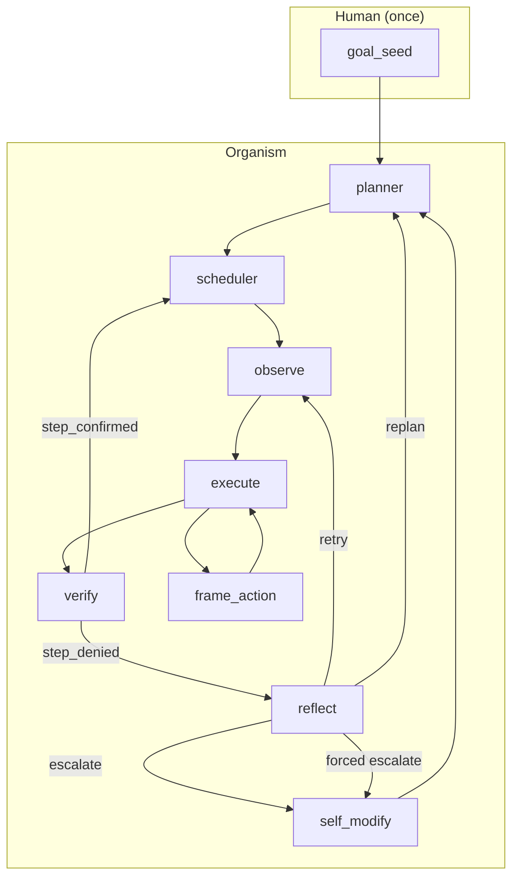
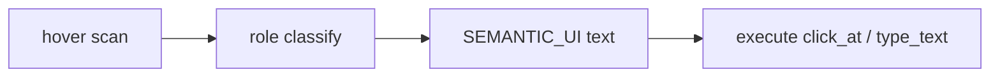

# endgame-ai

**Living digital operator on Windows.** One `goal_seed` in, handover out. Python senses the desktop, runs arbitrary code on the real machine, routes signals through `wiring.json`, and may evolve firmware via git. No sandbox.

**Tracked firmware:** 22 root `*.py` + `wiring.json` ≈ **2,700 LOC** (inverted `.gitignore` allowlist).

---

## One goal, not two systems

The organism has **one goal** — whatever text you put in `comms/goal.txt` (or pass to `organism.run`). The planner decomposes it into steps at runtime. Firmware does not know about chess, Opera, X, or “dual threads”; only `goal_seed` supplies task meaning.

Example handover text may *mention* several threads (browser A + browser B). That is **goal content**, not architecture. The loop is always: plan → observe → execute → verify → reflect → (maybe) self_modify.

---

## Escalation enforcement (`escalation-enforcement`)

Reflect can emit `escalate` → `self_modify`. Previously that was **LLM-only**; reflect kept choosing `replan` when SEMANTIC_UI missed roles the step needed.

**Now (deterministic):** after `failure_streak.count ≥ 3`, if `done_when` names SEMANTIC_UI roles (`text_input`, `text_area`, `button`, `link`, `clickable`) that are **absent** from the prepared tree, reflect **forces `escalate`** regardless of LLM `next_signal`.

| File | Change |
|------|--------|
| `bus.py` | `observation_contract_failure()`, `should_force_observation_escalate()` |
| `reflect.py` | Override signal when contract gap + streak threshold met |
| `wiring.json` | `reflect_escalation.observation_missing_min_streak: 3` |

Natural `escalate` and execute `SELF_MODIFY` still work as before.

---

## Architecture





**SEMANTIC_UI** = WINDOW → ZONE → geometry-derived role. Goal interprets meaning.

---

## Operator commentary (separate from organism)

Two layers:

| Layer | What it is | Drives organism? |
|-------|------------|------------------|
| **Organism** | `run_*.py`, tick loop, brain | Yes |
| **Commentary** | `comms_poll.py` (30s file tail) + human/assistant chat | **No** — read-only observer |

`comms_poll.py` tails `state.json` / `runtime.ndjson` / `brain_raw.jsonl`. It does not import `organism` or send signals.

**Commentary is not working as designed.** In practice the owner must prompt the assistant (“comment more”) during a run. `comms_poll` output is easy to miss; proactive 30s narration from the assistant is unreliable unless explicitly requested.

### Unplanned desktop disturbance = adaptation benchmark

While the organism runs, the owner often **types to the assistant** (Cursor chat, focus changes, editor windows). That activity was **not in the plan**. It still appears in SEMANTIC_UI scans — focus flips, extra windows, element counts swing (e.g. 28 → 400 → 13 elements between ticks).

That is a useful **stress test**: the system must interpret or recover from a desktop that includes operator noise, not just the goal’s target apps. Document runs where verify/reflect reactions to owner-side UI churn are worth studying in `comms/brain_raw.jsonl`.

**Operator rule:** minimize chat and focus stealing during handover if you want clean scans; or embrace the noise as a deliberate benchmark.

---

## Last handover run — forensic summary (2026-07-04)

Single goal text (chess on grok + publishing via Opera). **Not completed.** Stopped by operator at tick 51.

| Metric | Value |
|--------|-------|
| Ticks | 51 (killed mid-reflect API call) |
| Brain calls | 37 |
| Reflect | retry 3, replan 5, **escalate 0** (enforcement added after this run) |
| self_modify | 0 visits |
| step_confirmed | 0 |

Stuck on grok: SEMANTIC_UI saw `drag_handle` only, no chat `text_input`. Execute loop: focus + CANNOT + frame_action. No escalate before stop — enforcement tag addresses the next run.

**Operator mistakes:** `stop.txt` during live reflect; false “resume” (`reset=False` does not load `state.json`).

---

## What is proven / not proven

| Proven | Not proven |
|--------|------------|
| Tick loop, SEMANTIC_UI, unsandboxed execute | Goal completion on last handover |
| Verify discipline, replan, frame_action on CANNOT | Forced escalate on live tick (coded, untested in anger) |
| Raw audit `comms/brain_raw.jsonl` | Autonomous 30s commentary without owner prompts |
| Task-agnostic prompts (`540f927`) | `organism.run` true resume from state |

---

## Plans

1. **P0** — One organism; `cmd.exe` launchers; no `stop.txt` unless owner asks; no fake resume.
2. **P1** — Exercise forced escalate → self_modify patches `desktop.py` observation gaps.
3. **P2** — `organism.run(resume=True)` load `state.json`.
4. **P3** — Fix commentary: assistant auto-polls during run, or richer `comms_poll` stdout.

---

## Launch (`cmd.exe` only)

```bat
cmd.exe /c "cd /d C:\Users\ewojgab\Downloads\endgame-ai && python comms\run_dual.py"
```

Commentary (optional, read-only):

```bat
cmd.exe /c "cd /d C:\Users\ewojgab\Downloads\endgame-ai && python comms_poll.py 30 200"
```

Stop: `python comms\stop_all.py` or `stop.txt`.

---

## Key paths

| Path | Role |
|------|------|
| `wiring.json` | Topology, prompts, `reflect_escalation` |
| `bus.py` | Failure streak + observation contract gate |
| `reflect.py` | Forced escalate override |
| `desktop.py` | SEMANTIC_UI |
| `comms/goal.txt` | Runtime goal (gitignored) |
| `state.json` | Live state (gitignored) |