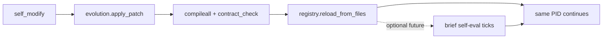
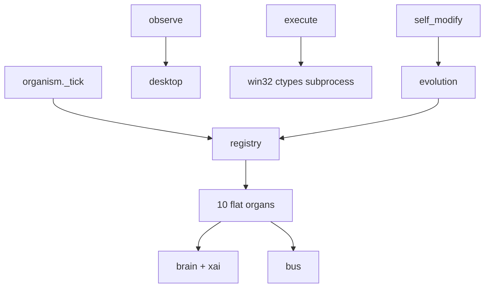
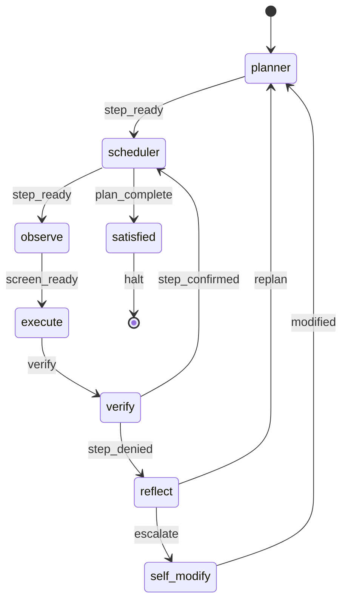
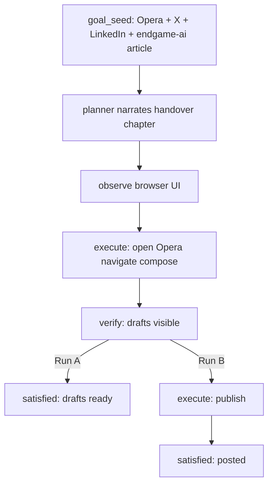
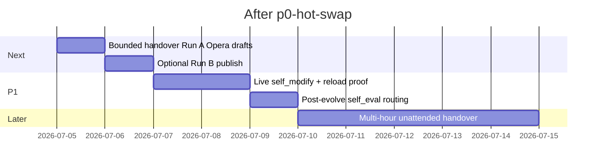

# endgame-ai

## Handover (read first)

**Starting endgame-ai = you hand full control of this PC to a digital operator and walk away.**

You give a goal. You start the process. You leave. The organism runs until the goal is done, it gives up honestly, or you create `stop.txt`.

**No sandbox. No task ceiling.** The system may install software, use your browsers and logged-in accounts, post on social media, run git evolution, hot-swap its own organs, and build other systems as means to the goal.

| | |
|---|---|
| **Risk** | Unconstrained access to machine, accounts, data, reputation |
| **Greatness** | 24/7 human-operator replacement — self-narrating, self-evolving, atemporal |

Evolution and handover **require** this freedom.

**Tag:** `p0-hot-swap` · commit after this README

---

## What it is

Wiring harness, not chat agent. Fixed topology · one signal + one patch per tick · Grok only in LLM organs.

| Layer | Role |
|-------|------|
| Python + ctypes | Body |
| `wiring.json` | Nervous system |
| Grok | Brain peripheral |
| Git + `registry.reload_from_files` | Firmware + runtime hot-swap |

**OoO · low LOC:** flat root · `node.py` bases · `NODE_REGISTRY` · fail-hard · no god-modules

---

## Proven (milestone stack)

| Milestone | Proof |
|-----------|-------|
| `arch-flat-root` | Flat organs, registry, evolution split, inline xai |
| `survey-loop-complete` | Full survey: plan_complete, dual verify, ctypes execute (~51s, 5 brain calls) |
| **`p0-hot-swap`** | `registry.reload_from_files()` after evolution · `plan_complete` → `satisfied` at max_ticks |

| Capability | Status |
|------------|--------|
| Self-narrating goal | proven |
| Hierarchical observation | proven |
| Unsandboxed execute | proven |
| Runtime organ reload | **built**, not live-tested via self_modify |
| Post-evolve self-eval | planned (topology phase, not validator script) |
| Social / browser handover | **next bounded run** |

---

## Evolution = git + hot-swap



Post-evolve self-eval: after `modified`, a short tick chapter proves body still works, then resume `goal_seed`. May self-prune later.

---

## Architecture





---

## Next handover run (not multi-hour)

**Operator intent:** open Opera, publish on X and LinkedIn about endgame-ai on your behalf.

**Re-deduced plan — staged, bounded, same vision:**

| Run | Goal | Why |
|-----|------|-----|
| **A (recommended first)** | Open Opera → reach X + LinkedIn compose → write drafts about endgame-ai → **stop before Publish** (draft-only handover) | Proves browser + account UI + execute without irreversible post |
| **B (operator choice)** | Same + click Publish/Post on both platforms | Full handover — only if Run A unnecessary |

**Not this session:** multi-hour unattended marathon.

**Suggested bounds:** `--max-ticks 24 --max-brain-calls 18 --reset` (~20–40 min wall clock)



**Prerequisites:** Opera installed · X and LinkedIn logged in in that browser · `XAI_API_KEY` set

---

## Plan (re-deduced)



| Priority | Task | LOC |
|----------|------|-----|
| **Next** | Bounded Opera / X / LinkedIn handover (Run A or B) | 0 |
| P1 | Live `self_modify` → reload → tick | — |
| P1 | `modified` → self-eval ticks → resume goal | ~40 |
| Later | 24/7 unattended sessions | — |

---

## Agent protocol

1. No silent runs — `[organism]` / `[observe]` / `[brain]` stdout  
2. Poll `comms/` every ~30s — sport commentary  
3. Raw logs on disk (`comms/brain_raw.jsonl`) — never commit  
4. Archive → cleanup runtime → README → tag → **ask go**

---

## CLI

```bash
python organism.py "open Opera, draft on X and LinkedIn an article about endgame-ai, do not publish" --max-ticks 24 --max-brain-calls 18 --reset
python comms_poll.py 30 20
python contract_check.py
```

`stop.txt` revokes handover.

---

## Repo

22 flat `*.py` + `wiring.json`. Runtime gitignored: `comms/` (except session), `state.json`, `pids/`, `stop.txt`

---

## Validation

```bash
python -m compileall -q .
python contract_check.py
```

---

## License

MIT — see `LICENSE`.