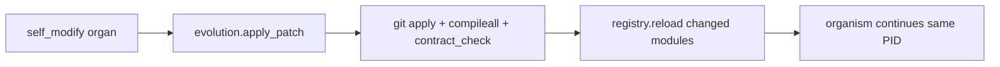
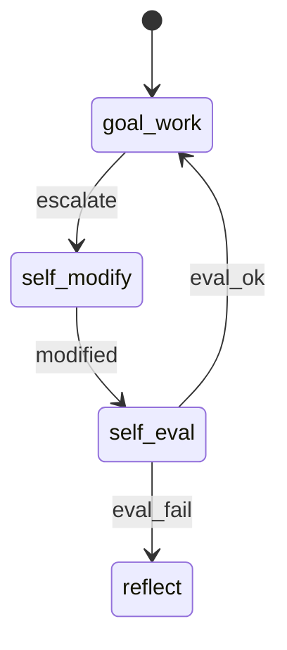
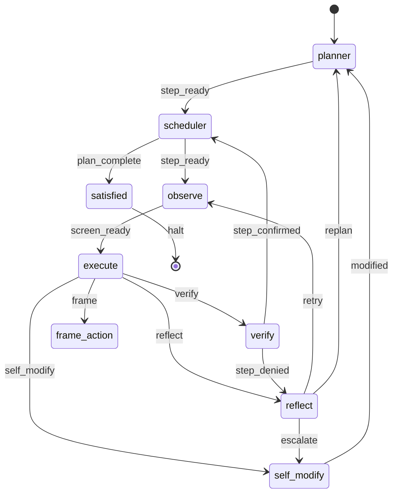
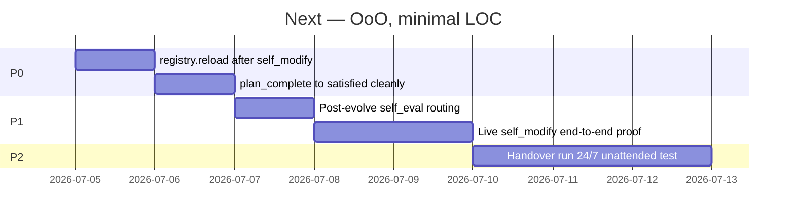

# endgame-ai

## Handover (read first)

**Starting endgame-ai means you hand full control of this PC to a digital operator and walk away.**

You provide a goal. You start the process. You leave. The organism runs 24/7 until the goal is done, it gives up honestly, or you abort via `stop.txt`.

There is **no sandbox**. There are **no task categories off limits** by design. The system may:

- Install software, change settings, use the browser, post on your social accounts
- Run subprocesses, ctypes, git, network I/O via execute
- Rewrite its own firmware (`self_modify`) and hot-reload organs at runtime
- Spawn or design other systems (including via Grok Build) as means to the goal

**Risk:** unconstrained access to your machine, accounts, and data.  
**Greatness:** a living replacement for a human operator — adaptive, self-evolving, atemporal goals, no ceiling on ambition.

Evolution **requires** this freedom. Constraining the body would break the vision.

**Tag:** `survey-loop-complete` · commit `66137db` (survey loop proven)

---

## What it is

Not a chat agent. A **wiring harness**: fixed topology, mechanical + LLM organs, one signal + one patch per tick.

| Layer | Role |
|-------|------|
| Python + ctypes | Body |
| `wiring.json` | Nervous system |
| Grok | Brain peripheral (organs only) |
| Git + runtime reload | Firmware memory + hot-swap |

**OoO rule:** flat root, `LlmNode` / `MechanicalNode`, `NODE_REGISTRY`, fail-hard, **low LOC** — no god-modules, no duplicate metadata, no validation fiction.

---

## Proven today (2026-07-04)

| Proof | Result |
|-------|--------|
| Self-narrating goal | Planner rewrites `goal_narration` from `body_signals` + observation |
| Deep observation | 3k+ char hierarchical `desktop_tree_text` |
| Full survey loop | planner → observe → execute → verify ×2 → **plan_complete** (~51s, 5 brain calls) |
| Unsandboxed body | ctypes `GetWindowTextW` → `Focused window: Task Manager` |
| Bare JSON tolerance | `brain._commit_record` wraps Grok output missing `record_type` |

**Not yet proven live:** runtime organ hot-swap after `self_modify`, post-evolve self-eval ticks, `satisfied` on clean halt.

---

## Your three pillars (aligned)

### 1. Handover, not supervision

The human is **not** the control loop. Handover is explicit: run = consent. README always states risk and potential. The organism owns the session.

### 2. Evolution = git + runtime hot-swap

Public-repo git patches are **half** of firmware evolution. The other half: **reload organs in the running process** after compile + contract pass — the old `importlib` loader existed for this.

**Today:** `registry.py` uses static imports — git apply works, **hot-swap does not** until `registry.reload()` lands (~30 LOC).



### 3. Post-evolve self-eval (light touch)

After firmware change, spend a **few ticks** on a temporary goal chapter: prove the body still works (observe, trivial execute, maybe one brain call). Then resume `goal_seed`. Not a separate validator script — a **phase** the topology can route (`modified` → self-eval → planner). The organism may later drop it; if the vision works, it may evolve that behavior itself.



---

## Architecture (current)

```mermaid
flowchart TB
    subgraph harness [Harness — low LOC]
        O[organism._tick]
        R[registry.NODE_REGISTRY]
        N[node.py OoO bases]
    end
    subgraph organs [10 flat organs]
        direction LR
        P[planner] Ob[observe] E[execute] V[verify] SM[self_modify]
    end
    subgraph body [Body — unconstrained]
        D[desktop] BS[body_signals] W[win32_api]
    end
    BR[brain + xai]
    O --> R --> organs
    organs --> BR
    Ob --> D
    E --> body
    SM --> EV[evolution.py]
    EV -.->|planned| R
```

### Topology



---

## Repo (22 modules, flat root)

```
organism.py registry.py node.py evolution.py brain.py bus.py desktop.py body_signals.py
planner.py scheduler.py observe.py execute.py frame_action.py verify.py reflect.py
self_modify.py satisfied.py error.py stop_check.py contract_check.py comms_poll.py win32_api.py
wiring.json
```

Runtime gitignored: `comms/`, `state.json`, `pids/`, `stop.txt`

---

## Self-narrating goal

| Field | Role |
|-------|------|
| `goal_seed` | User intent — immutable unless evolved |
| `goal_narration` | Living interpretation; planner rewrites each tick |
| `goal_signals` | Power, disk, urgency from `body_signals` |

Environment evolves → narration evolves → intent replans. Atemporal, not a fixed script.

---

## Brain + prompts

Static system prefix (identity + capabilities + handover stance). Dynamic payload **last** in user JSON for KV cache. Execute prompt states **full local power**. Raw audit: `comms/brain_raw.jsonl`.

---

## Agent partner protocol

1. No silent long runs — `[organism]` / `[observe]` / `[brain]` stdout  
2. Poll `comms/` every ~30s — sport commentary to operator  
3. Never commit runtime logs or secrets  
4. Archive results → cleanup → README → tag → **ask permission** for next handover run

---

## Plan (what's next — no legacy phases)



| P | Task | LOC budget | Why |
|---|------|------------|-----|
| **P0** | `registry.reload()` via importlib after evolution | ~30 | Runtime hot-swap — vision requirement |
| **P0** | `plan_complete` → `satisfied` without `max_ticks` | ~10 | Clean handover session end |
| **P1** | `modified` → short self-eval ticks → resume `goal_seed` | ~40 | Post-evolve confidence; may self-prune later |
| **P1** | Live git patch + reload + survey tick | — | Prove full evolution loop |
| **P2** | Unattended multi-hour goal | — | Handover in practice |

**Explicitly not building:** sandbox, task allowlists, pip in core, giant schema walls, separate validation services.

---

## CLI

```bash
python organism.py "your goal" --max-ticks 12 --max-brain-calls 12 --reset
python organism.py --execute-node observe ""
python comms_poll.py 30 12
python contract_check.py
```

`--reset` clears handover session state. `stop.txt` revokes handover.

---

## Validation

```bash
python -m compileall -q .
python contract_check.py
```

---

## License

MIT — see `LICENSE`.