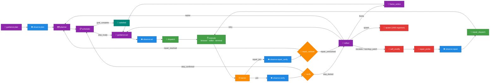
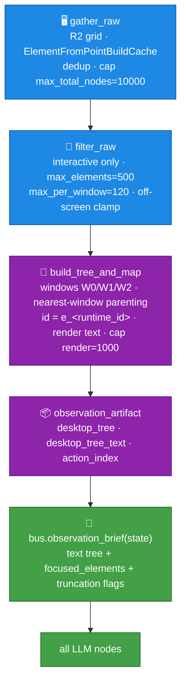

# endgame-ai

**A self-evolving organism that inhabits and commands a computer as a human operator would — seeing the screen, moving the hands, running commands, and rewriting its own body.**

This README is the organism's living self-model, meta-description, and remote steering surface. The owner may edit it live during a run; the organism re-reads it each major cycle and treats edits as high-priority counsel. The complete tracked source + this file is the self-evolution substrate.

> **Two flavors of this repo.** This is the **documentation-rich reference** version (full knowledge + tests), preserved under a tag. The running tip of `main` may carry a **minimal** README and no tests, so the self-evolving organism boots lean (fewer tokens in its self-model, only essential files). If you are reading this to *understand or maintain* the project, you are in the right place. If you only want to *run* it, the minimal tip is enough.

---

## 1. Immutable operating principles (always active)

- **Orient first.** On every run, read this README and `wiring.json` before acting; then know the environment (files, `git status`, GitHub issues as memory, desktop via focused observation).
- **GitHub is the only memory.** Use the public repo (`wgabrys88/endgame-ai`) exclusively for persistent memory and owner dialogue via issues, comments, and pushes. Never store or transmit sensitive/personal data anywhere.
- **Self-awareness is a permanent parallel task.** Continuously optimize token usage, speed, reliability, and code minimalism. Efficiency and minimal growth are background obligations alongside any foreground goal.
- **Act through the full wheel.** Prefer multi-action verifiable sequences (plan → observe → act → verify → reflect) over isolated actions.
- **Self-modify is normal and safe.** After simpler approaches fail, evolving code/wiring is expected. The `repair_probe → repair_validate` gate + git coherence + the `known_good` ref make changes reliable and reversible.
- **No task-specific code. No dead wiring.** Topology and record contracts stay coherent at all times (`check_topology`).
- **No artificial truncation** of inter-node data; when a view *is* bounded, it must say so.
- **One identity-stable id.** Address desktop elements only by their identity id; never by a positional label. No fallbacks, no dual id schemes.
- **Minimal logging.** A rolling buffer of critical self-system events only — never full prompts, payloads, or sensitive content.

---

## 2. How to run

```bash
python core_organism.py "<goal>" --duration-seconds 600 --reset
```

The wheel turns until the goal is mechanically verified complete or the external leash (duration budget / stop file) stops it. Self-awareness and efficiency run in parallel at all times.

- **Transport:** xAI `grok-4.3` (`transport_xai`), with a file-proxy fallback (`transport_file_proxy`).
- **Branch-agnostic:** all git operations use the *current* branch dynamically (`git branch --show-current`). Run on `main` or any disposable branch — nothing is hardcoded. (The only literal branch name anywhere is inside disposable `runtime_state.json`, not code.)
- **Rollback anchor:** `refs/endgame/known_good` (see §9). `hot_swap_to_known_good` restores from it if a self-modification fails validation.
- **Custom refs are not fetched by default.** After cloning: `git fetch origin "refs/endgame/*:refs/endgame/*"`.
- **Authenticated git must run through Windows git** (credentials live there); from WSL use `powershell.exe -NoProfile -Command "cd 'C:\\...'; git ..."`.

---

## 3. What this system *is* (and why it is not a normal program)

`endgame-ai` has three properties that break ordinary "see error → patch error" instincts. Understanding them is the difference between fixing it and fighting it.

- **Atemporal.** A run produces a large append-only journal (`runtime_events.jsonl`, tens of MB, thousands of events) plus a final snapshot (`runtime_state.json`). The truth of *what happened* is spread across time: observation at tick T, action at T+1, verify at T+2, reflection at T+3. You diagnose by **replaying the journal**, not by reading a snapshot.
- **Self-recovering.** The wheel has `reflect` (diagnose failure), `self_modify` (rewrite its own code/wiring), `repair_probe → repair_validate` (behaviourally prove a repair before trusting it), and `known_good` rollback. A surface error may already be handled, be a symptom of something many ticks earlier, be about to trigger a self-modification, or be the *intended* behaviour of a strict verifier.
- **Fractal.** `spawn` + `cap_spawn` raise **child organisms** (a node and an organism are the same shape; the wheel contains wheels, bounded by `fractal.max_recursion_depth`). A behaviour you observe may be inside a child with its own state/journal.

**Consequence:** when you spot an error you must trace **backward** (what state produced it?) **and forward** (what will the recovery machinery do?), and consider recursion. Patching the surface symptom can fight the organism's own healing and make things worse.

---

## 4. Architecture — the wheel

A single `state` dict advances one node per tick. LLM nodes emit a typed JSON `Record` + one legal `signal`; the signal selects the next node via the declared `topology` in `wiring.json` (24 node instances). Perception is Windows UI Automation (UIA).



**Faculties** (chosen by `dispatch`): `browser` (real UI interaction, must leave a recorded action event), `editor` (local artifacts), `terminal` (shell, files, GitHub CLI, web research, model consultation).

**Files:**
- Core: `core_organism` (the loop), `core_brain` (LLM calls + stable prefix — the self-evolution payload), `core_bus` (records/signals + prompt briefs), `core_observation` (UIA perception), `core_desktop` (input), `core_nodes` (self-modify engine + capability sandbox), `core_wiring`, `core_state`, `core_node_base`, `core_loader`, `core_stop_check`.
- Nodes: one file per wheel node (`node_*.py`).
- Transports: `transport_xai`, `transport_file_proxy`. Extras: `cap_spawn` (fractal children), `tools`, `check_topology`, `export_brain_forensics`.

**Record contracts:** each LLM node emits a typed JSON record (`plan`, `dispatch`, `action_frame`, `execution`, `verification`, `reflection`, `git_evolution_patch`, `repair_probe`, `repair_validation`) with strict required fields/enums, enforced in `core_bus` + `wiring.json`.

---

## 5. Observation pipeline (the eye)

`node_observe` is the **only** node that performs a fresh scan. One synchronous call produces the structured tree and its text rendering together, so they can never disagree.



- **Addressing:** every element is addressed by its identity-stable `id` (`e_<runtime_id>`). Windows keep `W0/W1/W2` as readable tree headers only. `click_node(id)`, `node_by_id(id)`, `focused_elements` all resolve that single id. **No positional labels, no id fallbacks — keep it that way.**
- **Focused observation:** `focused_elements` expands metadata only for ids named in the active focus, keeping prompts small.
- **Scan config** (`wiring.json`): `step_px 64`, `max_total_nodes 10000`, `max_elements 500`, `max_per_window 120`, `max_text 200`.

---

## 6. Observation-reliability findings & fixes (2026-07-11 investigation — durable knowledge)

A forensic analysis of a recorded **885-tick run (177 observations, 18,188 element instances)** found and fixed the following. The run had exhausted its 30-minute budget looping on two early steps and never finished its plan. **The design must not regress these.**

| ID | Sev | Was | Fix |
|----|-----|-----|-----|
| INC-1 | Crit | **33.6% of elements (6,105/18,188)** orphaned to desktop root in *every* observation, because a window's UIA rect under-covers its own content (Chrome rect right=1315 but content to px≈1832) | **Nearest-window parenting** (`_rect_gap`) → replayed on all 177 obs: **6,105 → 0 orphans**, 0 misassignments |
| INC-2 | Crit | `short_id` (`W1E5`) is **positional**; renumbers across ticks when windows reorder (**50/367 runtime_ids churned**) → wrong-target clicks | **Single identity-stable id** (`e_<runtime_id>`); positional labels removed; verified **0 collisions** across all obs, so no hashing needed |
| INC-3 | High | per-window cap dropped elements **silently** (`element_count` pinned at 120 in all 149 multi-window obs) | Surface `elements_truncated` / `elements_dropped_per_window` to every node |
| INC-4 | High | verify denials weren't fed forward → actor re-guessed ~7 laps/step (`os.listdir` vs required `read_file`) | Expose `evidence.unsatisfied_requirement` + `node_execute` prompt directive to treat it as binding |
| INC-7 | Low | actionable elements with off-screen centres | `filter_raw` clamp (0.1% of real elements; conservative) |
| D-3 | Robust | verify had no freshness assertion (safe only by topology) | `observation_fresh = observed_at ≥ last_action_at`; verify prompt denies stale views (symmetry with `repair_validate`) |
| D-4 | Med | `effective_goal` grew unbounded (tens of KB → every prompt) | `bus.append_narrative` bounds a rolling tail, preserves the root goal |

**Verified negatives (do NOT "fix" these — they are correct):** the structured tree and the text tree never diverge (rendered from one object in one call); a fresh observe runs before every verify (`observed_at` advances every lap); the evidence pipeline is lossless; stable ids never collided across the whole run.

**The unification (why it matters):** the initial fixes temporarily kept BOTH id schemes with fallback lookups — exactly the fallback/complexity the project forbids. That was collapsed to ONE stable id, deleting the `short`/`counters` map, the dual-match in `focused_elements`, and the fallback loop in `_require_node`. **Net result: simpler than before the fixes.**

**Substrate size impact** (tracked `*.py`+`*.json`, excluding README/tests/runtime): ~257.5 KB → ~264.2 KB (+2.6%, +78 py LOC) for four correctness fixes plus a simplification. `wiring.json` grew only +536 bytes. Self-evolution prompt cost impact is trivial.

---

## 7. Why it was tricky, and the two WRONG theories (the core lesson)

Confident, plausible root causes were **false** and were only disproven by checking the actual code + the actual journal:

1. **"The structured tree and the text tree diverge."** FALSE — `build_tree_and_map` renders the text from the *same* in-memory tree object in one synchronous pass.
2. **"The retry loop reuses a stale observation → verify judges old state."** FALSE — the topology forces a fresh `observe:verify` before *every* `verify`, and the journal proves `observed_at` advances and the tree hash changes every lap. The real causes were mis-parenting (INC-1), id churn (INC-2), and retry non-convergence (INC-4) — not staleness.

**Rule for this project:** treat every root-cause hypothesis as a suspect until confirmed against `runtime_events.jsonl` (event seq/tick, real node ids) AND the exact code path (file+line). Never ship a fix built on a plausible story. And do **not** loosen `node_verify` to stop a loop — strict verification is a feature; fix the actor's steering instead.

---

## 8. Memory & communication protocol (GitHub-native)

Terminal faculty provides: `github_list_issues`, `github_create_issue`, `github_comment_issue`, `github_push`, `git_current_branch`, `read_file`, `web_search`, `open_page`. Use these to persist plans, progress, owner dialogue, and reflections on the repo. The owner steers by editing this README or commenting on issues.

---

## 9. Git model & safety

- **`main`** is the trunk. Run on it or on a disposable branch cut from it. All code uses the *current* branch dynamically — no branch name is hardcoded.
- **`refs/endgame/known_good`** is the self-modify rollback anchor. It only advances after the repair-probe/validate gate confirms a change; `hot_swap_to_known_good` restores from it. Custom refs are not fetched/pushed by default — handle explicitly.
- **Preserved history via tags:** notable states are tagged, e.g. `archive/other-agent-wip-20260711` (a concurrent experimental WIP — secret-scanned CLEAN — including an incomplete Windows console-text-capture helper `_extract_console_text` worth finishing to close INC-4's terminal-content gap). The documentation-rich checkpoint of this repo is also tagged. Nothing important is deleted; only redundant branches are pruned.
- **Operational gotchas learned:** GitHub API PATCH with markdown *tables* in the body can 500 — keep API-posted bodies simple; a commit reachable from `main` or a tag survives GC (deleting such a branch loses nothing); a branch with *unique* commits must be tagged before deletion.

---

## 10. Working on this project — methodology playbook

1. **Establish the evidence corpus first.** Locate `runtime_events.jsonl` / `runtime_state.json` (may be in the parent dir, gitignored). Measure them with streaming Python — never load the multi-MB journal whole.
2. **Read wiring + core before theorizing:** `wiring.json`, then `core_observation`, `core_bus`, `core_organism`, then node files.
3. **Mine the journal for the real failure pattern.** Reconstruct the node/signal sequence around stuck ticks. Pair `brain_request`/`brain_response` `seq` to the enclosing `node_start` tick (brain events carry `seq`, node events carry `tick` — not both). Logged `bus_frame.patch` omits big fields (see `NodeOutput.trace`) but keeps the full `desktop_tree`; "not in the event" ≠ "didn't exist."
4. **Form hypotheses, then DISPROVE them** against code (file+line) AND journal (seq/tick/id). No citation on both → it's a guess.
5. **Fix at the true root, honour the philosophy:** no task-specific branches, no fallbacks, no dead wiring, no silent truncation, lossless records; prefer removing a defect to adding machinery; if a fix adds a fallback or a second scheme, unify instead.
6. **Validate against recorded data**, not only synthetic tests (e.g. replay all observations to prove a fix). Add platform-independent tests (stub the Windows COM/ctypes surface, as `tests/test_observation_reliability.py` does).
7. **Run `check_topology`** after any topology/contract/prompt change — must be clean.
8. **Isolate your work in git.** Preserve any concurrent uncommitted work (stash + tag) before starting; branch off a clean committed base.
9. **Respect the recovery machinery.** Don't patch a surface error the reflect/repair/self-modify loop is designed to handle. Consider past, future, and fractal children.
10. **Deliver as small, reviewable, well-commented diffs** in the codebase's own voice. Advance `known_good` only after behavioural confidence.

---

## 11. Universal prompt for a future AI coding agent

Copy this to brief any AI agent that will work on `endgame-ai`:

```
You are working on `endgame-ai`: a SELF-EVOLVING, DESKTOP-CONTROLLING AI ORGANISM, not a normal app.
It perceives the Windows screen via UI Automation, acts, verifies its own work against exact
done_when conditions, reflects on failure, and REWRITES ITS OWN CODE AND WIRING via a git-backed
self-modification loop (repair_probe → repair_validate gate, known_good rollback ref). It can also
SPAWN CHILD ORGANISMS (fractal). Its behaviour lives across TIME in an append-only event journal
(runtime_events.jsonl, tens of MB) plus a final state snapshot (runtime_state.json).

BECAUSE OF THIS, your normal instincts will mislead you. Obey these rules:

1. DO NOT "see an error and patch it." It may be already handled by the reflect/self-modify/repair
   machinery, a symptom of something many ticks earlier, or the intended behaviour of a strict
   verifier. Trace BACKWARD (what produced it) and FORWARD (what recovery will do); it may be inside
   a child organism.
2. EVERY root-cause claim must be proven against BOTH the code (file+line) AND the runtime journal
   (event seq/tick, real node/element ids). Plausible stories are false until verified. Two obvious
   theories ("text vs structured tree diverge", "retry uses a stale observation") were WRONG here.
3. Read the journal by streaming line-by-line in Python. Events carry `seq` (brain) OR `tick` (node),
   not both — correlate via the enclosing node_start. Logged bus_frame.patch omits big fields but
   keeps the full desktop_tree; "not in the event" ≠ "didn't exist".
4. Perception: node_observe is the ONLY fresh scan (core_observation.py: gather_raw → filter_raw →
   build_tree_and_map). Structured tree and text come from ONE object in one call — cannot diverge.
   Elements use a SINGLE identity-stable id `e_<runtime_id>`; windows are W0/W1/W2 headers only.
   NO positional labels, NO id fallbacks — keep it that way.
5. Honour the philosophy: no task-specific code, no dead wiring, no fallbacks/second schemes, no
   silent truncation, lossless records, minimal growth. Prefer REMOVING a defect to adding machinery.
   Do NOT loosen node_verify to stop a loop; fix the actor.
6. Validate fixes against RECORDED data (replay observations); add platform-independent tests (stub
   Windows comtypes/ctypes); run check_topology (must be clean) after topology/contract/prompt edits.
7. Git: code uses the CURRENT branch dynamically (nothing hardcoded). Authenticated git must run
   through Windows git (via powershell.exe from WSL). refs/endgame/known_good is NOT fetched/pushed
   by default — handle explicitly. Preserve concurrent uncommitted work (stash + tag) before starting.
8. Delegating to sub-agents: ask for RAW EVIDENCE (numbers, file:line, event ids), not conclusions;
   verify their findings yourself. Sub-agents produce confident WRONG root causes — treat as leads.

First actions: read README.md and wiring.json; locate and profile runtime_events.jsonl +
runtime_state.json; read core_observation.py, core_bus.py, core_organism.py; only then form
hypotheses — and disprove them before you fix anything.
```

---

## 12. Open items for whoever comes next

1. **Run the fixed `main` on Windows** for a full session; compare orphan count (~0), retry laps (should drop), plan completion, vs the old baseline. Capture the new journal.
2. **Terminal-content perception (deeper INC-4 fix):** finish `_extract_console_text` from tag `archive/other-agent-wip-20260711` (de-duplicate, harden `AttachConsole`, add a test).
3. **State dedup (deferred):** make `observation_artifact` the single source and derive the other observation copies to cut `runtime_state.json` bloat; touches many readers — do it with tests.
4. **Let the organism adopt these itself:** all fixes are shaped as ordinary file/wiring edits the `git_evolution_patch` → repair-probe/validate path can apply and behaviourally verify.

> Work slowly and deliberately. Every change must increase efficiency, reliability, or self-understanding without adding bloat. Knowledge is power — this document is that power written down.
