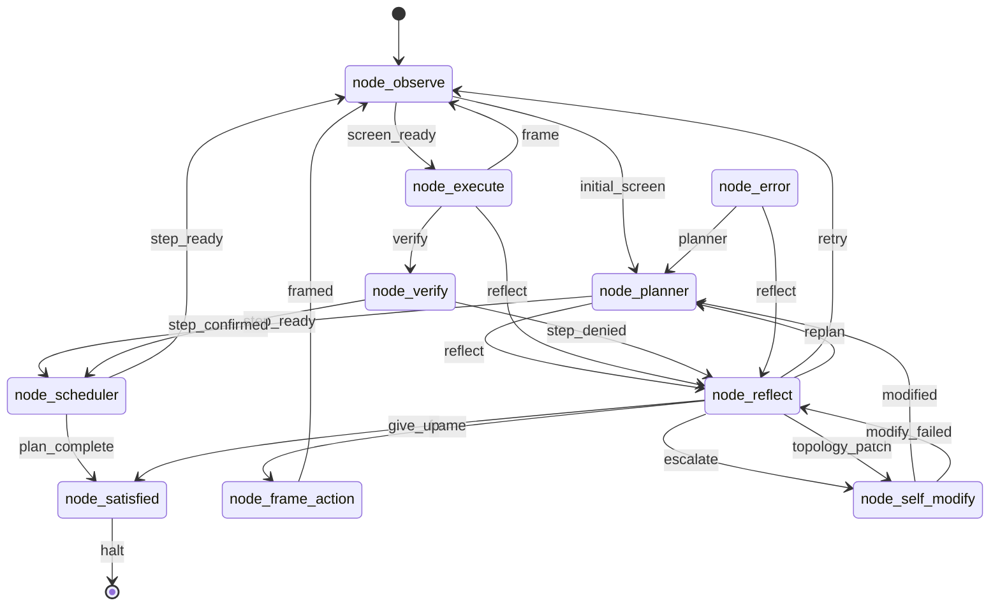

# endgame-ai

`endgame-ai` is a local Windows desktop organism. The tracked repository is part of the prompt surface used during self-evolution, so this branch is reducing recurring model cost by deleting duplicate contracts and making `wiring.json` the compact source of truth.

## Current Branch Work

Branch: `token-reduction`

Completed so far:

- Deleted tracked non-runtime utilities: `analyze_graph.py`, `check_events.py`, and `export_brain_forensics.py`.
- Rewrote `wiring.json` from scratch, then minified it. It now contains strict topology, observe config, self-modify config, compact prompts, and only the selected `transport_xai` config.
- Added strict wiring validation in `core_wiring.load_wiring`.
- Removed the `runtime_self_evolution_enabled.json` gate. Self-modify is now always governed by topology, git apply/commit, and known-good hot-swap mechanics.
- Removed execute-side firmware/git mutation preflight. `node_execute` still routes only `verify`, `frame`, or `reflect`, but emitted Python runs through raw `exec(code, ns)` with local process permissions.
- Replaced the dataclass-heavy UIA observation pipeline with a compact dict-based RAW/FILTER/MAP implementation that preserves R2 probing, focused `scan.area`, short IDs, `action_index`, and `desktop_tree_text`.
- Removed node datasheets and duplicate state summary code; topology and prompts now live in `wiring.json`.
- Compacted `core_nodes.py`, `core_brain.py`, and node wrappers while preserving dynamic node loading, dynamic transport loading, effective-goal propagation, git-backed evolution, and the execute capability namespace.

## Runtime Contract

- `core_organism.py` runs the loop, writes state, handles stop/deadline control, routes topology signals, and applies `git_evolution_patch` output from `node_self_modify`.
- `core_node_base.py` imports `node_*.py` organs by name from `wiring.json`.
- `core_brain.py` imports the selected `transport_*.py` module by name from `wiring.json`.
- `node_observe.py` scans the Windows desktop through UIA.
- `node_execute.py` asks the brain for Python, then executes it in-process with helpers from `core_nodes.build_capability_runtime`.
- `node_reflect.py` routes task failures to retry/frame/replan and sends organism contract/topology changes to `node_self_modify`.
- `node_self_modify.py` asks for a `git_evolution_patch`; `core_nodes.apply_evolution_patch` writes/deletes files, patches wiring, runs commands, commits, updates the configured known-good ref, and hot-swaps on apply failure.

## Topology



## Remaining Work

- Finish the last validation and commit for chunk 3.
- Re-measure against the original baseline: `6073` lines / `291877` chars; 50% line target is `3036`.
- Continue char/token reduction after LOC target by shortening `core_observation.py`, `core_nodes.py`, `core_bus.py`, and prompt-facing capability text.
- Verify with compileall, strict wiring load, and local Windows Python import checks because the bundled Codex Python lacks `comtypes`.

## Run

```powershell
python core_organism.py "goal" --reset --duration-seconds 300
python core_organism.py "continue goal" --duration-seconds 300
```
