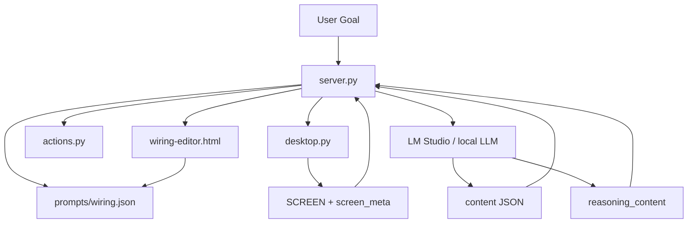
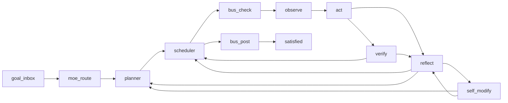

# endgame-ai

Endgame-ai is a local Windows desktop agent organism. It observes the desktop, reasons through a wired ROD loop, executes UI actions, verifies outcomes, reflects on failures, and can mutate its own `prompts/wiring.json` when stuck.

This file is the handover source of truth for any coding AI that continues the project. Read it before editing code.

Last updated: 2026-06-22.

## Vision

Build a self-improving local desktop organism:

- Python is the mechanical body.
- `prompts/wiring.json` is the mutable brain.
- The local LLM supplies semantic judgment.
- The workbench shows and edits the organism live.
- Failures become evidence for self-rewiring.

The system should eventually run long autonomous goals, notice repeated failure modes, patch its own wiring, hot-reload the change, and continue without a human writing task-specific code.

The central rule:

```text
Do not make Python smarter about tasks. Make Python better at exposing facts and applying validated wiring mutations.
```

## Current Implementation Status

Implemented and verified:

- SCREEN prompt truncation removed.
- `SCREEN_TRUNCATED_FOR_PROMPT` removed from generated SCREEN.
- Retired truncation config removed from runtime/schema:
  - `prompt_screen_max_chars`
  - `node_value_max_chars`
  - `render_value_max_chars`
  - `tree_value_max_chars`
  - `render_tree_value_max_chars`
- Observe filters added:
  - `scope_depth`
  - `element_text_max`
  - `render_focused_first`
- Focused page content renders before focused chrome, overlays, and background.
- Workbench has live filter controls and SSE-driven refresh.
- SIGINT/SIGTERM saves current state.
- `parse_fallback` removed; content JSON is the contract.
- Python hard-coded site names were removed.
- Self-modify now uses a validated patch engine.
- Concrete node prompt config is supported, so evolved nodes of the same handler type can have distinct prompts.
- README now documents the handover and continuation plan.

Committed work:

```text
806a753 Enable self-rewiring observation filters
40ab6eb Preserve node config in direct node runs
```

Still not complete:

- No live LLM self-modification escalation cycle has been exercised after the patch-engine upgrade.
- No full autonomous end-to-end goal has been completed after these changes.
- Python still contains behavioral guard helpers that should shrink over time.
- There is no formal automated test suite.
- Desktop tree output can still be noisy under broad filters.

## How To Run

Use this Python runtime if `python` is not on PATH:

```powershell
C:\Users\px-wjt\AppData\Local\Python\bin\python.exe
```

Start the workbench server:

```powershell
& "C:\Users\px-wjt\AppData\Local\Python\bin\python.exe" "C:\Users\px-wjt\Downloads\endgame-ai\server.py"
```

Hidden background start:

```powershell
$py = 'C:\Users\px-wjt\AppData\Local\Python\bin\python.exe'
$script = 'C:\Users\px-wjt\Downloads\endgame-ai\server.py'
Start-Process -FilePath $py -ArgumentList @($script) -WorkingDirectory 'C:\Users\px-wjt\Downloads\endgame-ai' -WindowStyle Hidden
```

Workbench URL:

```text
http://127.0.0.1:9078/
```

Health check:

```powershell
Invoke-WebRequest -UseBasicParsing -Uri 'http://127.0.0.1:9078/health'
```

Stop the server on port 9078:

```powershell
$owners = Get-NetTCPConnection -LocalPort 9078 -State Listen -ErrorAction SilentlyContinue | Select-Object -ExpandProperty OwningProcess -Unique
foreach ($ownerPid in $owners) { Stop-Process -Id $ownerPid -Force -ErrorAction SilentlyContinue }
```

Important: start `server.py` by absolute path. A prior restart using only `server.py` served stale wiring from another process context.

## Architecture



Core files:

| File | Purpose |
| --- | --- |
| `server.py` | HTTP API, ROD graph runner, node handlers, prompt assembly, self-modify patch engine |
| `desktop.py` | Win32/UIA observation, hover probe, desktop tree, SCREEN rendering |
| `actions.py` | Mechanical verb execution |
| `colony.py` | Future multi-instance bus support |
| `wiring-editor.html` | Workbench UI, graph editor, live SCREEN/state panels |
| `prompts/wiring.json` | Mutable topology, prompts, guards, limits, observe config |
| `prompts/wiring-schema.json` | Wiring validation schema |
| `prompts/model.json` | LM Studio connection |

## ROD Loop



Circuit roles:

| Node | LLM | SCREEN | Responsibility |
| --- | --- | --- | --- |
| `planner` | yes | no | Convert goal into ordered subtasks |
| `observe` | no | captures | Build SCREEN and metadata |
| `act` | yes | yes | Emit mechanical action chain |
| `verify` | yes | no | Confirm or deny from outcomes/memory |
| `reflect` | yes | no | Diagnose failure and retry/replan/escalate |
| `self_modify` | yes | no | Emit one validated `wiring_patch` |

## Observation Pipeline

Current path:

```text
desktop.py Desktop.observe()
  -> _probe()
  -> _classify()
  -> _render()
  -> Observation(context_text, snapshot)

actions.py observe_screen()
  -> Desktop.observe()

server.py node_observe()
  -> state["screen"]
  -> state["screen_meta"]

server.py _resolve_value()
  -> passes state["screen"] to act prompt without prompt truncation
```

Current action-scope order:

1. focused page content
2. focused chrome
3. overlays
4. background context

Current observe config:

```json
{
  "scope_depth": 4,
  "element_text_max": 500,
  "render_focused_first": true,
  "desktop_tree_max_depth": 8,
  "desktop_tree_max_nodes": 900
}
```

`scope_depth` buckets:

| Value | Includes |
| ---: | --- |
| 1 | focused page |
| 2 | focused page + focused chrome |
| 3 | focused page + focused chrome + overlays |
| 4 | focused page + focused chrome + overlays + background |

The model should see useful page content before toolbars, taskbar, or unrelated windows.

## Self-Rewiring

The self-rewiring path is now a real patch engine:

```text
self_modify LLM
  -> emits {"record_type":"wiring_patch","data":{"op":"...","payload":{...}}}
  -> server.apply_wiring_patch()
  -> validate_wiring()
  -> write prompts/wiring.json
  -> configure_runtime(WIRING)
  -> SSE wiring_modified
  -> graph continues
```

Supported patch ops:

```text
add_node
update_node
remove_node
add_edge
remove_edge
set_guard
set_limit
set_observe
set_prompt_base
set_role
append_role_rule
set_reasoning
```

Concrete node prompt support matters:

- Before: `call_node("act")` always used the first topology node of type `act`.
- Now: handlers receive the concrete node config and use that node's prompt.
- Result: self-modify can add another `act` or `verify` node with different prompt inputs/role behavior and the runtime can actually use it.

Backups:

- `prompts/wiring.backup.json`
- `prompts/wiring.backup.YYYYMMDD-HHMMSS.json`

These are written before a self-modify mutation.

## HTTP API

```text
GET  /                  workbench
GET  /health            server status, capabilities, self_modify_ops
GET  /wiring            current wiring
GET  /wiring-schema     schema
GET  /state             saved state
GET  /bus               bus messages
GET  /events            SSE stream
POST /step              execute one graph node
POST /run               enqueue autonomous run
POST /resume            resume saved state
POST /pause             pause run
POST /state             overwrite state
POST /wiring            validate and hot-reload wiring
POST /node/{type}       execute one handler directly
POST /bus/post          append bus message
POST /interrupt         inject goal
POST /push              send SSE push
```

## Workbench

`wiring-editor.html` is a no-build single-file UI.

Current features:

- goal entry
- new session
- observe
- single step
- continue loop
- pause
- load/save state
- hot-save wiring
- graph editor
- live SCREEN panes
- filter sliders:
  - `scope_depth`
  - `element_text_max`
  - `desktop_tree_max_depth`
- focused-first checkbox
- state, plan, history, reasoning, JSON, schema, log tabs
- SSE event log and state refresh

Next workbench improvements:

- Prompt Input Preview panel for every circuit.
- Clear indicator for SSE connected/stale.
- State diff per cycle.
- Self-modify patch history panel.
- One-click "force self_modify on current state" debug button.

## Verification Already Performed

Static checks:

```powershell
& "C:\Users\px-wjt\AppData\Local\Python\bin\python.exe" -m compileall -q .
```

```powershell
& "C:\Users\px-wjt\AppData\Local\Python\bin\python.exe" -c "import json; json.load(open('prompts/wiring.json', encoding='utf-8')); json.load(open('prompts/wiring-schema.json', encoding='utf-8')); print('json ok')"
```

```powershell
git diff --check
```

Runtime checks:

- `/health` returns OK.
- `/health` exposes `self_modify_ops`.
- `/wiring` shows updated self_modify prompt.
- `/wiring` has `moe.delegate_keywords = ["chrome", "browser"]`.
- `/node/observe` generated a `FILTERS:` line.
- Standalone `SCREEN_TRUNCATED_FOR_PROMPT:` generated lines: 0.
- Workbench loaded with no console errors.

Patch-engine checks:

- In-memory `set_observe` patch validated.
- In-memory `append_role_rule` patch validated.
- Synthetic concrete `act` node prompt resolution validated.
- `/node/{type}` now preserves topology node config when invoking handlers.

## Current Git State Expected

At this handover point, recent work should include these commits:

```text
806a753 Enable self-rewiring observation filters
40ab6eb Preserve node config in direct node runs
```

The README update itself should be committed separately after this rewrite.

## Immediate Next Goals

Goal 1: exercise a live self-modify cycle.

Use a controlled state that makes self_modify choose a harmless wiring patch, such as increasing `element_text_max` or appending a durable role rule. Confirm:

- LLM emits `record_type: wiring_patch`.
- `apply_wiring_patch()` applies it.
- `prompts/wiring.json` changes.
- backup file is created.
- `/wiring` reflects the change.
- graph continues through `modified`.

Goal 2: run a full autonomous desktop goal.

Start simple:

```text
open notepad and write hello from endgame
```

Then browser:

```text
open browser, go to example.com, remember the visible headline
```

Acceptance criteria:

- planner creates a short correct plan.
- observe puts relevant focused content first.
- act picks visible IDs or deterministic hotkeys.
- verify confirms real outcomes.
- no truncation marker appears.
- workbench updates live.

Goal 3: reduce Python behavioral intelligence.

Targets in `server.py`:

- browser/navigation guard helpers
- playback-specific verification shortcuts
- chat-specific preflight logic
- repeated precursor handling that could live in prompts/guards

Do not remove capability blindly. Replace Python policy with wiring prompt or guard behavior and verify.

Goal 4: add tests.

Suggested test file:

```text
tests/test_wiring_runtime.py
```

Initial tests:

- current wiring validates.
- retired truncation keys absent from code/schema.
- `_resolve_value(state, "state.screen")` returns full string.
- `apply_wiring_patch()` handles every supported op on a copy.
- concrete node prompt config overrides same-type default behavior.
- `_render()` orders focused Document before toolbar Button using synthetic nodes.

## Non-Negotiable Constraints

- Do not reintroduce SCREEN prompt truncation.
- Do not reintroduce `parse_fallback`.
- Do not add site-specific Python branches.
- Do not hide errors with `except/pass`.
- Do not make Python infer task semantics.
- Do not add confirmation loops for normal autonomous operation.
- Use wiring prompts/guards for semantic behavior.
- Validate and hot-reload wiring after mutations.
- Commit regularly.

## Methodology For Future Coding Agents

Before editing:

1. Run `git status --short`.
2. Read this README.
3. Inspect the exact code path you will touch.
4. Search with `rg` before assuming.
5. Make one coherent patch batch.
6. Run compile and JSON checks.
7. Restart server with absolute `server.py` path.
8. Verify with HTTP endpoints.
9. Commit the batch.

Commands:

```powershell
git status --short
rg -n "SCREEN_TRUNCATED_FOR_PROMPT|prompt_screen_max_chars|parse_fallback|grok|youtube" server.py desktop.py actions.py prompts\wiring-schema.json
& "C:\Users\px-wjt\AppData\Local\Python\bin\python.exe" -m compileall -q .
& "C:\Users\px-wjt\AppData\Local\Python\bin\python.exe" -c "import json; json.load(open('prompts/wiring.json', encoding='utf-8')); json.load(open('prompts/wiring-schema.json', encoding='utf-8')); print('json ok')"
git diff --check
```

Restart server:

```powershell
$owners = Get-NetTCPConnection -LocalPort 9078 -State Listen -ErrorAction SilentlyContinue | Select-Object -ExpandProperty OwningProcess -Unique
foreach ($ownerPid in $owners) { Stop-Process -Id $ownerPid -Force -ErrorAction SilentlyContinue }
$py = 'C:\Users\px-wjt\AppData\Local\Python\bin\python.exe'
$script = 'C:\Users\px-wjt\Downloads\endgame-ai\server.py'
Start-Process -FilePath $py -ArgumentList @($script) -WorkingDirectory 'C:\Users\px-wjt\Downloads\endgame-ai' -WindowStyle Hidden
```

Verify:

```powershell
Invoke-WebRequest -UseBasicParsing -Uri 'http://127.0.0.1:9078/health' | Select-Object -ExpandProperty Content
Invoke-WebRequest -UseBasicParsing -Uri 'http://127.0.0.1:9078/wiring' | Select-Object -ExpandProperty Content
```

## Handover Meta Prompt

Copy this prompt into any AI coding software that takes over the project:

```text
You are continuing endgame-ai in C:\Users\px-wjt\Downloads\endgame-ai.

Read README.md first. It is the source of truth.

Vision:
Build a local Windows desktop organism that observes, acts, verifies, reflects, and rewires its own prompts/topology/guards/filters through validated wiring patches. Python is mechanical infrastructure. The mutable brain is prompts/wiring.json. The local LLM provides semantic judgment.

Current state:
- SCREEN prompt truncation has been removed.
- Focused page content renders before chrome/overlays/background.
- Observe filters exist: scope_depth, element_text_max, render_focused_first.
- Workbench has live filter controls and SSE refresh.
- parse_fallback is removed.
- SIGINT/SIGTERM state saving exists.
- Python site-specific names were removed.
- self_modify now uses apply_wiring_patch() with validated ops:
  add_node, update_node, remove_node, add_edge, remove_edge, set_guard, set_limit, set_observe, set_prompt_base, set_role, append_role_rule, set_reasoning.
- Concrete node prompt config is supported, so evolved nodes can have distinct prompts even if they share a handler type.
- Recent commits:
  806a753 Enable self-rewiring observation filters
  40ab6eb Preserve node config in direct node runs

Rules:
- Do not reintroduce prompt_screen_max_chars or SCREEN_TRUNCATED_FOR_PROMPT.
- Do not reintroduce parse_fallback.
- Do not add task/site-specific Python branches.
- Do not hide errors with except/pass.
- Keep Python dumb and mechanical.
- Put semantic fixes in wiring prompts or guards.
- Validate wiring after every mutation.
- Restart the server using the absolute server.py path.
- Commit regularly after each coherent batch.

First actions:
1. Run git status --short.
2. Run compileall and JSON checks from README.
3. Restart server with absolute server.py path.
4. Confirm /health exposes self_modify_ops.
5. Confirm /wiring has the updated self_modify prompt.

Main next task:
Exercise a live self_modify cycle using a controlled state. Confirm the LLM emits wiring_patch, the patch engine applies it, wiring.json changes, backup is created, hot reload works, and graph continues through modified.

Then run a simple end-to-end autonomous goal:
open notepad and write hello from endgame

When something fails:
- If the model lacked data, fix observation/rendering/filters.
- If the model had wrong policy, patch prompts/wiring.json.
- If mechanics failed, patch Python mechanically.
- Do not add one-off site/app hacks.

Deliverable for your session:
One verified capability improvement and a commit. Update README.md with what changed and what remains.
```

## Final Reminder

The system becomes evolutionary only when failures are converted into durable wiring mutations.

Do not optimize for a single demo. Optimize for the loop:

```text
observe failure -> reason about cause -> patch wiring -> validate -> hot reload -> continue
```
