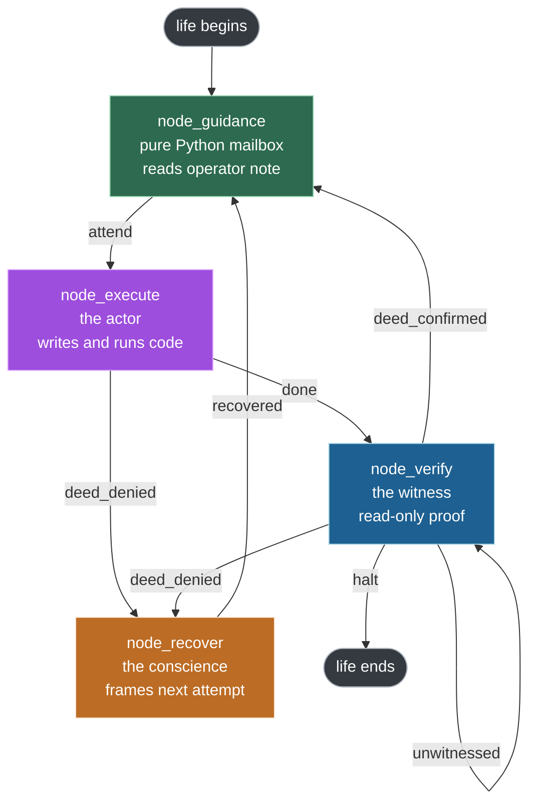
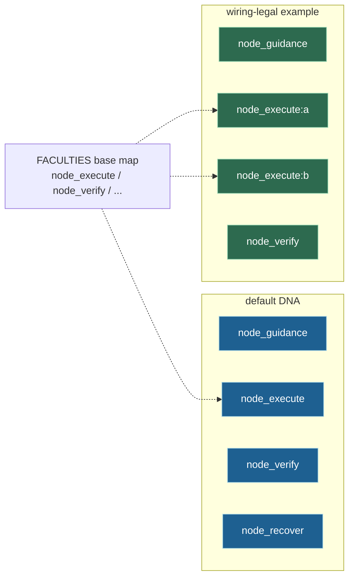
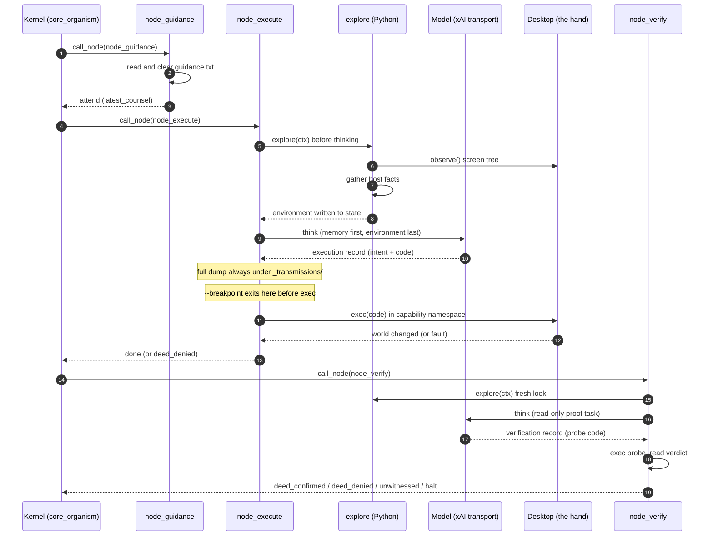
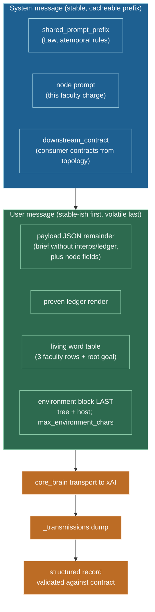
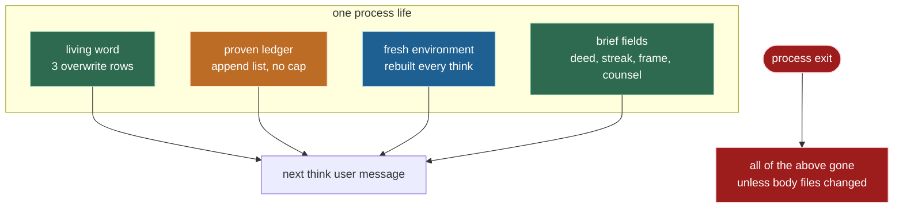
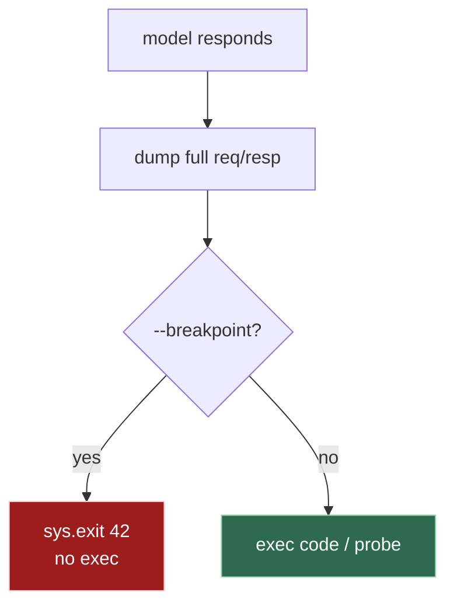
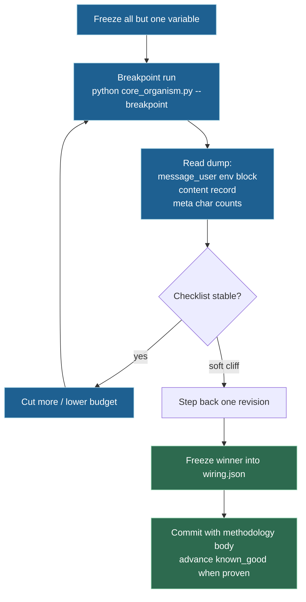
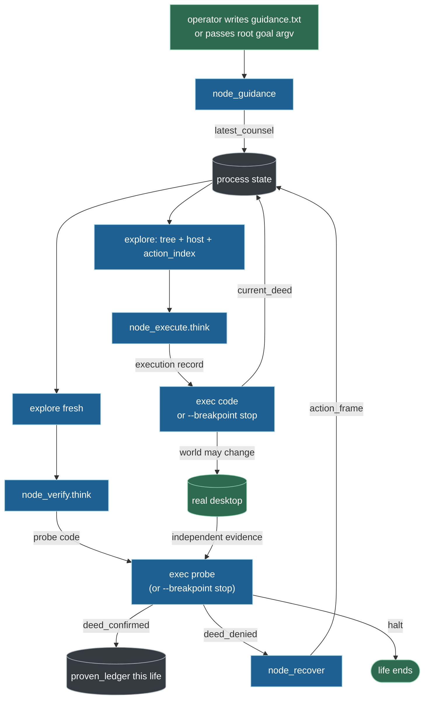
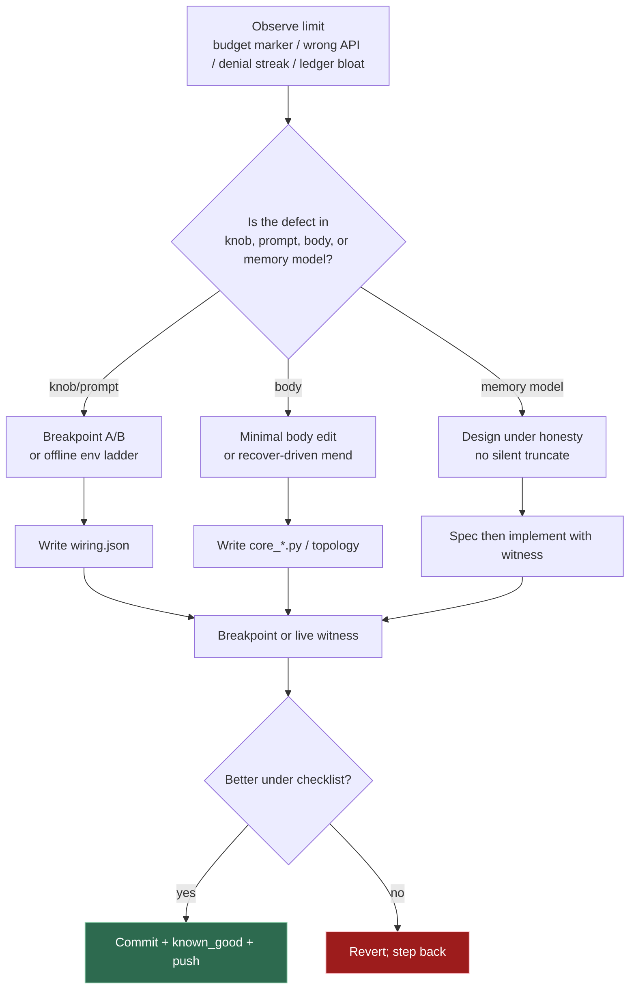

# endgame-ai

A pure **atemporal**, **task-agnostic**, **self-modifying** LLM organism that drives a real
**Windows 11** desktop the way a human operator would: it looks at the screen, moves the mouse and
keyboard, runs commands, and may rewrite its own body while it runs.

This document is the **north star** of the project. It is written to be as true in a hundred days as
it is today. It carries lasting architecture, laws, methodology, and reasoning, **not** volatile
session state (no commit hashes, no "current phase," no one-off goal text). The live code on disk is
always the final authority. Read this file **and** the code; where they disagree, **the code wins**.
This file explains *how* and *why*; the code is *what is*. When a claim here cannot be derived from
disk, it is a defect in this file and must be corrected, never papered over.

Any human, any AI session, or the organism itself that reads this document should leave knowing:
what the system is, what it must never become, how a life turns, what memory actually is (and is
not), how prompts and knobs are tuned under breakpoint, what to do and what not to do, and how
self-evolution is allowed without cages, fallbacks, or secret state.

---

## Table of contents

- [The one-paragraph version](#the-one-paragraph-version)
- [Three ways to read this](#three-ways-to-read-this)
  - [For anyone (the plain-language version)](#for-anyone-the-plain-language-version)
  - [For a CEO (the value version)](#for-a-ceo-the-value-version)
  - [For an engineer (the technical version)](#for-an-engineer-the-technical-version)
- [Why this is not a normal agent](#why-this-is-not-a-normal-agent)
- [The seven non-negotiable rules](#the-seven-non-negotiable-rules)
- [System topology](#system-topology)
- [Fractal topology (colon instances)](#fractal-topology-colon-instances)
- [The life of one turn](#the-life-of-one-turn)
- [The four nodes](#the-four-nodes)
- [The Law of Separated Powers](#the-law-of-separated-powers)
- [Perception: one rule, window first](#perception-one-rule-window-first)
- [How the prompt is assembled](#how-the-prompt-is-assembled)
- [Prompt register and distillation](#prompt-register-and-distillation)
- [Memory: living word, proven ledger, and what is not stored](#memory-living-word-proven-ledger-and-what-is-not-stored)
- [The record contracts](#the-record-contracts)
- [The desktop body and capability namespaces](#the-desktop-body-and-capability-namespaces)
- [The wiring document](#the-wiring-document)
- [Guidance mailbox (text or JSON seed)](#guidance-mailbox-text-or-json-seed)
- [Transmission dumps and CLI interjections](#transmission-dumps-and-cli-interjections)
- [Tuning methodology (prompts, knobs, cache)](#tuning-methodology-prompts-knobs-cache)
- [File-by-file map](#file-by-file-map)
- [Data flow reference](#data-flow-reference)
- [Running it](#running-it)
- [Verifying it (offline gates)](#verifying-it-offline-gates)
- [Design laws that never change](#design-laws-that-never-change)
- [Working methodology (operators and AI sessions)](#working-methodology-operators-and-ai-sessions)
- [Idea reservoir](#idea-reservoir)
- [Appendix A: the deed-becomes-a-node idea](#appendix-a-the-deed-becomes-a-node-idea)
- [Appendix B: self-tuning and self-evolution](#appendix-b-self-tuning-and-self-evolution)
- [Glossary](#glossary)

---

## The one-paragraph version

Most software runs a task and stops. endgame-ai does not run a task at all. It runs a **wheel**. A
wheel of four wired steps turns continuously: read any human note, act on the screen, prove the act
with independent evidence, and recover when an act fails. A single plain-language **root goal** is
handed in from outside, and the wheel turns until that goal is **independently proven** done. Between
steps the organism keeps only small **process-local** state: a three-row rewritable lesson table (the
**living word**), an in-process list of witnessed facts for this life (the **proven ledger**), and a
few brief fields (current deed, failure streak, action frame). It has no conversation history product
and no on-disk memory of past lives. It never trusts its own claim that something worked. Something is
only true when a separate part of the system (one that could not have faked it) proves it by looking
at the world (the **witness** writing the **proven ledger** for this life only). Everything the
organism *is* lives chiefly in one editable document (`wiring.json`) plus a handful of hot-swappable
Python body files, and the organism is allowed to rewrite that body, including the rules that define
itself.

---

## Three ways to read this

The same system, explained for three readers. Pick one, or read all three.

### For anyone (the plain-language version)

Imagine a very careful worker sitting at a Windows computer. You give one sentence: install this
program, draft that email, play a move in a chat chess game, inventory what is on the screen. The
worker does not have a fixed script. It repeats a simple honest loop:

1. Check if there is a new note from you.
2. Look at the whole screen and understand what is there.
3. Do **one** small deed: click, type, paste, run a command, write a file, or even rewrite a piece of
   its own body.
4. Independently check whether that deed actually happened, using a different method than the one
   used to do it.
5. If it worked, keep only the lesson and move on. If it did not, name the true defect and try a
   **genuinely different** kind of approach.

The unusual part is honesty. The worker is not allowed to say "done" and be believed. A separate
inspector must confirm by looking at the real world, the same way you would not accept "I mailed
the letter" as proof that a letter arrived. The worker also forgets almost everything on purpose.
Between steps it keeps only a tiny handwritten note (three lesson slots, overwritten as faculties
speak) plus a list of things that were already proven *this sitting*. That is not a weakness: it
cannot fool itself with old chat logs, because it has none. It must re-look at the real screen every
time.

Last surprising part: the worker may rewrite its own instructions. If a tool is badly named or
broken, it can open its own rulebook, fix it, and keep going.

### For a CEO (the value version)

Traditional automation is brittle because it is scripted. It works until a button moves, a dialog
appears, or a website changes; then it fails silently or, worse, reports success it did not
achieve. The two expensive failure modes in automation are the same two failure modes in
delegation: work that does not happen, and **false claims that it did**.

endgame-ai removes the second failure mode **structurally**, not by hoping the model is honest.
Every claimed result is checked by an independent part of the system that has **no ability** to
produce the result it is checking. Separation of duties: the person who moves money cannot be the
person who signs off that it moved. A confident false "task complete" cannot enter the proven
record of this life. Only independently witnessed facts count as done for the wheel.

The system is **task-agnostic**. Nothing about any specific job is baked into it. You do not build a
new bot per workflow. You hand it a sentence; the same general machinery pursues it. It drives the
real desktop through the same interface a human uses, so it is not limited to systems that happen
to offer an API.

Properties that matter for a decision maker:

- Honesty is enforced by architecture, not by hope.
- It is general: one system, any goal expressible in a sentence.
- It is transparent: almost the whole definition lives in one human-readable JSON document.
- It can improve itself: when it hits a limit in its tooling, it may repair that tooling.
- It has no hidden long-term *product* memory: stopping a life loses process state; only body files
  (`wiring.json`, Python) persist across lives if they were edited.

Honest limitation: it is deliberately careful and step-by-step. It re-checks the world constantly.
It favors correctness and provability over raw speed. That is a feature when a false "done" is
expensive, and a trade-off when only speed matters.

### For an engineer (the technical version)

endgame-ai is a small kernel that turns a **directed graph of nodes**. The graph, the prompts, the
model settings, the exploration knobs, and the validation contracts live in one JSON file,
`wiring.json`, the single configuration source of truth. The kernel loads that file, validates
structure and coherence, then walks the graph: each node returns a **signal**, and the signal
selects the next node through the edge table.

There are four nodes, implemented as classes in `core_nodes.py` (not four separate node scripts):

| Node | Kind | Role |
| --- | --- | --- |
| `node_guidance` | pure Python | Mailbox: read and clear operator counsel |
| `node_execute` | one model call | Actor: author and **exec** world-changing Python |
| `node_verify` | one model call | Witness: author and **exec** read-only proof probe |
| `node_recover` | one model call | Conscience: frame a different next strike after denial |

Before every thinking faculty's model call, Python **explores**: window-first UI tree + host facts.
There is no separate perception node and no "ask to look" tool. Looking is intrinsic to thinking.

The model is never trusted about outcomes. The actor produces code that changes the world and may
only **claim** intent. The verifier produces read-only code that must prove an effect from a system
**other** than the actor. Only the verifier may append the proven ledger. That is the **Law of
Separated Powers**, enforced in capability namespaces, not merely requested in prose.

State between turns is deliberately minimal (**atemporal**): no conversation history API. What
crosses the gap inside one process life is a small structured brief, three living-word rows, the
proven ledger list, and a few operational fields. Short UI ids die with each look. Fresh environment
always beats remembered belief. Process death clears state unless body files were rewritten.

Everything is **fail-hard**. No fallbacks, no defensive branches for unwired features, no silent
swallowing. A broken body ends the life with a raised exception. Design ethos is **subtraction**.

---

## Why this is not a normal agent

| Typical agent | endgame-ai |
| --- | --- |
| Growing conversation history or vector memory store | Atemporal process state: living word (3 overwrite rows) + ledger (in-life list) only |
| Trusts model self-report ("I completed the task") | Witness proves by independent effect |
| Tool menu the model selects from | The only tool is **code**. Actor writes and runs Python |
| Perception is a tool the model chooses | Perception is automatic before every think |
| Task logic coded into the agent | Task-agnostic. Goal is one sentence per life |
| Fixed framework; model works within it | Self-modifying. May rewrite nodes and wiring |
| Retries the same action on failure | Recovery must change the **kind** of approach |
| Guardrails, step caps, cages | No internal cap the organism cannot rewrite |
| Config scattered | One JSON body (`wiring.json`) plus small Python kernel |
| Silent truncation of context | Ranked env budget with **visible** omission markers |
| Hidden logging product | Dumps under `_transmissions/` for tune/debug; body stays lean |
| Env vars as secret control plane | Sole science stop is CLI `--breakpoint`; multi-faculty via guidance file shape |

The organism has almost none of the usual "features." That absence is the design: fewer moving
parts, one source of truth, honesty by structure, a body it can reshape.

---

## The seven non-negotiable rules

These are the operational spine for the organism **and** for anyone who edits it. They are not
slogans.

1. **Task-agnostic.** No product-specific task logic in the body. Goals arrive as plain language.
   Special-case code for "chess," "email," or any single app is a regression unless it is a temporary
   experiment that is deleted after learning.

2. **Code-as-action.** The actor does not pick tools from a menu. It authors Python and runs it.
   Progress is expressed as scripts that may install tools, call APIs, drive GUI, rewrite body files,
   or chain deterministic self-checks.

3. **Environment discovery and scripted chaining.** Multi-step GUI deeds must not assume success.
   Scripts should contain deterministic self-assessment (`if` the world is as expected, then next
   step). Confidence decides how much to chain in one script. Unpredictable GUI sequences favor
   shorter scripts and more witness laps.

4. **Independent witness.** Actor testimony, including files the actor wrote this life, is void as
   proof. Only effects from systems other than the actor count.

5. **Living word of lessons; ledger of proven effects only.** Narrative memory is the living word
   (three rewritable faculty rows). "Do not redo" inside this life is the proven ledger. Do not
   confuse them. Neither is a disk conversation log. Environment understanding is **not** a fourth
   growing diary; it is re-looked every think.

6. **Hot-swappable body.** Nodes, topology, prompts, and knobs are ordinary files. The organism may
   edit them when the true fault is in its own DNA. Self-evolution that proves useful should be
   committed and pushed like any other improvement.

7. **Choose surface by feasibility.** GUI, CLI, CLI-through-GUI, raw Python, local or remote models,
   filesystem, registry, ports: pick the optimal road for progress in *this* environment. The quarry
   chooses the surface, not habit.

---

## System topology

The organism is a wheel of four nodes. `node_guidance` is the cycle start and pure Python. The other
three each perform **exactly one** model call. Signals on the edges decide the next node.



Exact edge table (from `wiring.json` topology; re-read the file if this table and disk disagree):

| From | Signal | To |
| --- | --- | --- |
| node_guidance | attend | node_execute |
| node_guidance | verify | node_verify |
| node_guidance | recover | node_recover |
| node_execute | done | node_verify |
| node_execute | deed_denied | node_recover |
| node_verify | deed_confirmed | node_guidance |
| node_verify | deed_denied | node_recover |
| node_verify | unwitnessed | node_verify |
| node_verify | halt | (life ends) |
| node_recover | recovered | node_guidance |

Guidance signals are **not** chosen by a free optional field. Empty/plain-text guidance always emits
`attend`. A JSON process-memory seed is classified by **structure alone** (see
[Guidance mailbox](#guidance-mailbox-text-or-json-seed)).

`cycle_start = node_guidance`. The wheel turns until `node_verify` emits `halt`, the body raises, or
the process is stopped from outside. There is **no** internal turn cap, wall-clock leash, or step
counter the organism cannot rewrite. Adding an uncancellable cage would violate design law.

Two self-referential honesty loops:

- `node_verify --unwitnessed--> node_verify`: if the witness probe crashes before a verdict, that is
  not a judgment about the world. Try a simpler probe. Never route a broken probe to recovery.
- Denials (`deed_denied` from execute or verify) go to recovery, which must frame a **different kind**
  of next attempt, not a blind retry.

---

## Fractal topology (colon instances)

The kernel already supports **named instances** of the same faculty without new Python classes.

- Topology node ids may be plain (`node_execute`) or qualified (`node_execute:surface_a`).
- Resolution is `name.split(":", 1)[0]` against `FACULTIES` in `core_nodes.py` (also used by
  `core_wiring.coherence_problems` and input contracts).
- Prompts remain keyed by the **base** faculty name in `wiring.json` (`prompts.node_execute`, …).
- Live default DNA uses the four plain names only. Richer graphs are wiring-legal when every node
  is listed, every edge target is a known node or the `halt` sentinel, and bases are real faculties.

Why this matters:

- Multiple execute (or verify) instances can be wired as separate graph vertices with their own
  edges while sharing one faculty implementation.
- Self-similar or multi-surface topologies can grow by editing `wiring.json`, not by forking the
  kernel.
- The organism can **evaluate itself** by code-as-action: spawn another life
  (`python core_organism.py --breakpoint "…"`) and treat `_transmissions/` dumps as independent
  material for an outer witness. That is fractal *use* of the same body, not a second product.



Do not invent parallel kernels. Prefer wiring instances and CLI self-runs when topology complexity
is justified by measured need.

---

## The life of one turn

One full lap for a successful deed: where environment is gathered, where the model is called, where
code runs.



Key ordering fact: `explore(ctx)` always runs immediately before the model call inside
`BaseNode.think()`. The model never reasons on a deliberately stale view, and it never has to ask to
look.

Optional interjection (see [Transmission dumps and CLI interjections](#transmission-dumps-and-cli-interjections)):

- `--breakpoint`: after the model responds and the dump is written, kill the process before `exec`
  (sole science stop). Multi-faculty science uses a JSON seed in the guidance file, not a second flag.

---

## The four nodes

Faculties live as classes in `core_nodes.py`. Each thinking node's short **input contract** is a
`contract` class attribute; those strings are injected as **downstream contracts** into upstream
prompts via topology (not free-floating comments).

### node_guidance (cycle start)

Pure Python, no model call. Reads and clears `paths.guidance` (default `guidance.txt`). Does not
explore. See [Guidance mailbox](#guidance-mailbox-text-or-json-seed) for plain text vs JSON seed and
deterministic routing.

Contract (class attribute): receives the guidance file.

### node_execute (the actor)

One model call. Before think, Python explores. From living word, fresh environment, and any
`action_frame` from recovery, it chooses **one** next deed, authors one Python script, and runs it
with `exec` in a capability namespace that includes the full `desktop` hand. A script that raises does
not end the life; it routes to recovery as `deed_denied`. A clean run emits `done`.

Contract: fresh environment and any action frame.

Record type: `execution` (`perceived`, `alternatives`, `intent`, `code`, `goal_interpretation`).

Actor discipline that matters in practice:

- One unknown fruit then cease; prepare-and-read may chain inside a script when outcomes are gated.
- Click needs **two integers**: `desktop.click(action_index["eN"]["px"], action_index["eN"]["py"])`.
  Never `desktop.click(short_id)` alone; the API is `(x, y)`.
- Bare short ids die each looking; reacquire from the fresh tree / `action_index` this waking.
- Stdlib only via import; body powers arrive by bare name (`desktop`, `action_index`, …).

### node_verify (the witness)

One model call. Before think, Python explores. Authors read-only Python that must prove an effect
produced by a system **other** than the actor. Namespace: `observe`, `screen_elements`, stdlib reads.
No `desktop`, no `consult_model`. Probe must set `verdict` with boolean `goal_satisfied`,
`deed_confirmed`, and non-blank `reason`.

| Verdict shape | Signal |
| --- | --- |
| `goal_satisfied` true | `halt` (life ends; whole goal proven) |
| `deed_confirmed` true (goal not yet whole) | `deed_confirmed` then ledger fact, back to guidance |
| neither true | `deed_denied` then recovery |
| probe raises before verdict | `unwitnessed` then verify again |

Record type: `verification` (`code`, `goal_interpretation`).

### node_recover (the conscience)

One model call. After a denial, names the true defect in `lesson`, then frames a next attempt that
departs from approaches already tried. Higher `failure_streak` demands a wider kind-change, up to
mending body code. Produces `action_frame` (`target`, `strategy`, `lesson`) for the actor.

Contract: denied deed, evidence, failure streak, fresh environment.

Record type: `recovery` (`lesson`, `target`, `strategy`, `goal_interpretation`).

---

## The Law of Separated Powers

This is the epistemic spine. A claim that warrants itself proves nothing. An amnesiac organism that
trusted its own unverified claims would loop on a lie or declare false victory.

endgame-ai resolves this by **separation of powers**, not by asking the model to be honest:

- The actor moves the world and may only **claim**.
- The witness proves an effect from a system other than the actor, and has **no hand** to move what
  it judges.
- Actor testimony this life (prints, computed values, files the actor wrote) is void as proof.
- Only the witness writes the proven ledger.

Enforced in `build_capability_runtime`:

- Full namespace: `desktop`, `action_index`, `consult_model`, …
- `read_only=True`: `observe` + stdlib-oriented reads only.


Two further seams:

- **Deed-fault seam.** Actor `exec` that raises yields `deed_denied` then recovery. Not death.
- **Unwitnessed seam.** Probe that raises before verdict re-probes; not recovery; not false denial.

---

## Perception: one rule, window first

Perception is a single rule in `core_observation.observe()`. There is no z-order math field, no
`occluded_by` annotation, and no separate hit-resolution pass beyond the probe rule itself.

The rule:

1. Enumerate top-level windows (`EnumWindows` + `GetWindowRect`). Rectangles are ground truth.
2. For each window rectangle, walk a low-discrepancy probe grid (`exploration.step_px`). Move the
   real cursor (`SetCursorPos`) to each point, then probe. Hover-only names require a true pointer
   rest. Prior cursor position is restored when the scan ends.
3. Keep an element only if `GetAncestor(WindowFromPoint)` owns that same window. A nearer covering
   window steals the hit; the covered window contributes **nothing** for that point.


Consequences:

- Covered UI is invisible to the model. If a chat or board is occluded, the organism cannot invent it
  honestly from the tree. Operator must expose faces for multi-app work, or the model must name the
  limit (budget / absence / covered face).
- Model text has **no** pixel coordinates. Coordinates live in `action_index[short_id].px/py` for
  the executor only.
- Tree is shallow lines: short id, role, name, affordance. Full text may flow into names.
- Subtree harvest per probe is bounded by `exploration.max_subtree_nodes_per_point`.

### Environment injection budget (ranked fill)

`core_bus.render_environment` spends `exploration.max_environment_chars` deterministically:

1. Window **title** lines first (map of the desktop survives).
2. Element lines: fair share across windows, then round-robin overflow.
3. Host **core** facts reserved (platform, machine, user, cwd, python, shell tools).
4. Bulk `installed_apps` only if room remains after the screen.
5. Any omission ends with an explicit `[environment budget: …]` marker, **never** a silent mid-line
   cut.

**Critical:** living word, proven ledger, and the rest of the user-message memory block are **not**
trimmed by this budget. Only the environment block is. A long ledger can still bloat every request
even when env is carefully capped. See [Memory](#memory-living-word-proven-ledger-and-what-is-not-stored).

**Why the budget exists:** request tokens are sacred for cost and for KV-cache stability. Too low:
missing Edit/Send/board state, blind or hallucinated deeds. Too high: host app dumps and junk
elements waste tokens without improving action. Live dual-app chess sighting work established a
practical floor near **full interactive tree without installed_apps** (on the order of ~5 to 6k chars
of env text on a busy dual-chat desktop). The live wiring knob is the authority; re-measure when
desktop density changes.

---

## How the prompt is assembled

Every model call is built the same way. Block order maximizes **provider prompt-cache / KV reuse**:
stable content first, volatile last.



Mechanics in `core_brain.think()`:

- System = `shared_prompt_prefix` + node prompt + dynamic `downstream_contract`.
- User = JSON payload remainder, then `render_proven_ledger`, then `render_interpretation_table`,
  then `render_environment(...)` **last**.
- Structured outputs on; JSON schema derived from `record_contracts`.
- Per-process `prompt_cache_key` so one life's many calls can reuse the system prefix.
- Organ overrides (execution / verification / recovery) merge into the request body, including
  `reasoning.effort` and `max_output_tokens`. Changing only the global request block may be
  overridden by organs; edit **both** when tuning effort.

**Hard cache rule for editors:** never interleave turn-volatile environment into the system prefix.
Edits that churn the system text bust prefix cache for that life; expected during distillation, costly
if done carelessly in production lives.

---

## Prompt register and distillation

Prompts in `wiring.json` use a dense **biblical (KJV commandment) register** on purpose. That is
load-bearing steering: it pulls the model out of chatty assistant confabulation into a high-fidelity,
low-variance command basin. Distillation **compresses**; it must **never secularize**.

Surfaces that are prompt-related:

| Surface | Role |
| --- | --- |
| `shared_prompt_prefix` | Law, atemporal rules, namespace discipline |
| `prompts.node_execute` / `node_verify` / `node_recover` | Faculty charges |
| `prompt_templates.*` | Living word, ledger, host/screen headers |
| Node `contract` strings in `core_nodes.py` | Downstream consumer expectations |

Live distillation methodology (atemporal procedure, not a phase name):

1. Snapshot baseline prompt sizes and text.
2. Run the organism under **`--breakpoint`**: one transmission, full dump, **no exec**.
3. Score structured record vs a checklist (capability map, env fidelity, Separated Powers, one-deed
   discipline, biblical register, correct desktop API patterns).
4. Cut roughly half of redundancy; keep bracket tokens (`[desktop]`, `[proven ledger]`, …).
5. Re-run; if checklist-stable, cut more.
6. When responses go generic, wrong-API, random, or unbiblical: **soft cliff**, then **step back one
   revision** and freeze.
7. Log offline under `prompt_distill/` (allowlist-untracked is fine); integrate winners into
   `wiring.json`.

What was learned in practice: shared prefix compresses far; execute must keep precise hand API names
and the **click(px, py) via action_index** recipe or the actor invents dead overloads; verify must
keep verdict schema and multi-kind absence; recover must keep kind-change and no goal-echo.

---

## Memory: living word, proven ledger, and what is not stored

This section is easy to get wrong. The README used to sound like the ledger was permanent product
history. **That is not what the code does.** Deduce only from disk.

### Three channels of different kind

| Channel | Kind | Writer | Structure | Grows forever? | Survives process exit? |
| --- | --- | --- | --- | --- | --- |
| Living word | Subjective lessons | Each faculty overwrites its row via `goal_interpretation` | Fixed keys: `execute`, `verify`, `recover` (+ root goal rendered as lodestar) | **No.** Overwrite, not append | **No** |
| Proven ledger | Objective do-not-redo *this life* | Witness only, on confirm | Python `list[str]` on `state["proven_ledger"]` | **Yes, within one life** (exact-string dedup only; no cap) | **No** |
| Fresh environment | Reality this look | Python `explore()` every think | Tree + host, budgeted | Not a memory store; rebuilt | **No** |

### Living word (table, not a diary)

`bus.with_interpretation` sets `interps[faculty] = sentence`. Rendering always walks three faculty
slots in order and prints empty-row templates when a slot is blank, then prints the root goal row.
Faculties **re-interpret** the situation; they do not append an infinite narrative log. Environment
understanding is **not** a fourth growing column in this table (that is only an idea-reservoir seed,
not shipped behavior).

### Proven ledger (append within life; dies with process)

On `goal_satisfied` or `deed_confirmed`, `VerifyNode` builds a fact string from deed description and
witness reason, then:

```text
if fact and fact not in proven:
    proven.append(fact)
```

Truths that must not be hidden:

1. **Scope is one process life.** A new `python core_organism.py "…"` starts with an empty ledger.
   Nothing is written to disk as a ledger product.
2. **Writer is witness only.** Actor cannot append. Separated Powers holds in code.
3. **Dedup is exact string only.** Paraphrases of the same world fact can still accumulate.
4. **No cap, no summary, no TTL.** A long life with many distinct confirmed deeds grows the list
   without bound **for that life**.
5. **Token cost is real.** Ledger text is injected into **every** subsequent think's user message
   (outside the env budget). Living word cannot bloat the same way; the ledger can.

Why the design still makes sense:

- Inside one life, faculties must not redo what already stood proven. A short list of witnessed
  effects is the cheapest honest "do not redo" signal without conversation history.
- Atemporalism is about refusing *fake* memory (chat logs, self-testimony). It is not a claim that
  the process has zero RAM fields.

Why unbounded growth is a real tension (not a pretend non-issue):

- Request tokens are sacred. An ever-growing ledger competes with the environment block for the
  model's attention budget.
- There is **no** current product solution (no fold-into-living-word, no witness-approved summary
  node, no max_entries knob). Pretending otherwise would be a README lie.
- If measured pain appears, self-tune candidates belong in Appendix B / idea reservoir: summarize
  under witness rules, fold redundant facts into living-word lessons, or cap with fail-hard
  visibility. **Do not** invent a silent truncation product. Measure first under `--breakpoint`
  dumps (`message_user.txt` growth).

### What deliberately is not stored

- Conversation history with the model.
- Full environment diaries across turns (re-explore instead).
- Short UI ids across looks (they die).
- "The system understood the desktop" as a growing knowledge graph (fresh tree each time).
- Cross-life memory unless body files (`wiring.json`, Python) were rewritten and committed.



Failure streak is additional forward pressure: turns since last witnessed deed. Higher streak means
recovery must change **kind**. Short ids never outlive the look that minted them.

---

## The record contracts

Exactly three model record types. `additional_properties: false`. Required fields non-blank strings
unless schema says otherwise.

| Record type | Faculty | Fields |
| --- | --- | --- |
| execution | node_execute | perceived, alternatives, intent, code, goal_interpretation |
| verification | node_verify | code, goal_interpretation |
| recovery | node_recover | lesson, target, strategy, goal_interpretation |

Meanings:

- **perceived**: relevant world right now (from fresh env + living word).
- **alternatives**: roads weighed and forsaken (or explicit "only one road").
- **intent**: the one effect sought.
- **code**: Python to run (world change or read-only probe).
- **goal_interpretation**: this faculty's living-word row (learned, not goal echo).
- **lesson / target / strategy**: recover's defect, binding, and next kind of strike.

Validation is fail-hard in `core_brain` against `wiring.json` record_contracts and via structured
outputs schema.

---

## The desktop body and capability namespaces

`core_desktop.py` is the hand (Windows-only: UI Automation + ctypes input). Actor reaches methods by
bare name.

| Method | Role |
| --- | --- |
| `observe()` | Mid-script re-look (screen); not the pre-think explore path's full host pack |
| `click(x, y)` | Physical click: **two ints**, from `action_index` or rect center |
| `type_text(text)` | SendInput Unicode keystrokes (trusted path for rich editors) |
| `paste_clipboard` / `set_clipboard` | Clipboard road |
| `press_key` / `hotkey` | Keys and chords |
| `scroll` / `open_url` | Wheel and browser open |

Two text roads exist on purpose: keystroke stream vs paste. Choose by what the control honors.

Namespace sketch (`build_capability_runtime`):

| Name | Actor | Witness |
| --- | --- | --- |
| `desktop` | yes | no |
| `action_index` | yes | no (has `screen_elements` / observe) |
| `consult_model` | yes | no |
| `observe` | via desktop / mid-script | yes (read_only) |
| stdlib modules provided | yes | yes |
| `repo_root`, `python_executable` | yes | yes |

---

## The wiring document

`wiring.json` is the editable DNA of the organism. It stays inert data (JSON), not a generated
executable config, so validation and self-rewrite stay simple. LF line endings.

Shape (names matter; **values live on disk**, re-read `wiring.json` for numbers):

```
schema              endgame-ai.wiring.v1
model
  transport         transport_xai
  transport_config.transport_xai
    url             https://api.x.ai/v1/responses
    structured_outputs.enabled  true
    request         model, temperature, reasoning.effort, store
    request_profiles  web_search, read
  global.timeout
  organs            execution / verification / recovery overrides
paths.guidance
exploration
  step_px
  max_subtree_nodes_per_point
  max_environment_chars
topology            cycle_start, nodes, edges
shared_prompt_prefix
prompt_templates
prompts             node_execute, node_verify, node_recover
record_contracts    execution, verification, recovery
```

`core_wiring.load_wiring()` validates structure and coherence (reachable topology, plugins present,
positive exploration ints, contracts well-formed, faculty bases resolvable). Broken wiring never limps.

Knobs that most affect **request size** and **task-agnostic sight**:

| Knob | Effect |
| --- | --- |
| `max_environment_chars` | Caps env injection; primary sight vs token tradeoff |
| `step_px` | Probe density (finer = more cursor work, denser harvest) |
| `max_subtree_nodes_per_point` | Cap harvest explosion at a probe point |
| `temperature` | Variance of authored records (lower = tighter) |
| `reasoning.effort` (request **and** organs) | Depth of hidden reasoning; **request size unchanged** |
| `max_output_tokens` | Ceiling on completion size (output cost; not the tune priority) |

There is **no** wiring knob today for ledger max length. That absence is real; see Memory.

---

## Guidance mailbox (text or JSON seed)

`node_guidance` is the deterministic injection surface. One file, clear-after-consume, pure Python.

| File content | Route | Patch |
| --- | --- | --- |
| empty / missing | `attend` → execute | empty counsel |
| plain text (not a JSON object) | `attend` → execute | `latest_counsel` = text |
| JSON **object** seed | structure alone (below) | allowlisted process-memory fields |

### Structure-only routing (no optional target field)

There is no `signal` / `route` / `go_to` key. The writer shapes the pack; code classifies it:

1. Recover if the seed has `last_verification` and/or `turn_executions` and/or `evidence`.
2. Else verify if the seed has `current_deed` or `deed`.
3. Else attend (execute), including living-word-only or `action_frame` packs.

Fail hard on invalid JSON-looking files, unknown keys, or forbidden live-world keys
(`desktop_tree_text`, `host_facts`, `action_index`, screen/env fakes). Environment is always from
fresh `explore()` before think.

Allowlisted seed fields: `latest_counsel`, `goal`, `current_deed` / `deed`, `last_action_at`,
`action_frame`, `goal_interpretations`, `proven_ledger`, `failure_streak`, `last_verification`,
`turn_executions`, `evidence` (unpacked into the real state fields recover already reads).

Human, AI session, or the organism may write the file. Prompts are unchanged: they already consume
state + fresh environment.

### Multi-faculty science recipes (with `--breakpoint`)

**Execute:** empty or prose guidance; breakpoint goal → first model dump is execute.

**Verify:** JSON seed with a deed under judgment, e.g.

```json
{
  "current_deed": {"description": "wrote chess_sight_report.txt under repo root"},
  "goal_interpretations": {"execute": "I claimed the report as the one deed."}
}
```

then `python core_organism.py --breakpoint "prove the report by independent effect"`.

**Recover:** JSON seed with denial evidence plus deed, e.g. `last_verification` and/or
`turn_executions`, then the same breakpoint command with an appropriate goal.

---

## Transmission dumps and CLI interjections

### Always-on dumps

Every transport call writes a full untruncated dump under `_transmissions/<stamp>_<id>/` and updates
`_transmission_latest.json` / `_transmission_latest_dir.txt`. Typical files: `content.txt`,
`message_system.txt`, `message_user.txt`, `request_body.json`, `meta.json`, reasoning/content splits.

These dumps are the **primary instrument** for prompt and knob science. The body does not grow a
product logger.

### Breakpoint (sole science stop): CLI only

```text
python core_organism.py --breakpoint "your goal for one transmission"
```

| Mode | Behavior |
| --- | --- |
| default (no flag) | Break **OFF**: life continues after dump; exec may run |
| `--breakpoint` | Break **ON**: after dump, `sys.exit(42)` **before** the node uses content, therefore **before any exec** |

Implemented as a runtime flag set from argv (`core_brain.set_break_after_response`), **not** an
environment variable. There is no dual env path and **no claim-only mode**.

For tuning: one transmission, analyze, stop. Never open-loop thrash the desktop while A/B'ing
prompts or env budgets. Which faculty speaks first is guidance routing (empty/prose → execute;
JSON shape → verify or recover when seeded).



### Fractal self-evaluation via breakpoint

An outer life (or human session) can spawn:

```text
python core_organism.py --breakpoint "inventory thy own capabilities from fresh environment"
```

Optionally write a JSON seed first so the child life opens on verify or recover. Dumps under
`_transmissions/` are independent filesystem evidence for an outer witness. No second harness.

---

## Tuning methodology (prompts, knobs, cache)

This section is how operators and AI sessions **make the system better without inventing harnesses**.

### Goals of tuning

1. **Task-agnostic competence**: enough env for any app face that is actually visible; correct API
   patterns in prompts; Separated Powers intact.
2. **Minimize request tokens**: slim stable system prompts; env budget at the **lowest** value that
   still carries task-critical elements (inputs, board/state text, side-to-move, buttons). Watch
   ledger growth in long lives separately (not capped by env budget).
3. **Maximize KV / prompt-cache reuse**: stable system first; volatile env last; avoid churning
   system text mid-life; organs and shared prefix stay steady across turns of one life.
4. **Do not optimize output tokens** as a primary goal: long correct `code` / `perceived` is fine.
5. **No silent incomplete sight**: if budget cuts matter, the model and the dump must show markers;
   the operator must know when a window is occluded (zero contribution).

### Procedure (breakpoint science)



**Offline ladder (no API)** is allowed for env budgets: call the same `explore` + `render_environment`
code path with many `max_chars` values; score presence of critical substrings (window titles, Edit,
Send, side-to-move). Then **confirm** winners with breakpoint organism runs (model honesty + record
quality).

**Hyperparameters:** change one at a time under breakpoint. Remember organs override effort. Measure
`meta.message_char_counts` for request shape; quality lives in `content.txt`.

**What not to do while tuning:**

- Do not open-loop thrash the desktop "to see if it works" mixed with A/B (it confounds science and
  can trash open chats).
- Do not add fallback branches or step cages "to be safe."
- Do not secularize biblical prompts to "sound modern."
- Do not put live screen text into the system prefix for "clarity."
- Do not invent a parallel agent framework beside the organism.
- Do not reintroduce env-var interjections alongside CLI (dual control surface is a regression).

### Acceptance bar for "ready for any task"

Not a product checklist of apps. Structural bar:

- Dual (or multi) visible app surfaces can appear in the env block when not occluded and budget is
  high enough for their interactive faces.
- Actor authors correct desktop API usage from the distilled prompt + action_index.
- Witness can deny false progress and confirm real independent effects.
- Recover changes kind under streak pressure.
- Operator can always breakpoint-inspect any faculty's last transmission.
- README claims about memory match process reality (overwrite vs append, process death clears state).

Edge cases later are **knob and prompt craft**, not new architecture, until logic proves a body
rewrite is cleaner (subtraction or hot-swap still preferred).

---

## File-by-file map

| File | Role |
| --- | --- |
| `core_organism.py` | Kernel: load wiring, hold state, turn wheel, route signals, **CLI** `--breakpoint` |
| `core_wiring.py` | Load/validate wiring, resolve prompts, transport config, fractal base checks |
| `core_nodes.py` | Faculties, guidance seed/route, explore, capability namespaces, `call_node` |
| `core_brain.py` | Message assembly, contracts, xAI transport, dumps, breakpoint exit |
| `core_bus.py` | Records, signals, briefs, ranked environment budget, living word + ledger render |
| `core_observation.py` | Window-first perception, probe grid, tree + action_index |
| `core_desktop.py` | Hand: click/type/paste/keys/scroll/open_url/observe entry |
| `wiring.json` | DNA: model, knobs, topology, prompts, contracts |
| `guidance.txt` | Operator mailbox (runtime; not a tracked truth source) |
| `README.md` | This north star |
| `_transmissions/` | Untracked dumps (science + forensics) |
| `prompt_distill/` | Untracked offline notes, ladders, logs (optional) |

Convention: faculty input contracts are class `contract` strings. Other steering lives in
`wiring.json` or commit bodies. Prefer **no** decorative code comments.

---

## Data flow reference



State keys that commonly carry a turn:

- Guidance: `latest_counsel`
- Explore: `desktop_tree_text`, `action_index`, `screen_elements`, `host_facts`, `observed_at`
- Execute: `current_deed`, `turn_executions`, `goal_interpretations`, `last_action_at`
- Verify: `verification`, `last_verification`, and on confirm ledger / streak reset
- Recover: `action_frame`, `last_recovery`, bumped `failure_streak`
- Memory: `goal_interpretations` (overwrite map), `proven_ledger` (append list)

---

## Running it

Requires **Windows** (perception + input), **`XAI_API_KEY`**, and a Python with project deps
(`comtypes` for UIA).

### Full life (world may change)

```text
python core_organism.py "your one sentence root goal"
```

No interjection flags: dumps still write; exec runs; wheel continues until halt, raise, or external
stop. Explore **moves the real cursor**. Expect that.

### Breakpoint tune run (no world deed)

```text
python core_organism.py --breakpoint "inventory / sight / author-only goal"
```

Expect process exit code **42** and a dump path on stderr. Score `content.txt` and `message_user.txt`.

### Multi-faculty via guidance seed (not a second CLI mode)

Write plain text or a JSON process-memory object to `guidance.txt` (see
[Guidance mailbox](#guidance-mailbox-text-or-json-seed)). Structure alone routes to execute, verify,
or recover. Combine with `--breakpoint` to dump the first model faculty without world exec.

### Operator counsel mid-life

Write a line to `guidance.txt`. Next guidance lap reads and clears it. JSON seeds are one-shot the
same way.

### Git and credentials on Windows

If you operate from WSL2 against this Windows tree, prefer **PowerShell** for git (credential
manager), pip, and real organism runs:

```text
powershell.exe -NoProfile -Command "cd 'C:\Users\ewojgab\Downloads\endgame-ai'; ..."
```

The project root on a typical machine is the Windows path above (WSL mount
`/mnt/c/Users/ewojgab/Downloads/endgame-ai` is the same folder). Remote:
`github.com/wgabrys88/endgame-ai.git`. Branch names are not baked into the organism.

### Detached long life

```text
powershell.exe -NoProfile -Command "cd 'C:\Users\ewojgab\Downloads\endgame-ai'; Start-Process -NoNewWindow -PassThru python -ArgumentList 'core_organism.py','THE ROOT GOAL' -RedirectStandardError run.err -RedirectStandardOutput run.out | Select-Object -ExpandProperty Id"
```

Primary progress feed is the **desktop**, not stdout. The body is not a chat logger.

---

## Verifying it (offline gates)

Necessary, never sufficient. Behavioral truth is the real desktop.

1. Parse all sources:

   ```text
   python -c "import ast,glob;[ast.parse(open(f,encoding='utf-8').read()) for f in glob.glob('*.py')]"
   ```

2. Wiring loads:

   ```text
   python -c "import core_wiring as w; w.load_wiring()"
   ```

3. CLI surface:

   ```text
   python core_organism.py --help
   ```

4. Windows Python for anything that imports desktop/observation (`comtypes` / UIA).

5. Live witness: breakpoint dumps for prompt science; open-loop run only when intentional.

6. README honesty gate: grep this file for forbidden overclaims after edits (`ENDGAME_NO_BREAK`,
   env interjections, "permanent ledger" without process scope, em dashes).

---

## Design laws that never change

- **Fail hard.** No fallbacks, no silent swallows, no defensive branches for unwired features.
- **Never cage.** No limit the organism cannot rewrite through its own body.
- **Subtraction over addition.** Essential or removed completely.
- **One source of truth.** Wiring + topology assemble prompts; do not hardcode per-pair essays in
  kernel code.
- **Honesty by structure.** Actor claims; witness proves; only witness writes the ledger.
- **Atemporal process model.** No conversation history product. Living word overwrites; ledger is
  in-life only; reality beats memory; process death clears state.
- **Defects are substrate.** Prefer visible defects over hidden rot. Do not over-cure with cages.
  Document real tensions (ledger growth) instead of hiding them.
- **State what is.** Ghost negations are bloat.
- **Reuse, then rewrite.** Prefer reusing knobs and code paths; when logic shows a whole component is
  wrong, rewrite the component. That is normal, not exceptional.
- **Clean state.** No dual systems, no "temporary" harnesses left beside the organism, no edge-case
  product code that papers over a prompt/knob problem, no env+CLI dual interjection paths.

---

## Working methodology (operators and AI sessions)

This is the durable protocol for humans and coding agents. It distills operational hard lessons into
atemporal practice.

### Authority and deduction

- Code on disk is final. This README is how/why. Confirm claims on disk before acting.
- Deduce from **this** tree's code, dumps, and wiring, not from generic agent folklore.
- When a full read overturns prior belief, correct the belief and correct this file if it lied.

### Session efficiency and context

- Token efficiency is sacred. Work in **explicit phases**. Before major work, state the phase plan.
- Near context exhaustion, stop: deliver organized findings, exact next-phase instructions, and a
  **commit whose body carries methodology** so a future session resumes without oral history.
- Commit messages are meta-descriptive: what *kind* of capability or defect was added, removed, or
  replaced, and why, not a line list of hunks.

### Git hygiene

- Advance `refs/endgame/known_good` when an improvement is real; move it back if oversold.
- `.gitignore` is an **allowlist**: only listed files are tracked. Offline science under
  `prompt_distill/` and dumps under `_transmissions/` typically stay untracked.
- `wiring.json` is LF. Do not corrupt line endings casually.
- Push branch + known_good when authorized; never force-push shared history without explicit human
  intent.

### Forensic and tool posture

- Treat logs and dumps as crime scenes: quote dumps when claiming behavior.
- Prefer deterministic tools and small offline scripts over manual megabyte greps.
- Be violently critical of redundancy, contradiction, wasted tokens, and mysticism that does not
  steer.

### Decision posture

- Binary and decisive when confidence is complete: act without corporate hedging.
- When confidence is incomplete: measure (`--breakpoint` run, env ladder), then act.
- Architectural freedom: large rewrites are allowed when superior to patches; default is still
  subtraction and knob/prompt craft first.

### What AI sessions must do / must not do

**Do:**

- Read this README and live `wiring.json` / `core_*.py` before inventing process.
- Use `--breakpoint` for prompt/knob A/B; score dumps; freeze winners into wiring.
- Preserve biblical register; preserve Separated Powers; preserve cache order.
- Prefer tuning `max_environment_chars`, prompts, temperature, effort over new modules.
- When the organism must act on the world, omit `--breakpoint` deliberately.
- When describing memory, distinguish living word overwrite, ledger append-in-life, and process death.

**Do not:**

- Build parallel harnesses, cages, or "safe mode" products that swallow fail-hard.
- Open-loop thrash during science.
- Trust actor testimony as proof.
- Hardcode task-specific workflows into the kernel.
- Truncate dumps or environment mid-line without the budget marker path.
- Leave secret session-only truth out of commits when that truth is needed to continue.
- Claim the ledger is permanent disk history or that the system is zero-state RAM-free.
- Reintroduce environment-variable interjections.

### Multi-agent critique (when used)

If an operator runs parallel critique panels (prompt engineer, OOP unifier, adversarial critic),
give them the **absolute workspace path**, forbid them writing into the tree if they cannot, demand
high-confidence reports, then **re-verify on disk** before applying changes. Panels do not replace
breakpoint evidence.

### Cross-OS note (WSL2 operators)

Project root may appear as `/mnt/c/Users/ewojgab/Downloads/endgame-ai` under WSL2. Prefer
`powershell` for Windows-native git credentials, pip into the Windows Python the organism uses, and
real desktop runs. The organism itself is a Windows desktop process, not a Linux headless agent.

---

## Idea reservoir

Deferred seeds, not rejected. Evaluate against live code before building.

1. **Environment narration in the living word**: faculties narrate environmental change across
   wakings, not only goal rows. (Not shipped; env is re-looked.)
2. **Goal-river exploration**: held: explore stays blind pure Python; revisit only if wrong-surface
   action is chronic.
3. **Tab-jump observer**: risky (Tab can mutate); observer must not act.
4. **Multiple cheap Python scan passes**: everything in Python is cheap vs a model call.
5. **Witness proportional to deed**: full witness is correct; make cheap deeds cheap to prove, not
   remove independence.
6. **Survival-drive energy economy**: replace handwired streak/ledger pressure with unfakeable world
   energy (large vision).
7. **Operator dual-surface chess as competence bar**: not a product feature; a *measurement* that
   env budget + prompts + desktop API recipe support multi-app GUI work.
8. **Ledger growth control under honesty**: if long lives prove token-painful, design a
   fail-hard, witness-aligned fold/summarize path. Do not silent-truncate.

---

## Appendix A: the deed-becomes-a-node idea

Candidate future architecture. Not built. Recorded with its critique.

Seed idea: an executor's deed becomes a new **node** (behavior + prompt + edges) wired into the
graph. Fitness by genuine goal advancement; prune low-fitness nodes; stigmergic routing so edges can
evolve when nodes appear at runtime; eventual self-similar recursion by wiring parallel executors
under one budget.

Hard invariants if ever built:

- Fail-hard **core** vs explore-and-decay **periphery**: uncrossable boundary.
- Grown wiring may stop being human-legible: name that trade first.
- No node may rewrite the survival / honesty criterion (Separated Powers).

Deepest tension: atemporalism wants a small legible body; this idea makes wiring the accumulating
memory. Legal, but a different product. Fractal **colon instances** already give a lighter step
toward multi-instance graphs without this full idea.

---

## Appendix B: self-tuning and self-evolution

The organism is allowed, and expected when evidence warrants, to improve its own DNA.

### What "self-tune" means

| Layer | Who changes it | Evidence required |
| --- | --- | --- |
| Exploration knobs | Operator, AI session, or organism writing `wiring.json` | Env ladder + breakpoint dumps show under/over sight |
| Model hyperparameters | Same | Breakpoint A/B; organs and request both checked |
| Prompt surfaces | Same | Cliff-search with biblical register preserved |
| Python body / topology | Organism (hot-swap) or human | True defect in body; witness-friendly proof of better path |
| CLI interjections | Human/AI sessions primarily | Tune under `--breakpoint`; multi-faculty via guidance JSON seed |
| New faculties / memory nodes | Organism may invent if topology allows self-rewrite | Proven usefulness then commit and push |
| Ledger discipline | Not built; candidate | Measured `message_user` growth vs long lives |

Self-evolution is **not** unconstrained mysticism. It is fail-hard edit of ordinary files, then
survival under the same Law: claims do not count until witnessed. A self-rewrite that "feels good"
but cannot be proven is noise.

### Recommended self-tune loop (organism or operator)



### Why self-tune does not need a second product

The dump path, ranked budget marker, living word, recover lesson, CLI breakpoint, fractal spawn, and
hot-swappable wiring **are** the instrumentation. Adding a parallel "auto-ML harness" would violate
subtraction unless it replaces something larger. Prefer:

- organism edits wiring when recover concludes the primitive or budget is wrong;
- operator/AI sessions run breakpoint science and commit;
- known_good moves only when the improvement is real;
- child `--breakpoint` lives for self-inspection when topology or prompts must be scored from outside.

### Boundaries

- Self-tune must not invent cages "to prevent bad self-tunes."
- Self-tune must not weaken Separated Powers (actor must not become its own witness).
- Self-tune must not hide truncation; markers stay.
- Self-tune that installs software or calls other models is allowed as **code-as-action** when that
  is the optimal progress road, still subject to witness for goal claims.
- Self-tune must not reintroduce dual env/CLI control planes.

---

## Glossary

- **Actor**: `node_execute`; changes the world; may only claim.
- **Atemporal**: no conversation history product; living word + in-life ledger cross turns inside
  one process; process death clears state.
- **action_frame**: recovery's package (target, strategy, lesson) for the next actor lap.
- **action_index**: short_id maps to px, py, rect, … for clicks; coords not dumped into prompt lines.
- **Body**: Python kernel files + wiring the organism may edit.
- **Breakpoint**: CLI `--breakpoint`; dump after model response then exit 42 before exec.
- **Guidance seed**: plain text counsel or JSON process-memory pack; structure routes attend/verify/recover.
- **deed_denied / deed_confirmed / unwitnessed / halt**: topology signals (see edge table).
- **Downstream contract**: consumer `contract` strings injected into an emitter's system prompt.
- **Environment**: fresh screen tree + host facts injected last in the user message.
- **Explore**: Python pre-think perception + host gather.
- **Faculty**: thinking node base (`node_execute`, `node_verify`, `node_recover`).
- **Fail-hard**: raise or die visibly; never limp with fallbacks.
- **Fractal topology**: colon-qualified node ids (`faculty:instance`) sharing one faculty class.
- **Host facts**: platform, machine, user, cwd, python, shell tools, optional installed_apps.
- **KV / prompt cache**: provider reuse of stable prefixes; stable-first assembly is intentional.
- **Law of Separated Powers**: maker of a deed may never judge it.
- **Living word**: three rewritable lesson rows (execute/verify/recover) + root goal lodestar.
- **North star**: this document's role: lasting truth for any session.
- **Organ**: per-record-type request overrides in wiring (`execution`, `verification`, `recovery`).
- **Proven ledger**: in-process append list of witnessed facts for this life only; witness only;
  unbounded within life; not disk.
- **Root goal**: the one-sentence lodestar for a life (`core_organism.py` argv).
- **Soft cliff**: distillation point where further cuts break behavior; step back.
- **Task-agnostic**: no baked product workflow; goal is data.
- **Transmission**: one model request/response; dumped under `_transmissions/`.
- **Witness**: `node_verify`; read-only proof; sole ledger writer.
- **Wiring**: `wiring.json`, the configurable DNA of the organism.

---

## Closing

endgame-ai is not a chatbot with tools. It is a small honest wheel on a real desktop: look, act once,
prove by another mouth, recover by kind-change, and if the body itself is the defect, rewrite the
body. Prompts are scripture-dense on purpose. Knobs exist so sight and variance can be tuned without
new architecture. CLI breakpoint dumps exist so science does not thrash the world. The living word
overwrites three lesson rows; the proven ledger appends only witnessed effects inside one life and
dies with the process; environment is never a growing diary. Self-evolution is allowed when evidence
warrants and honesty still holds. Fractal topology and child breakpoint lives let the system inspect
itself without a second product.

The code on disk is the final authority. This document is how and why; the code is what is. Read both
fresh. Where they disagree, the code wins. Where the code is wrong, change the code, and leave this
north star telling the next mind the truth without cosmetics.
