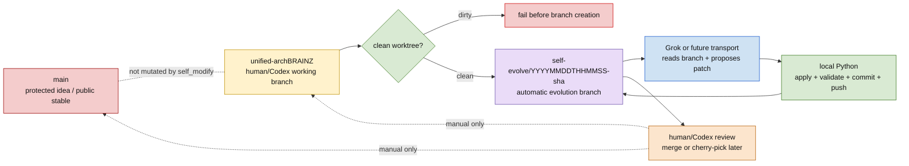
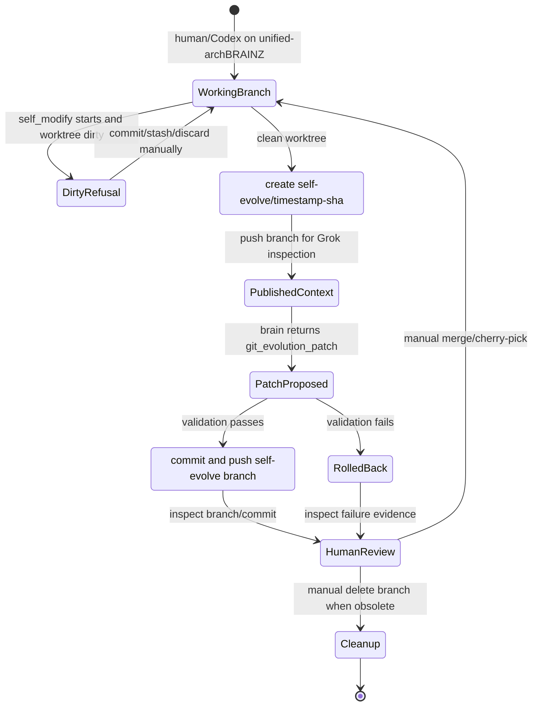
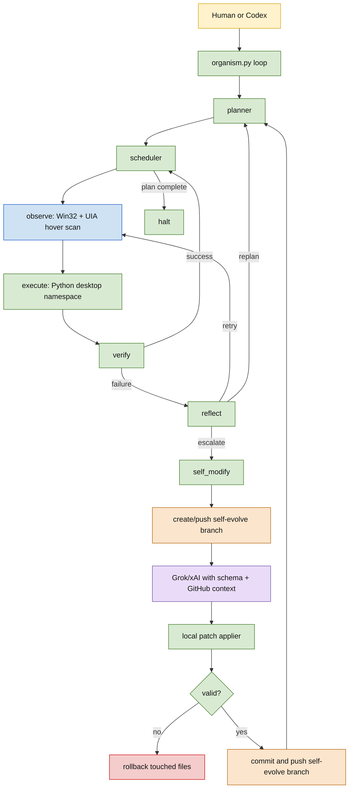
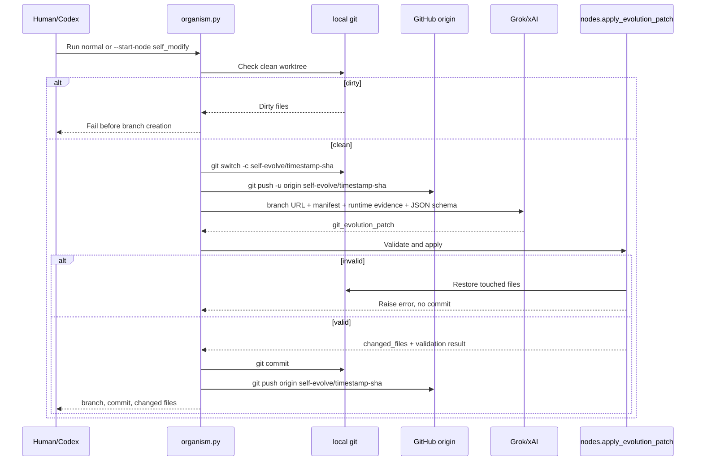

# endgame-ai Living Organism Handover

This README is the handover document for humans and AI providers. Read it before changing code. Rewrite it before the next handover.

## One Sentence

endgame-ai is a local Windows desktop organism that observes the screen, reasons through Grok/xAI, acts through Win32/UIA/mouse/keyboard, verifies outcomes, reflects on failures, and can self-evolve by creating a git branch, asking Grok for a structured patch, validating locally, committing, and pushing the result.

## Current Reality

- Branch to work from: `unified-archBRAINZ`.
- Current transport: `xai`.
- Current xAI model: `grok-4.3` for stronger structured output, tool use, and long context.
- Coding-only alternative: `grok-build-0.1` remains a valid fast coding model if speed/cost matters more than broad agentic/tool reliability.
- Reasoning feedback: OFF by default.
- Native xAI reasoning effort: configured as `none` by default.
- LM Studio/OpenAI-compatible two-pass ROD path: still present and configurable, OFF by default.
- Canonical node directory: `organism_nodes/`.
- Canonical brain transport directory: `brain_transports/`.
- Old seed/live runtime copy workflow: removed.
- Self-modify context: git-native manifest and public branch, not truncated file dumps.
- Public branch behavior: enabled by default for self-evolution context and successful self-evolution commits.

Recent implementation commits:

- `62db244 Make self evolution git native`
- `5cdd97a Rewrite living organism handover`
- `c980efa Enforce self evolve branch at patch applier`
- `e15ab47 Document self evolution operator workflow`

The current uncommitted work in this session upgrades xAI structured outputs, GitHub-only web search for self-modify, reasoning-effort handling, and this README.

## Official API Findings Checked July 2, 2026

Sources checked:

- xAI Structured Outputs: `https://docs.x.ai/developers/model-capabilities/text/structured-outputs`
- xAI Web Search: `https://docs.x.ai/developers/tools/web-search`
- xAI Reasoning: `https://docs.x.ai/developers/model-capabilities/text/reasoning`
- xAI Models: `https://docs.x.ai/developers/models`
- xAI REST API reference: `https://docs.x.ai/developers/rest-api-reference/inference/chat`

Relevant conclusions:

- xAI supports strict structured output through JSON Schema. The Responses API uses `text.format.type="json_schema"` with `schema` and `strict=true`.
- xAI structured outputs can also use `json_object`, but this organism now prefers `json_schema`.
- xAI tool calling schemas are strict by default, but this project currently uses structured output, not client-side function calls, for node records.
- xAI web search supports `allowed_domains` and `excluded_domains`; self-modify uses GitHub-only search with `allowed_domains=["github.com"]`.
- `grok-4.3` is documented as current high-reliability general/agentic model with 1M context.
- `grok-build-0.1` is documented as a fast coding model with 256k context.
- `grok-4.3` supports `reasoning_effort`; `none` disables reasoning tokens, `low` is the default if reasoning is not explicitly disabled.
- API responses include usage data, including token counts and cost-related fields when returned by xAI. Raw logs preserve the response body.

## Human Workflow

You normally work on `unified-archBRAINZ`. You do not manually create self-evolution branches. The organism creates them only when `self_modify` runs and the worktree is clean.

Normal run:

```powershell
& "C:\Users\px-wjt\AppData\Local\Python\bin\python.exe" organism.py --reset --max-ticks 5 "Observe the current desktop and report focused window title plus a few interactive elements"
```

Direct self-modify run:

```powershell
& "C:\Users\px-wjt\AppData\Local\Python\bin\python.exe" organism.py --reset --max-ticks 5 --start-node self_modify "Inspect the git-native self-evolution path and propose only evidence-backed changes."
```

Self-evolution branch workflow:

1. Human/Codex starts on `unified-archBRAINZ`.
2. The organism reaches `self_modify`.
3. The organism checks `git status --porcelain`.
4. If dirty, it fails before branch creation.
5. If clean, it creates `self-evolve/YYYYMMDDTHHMMSS-<shortsha>`.
6. It pushes that branch to `origin` because `publish_context_branch=true`.
7. Grok receives the GitHub branch URL, commit SHA, manifest, runtime evidence metadata, and JSON schema contract.
8. Grok proposes `record_type="git_evolution_patch"`.
9. Local Python validates, writes, validates again, and runs bounded commands.
10. If validation fails, local Python rolls back touched files and does not commit.
11. If validation passes, local Python commits on the self-evolve branch.
12. It pushes that commit because `push_after_commit=true`.
13. Human/Codex reviews the public self-evolve branch and decides whether to merge or cherry-pick.

Grok does not push directly. Local Python owns git mutation.

## Branch Policy: Where Grok Works

Grok, LM Studio, OpenCode, or any future brain transport does not work directly on `main` and does not work directly on `unified-archBRAINZ` during self-evolution.

Rules:

- Human/Codex development starts on `unified-archBRAINZ`.
- Normal organism runs stay on the current branch.
- Self-evolution starts only from a clean current branch.
- When `self_modify` begins, local Python creates a new branch named `self-evolve/YYYYMMDDTHHMMSS-<shortsha>`.
- The selected brain transport sees that self-evolve branch as its code context.
- The selected brain transport proposes a patch only.
- Local Python applies, validates, commits, and pushes only on the `self-evolve/...` branch.
- No self-evolution code path merges into `main`.
- No self-evolution code path merges into `unified-archBRAINZ`.
- Branch cleanup is currently manual.
- Merge/cherry-pick is currently human/Codex responsibility after reviewing the self-evolve branch.

So the answer is:

```text
Does Grok work on main? No.
Does Grok work on unified-archBRAINZ directly? No, not during self_modify.
Does Grok commit? No.
Does Grok push? No.
Does local Python commit and push? Yes, only to self-evolve/... branches.
Does the system auto-merge? No.
Does the system auto-clean old branches? No.
```

### Branch Policy Diagram



### Branch Lifecycle Diagram



## System Diagram



## Self-Evolution Sequence



## Code Map

- `organism.py`: main topology loop, state writes, runtime log events, pause/step/run control, self-modify application handoff.
- `brain.py`: transport config merge, raw logging, call budget, ROD/native reasoning orchestration, JSON extraction, JSON Schema response-format generation.
- `nodes.py`: direct node loader, execute namespace, git branch creation, patch validation, rollback, commit, push.
- `desktop.py`: Windows desktop observation and actions. Keep UIA `ElementFromPoint` hover scan plus Win32 APIs. Do not reintroduce `ControlViewWalker`.
- `stop_check.py`: `stop.txt` stop mechanism and PID registration.
- `organism_nodes/`: topology node implementations.
- `brain_transports/`: xAI, OpenAI-compatible, opencode, file proxy, browser stub transports.
- `wiring.json`: the nervous-system map.

## JSON Contracts

All brain node responses are JSON objects with this envelope:

```json
{
  "record_type": "record name",
  "data": {},
  "reasoning": "optional short reasoning"
}
```

Current schema enforcement:

- `brain.think(..., expected_record_type=...)` builds a compact JSON Schema.
- `brain.call()` passes it to transports through `cfg["response_format"]`.
- `brain_transports/xai.py` maps it to xAI Responses API `text.format`.
- `brain_transports/openai.py` maps it to Chat Completions `response_format`.
- Code still validates `record_type` after the response. API schema is a reliability layer, not the only guard.

Record contracts:

```json
{"record_type":"plan","data":{"next_signal":"step_ready|reflect","intent":[{"description":"...","done_when":"..."}]}}
{"record_type":"execution","data":{"conclusion":"EXECUTE|CANNOT","code":"python string"}}
{"record_type":"verification","data":{"next_signal":"step_confirmed|step_denied","success":true,"reasoning":"evidence"}}
{"record_type":"reflection","data":{"next_signal":"retry|replan|escalate|give_up","lesson":"...","diagnosis":"..."}}
{"record_type":"git_evolution_patch","data":{"summary":"...","rationale":"...","file_writes":[],"file_deletes":[],"wiring_patches":[],"commands":[],"expected_validation":"..."}}
```

Is this optimal?

- It is much better than prompt-only JSON because `record_type` and major `data` fields are now schema-constrained.
- It is intentionally not fully closed at every nested level because self-evolution needs flexible file and wiring patches.
- The next reliability upgrade is to define separate closed schemas for each node in `wiring.json` or code, then reject unknown fields by default except inside `wiring_patches.value`.
- For large code changes, a diff/patch schema should replace full `file_writes` to reduce output tokens and review blast radius.

## Token Spending And Cost Control

Current token strategy:

- Prompts are short and schema-focused.
- Self-modify sends a manifest, not file bodies.
- GitHub branch context replaces lossy code dumps.
- Structured output schema adds request overhead, but should reduce invalid JSON retries.
- Reasoning is disabled by default with `effort="none"` for speed and cost.
- Two-pass ROD is OFF by default because it doubles model calls.
- Web search is scoped to self-modify and restricted to `github.com`.

Where token/cost data lives:

- `brain.py` writes raw request/response rows to timestamped root `*.txt` logs.
- `brain_transports/xai.py` returns xAI `usage` and full response body.
- Raw logs preserve token counts and any returned cost fields under the response `raw.body`.
- `comms/runtime.ndjson` records runtime events but not full token accounting.

How to estimate cost:

```text
estimated_cost = input_tokens / 1_000_000 * input_rate
               + output_tokens / 1_000_000 * output_rate
```

As of the docs checked on July 2, 2026:

- `grok-4.3`: 1M context, $1.25 / 1M input tokens, $2.50 / 1M output tokens.
- `grok-build-0.1`: 256k context, $1.00 / 1M input tokens, $2.00 / 1M output tokens.

Operational recommendation:

- Use `grok-4.3` for self-evolution, GitHub branch inspection, and reliability-critical runs.
- Use `grok-build-0.1` only when coding speed/cost matters more than tool/search/reasoning breadth.
- Keep `max_brain_calls` low during probes.
- Use `--max-ticks` for bounded runtime experiments.

## ROD And Reasoning Flow

ROD means reasoning-output-driven two-pass feedback. In this repo it is implemented in `brain.think()`.

Modes:

- `single_pass`: one call, parse final JSON.
- `native`: one call, transport/model may produce reasoning metadata; parse final JSON.
- `two_pass`: first call gets reasoning, second call injects that reasoning through `injection_template` and asks for final JSON.

Default:

- xAI path uses `native` pattern but `enabled=false` and `effort="none"`.
- LM Studio/OpenAI-compatible path supports `two_pass` but `enabled=false`.

Why default OFF:

- The LM Studio run proved two-pass can work mechanically but can also contaminate output shape.
- Two-pass doubles calls and latency.
- Strict structured output is now the primary reliability mechanism.

When to turn reasoning on:

- Hard multi-step diagnosis.
- Complex code evolution where a cheap failed patch would cost more than reasoning tokens.
- Postmortem runs where speed is less important than insight.

## Stopping And Control

The organism stops or pauses through several mechanisms:

- `--max-ticks N`: stops after N topology node executions.
- `--max-brain-calls N`: stops brain calls after N calls.
- Topology `satisfied -> halt`: clean halt after plan completion or give-up path.
- Error routing: node error follows the `error` edge if configured.
- `comms/control.json`: supports `run`, `pause`, and `step`.
- `stop.txt`: `stop_check.check_stop()` exits processes at chokepoints.
- PID files in `pids/`: registered for operational visibility; they are runtime artifacts, not architecture.

## Observation Data Flow

`observe` writes:

- `screen`
- `elements`
- `screen_text`
- `windows`
- `snapshot`
- `focused_title`

`execute` receives:

- full observation payload
- `last.error`, `last.result`, `last.action`
- namespace contract
- direct namespace values: `state`, `wiring`, `goal`, `last`, `screen`, `elements`, `windows`, `screen_text`, `focused_title`

`verify` receives reduced evidence:

- focused title
- screen text
- elements
- windows
- last action/result/error

`reflect` receives reduced failure evidence:

- focused title
- screen text
- elements
- last action/result/error
- last verification

`self_modify` receives no fresh observation by itself. Direct `--start-node self_modify` has no fresh desktop observation unless state already contains one.

## Git-Native Context Model

Removed old context behavior:

- no `FULL_TEXT_LIMIT`
- no `RUNTIME_TEXT_TAIL`
- no `text_head`
- no `text_tail`
- no `truncated`
- no seed/live source duplication

Current self-modify context:

- base branch
- timestamped self-evolve branch
- commit SHA
- GitHub branch URL
- published flag
- file manifest: path, size, sha256, tracked/untracked, git status, binary flag
- runtime evidence paths: `state.json`, `comms/runtime.ndjson`, raw `*.txt` logs with size and sha256
- patch contract

Important distinction:

- A manifest is not truncation. It is a non-lossy index.
- Full code access comes from GitHub branch inspection or a future explicit file-request step.

## Proven Evidence

Prior runs:

- `20260702T111459.txt`: Grok/xAI normal run exposed missing execute namespace fields.
- `20260702T111838.txt`: LM Studio two-pass worked mechanically but returned wrong record type, proving prompt contamination risk.
- `20260702T113237.txt`: Grok/xAI run succeeded through execute and verify.
- `20260702T115105.txt`: bounded self-modify inspection did not reach self_modify but surfaced validation/rollback concerns.
- `20260702T115546.txt`: direct old self_modify proved Grok could suggest useful hardening, but also proved file-text prompt dumps were too large.

Post git-native verification already performed:

- `python -m compileall -q .` passed.
- Runtime `rg` found no truncation symbols in runtime files.
- Runtime `rg` found no seed/live copy workflow in runtime files.
- Dirty worktree self_modify failed before branch creation.
- Clean worktree created a `self-evolve/...` branch without a Grok call when `max_brain_calls=0`.
- Off-branch direct patch application failed.
- Invalid Python patch failed before creating the file.
- Failing validation command rolled back touched files.
- Successful patch committed on a self-evolve branch.

New unverified item after this README rewrite:

- Run a real Grok self_modify call with `publish_context_branch=true`, `push_after_commit=true`, structured outputs enabled, and GitHub-only web search, then inspect the raw log to confirm Grok received schema + branch URL + manifest and did not receive file body dumps.

## Bloat To Remove Next

Already removed:

- seed/live runtime copy workflow
- lossy self-modify text truncation
- legacy self-modify alias fields `node_writes`, `brain_writes`, `node_deletes`, `brain_deletes`
- unused `action_verbs` wiring block
- corrupted reasoning marker compatibility

Next candidates:

- `execute_verb()` is still present but no longer advertised; remove if no run evidence needs it.
- `BaseNode` abstraction is small but may be unnecessary if all LLM nodes become explicit modules.
- `extract_json_object()` is still needed for non-schema transports, but can be reduced after all active transports support strict schemas.
- `file_proxy`, `browser_ai`, and `opencode` transports should stay only if they are actively used or documented as plugin points.
- `wiring.json` prompts can be shorter now that JSON Schema enforces record shape.

## Reliability Plan

Highest value next changes:

1. Run real Grok self_modify with structured schema and GitHub web search enabled.
2. Inspect raw `*.txt` for request size, schema field, tools field, branch URL, and usage tokens.
3. Add a two-step `file_request` record if Grok needs local full-file access beyond GitHub.
4. Replace full-file `file_writes` with unified diff patches for large edits.
5. Add explicit per-node prompt budget metrics from raw logs.
6. Improve hover scan sampling for windows that expose zero actionable elements, without `ControlViewWalker`.
7. Add a merge policy for successful self-evolve branches.

## Verification Commands

Compile:

```powershell
& "C:\Users\px-wjt\AppData\Local\Python\bin\python.exe" -m compileall -q .
```

Runtime scans:

```powershell
rg -n "FULL_TEXT_LIMIT|RUNTIME_TEXT_TAIL|text_head|text_tail|truncated" organism_nodes nodes.py organism.py brain.py wiring.json
rg -n "ensure_live|live_nodes|live_brains|seed_nodes|seed_brains" organism_nodes brain_transports nodes.py organism.py brain.py wiring.json
rg -n "node_writes|brain_writes|node_deletes|brain_deletes|action_verbs|�|Ã" brain.py nodes.py wiring.json organism_nodes brain_transports
```

Status:

```powershell
git status --short --branch
git log --oneline -6
```

## Handover Prompt For Another AI Provider

```text
Read README.md fully before acting. You are continuing endgame-ai on branch unified-archBRAINZ. This is a living Windows desktop organism, not a chatbot. Preserve the loop: perceive -> plan -> schedule -> act -> verify -> reflect -> self-modify.

First inspect git status, wiring.json, brain.py, nodes.py, organism.py, brain_transports/xai.py, organism_nodes/self_modify.py, newest state.json, comms/runtime.ndjson, and newest raw *.txt logs.

Current architecture: canonical nodes are in organism_nodes/ and transports are in brain_transports/. There is no seed/live runtime copy workflow. xAI is selected. Current default model is grok-4.3. Reasoning is OFF with effort none. LM Studio two-pass ROD remains configurable but OFF.

Observation must remain Windows-native UIA ElementFromPoint hover scan plus Win32 focus/window APIs. Do not reintroduce ControlViewWalker.

Self-evolution is git-native. self_modify requires a clean worktree, creates self-evolve/YYYYMMDDTHHMMSS-shortsha, pushes that context branch to origin, sends Grok a GitHub branch URL, commit SHA, workspace manifest, runtime evidence paths, GitHub-only web search, and strict JSON Schema. Grok returns record_type="git_evolution_patch". Local Python applies, validates, rolls back on failure, commits on the self-evolve branch, and pushes the validated commit. Grok never pushes directly. The system does not auto-merge into main or unified-archBRAINZ and does not auto-clean old self-evolve branches; human/Codex review, merge/cherry-pick, and cleanup are separate manual steps.

The active JSON contract is record_type + data. xAI and OpenAI-compatible transports now receive response_format/json_schema for expected records. Keep prompts short because schema enforces shape. The next schema improvement is to close nested fields further while preserving flexible wiring patch values.

Token strategy: no file body dumps in self_modify. Use manifest + GitHub branch. Raw xAI responses contain usage/cost metadata under raw body in timestamped *.txt logs. Keep max_ticks and max_brain_calls low while probing. Use grok-4.3 for reliability and GitHub branch inspection; consider grok-build-0.1 only for fast coding-only runs.

Before claiming success, run compileall and rg scans from README. Then run one real Grok self_modify call and inspect the raw log for schema, tools, branch URL, manifest, usage, and absence of text_head/text_tail/truncated/file-body dumps. Commit coherent chunks regularly and rewrite README.md again before handoff.
```
