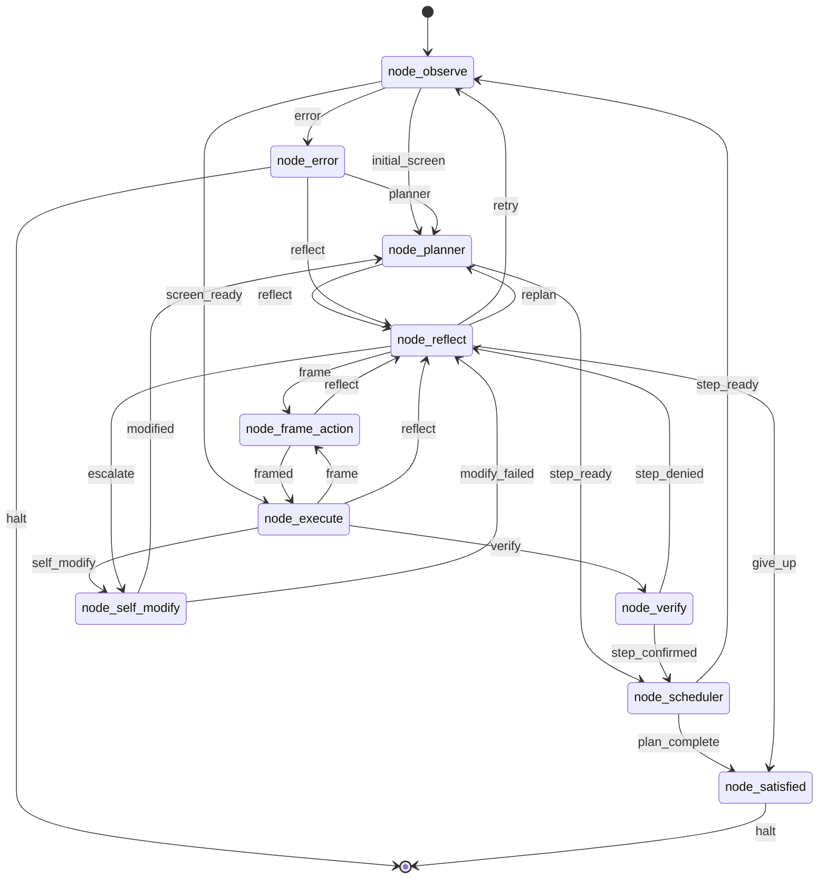

# endgame-ai

endgame-ai is a local Windows desktop organism. The Python body owns the computer: mouse, keyboard, subprocesses, files, browser launch, UIA observation, and git. LLM brains are interchangeable organs. `wiring.json` is the circuit that binds organs, prompts, transports, and topology into one loop.

The system is intentionally unconstrained. The body can execute Python and modify its own repository. Reliability comes from auditable contracts, deterministic validation, git history, and clear runtime records, not from a sandboxed capability list.

## Current Reality

| Surface | Implemented contract |
| --- | --- |
| Organ loop | `core_organism.py` loads `wiring.json`, resumes `runtime_state.json`, runs one topology node at a time, and routes only on bus signals. |
| Bus record | `core_bus.Record` is the single LLM record shape: `record_type`, `data`, `reasoning`. LLM records route through `data.next_signal`. |
| Observation | `core_observation.py` builds a whole-screen UIA tree with short IDs and a body-side `action_index`. The brain sees short IDs only. |
| Execution | `node_execute.py` runs Python in the host interpreter with the capability runtime from `core_nodes.py`. |
| Self-modification | `node_self_modify.py` proposes git-native patches; `core_nodes.py` validates file writes, rejects destructive stubs, commits on the current branch, and optionally pushes. |
| Runtime events | One append-only root log, `runtime_events.jsonl`, records organism events plus full brain request/response data. |
| Runtime state | `runtime_state.json` is the live resumable snapshot. `runtime_control.json` is the live run/pause/step control file. |
| Stop file | `runtime_stop.json` is created by explicit stop requests or duration expiry and persists for audit until `--reset` clears it. |
| PID file | `runtime_organism.pid` identifies the live process and is removed on normal process exit. |
| Recursive review | Supported manually by protocol: git branch plus file-proxy request/response files plus a reviewer goal. Automatic webhook or PR orchestration is not implemented here. |

## Run

```powershell
python -m core_organism "your goal" --reset --duration-seconds 120
```

CLI contract:

- `goal`: the atemporal narrative the organism carries through the run.
- `--duration-seconds N`: wall-clock runtime length. When it expires, the organism writes `runtime_stop.json`, records `duration_expired`, and stops.
- `--brain-call-budget N`: optional LLM call budget. This is not a runtime-length system.
- `--reset`: clears live state/control/request/response and any existing stop file. It does not erase `runtime_events.jsonl`.
- `--start-node NAME`: resume at a specific topology node when deliberately debugging.
- `--wiring PATH`: load an alternate wiring file.

There is no `--max-ticks` runtime contract. Ticks remain an internal trace counter only.

## Runtime Files

Root runtime files have distinct jobs:

- `runtime_events.jsonl`: canonical append-only record stream for every run.
- `runtime_state.json`: current resumable state snapshot.
- `runtime_control.json`: live control file with `run`, `pause`, or `step`.
- `runtime_stop.json`: durable stop request/audit file.
- `runtime_organism.pid`: live process identity.
- `runtime_request.json` / `runtime_response.json`: file-proxy IPC, not logs.

Brain request events write full message content for every role, plus byte/character counts, hashes, prompt cache keys, stable-prefix metadata, and parsed dynamic user payload when available. Responses keep full committed content, reasoning, and raw transport fields because those are forensic evidence.

## File Proxy

`transport_file_proxy.py` lets any intelligence drive an organ by files. It writes `runtime_request.json` with full request messages and waits for `runtime_response.json`.

The response must be a direct bus record:

```json
{"record_type":"plan","data":{"next_signal":"step_ready","intent":[]},"reasoning":""}
```

The file-proxy request keeps full system and user message content. Hashes and expected record metadata are included as indexes, not replacements.

## Organ Topology



Every LLM organ emits one JSON record. The body routes on `data.next_signal` and the topology edge table. Organs do not call each other directly.

## Observation And Action

The observation model is focus-free. The scanner attempts one whole-screen UIA scan, builds a visible tree, assigns short IDs, and stores execution metadata in `action_index`.

The execution model is direct. `click_node`, `read_node`, `scroll_node`, and `node_by_id` resolve through `action_index`. Long UIA runtime IDs are body metadata, not brain targets.

If observation fails, the current organism cannot make a normal brain call because brain calls require a fresh observation. That failure is visible in `runtime_state.json` and `runtime_events.jsonl`.

## Self-Modification

Self-modification is local and git-native:

1. A failing organ routes to `node_self_modify`.
2. The self-modify brain proposes a complete structured patch.
3. The body validates Python and JSON writes.
4. The body rejects destructive placeholder rewrites.
5. The body runs declared deterministic commands.
6. The body commits changed files on the current branch.
7. Optional push is controlled by `wiring.json`.

There is no hidden reviewer daemon. A reviewer is another endgame-ai process launched manually with a reviewer goal against the same branch or file-proxy channel.

## Recursive Review

Recursive review is protocol-supported:

- The proposer commits a branch.
- A human or another endgame-ai process receives the branch and a review goal.
- The reviewer runs deterministic checks and inspects the patch.
- The reviewer writes an approval or rejection through normal git/file-proxy coordination.

Recursive review is not automatic webhook orchestration in this checkout. Documentation and prompts must not claim otherwise unless code exists to run it.

## Deterministic Checks

Use direct commands from the repo root:

```powershell
python -m compileall -q .
python -m json.tool wiring.json
python -m pyright .
python -m core_organism --help
```

Optional tools such as vulture or graph analyzers may be run if installed, but they are not wrapped by a repository bridge file.

## Prompt And Persona Contract

The prompts describe organs as parts of one larger local organism. Each organ should know its role, the shared bus contract, the computer-use nature of the body, and the fact that its output must be useful to other LLMs and humans reading the same event stream later.

The goal is memory. It is modifiable by the organism through code, wiring, and narrative self-description. The goal is not only a task string; it is the atemporal story the system uses to maintain identity across organs, runs, reviews, and self-edits.

## Appendix: Next Session Goal

Use this as the next high-reasoning goal seed after compaction:

> Continue making endgame-ai smaller, more alive, and more useful while preserving its unconstrained computer-use nature. Read README, wiring, source, git history, and runtime evidence first. Work on the current non-main branch. Treat the goal as modifiable narrative memory. Do not add sandbox limits. Improve the system so every organ produces outputs useful to the other organs, to reviewer organisms, and to outside LLMs reading the event log. Make precise production changes, run deterministic checks, commit, and report evidence.

Five improvement areas:

1. Observation resilience: diagnose UIA `COMError: Access is denied` and make the observe node fail in a way that routes to a useful mechanical recovery path instead of repeated planner failures.
2. Prompt compression: reduce repeated prompt text in `wiring.json` while preserving organ identity, bus contract, computer-use nature, and no-fake-automation claims.
3. Event replay: add a small reader for `runtime_events.jsonl` that reconstructs the last run without creating another log path.
4. Review protocol: define the manual reviewer handoff record for git/file-proxy review without claiming automatic webhook or PR behavior.
5. Self-story: make the organism's goal update path explicit at the meta level so self-modification can revise the narrative it uses to continue work.
