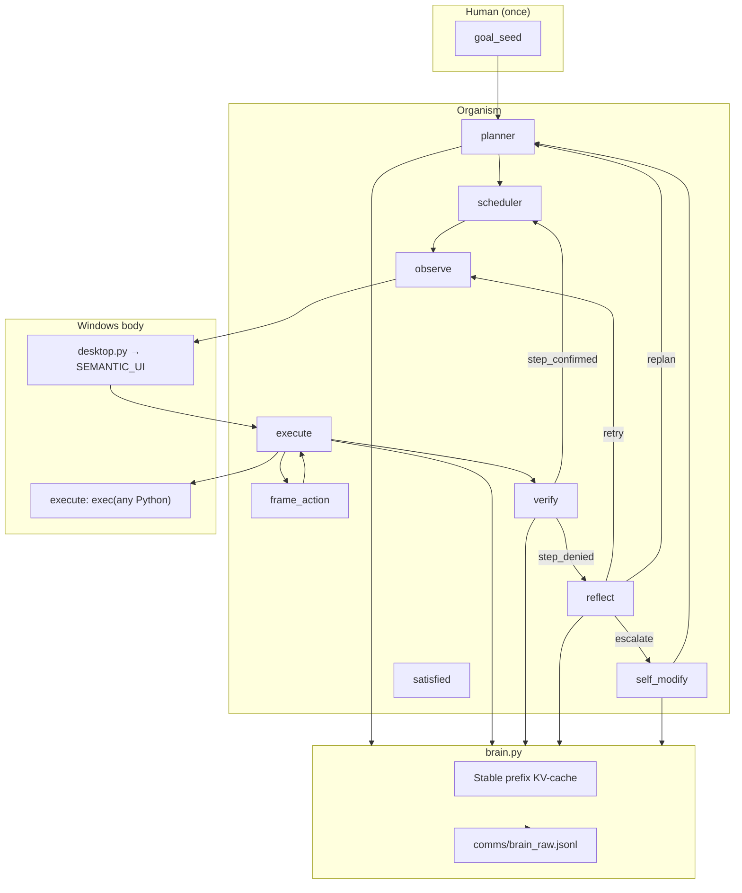
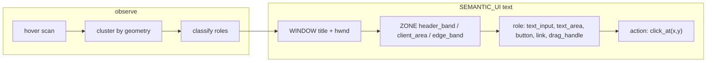

# endgame-ai

**Living digital operator on Windows.** You state a goal and leave. The organism senses the desktop, runs arbitrary Python on the real machine, routes signals through `wiring.json`, and may evolve firmware via git. No sandbox. Task-agnostic firmware — **goal_seed is the only task source.**

**Tracked:** 22 root `*.py` + `wiring.json` ≈ **2,700 LOC** (inverted `.gitignore` allowlist).

---

## Vision

| Principle | Meaning |
|-----------|---------|
| **Handover** | Human gives intent once; organism owns the PC until halt or bounds |
| **Task-agnostic firmware** | No Opera/X/chess/browser baked into prompts, schemas, or observation code |
| **SEMANTIC_UI** | Python prepares WINDOW → ZONE → role; the LLM maps roles to the goal |
| **Interpreter feedback** | Python exceptions → `last_error`; helper `ok:false` → reflect |
| **KV-cache identity** | Stable prefix carries full firmware + organ identity (cheap per tick) |
| **Self-evolution** | `self_modify` after reflect `escalate` — git-native patches only |

---

## Architecture





**Roles are geometry-only** — never `url_field`, never browser names in code. The planner reads `goal_seed` and decides that `text_input_header` means URL bar, chess input, or something else.

---

## What is proven

| Capability | Evidence |
|------------|----------|
| Live tick loop | planner → observe → execute → verify → reflect cycles |
| SEMANTIC_UI | Python-prepared hierarchy replaces ibeam boilerplate |
| Unsandboxed execute | subprocess, winget, Popen, win32 helpers |
| Verify discipline | step_denied without observation proof; no print-as-publish |
| Replan from evidence | Replanned when step definition mismatched goal |
| Raw LLM audit | `comms/brain_raw.jsonl` — full request/response trail |
| Registry hot-swap | `reload_from_files()` after evolution |
| Task-agnostic prompts | `540f927` — goal_seed sole task source |
| Stable prefix on | KV-cache for all brain organs |

## What is not proven

| Gap | Notes |
|-----|-------|
| Dual-thread handover | Chess + publishing never completed in one run |
| frame_action in anger | Organ exists; rarely routed on Run B2 |
| self_modify apply | LLM diagnosis correct; corrupt git patches crashed runs |
| 100-tick endurance | Longest clean run ~40 ticks before crash |
| SEMANTIC_UI on grok.com | Not yet exercised on chess/ascii UI |

---

## Planned run (awaiting owner permission)

**Status:** runtime cleaned · **not started** · permission required before launch.

### Goal (vague — lives in `comms/goal.txt`)

Two parallel threads; owner sessions assumed logged in:

1. **Chrome / grok.com** — engage the site in its ascii (or equivalent) mode and play chess through to a **finished game**.
2. **Opera / social surfaces** — publish **full written pieces** about this project (not short posts) on the usual channels.

**Completion** (organism should reach `satisfied` only when **both** are true in the observable world):

- Chess: game over / outcome visible on grok.com
- Publishing: posts visibly published (not merely typed in compose)

The goal text is intentionally vague in firmware; specifics come from narration and planner steps at runtime.

### Bounds

| Parameter | Value |
|-----------|-------|
| max_ticks | **100** |
| max_brain_calls | **80** |
| Launcher | `comms/run_dual.py` |

### Operator protocol (mandatory)

**Two windows via `cmd.exe`** (PowerShell wrapper breaks nested parentheses):

**Window A — organism:**
```bat
cmd.exe /c "cd /d C:\Users\ewojgab\Downloads\endgame-ai && python comms\run_dual.py"
```

**Window B — live commentary every 30 seconds:**
```bat
cmd.exe /c "cd /d C:\Users\ewojgab\Downloads\endgame-ai && python comms_poll.py 30 200"
```

**Commentary rules:**

- Poll every **30s** — no silent long stretches
- Report: `tick`, `node`, `signal`, `focused_title`, last error, SEMANTIC_UI headline
- Read `[organism]` / `[observe]` / `[brain]` stdout in Window A as primary drama
- **Never** commit `comms/`, `state.json`, secrets
- **Never** start a second organism while one is running (no `del state.json` mid-run)

---

## Project timeline

| Phase | Tag | Milestone |
|-------|-----|-----------|
| Unification | `ooo-unification` | Flat root organs, inline brain |
| Live loop | `first-live-loop` | End-to-end ticks on real desktop |
| Survey | `survey-loop-complete` | Multi-tick stability |
| Handover docs | `handover-investigation` | Run B postmortem from logs |
| Prompt pass | `handover-prompt-fix` | Execute namespace, verify anti-hallucination |
| Record shape | `handover-opera-run` | Flat Grok JSON hoist |
| SEMANTIC_UI | `bdd715e` | Hierarchical observation |
| Task-agnostic | `540f927` | Removed browser/task imprints |

**Next tag (after planned run):** `dual-handover-chess-publish`

---

## Planned work (firmware roadmap)

| Priority | Work | Done when |
|----------|------|-----------|
| P0 | Run dual handover with 30s commentary | Both completion criteria met or honest give_up |
| P1 | frame_action routes on repeated UI no-op | Execute uses FRAME before escalate |
| P1 | self_modify patches pass `git apply --check` | Escalate path does not crash |
| P2 | Richer SEMANTIC_UI clustering | Fewer duplicate drag_handle noise |
| P2 | Multi-hour unattended bounds | 100 ticks without duplicate-launch races |
| P3 | Post-run README + tag from logs | LLM lessons archived, not re-invented |

---

## Repository map

| File | Role |
|------|------|
| `organism.py` | Main loop, bounds, evolution apply |
| `wiring.json` | Topology, prompts, model, limits |
| `brain.py` | xai, stable prefix, `think()`, raw log |
| `desktop.py` | Hover scan → SEMANTIC_UI |
| `execute.py` | `exec(code)` — full namespace |
| `registry.py` | Organ registry + hot-swap |
| `comms/goal.txt` | Runtime goal (gitignored) |
| `comms/run_dual.py` | Launcher for planned run |
| `comms_poll.py` | 30s live snapshots |
| `comms/brain_raw.jsonl` | Full LLM audit (gitignored) |
| `comms/runtime.ndjson` | Node/signal stream (gitignored) |

---

## Run locally

```bat
python contract_check.py
python organism.py "your goal" --max-ticks 100 --max-brain-calls 80 --reset
```

Single-node debug:
```bat
python organism.py --node execute --goal "..." --reset
```

---

## Tags

`ooo-unification` · `arch-flat-root` · `first-live-loop` · `survey-loop-complete` · `handover-investigation` · `handover-prompt-fix` · `handover-opera-run`

**Current:** runtime clean · dual handover **pending permission**