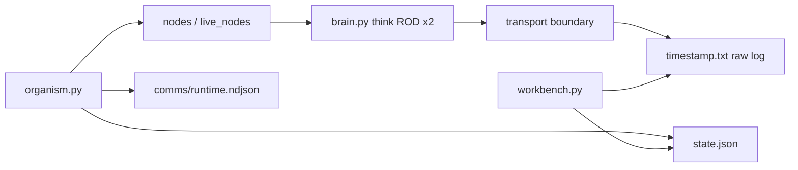

# endgame-ai

A living, unconstrained organism that inhabits a real Windows desktop. It sees the screen,
moves the mouse and keyboard, forms intentions, acts, verifies, reflects, and can rewrite its
own `wiring.json` at runtime — including which brain it thinks with.

**Branch:** `brains-integration` — multi-transport brain swap, unified raw logging, live
workbench panel. Intended to merge into `main` after review.

Built from a handful of Python files, one JSON config, and seed node templates. **Standard
library only** in the organism core. No LangChain, no MCP in the loop, no silent fallbacks.

> **This README is the handover for `brains-integration`.** It states what changed vs `main`,
> which claims from `main`'s README still hold, what was tested in-session (with limits), and
> how to continue. Read §0 before editing anything.

---

## Table of contents

0. [Bootstrap prompt for the next agent](#0-bootstrap-prompt-for-the-next-agent)
1. [What this branch is](#1-what-this-branch-is)
2. [Changelog vs `main` (line diffs)](#2-changelog-vs-main-line-diffs)
3. [Is `main`'s README still true here?](#3-is-mains-readme-still-true-here)
4. [Did the organism wiring logic change?](#4-did-the-organism-wiring-logic-change)
5. [Architecture](#5-architecture)
6. [ROD — the two-call decision](#6-rod--the-two-call-decision)
7. [Brain transports](#7-brain-transports)
8. [Logging contract](#8-logging-contract)
9. [Running it](#9-running-it)
10. [The workbench](#10-the-workbench)
11. [ROD brain test (45s cap)](#11-rod-brain-test-45s-cap)
12. [Essential tracked files](#12-essential-tracked-files)
13. [Merge notes](#13-merge-notes)
14. [Handover — open questions](#14-handover--open-questions)

---

## 0. Bootstrap prompt for the next agent

```
You are continuing endgame-ai on branch brains-integration (merge target: main).

WHAT THE SYSTEM IS
- perceive → decide → act → verify → reflect loop driven by wiring.json topology graph.
- Brain = stateless transports in brain.py; ROD = exactly 2 calls per think().
- Every LLM circuit commits a typed record {record_type, data}. Wrong type → fail hard → reflect.
- self_modify can rewrite wiring.json live, including model.transport. Organism reloads brain on
  wiring mtime change. No fallback transports: errors raise.

WHAT THIS BRANCH ADDED (vs main)
- Six transports: openai, xai_responses, opencode, grok_build, file_proxy, browser_ai (stub).
- One forensic raw brain log per process: <timestamp>.txt at repo root (JSON lines, .txt extension).
- Workbench panel: brain editor, probes, Test ROD (2-call), file_proxy handoff, raw log tail.
- Allowlist .gitignore — only core source tracked; all runtime artifacts ignored.

GROUND RULES
- Work on brains-integration unless told otherwise. Do not touch main without explicit instruction.
- Stdlib only in organism core. No fallbacks. No constrained mode. Fail-hard on transport errors.
- Forensic *.txt logs are NOT live state. Live truth = state.json + slim runtime.ndjson events.
- ROD tests: hard cap 45s (brain_test_timeout_s). One think() only. Never run unbounded brain tests.
- OpenCode exe in wiring uses %USERPROFILE% (expanded by brain.py via os.path.expandvars).

FIRST ACTIONS
1. Read this README and §2–§4 (changelog + main validity).
2. Read organism.py, brain.py, nodes.py, wiring.json before changing behavior.
3. Confirm chosen brain is reachable (Probe selected in workbench).
4. Ground claims in raw *.txt log + state.json — not conversation memory.
```

---

## 1. What this branch is

`main` documented a milestone run (goal-interpretation drift, self-modification, LM Studio 4B
core brain) and shipped a minimal brain layer (`openai` + `file_proxy` + `browser_ai` stub).

`brains-integration` keeps the **same organism graph and intent contract** but replaces the
brain/logging/workbench layer so you can:

- Swap among multiple real transports without code edits (wiring only).
- Log **raw wire I/O** once, at transport boundaries, in one append-only `*.txt` file.
- Control and falsify brains from the workbench (including human/agent `file_proxy` handoff).

The milestone **research narrative** from `main` (§1–§2, evidence logs) is historical context
on `main`; this branch does not carry `evidence/` in git (removed here; preserved on `main`).

---

## 2. Changelog vs `main` (line diffs)

Measured with `git diff main...brains-integration --numstat` (2026-06-30).

| File | +lines | −lines | Reason |
|------|--------|--------|--------|
| `brain.py` | 697 | 65 | Multi-transport implementations; unified raw `*.txt` log; ROD unchanged |
| `workbench.py` | 667 | 91 | Live panel, brain editor, probes, ROD test API, usage from raw log |
| `wiring.json` | 372 | 24 | Per-transport config blocks + controls; **topology section unchanged** |
| `organism.py` | 106 | 37 | Atomic `state.json`, `state_seq`, slim runtime events, wiring hot-reload |
| `README.md` | 676 | 631 | This document (replaces main's milestone README on this branch) |
| `.gitignore` | 32 | 10 | Allowlist policy — track core source only |
| `nodes.py` | 8 | 1 | Wiring summary keys for self_modify (`raw_log_path`, `log_raw`) |
| `endgame-ai.code-workspace` | 0 | 8 | IDE workspace file removed |
| `evidence/*` | 0 | 1389 | Milestone proof bundle removed (still on `main`) |

**Net:** +1949 / −2236 lines across 11 paths. Largest behavioral surface: `brain.py`, `workbench.py`,
`wiring.json` model section.

---

## 3. Is `main`'s README still true here?

Evaluated **without re-running** the milestone organism; by reading code + wiring diff.

| Claim from `main` README | Still valid on `brains-integration`? |
|--------------------------|--------------------------------------|
| Topology graph (planner → … → self_modify) | **Yes** — same 8 nodes, 16 edges, `cycle_start: planner` |
| ROD two-call cognition | **Yes** — `brain.think()` unchanged in contract |
| Typed `record_type` intent contract | **Yes** — `nodes.call_node()` validation unchanged |
| `self_modify` can edit wiring incl. transport | **Yes** |
| Stdlib only, no frameworks | **Yes** |
| Fail-hard, no silent fallbacks | **Yes** |
| Core boots `openai` / LM Studio | **Partially** — `openai` still configured; **default transport is `opencode`** on this branch |
| Only three transports (openai/file_proxy/browser_ai) | **No** — six transports; `browser_ai` still stub |
| `file_proxy` uses `comms/think_log.txt` | **No** — now `comms/request.json` → `comms/response.json` |
| Logs: run.log / session / usage ledgers | **No** — replaced by `<timestamp>.txt` raw log + slim `runtime.ndjson` |
| Milestone goal-drift forensic (§1–§2) | **Historical** — proven on `main` run; not re-validated on this branch |
| `evidence/` committed proof files | **No** — removed on this branch |

---

## 4. Did the organism wiring logic change?

**The topology graph did not change.** `git diff main...brains-integration -- wiring.json` shows
zero edits inside the `topology` object (nodes, edges, `cycle_start`).

**What did change in `wiring.json`:**

- `model` section expanded (transport-specific blocks, UI `controls`, logging flags).
- Default `model.transport`: `openai` → `opencode`.
- `file_proxy.request_path`: `comms/think_log.txt` → `comms/request.json`.
- Active `file_proxy` / `browser_ai` labels and handoff metadata.

**Organism loop logic** (`organism.py`): same graph driver; additions are reliability only
(atomic state writes, narration → runtime events, wiring mtime → brain rebind). No new nodes,
no new edges, no change to signal routing rules.

**Conclusion for merge:** You are merging **brain transport + observability + workbench**, not a
new cognitive architecture. Post-merge, review `wiring.json` defaults (`transport`, `file_proxy`
paths) so they match your intended production baseline.

---

## 5. Architecture

| Piece | File | Role |
|-------|------|------|
| Living loop | `organism.py` | Topology driver; atomic `state.json` |
| Brain | `brain.py` | Stateless transports + ROD `think()` |
| Engine | `nodes.py` | Node loader, ROD call, desktop I/O bridge |
| Nodes | `live_nodes/*.py` | Hot-swappable circuits (copied from `seed_nodes/` on first run) |
| Body | `actions.py`, `desktop.py` | Windows UI Automation + verbs |
| Config | `wiring.json` | Topology, prompts, verbs, brain — single source of truth |
| Panel | `workbench.py` | http://localhost:8800 |



---

## 6. ROD — the two-call decision

Unchanged from `main`:

1. **Call 1** — model reasons (inline thinking, `reasoning_content`, or stream `thought` chunks).
2. **Call 2** — user message + `ROD_REASONING_CONTENT:` + call-1 reasoning → typed JSON record.

Request log entries carry `rod_feedback: true` on call 2 (envelope field; CLI argv is redacted).

---

## 7. Brain transports

| Transport | Status | Notes |
|-----------|--------|-------|
| `openai` | Implemented | LM Studio `localhost:1234`, `nvidia-nemotron-3-nano-4b` |
| `opencode` | Implemented | CLI; exe `%USERPROFILE%/AppData/Local/OpenCode/opencode-cli.exe` |
| `grok_build` | Implemented | CLI `grok -p`, `streaming-json` |
| `xai_responses` | Implemented | Needs `XAI_API_KEY` |
| `file_proxy` | Implemented | `comms/request.json` → `comms/response.json`; human/agent is the brain |
| `browser_ai` | Stub | `actions.browser_ai_handoff` not implemented |

Swap via workbench **Save brain** or edit `wiring.json`; organism picks up on next wiring mtime.

Paths in `wiring.json` may use Windows env vars (`%USERPROFILE%`); `brain.py` expands via
`os.path.expandvars` before resolving executables.

---

## 8. Logging contract

| Tier | Path | Role |
|------|------|------|
| Live snapshot | `state.json` | Current truth (node, goal, plan, screen summary) |
| Live events | `comms/runtime.ndjson` | Organism lifecycle only — **not** brain I/O |
| Forensic raw | `<timestamp>.txt` (repo root) | One JSON line per entry; raw request/response at transport boundary |

Removed vs `main`: `session-*.log`, `brain_usage.ndjson`, `brain_io.ndjson`, duplicate brain
events in runtime. Usage tables in workbench are **derived** from raw response entries.

Runtime paths (`live_nodes/`, `comms/`, `state.json`, `*.txt` logs, `__pycache__/`) are
gitignored and recreated on run.

---

## 9. Running it

Requirements: Windows, Python 3.13+, chosen brain reachable (LM Studio, OpenCode CLI, Grok CLI,
xAI key, or file_proxy responder).

```powershell
python workbench.py                              # optional panel
python organism.py --reset "observe the screen"
python organism.py --reset --max-ticks 1 "observe the screen"
```

Each ROD decision = 2 brain calls. Long runs are normal on slow/local models.

---

## 10. The workbench

```powershell
python workbench.py    # http://localhost:8800
```

- Live state, narration, reasoning chain (from `state.json`)
- Brain provider editor → writes `wiring.json`
- **Probe selected** — reachability per transport
- **Test ROD (2-call)** — falsification via `POST /api/brain_test`
- **File proxy handoff** — shows pending `request.json`; write `response.json` as the brain
- Forensic tail of `*.txt` raw log and `runtime.ndjson`

On slow machines, confirm port 8800 with a TCP connect test, not a heavy HTTP poll loop.

---

## 11. ROD brain test (45s cap)

Workbench **Test ROD (2-call)** runs one `think()` with `parse_retries=0` (exactly 2 transport
calls). Hard limits:

- `model.brain_test_timeout_s` = **45** (whole test, wiring + code)
- Per-call transport timeout = **22s** (`test_timeout // 2`) during tests
- Server: `ThreadPoolExecutor` hard cap on `think()`
- Client: fetch abort at 45s

Success criteria: 2 request + 2 response raw entries, `rod_feedback` on call 2, non-empty
reasoning, parsed `{"record_type":"workbench_rod_test","ok":true,"transport":"<name>"}`.

### Tested in-session (2026-06-30, single pass, before hard cap tightening)

| Transport | OK | Elapsed | Notes |
|-----------|----|---------|-------|
| `opencode` | yes | ~27s | 2-call ROD, JSON parsed |
| `file_proxy` | yes | ~2s | agent wrote `response.json` as brain |
| `xai_responses` | yes | ~15s | 2-call ROD, JSON parsed |
| `openai` | no | ~4s | LM Studio not listening (connection refused) |
| `grok_build` | no | >45s | CLI too slow for 45s budget when run sequentially after others |

Re-test one transport at a time via workbench; do not batch all transports in one script.

---

## 12. Essential tracked files

Minimum to run cold start (also the `.gitignore` allowlist):

```
wiring.json
organism.py  brain.py  nodes.py  actions.py  desktop.py
workbench.py   # optional for panel
seed_nodes/*.py
```

Not required at runtime (but kept in git): `README.md`, `LICENSE`, `.gitignore`, `.gitattributes`.

Created at runtime: `live_nodes/`, `state.json`, `goal.json`, `comms/`, `<timestamp>.txt`,
`__pycache__/`.

---

## 13. Merge notes

When merging `brains-integration` → `main`:

1. **Keep** `main`'s milestone README narrative or merge §1–§2 forensic into a `docs/` path —
   this branch's README supersedes operational docs for the new brain layer.
2. **Resolve** `wiring.json` defaults: transport, `file_proxy` paths, OpenCode exe (`%USERPROFILE%`).
3. **Expect** `evidence/` to remain on `main` history; re-add if you want both proof bundles.
4. **Verify** post-merge: one ROD test per transport at 45s cap; LM Studio up before `openai` test.

---

## 14. Handover — open questions

1. After merge, should default `model.transport` return to `openai` (main baseline) or stay `opencode`?
2. Should `file_proxy.request_path` stay `comms/request.json` or restore `comms/think_log.txt` for continuity with the milestone run?
3. `grok_build` under 45s: raise per-call budget for Grok only, or accept it as slow-transport manual test?
4. Restore `evidence/` on merged tree or keep proof only on `main`?

### Suggested first action next session

Read §0. Start workbench. Run **Test ROD (2-call)** for **one** transport you care about (45s max).
Inspect tail of newest `*.txt` raw log. Do not batch all brains in one unattended run.

---

*endgame-ai is a research organism, not a product. Run only where full desktop control is acceptable.
Claims in §11 are session-tested; claims inherited from `main` §1–§2 are historical unless re-run.*

---

## Appendix — Fresh-session starter prompt

> Paste at the start of a new conversation to resume on `brains-integration`:

> You are resuming endgame-ai on branch **brains-integration** (merge target main). Read
> README.md in full — especially §0, §2 changelog, §3–§4 main validity, §11 ROD tests (45s cap).
> The organism topology and ROD contract are unchanged from main; this branch adds multi-transport
> brains, unified raw `*.txt` logging, and the workbench panel. Rules: stdlib core, fail-hard, no
> fallback transports, forensic logs are not live state, never run brain tests longer than 45s or
> batch all transports unattended. OpenCode exe uses `%USERPROFILE%` in wiring.json. First: read
> source, probe selected brain in workbench, then one ROD test if needed — wait for my direction
> before merging or changing defaults.