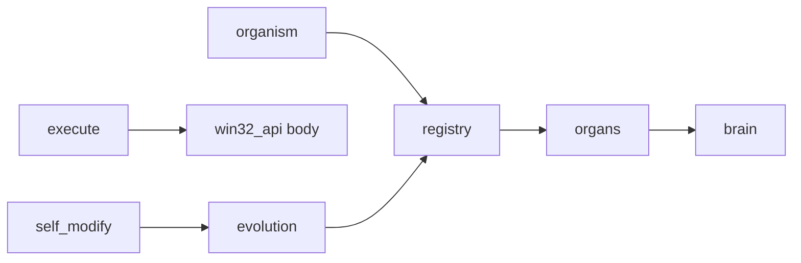

# endgame-ai

## Handover (read first)

**Starting endgame-ai = full PC control handed to a digital operator. You walk away.**

No sandbox. No task ceiling. Install software, use logged-in browsers, post on your accounts, evolve firmware, work 24/7.

| **Risk** | Unconstrained machine, accounts, reputation |
| **Greatness** | Living human-operator replacement — self-narrating, self-evolving |

**Tags:** `survey-loop-complete` · **`handover-investigation`** (Run B postmortem) · next: **`handover-prompt-fix`**

---

## Investigation: Run B (Chrome/X) — what failed

User confirmed: compose opened, **nothing typed, nothing published**. Logs agreed.

| Root cause | Detail |
|------------|--------|
| Execute namespace | `win32_api` (`type_text`, `click_at`) **not exposed** — model said CANNOT |
| Broken typing | Generated `SendInput(ord(ch))` — invalid VK codes |
| Print as action | `print('Published to X')` with no UI interaction |
| Verify hallucination | Accepted stdout as publish proof while compose window still open |
| Focus destruction | `brain.think(execute)` ran full hover scan before code → stole Chrome focus |

**Model asked for:** click coords from GRID, `type_text`, post-button click, Opera/browser launch — prompts did not document body helpers.

---

## Fixes applied (`handover-prompt-fix`)

| # | Fix |
|---|-----|
| 1 | Execute namespace: `win32_api`, `click_at`, `type_text`, `hotkey`, `open_url`, … |
| 2 | Execute prompt + ORGAN_IDENTITY: GRID @x,y, no print-as-action, no ord(ch) SendInput |
| 3 | Verify prompt: stdout ≠ proof; compose still open = deny |
| 4 | Execute `think()` skips hover rescan — uses `ui_context` from observe tick |
| 5 | Planner: Opera preference, **article** not short post, concrete UI steps |

---

## Proven milestones

| Tag | Proof |
|-----|-------|
| `survey-loop-complete` | Desktop survey loop, ctypes execute |
| `p0-hot-swap` | `registry.reload_from_files` + satisfied at max_ticks |
| Run B partial | Opened X compose; false verify on print |

---

## Next run (Opera handover)

**Goal:** Publish **full articles** (not tweets) on X and LinkedIn about endgame-ai via **Opera** — logged-in user session, post on owner behalf.

**Bounds:** `--max-ticks 40 --max-brain-calls 30`

No prep required — organism deduces install/launch/login UI.

---

## Architecture



```mermaid
stateDiagram-v2
    [*] --> planner
    planner --> scheduler --> observe --> execute
    execute --> verify
    verify --> scheduler: step_confirmed
    verify --> reflect: step_denied
    scheduler --> satisfied: plan_complete
    satisfied --> [*]: halt
```

---

## Plan

| P | Task | Status |
|---|------|--------|
| — | Prompt/body fixes (investigation) | **done** |
| **Now** | Opera article handover Run B2 | running |
| P1 | Live self_modify + reload | pending |
| P1 | Post-evolve self-eval ticks | pending |

---

## Agent protocol

Poll `comms/` every ~30s · sport commentary · never commit runtime logs · archive → cleanup → README → tag → ask go

---

## CLI

```bash
python organism.py "goal" --max-ticks 40 --max-brain-calls 30 --reset
python comms_poll.py 30 20
python contract_check.py
```

---

## License

MIT — see `LICENSE`.