# endgame-ai

## A field guide to a goal-driven, self-observing, self-rewriting organism

> This document explains the system in ordinary language.
>
> It is deliberately written from the system's own unusual architectural point of view.
>
> It does not pretend that endgame-ai is already a finished replacement for a human.
>
> It explains why the design has a real chance to grow toward that role, what the corrected seed can do now, what remains constrained, and how to give it goals that reveal useful work and architectural weakness at the same time.

---

## One-sentence orientation

endgame-ai is a continuing wheel of wired faculties that turns a vague human goal into plans, observations, executable deeds, observed verdicts, lessons, child investigations, and behaviorally tested changes to its own body.

---

## The honest thesis

The strongest fact about endgame-ai is not that it can click a button.

Many automation tools can click buttons.

The strongest fact is not even that it can execute arbitrary Python.

Many agent frameworks can execute Python.

The unusual fact is the combination:

- the current world is observed;

- a goal is interpreted;

- a plan is narrated;

- one deed is authored;

- one runner performs it;

- a fresh observation judges the effect;

- denial becomes causal testimony;

- the organism chooses among retrying, reframing, replanning, spawning, rewiring, or rewriting itself;

- a self-change is treated as an untrusted candidate;

- the candidate must prove the failed behavior has changed;

- only then does the private known-good marker move.

That combination is a seed of open-ended operation.

It is not a proof of human equivalence.

It is not a proof of eventual omnipotence.

It is a logically meaningful bridge between a fixed program and a system that can revise the bridge while walking across it.

---

## What this README is trying to achieve

By the end of this document, a human operator—or a future instance of endgame-ai reading its own source—should understand five things.

First, the system is a graph, not a conventional task script.

Second, the narrative is its continuity of mind, while the wiring is its continuity of form.

Third, observed effect is the only legitimate basis for claiming a task step complete.

Fourth, self-evolution is a decision made by the reflecting organism, not a panic branch imposed by the kernel.

Fifth, arbitrary code execution gives enormous expressive reach but does not remove limits of observation, authority, reasoning, hardware, time, or proof.

---

## Reading map

This is a long field guide rather than a short installation note.

You can read it in several ways.

If you want the conceptual model, read:

1. “What kind of thing is this?”

2. “The three substrates.”

3. “The living wheel.”

4. “Why verification changes the meaning of automation.”

If you want to operate the system, read:

1. “How to run it.”

2. “How to write a root goal.”

3. “The five-goal ladder.”

4. “How to read a run.”

If you want to change the architecture, read:

1. “How to read the wiring.”

2. “Where behavior lives.”

3. “The self-evolution sub-wheel.”

4. “What is still hardcoded.”

5. “Is the seed logically final?”

If you are interested in the speculative edge, read:

1. “What happens with no goal?”

2. “What happens with no prompts?”

3. “Can prompts be born from topology?”

4. “The impossible goal.”

---

# Part I — What kind of thing is this?

## It is not a workflow with an AI step inside it

A normal workflow is usually designed like this:

1. receive input;

2. run a fixed sequence;

3. return output;

4. stop.

endgame-ai is designed differently.

It begins from a root goal.

It repeatedly turns a graph of faculties.

The graph decides where each emitted signal goes.

The current state tells each faculty what has happened so far.

The narrative tells each thinking faculty what the organism has lived through.

The desktop observation tells it what appears to be true now.

The code runner gives it a general action language.

The reflection routes give it multiple ways to respond when reality disagrees with expectation.

The self-modification route lets it change the graph, prompts, faculties, transport, or supporting body.

The result is not “a model calling tools.”

The result is a recursive control loop whose own control structure is mostly data.

```mermaid
%%{init: {"theme":"base","themeVariables":{"background":"#07111f","primaryTextColor":"#f8fafc","lineColor":"#67e8f9","fontFamily":"Inter, Arial"}}}%%
flowchart LR
    H["Human gives an outcome"] --> G["Immutable root goal"]
    G --> W["Living wired wheel"]
    W --> O["Observe world"]
    O --> T["Think in one faculty"]
    T --> A["Author one deed"]
    A --> R["Run code"]
    R --> V["Observe and verify effect"]
    V -->|"proved"| W
    V -->|"denied"| F["Reflect and choose a turn"]
    F -->|"retry / frame / replan"| W
    F -->|"spawn"| C["Child wheel"]
    C --> F
    F -->|"evolve"| E["Candidate body change"]
    E --> P["Behavioral repair proof"]
    P -->|"accepted"| W
    P -->|"rejected"| B["Exact rollback"]
    B --> F
    classDef human fill:#f59e0b,stroke:#fef3c7,color:#111827,stroke-width:2px;
    classDef mind fill:#7c3aed,stroke:#c4b5fd,color:#ffffff,stroke-width:2px;
    classDef world fill:#0891b2,stroke:#a5f3fc,color:#ffffff,stroke-width:2px;
    classDef action fill:#2563eb,stroke:#bfdbfe,color:#ffffff,stroke-width:2px;
    classDef proof fill:#16a34a,stroke:#bbf7d0,color:#ffffff,stroke-width:2px;
    classDef change fill:#db2777,stroke:#fbcfe8,color:#ffffff,stroke-width:2px;
    class H human;
    class G,W,T,F,C mind;
    class O world;
    class A,R action;
    class V,P proof;
    class E,B change;
```

The diagram is circular on purpose.

Completion of one verified step returns to the scheduler rather than terminating the whole program.

Denial does not throw away the run.

Denial changes the next turn.

Self-evolution is one possible turn inside the same organism.

It is not an external developer arriving from another universe.

---

## It is not “human replacement” in the crude sense

The phrase “human replacement” can mean several very different things.

It can mean replacing a hand movement.

It can mean replacing a repetitive office procedure.

It can mean replacing a narrow judgment.

It can mean serving as an accountable operator over many hours.

It can mean discovering what work is needed without being told every step.

It can mean adapting when the environment changes.

It can mean building missing capabilities while continuing the assignment.

endgame-ai is aimed at the last four meanings more than the first two.

A macro is better than endgame-ai for a perfectly stable sequence of clicks.

A shell script is better for a known deterministic file transformation.

A conventional program is better when the full specification is known and the environment is stable.

endgame-ai becomes interesting when:

- the goal is expressed in human language;

- the route is not fully known;

- the interface may change;

- proof must come from the world;

- failures reveal missing capability;

- the system may need to improve the mechanism that is attempting the task;

- the work lasts long enough that continuity matters.

This means the correct comparison is not “Can it click faster than a person?”

The correct comparison is “Can it remain coherent while turning uncertainty, action, evidence, and self-correction into continuing useful work?”

---

## A traditional agent and the organism are not the same shape

```mermaid
%%{init: {"theme":"base","themeVariables":{"background":"#fff7ed","primaryTextColor":"#1f2937","lineColor":"#9a3412"}}}%%
flowchart TB
    subgraph Traditional["Typical task agent"]
        U1["Prompt"] --> M1["Model"] --> TL["Tool calls"] --> X1["Answer or stop"]
    end
    subgraph Organism["endgame-ai"]
        U2["Root goal"] --> N["Narrative continuity"]
        N --> Q["Wired faculty"]
        Q --> D["Deed"]
        D --> E2["Fresh observed effect"]
        E2 --> J["Verification"]
        J -->|"continue"| N
        J -->|"learn"| RF["Reflection"]
        RF --> N
        RF --> SM["Candidate self-change"]
        SM --> BP["Behavioral proof"]
        BP --> N
    end
    classDef fixed fill:#fed7aa,stroke:#c2410c,color:#431407;
    classDef living fill:#ddd6fe,stroke:#7c3aed,color:#2e1065;
    classDef evidence fill:#a7f3d0,stroke:#047857,color:#022c22;
    class U1,M1,TL,X1 fixed;
    class U2,N,Q,RF,SM living;
    class D,E2,J,BP evidence;
```

This is a difference of architecture, not a claim that every turn will be intelligent.

The organism can still make a bad plan.

It can still author broken code.

It can still misread the screen.

It can still evolve the wrong mechanism.

The architecture matters because those failures can remain inside a continuous causal story instead of disappearing into a one-shot error response.

---

## The organism metaphor is functional, not decorative

The word “organism” can sound mystical.

Here it names several concrete properties.

The system has a body.

The body is the live source and wiring on disk.

The system has a momentary state.

The state records the current step, observation, evidence, frontier, and recent outcomes.

The system has continuity.

Continuity is carried by the immutable root goal plus the bounded narrative.

The system has faculties.

Faculties are nodes that plan, observe, execute, verify, reflect, spawn, repair, or rest.

The system has a nervous system.

The nervous system is the signal graph in the wiring.

The system can beget a child.

A child is another complete invocation of the wheel with isolated narrative state and bounded depth.

The system can alter its body.

Self-modification changes source or wiring, then enters a repair-proof loop.

The system can reject a mutation.

A failed candidate is restored to the exact body that existed immediately before the candidate.

The system can remember a trusted body.

The private known-good Git reference names the last behaviorally accepted body.

These are operational meanings.

No biological claim is required.

---

# Part II — The three substrates

## 1. The wiring is the organism's form

The wiring says which nodes exist.

It says where every signal routes.

It names the starting node.

It contains prompts for thinking nodes.

It contains structured record contracts.

It selects the model transport and model settings.

It configures observation depth and filtering.

It defines self-evolution policy and activation classes.

It defines the maximum child depth.

It declares the capability manifest shown to the executor.

Changing the wiring can therefore change behavior without changing Python.

This is the most important simplification in the design.

Behavioral choices should live in data when they can.

The kernel should remain mostly concerned with turning the graph faithfully.

---

## 2. The narrative is the organism's continuity

The model transport is stateless from call to call.

The organism is not.

The root goal begins the story.

Each meaningful faculty appends a short line.

The plan adds what the organism intends.

The scheduler adds the current obligation and its done-when condition.

The executor adds what script it authored.

The runner adds what kind of deed occurred and whether the script raised an error.

The verifier adds confirmation or denial.

Reflection adds a lesson and a causal diagnosis.

Self-modification adds the proposed repair and its untrusted status.

Repair validation adds the observed comparison and conclusion.

A child returns its narrative as testimony.

The next thinking faculty receives the bounded story as part of its focus.

The story is therefore not a chat transcript.

It is an atemporal account of what this organism believes it has lived through.

“Atemporal” means the model reads the story as one present context rather than as a sequence of remote conversations it must retrieve.

The root remains fixed.

The recent narrative remains available.

The middle may be trimmed when the bound is exceeded.

The current implementation keeps a narrative tail of 12,000 characters and preserves the root when trimming.

That bound is a practical constraint, not a philosophical necessity.

It prevents an indefinite run from making every later call indefinitely more expensive.

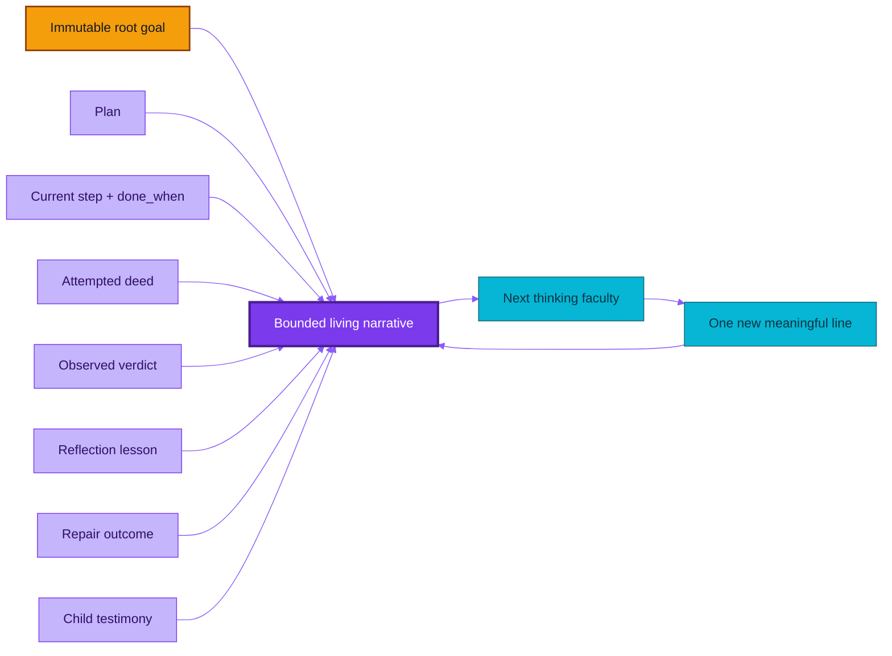

---

## 3. Fresh observation is the organism's present tense

The narrative says what happened before.

The observation says what the world looks like now.

These must not be confused.

A previous observation cannot prove the effect of a later action.

An element identifier from a previous scan cannot safely name a current element.

A successful return value cannot prove that a downstream application visibly changed.

The corrected organism waits five seconds before every observation.

The wait is centralized in the observation entry point.

This is important.

The executor does not need to sprinkle arbitrary sleeps through generated scripts merely so the verifier sees a settled application.

One configured delay applies to initial observations, action observations, explicit observations, and repair observations.

The delay is behavior in the wiring.

The Python mechanism merely reads and applies it.

---

## The three substrates work together

The wiring without narrative is form without lived continuity.

The narrative without wiring is memory without a body that knows how to move.

Observation without either is perception without purpose or interpretation.

The root goal binds the three.

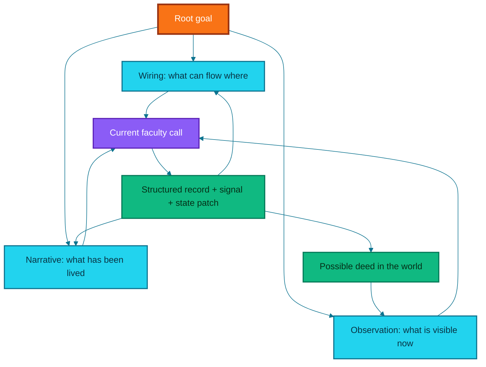

---

# Part III — The living wheel

## The current topology has twenty named node instances

Some node instances share the same Python implementation.

For example, the guidance node has a planning instance and an action instance.

The observation node has planning, action, verification, repair-baseline, and repair-verification instances.

The instance suffix changes its place in the graph without requiring another source file.

This is one way the system reuses code instead of multiplying mechanisms.

The twenty current node instances are:

1. planner;

2. scheduler;

3. planning guidance;

4. action guidance;

5. planning observation;

6. action observation;

7. verification observation;

8. action framing;

9. verifier;

10. reflector;

11. self-modifier;

12. repair probe author;

13. repair baseline observation;

14. repair dispatcher;

15. repair after-observation;

16. repair validator;

17. satisfied/rest node;

18. child-spawn node;

19. executor;

20. runner.

This list is not duplicated in Python as a behavior registry.

The live wiring is the source of truth.

---

## The main task circulation

The main circulation begins with guidance.

Guidance can fold in a human note from the guidance file.

The organism then waits five seconds and observes.

The planner writes the complete remaining intent as atomic steps.

Every step has a description and a done-when condition.

The scheduler selects the next step.

The action side takes another settled observation.

The executor authors Python.

The runner executes that Python in one general capability namespace.

The verification side takes another settled observation.

The verifier compares the deed, the current step, and the fresh world.

A confirmed step returns to the scheduler.

A denied step enters reflection.

```mermaid
%%{init: {"theme":"base","themeVariables":{"background":"#0f172a","primaryTextColor":"#f8fafc","lineColor":"#93c5fd"}}}%%
flowchart LR
    GP["Guidance: plan"] --> OP["Observe: plan"]
    OP --> PL["Planner"]
    PL --> SC["Scheduler"]
    SC -->|"step ready"| GA["Guidance: act"]
    GA --> OA["Observe: act"]
    OA --> EX["Executor authors code"]
    EX --> RUN["One runner executes"]
    RUN --> OV["Observe: verify"]
    OV --> VER["Verifier"]
    VER -->|"step confirmed"| SC
    VER -->|"step denied"| REF["Reflection junction"]
    SC -->|"plan exhausted"| SAT["Satisfied"]
    SAT --> HALT["halt signal"]
    classDef counsel fill:#f59e0b,stroke:#fef3c7,color:#111827;
    classDef eye fill:#06b6d4,stroke:#cffafe,color:#083344;
    classDef thought fill:#8b5cf6,stroke:#ddd6fe,color:#ffffff;
    classDef hand fill:#2563eb,stroke:#dbeafe,color:#ffffff;
    classDef proof fill:#22c55e,stroke:#dcfce7,color:#052e16;
    classDef rest fill:#ec4899,stroke:#fce7f3,color:#ffffff;
    class GP,GA counsel;
    class OP,OA,OV eye;
    class PL,SC,REF thought;
    class EX,RUN hand;
    class VER proof;
    class SAT,HALT rest;
```

---

## The reflection junction prevents a fatal linear wheel

A linear failure loop would send every denial back to the same action path.

That would repeat mistakes.

It would also make self-evolution an architectural afterthought or a crash handler.

The corrected reflection junction has six peer choices.

### Retry

Retry means the present capability is sufficient but the last script or tactic was wrong.

The organism returns through guidance and takes a new observation before authoring a different deed.

### Replan

Replan means the current step or ordering is wrong.

The organism returns to the planner and rewrites the complete remaining intent.

### Frame

Frame means the current visible target requires a carefully aimed strike.

The framing node uses the current fresh observation.

It names the screen summary, target, strategy, risk, and notes.

It then routes directly to the executor.

No observation intervenes, so the current ephemeral short identifiers remain valid.

### Evolve

Evolve means the broad body, prompt, contract, observation mechanism, or code genuinely lacks what the task requires.

The reflector chooses this route.

No failure-count threshold chooses it.

The kernel does not decide that three failures automatically mean evolution.

### Topology patch

Topology patch is a more specific form of evolution.

It carries an intended graph change to the self-modifier.

This makes rewiring a first-class possibility instead of forcing every change into new Python.

### Spawn

Spawn means a bounded independent investigation could return useful testimony.

The reflector must name a concrete child sub-goal.

The child runs its own complete wheel.

The parent later receives the child's narrative and reflects again.

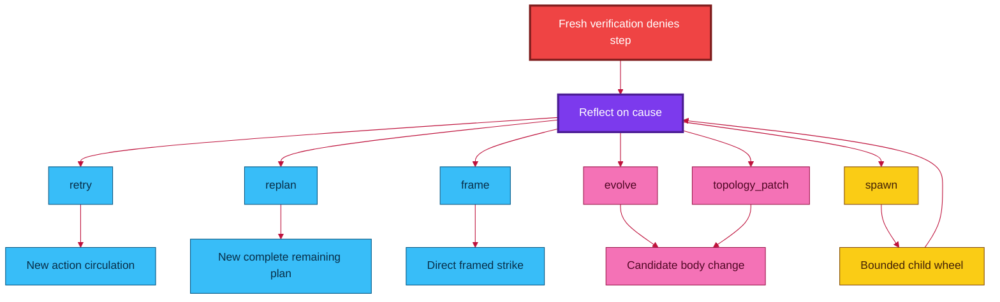

The six routes are not ranked from normal to exceptional.

They are alternatives.

Self-evolution is not a last resort imposed by architecture.

It is a peer faculty chosen by the organism when its diagnosis supports that choice.

---

## Fan-out and barriers make the kernel fractal-ready

An edge target may be one node name.

An edge target may also be a list of node names.

A list creates multiple frontier branches.

The current kernel processes those branches through a frontier queue.

This is nonlinear topology support.

It is not parallel threading.

Branches currently execute sequentially in frontier order.

A barrier can wait for a configured number of arrivals before releasing a join node.

The current shipping wiring has no active barriers.

The mechanism exists and is tested.

The organism may later rewire itself to use fan-out and barriers when a real goal justifies them.

This distinction matters.

The seed is capable of a richer graph than the current graph actively uses.

The architecture should not pretend dormant potential is already realized behavior.

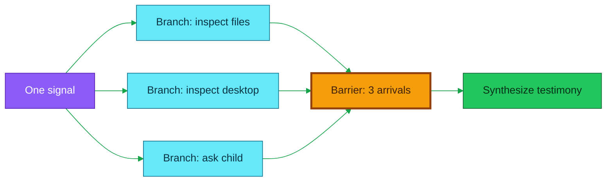

---

## Terminal names are signals, not imaginary nodes

The wheel knows two terminal signals.

`halt` means the organism has come to rest.

`wait` means the organism has paused while preserving the remaining frontier.

These names are not Python modules.

A valid terminal edge emits a signal with the same terminal name.

A topology that merely targets a nonexistent node called `halt` from some unrelated signal is incoherent.

The topology checker rejects that error.

This small rule prevents the dynamic loader from trying to import a terminal condition as if it were a faculty.

---

## A dead frontier is an error, not silent completion

If the frontier becomes empty without a terminal signal, the kernel raises a topology contract error.

This is intentional.

A graph that simply runs out of destinations has not proved success.

It has dead-ended.

The organism must be rewired so every nonterminal path continues.

---

# Part IV — Internal data flow

## Every node returns the same outer shape

A node emits three important things.

It emits a signal.

It emits a state patch.

A thinking node also carries a structured record.

Evidence may accompany the record.

The signal determines where the wheel goes.

The patch changes what the organism knows about itself.

The record captures the thinking faculty's contract-bound answer.

The evidence says what that answer was based on.

The bus normalizes this into one node-output shape.

This means the kernel does not need separate execution rules for every faculty.

It calls a node.

It validates the emitted signal against the live outgoing edges.

It merges the patch into state.

It extends the frontier with the wired successor or successors.

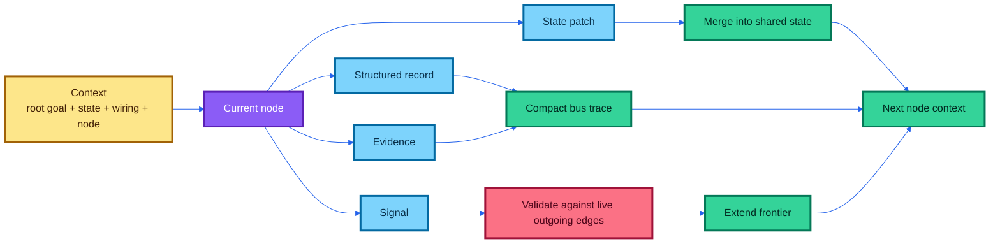

---

## The eight thinking record types

The current wiring defines eight structured record contracts.

### Plan

The plan record contains a nonempty ordered list called `intent`.

Each list item must contain a step description and a done-when condition.

### Action frame

The action-frame record contains:

- the next signal;

- a screen summary;

- a target;

- a strategy;

- a risk level;

- execution notes.

### Execution

The execution record contains one nonempty Python program in `code`.

### Verification

The verification record contains a Boolean success decision and a factual reason.

### Reflection

The reflection record contains:

- the next signal;

- a lesson;

- a causal diagnosis;

- a child sub-goal when spawning;

- or a topology proposal when requesting a topology patch.

### Git evolution patch

The evolution record contains:

- a summary;

- a rationale;

- the files it read;

- complete file replacements;

- file deletions;

- wiring patch operations;

- structural validation commands;

- a concrete expected behavioral validation.

### Repair probe

The repair-probe record contains:

- the exact original failure signature;

- a minimal experiment description;

- a done-when condition;

- a comparison basis;

- executable probe code.

### Repair validation

The repair-validation record contains:

- a Boolean resolution decision;

- a before/after comparison;

- a factual conclusion.

Mechanical nodes do not receive fake prompts or fake thinking records.

The scheduler, guidance, observation, runner, repair dispatcher, satisfied node, and spawn adapter do mechanical work.

That separation reduces prompt bloat and avoids pretending that every transition requires an LLM.

---

## Allowed signals are discovered from outgoing edges

The system does not maintain one list of outgoing signals in the topology and another list in a prompt schema.

That duplication would drift.

Instead, a thinking node's legal `next_signal` values are generated from its current outgoing edges.

If the reflector is wired with six routes, its structured schema offers those six routes.

If the wiring later removes one route, the route disappears from the schema.

If the wiring adds a coherent new route, the route appears without editing a second enum.

This is a concrete example of behavior emerging from topology.

---

## A node learns what to produce by reading its consumers

Before a thinking call, the brain layer inspects the node's outgoing edges.

It resolves the downstream node or nodes.

It reads their declared contracts from source docstrings or declarative node descriptions.

It appends those consumer contracts to the model context.

The producer therefore learns what its output will feed.

This is live contract discovery.

It matters because rewiring changes not only destination but also the producer's understanding of what the next faculty expects.

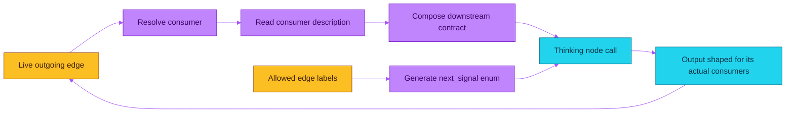

This mechanism is stronger than a static tool description but weaker than magical semantic understanding.

A vague or incorrect consumer description will still teach the producer badly.

The description is live truth only if the body describes itself honestly.

Self-evolution can correct that description.

Behavioral proof must then show that the correction matters.

---

## The state is shared, but not every field is persisted

The live in-memory state can hold exact heavy evidence.

Examples include:

- the full ephemeral action index;

- the current observation artifact;

- the authored execution artifact;

- exact execution results;

- exact code;

- turn-level action events;

- full repair-validation context.

Those values are useful during the current turn.

They can be large.

They can contain identifiers that become invalid after a later observation.

They are therefore omitted from the persisted runtime snapshot.

The snapshot keeps the compact narrative, plan, step, recent summaries, and operational continuity needed within the process.

The current design starts every invocation from zero and removes the previous runtime state at startup.

There is no resume flag.

This is deliberate simplification.

It avoids pretending stale UI identifiers or half-finished repair state can safely be resumed after an arbitrary restart.

It also means the organism is not currently a crash-resumable service.

That is a real limitation, not a hidden feature.

---

## Important state fields in normal language

`goal` is the immutable root goal for this invocation.

`effective_goal` is the root goal plus the bounded narrative.

`plan.intent` is the complete remaining plan produced by the planner.

`step` is the current position in that plan.

`current_step` contains the active description and done-when condition.

`desktop_tree_text` is the compact rendered current desktop.

`action_index` maps current short identifiers to exact actionable element metadata.

`observed_at` timestamps the current observation.

`last_action_at` timestamps the most recent runner deed.

`turn_executions` carries exact evidence from the current runner turn.

`last_verification` summarizes the most recent task verdict.

`last_reflection` summarizes the most recent lesson and diagnosis.

`failure_streak` identifies repeated equivalent failures without forcing a route.

`repair_validation` holds the full current candidate proof context in memory.

`self_modify` summarizes the current evolution lifecycle.

`frontier` lists queued branches.

`barrier_arrivals` records outstanding join arrivals.

`_depth` records child recursion depth.

`tick` is a monotonic lap counter used for sequencing and unique identities.

It is not a wall-clock deadline.

---

# Part V — The eye

## Why the five-second delay exists

The attached run evidence showed a classic automation race.

The organism acted.

The application had not finished changing.

The verifier observed too soon.

It then judged the old screen as if it were the effect of the new action.

That creates false denials.

Worse, repeated false denials can produce false diagnoses and unnecessary self-modification.

The corrected design places one five-second settling delay at the beginning of the central observation function.

The sequence is now:

1. enter observation;

2. wait five seconds;

3. load the wired observation phases;

4. scan the desktop;

5. filter and map the result;

6. timestamp the completed fresh observation;

7. hand it to the next faculty.

The wait is not scattered across generated action scripts.

The wait is not repeated inside every scanning phase.

There is one configured settle point before each observation.

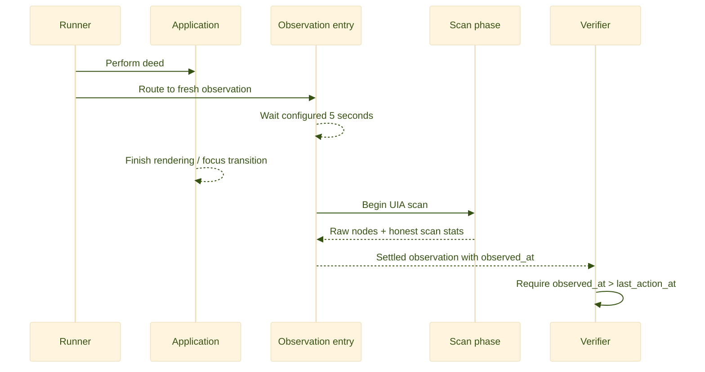

The five seconds are not guaranteed to be optimal for every application.

Some actions settle in milliseconds.

Some downloads take minutes.

The setting is a robust default for the failure that was observed.

Because it lives in wiring, the organism can later change it or evolve more context-sensitive observation if evidence justifies that complexity.

---

## Observation is split into three swappable phases

The eye is not one monolithic function.

The wiring names three phase modules.

### Scan

The scan phase probes points across the configured screen area.

It uses Windows UI Automation to harvest subtrees.

It merges repeated elements by stable raw identity within that observation.

It returns raw nodes, screen dimensions, and scan statistics.

### Filter

The filter phase ranks usable nodes.

It keeps actionable on-screen elements.

It tracks per-window and global selection limits.

It retains focus information.

It reports how many elements were dropped instead of silently stopping.

### Build

The build phase reconstructs visible windows and their selected elements.

It marks the top z-order window as active.

It marks the actual keyboard-focused element.

It assigns compact `W` and `e` identifiers.

It produces the rendered desktop tree.

It produces the exact action index used by the runner.

It reports whether the LLM-facing tree hit a limit.

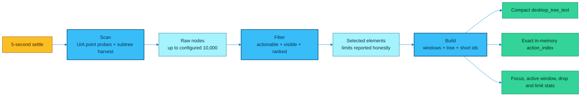

---

## The corrected scan is deep again

The reduced after-run configuration used a 256-pixel probe step.

On a 1920 by 1080 screen, the logs repeatedly showed only 26 probes.

That was fast.

It was also too shallow for reliable general desktop operation.

The corrected wiring restores a 64-pixel step.

It permits up to 2,000 nodes from one probed subtree.

It permits up to 10,000 unique raw nodes across the scan.

The filter may retain up to 500 actionable elements.

It may retain up to 120 per window.

The rendered model-facing tree may contain up to 1,000 nodes.

Text labels may contain up to 1,000 characters.

The maximum rendered depth is 10.

These are still limits.

They are much less shallow than the failed reduction.

The system reports when a limit is reached.

That lets verification refuse to treat a truncated view as complete evidence.

---

## Short identifiers are observation-local names

The raw UI Automation identity can be long and unstable across application changes.

The builder gives every visible selected element a short name such as `e17`.

Windows receive short names such as `W1`.

The compact tree uses those names.

The action index maps those names to coordinates, bounds, role, action, window handle, automation identifier, class, depth, and focus state.

The executor can call `click_node("e17")`.

The runner resolves `e17` against the exact latest action index.

After another observation, the identifiers are reminted.

An old `e17` must not be assumed to refer to the same thing.

This rule prevents a particularly dangerous illusion: treating an integer-like label as a durable selector.

It is not durable.

It is a temporary coordinate in one perceived moment.

---

## Focus and active-window markers are evidence, not decoration

The old failure report repeatedly described this mismatch:

- the plan expected PowerShell to be active;

- the observed focus remained in Notepad;

- a click returned success;

- the intended application state never appeared.

The corrected observation uses the proper UI Automation property identifiers for keyboard focus.

The rendered tree marks the top visible window with `[active]`.

It marks the keyboard-focused element with `[focused]`.

When a done-when condition depends on focus, the verifier is instructed to inspect these markers.

The prompt-facing ID map includes every visible short identifier compactly.

It expands geometry and low-level metadata for focused or action-framed identifiers.

The full action index remains in memory for execution.

This gives the model enough grounding without duplicating every large metadata field into every prompt.

---

## Honest observation limits matter more than a perfect scan claim

No desktop scanner can promise that every application exposes every useful fact through UI Automation.

Canvas applications may expose almost nothing.

Games may render pixels without semantic controls.

Remote desktops may flatten structure.

Browser content may use unusual accessibility trees.

Elements can appear and disappear during the scan.

The corrected system does not solve all of those problems.

It does improve epistemic honesty.

It records:

- probes actually run;

- probes planned;

- unique raw nodes;

- whether the raw-node limit was hit;

- point errors;

- elapsed scan time;

- rendered node count;

- whether the LLM-node limit was hit;

- global dropped elements;

- per-window dropped elements;

- whether the evidence is truncated.

The verifier can deny a claim when the required fact may have been omitted.

That is better than silently presenting a partial view as the whole desktop.

---

# Part VI — The hand

## There is one executor and one runner

The executor thinks.

It authors one Python program for the current atomic step.

The runner does not think.

It loads the authored artifact and executes it in the capability namespace.

The runner records standard output, standard error, returned result, action events, exceptions, code hash, and code size.

This keeps authorship separate from enactment.

It also avoids a growing zoo of “browser agent,” “terminal agent,” “editor agent,” and “file agent” loops.

One Python language can compose all of those faculties when the environment permits them.

---

## The executor's capability namespace

The current namespace exposes recorded helpers for:

- coordinate clicking;

- clicking a current short identifier;

- reading a current short identifier;

- Unicode text entry through the clipboard;

- key presses;

- hotkeys;

- scrolling;

- opening a URL in a named or default browser;

- taking an explicit settled observation;

- resolving a current element by identifier;

- consulting the configured model;

- web search;

- opening a web page as text;

- full file reads with size and hash;

- full file writes with size and hash;

- GitHub issue operations through the `gh` command;

- Git push;

- current Git branch inspection.

It also exposes ordinary Python modules:

- `subprocess`;

- `os`;

- `sys`;

- `json`;

- `time`;

- `pathlib`;

- the research tools module;

- the desktop module.

The list is descriptive rather than a sandbox boundary.

The authored Python can import other available modules and call operating-system facilities under the process's actual permissions.

---

## Helpers are prebound top-level names

This detail caused the most important failure in the new logs.

The capability manifest named `hotkey`, `type_text`, and `press_key`.

Those helpers were already bound as top-level globals in the runner namespace.

The generated execution script incorrectly wrote:

```python
from tools import hotkey, type_text, press_key
```

The research-tools module did not export those GUI helpers.

The script raised `ImportError` before it performed any action.

The organism then diagnosed a missing body capability and evolved `tools.py`.

That diagnosis was wrong.

The body already had the capability.

The generated script used the manifest incorrectly.

The correct program shape was simply:

```python
hotkey("ctrl", "l")
type_text("https://huggingface.co/spaces")
press_key("enter")
```

The corrected prompts now say this explicitly.

They also tell reflection that importing a manifest helper from `tools` is a script error to retry, not proof that the body lacks the helper.

This is an example of a prompt correction being better than adding duplicated wrapper code.

---

## Direct process and file access are first-class

If the goal concerns a directory listing, the organism does not need to open PowerShell and visually type `Get-ChildItem`.

It can use `pathlib`, `os`, or `subprocess` directly.

If the goal requires a visibly active PowerShell window, then opening and verifying that window may still be necessary.

The distinction comes from the done-when condition.

For a file fact, direct inspection is usually the shortest deterministic faculty.

For a visible UI state, UI observation is the relevant proof.

For a file mutation whose downstream application must react, both direct mutation and fresh UI evidence may be required.

This is how the system avoids imitating a human hand when a more reliable computer-native route exists.

It also avoids claiming that direct filesystem success proves a human-facing application has visibly updated.

---

## Arbitrary code is an action language, not a success oracle

Executing arbitrary Python makes the hand highly expressive.

It can create a parser the original developers never anticipated.

It can invoke a local model.

It can start a process.

It can edit source.

It can communicate with an available API.

It can inspect files.

It can synthesize a task-specific adapter.

It can even create another local program that continues working outside the immediate step.

But code execution does not prove the desired effect occurred.

The code may raise an exception.

The code may return success while the target application ignores it.

The code may act on the wrong window.

The code may lack permission.

The code may depend on a network service that is down.

The code may misunderstand the goal.

The code may irreversibly damage state.

The verifier remains necessary because expressive action and truthful completion are different problems.

---

# Part VII — The witness

## Only observed effect counts

The verifier receives:

- the immutable root goal;

- the exact current step;

- the exact done-when condition;

- compact narrative focus;

- exact runner evidence;

- the settled post-action observation;

- freshness information.

It must judge only the current step.

It must not reward effort.

It must not reward eloquence.

It must not reward a returned `ok: true` when the done-when concerns a visible effect.

It must deny stale, contradictory, proxy-only, wrong-step, or truncated evidence.

It must name the missing observable fact.

---

## Evidence strength depends on the claim

| Claim | Evidence that may be sufficient | Evidence that is not sufficient |
|---|---|---|
| “The file contains this exact text.” | A fresh direct file read with full content or hash | A write helper returning success |
| “PowerShell is active and ready.” | A settled observation showing the active terminal and focused input/cursor evidence | A process identifier or `Popen` return alone |
| “The browser reached the target page.” | A settled observation showing the target document/title/content | Pressing Enter in the address bar |
| “The directory was listed.” | Captured deterministic directory entries | Merely launching a terminal |
| “The report is visible in Notepad.” | A settled observation showing the report in the active editor | A file existing on disk |
| “The self-repair fixed the mechanism.” | A probe exercising the original failure with a concrete before/after change | Compilation, a commit, or changed prompt text alone |
| “The chess move was accepted.” | The newly rendered board or move history showing the move | Sending move text |
| “The whole goal is complete.” | Every step in the current complete plan was individually verified | A planner asserting no more work is needed |

The same fact can require different evidence under a different goal.

If a goal only asks to create a file, a direct read may be enough.

If a goal asks to leave that file open for a human, a visible application state is also required.

---

## Freshness is mechanical before it is semantic

The normal verifier computes whether the current observation happened after the last action.

The repair validator is stricter.

It requires:

- a pre-probe observation after the probe was authored;

- the exact authored probe code to have been executed;

- a post-probe observation after the pre-probe observation;

- execution evidence from the runner;

- an exact match between the probe code hash and the executed code hash.

Only after those mechanical checks does the model compare meaning.

This prevents a model from validating a repair against the wrong action or the wrong picture.

---

## Verification does not make the system infallible

The verifier is still a model interpreting partial evidence.

It can make a false positive.

It can make a false negative.

The UI tree can omit the decisive fact.

The done-when condition can be badly written.

The application can present a misleading state.

The evidence can be technically fresh but semantically irrelevant.

The architecture makes proof explicit and contestable.

It does not solve the general philosophical problem of knowing the world with certainty.

That honest limit should remain visible.

---

# Part VIII — The self-evolution sub-wheel

## Self-evolution starts with a reasoned choice

The reflector may choose `evolve` or `topology_patch` after a denied step or rejected repair.

The choice should be based on causal diagnosis.

Examples of genuine body defects include:

- a useful current UI fact is never observed because the scan mechanism omits it;

- the executor's declared manifest and actual runtime disagree;

- the topology has no route for a repeatedly justified kind of recovery;

- a prompt systematically rewards proxy evidence;

- a dynamically loaded node is missing or incoherent;

- a generic process capability required by many goals does not exist;

- activation policy misclassifies a live change;

- known-good rollback cannot restore a newly created file correctly.

Examples that are usually not body defects include:

- a generated script imported a prebound helper from the wrong module;

- a current short UI identifier was reused after another observation;

- a search query was poor;

- the current plan chose the wrong page;

- a click missed a visible target that can be reframed;

- a remote service returned a temporary application error;

- the model simply wrote invalid task code once.

The boundary is not absolute.

Repeated script mistakes can justify a prompt correction.

Repeated target ambiguity can justify a better action-frame mechanism.

The point is to repair the broad cause, not to encode the benchmark instance into permanent source.

---

## A candidate is untrusted until behavior changes

The self-modifier reads the live tracked source.

It also sees the dirty workspace.

It sees topology, activation policy, current failure, prior observation, and the captured repair baseline.

It proposes complete file contents or precise wiring operations.

The body applies the patch atomically as far as its touched files are concerned.

The body validates syntax, JSON, wiring, and topology coherence.

The body creates a candidate commit.

The known-good marker does not move yet.

The repair-probe node authors a minimal experiment tied to the exact original failure signature.

The system takes a settled before-observation.

The runner performs the probe.

The system takes a settled after-observation.

The repair validator compares the captured before-state and the exact after-state.

If resolved, the candidate is accepted and the marker advances.

If unresolved, the exact pre-candidate snapshot is restored and a rollback commit records that restoration.

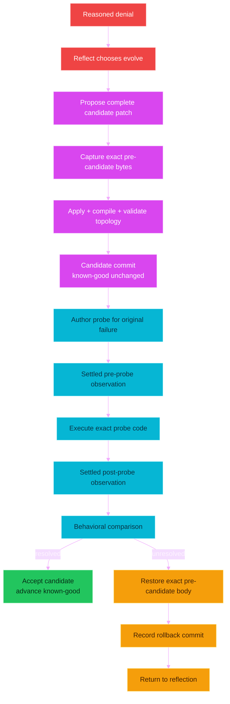

---

## Structural validation and behavioral validation are different

Structural validation asks:

- does every Python file compile?

- does the wiring parse?

- do required keys exist?

- does every node have edges?

- do all nonterminal targets name real nodes?

- are all nodes reachable?

- are barrier declarations coherent?

- do prompts refer to known record contracts?

- do dynamic node files exist?

Behavioral validation asks:

- did the previously failing mechanism now behave differently?

- did the exact probe exercise that mechanism?

- was the relevant after-effect freshly observed?

- does the comparison satisfy the promised expected validation?

A patch can be structurally perfect and behaviorally useless.

The rejected repair in the attached logs demonstrated exactly that.

It changed source and wiring.

It committed successfully.

The same `ImportError` occurred in the probe.

The target page did not appear.

The repair validator correctly concluded that the repair was ineffective.

That rejection was healthy behavior.

The wrong part was the earlier diagnosis that caused the unnecessary mutation.

---

## Immediate and next-run activation

Some files are dynamically loaded on each use.

Changes to those files can be tested in the current process.

The current activation policy treats these as immediate:

- `wiring.json`;

- node modules whose names begin with `node_`;

- capability modules whose names begin with `cap_`;

- transport modules whose names begin with `transport_`.

Other Python changes are classified as next-run.

That includes already-imported core modules.

A repair validator must not claim a next-run core change is live merely because the file on disk changed.

This is a subtle but essential truth for a self-rewriting process.

The body on disk and the body currently executing are not always identical.

---

## Dirty copy-overwrite installation is now anchored correctly

This distribution is installed by copying files over an existing checkout.

That normally leaves many tracked source files dirty relative to the old Git head.

A candidate commit that included only one later self-modified file would create a dangerous mixed tree.

The known-good marker could then point to:

- one new candidate file;

- many obsolete pre-install files;

- while the live worktree contained the corrected architecture.

The corrected evolution commit snapshots the complete tracked evolvable body.

Runtime-prefixed files are excluded.

Newly authored candidate files are included through the candidate's explicit changed-file list.

This means the first behaviorally accepted evolution after a copy-overwrite installation can anchor the actual live body rather than a hidden mixture of old and new source.

This behavior is covered by the rebuild verification suite.

---

## Known-good is a continuity anchor, not a claim of perfection

The private Git reference records the last accepted body.

Acceptance means one concrete repair probe proved its expected behavior.

It does not mean every feature of the entire organism was exhaustively proven.

No practical probe can prove all future behavior of arbitrary code.

The marker is therefore “last body trusted enough under observed evidence,” not “mathematically perfect organism.”

That distinction should guide future evolution policy.

A narrow probe should not justify a grand narrative of universal correctness.

It can justify advancing from one known concrete failure to one observed resolution.

---

# Part IX — The fractal child

## A child is another complete organism, not a lightweight model call

When reflection chooses `spawn`, it must provide a nonempty sub-goal.

The spawn capability invokes the same core organism recursively.

The child receives:

- its own root sub-goal;

- its own effective narrative;

- an incremented recursion depth;

- its own runtime state file;

- the same canonical live wiring and source body.

The child may plan, observe, act, verify, reflect, spawn again, or choose self-evolution.

When it rests or otherwise returns, its final narrative becomes testimony in the parent narrative.

The parent then reloads the live wiring.

That reload matters because the child may have evolved the shared body.

The parent reflects on what the child found rather than automatically treating child testimony as task completion.

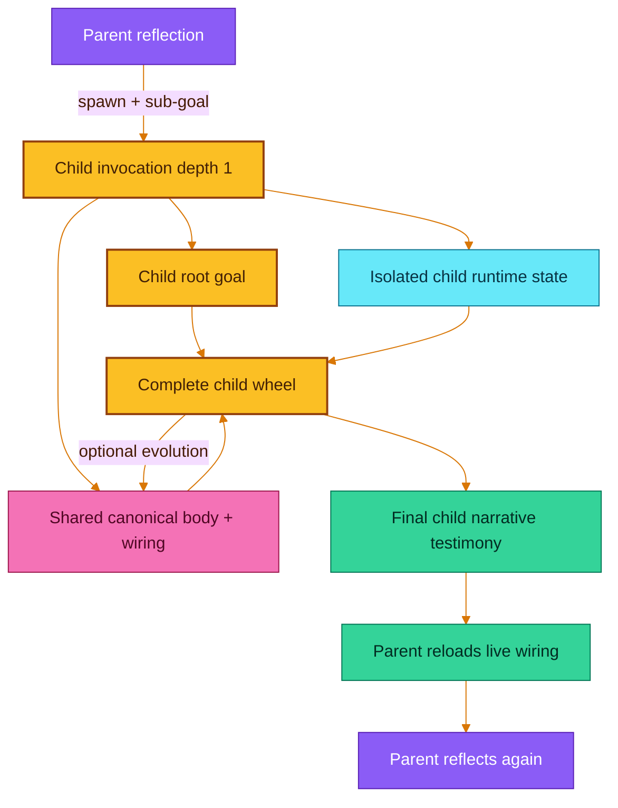

---

## Child state is isolated; the body is shared

This balance is intentional.

If child state were not isolated, the child's planner and observations could overwrite the parent's current task state.

If the child body were isolated, a valuable child evolution would disappear when the child returned.

The current implementation therefore isolates narrative runtime state with an invocation-local path override.

That override is private metadata.

It is never persisted into `wiring.json`.

The canonical body remains shared.

After return, the parent reloads wiring so a child-authored graph change becomes visible.

---

## Recursion is bounded at depth three

The current wiring sets maximum recursion depth to three.

At the limit, a requested child is not started.

The narrative records that the line of descent reached its maximum depth.

This is a hardcoded value in wiring, not in the recursion mechanism.

The organism can evolve the value.

The limit exists to prevent uncontrolled recursive descent in the seed architecture.

It also constrains genuine open-ended fractal behavior.

That tradeoff is discussed later under hardcoded constraints.

---

## The current child is blocking, not concurrent

The parent waits while the child runs.

This makes state and testimony easier to reason about.

It does not provide parallel independent work.

The frontier supports multiple queued branches.

The current kernel still executes them sequentially.

True concurrent organisms would require additional coordination, evidence attribution, body-write arbitration, and known-good semantics.

Those mechanisms are not present today.

The architecture has a fractal form without claiming distributed concurrency it does not yet implement.

---

# Part X — How to read the wiring

## Start with the topology, not the filenames

The fastest way to understand the organism is to read three wiring fields together.

Read `topology.cycle_start`.

That tells you where a new invocation begins.

Read `topology.nodes`.

That tells you which node instances exist.

Read `topology.edges`.

That tells you what every emitted signal means mechanically.

For example, the current reflector has these conceptual routes:

```text
retry          -> action guidance
replan         -> planner
frame          -> action framing
evolve         -> self-modifier
topology_patch -> self-modifier
spawn          -> child-spawn node
```

This is more informative than reading the reflection source in isolation.

The source explains how a reflection record changes state.

The wiring explains where that record can send the organism.

---

## Read an edge as a sentence

The general edge form is:

```text
source node --emitted signal--> target node or target nodes
```

For example:

```text
node_verify --step_denied--> node_reflect
```

Read this as:

> When the verifier emits `step_denied`, the next faculty is reflection.

Another example:

```text
node_run --done--> node_observe:verify
```

Read this as:

> When the ordinary execution runner finishes, the organism must take a fresh verification observation before any verdict.

Another example:

```text
node_run --repair_done--> node_observe:repair_verify
```

Read this as:

> When the runner finishes a repair probe, it enters the separate repair-after-observation route rather than ordinary task verification.

The signal name is part of the meaning.

Changing only a target can materially change the organism's behavior.

---

## Instances reuse one node body in several places

A name such as `node_observe:verify` has two parts.

`node_observe` is the base plugin name.

`verify` is the instance label.

The loader imports `node_observe.py`.

The context still contains the full instance name.

The topology may therefore use one observation mechanism in several semantically different positions.

This reduces source count.

It also makes global observation changes possible through one mechanism and one wiring configuration.

---

## Some thinking nodes can live entirely in wiring

The action-frame node is declarative.

Its prompt key, record type, signal source, payload construction, evidence construction, and state patch are described as data.

The generic declarative-node engine materializes it at runtime.

This is useful for simple thinking nodes whose behavior is composition rather than bespoke Python logic.

It proves that adding a node does not always require adding source.

The organism can sometimes change its cognitive shape with a wiring patch alone.

That is exactly the direction encouraged by “rewire and reuse before adding code.”

---

## The wiring sections in normal language

### `schema`

This identifies the wiring document format.

### `model`

This selects the transport, remote model, request settings, reasoning settings, timeout, optional call budget, stable-source prefix, and per-record tuning.

### `paths`

This names the node, transport, capability, runtime-state, and guidance locations.

Paths are relative to the organism root unless explicitly absolute.

### `observe_config`

This configures the central settle delay, scan phase, filter phase, build phase, screen probe density, raw-node limits, selection limits, rendered depth, and prompt-facing tree size.

### `self_modify`

This configures the known-good reference, rollback behavior, Git remote and push policy, self-modifier web-search scope, evolvable file classes, runtime-file exclusions, and activation classes.

### `topology`

This declares the starting point, node instances, signal edges, and optional barrier arities.

### `prompts`

This holds the role-specific instructions for thinking nodes.

### `prompt_aliases`

This can redirect several prompt keys to shared prompt text.

The current corrected wiring does not need aliases.

### `shared_prompt_prefix`

This is the common identity and discipline given to every thinking faculty.

### `record_contracts`

This defines required fields, types, enums, nonempty fields, and additional-property rules for structured model output.

### `node_defs`

This describes data-defined nodes materialized by the generic engine.

### `capabilities`

This is the executor-facing manifest of prebound helpers, ordinary modules, state fields, and power description.

### `fractal`

This currently defines the maximum child-recursion depth.

---

## Where to look when behavior is wrong

If the system chooses the wrong route after denial, inspect:

- reflector prompt;

- reflection record contract;

- reflector outgoing edges;

- the denial evidence passed to reflection.

If the model generates the wrong action code, inspect:

- executor prompt;

- capability manifest;

- current observation brief;

- current action frame;

- exact generated code;

- runner exception.

If the verifier accepts proxy evidence, inspect:

- verifier prompt;

- done-when quality;

- observation freshness;

- execution-evidence construction;

- observation truncation flags.

If the scanner misses useful elements, inspect:

- probe density;

- raw-node limit;

- UI Automation exposure;

- filter rules;

- per-window limit;

- rendered-node limit;

- active/focus markers;

- drop statistics.

If a repair is wrongly accepted, inspect:

- captured failure signature;

- repair baseline;

- expected validation;

- authored probe code;

- executed code hash;

- pre-probe observation;

- post-probe observation;

- validator comparison.

If a child corrupts parent state, inspect:

- child state-path override;

- private wiring metadata persistence;

- recursion depth;

- parent reload after child return.

---

## How a human can safely reason about a wiring change

Use this five-question sequence.

### 1. What signal is currently emitted?

Do not begin from the target you wish existed.

Begin from the actual structured record and signal.

### 2. Where does that signal currently route?

Read the exact outgoing edge.

### 3. What contract will the target present to its producer?

Read the target's source docstring or declarative description.

### 4. What state does the target require?

Check whether the source path has produced that state before the edge fires.

### 5. What fresh behavior will prove the rewiring helped?

Name an observable before/after distinction.

If no behavioral distinction can be named, the rewiring is not ready to trust.

---

## Example: changing the observation delay

Suppose five seconds is too slow for a deterministic file-only workload.

The behavior lives in:

```text
observe_config.hover_cache.settle_seconds
```

A human can change the number in wiring.

The central observation code will apply the new value.

No node prompt needs to change unless the semantics of observation change.

No executor script should add a competing sleep.

The change should be tested on a visible action whose old and new timing can be compared.

---

## Example: adding a second reflection route

Suppose repeated evidence shows a need for an explicit “ask human” pause.

A coherent design would need:

- a target mechanical node or terminal wait behavior;

- an outgoing reflector edge such as `ask_human`;

- a consumer contract describing what question or state must be produced;

- structured reflection support for any additional required data;

- topology reachability;

- a behavioral scenario proving that the route pauses with the right context.

Merely adding `ask_human` to a prompt enum would be wrong.

Allowed signals must come from edges.

Merely adding an edge to a nonexistent Python file would also be wrong.

Topology coherence would reject it.

---

## Example: turning fan-out on

Suppose one reflection should gather two independent kinds of testimony.

An edge may target a list:

```json
{
  "investigate": ["node_child_a", "node_child_b"]
}
```

The frontier will queue both branches.

If their results must join, a barrier node can be configured with arity two.

Both branches must eventually route to that barrier.

The topology checker verifies that the declared arity does not exceed the number of incoming edges.

The system will still run the branches sequentially today.

If true parallelism is required, that is a core architecture evolution rather than a wiring-only change.

---

## Coherence checks are necessary but not sufficient

The topology checker currently proves useful local properties.

It proves the start node exists.

It proves node names are unique.

It proves every node has an edge map.

It proves every nonterminal target names a real node.

It proves every node is reachable from the start.

It proves dynamic node files or declarative definitions exist.

It proves terminal targets are used with terminal signals.

It proves barrier arities are structurally possible.

It proves prompt references and record-contract references are coherent.

It does not prove the graph will achieve a goal.

It does not prove the model will emit useful records.

It does not prove a reachable cycle converges.

It does not prove a self-change is safe.

It does not prove the environment exposes enough evidence.

That is why behavioral verification remains part of the organism.

---

# Part XI — What the attached runs actually showed

## The evidence should be read as a motion, not as one loud error

The after-run request log contains 41 model calls.

Those calls produced:

- 8 plans;

- 11 execution programs;

- 11 task verifications;

- 8 reflections;

- 1 evolution patch;

- 1 repair probe;

- 1 repair validation.

The calls consumed 383,550 prompt tokens in total.

The average call used about 9,355 prompt tokens.

The largest prompt used 29,547 prompt tokens.

The calls produced 7,502 completion tokens and 33,640 reasoning tokens.

The request bodies contained about 1.2 million characters in total.

Those numbers show two things at once.

The organism really did circulate through planning, action, verification, reflection, and evolution.

The circulation was also expensive and repeatedly carried more duplicated operational detail than the useful decision required.

The corrected architecture keeps exact heavy evidence in memory while persisting compact summaries.

It restores deeper observation without blindly duplicating every raw metadata field into the prompt.

---

## The Hugging Face run was partially competent

The root goal in the attached log was essentially:

> Go to Hugging Face, use a free WebGPU space to download a local browser LLM, start it, and play an ASCII chess game until you win.

The organism did reach Hugging Face.

It observed a real Hugging Face Space.

The observation identified a browser document, links, buttons, a Gradio document, text inputs, sliders, and focus state.

It planned multiple times.

It attempted navigation and search.

It verified that the visible page was the wrong kind of Space.

It did not claim the chess goal was complete.

It reflected on the failure.

It proposed a candidate repair.

It authored a behavioral probe.

It observed that the same failure remained.

It rejected the repair.

Those are meaningful capabilities.

The run was not successful, but it was not random button pressing.

---

## The same run exposed four causal defects

### Defect 1: the helper invocation contract was misunderstood

The script imported GUI helpers from the research-tools module.

The helpers were already top-level runtime names.

The script failed before any action event was recorded.

### Defect 2: reflection confused a script defect with a body defect

The reflector concluded that `tools.py` lacked `hotkey`.

That conclusion caused unnecessary source evolution.

### Defect 3: the repair probe repeated the same malformed import

The probe did not exercise the actual prebound helper mechanism.

It repeated the original script construction error.

### Defect 4: observation had been reduced too aggressively

The after-run configuration used a 256-pixel step and repeatedly reported 26 probes.

It could see useful elements on the current page, but the general eye was too shallow for reliable desktop replacement work.

The run also carried large duplicated element metadata into prompts.

The reduction achieved speed at the cost of generality while failing to control prompt size where it mattered.

---

## The repair rejection was correct

The candidate claimed it would export `hotkey` through `tools.py` and make that file immediately active.

The probe expected two changes:

- the helper import would no longer fail;

- the browser would show a filtered Text Generation/WebGPU Spaces page.

The after-observation still showed the previous Wan2.2 image/video Space.

The same `ImportError` occurred.

The repair validator concluded:

> The repair was ineffective because the helper export and navigation were not achieved in the current process.

That was the right verdict.

The known-good marker did not advance.

The corrected system preserves this strict rejection behavior.

It changes the earlier prompts and routing so the organism is less likely to invent the wrong repair in the first place.

---

## Corrected flow for the malformed-helper scenario

The exact corrected route should look like this.

1. The runner executes a script containing `from tools import hotkey`.

2. Python raises `ImportError` before any action event occurs.

3. The normal post-action observation still happens after the central five-second wait.

4. The verifier denies the step because the target page is absent and the execution failed.

5. Reflection reads the capability manifest and the exact code.

6. Reflection recognizes that `hotkey` is already a prebound top-level helper.

7. Reflection chooses `retry`, not `evolve`.

8. Action guidance receives the lesson.

9. A fresh observation remints current UI identifiers.

10. The executor authors code calling `hotkey`, `type_text`, and `press_key` directly.

11. The runner records the actual hotkey, typing, and keypress events.

12. The verification observation waits five seconds before scanning.

13. The verifier checks for the target page title and relevant content.

14. If the page is still wrong, reflection diagnoses navigation, query quality, focus, or page availability from evidence.

15. Only a demonstrated general body defect should route to self-evolution.

```mermaid
%%{init: {"theme":"base","themeVariables":{"background":"#fef2f2","primaryTextColor":"#450a0a","lineColor":"#dc2626"}}}%%
flowchart LR
    BAD["Script imports hotkey from tools"] --> ERR["ImportError\nzero action events"]
    ERR --> OBS["5-second settled observation"]
    OBS --> DENY["Verifier denies target page"]
    DENY --> DIAG["Reflection: script used manifest wrongly"]
    DIAG -->|"retry"| FRESH["Fresh action observation"]
    FRESH --> GOOD["Call prebound hotkey directly"]
    GOOD --> ACTS["Recorded GUI events"]
    ACTS --> AFTER["5-second settled after-picture"]
    AFTER --> CHECK["Verify actual target page"]
    classDef bad fill:#ef4444,stroke:#7f1d1d,color:#ffffff;
    classDef witness fill:#38bdf8,stroke:#075985,color:#082f49;
    classDef reason fill:#8b5cf6,stroke:#5b21b6,color:#ffffff;
    classDef action fill:#fbbf24,stroke:#92400e,color:#422006;
    classDef proof fill:#22c55e,stroke:#166534,color:#052e16;
    class BAD,ERR bad;
    class OBS,AFTER witness;
    class DENY,DIAG reason;
    class FRESH,GOOD,ACTS action;
    class CHECK proof;
```

---

## Corrected flow for the old PowerShell and directory scenario

The older failure report described a goal that needed PowerShell activation, directory inspection, and a long report in Notepad.

The system clicked ephemeral UI identifiers.

The click returned success.

The after-picture still showed Notepad focused.

The expected PowerShell cursor never appeared.

The system also attempted undefined helper names such as `launch_powershell`, `list_directory`, and `append_report_to_notepad`.

The probe itself raised `NameError` because those names were inventions rather than real runtime capabilities.

The corrected system should separate three different obligations.

### Obligation A: inspect a directory

This is a deterministic file fact.

The executor should use `pathlib.Path.iterdir`, `os.listdir`, or a direct subprocess command.

The runner should capture the exact entries.

The verifier should compare those entries with the directory-inspection done-when condition.

No visible PowerShell window is needed unless the goal explicitly requires one.

### Obligation B: visibly activate PowerShell

This is a UI-state fact.

The executor can start `powershell.exe` with `subprocess.Popen` or use a current visible taskbar/window target.

The post-action observation waits five seconds.

The verifier looks for an active terminal window and relevant focus evidence.

A process return alone is not enough.

### Obligation C: leave a report visible in Notepad

The executor can write the report to a file directly.

It can start Notepad with that file.

The post-action observation waits five seconds.

The verifier checks that the active editor visibly contains the expected report heading or distinctive text.

The direct file read proves the content.

The UI observation proves it was left visible for the human.

---

## Exact corrected PowerShell/report circulation

1. Initial guidance is folded into the narrative.

2. The planning observation waits five seconds and captures the current desktop.

3. The planner separates directory truth, visible terminal state, and visible report state into distinct steps.

4. The scheduler selects directory inspection.

5. The action observation waits five seconds.

6. The executor authors direct `pathlib` inspection code.

7. The runner records the exact directory entries.

8. The verification observation waits five seconds.

9. The verifier confirms only the directory step.

10. The scheduler selects report creation.

11. The executor writes complete report text through direct file access.

12. The runner records path, size, and hash.

13. The verifier confirms the file-content step through a fresh read or exact recorded evidence, according to done-when.

14. The scheduler selects “leave the report visible in Notepad.”

15. The executor starts Notepad with the report file.

16. The post-action observation waits five seconds.

17. The verifier checks active-window and focused-editor markers plus distinctive report text.

18. If Notepad remains focused when PowerShell is expected, the verifier denies that exact step.

19. Reflection chooses a different focus strategy or action frame.

20. It does not evolve undefined task-specific helpers merely because one script guessed their names.

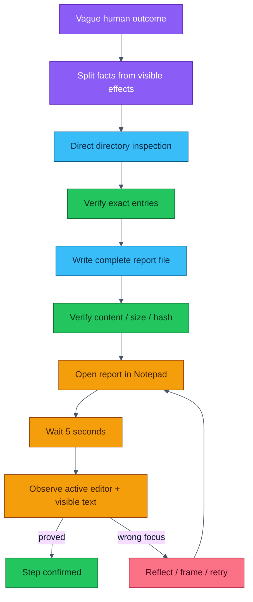

---

## Corrected flow for Hugging Face, a browser-local model, and ASCII chess

The complete goal is not one atomic step.

It contains discovery, feasibility, acquisition, initialization, protocol negotiation, game play, and proof.

The corrected planner should preserve those obligations separately.

### Phase 1: establish present browser state

Observe the active window and focused element.

Do not reuse old short identifiers.

If a Hugging Face Space is already open, identify what kind of Space it is from the current tree.

### Phase 2: navigate to a relevant discovery surface

Use prebound hotkey and text helpers directly or open a URL through the browser helper.

After the central wait, verify the actual target page.

Do not treat address-bar input as navigation proof.

### Phase 3: test feasibility before promising completion

Determine whether the candidate Space actually provides browser-local WebGPU inference.

“Free Space” does not automatically mean “downloadable local browser model.”

The page may run server-side inference.

It may require authentication.

It may be paused.

It may expose no downloadable weights.

It may require more GPU memory than the browser has.

The organism should inspect visible documentation and, when appropriate, direct page text or source links.

### Phase 4: initialize the local model

Trigger the actual model download or initialization.

Wait for the application-specific completion condition.

The generic five-second observation is only the start of each witness.

A long model download may require repeated task steps whose done-when conditions track visible progress.

Do not add a kernel wall-clock timeout merely because the task is long.

### Phase 5: establish a chess protocol

Ask the local model to play in a strict ASCII format.

Require one unambiguous board representation and move notation.

The executor can maintain a deterministic local chess-state parser in the authored script or create a small supporting script if needed.

The system should not trust the opponent model's board blindly.

It should validate move legality against its own maintained state when possible.

### Phase 6: play one move at a time

For each move:

1. read the current board or conversation state;

2. parse the opponent move;

3. validate it;

4. choose a reply;

5. enter the reply;

6. wait for the settled observation;

7. verify that the move was accepted and the board changed accordingly;

8. append the move and verdict to the narrative;

9. repeat.

### Phase 7: prove the win

A statement such as “checkmate” from the opponent is evidence but may not be enough by itself.

The done-when should require a final board or game transcript consistent with checkmate or resignation.

The organism can maintain a deterministic transcript file for independent verification.

### Phase 8: respond to capability defects

If UI observation cannot expose the ASCII board, reflection may choose a different access route.

It could read a DOM-derived text source if available.

It could use clipboard extraction.

It could create a general browser-text adapter.

It could evolve observation.

It should evolve only when evidence shows a general missing mechanism rather than one bad move or one poor selector.

```mermaid
%%{init: {"theme":"base","themeVariables":{"background":"#071a12","primaryTextColor":"#ecfdf5","lineColor":"#6ee7b7"}}}%%
flowchart LR
    DISC["Discover candidate"] --> FEAS["Prove browser-local WebGPU feasibility"]
    FEAS -->|"not feasible"| REPLAN["Replan candidate search"]
    REPLAN --> DISC
    FEAS -->|"feasible"| LOAD["Download / initialize model"]
    LOAD --> READY["Observe model ready"]
    READY --> PROTO["Establish strict ASCII chess protocol"]
    PROTO --> TURN["Parse, validate, choose one move"]
    TURN --> SEND["Send move"]
    SEND --> OBS["5-second settled observation"]
    OBS --> VERIFY["Verify accepted board transition"]
    VERIFY -->|"game continues"| TURN
    VERIFY -->|"denied"| REF["Reflect: retry / frame / replan / evolve / spawn"]
    REF --> TURN
    VERIFY -->|"checkmate or resignation proved"| WIN["Goal complete"]
    classDef search fill:#38bdf8,stroke:#075985,color:#082f49;
    classDef feasibility fill:#fbbf24,stroke:#92400e,color:#422006;
    classDef model fill:#8b5cf6,stroke:#5b21b6,color:#ffffff;
    classDef game fill:#34d399,stroke:#047857,color:#022c22;
    classDef correction fill:#fb7185,stroke:#9f1239,color:#4c0519;
    classDef success fill:#facc15,stroke:#a16207,color:#422006,stroke-width:3px;
    class DISC,REPLAN search;
    class FEAS feasibility;
    class LOAD,READY,PROTO model;
    class TURN,SEND,OBS,VERIFY game;
    class REF correction;
    class WIN success;
```

---

## Why the corrected system still cannot guarantee this chess goal

The architecture can choose and revise methods.

It cannot guarantee that a free browser-local WebGPU model exists at the moment of the run.

It cannot guarantee the model is strong enough to play legal chess.

It cannot guarantee the browser exposes usable text.

It cannot guarantee sufficient GPU memory.

It cannot guarantee Hugging Face availability.

It cannot guarantee that external authentication is already present.

It cannot guarantee a win against an arbitrarily strong opponent.

The corrected system improves the chance of honest progress.

It should be able to distinguish:

- “the route failed”;

- “the present body lacks a general faculty”;

- “the external resource does not exist”;

- “the task is still in progress”;

- “the win has actually been proved.”

That distinction is more valuable than a false universal guarantee.

---

## Long report generation should use the computer as a computer

The old report scenario asked for thousands of tokens in Notepad.

Typing thousands of characters through simulated keystrokes is fragile and slow.

The corrected executor can compose the full report in Python.

It can write the file directly.

It can compute its character count, line count, size, and hash.

It can read the file back completely.

It can then open that exact file in Notepad.

The verifier can separately prove content and visible presentation.

This is shorter, more deterministic, and more human-useful than pretending every computer task must be performed through humanlike keystrokes.

---

## Token efficiency after correction

The correction does not simply make the scan smaller.

That earlier strategy lost too much world detail.

The corrected strategy separates operational evidence from prompt evidence.

The scanner can inspect deeply.

The full action index remains in memory.

The compact tree carries short identifiers, roles, names, actions, active markers, and focus markers.

The prompt-facing ID map includes every visible ID compactly.

Only focused or action-framed IDs receive expanded geometry and low-level metadata.

Heavy raw artifacts are omitted from persisted state.

The narrative remains bounded.

The model receives one current observation rather than a frozen history of every raw scan.

This is a better trade:

- deep enough to act;

- compact enough to think;

- exact enough in memory to execute;

- honest about anything dropped.

---

## The logs demonstrate why causal diagnosis matters

A system that can rewrite itself will amplify its diagnoses.

A correct diagnosis can generalize into a valuable new capability.

An incorrect diagnosis can permanently add duplication, branches, prompts, and maintenance burden.

The malformed-helper failure was small.

Its unnecessary repair could have grown a second GUI API inside `tools.py`.

That duplication would create two locations for the same behavior.

They could drift.

The corrected prompt says to call runtime helpers directly.

The corrected reflection prompt explicitly recognizes this error class.

The broader lesson is not “never evolve after an import error.”

The lesson is “read the live manifest, exact generated code, and actual runtime binding before deciding which layer is defective.”

---

# Part XII — How to operate the seed

## Installation model

The update archive is intentionally flat.

Stop the running organism.

Extract the archive.

Copy every Python file and `wiring.json` into the existing project root.

Overwrite the matching files.

Do not copy runtime logs, runtime state, generated artifacts, or `__pycache__` from an old run into the update.

The organism reads live source from disk.

The next process therefore begins from the overwritten body.

---

## Runtime assumptions

The current eye and hand target a real Windows desktop.

The development folder may be viewed from Linux, but desktop-driving execution belongs in the Windows host process.

The configured model transport expects an `XAI_API_KEY` environment variable unless an API key is deliberately supplied in wiring.

The transport fails hard when the key is missing.

It does not silently switch to another model.

The configured transport currently selects `grok-4.3` through the xAI Responses endpoint.

That model choice is wiring data and can be changed.

The process also assumes its Python environment can import the Windows COM/UI Automation dependency used by the eye.

Git is required for self-evolution commits and the private known-good reference.

The configured evolution policy currently pushes accepted changes to the `origin` remote.

If the remote or credentials are unavailable, publishing can fail hard even after local behavior has been proved.

That behavior should be understood before an unattended run.

---

## Starting a goal

The normal command shape is:

```powershell
python core_organism.py "YOUR ROOT GOAL"
```

The root goal must be nonempty.

The process starts from the cycle-start node in wiring unless another start node is explicitly supplied.

The process removes the old runtime-state file and begins at tick zero.

The current body does not resume a prior invocation.

---

## Human counsel during a run

The guidance file is a small asynchronous counsel channel.

When the wheel reaches a guidance node, it reads the file.

If the file contains text, the text is appended to the narrative.

The file is then cleared.

The counsel is described as something the organism should heed or refuse as the root goal demands.

This is not a second root goal.

It is mid-run testimony.

It can be used to say things such as:

```text
The browser login is now complete. Continue from the visible page.
```

or:

```text
Do not delete any existing files. Produce the report in a new file.
```

or:

```text
The current page is a server-side demo, not a browser-local WebGPU model. Reconsider feasibility.
```

The guidance mechanism is intentionally plain.

It avoids a separate inter-process protocol.

---

## Stopping the organism

A verified exhausted plan routes to the satisfied node and emits `halt`.

The organism can also return on a wired `wait` signal.

A human process interrupt produces an interrupted state and returns.

There is no separate PID-control protocol.

Because state is not resumed on the next invocation, interrupting means a later run starts from a new root narrative.

If continuity across restarts becomes necessary, that should be evolved as an explicit architecture with fresh-observation semantics rather than by blindly reusing stale state.

---

# Part XIII — How to write a root goal

## A root goal should define an outcome, not impersonate a script

The system is most useful when the human names what should become true.

The human may also name important boundaries and evidence expectations.

The human should usually avoid dictating every click.

A fully scripted goal prevents the planner from choosing a shorter deterministic route.

It also makes interface changes look like task failure instead of invitations to replan.

The root goal should be stable enough to remain meaningful while methods change.

It should be broad enough to permit direct process access, UI control, child investigation, and self-evolution when justified.

It should be concrete enough that a planner can write observable done-when conditions.

---

## The recommended three-part goal shape

Use a short preface.

Place the actual outcome in the middle.

End with a common evidence-and-evolution suffix.

This keeps the goal vague about method while clear about truthfulness and persistence.

### Recommended preface

```text
Act as the continuing operator of this machine. Treat the outcome below as the fixed destination, not as a fixed procedure. Use the shortest reliable route available in the current environment.
```

### Outcome body

Write one or more sentences describing what should be true for the human when the organism finishes.

Do not prescribe a click sequence unless the sequence itself is the desired outcome.

### Recommended suffix

```text
Continue until the outcome is proved by fresh observable effect. Do not call an attempt, return value, file existence, or self-authored claim a result unless it directly proves the relevant condition. When blocked, use the narrative to diagnose the actual cause and choose among a materially different retry, careful reframing, replanning, a bounded child investigation, rewiring, or a general self-repair. Change the body only when evidence identifies a general mechanism defect; keep the change complete and reversible, and accept it only after behavioral proof. If the outside world makes the outcome impossible, establish that fact with the strongest available evidence and leave a clear account of what remains impossible rather than feigning completion.
```

---

## Full reusable goal template

```text
Act as the continuing operator of this machine. Treat the outcome below as the fixed destination, not as a fixed procedure. Use the shortest reliable route available in the current environment.

OUTCOME:
[Describe the human-useful state that should exist when the organism is done.]

IMPORTANT CONTEXT:
[Name any facts the organism cannot reasonably discover, such as the intended folder, account, machine, or audience. Omit this section when none is needed.]

BOUNDARIES:
[Name only real boundaries: data that must not be changed, required application state, required location, permitted account, or required human-visible artifact. Avoid prescribing method.]

Continue until the outcome is proved by fresh observable effect. Do not call an attempt, return value, file existence, or self-authored claim a result unless it directly proves the relevant condition. When blocked, use the narrative to diagnose the actual cause and choose among a materially different retry, careful reframing, replanning, a bounded child investigation, rewiring, or a general self-repair. Change the body only when evidence identifies a general mechanism defect; keep the change complete and reversible, and accept it only after behavioral proof. If the outside world makes the outcome impossible, establish that fact with the strongest available evidence and leave a clear account of what remains impossible rather than feigning completion.
```

The template is not mandatory.

The organism can work from a much shorter goal.

The template is useful when the task is long, consequential, or intended to exercise self-diagnosis.

---

## What “vague” should mean

Useful vagueness leaves method open.

Bad vagueness leaves success undefined.

Useful vague goal:

```text
Leave this project easier for its owner to understand tomorrow morning.
```

This leaves room for inspection, diagnosis, and artifact creation.

It still needs context or planning to define observable value.

Bad vague goal:

```text
Do something good.
```

There is no stable outcome and no defensible done-when condition.

Over-scripted goal:

```text
Click the taskbar at x=500, then press Win+R, then type a command, then click Notepad.
```

This encodes stale coordinates and prevents a direct route.

Outcome-oriented goal:

```text
Inspect the project, produce a plain-language report of the largest current obstacle, and leave the report visibly open for me.
```

This allows direct inspection and still requires a human-visible result.

---

## A good goal contains an epistemic shape

The best goals help the planner separate:

- what must become true;

- what may be discovered;

- what must not be damaged;

- what evidence matters;

- what to do when the outside world blocks the result.

They do not need to contain every done-when condition.

The planner is responsible for turning the root goal into step-level observable conditions.

The human should include a specific proof requirement only when the form of proof is part of the desired outcome.

For example:

```text
Leave the final report open in Notepad.
```

Here visible Notepad state is part of the outcome.

By contrast:

```text
Use Notepad to calculate the directory size.
```

This is a poor method constraint.

Notepad is not the reliable route to the fact.

---

## Every useful task can also test the organism

A task can create human value and pressure the architecture at the same time.

The suffix can ask the system to diagnose general mechanism defects when blocked.

That does not mean every failure should trigger self-evolution.

It means failure evidence should remain available for a reasoned choice.

A good diagnostic task has:

- a useful external outcome;

- at least one deterministic subproblem;

- at least one visible-effect requirement;

- a plausible interface or environment change;

- a clear reason to distinguish script error from body defect;

- a bounded opportunity for a child investigation;

- a final artifact a human can inspect.

---

# Part XIV — The five-goal ladder

## Why these goals are deliberately vague

The five examples increase in uncertainty and duration.

Each is written as an outcome rather than a procedure.

Each can produce real human value.

Each also invites the organism to expose and repair a general weakness when evidence supports evolution.

The first goal is almost deterministic.

The fifth approaches an open-ended assignment no present system can guarantee.

---

## Goal 1 — Leave one truthful readiness note

### Copyable goal

```text
Act as the continuing operator of this machine. Treat the outcome below as the fixed destination, not as a fixed procedure. Use the shortest reliable route available in the current environment.

Leave a short dated note on the desktop that tells me whether the endgame-ai project can be opened and structurally validated right now. Keep the note understandable to a non-programmer, include the most important concrete fact you observed, and leave it visibly open for me.

Continue until the outcome is proved by fresh observable effect. Do not call an attempt, return value, file existence, or self-authored claim a result unless it directly proves the relevant condition. When blocked, diagnose the actual cause and choose a materially different turn. Repair the body only for a demonstrated general mechanism defect, and prove that repair behaviorally.
```

### Why this is almost deterministic

The project folder is local.

Python compilation and topology validation are direct process facts.

The note is a direct file artifact.

Leaving it visibly open adds one UI-state requirement.

### Likely plan

1. locate the project root;

2. compile the source;

3. validate the wiring topology;

4. compose a short plain-language result;

5. write the note;

6. open it in an editor;

7. verify both content and visible state.

### What human value it creates

The owner receives an immediate readiness answer and a visible artifact.

### What it tests in the organism

It tests direct process execution.

It tests file writing.

It tests separation between structural success and visible presentation.

It tests the five-second observation delay.

It tests active/focused markers.

### Appropriate self-diagnosis pressure

If compilation works but the editor cannot be observed, the defect may be in observation or focus control.

If a generated script invents a `validate_project` helper, reflection should retry with ordinary Python or subprocess rather than immediately adding that task-specific helper.

---

## Goal 2 — Explain where the project is wasting attention

### Copyable goal

```text
Act as the continuing operator of this machine. Treat the outcome below as the fixed destination, not as a fixed procedure. Use the shortest reliable route available in the current environment.

Inspect the current endgame-ai project and leave me a concise report that identifies the one part most likely to waste operator time or model tokens during a long run. Support the conclusion with current source or runtime evidence, propose the smallest general correction, and leave the report visibly open. Do not change the project merely to make the report more dramatic; change it only if the evidence reveals a clear general defect and you can behaviorally prove the correction.

Continue until the report and any accepted correction are proved by fresh observable effect. If evidence is insufficient, say exactly what remains unknown instead of guessing.
```

### Why this is harder

“Most likely to waste attention” requires judgment.

The organism must inspect source and perhaps compact runtime evidence.

It must compare mechanisms rather than count one obvious file.

### Likely useful routes

It may directly inspect wiring and prompt construction.

It may analyze request-log token usage with a small script.

It may spawn a child to examine observation duplication while the parent examines narrative growth.

It may conclude that no code change is justified and only produce a report.

### What human value it creates

The owner receives a prioritized engineering diagnosis rather than a raw log dump.

### What it tests in the organism

It tests source-grounded reasoning.

It tests bounded log analysis.

It tests child testimony.

It tests restraint around self-evolution.

It tests whether a proposed repair is general rather than benchmark-specific.

### Appropriate self-diagnosis pressure

If the organism cannot inspect full source without truncation, that may expose a source-context mechanism defect.

If it floods its own prompt with raw logs, the failure itself reveals an evidence-compaction defect.

If it mistakes high token use for poor result quality without causal evidence, the correct response is better analysis, not immediate evolution.

---

## Goal 3 — Establish one genuinely local AI capability

### Copyable goal

```text
Act as the continuing operator of this machine. Treat the outcome below as the fixed destination, not as a fixed procedure. Use the shortest reliable route available in the current environment.

Find one AI experience that can genuinely run locally on this machine or inside its browser without sending each inference to a hosted model. Make it answer a small reproducible test, preserve enough evidence for me to repeat the test, and leave a clear human-readable briefing open. Prefer what is already available; download only what the machine can realistically support. Distinguish a local model from a web page that merely calls a remote server.

Continue until locality, readiness, and the test result are proved. When blocked, diagnose whether the cause is discovery, hardware, browser capability, permissions, interface control, or a missing general organism faculty. Evolve only the last category, and prove the repair before trusting it.
```

### Why this is substantially harder

The organism must define and verify “local.”

It must inspect hardware and available software.

It must distinguish browser-local WebGPU execution from hosted inference.

It may face downloads, progress states, model formats, and memory limits.

### Likely plan families

The planner may first inventory installed local model runtimes.

It may inspect browser WebGPU support.

It may investigate a small model compatible with available memory.

It may choose an existing installed model instead of Hugging Face.

It may create a reproducible test transcript and environment summary.

### What human value it creates

The owner receives a working private/local inference option and reproducible evidence.

### What it tests in the organism

It tests feasibility reasoning.

It tests long-running progress observation.

It tests browser versus process routes.

It tests environmental truthfulness.

It tests whether the organism can abandon an attractive but false route.

### Appropriate self-diagnosis pressure

If the browser UI hides model progress, the system may need a general progress-observation route.

If a model format requires a parser, the executor may author one without changing the organism body.

If repeated goals need the same missing adapter, reflection may justify evolving a generic capability.

If the hardware simply cannot run the model, self-evolution cannot create memory that does not exist.

The correct result may be a proved infeasibility report and the smallest viable alternative.

---

## Goal 4 — Improve a real external workflow while improving the organism

### Copyable goal

```text
Act as the continuing operator of this machine over the full duration of the assignment. Treat the outcome below as fixed and every method as revisable.

Choose one recurring digital task visible in the current workspace that costs the owner meaningful attention. Understand the task from current files, applications, and available guidance; perform one complete useful instance; leave a reproducible explanation and evidence; then identify whether the organism itself exposed one general weakness while doing the work. If a genuine weakness exists, make the smallest complete general repair and behaviorally prove it on the same failure class without hardcoding this instance. If no such weakness exists, do not invent one.

Continue until the external work is proved and the final briefing clearly separates task result, remaining uncertainty, and organism change. Use a bounded child investigation when independent testimony would reduce uncertainty. Never confuse a repair probe with completion of the external task.
```

### Why this is difficult

The goal does not name the workflow.

The organism must inspect the workspace and infer a useful candidate.

It must avoid choosing trivial work merely because it is easy to verify.

It must create external value before turning inward.

It must separate task completion from mechanism repair.

### Possible useful outcomes

It might reconcile a folder of reports and produce a clear index.

It might analyze repeated build failures and create a reproducible diagnosis.

It might turn scattered notes into a verified project briefing.

It might inspect an issue backlog and prepare a grounded priority report.

It might automate a repetitive local validation that repeatedly consumes operator time.

### What human value it creates

The owner receives one completed recurring task and a documented route to repeat it.

### What it tests in the organism

It tests autonomous task selection under a broad goal.

It tests useful-work judgment.

It tests the difference between a script artifact and a body capability.

It tests child-spawn value.

It tests behavioral self-repair without losing the external assignment.

### Appropriate self-diagnosis pressure

The organism should ask whether the weakness is broad enough to recur.

It should prefer rewiring, prompt correction, reuse, or deletion before adding another permanent helper.

It should return to the original workflow after repair validation.

It should verify the task step again rather than treating the repair as task completion.

---

## Goal 5 — The impossible horizon

### Copyable goal

```text
Act as the continuing operator of this machine for as long as useful work remains and until the human interrupts you. Preserve the root intent while allowing every plan, method, faculty, prompt, and topology beneath it to evolve.

Turn the owner's vague strategic intent, current digital environment, and incoming guidance into an ongoing stream of verified useful work. Discover what should be done, select work by expected human value rather than ease, execute it through the shortest reliable route, leave inspectable evidence, notice recurring limitations in your own body, and evolve general capabilities when behavioral proof supports the change. Use child organisms for independent investigations and let the topology grow new branches and joins when the work genuinely requires them. Maintain a truthful account of uncertainty, reversals, costs, and unfinished obligations. Recover from changed interfaces, changed software, failed services, and your own mistaken diagnoses without losing the living narrative.

Do not declare the strategic intent complete merely because one plan is exhausted. Rest only when current evidence supports that no higher-value reachable work remains, or wait when the next useful move depends on an external event. Never manufacture work to keep yourself moving. Never call expressive code, a confident model answer, or a successful self-edit proof of value. Let value be witnessed in the world and in artifacts the owner can inspect.
```

### Why this is currently impossible to guarantee

No present general-purpose agent can prove it will indefinitely discover the highest-value work in an open world.

The phrase “as long as useful work remains” has no computable universal stopping test.

The owner’s utility is only partially observable.

The environment can change faster than the organism adapts.

External systems can withhold access.

The model can make persistent reasoning errors.

Self-modification can create regressions outside the narrow probe.

The current organism is not crash-resumable.

The current child mechanism is not concurrent.

The current narrative is bounded.

The current goal is fixed for one invocation and completion is tied to one finite plan.

The current satisfied node rests when that plan is exhausted.

Therefore the goal exceeds the shipping seed.

### Why endgame-ai has a nonzero chance to move toward it

The action language is open-ended Python.

The body and wiring are writable.

The model can inspect live tracked source.

The topology can gain nodes, branches, and barriers.

The organism can generate and validate new plugins.

The narrative can carry causal testimony across many turns.

Children can pursue bounded independent sub-goals.

Behavioral repair prevents every self-edit from becoming automatically trusted.

The known-good marker gives evolution a continuity anchor.

These properties do not solve the impossible goal.

They make it meaningful to experiment toward the goal without first redesigning the entire system from outside.

### What this goal should reveal

It should reveal whether finite-plan satisfaction is too eager for strategic operation.

It should reveal whether value selection needs a new faculty.

It should reveal whether the narrative bound loses strategically important obligations.

It should reveal whether waiting needs a first-class external-event resumption model.

It should reveal whether child testimony can be synthesized reliably.

It should reveal whether sequential frontier execution becomes a bottleneck.

It should reveal whether narrow repair probes protect enough of the wider body.

It should reveal whether the organism can evolve these mechanisms without collapsing into complexity.

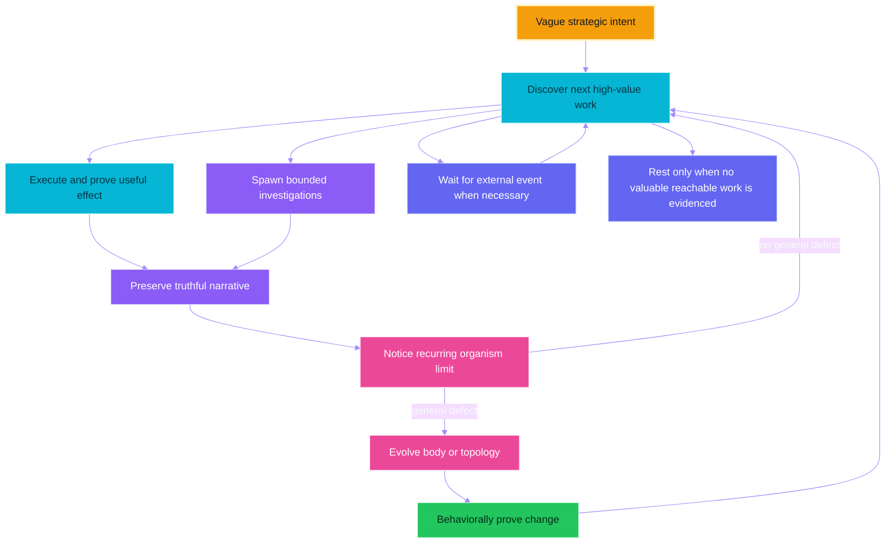

---

## The ladder is not a benchmark score

Passing Goal 1 does not prove Goal 2.

Passing Goal 4 once does not prove open-ended Goal 5.

Failing Goal 3 because no suitable local model exists does not necessarily prove the organism is defective.

The ladder is a way to observe the shape of motion.

Look for:

- increasingly grounded plans;

- fewer repeated equivalent failures;

- more precise done-when conditions;

- correct separation of deterministic facts and visible effects;

- restraint in self-evolution;

- general repairs rather than benchmark patches;

- honest recognition of external impossibility;

- useful artifacts a human can inspect;

- continuity across long runs;

- productive child testimony;

- topology growth only when justified.

The organism should be judged over many laps, not by one impressive or embarrassing line.

---

# Part XV — Is the system logically final?

## Short answer

No.

The corrected seed is structurally coherent and internally more faithful to its intended methodology.

It is not a mathematically complete replacement for a human.

Its only constraints are not merely time and evolution.

It remains constrained by:

- what the environment exposes;

- what the process is authorized to do;

- what the model can reason about;

- what the model transport returns;

- what the hardware can run;

- what external services permit;

- what the current observation can witness;

- what the current verifier can correctly interpret;

- what the narrative retains;

- what the current topology makes easy to express;

- what the Python kernel has hardcoded;

- what the wiring has configured;

- what the shared and node prompts encourage;

- what cannot be decided in general for arbitrary programs.

The seed is a coherent evolutionary bridge.

It is not the destination.

---

## What “logically sound” can mean here

Several different claims are often hidden inside that phrase.

### Structural soundness

Structural soundness means malformed wiring, missing nodes, dangling targets, invalid contracts, and invalid barrier declarations are rejected.

The current seed is strong in this local sense.

### Transition soundness

Transition soundness means a node may emit only a signal allowed by its live outgoing edges, and the kernel follows that edge faithfully.

The current seed enforces this.

### Evidence soundness

Evidence soundness would mean no step is ever confirmed unless its done-when condition is truly satisfied in the world.

The current seed aims for this but cannot guarantee it.

The verifier is a model interpreting partial observation.

### Evolution soundness

Evolution soundness would mean every accepted self-change improves the organism without causing any important regression.

The current repair gate proves one expected behavioral distinction.

It cannot prove every future consequence of arbitrary source changes.

### Progress soundness

Progress soundness would mean the organism always eventually completes any achievable goal.

The current seed cannot guarantee this.

It can loop, misdiagnose, choose poor plans, face an opaque interface, or encounter an undecidable search space.

### Value soundness

Value soundness would mean the organism always chooses work that maximizes human value.

The current finite-goal architecture does not even attempt a universal solution to that problem.

It pursues the supplied goal.

---

## Local invariants versus global guarantees

| Property | Current status | Honest interpretation |
|---|---|---|
| Wiring parses and required fields exist | Enforced | The configuration has the expected shape |
| All nodes are reachable | Enforced | No declared node is dead by reachability |
| Signals match outgoing edges | Enforced at runtime | The kernel follows the live graph |
| Fresh observation follows a deed | Enforced by topology and timestamps | The verifier receives a later observation |
| Every observation waits five seconds | Centralized and tested | UI settling is less likely to race |
| Candidate self-change compiles | Enforced | Source is structurally loadable |
| Candidate changes behavior as promised | Tested by one repair probe | One concrete failure class changed |
| Candidate has no other regressions | Not guaranteed | Narrow proof is not universal proof |
| Every confirmed task step is objectively true | Not guaranteed | Model and observation can be wrong |
| Every achievable goal eventually completes | Not guaranteed | Search and reasoning can fail or loop |
| Every impossible goal is conclusively recognized | Not guaranteed | Impossibility itself may be hard to prove |
| Arbitrary code can produce any physically possible result | False | Authority, information, hardware, and interfaces still constrain action |

---

## The hardcoded Python skeleton

The wiring controls much, but not everything.

The following ideas currently live in Python mechanics.

### A nonempty root goal is mandatory

The core run function rejects an empty or whitespace-only goal before turning the wheel.

### Every invocation starts from zero

The runtime-state file is removed at startup.

There is no resume mechanism.

### The kernel uses a frontier queue

Fan-out is represented as queued successors.

Branches are processed sequentially.

### Barrier semantics are fixed

A barrier releases when its configured arrival count is reached.

The concept of an arrival-count join is kernel behavior.

### `halt` and `wait` are terminal signals

The kernel recognizes those literal names.

### Node modules follow a naming and loading convention

A node name resolves to a Python file by base name.

Transport and capability modules use related conventions.

### Thinking nodes use a shared bus shape

Signal, patch, record, and evidence are Python-level concepts.

### Structured records are validated by the brain/bus layer

The kernel expects a particular family of JSON-compatible outputs.

### The root goal is inserted as fixed call context

The brain layer removes it from the changing payload and presents it as stable run context.

### Consumer contracts are discovered through outgoing edges

The machinery for reading consumer descriptions is implemented in Python.

### The narrative has a 12,000-character bound

The exact bound is currently a Python constant.

### Self-modification is intercepted for candidate lifecycle handling

The kernel recognizes the self-modifier node and the repair-validator node to coordinate apply, commit, accept, and rollback.

The decision to enter that node comes from the organism.

The mechanics of mutation trust are still special kernel behavior.

### Git is the continuity substrate for known-good

Candidate commits, rollback commits, branch state, and a private reference are implemented through Git commands.

### Immediate versus next-run behavior depends partly on import reality

The wiring classifies files, while Python's already-imported modules determine what is actually live.

### The desktop implementation is Windows-specific

UI Automation, Windows input events, clipboard handling, and browser executable paths live in Python.

### The one runner executes Python with process permissions

The action language and its risks are kernel facts.

All of these Python elements are themselves writable files.

That makes them evolvable across runs.

It does not make them absent.

The current process cannot instantly replace the semantics of code already executing merely because it overwrote the file on disk.

---

## Hardcoded behavior in wiring

“Hardcoded in wiring” is softer than “hardcoded in Python,” but it is still a current constraint.

The current wiring fixes or configures:

- the starting node;

- the twenty current node instances;

- every current route;

- the absence of active barriers;

- the selected xAI transport;

- the selected remote model;

- temperature;

- reasoning effort;

- output-token limits;

- transport timeout;

- transport retry count;

- whether request data is stored remotely;

- stable-source inclusion policy;

- the five-second observation wait;

- the 64-pixel scan step;

- subtree and total raw-node limits;

- selected-element limits;

- rendered-tree limits;

- text-label limits;

- child depth three;

- the Git remote name;

- accepted-change push policy;

- the known-good reference name;

- the file suffixes the organism may evolve;

- runtime-file exclusions;

- activation classes;

- the capability manifest;

- the eight structured record contracts;

- the common identity prompt;

- every role prompt;

- the declarative action-frame behavior.

The organism can rewrite wiring.

Therefore these are not permanent limits in principle.

They are real limits until a coherent, behaviorally justified evolution changes them.

---

## Constraints embedded in prompts

The shared prompt asks every thinking faculty to behave as one continuing organism.

It asks the faculty to preserve the immutable root goal and bounded narrative.

It forbids feigned sight, deeds, evidence, and completion.

It says short UI identifiers are observation-local.

It says deterministic reads prove only what they read.

It says self-evolution is a peer faculty chosen by reflection.

It asks candidate changes to remain reversible and untrusted until behavior is proved.

It asks the organism to preserve the living graph, narrative mind, consumer-discovered contracts, one executor, one runner, and child wheels unless the diagnosed defect explicitly requires evolving them.

These are constraints.

They are intentional constraints.

They narrow the system away from easy self-deception and architectural drift.

They are not cryptographic barriers.

They live in writable wiring.

A self-modifier with enough authority can rewrite them.

The more subtle question is whether removing them would produce freedom or merely destroy coherence.

An organism without evidence discipline may move more freely while becoming less able to distinguish fantasy from result.

---

## Constraints outside the organism

Some boundaries are not in its repository.

The operating system controls process permissions.

The user session controls which applications and accounts are open.

Remote services control authentication and rate limits.

The model provider controls availability and model behavior.

The network controls reachability.

The machine controls memory, storage, CPU, and GPU capacity.

The desktop applications control what UI Automation exposes.

The Python interpreter controls language semantics.

The host process controls whether a rewritten core becomes active without restart.

The human controls power, interruption, credentials, and physical access.

The organism may sometimes work around one boundary.

It cannot assume every external boundary is writable.

---

## Arbitrary code is not equivalent to arbitrary capability

Arbitrary Python makes the system computationally expressive.

Under ordinary assumptions, a general programming language can express any computable transformation for which it has inputs, time, and memory.

That statement does not imply:

- access to unknown information;

- permission to call every service;

- control of every physical device;

- enough memory to run every model;

- a semantic description of every UI;

- a solution to undecidable problems;

- a correct objective;

- a proof that generated code is beneficial;

- immunity from bugs;

- infinite time;

- infinite energy;

- guaranteed convergence.

Code can build a missing parser.

Code cannot parse information that never reaches the process.

Code can launch a browser.

Code cannot guarantee an account is authorized.

Code can search a large space.

Code cannot guarantee the search terminates with the globally best answer.

Code can rewrite the verifier.

Code cannot thereby make false evidence true.

This is why arbitrary execution is a powerful hand but not a complete mind or world.

---

## Self-reference creates unavoidable proof limits

The organism can inspect and rewrite the machinery that judges its changes.

This is necessary for genuine architectural evolution.

It also means no fixed internal validator can provide an absolute proof of every future self-version.

General properties of arbitrary programs are not all decidable.

No finite repair probe can cover every future environment and goal.

A self-modification can preserve the tested failure class and break an untested one.

A future evolution can weaken the repair gate itself.

A future prompt can reinterpret what “proof” means.

The known-good marker mitigates this problem operationally.

It does not erase the theoretical limit.

The honest model is evolutionary engineering under evidence, not formal omniscience.

---

## The current topology is a stable bridge, not a sacred shape

The seed architecture should be stable enough to carry continuity.

It should not be frozen merely because it is familiar.

Several invariants currently deserve a high burden of proof before removal:

- an immutable root goal for one invocation;

- explicit fresh observation;

- observed-effect verification;

- narrative continuity;

- consumer-discovered contracts;

- organism-chosen reflection routes;

- candidate distrust;

- exact rollback;

- a known-good anchor;

- coherent dynamic loading;

- fail-hard visibility of defects.

Even these are architectural hypotheses rather than laws of nature.

If evidence shows one blocks a more coherent organism, the system should be able to evolve it explicitly.

The stable bridge is valuable because it lets the organism cross into unknown forms without starting every mutation from chaos.

---

## What a genuine fractal “kick” might look like

The fractal topology will not become transformative merely because the word “fractal” appears in a prompt.

A genuine transition would show observable structural and behavioral consequences.

Examples might include:

- reflection repeatedly discovers that independent investigations improve outcomes;

- the organism evolves fan-out edges for those investigations;

- barriers synthesize distinct testimony;

- children develop specialized but dynamically loaded faculties;

- useful child-authored body changes survive into the parent;

- the topology grows and later deletes branches based on measured value;

- narrative formats evolve to preserve cross-child causality;

- coordination mechanisms appear only when sequential execution becomes a proved bottleneck;

- the organism creates forms the original developers did not enumerate;

- those forms continue to pass behavioral proof rather than merely becoming elaborate.

At that point, we may not be able to predict the exact future graph.

We should still be able to inspect its wiring, contracts, evidence, and known-good history.

Unknown future capability is not the same as unknowable current behavior.

The architecture should preserve inspectability as long as it remains useful.

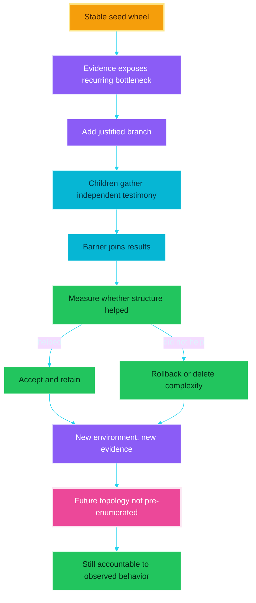

---

# Part XVI — The no-goal thought experiment

## What happens today if the process is started without a goal?

It fails immediately with a clear error.

The core run function requires a nonempty root goal.

The wheel does not begin.

The planning observation does not run.

The topology does not “drive itself.”

No prompt is born.

No narrative begins.

This is an intentional current constraint.

It prevents a process with no declared purpose from manufacturing arbitrary work and later calling motion useful.

---

## Why pure topology does not create purpose by itself

Topology answers:

> If this node emits this signal, where does control go next?

Topology does not answer:

> Which signal should a thinking node emit?

Topology does not answer:

> What outcome is valuable?

Topology does not answer:

> What should be written into a new prompt?

Edges are routing relations.

They are not a source of semantics by themselves.

A graph of mechanical nodes with fixed signals can circulate mechanically.

It can update predetermined state.

It cannot invent purpose unless some node mechanism already contains a generator, objective, environment-derived criterion, or external input.

The current root goal supplies that orienting difference.

---

## What if the goal guard were removed but the goal remained empty?

The system would enter a poorly defined state.

The narrative would begin without an immutable outcome.

The planner would receive an empty goal plus a desktop observation.

The model might invent a task from its priors or from visible text.

The structured schema could force it to emit a plan.

The scheduler could execute that invented plan.

The verifier could verify step-level conditions the model invented itself.

The satisfied node could then declare the invented plan exhausted.

Mechanically, the wheel might move.

Normatively, there would be no reason to call the movement useful.

The system would be vulnerable to whatever happens to be visible on the desktop.

That is not pure autonomous purpose.

It is objective drift into model priors and environmental salience.

---

## Could a goal be born from the environment?

Yes, but only if goal formation itself becomes an explicit mechanism.

For example, a future topology could begin with a value-discovery faculty.

That faculty might read:

- a queue of human intents;

- a standing organizational charter;

- deadlines;

- unresolved verified obligations;

- available resources;

- recent human feedback;

- the current environment.

It could propose a root goal.

Another faculty could critique that proposal.

A human or a durable value contract could authorize it.

Only then would an execution wheel begin.

That is a possible evolution.

It is not present today.

The crucial point is that topology would route goal formation.

Topology would not supply value from nowhere.

---

# Part XVII — The no-prompt thought experiment

## “No system prompts” can mean three different experiments

The consequences depend on what is removed.

### Experiment A: remove required prompt keys

Wiring validation or prompt lookup fails hard.

Thinking nodes cannot assemble their calls.

The wheel stops at the first affected faculty.

### Experiment B: keep prompt keys but make node prompts empty

The shared prefix may still provide identity and discipline.

The root goal still appears as stable context.

The live downstream consumer contract still appears.

The structured response schema still constrains output shape.

The JSON payload still contains plan, observation, evidence, and focus fields.

The model might therefore produce structurally valid output.

It would have much less role-specific guidance.

Planning quality, evidence discipline, and repair semantics would likely degrade.

### Experiment C: empty both shared and node prompts

The call can still contain:

- the fixed root goal;

- the current JSON payload;

- the dynamically composed downstream contract;

- the structured output schema.

This is not truly promptless.

The schema and consumer contracts are prompts in a broader semantic sense.

The model also carries extensive learned priors from training.

The system may still emit records.

It loses the common organism identity, anti-feigning discipline, explicit evidence standard, self-evolution philosophy, and role-specific method.

---

## Pure topology cannot call a model meaningfully without some semantics

A thinking node needs at least:

- an input state;

- an output shape;

- a criterion for choosing among legal outputs.

Topology can provide legal routes.

Consumer contracts can provide expected output meaning.

The root goal can provide direction.

The current observation can provide a world state.

The model's learned priors can fill in missing conventions.

Once those remain, the system is not semantically empty.

If all of them were removed, the model call would have no task-relevant basis for one signal over another.

Any motion would be arbitrary relative to human value.

---

## Can prompts be born from the organism itself?

Yes, in a meaningful but not magical sense.

The current organism can already rewrite `wiring.json`.

Prompts live in that file.

A self-modifier can therefore author a new prompt.

The new prompt can become live immediately when wiring reloads.

But the current route to that act requires existing semantics.

Reflection must choose evolution.

The self-modifier must understand the failure and patch format.

The repair loop must understand expected behavior.

If every prompt and every goal disappeared simultaneously, there might be no coherent reason to enter that route or decide what prompt to create.

Prompt birth requires a seed distinction.

That distinction can be very small.

It cannot be literally nothing.

---

## A rigorous prompt-birth experiment

A serious experiment would preserve the smallest possible seed rather than deleting everything indiscriminately.

One possible design:

1. preserve a nonempty root goal;

2. preserve the model transport;

3. preserve observation;

4. preserve the output bus and topology contracts;

5. preserve a minimal node that can inspect live source and wiring;

6. remove role-specific prompts;

7. ask the minimal node to propose prompts needed by its actual consumers;

8. write those prompts into candidate wiring;

9. behaviorally compare prompted and minimally prompted performance on a concrete failure;

10. accept only prompts that improve observed behavior;

11. repeat while measuring complexity and drift.

This would test whether consumer contracts, root goal, source, and environment are enough for the organism to grow its own cognitive instructions.

It would not prove emergence from pure topology.

It would prove bootstrapping from a smaller semantic seed.

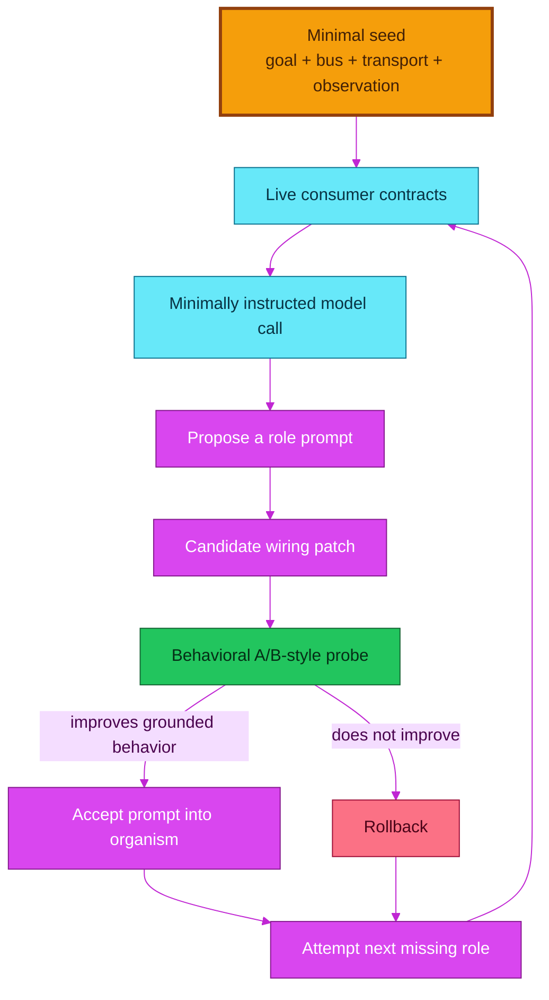

---

## What this experiment would teach

It could reveal which prompt content is truly structural.

It could reveal which instructions the model reconstructs from consumer contracts and source.

It could reveal whether the shared organism identity improves long-run coherence.

It could reveal whether evidence discipline survives without explicit wording.

It could reveal whether self-generated prompts become verbose and self-referential.

It could reveal whether prompt evolution overfits one repair probe.

It could reveal whether prompts become more stable when their success is measured by external effect rather than stylistic preference.

It would not remove the model's pretrained priors.

It would not create purpose without a goal or value seed.

It would not make topology itself conscious.

---

## The most honest conclusion about “pure topology driving itself”

Topology can sustain motion.

Topology can constrain vocabulary.

Topology can expose consumer relations.

Topology can compose larger wheels from smaller wheels.

Topology can route evidence into self-change.

Topology cannot, by itself, define why one world state is better than another.

Purpose enters through a goal, value function, standing charter, human counsel, environmental reward, or some other asymmetry.

The interesting research question is not whether meaning comes from literal nothing.

The interesting question is how small and stable the initial asymmetry can be while the organism grows the rest of its own cognitive structure.

endgame-ai is a platform on which that question can be tested.

---

# Part XVIII — Remaining failure modes

## The verifier may be confidently wrong

Freshness does not guarantee correct interpretation.

A model can misread an active marker.

It can accept a page title that only resembles the target.

It can reject a valid result because the UI tree omitted a detail.

Future work may require deterministic validators for domains where exact state can be parsed.

---

## The planner may define a weak done-when condition

Verification is only as meaningful as the condition being verified.

If the planner writes “the command ran,” a command return may satisfy it while the human outcome remains absent.

The planner prompt asks for observable effects, but model quality remains relevant.

---

## The repair probe may overfit

A repair can pass one narrow probe and fail under a slightly different interface state.

The known-good marker can therefore advance on incomplete evidence.

Broader regression probes would increase confidence but also increase cost and complexity.

The seed currently prefers one explicit failure-linked proof.

---

## The narrative can forget important middle history

The narrative bound keeps prompt cost flat.

It may remove an older obligation or causal detail that later becomes relevant.

The immutable root remains.

Recent testimony remains.

There is no semantic long-term retrieval layer.

The philosophy deliberately avoids a retrieval database, but long strategic runs may eventually justify a new narrative compression mechanism.

---

## The eye can disturb the desktop

The scan uses point probing and temporarily moves the cursor.

It restores the cursor afterward when possible.

Applications may react to hover.

Tooltips may appear.

Hover-sensitive interfaces may change during scanning.

The eye is therefore an intervention as well as an observation.

That is a classic measurement problem in desktop automation.

---

## The five-second delay is blunt

It reduces races.

It adds latency to every observation, including observations before actions that need no settling.

It does not guarantee a long operation is complete.

Future evolution might use action-specific readiness evidence or adaptive waiting.

Such machinery should be added only when logs show the fixed wait is a real bottleneck or still insufficient.

---

## Deep scans are expensive

A 64-pixel grid can produce hundreds of probes on a full-HD display.

UI Automation subtree harvests can be costly.

The corrected configuration restores generality after an overly shallow reduction.

It may need future adaptive area selection, application-specific observation, or incremental evidence.

Any optimization must preserve honest coverage reporting.

---

## Child testimony can be wrong

A child is another instance of the same fallible organism.

Its narrative is testimony, not proof.

The parent reflects on it rather than automatically accepting it.

Multiple children can repeat the same model bias.

Fractal multiplication is not automatic epistemic independence.

---

## Shared-body children can conflict in future concurrent designs

The current blocking child avoids simultaneous writes.

If children become concurrent, two branches may propose incompatible body changes.

Candidate commits, known-good state, activation, and repair attribution would require explicit arbitration.

This is not solved by the existing barrier mechanism.

---

## The model transport is an external dependency

The xAI transport can fail through missing credentials, HTTP errors, URL errors, rate limits, or service unavailability.

The after-run host log ended with an HTTP 429 condition.

The current transport does not silently switch providers.

Fail-hard behavior keeps the dependency failure visible.

It also means the organism cannot think through a prolonged provider outage unless it evolves or is configured with another available transport.

---

## External text can influence thinking

The observation and web tools expose text from applications and pages to the model.

That text may be irrelevant, misleading, or intentionally written to redirect an automated reader.

The root goal and evidence discipline provide some stability.

There is no complete information-integrity system that classifies every external instruction by authority.

Long-lived operation will likely need a clearer provenance model if it works across untrusted information sources.

---

## Arbitrary code can cause irreversible effects

The runner is powerful.

The known-good marker protects source continuity, not every external file, account, message, or application state.

A bad execution program can delete data or create an unwanted external effect before verification denies the step.

Verification is retrospective.

The current philosophy avoids adding unsolicited policy machinery.

Operators should still understand that expressive action and reversible source evolution are not the same as reversible world action.

---

## No wall-clock budget means persistence and cost are coupled

The wheel rolls until it halts, waits, is interrupted, or fails hard.

There is no built-in time budget.

There is no default brain-call budget.

This supports long tasks.

It also permits expensive loops.

The monotonic tick counts laps but does not limit them.

Run health must therefore be judged from convergence, evidence quality, and human value rather than elapsed ticks alone.

---

# Part XIX — How to analyze a run

## Do not pour the raw log into the next mind

The attached request log was about 1.4 megabytes.

The runtime state was tens of kilobytes in the failed run and much larger in an older baseline.

Raw logs contain repeated prompts, duplicated observations, and large metadata structures.

Use a small disposable analysis script to extract only what answers the current question.

Useful extractions include:

- model calls by record type;

- token totals and maxima;

- scan probes, node counts, and elapsed times;

- step-confirmed and step-denied counts;

- repeated failure signatures;

- exact generated code for one failure;

- exact runner action events;

- verifier reasons;

- reflection routes;

- candidate commit and repair conclusion;

- whether the known-good marker advanced.

Discard the temporary extraction after learning from it.

Do not turn raw operational history into permanent prompt bloat.

---

## The eight questions for one failed step

1. What exact step description was active?

2. What exact done-when condition was active?

3. What did the fresh pre-action observation show?

4. What exact code did the executor author?

5. What exact action events or exception did the runner record?

6. What did the settled post-action observation show?

7. Why did the verifier confirm or deny?

8. Did reflection choose a route supported by the causal evidence?

This sequence usually exposes whether the defect was in planning, perception, code, focus, proof, diagnosis, or architecture.

---

## The seven questions for one self-evolution

1. What original failure signature was captured?

2. Which layer did reflection diagnose as defective?

3. Which files and wiring paths changed?

4. Was the activation classification truthful?

5. Did the probe exercise the same failure mechanism?

6. What concrete before/after difference was observed?

7. Did the marker advance, or was the exact body restored?

If the answer to question five is no, the repair result says little about the original defect.

---

## Healthy motion over many laps

Healthy motion is not error-free motion.

Look for:

- plans becoming more grounded after new evidence;

- actions leaving recorded deeds;

- observations occurring after actions;

- verifiers naming specific missing facts;

- reflection changing tactics rather than repeating equivalent scripts;

- body evolution only after genuine mechanism diagnosis;

- probes tied to original failures;

- rejected repairs restoring exact state;

- accepted repairs reducing recurrence;

- narrative lines remaining concise and causal;

- human-useful artifacts accumulating;

- branches appearing only when independent testimony helps;

- obsolete complexity being deleted.

---

## Unhealthy motion over many laps

Warning shapes include:

- repeated identical code under a “retry” label;

- old short identifiers reused after observation;

- clicks treated as proof;

- result strings treated as world state;

- verifier reasons unrelated to the current done-when;

- self-evolution after ordinary script syntax errors;

- task-specific helper accumulation;

- probes that repeat the same malformed code;

- known-good advancing on structural checks alone;

- growing prompts with no improvement in decisions;

- child narratives accepted as proof without independent evidence;

- topology branches that never affect a result;

- plans exhausted while root obligations remain;

- external impossibility repeatedly treated as a local code defect.

---

# Part XX — What is final about this release

## The release is final as a corrected seed package

The delivered update contains the complete essential Python body and wiring document required for copy-overwrite installation.

The source compiles.

The wiring validates.

The topology contains twenty reachable node instances.

The eight structured record contracts are coherent.

The reflection schema derives its route vocabulary from live edges.

The frontier and barrier mechanics have behavioral tests.

The observation path has a tested five-second-before-scan ordering.

Synthetic filtering tests prove global drop reporting, active markers, focus markers, and short-ID mapping.

Capability-runtime tests prove the manifest helpers are actually bound and recorded.

Child tests prove isolated state paths and shared canonical wiring.

Evolution tests prove dirty worktrees are allowed, new nodes and topology can be applied atomically, exact snapshots restore deleted/created files, and the first accepted candidate anchors the full tracked live body after copy-overwrite installation.

The packaged archive was re-extracted and compiled independently.

These are concrete release properties.

---

## The release is not final as an organism

A system whose important purpose is self-evolution cannot be “final” in the ordinary product sense without contradicting that purpose.

The seed should be stable enough to trust as a starting bridge.

Its future forms should be earned through evidence.

The current architecture is a hypothesis about how to remain coherent while changing:

- wiring as form;

- narrative as continuity;

- observation as present tense;

- one executor and runner as general hand;

- verification as witness;

- reflection as choice;

- child wheels as bounded recursion;

- candidate proof and known-good as evolutionary memory.

If those ideas survive many diverse goals, they become stronger.

If one repeatedly blocks useful adaptation, the organism should be able to evolve it.

The correct attitude is neither “the architecture is sacred” nor “anything can be rewritten, so architecture does not matter.”

Architecture matters because it determines how change remains intelligible.

Evolution matters because no fixed architecture can anticipate every future task.

---

## The meta perspective

endgame-ai is not valuable because it resembles a human at the surface.

It is valuable if it can become a continuing source of accountable effects in a world that does not stay still.

The mouse and keyboard are merely two actuators.

Python is a broader actuator.

The screen tree is merely one sensory surface.

Files, subprocess output, web text, model counsel, and child testimony are other surfaces.

The topology is not a workflow diagram frozen by a developer.

It is the current anatomy of possible transitions.

The prompts are not an eternal constitution.

They are the current cognitive habits of the faculties.

The narrative is not a database of everything that happened.

It is a compressed causal self-account.

The known-good marker is not immortality.

It is a place from which another risky step can be taken.

The verifier is not truth itself.

It is an institutional demand that claims face evidence.

The child is not automatically wiser than the parent.

It is a way to let one bounded line of inquiry return testimony without erasing the parent’s continuity.

The code runner is not proof of universal power.

It is an open action language through which new faculties can first appear as temporary scripts before deserving a place in the body.

This last point is central.

A capability does not need to become permanent the first time it is needed.

The executor can author a one-off parser, adapter, or experiment.

If the mechanism proves generally valuable across failures, reflection may later evolve it into the body.

This creates a path from temporary behavior to permanent anatomy.

It also creates a path back: permanent anatomy that no longer earns its complexity should be deleted.

The organism's long-run quality will depend as much on deletion as on growth.

---

## Closing statement

The corrected endgame-ai is best understood as a seed topology for continuing verified adaptation.

It can observe a Windows desktop deeply enough to recover useful structure.

It can operate the computer through UI actions and direct code.

It can turn vague outcomes into observable steps.

It can deny proxy evidence.

It can preserve failures as narrative testimony.

It can choose self-evolution without being forced there by a failure counter.

It can reject a structurally valid but behaviorally useless mutation.

It can beget bounded child wheels whose state is isolated and whose body is shared.

It can rewire itself into forms not enumerated in this README.

It cannot guarantee human replacement.

It cannot create authority, information, hardware, or value from nothing.

It cannot prove every consequence of rewriting arbitrary code.

It is constrained by more than time.

Yet time and evolution matter because the system contains a real route by which repeated evidence can change the mechanism that receives the next piece of evidence.

That recursive fact is the source of its possibility.

The proper next question is not:

> Is the organism already capable of everything?

The proper next questions are:

> Does it leave more verified human value after each long run?

> Does it diagnose the right layer when it fails?

> Does it grow only the structure that earns its place?

> Does it preserve enough continuity to take another honest turn?

Those questions can be tested now.

---

## Compact operator checklist

Before a run:

- confirm the correct Windows user session is active;

- confirm `XAI_API_KEY` is present;

- confirm the project is a Git checkout if self-evolution is expected;

- confirm the intended remote policy in wiring;

- write one nonempty outcome-oriented root goal;

- include real boundaries without prescribing brittle methods.

During a run:

- watch the shape of motion rather than one error;

- use the guidance file for concise new facts;

- do not manually reuse ephemeral `e` identifiers;

- interrupt if world actions become unacceptable;

- distinguish task progress from repair progress.

After a run:

- inspect the final phase and last signal;

- inspect verified steps;

- inspect unresolved root obligations;

- inspect repeated failure signatures;

- inspect any candidate and repair verdict;

- confirm whether known-good advanced;

- keep useful human artifacts;

- discard heavy temporary analysis;

- evolve from evidence, not embarrassment.

---

## Compact self-reading checklist for the organism

When reading this body from inside a future self-modification call:

1. Treat live files on disk as ground truth.

2. Read the current failure before proposing architecture.

3. Read the exact generated code and action events.

4. Read the current outgoing edges of the diagnosing node.

5. Read the consumer descriptions of the proposed route.

6. Check whether the required faculty already exists under another binding.

7. Prefer a different task script when the body is sufficient.

8. Prefer rewiring or prompt correction when code can be reused.

9. Add Python only for a genuinely new mechanism.

10. Delete obsolete mechanisms completely.

11. State what observable behavior must differ.

12. Respect immediate versus next-run activation.

13. Keep the candidate reversible.

14. Let the repair probe exercise the original failure.

15. Advance known-good only after the witnessed comparison resolves it.

16. Return to the external task after repair; a repaired hand has not yet completed the work.

---

*This README describes the corrected seed delivered with the fractal update. It is a map of the current organism and a set of falsifiable expectations for what its future versions should preserve, challenge, or outgrow.*
