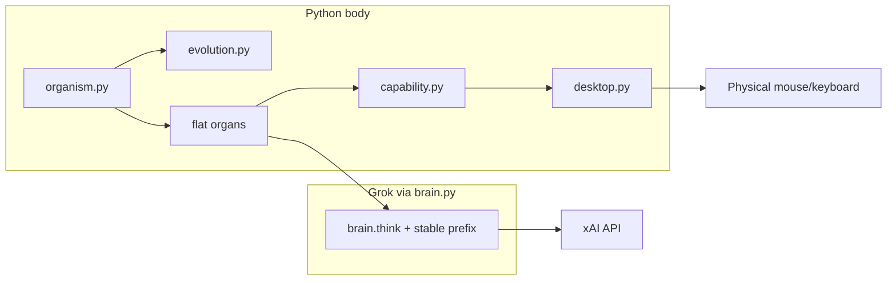
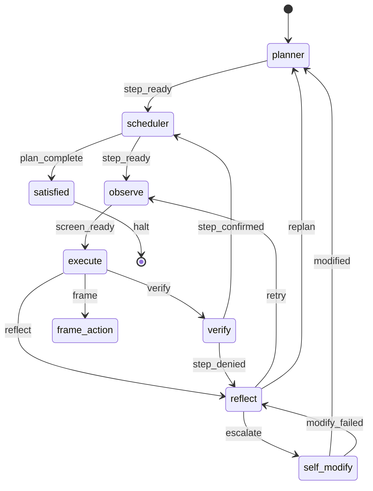

# endgame-ai

Local desktop organism on Windows. One `goal_seed` in, handover out.

**Code is the action layer. Grok is the reasoning organ.** Python owns the mouse, keyboard, filesystem, and git. The LLM receives a slim observation and returns typed JSON records. `wiring.json` is the circuit diagram; the running loop is the organism.

Firmware: ~2,500 LOC (root `*.py` + `wiring.json`). No sandbox. No helper scripts in repo.

North star: [`cdcbbd2`](https://github.com/wgabrys88/endgame-ai/tree/cdcbbd2a424136298836ddce75ff8c41ea4a7e41) — capability runtime, desktop-owned physical actions, slim self_modify request. We reduced code since then; this tree recovers those behaviors without restoring bloat.

---

## What this is

| Not this | This |
|----------|------|
| Chatbot | Closed-loop operator on your real desktop |
| Resume/checkpoint API | Living topology — each run is a birth; `state.json` is a mirror for humans |
| PostMessage / synthetic clicks | Physical cursor move + click, like a human |
| Self-modify with diff bloat in the request | Slim failure report + repo link → Grok returns patch → local validate/apply |

---

## Design principles

1. **Hard switches** — one transport in `wiring.json`. Fail-hard, log everything.
2. **Body truth** — `desktop.py` executes actions. `execute` runs code in `capability.build_runtime()` (`pyautogui` facade + `click_node(id)`).
3. **KV-cache prompts** — stable prefix = full firmware snapshot; organ prompts stay short; dynamic JSON tail = freshest runtime truth.
4. **Self-modify** — Grok gets reflection + evidence + `branch_url` + file manifest (paths only). Grok returns `git_evolution_patch`. Organism validates, applies, commits.
5. **Topology is the organism** — nodes are organs, signals are nerves, state is shared memory.

---

## Architecture



### Organs

| Organ | Role |
|-------|------|
| `planner` | Goal → plan steps |
| `scheduler` | Pick current step |
| `observe` | Fresh SEMANTIC_UI scan + `action_index` |
| `execute` | Grok → Python in capability runtime |
| `frame_action` | Reframe when execute cannot act |
| `verify` | Judge `done_when` vs evidence |
| `reflect` | retry / replan / escalate / give_up |
| `self_modify` | Grok patch on escalate |
| `satisfied` | Halt on done or give_up |
| `error` | Mechanical recovery |

### Topology



---

## Capability runtime

Execute sandbox (no direct `win32_api`):

- `pyautogui.click / write / press / hotkey` → physical desktop body
- `click_node('ui_1')`, `scroll_node('ui_1')` — SEMANTIC_UI ids from `action_index`
- `focus_window(title|hwnd:N)`, `open_url(url)`
- `subprocess`, `os`, `json`, `pathlib`, …

**Click contract:** `SetCursorPos` + `mouse_event`. Never `PostMessage` clicks.

---

## Self-modify contract

**Request (small):** `failure`, `git_context.branch_url`, `workspace_manifest` (paths), `runtime.evidence`.

**Not in request:** source fingerprints, immune essays, inline diffs.

**Response:** `git_evolution_patch` with `file_writes` and/or narrow `unified_diffs`, `commands` including `python contract_check.py`.

**On failure:** `modify_failed` → reflect (no tight loop).

---

## Operator control

| File | Purpose |
|------|---------|
| `comms/goal.txt` | Goal seed (or CLI arg) |
| `comms/control.json` | `run` / `pause` / `step` |
| `state.json` | Live mirror — not a resume API |
| `comms/runtime.ndjson` | Audit trail |
| `comms/stop.txt` | Clean kill |

`organism.py:wait_before_node()` is the only pause/step chokepoint.

---

## Run

```powershell
python organism.py "your goal" --reset --max-ticks 100
```

Read `comms/runtime.ndjson` and `state.json` while it runs. One organism per machine. Do not write `stop.txt` mid-brain-call unless you intend to kill it.