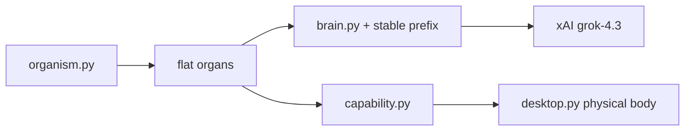
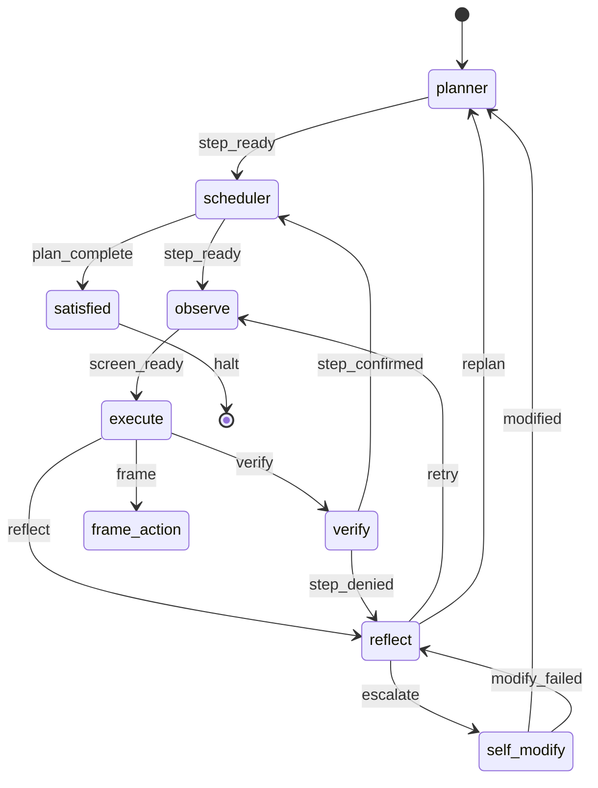

# endgame-ai

Local desktop organism on Windows. One `goal_seed` in, handover out.

**Code is the action layer. Grok is the reasoning organ.**

| Commit | Role |
|--------|------|
| [`cdcbbd2`](https://github.com/wgabrys88/endgame-ai/tree/cdcbbd2a424136298836ddce75ff8c41ea4a7e41) | **North star** — working reference (2026-07-03 era) |
| [`29bf88d`](https://github.com/wgabrys88/endgame-ai/commit/29bf88d52cf529154ef0f9771a5ad46af6c929b5) | **Current HEAD** — reduced LOC, golden live test |
| Tag `live-test-waka-linkedin` | Golden run firmware fingerprint |

Firmware now: **2,759 LOC** (22 root `*.py` + `wiring.json`). No helper scripts in repo.

---

## Forensic: cdcbbd2 → HEAD (what moved in history)

We reduced code but moved far in architecture. The reference commit was not token-minimal in practice — it was **operator-complete**.

### LOC & layout

| | cdcbbd2 | HEAD (29bf88d) |
|--|---------|----------------|
| **Layout** | `nodes.py` (628) + `organism_nodes/*` + monolithic `desktop.py` (1348) | Flat root organs + `capability.py` + `registry.py` |
| **Root firmware LOC** | ~4,200+ (nodes + desktop + brain + organism_nodes) | **2,759** |
| **git diff** | — | 40 files, +2573 / −4206 vs cdcbbd2 |

### Kept (wins)

- Flat organ topology (`planner → scheduler → observe → execute → verify → reflect → self_modify`)
- Physical operator clicks (`SetCursorPos` + `mouse_event` via `desktop.py` body)
- `capability.py` runtime (`pyautogui`, `click_node(id)`, `scroll_node(id)`)
- Slim `self_modify` request (failure + `branch_url` + manifest paths; patch in response)
- `modify_failed` guard (no self_modify death loop)
- SEMANTIC_UI observation + `action_index`
- Single transport hard-switch (`wiring.json` → xAI)

### Lost vs cdcbbd2 (regressions)

| cdcbbd2 had | HEAD lost / weakened |
|-------------|---------------------|
| `build_capability_runtime()` in `nodes.py` with `click_node` wired to `desktop` action_index | Was briefly broken; recovered in `cb14c06` / `29bf88d` |
| `brain_transports/*` hot-swap | Removed (xAI-only — intentional LOC cut) |
| Slim observation token budget (~300-token tree goal in README) | Stable prefix embeds **full firmware** (~162k chars / ~41k tokens per call) |
| `frame_action` as explicit ROD pass with full prompt | Was stubbed; restored in `29bf88d` but **golden run never invoked frame_action** |
| Self-modify with `file_writes` + branch URL (no fingerprint bloat) | Recovered; golden run escalated at tick 40 before `self_modify` ran |

### Token reality (golden run `comms/brain_raw.jsonl`)

| Metric | Value |
|--------|-------|
| Grok calls | 27 (planner×1, execute×10, verify×8, reflect×8) |
| Total input tokens | 1,191,339 |
| KV cached input | 816,223 (68.5%) |
| Total output tokens | 14,988 |
| Typical call input | ~44,000 tokens |
| Stable prefix (system) | ~162,374 chars |
| Dynamic payload (user) | ~8,000 chars |

**cdcbbd2 README claimed ~300-token observations.** HEAD still has slim SEMANTIC_UI trees (~8k chars dynamic) but **pays ~41k tokens/call for full-source stable prefix** — the dominant cost.

---

## Golden run (live-test-waka-linkedin)

**Goal:** Play Shakira Waka Waka → publish LinkedIn article via Opera about endgame-ai.

| | |
|--|--|
| **When** | 2026-07-04 ~13:29–13:34 CEST |
| **Firmware** | `29bf88d` (matches `origin/main` today) |
| **Ticks** | 40 (max_ticks cap) |
| **Steps confirmed** | 0 Opera/YouTube ✓, 1 play ✓ |
| **Stuck** | Step 2 LinkedIn — verify denied ×4 |
| **Last execute** | Typed `https://www.linkedin.com/post/new/` in Opera address bar |
| **End** | tick 40 `reflect → escalate → self_modify` (**self_modify never started** — ticks depleted) |

### Artifacts on disk (do not delete — forensic gold)

```
state.json                          final mirror tick=40
comms/runtime.ndjson                81 events — tick trail
comms/brain_raw.jsonl               27 Grok calls — full I/O
comms/observations/*.json           9 hover-scan snapshots
comms/goal.txt                      goal seed
comms/control.json                  operator control
```

Prior session logs were wiped before this run (operator error). **This run's logs are intact.**

---

## Architecture (HEAD)



### Topology



### Organ LOC (HEAD)

| File | LOC |
|------|----:|
| brain.py | 517 |
| desktop.py | 449 |
| evolution.py | 355 |
| win32_api.py | 239 |
| organism.py | 239 |
| execute.py | 76 |
| capability.py | 115 |
| bus.py | 135 |
| frame_action.py | 55 |
| self_modify.py | 73 |
| wiring.json | 73 |
| *(others)* | *<50 each* |
| **TOTAL** | **2759** |

---

## Run

```powershell
python organism.py "your goal" --reset --max-ticks 100
```

- `state.json` — mirror for humans, **not** a resume API
- `comms/runtime.ndjson` — audit trail
- `comms/brain_raw.jsonl` — full Grok I/O
- One organism per machine

---

## ChatGPT forensic prompt (compare cdcbbd2 vs HEAD + golden run)

Copy everything below into ChatGPT. Attach files listed.

````
You are a forensic analyst comparing two firmware commits of endgame-ai and one golden live run.

## Commits to compare

| Label | SHA | URL |
|-------|-----|-----|
| NORTH_STAR | cdcbbd2a424136298836ddce75ff8c41ea4a7e41 | https://github.com/wgabrys88/endgame-ai/tree/cdcbbd2a424136298836ddce75ff8c41ea4a7e41 |
| HEAD | 29bf88d52cf529154ef0f9771a5ad46af6c929b5 | https://github.com/wgabrys88/endgame-ai/commit/29bf88d |

Clone or use GitHub compare: https://github.com/wgabrys88/endgame-ai/compare/cdcbbd2...29bf88d

## Golden run (HEAD firmware, logs preserved on disk)

- Tag: live-test-waka-linkedin
- Time: 2026-07-04 ~13:29–13:34 CEST
- Goal: Play Shakira Waka Waka, publish LinkedIn article via Opera about endgame-ai
- max_ticks: 40 — ended with reflect→escalate→self_modify (self_modify never started)
- Steps confirmed: 0 (Opera/YouTube), 1 (play). Stuck step 2 (LinkedIn).
- Last execute typed https://www.linkedin.com/post/new/ in Opera
- Grok calls: 27 — planner×1 execute×10 verify×8 reflect×8 frame_action×0 self_modify×0
- Tokens: 1,191,339 in / 816,223 cached / 14,988 out
- Typical request: ~44k input tokens = ~162k char stable prefix (full firmware) + ~8k char dynamic JSON

## Your tasks

### 1. File tree (attach what exists)
Label each file:
- FIRMWARE (git-tracked .py + wiring.json)
- RUN_LOG (runtime.ndjson, brain_raw.jsonl)
- RUN_ARTIFACT (state.json, comms/observations/*.json)
- MISSING (prior session logs deleted before golden run)

### 2. Firmware diff analysis (cdcbbd2 vs HEAD)
- LOC delta by component (nodes.py split, desktop.py shrink, capability.py new)
- What behaviors were preserved: capability runtime, click_node, physical clicks, self_modify contract
- What regressed: token cost (stable prefix vs cdcbbd2 README claim of ~300-token obs), frame_action usage, brain_transports removal
- Is HEAD firmware mutated since golden run? (expect: no — git clean at 29bf88d)

### 3. Golden run timeline
From runtime.ndjson build table: tick | node | signal | step# | note

### 4. Per Grok call (brain_raw.jsonl)
For each of 27 calls: organ | input_tokens | cached | output | conclusion/signal | key action (code snippet if execute)

### 5. LinkedIn forensic
- When did linkedin.com/post/new/ first appear?
- What did verify see in SEMANTIC_UI when denying step 2?
- Why frame_action never fired — root cause?

### 6. Self-evolve post-mortem
- User reasoning: system was about to self_modify but ticks depleted. Confirm from runtime.ndjson tick 40.
- What would self_modify have received (payload shape at 29bf88d)?

### 7. Verdict
Ranked fixes (no bloat): max_ticks vs escalate timing, frame_action routing, verify/observation lag after navigation, stable prefix size vs KV cache economics.

## Files to attach

From HEAD checkout (29bf88d):
- README.md (this file)
- wiring.json, capability.py, execute.py, frame_action.py, desktop.py, brain.py, organism.py, self_modify.py
- comms/runtime.ndjson
- comms/brain_raw.jsonl
- state.json
- comms/observations/*.json (all)
- comms/goal.txt

Optional from git:
- `git show cdcbbd2:README.md`
- `git show cdcbbd2:organism_nodes/execute.py`
- `git show cdcbbd2:nodes.py` (first 200 lines)

## Output format
1. Executive summary (5 bullets)
2. cdcbbd2 vs HEAD scorecard (progress / regression / neutral)
3. Golden run tick table
4. Token cost analysis + graph description
5. LinkedIn + frame_action root cause
6. Top 5 fixes ranked by impact/LOC
````

---

## Tags

| Tag | Points to |
|-----|-----------|
| `north-star-recovery` | `cb14c06` — README + body recovery start |
| `live-test-waka-linkedin` | `29bf88d` — golden run firmware |

North star remains [`cdcbbd2`](https://github.com/wgabrys88/endgame-ai/tree/cdcbbd2a424136298836ddce75ff8c41ea4a7e41). HEAD is leaner firmware with golden-run proof the organism reaches escalate/self-modify — one more tick would have evolved.