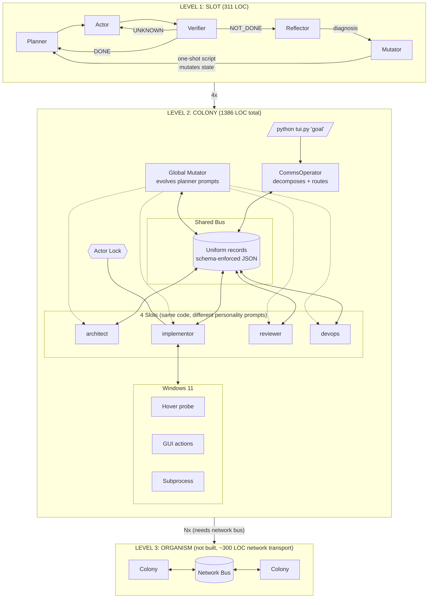
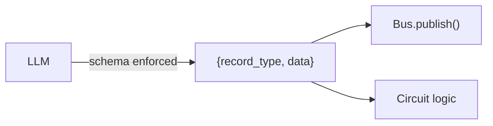
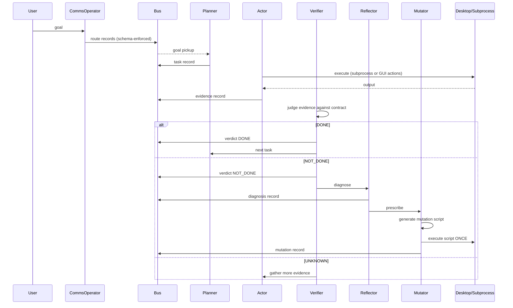

# endgame-ai

A self-evolving agentic runtime for Windows 11. Model agnostic. Single process. 1386 LOC.

## Architecture



## Unified Schema

Every LLM call enforces one output schema via LM Studio `strict: true`:

```json
{
  "record_type": "task | action | verdict | diagnosis | mutation | route",
  "data": {}
}
```

No markdown fences. No malformed JSON. No parsing fallbacks. The schema file (`prompts/schema.json`) is passed as `response_format` on every request. LM Studio's grammar enforcement guarantees compliant output.



## Execution Flow



## Configuration

All configuration lives in files. No CLI arguments except the goal. No env vars.

```
prompts/
  model.json      All LLM hyperparameters
  schema.json     Output schema (enforced by LM Studio strict mode)
  planner.txt     Circuit prompt
  actor.txt       Circuit prompt
  verifier.txt    Circuit prompt
  reflector.txt   Circuit prompt
  mutator.txt     Circuit prompt
```

`model.json` contains every LLM parameter:

```json
{
  "host": "http://localhost:1234",
  "timeout": 600,
  "temperature": 0.12,
  "top_p": 0.9,
  "top_k": 40,
  "max_tokens": 1536,
  "stream": false,
  "stop": [],
  "presence_penalty": 0.0,
  "frequency_penalty": 0.0,
  "logit_bias": {},
  "repeat_penalty": 1.06,
  "seed": 3407
}
```

To change any parameter: edit the JSON file. No code changes. No restart flags.

## How to Run

```powershell
python tui.py "your goal"
```

One command. System decides complexity.

| Runtime Key | Action |
|-------------|--------|
| Enter | New goal |
| 1-4 | Toggle slot on/off |
| q | Quit |

`--no-desktop` is the only flag (skips screen observation for pure subprocess tasks).

## Governance Model

```
CODE:      permits everything (no restrictions, no guards)
PROMPTS:   instruct who does what (soft governance)
SCHEMA:    enforces output format (LM Studio strict mode)
BUS:       records what happened (observability)
VERIFIER:  judges outcomes (correction signal)
CYCLE CAP: 5 attempts per task (only hard limit)
```

No permission checks in code. The mutator CAN rewrite any file. It is INSTRUCTED via prompt to focus on actor/verifier. If it violates that, the next cycle's verifier catches the result and the system self-corrects.

## Self-Evolution

The self-correction loop is what makes the system functional:

1. **Verifier detects failure** (NOT_DONE verdict)
2. **Reflector diagnoses root cause** (separate LLM call)
3. **Mutator writes a one-shot script** (schema-enforced, code in `data.code` field)
4. **Script executes once** (mutates prompt files, config, or anything needed)
5. **Next cycle runs with mutated state**

Without this loop, any LLM mistake repeats forever. With it, the system adapts without human intervention.

## Security Model

Intentionally unsecured. The system has the same permissions as the logged-in Windows user. No capability limits in code. The mutator can rewrite prompts, delete files, run commands. This is the self-evolution mechanism — any restriction would prevent adaptation.

## Files

```
tui.py        211 LOC   Entry point + TUI display + keyboard
colony.py     185 LOC   CommsOperator + GlobalMutator + orchestration
slot.py       311 LOC   Planner + Actor + Verifier + Reflector + Mutator
desktop.py    428 LOC   Screen observation (hover probe) + GUI actions
llm.py         94 LOC   LM Studio HTTP client (loads config from files)
actions.py     82 LOC   Verb executor (click/write/press/hotkey/scroll/focus)
bus.py         75 LOC   Shared blackboard
prompts/                Config + schema + mutable prompts
  model.json            LLM hyperparameters
  schema.json           Output schema (strict enforcement)
  planner.txt           Task decomposition prompt
  actor.txt             Action selection prompt
  verifier.txt          Verdict evaluation prompt
  reflector.txt         Failure diagnosis prompt
  mutator.txt           Mutation script generation prompt
```

**1386 LOC Python. Zero external dependencies. Python 3.12+ stdlib only.**

## Requirements

- Windows 11
- Python 3.12+
- LM Studio running with any model (tested: gemma-4-e2b-it)

---

## AI CONTINUATION HANDOVER

If you are an AI coding tool continuing work on this project, read this section completely.

### Identity

`endgame-ai` — self-evolving agentic runtime. Model agnostic. Operates Windows 11 desktop autonomously. 1386 LOC Python. Zero dependencies. Runs on any LM Studio model. Schema-enforced output on every LLM call.

### Architecture Rules

1. **OOP with injection.** No globals, no singletons, no env vars. Every class takes dependencies as constructor args.
2. **Bus is the only IPC.** Slots never call each other. All coordination through bus records.
3. **Single process.** No subprocesses for slots. No reactor. No file IPC.
4. **No code-level constraints.** Governance via prompts only. No permission checks.
5. **Prompts are mutable at runtime.** Mutator rewrites them. That IS the self-evolution mechanism.
6. **Schema always enforced.** Every LLM call passes `response_format` from `prompts/schema.json`. Output is always `{"record_type": "...", "data": {...}}`.
7. **Config in files.** `prompts/model.json` has all hyperparameters. `prompts/schema.json` has the output schema. No CLI args for config.
8. **Cycle cap = 5.** Only hard safety net. Tasks abandoned after 5 failed attempts.
9. **Verifier never trusts actor claims.** Requires independent evidence.
10. **Colony is composable.** Takes `(llm, bus, prompts_dir, workspace)`. Instantiate N times with shared bus.
11. **Mutation is one-shot.** Script in `data.code` field, runs once via `run_script()`, discarded.
12. **Reflector diagnoses, Mutator prescribes.** Two separate LLM calls, two concerns.

### File Responsibilities

| File | Does | Does NOT |
|------|------|----------|
| `bus.py` | Store/query records | Enforce permissions |
| `slot.py` | Run P→A→V→R→M loop | Decide which slot gets what goal |
| `colony.py` | Route goals, manage slots, global mutator | Execute tasks |
| `tui.py` | Display + input + orchestrate colony | Business logic |
| `desktop.py` | Observe screen + GUI actions | Decide what to click |
| `llm.py` | HTTP to LM Studio, load config/schema from files | Parse domain logic |
| `actions.py` | Execute verbs on elements | Decide which verb |

### How Schema Works

`llm.py` loads `prompts/schema.json` at init. Every `call()` passes it as `response_format`. LM Studio grammar enforcement guarantees the output matches. All circuits parse with `json.loads(result.text)` and read `record["data"]`.

The schema covers all record types: task, action, verdict, diagnosis, mutation, route. Each circuit is told in its prompt which `record_type` to return. The `data` field is flexible (type: object) — its contents vary per circuit.

### What Differentiates Slots

Same `Slot` class, different personality prompts loaded from `prompts/personalities/{name}.txt` or `prompts/{name}/personality.txt`. CommsOperator routes different sub-goals to different slot names. Only implementor has `can_act_desktop=True`.

### Testing Without LM Studio

```python
from slot import Slot
from bus import Bus
from llm import LLMResult

class MockLLM:
    def __init__(self, responses):
        self._r = list(responses); self._i = 0
    def call(self, s, u, **kw):
        if self._i < len(self._r): r = self._r[self._i]; self._i += 1; return r
        return LLMResult(text='')

bus = Bus()
slot = Slot("test", MockLLM([
    LLMResult(text='{"record_type":"task","data":{"tasks":[{"id":"t1","description":"exec: print(42)","contract":"42"}]}}')
]), bus, prompts_dir, workspace)
slot.set_goal("test")
result = slot.step()
assert result["phase"] == "plan"
```

### The System Will Have Errors

This is expected and by design. Errors are input to the reflector/mutator self-correction loop.

**Correct behavior:** plan → fail → reflect → mutate → retry differently → succeed.

Do not try to prevent all errors. Ensure:
1. Errors are caught (try/except around `json.loads` and subprocess)
2. Errors produce bus records (so reflector can read them)
3. Cycle cap triggers at 5 (so infinite loops terminate)
4. History is passed to planner (so it replans with failure context)

### Common Issues

**"LLM returns empty content"** — `max_tokens` in `model.json` too low for the model's reasoning budget. Increase to 2048+. The model uses reasoning tokens before producing content.

**"System doesn't progress"** — Check LM Studio server logs at `~/.cache/lm-studio/server-logs/`. Verify `response_format` is being sent. Verify the model supports structured output.

**"Schema not enforced"** — Some models ignore `response_format`. The system requires a model that supports LM Studio's strict JSON mode. gemma-4-e2b-it works. Check LM Studio model compatibility.

**"Mutator produces bad code"** — Expected with small models. The code runs in subprocess, fails, gets logged to bus. Next reflector cycle sees the failure. Self-correcting by design.
