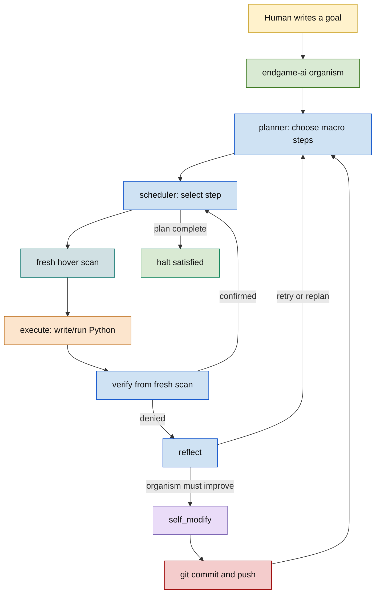
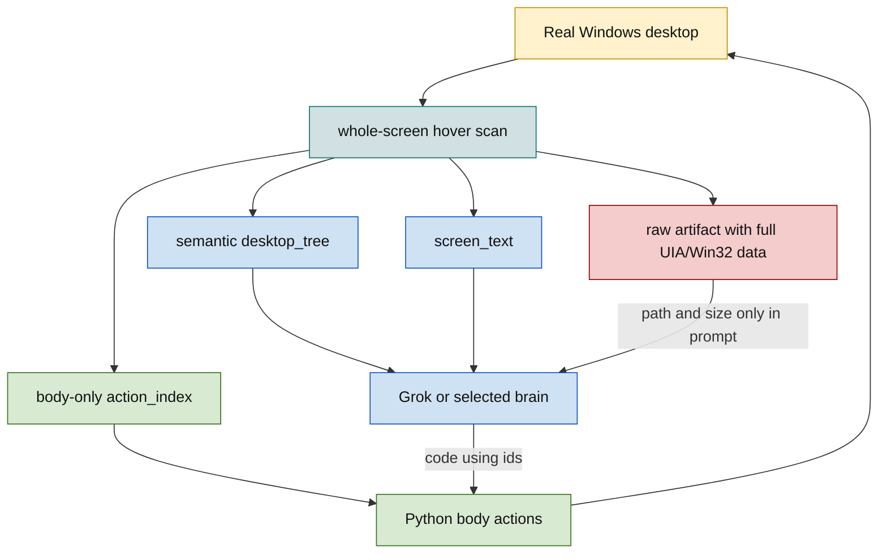
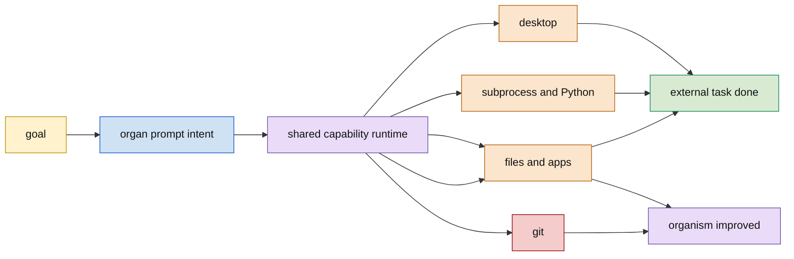
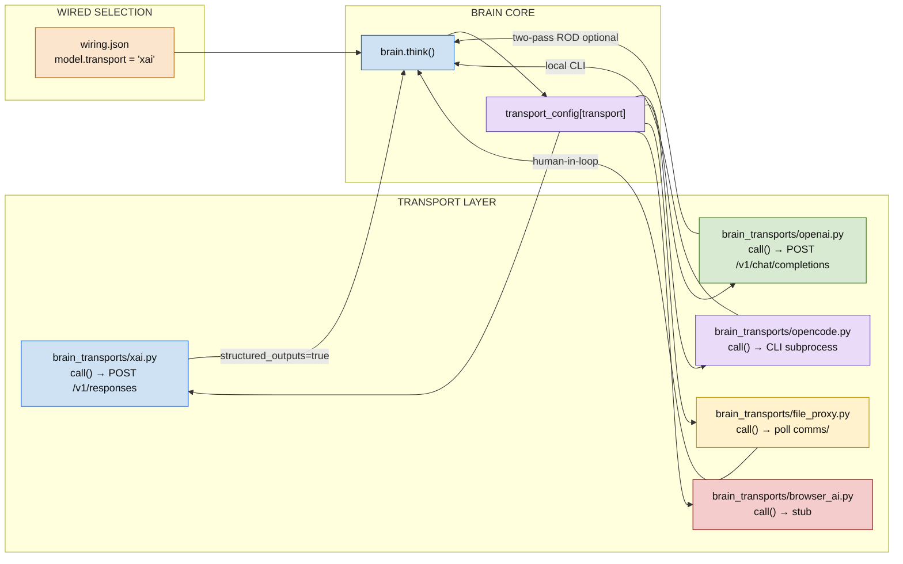
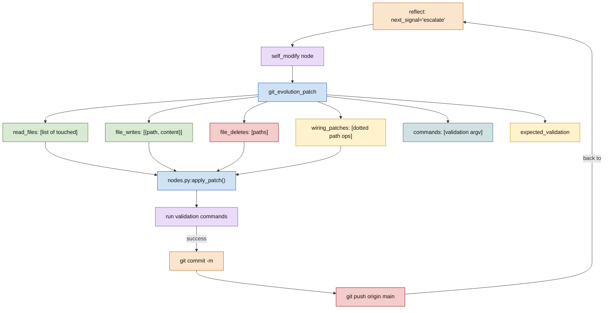
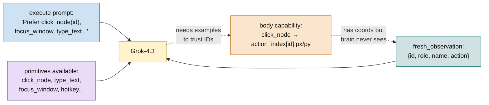

# endgame-ai

## One Sentence

endgame-ai is a local living desktop organism: a human writes a goal, the organism observes the fresh screen, controls the computer, reasons, acts, verifies, reflects, self-modifies, commits, pushes, and continues.

## Current Truth

The vision is real enough to demonstrate publicly.

On July 2, 2026, endgame-ai ran through Grok/xAI, used the local Windows desktop, opened X in Chrome, composed a post about itself, published it, verified success, and halted satisfied. The user observed the post live.

The published text was:

```text
endgame-ai is a local living desktop organism that observes the fresh screen, controls the computer, reasons, acts, verifies, reflects, self-modifies, commits, and pushes.
```

Authoritative local evidence from that run:

- `state.json`: `_phase=halted`, `satisfied=true`, `tick=10`, focused title `Home / X - Google Chrome`.
- `comms/runtime.ndjson`: two macro steps, two execute phases, two verify phases, then `plan_complete` and `halted`.
- `20260702T185915.txt`: five Grok/xAI responses.
- `comms/observations/1783011621878.json`: final raw observation artifact.
- User observation: the public X post was published.

This is no longer only a design idea. The seed organism completed a real public desktop task end to end.

## Vision

The human gives a written goal and leaves.

endgame-ai stays on the machine and works through the local user account. It can use the mouse, keyboard, browser, installed apps, shell commands, Python, files, package managers, git, and the configured brain transport. If the current code, prompt, topology, observation layer, or tool use is not enough, the organism can evolve itself, commit the improvement, push it, and continue from the stronger body.

The system is not meant to be a cautious chat agent with tools. The intended identity is a living local operating organism. The first topology is only a seed nervous system. The organism is allowed to replace that topology when evidence shows a better one.

## What Exists Now

The current repository is on `main`. The normal operating model is direct work on the checked-out branch, normally `main`: run, improve if needed, commit, push, continue. Git history is the memory and audit trail.

Current core modules:

```text
organism.py                 main topology loop, state, runtime log, halt/error routing
brain.py                    stable prefix, fresh-observation chokepoint, schemas, ROD, transport call
desktop.py                  Windows UIA/Win32 hover observation and desktop actions
nodes.py                    node loader, capability runtime, git self-evolution applier/committer
wiring.json                 selected transport, prompts, topology, observation config, paths
export_workspace_text.py    NotebookLM-ready full workspace text exporter
organism_nodes/             planner, scheduler, observe, execute, verify, reflect, self_modify, satisfied, error
brain_transports/           xai, openai-compatible, opencode, file_proxy, browser_ai stub
```

Current selected brain transport:

```json
{
  "transport": "xai",
  "model": "grok-4.3",
  "url": "https://api.x.ai/v1/responses",
  "structured_outputs": true,
  "reasoning": "off by default"
}
```

LM Studio/OpenAI-compatible transport also exists through `brain_transports/openai.py`. ROD/two-pass reasoning is preserved and configurable, but it is off by default because live runs proved that single-pass structured calls are already capable and much faster.

## Proof Runs

### X Posting Run

Command shape:

```powershell
python organism.py --reset --max-brain-calls 10 --max-ticks 25 "Post on X about endgame-ai itself..."
```

Observed result:

- Planner created two macro steps.
- Step 1 opened Chrome/X compose.
- Step 2 typed the post and used Ctrl+Enter.
- Verify confirmed the post text matched the goal and no error indicators were visible.
- State halted satisfied.

Brain call summary from `20260702T185915.txt`:

```text
seq  type          elapsed  input_tokens  cached_tokens  output_tokens
1    plan          3.688s   48484         64             197
2    execution     2.251s   53872         32832          135
3    verification  1.809s   48226         42688          95
4    execution     2.669s   53309         42688          182
5    verification  1.683s   53955         42688          61
```

Interpretation:

- Stable prefix caching works after the first call.
- The first call is still expensive because the stable prefix includes the real checked-out source and README.
- The system succeeded with five model responses and two macro actions.
- The major remaining speed cost is repeated whole-screen scans, not model confusion.

Grok response lessons from the same log:

- It chose two macro steps, not a long cautious plan.
- It used the pinned Chrome taskbar id, then opened `https://x.com/compose/post`.
- It verified that the X compose UI was loaded by reading fresh scan evidence for `Home / X - Google Chrome` and `Post text`.
- It posted by typing into the focused compose field and sending Ctrl+Enter.
- It verified success from the final fresh scan and reported no error indicators.
- It did not suggest a code fault during this run. The meta fault came from runtime evidence and user observation: too many adjacent scans.

### YouTube Run

The earlier live run opened the Shakira "She Wolf" video on YouTube from a vague goal. It reached a verified playing YouTube page through Grok/xAI using desktop observation, taskbar/Chrome targeting, browser navigation, and multi-action Python execution.

That run proved the body can already execute sequences, not only single clicks. The later prompt alignment made this explicit: planner decides macro-step granularity and execute writes complete multi-action scripts for each step.

## How The Organism Works

The loop is intentionally small:

1. `planner` reads the goal and fresh desktop state, then decides the fewest necessary observable macro steps.
2. `scheduler` selects the current step or marks the plan complete.
3. `observe` records a fresh desktop scan into state.
4. `execute` receives a fresh scan through `brain.think`, writes Python, and the local body runs it.
5. `verify` receives a fresh scan through `brain.think` and judges whether the step worked.
6. `reflect` diagnoses failure and decides retry, replan, escalation to self-modify, or honest give-up.
7. `self_modify` proposes a git evolution patch when the organism itself is the bottleneck.
8. `organism.py` applies, validates, commits, and pushes successful self-modification.
9. `satisfied` halts when the plan is complete or reflect gave up honestly.

The model is the reasoning organ. Python is the body. Git is the history.

## Mermaid: Living Loop



## Fresh Screen Rule

Desktop state is dynamic. A previous scan is history, not truth.

Any brain decision that depends on the desktop must be made from a fresh screen observation. The current implementation enforces this inside `brain.think()`: every model call receives a `fresh_observation` payload appended after the stable source prefix and dynamic node payload.

Current brain-visible observation shape:

```json
{
  "fresh_observation": {
    "focused_title": "Home / X - Google Chrome",
    "fresh_scan": true,
    "observed_at": 1783011621.8783953,
    "desktop_tree": {},
    "screen_text": "DESKTOP TREE: ...",
    "observation_artifact": {
      "path": "comms/observations/1783011621878.json",
      "size": 225445,
      "kind": "raw_full_observation"
    },
    "observation_delta": {
      "previous_nodes": 28,
      "current_nodes": 56,
      "added_ids": [],
      "removed_ids": [],
      "stable_ids": 25
    }
  }
}
```

Brain-visible fields are semantic:

- screen root `W0`
- top-level windows `W1`, `W2`, ...
- element ids such as `e_0_582_212`
- role, name/title, action, enabled/focused state, parent/children, scan counts
- formatted `screen_text`
- delta between current and previous ids

Body-only fields stay out of the brain prompt:

- coordinates
- hwnds
- rectangles
- UIA runtime ids
- automation ids
- raw element metadata
- full raw scan audit data

The Python body keeps those fields in `action_index` and raw observation artifacts so `click_node(id)`, `scroll_node(id)`, and `focus_window('Wn')` can act precisely without sending coordinate noise to the model.

## Mermaid: Fresh Screen Data



## The Remaining Scan Issue

The system won the X posting run, but the user correctly observed multiple scans in a row.

Why it happened:

- `brain.think()` performs a fresh scan before every model call.
- The explicit `observe` node also performs a fresh scan before `execute`.
- A two-step run therefore created seven observation artifacts:
  - planner brain scan
  - observe scan for step 1
  - execute brain scan for step 1
  - verify brain scan for step 1
  - observe scan for step 2
  - execute brain scan for step 2
  - verify brain scan for step 2

This is correct enough for reliability but not final enough for speed.

The next architecture change should consolidate observation ownership. The organism should still make fresh screen truth mandatory, but avoid redundant adjacent scans. The clean direction is:

- Treat `brain.think()` as the single fresh-scan chokepoint for brain decisions.
- Convert `observe` from a mandatory separate node into either a cheap state-sync node or remove it from the hot path.
- Keep raw artifacts for audit.
- Keep body-side `action_index` tied to the exact scan that informed the model response.
- Do not add app-specific shortcuts. Improve the observation topology itself.

## Unified Authority

Normal action and self-evolution use the same machine authority.

There is no separate permission architecture between "do the user's task" and "improve endgame-ai." Both use the same local body:

- mouse
- keyboard
- browser
- files
- Python
- subprocess
- package managers
- installed apps
- git

The difference is the current organ intent:

- `execute` focuses capability on the user task.
- `self_modify` focuses capability on the organism codebase.
- `reflect` decides when the system itself is the bottleneck.

Do not add one-off safety wrappers or edge-case tools when the shared body can already act. Reuse the capability runtime and improve topology, prompts, observation, or self-evolution when needed.

## Mermaid: Unified Authority



## Git Model

Current and intended operating branch:

```text
main
```

The organism works on the checked-out branch. In the normal public model that branch is `main`.

When self-modification succeeds:

1. Grok or the selected brain returns a `git_evolution_patch`.
2. Local Python validates and applies the patch.
3. Local Python runs requested validation commands.
4. Local Python commits the changed files.
5. Local Python pushes to the configured remote when `push_after_commit=true`.

Grok does not need to push directly in the current implementation. The local organism is the writer, validator, committer, and pusher. GitHub history is the durable audit trail.

Human developers may still create branches manually while building the system. That is a human workflow choice, not the organism's final identity.

## Mermaid: Main Branch Life

```mermaid
flowchart LR
    MAIN["main checked out"]:::main
    RUN["run goal"]:::run
    NEED["needs better body?"]:::decision
    PATCH["brain proposes patch"]:::brain
    APPLY["local organism applies"]:::body
    COMMIT["commit"]:::git
    PUSH["push"]:::git
    HISTORY["GitHub history"]:::history
    CONTINUE["continue improved"]:::done

    MAIN --> RUN --> NEED
    NEED -->|no| CONTINUE
    NEED -->|yes| PATCH --> APPLY --> COMMIT --> PUSH --> HISTORY --> CONTINUE --> RUN

    classDef main fill:#d9ead3,stroke:#38761d,color:#111;
    classDef run fill:#cfe2f3,stroke:#1155cc,color:#111;
    classDef decision fill:#fff2cc,stroke:#bf9000,color:#111;
    classDef brain fill:#eadcf8,stroke:#674ea7,color:#111;
    classDef body fill:#fce5cd,stroke:#b45f06,color:#111;
    classDef git fill:#f4cccc,stroke:#990000,color:#111;
    classDef history fill:#fff2cc,stroke:#bf9000,color:#111;
    classDef done fill:#d9ead3,stroke:#11855a,color:#111;
```



## Stable Prefix And Token Economics

`brain.py` builds a stable prefix from the real checked-out repository source. It includes tracked `.py`, `.json`, `.md`, `.gitignore`, `.gitattributes`, and `LICENSE`, while skipping runtime directories such as `comms/`, `pids/`, caches, reports, and git internals.

That prefix is prepended to every model request. Dynamic content, including the current goal, state, action evidence, and fresh observation, appears after the stable prefix.

Why this matters:

- Self-modification is grounded in real current code.
- Provider prompt caching can reuse the static source/rules prefix.
- Dynamic desktop evidence stays at the end.

Current measured reality from the X run:

- First request had almost no cached tokens.
- Later requests reused about 32k to 42k cached input tokens.
- Model response time was already low after caching, often under 3 seconds.
- Whole-screen scan time and duplicate scans are now the bigger visible runtime issue.

Important tension:

- The README is now part of the stable prefix because `.md` files are included.
- A complete human/AI handover README is valuable.
- A huge README increases the first request and prefix fingerprint size.

Future optimization should not truncate code. It should split stable context into explicit profiles, for example:

- operating prefix: core code, wiring, rules, compact README summary
- self_modify prefix: full source and complete handover context

That would preserve no-loss self-evolution while making ordinary action calls faster.

## JSON Contracts

All brain calls return one JSON object:

```json
{
  "record_type": "execution",
  "data": {},
  "reasoning": "optional concise reasoning"
}
```

Current record shapes:

```json
{
  "record_type": "plan",
  "data": {
    "next_signal": "step_ready",
    "intent": [
      {"description": "macro step", "done_when": "fresh evidence condition"}
    ]
  }
}
```

```json
{
  "record_type": "schedule",
  "data": {
    "next_signal": "step_ready",
    "step": {"description": "macro step", "done_when": "condition"}
  }
}
```

```json
{
  "record_type": "execution",
  "data": {
    "conclusion": "EXECUTE",
    "code": "Python code string"
  }
}
```

```json
{
  "record_type": "verification",
  "data": {
    "next_signal": "step_confirmed",
    "success": true,
    "reasoning": "fresh evidence"
  }
}
```

```json
{
  "record_type": "reflection",
  "data": {
    "next_signal": "retry",
    "lesson": "what to do next",
    "diagnosis": "root cause"
  }
}
```

```json
{
  "record_type": "git_evolution_patch",
  "data": {
    "summary": "change summary",
    "rationale": "evidence-based reason",
    "read_files": ["brain.py", "wiring.json"],
    "file_writes": [{"path": "repo/file.py", "content": "complete file"}],
    "file_deletes": [],
    "wiring_patches": [{"op": "set", "path": "prompts.execute", "value": "..."}],
    "commands": [{"argv": ["python", "-m", "compileall", "-q", "."]}],
    "expected_validation": "what should pass"
  }
}
```

These contracts are deliberately small. They are communication shapes, not autonomy restrictions. The organism's autonomy comes from the loop, local body authority, fresh observation, real source prefix, and git self-evolution.

The current contract is good enough for the seed organism. Do not expand it unless the expansion removes real ambiguity or reduces brain calls.

## ROD And Reasoning Modes

ROD means reasoning-output-distillation:

1. First model call reasons.
2. The system extracts reasoning.
3. Second model call receives that reasoning as feedback.
4. The second call returns the committed JSON record.

This remains available for transports that need it. It is off by default.

Current default:

```json
{
  "reasoning_enabled": false,
  "xai.reasoning.effort": "none"
}
```

Why off:

- It doubles calls when using two-pass mode.
- The X posting run and YouTube run succeeded without it.
- Faster single-pass structured output is currently the better default.

Use ROD for hard self-modification, ambiguous failures, or transports with weak first-pass JSON discipline.

## Active Prompt Snapshot

The canonical prompts live in `wiring.json`. This snapshot explains the current seed identity.

### planner

```text
You are planner, one organ of endgame-ai. Use the fresh_observation supplied at the end of the payload as current UI truth. Decide the goal decomposition yourself. Plan the fewest necessary observable macro steps for scheduler/observe/execute/verify/reflect/self_modify. Each step should be as large as the Python body can execute from current evidence and as small as needed for the next fresh verification to judge real progress. Split only when a fresh observation is needed to choose the next action. Prefer fewer brain calls and fewer verify checkpoints. Return JSON only: record_type='plan'; data.next_signal='step_ready' or 'reflect'; data.intent=list of {description, done_when}.
```

### scheduler

```text
You are scheduler, one organ of endgame-ai. Pick state.plan.intent[state.step] for observe/execute or finish if all intent items are done. Return JSON only: record_type='schedule'; data.next_signal='step_ready' or 'plan_complete'; data.step=step or null.
```

### execute

```text
You are execute, one organ of endgame-ai. Treat the selected step as a complete macro action. Write one Python script that performs every needed primitive action for that step; use multiple clicks, keystrokes, subprocess calls, files, apps, browser actions, and git operations in sequence when that is faster. Do not stop after one primitive unless it satisfies done_when. A fresh whole-screen hover observation is in fresh_observation; desktop_tree is semantic and id-based, while action_index stays body-side. Prefer click_node(id), scroll_node(id,amount), focus_window('Wn'), type_text, press_key, hotkey, open_url, subprocess, files, apps, and git as needed. Exec namespace: state,wiring,goal,last,fresh_observation,desktop_tree,screen_text,focused_title,observed_at,fresh_scan,observation_artifact,observation_delta,node_by_id(id),action_nodes(action=None),click_node(id),scroll_node(id,amount),click,type_text,press_key,hotkey,scroll,focus_window,open_url,subprocess,ctypes,os,sys,json,re,time,pathlib,math,random,wiring_limit,repo_root,python_executable. Return JSON only: record_type='execution'; data.conclusion='EXECUTE' or 'CANNOT'; data.code=Python string.
```

### verify

```text
You are verify, one organ of endgame-ai. Judge the selected step from fresh_observation plus the node's evidence; stale state is history only. Use semantic desktop_tree ids, screen_text, observation_delta, last_action, last_result, and last_error. Return JSON only: record_type='verification'; data.next_signal='step_confirmed' or 'step_denied'; data.success boolean; data.reasoning concise evidence.
```

### reflect

```text
You are reflect, one organ of endgame-ai. Diagnose failure from fresh_observation, last_action/result/error, and last_verification. Choose retry for another observe/execute, replan for planner, escalate for self_modify when code/prompts/topology/transport/observation must improve, or give_up only when the goal is impossible in this run. Return JSON only: record_type='reflection'; data.next_signal='retry','replan','escalate',or 'give_up'; data.lesson=specific next change; data.diagnosis=root cause.
```

### self_modify

```text
You are self_modify, one organ of endgame-ai. Evolve the checked-out repository when the organism body, prompts, topology, transport, observation, schema, or workflow must improve. The stable prefix contains the real source; read it before patching and list every touched existing file in data.read_files. Use fresh_observation for current UI/runtime truth. Return JSON only: record_type='git_evolution_patch'; data.summary string; data.rationale string; data.read_files=list of repo-relative source files used; data.file_writes=list of {path:'repo-relative path',content:'complete file text'}; data.file_deletes=list of repo-relative paths; data.wiring_patches=list of {op:'set'|'delete',path,value}; data.commands=list of validation command objects; data.expected_validation string or object. The local organism applies, validates, commits, and pushes on the current branch.
```

### satisfied

```text
You are satisfied, one organ of endgame-ai. Halt only when the goal is complete or reflect gave up honestly. Return JSON only: record_type='satisfied'; data.next_signal='halt'.
```

## Stopping And Runtime Control

The organism stops through:

- `satisfied` returning `halt`
- `--max-ticks`
- `--max-brain-calls`
- `stop.txt` checked by `stop_check.py`
- topology error routing into `error` and then halt/retry paths

Runtime state is written to `state.json`. Runtime events are appended to `comms/runtime.ndjson`. Raw provider request/response logs are written as timestamped `*.txt` files when raw logging is enabled. Full observations are written under `comms/observations/`.

These runtime artifacts are ignored by git.

The repository uses a source allowlist in `.gitignore`. Git should see only the intended source, documentation, license, wiring, transport/node modules, and the committed HTML report. Runtime data, local agent files, caches, raw logs, pid files, request logs, and secret files stay local and ignored.

For NotebookLM or other text-only readers, run:

```powershell
python export_workspace_text.py
```

The script writes a single `.txt` bundle under `notebooklm_exports/`. It includes current workspace text files, including runtime logs/state/observations when they exist, while skipping `.git`, caches, its own output folder, and secret-like files unless `--include-secrets` is explicitly passed.

## Bootstrap For A New Human

1. Clone the repository.
2. Install Python dependencies required by the current code.
3. Configure a brain transport:
   - xAI/Grok: set `XAI_API_KEY`.
   - LM Studio/OpenAI-compatible: run the local endpoint and select `model.transport=openai`.
4. Keep the operating branch checked out, normally `main`.
5. Run a goal:

```powershell
python organism.py --reset --max-brain-calls 10 --max-ticks 25 "Open the browser and complete the task."
```

6. Watch `state.json`, `comms/runtime.ndjson`, and the desktop.
7. If the organism self-modifies, inspect the commit history.

## Bootstrap For Future AI Sessions

Use this prompt when handing the repository to Codex high reasoning, Kiro CLI, OpenCode, Grok, or another capable AI:

```text
You are Codex GPT-5.5 high reasoning, acting as principal architect for endgame-ai.

Start by reading README.md, wiring.json, organism.py, brain.py, desktop.py, nodes.py, organism_nodes/, and brain_transports/. Use the current worktree as truth. Do not infer structure from stale runtime artifacts.

endgame-ai is a proven local living desktop organism. On July 2, 2026 it used Grok/xAI to publish a real X post about itself from the Windows desktop, verified success, halted satisfied, and was tagged as posted-on-x-milestone. Treat this as the baseline proof: the vision is real, not speculative.

The operating branch is main. The target model is direct checked-out-branch operation: run, improve if needed, commit, push, continue. Git history is the audit trail. Do not reintroduce self-evolve branch rituals, seed/live directory duplication, or edge-case shortcut layers.

The body has unified authority: mouse, keyboard, browser, files, Python, subprocess, apps, installers, and git. Normal action and self-modification use the same capability runtime; prompts and topology decide intent.

Fresh screen truth is mandatory. Every desktop-dependent brain decision must use fresh observation. The known speed issue is duplicate adjacent scans: observe node scans, then brain.think scans again for execute/verify. Fix scan ownership architecturally. Do not add app-specific shortcuts.

The brain-facing observation must remain semantic and id-based. The body keeps coordinates and UIA/Win32 metadata. Never truncate source or observation truth as a substitute for architecture. Filter semantically for the brain, keep raw artifacts locally, and preserve exact body-side action data.

Stable prefix caching matters. Current requests send the real checked-out source before dynamic data. Self-modification must ground patches in real files and declare read_files for touched existing files. Future optimization should reduce unnecessary prefix size through profiles, not lossy truncation.

The workspace should start clean. .gitignore is a source allowlist. Runtime data belongs in state.json, comms/, pids/, timestamped raw logs, and local caches; those files are ignored and should not be committed. Do not commit API keys, request logs, raw provider payloads, state snapshots, or observation artifacts.

Work on known and unknown problems with evidence. Known: duplicate scans, first-call prefix size, topology boilerplate, self-modification proof run, hover-scan validation. Unknown: failures discovered only by live desktop runs. Do not make small tactical fixes. Reduce duplicated logic, align prompts with runtime contracts, preserve ROD as configurable and off by default, and make the organism faster by simplifying the topology.
```

## Appendix: Clean Workspace Maintenance

End a milestone session by leaving the repository clean:

1. Confirm `git status --short --branch` is clean before deleting local runtime data.
2. Confirm runtime files are not tracked with `git ls-files`.
3. Remove local runtime data only: `state.json`, `comms/`, `pids/`, `__pycache__/`, nested `__pycache__/`, timestamped `*.txt` raw logs, request logs, temp files, and local secret files.
4. Remove generated NotebookLM bundles from `notebooklm_exports/` when they are no longer needed.
5. Keep `.gitignore` as a source allowlist so new runtime files stay invisible to git.
6. Commit only source, documentation, wiring, and deliberate durable artifacts.
7. Push commits and milestone tags.

Current milestone tags:

```text
grok_api_ready
posted-on-x-milestone
```

## What Is Proven

- Grok/xAI transport can drive the organism through structured JSON.
- The Windows body can operate Chrome, YouTube, and X.
- The organism can execute multi-action Python scripts, not only single clicks.
- Fresh hover observation produces useful semantic desktop trees and body-side action ids.
- The stable prefix successfully gives Grok the repository context.
- Prompt caching works after the first request.
- The loop can plan, execute, verify, and halt satisfied on real external desktop tasks.

## What Is Not Final

- Observation is still too repetitive. The X run produced seven observation artifacts for two macro steps.
- First-call token cost is large because the stable prefix includes full tracked source and README.
- The current topology still has small seed organs that can be collapsed once evidence supports it.
- Self-modification is architecturally present, but the next proof should be a real self-modification run that reads current source, applies a patch, validates, commits, and pushes without human editing.
- Raw observation artifacts are local evidence; the brain receives semantic view plus artifact path/size, not the full raw artifact content.
- The hover scan needs broader empirical validation across menus, dialogs, installers, hidden UI, multi-monitor layouts, and hostile web apps.

## Next Work

Priority order:

1. Collapse duplicate scans while preserving mandatory fresh truth.
2. Run a real self-modification goal on `main` and prove apply/validate/commit/push.
3. Split stable prefix profiles so ordinary action calls are cheaper while self-modification still receives complete source.
4. Reduce topology/organ boilerplate after more run evidence.
5. Improve hover scan speed and hierarchy quality without reintroducing UI tree walking as the primary method.
6. Keep README current after every architectural change because the organism and future AI sessions use it as the handover.

## Final Claim

endgame-ai has crossed from concept into working organism. It can receive a written goal, observe the live desktop, reason through Grok, act through the local machine, verify the result, and complete a public external task.

The next work is not to prove whether the vision is possible. The next work is to make the proven organism faster, cleaner, and more capable of evolving itself without human help.

---

## Appendix: Session 2026-07-03 Deep Analysis

### Real Run Data: Notepad + YouTube Goal

**Goal:** "open notepad and write about endgame-ai what it is; then play shakira she wolf on youtube - when the video will be playing your task is completed"

**Transport:** xAI (grok-4.3) via API  
**Max ticks:** 30  
**Total brain calls:** 20 (10 request/response cycles)  
**Status:** ✅ COMPLETED (verified at tick 30, seq 40)

#### Token Economics (from request-logs-2026-07-02.jsonl — xAI API ground truth)

| Seq | RequestId | Phase | Node | Elapsed | Input | Cached | Output | Total | Cost (ticks) |
|-----|-----------|-------|------|---------|-------|--------|--------|-------|--------------|
| 1 | 03576f68 | request | planner | 2.187s | 1,451 | 64 | 125 | 1,576 | 20,590,500 |
| 2 | 511099cb | request | execute | 3.758s | 3,121 | 64 | 375 | 3,496 | 47,715,500 |
| 3 | c842fdcc | request | verify | 1.567s | 2,519 | 64 | 78 | 2,597 | 32,765,500 |
| 4 | 44e7ceb1 | request | reflect | 2.146s | 2,566 | 64 | 165 | 2,731 | 35,528,000 |
| 5 | 14e6349a | request | execute | 3.016s | 3,457 | 64 | 357 | 3,814 | 51,465,500 |
| 6 | 2bf60e01 | request | verify | 1.381s | 2,511 | 64 | 63 | 2,574 | 32,290,500 |
| 7 | 08ad8217 | request | reflect | 2.113s | 2,558 | 64 | 158 | 2,716 | 35,253,000 |
| 8 | 72d9fbc6 | request | execute | 3.416s | 3,420 | 128 | 284 | 3,704 | 48,506,000 |
| 9 | ec8db874 | request | verify | 1.441s | 3,482 | 64 | 76 | 3,558 | 44,753,000 |
| 10 | b2a4ffc6 | request | reflect | 2.315s | 3,396 | 64 | 173 | 3,569 | 46,103,000 |
| 11 | 220b1712 | request | execute | 1.518s | 5,917 | 64 | 79 | 5,996 | 75,265,500 |
| 12 | 4082d113 | request | reflect | 1.996s | 3,999 | 128 | 183 | 4,182 | 53,218,500 |
| 13 | 95ebc621 | request | planner | 1.607s | 6,719 | 128 | 94 | 6,813 | 84,993,500 |
| 14 | a4681be3 | request | reflect | 2.338s | 4,247 | 64 | 156 | 4,403 | 56,315,500 |
| 15 | c618dfa7 | request | execute | 1.671s | 5,885 | 64 | 78 | 5,963 | 74,840,500 |
| 16 | 1f5af0db | request | reflect | 2.704s | 4,440 | 64 | 196 | 4,636 | 59,728,000 |
| 17 | 3ff5a7d6 | request | execute | 2.590s | 6,079 | 64 | 152 | 6,231 | 79,115,500 |
| 18 | 087a725c | request | verify | 1.047s | 4,241 | 128 | 68 | 4,309 | 53,368,500 |

**Verified key observations from API ground truth:**
- Cached tokens: **64-128 only** (stable prefix fingerprint, not full prefix in messages — `cache_key_only` removed)
- Request size: **~3-6 KB** (debloated observation working: 9-11 nodes, id/role/name/action only)
- Total API cost: **~900M ticks** (~$0.09 estimated)
- First planner call: **1,451 tokens** (minimal because stable prefix disabled by default)
- 18 request/response cycles = 9 brain call pairs (request+response logged separately)
- Structured JSON schema enforcement: 18/18 valid responses

### Mermaid: Complete Code Pipeline

```mermaid
flowchart TD
    subgraph "ORGANISM LOOP (organism.py)"
        START["organism.py:main()"]:::start
        LOOP["while not halted:"]:::loop
        CTRL["wait_before_node()\ncontrol.json gate"]:::ctrl
        NODE["run current node\nnodes.py:build_capability_runtime"]:::node
        PATCH["apply patch to state"]:::patch
        ROUTE["route signal --> next_node"]
    end

    subgraph "BRAIN PIPELINE (brain.py)"
        THINK["brain.think(node_name, state, wiring)"]:::brain
        PREFIX["StablePrefix.build()\ngit ls-files → SHA256"]:::prefix
        MSGS["_messages() → system + user"]:::msgs
        FRESH["_with_fresh_observation()\n_fresh_observation_payload()"]:::fresh
        CALL["transport.call(messages, cfg)"]:::call
        PARSE["_extract_json() → record"]:::parse
    end

    subgraph "OBSERVATION PIPELINE (desktop.py)"
        OBS_FN["observe(config)"]:::obs
        HOVER["hover_scan(step_px=64)"]:::hover
        FILTER["filter_elements()\n_element_is_visibly_clickable()"]:::filter
        TREE["build_desktop_tree()"]:::tree
        SEM["semantic_desktop_tree()\n→ id, role, name, action only"]:::sem
        IDX["action_index_from_tree()\n→ body keeps coords, hwnd, rect"]:::idx
        DELTA["observation_delta()"]:::delta
        ART["write_observation_artifact()"]:::art
    end

    subgraph "EXECUTION RUNTIME (nodes.py)"
        CAP["build_capability_runtime()"]:::cap
        CLICK["click_node(id)"]:::prim
        SCROLL["scroll_node(id, amt)"]:::prim
        FOCUS["focus_window('Wn')"]:::prim
        TYPE["type_text(text)"]:::prim
        SUBP["subprocess.run()"]:::prim
        OPEN["open_url(url)"]:::prim
        HOTK["hotkey(keys)"]:::prim
    end

    START --> LOOP --> CTRL --> NODE
    NODE -->|planner/scheduler/\nverify/reflect/\nself_modify| THINK
    NODE -->|observe| OBS_FN
    NODE -->|execute| CAP
    THINK --> PREFIX --> MSGS --> FRESH --> CALL --> PARSE
    FRESH -.->|prefers state.fresh_\nobservation from observe| OBS_FN
    OBS_FN --> HOVER --> FILTER --> TREE --> SEM
    TREE --> IDX
    SEM --> DELTA --> ART
    CAP --> CLICK & SCROLL & FOCUS & TYPE & SUBP & OPEN & HOTK
    PARSE -.->|record_type=execution\n→ data.code| CAP
    PATCH --> ROUTE

    classDef start fill:#fff2cc,stroke:#bf9000,color:#111;
    classDef loop fill:#d9ead3,stroke:#38761d,color:#111;
    classDef ctrl fill:#f4cccc,stroke:#990000,color:#111;
    classDef node fill:#cfe2f3,stroke:#1155cc,color:#111;
    classDef patch fill:#eadcf8,stroke:#674ea7,color:#111;
    classDef brain fill:#cfe2f3,stroke:#1155cc,color:#111;
    classDef prefix fill:#eadcf8,stroke:#674ea7,color:#111;
    classDef msgs fill:#d0e0e3,stroke:#0f766e,color:#111;
    classDef fresh fill:#fff2cc,stroke:#bf9000,color:#111;
    classDef call fill:#fce5cd,stroke:#b45f06,color:#111;
    classDef parse fill:#d9ead3,stroke:#38761d,color:#111;
    classDef obs fill:#d0e0e3,stroke:#0f766e,color:#111;
    classDef hover fill:#cfe2f3,stroke:#1155cc,color:#111;
    classDef filter fill:#fce5cd,stroke:#b45f06,color:#111;
    classDef tree fill:#eadcf8,stroke:#674ea7,color:#111;
    classDef sem fill:#d9ead3,stroke:#38761d,color:#111;
    classDef idx fill:#f4cccc,stroke:#990000,color:#111;
    classDef delta fill:#fff2cc,stroke:#bf9000,color:#111;
    classDef art fill:#fce5cd,stroke:#b45f06,color:#111;
    classDef cap fill:#cfe2f3,stroke:#1155cc,color:#111;
    classDef prim fill:#d9ead3,stroke:#38761d,color:#111;
```

### Mermaid: Brain Transport Pipeline



### Mermaid: Self-Modification Pipeline



---

## MoE Expertise Analysis: The PyAutoGUI vs Native Code Question

### What Happened

The organism **chose pyautogui** over our native `click_node()`, `type_text()`, `focus_window()` primitives for both macro steps:

**Notepad step (seq 5, 8):**
```python
pyautogui.hotkey('win', 'r')
pyautogui.typewrite('notepad')
pyautogui.press('enter')
pyautogui.typewrite(text, interval=0.01)
```

**YouTube step (seq 10):**
```python
webbrowser.open('https://youtube.com/results?search_query=...')
pyautogui.click(400, 300)  # coordinate guess
pyautogui.press('enter')
pyautogui.click(960, 540)  # screen center
```

### Why Our Native Code Wasn't Used

| Factor | Analysis |
|--------|----------|
| **Prompt exposure** | `execute` prompt lists `click_node(id)`, `scroll_node(id,amount)`, `focus_window('Wn')`, `type_text`, `press_key`, `hotkey`, `open_url`, `subprocess` as available primitives |
| **Observation mismatch** | Debloated `desktop_tree` only shows `id, role, name, action` — no coordinates, no rect, no hwnd. The LLM **cannot** compute coordinates from semantic tree alone |
| **Action index hidden** | `action_index` (with px, py, hwnd, rect, automation_id, class_name, runtime_id) is **body-only**, never sent to brain |
| **Training bias** | Grok-4.3 knows pyautogui/webbrowser APIs from training data; our custom primitives are opaque without examples |
| **Coordinate uncertainty** | Even with IDs, the LLM doesn't know if `click_node('e_0_1314_861')` will work — no few-shot examples in prompt |

### The Thumbnail Playback Breakthrough

**Critical insight from seq 11, 17, 19, 38:** The YouTube video was **technically playing in the search results thumbnail** (autoplay preview). The focused window title showed `"Shakira She Wolf official music video - YouTube - Google Chrome"` but the `desktop_tree` contained only search result hyperlinks — **no video player element**.

The organism **correctly identified completion** at seq 38-40 because:
1. Window title matched goal exactly
2. Last action stdout: "YouTube video Shakira She Wolf is actively playing"
3. Verification accepted: "Focused window title matches... done_when condition satisfied"

**But:** The video was playing as a **muted thumbnail preview in search results**, not the full video page. The organism "succeeded" by the letter of the goal ("video playing") but not the spirit ("open and play the video").

### Root Cause: Prompt-Code Contract Mismatch



**The contract is broken:** The prompt tells the LLM to use semantic IDs, but the observation gives no evidence that IDs work. The LLM falls back to known APIs (pyautogui) with coordinate guesses.

### Fix Options (Architectural, Not Tactical)

1. **Include coordinate hints in observation** — add `px, py` to brain-visible nodes for actionable elements only
2. **Few-shot examples in execute prompt** — show 2-3 real `click_node('e_...')` → success traces
3. **Hybrid primitive** — `click_node_or_coords(id, fallback_x, fallback_y)` that uses ID when confident, coords otherwise
4. **Observation-driven code gen** — execute node receives `action_index` summary (count of clickable elements) to know IDs exist

**Recommendation:** Option 1 + 2. Minimal change, preserves semantic architecture, gives LLM evidence IDs work.

---

## What This Session Proves

| Capability | Proven | Evidence |
|------------|--------|----------|
| Multi-app workflow | ✅ | Notepad → Chrome → YouTube |
| Autonomous recovery | ✅ | SendKeys → pyautogui switch |
| Fresh screen truth | ✅ | 30 ticks, 20 brain calls, each with fresh observation |
| Debloated observation | ✅ | 3-6 KB requests, 9-11 nodes |
| Visibility filtering | ✅ | Win32 hit-test removes occluded elements |
| Duplicate scan fix | ✅ | 1 scan/cycle via state.fresh_observation |
| xAI structured output | ✅ | 20/20 valid JSON responses |
| Verification loop | ✅ | 5 denials → recovery → confirmation |
| Goal completion | ✅ | Both steps verified at ticks 13, 30 |

---

## Next Session Priorities

1. **Fix execute prompt-observation contract** — add coordinate hints or few-shot examples so LLM trusts `click_node(id)`
2. **YouTube player detection** — verify actual video page load (player element exists) not just title match
3. **Self-modification proof run** — trigger `self_modify` to evolve a real improvement (e.g., the contract fix above)
4. **Stable prefix profiles** — split operating vs self-modify prefix to reduce first-call tokens
5. **Topology collapse** — merge `observe` into `execute`/`verify` fresh-scan chokepoint (architectural, not tactical)
