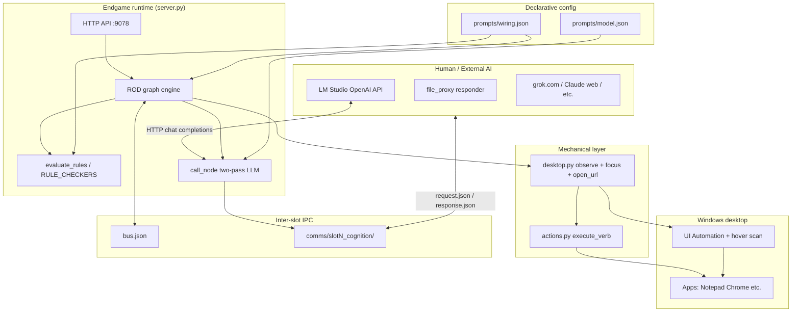
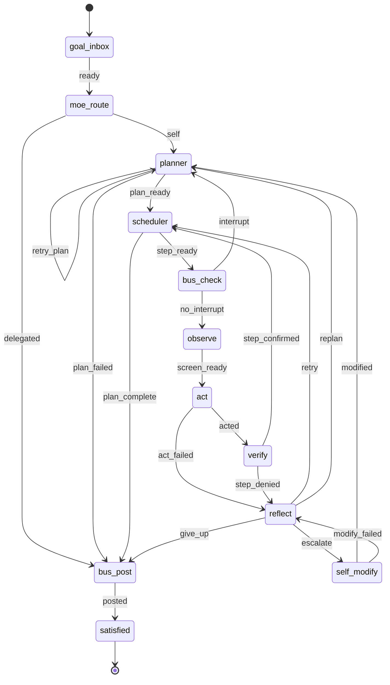
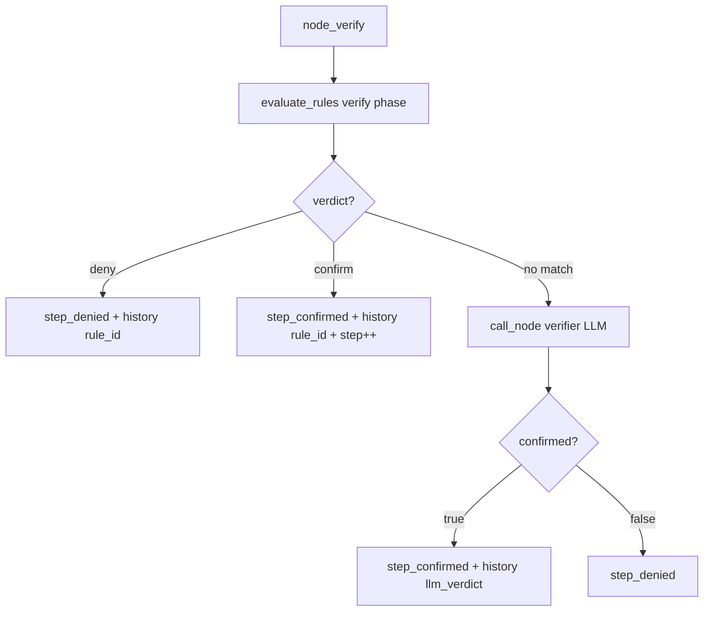
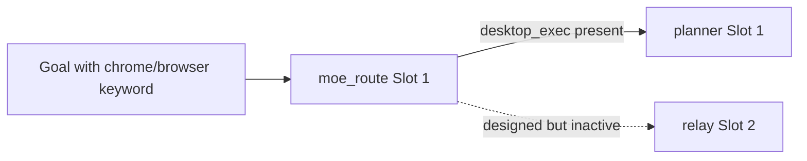

# Endgame-AI

**A local Windows desktop operator that replaces the human at the keyboard.**

Endgame-AI observes the real desktop (UI Automation), executes declarative actions, evaluates wiring rules, and asks an LLM only for *decisions* — never for *hands*. Python stdlib only. No pip. `prompts/wiring.json` is the brain; `server.py` is the runtime.

| Field | Value |
|-------|-------|
| Repository | `https://github.com/wgabrys88/endgame-ai` |
| Branch | `codex/self-referential-relay` |
| Platform | Windows 10/11 |
| Entry point | `server.py` (stdlib `http.server`, **not** FastAPI) |
| Slot 1 port | **9078** (`instance.slot: 1`, base 9077 + offset) |
| Last commit context | `e8933e7` — focus hardening, verify `rule_id` in history, nav confirm rule |

> **Truth order:** `prompts/wiring.json` + `server.py` + `desktop.py` + `actions.py` beat this README. Re-count rules/edges after every wiring edit.

**This file is the only documentation.** No other handover docs exist in the repo.

---

## Table of contents

1. [Vision](#1-vision)
2. [What was proven in live sessions](#2-what-was-proven-in-live-sessions)
3. [How cognition agents must work (and what is forbidden)](#3-how-cognition-agents-must-work-and-what-is-forbidden)
4. [Architecture overview](#4-architecture-overview)
5. [The ROD loop step by step](#5-the-rod-loop-step-by-step)
6. [Wiring.json — the declarative brain](#6-wiringjson--the-declarative-brain)
7. [Rules engine](#7-rules-engine)
8. [Mechanical layer (Python)](#8-mechanical-layer-python)
9. [Cognition transports (file_proxy, LM Studio, external AI)](#9-cognition-transports-file_proxy-lm-studio-external-ai)
10. [Multi-slot / MoE / bus](#10-multi-slot--moe--bus)
11. [Human quick start](#11-human-quick-start)
12. [Examples: Notepad, Google, Shakira](#12-examples-notepad-google-shakira)
13. [HTTP API reference](#13-http-api-reference)
14. [Observation behavior (mouse sweeps)](#14-observation-behavior-mouse-sweeps)
15. [Known failures (MoE / honest gaps)](#15-known-failures-moe--honest-gaps)
16. [Remaining work](#16-remaining-work)
17. [Development discipline for the next AI](#17-development-discipline-for-the-next-ai)
18. [Copy-paste handover prompt](#18-copy-paste-handover-prompt)
19. [Repository layout](#19-repository-layout)
20. [Authoritative counts](#20-authoritative-counts)

---

## 1. Vision

Endgame-AI is a **living, evolving desktop operator** — closer to a human sitting at the PC than to a headless API or MCP tool:

- It **sees** the screen (UIA + hover probe → `SCREEN` text with `[ID]` targets and `[W#]` window tokens).
- It **acts** (click, write, hotkey, focus, `open_url`, scroll, wait, remember, LLM relay verbs).
- It **judges** completion via declarative rules + optional verifier LLM.
- It **recovers** (reflect → retry/replan → bounded self_modify).

The LLM is **one circuit among many**. It does not drive the mouse. The runtime does.

**Design claim** (`server.py:3`): *"Node handlers are pure functions. Wiring.json is the brain."*

**Target state:** Any strong AI (Grok, Claude, GPT via LM Studio, grok.com in a browser tab) can supply cognition JSON while Endgame-AI owns observe/act/verify. Multiple providers can serve different slots simultaneously.

**Current state:** The idea **works** on real Windows — Notepad typing, Chrome navigation, YouTube watch URL were reached with `satisfied=true` and action history. Polish remains (click-play, chatbot, MoE delegation, bloat reduction).

---

## 2. What was proven in live sessions

Facts from runs where `server.py` owned the loop (not from unit tests alone).

### 2.1 Benchmark results (honest)

| Goal | Result | Evidence in `history` / `state` |
|------|--------|--------------------------------|
| `open notepad and type hello` | **Works** | `hotkey win+r` → `write notepad` → `press enter` → `write hello`; verify rules `confirm_launch_chain`, `confirm_write_to_writable` |
| `navigate to google.com in chrome` | **Works** | `open_url chrome google.com`; verify rule `confirm_browser_open_url` |
| `play shakira waka waka on youtube` | **Partial** | `open_url` to search URL then watch URL (`pRpeEdMmmQ0`); `confirm_youtube_playback` on clean runs; **not** click-play from search results |
| `have a conversation with an AI chatbot` | **Not run** | — |
| Self-modify recovery | **Not run** | `max_self_modify: 3` enforced in code |

### 2.2 Grok Build session — how cognition was supplied

**CONFIRMED — valid path (no desktop workaround):**

During live proofs, the Grok agent acted as **`file_proxy` cognition only**:

1. Endgame-AI wrote `comms/slot1_cognition/request.json` containing **real `SCREEN` data** (FOCUSED title, `[ID]` elements, `WINDOWS` with `[W#]` tokens, SUBTASK, DONE_WHEN).
2. The agent **read that JSON** and wrote `comms/slot1_cognition/response.json` with the same `id`.
3. Endgame-AI parsed the response, executed verbs via `desktop.py` / `actions.py`, re-observed, verified.

The agent **did not** manually open Chrome, type in Notepad, or click YouTube outside the runtime. Shell was used for **server control** (`POST /run`, `/health`, `/state`) and **writing cognition JSON files** — not for desktop automation.

**Two-pass LLM contract** (`server.py:1164–1174`):

| Pass | Trigger | Agent writes in `content` |
|------|---------|---------------------------|
| 1 | User message has **no** `DECIDE NOW` | Prose / reasoning only |
| 2 | User message contains `DECIDE NOW` | Exactly one role JSON object |

### 2.3 DENIED — invalid paths (documented to prevent recurrence)

| Path | Why invalid |
|------|-------------|
| `p0_file_proxy_runner.py` + `harness_common.ProxyResponder` | **Canned** planner/act/verdict scripts per goal — does **not** read `SCREEN` from requests. Useful for regression automation only; **not** proof of autonomous operation. |
| Manual Chrome/Notepad control by the coding agent | Bypasses observe/act; invalid benchmark proof. |
| Claiming success from unit tests alone | Tests prove mechanical pieces; P0 requires `history` + `/state`. |

**If a future session uses scripted proxy responses, README and commit message must say so explicitly.**

### 2.4 Mechanical fixes shipped (branch `codex/self-referential-relay`)

| Fix | Files |
|-----|-------|
| `[W#]` window tokens + shared `resolve_window_target()` | `desktop.py`, `actions.py` |
| HWND-first `focus_window` + `AttachThreadInput` retry | `desktop.py` |
| Focus short-circuit only when snapshot marks `focused: true` | `actions.py` |
| `open_url` verb (`start chrome <url>`) | `desktop.py`, `actions.py`, `wiring.json` |
| `confirm_browser_open_url` via `outcome_contains_domain_needle` | `wiring.json`, `server.py` |
| Verify preflight appends `rule_id` to `history` | `server.py` `node_verify` |
| Wait-deny rules broadened; `confirm_relay_wait` removed (relay) | both wirings |
| `max_self_modify: 3` + `give_up` edge | `wiring.json`, `server.py` |
| `desktop_tree_enabled` aligned via `configure_observation()` | `desktop.py`, wirings |

---

## 3. How cognition agents must work (and what is forbidden)

### 3.1 The contract

```
Endgame observes desktop → builds request.json (SCREEN inside act requests)
        ↓
External AI reads request.json → writes response.json (matching id)
        ↓
Endgame executes actions → updates state → next request
```

The external AI is a **decision engine**. Endgame is the **operator**.

### 3.2 What the AI sees per circuit

| Circuit | System header | User blocks | AI outputs |
|---------|---------------|-------------|------------|
| planner | `ROLE: Planner` | GOAL, MEMORY, HISTORY | `{"record_type":"task","data":{"steps":[...]}}` |
| act | `ROLE: Act` | SUBTASK, DONE_WHEN, **SCREEN**, MEMORY | `{"record_type":"action","data":{"conclusion":"EXECUTE","actions":[...]}}` |
| verifier | `ROLE: Verifier` | STEP, DONE_WHEN, LAST_OUTCOME, LAST_ACTIONS | `{"record_type":"verdict","data":{"confirmed":true/false,...}}` |
| reflector | `ROLE: Reflector` | GOAL, STEP, LAST_OUTCOME, VERIFY_REASONING | `{"record_type":"diagnosis",...}` |
| self_modify | `ROLE: Self_modify` | GOAL, REASONING_CHAIN, CURRENT_WIRING | `{"record_type":"wiring_patch",...}` |

**Only `act` receives `SCREEN`.** Decisions for navigation/focus must use `SCREEN` window tokens (`[W3]`), `[ID]` targets, or `open_url` — never invented coordinates.

### 3.3 Act verbs

`click`, `write`, `press`, `hotkey`, `focus`, `open_url`, `scroll`, `wait`, `remember`, `llm_request`, `llm_wait_response`

### 3.4 Forbidden for proof runs

- Do not drive GUI outside Endgame while claiming a benchmark passed.
- Do not add new proxy runner scripts — poll `comms/.../request.json` yourself.
- Do not add code without first reading whether existing code can be **modified or removed**.

---

## 4. Architecture overview

### 4.1 Layer diagram



### 4.2 What each layer owns

| Layer | Owns | Does not own |
|-------|------|--------------|
| `wiring.json` | Topology edges, rules, roles, limits, observe config, verb schema | HWND calls, LLM HTTP |
| `server.py` | Graph traversal, rule evaluation, LLM orchestration, self_modify patch, HTTP | UIA element finding |
| `desktop.py` | UIA observation, SCREEN render, focus, open_url | Planning, verification policy |
| `actions.py` | Verb dispatch, guard integration | Rule definitions |
| External AI | planner/act/verifier/reflector JSON | Mouse, keyboard, focus |

### 4.3 Event-driven vs polling

Endgame is **not** a classic event bus for desktop events. It is a **synchronous graph loop** with:

- **Polling:** file_proxy waits on `response.json`; hover scan probes screen; `bus_check` reads `bus.json`.
- **Signals:** Each node returns `signals[]` (e.g. `step_confirmed`, `acted`); `find_targets()` picks the next edge where `on` matches.

There is no separate scheduler process — `node_scheduler` is a pure function that advances `step` index.

---

## 5. The ROD loop step by step

### 5.1 Topology (12 nodes, 22 edges)



### 5.2 One cycle (per graph node visit)

```
1. Handler runs:  result = NODES[type](state, node_cfg)
2. State patch:   state.update(result["patch"])
3. Pick edge:     signals → find_targets(node_id, signals, topology)
4. Persist:       save_state(state); sleep(cycle_delay_ms)
5. Next node:     node_id = targets[0]
```

`run()` loops until terminal (no outgoing edge), `max_cycles`, or pause.

### 5.3 Per-step micro-loop (retries)

For each plan step:

```
scheduler(step_ready) → bus_check → observe → act → verify
                                    ↑                    |
                                    └── reflect ← step_denied
```

`retries` increments on `step_denied`; `max_attempts` (7) triggers replan or escalate.

---

## 6. Wiring.json — the declarative brain

### 6.1 Sections

| Section | Purpose |
|---------|---------|
| `topology.nodes` | Graph nodes (id, type, circuit, prompt blocks) |
| `topology.edges` | `{from, to, on}` — signal-based routing |
| `rules` | Declarative verify/act policy (`match` keys → `RULE_CHECKERS`) |
| `roles` / `prompts.base` | LLM system prompts per circuit |
| `limits` | max_attempts, max_replans, max_self_modify, token budgets |
| `observe` | hover scan, scope_depth, desktop_tree_enabled, wait_retries |
| `verbs` | Field mapping for act JSON (target/value fields) |
| `verb_normalize` | Alias map applied before execute |
| `guards` | act-node repeat block, advance hints |
| `reasoning` | Two-pass store/clear/expected record types |
| `moe` | Delegation keywords (mostly inert on Slot 1 — see §15) |
| `runtime` | http_port_base, cycle_delay_ms |

### 6.2 Node types → Python handlers

| Node id | type | Handler | LLM? |
|---------|------|---------|------|
| goal_inbox | entry | `node_entry` | No |
| moe_route | moe_route | `node_moe_route` | No |
| planner | planner | `node_planner` | Yes |
| scheduler | scheduler | `node_scheduler` | No |
| bus_check | bus_check | `node_bus_check` | No |
| observe | observe | `node_observe` | No |
| act | act | `node_act` | Yes |
| verify | verify | `node_verify` | Yes (after rule preflight) |
| reflect | reflect | `node_reflect` | Yes |
| self_modify | self_modify | `node_self_modify` | Yes |
| bus_post | bus_post | `node_bus_post` | No |
| satisfied | satisfied | `node_satisfied` | No |

Slot 2 relay wiring adds `llm_request_check`, `llm_response_write` nodes for browser-chat capture.

### 6.3 Prompt assembly

`build_user_message()` concatenates labeled blocks from wiring `prompt.user.blocks`:

- **Planner:** GOAL, MEMORY, HISTORY, …
- **Act:** SUBTASK, DONE_WHEN, SCREEN (always for act)
- **Verifier:** STEP, DONE_WHEN, LAST_OUTCOME, LAST_ACTIONS_RAW, MEMORY

Token budget trims lowest-priority blocks first (`_BLOCK_PRIORITY`).

---

## 7. Rules engine

### 7.1 Flow in `node_verify`



Deny/reject rules run **before** confirm rules (`evaluate_rules` ordering).

### 7.2 Key confirm rules (Slot 1)

| Rule id | When it fires |
|---------|---------------|
| `confirm_launch_chain` | win+r → write app → enter |
| `confirm_write_to_writable` | write with OK outcome + writable focus |
| `confirm_browser_open_url` | `open_url` OK + domain in `last_outcome` |
| `confirm_browser_navigation` | ctrl+l URL chain (legacy path) |
| `confirm_youtube_playback` | watch URL evidence in proof text + done_when keywords |
| `confirm_llm_response_received` | `memory.llm_response` ≥ 20 chars |

### 7.3 Key deny rules

| Rule id | Purpose |
|---------|---------|
| `deny_response_no_evidence` | No confirm on wait-only when step implies response |
| `deny_wait_only_content_receipt` | wait + content-implying done_when → deny |
| `reject_chat_write_to_address_bar` | Chat text must not go to URL bar |
| `reject_response_capture_during_stream` | No premature capture |

Adding a rule `match` key requires updating `RULE_CONDITIONS` and `RULE_CHECKERS` in `server.py`.

---

## 8. Mechanical layer (Python)

### 8.1 Observation (`desktop.py`)

1. Enumerate top-level windows → assign `[W1]..[Wn]` tokens (HWND stored internally).
2. Hover scan (~400+ points when enabled) to find actionable `[ID]` elements.
3. Render `SCREEN` text: FOCUSED, SCOPE lines, WINDOWS list, optional DESKTOP_TREE.

`configure_observation(wiring.observe)` is the **source of truth** after wiring load.

### 8.2 Focus contract

- SCREEN shows: `- [W3] YouTube - Google Chrome`
- Act emits: `{"verb":"focus","target":"W3"}` or full title
- `resolve_window_target()` shared by SCREEN render and `execute_verb`
- `focus_window()` uses observed HWND first; `AttachThreadInput` + 3 retries on failure
- `execute_verb("focus")` skips only if observation snapshot has `focused: true` on resolved row

### 8.3 Navigation (`open_url`)

```json
{"verb":"open_url","target":"chrome","value":"google.com"}
```

Runs `start chrome https://google.com` — does not require browser focused first.

### 8.4 State persistence

| File | Content |
|------|---------|
| `state.slot1.json` | goal, plan, step, retries, history, screen, memory, reasoning |
| `bus.json` | Cross-slot messages (goals, telemetry) |
| `comms/slot1_cognition/` | Pending LLM request/response |
| `prompts/traces.jsonl` | Completed run traces |

---

## 9. Cognition transports (file_proxy, LM Studio, external AI)

### 9.1 Transport comparison

| Transport | Config | Who reads/writes | Best for |
|-----------|--------|------------------|----------|
| `file_proxy` | `prompts/model.json` | Any agent polls JSON files | Grok/Claude/Cursor without local GPU |
| `openai` | `transport: openai`, `host: http://localhost:1234` | LM Studio serves `/v1/chat/completions` | Local 4B–70B models |
| External web UI | Manual copy-paste into `response.json` | Human copies request → grok.com → pastes response | Zero setup cognition |

### 9.2 file_proxy paths (Slot 1)

| File | Role |
|------|------|
| `comms/slot1_cognition/request.json` | Outbound LLM request (written by server) |
| `comms/slot1_cognition/response.json` | Inbound response (written by agent) |
| `comms/slot1_cognition/archive/` | Completed exchange archive |

Slot 2 relay: `comms/relay_cognition/` + browser handoff `comms/llm_proxy/`.

### 9.3 Response JSON shape

```json
{
  "id": "<same as request.id>",
  "choices": [{
    "message": {
      "content": "<reasoning text OR role JSON string on DECIDE NOW pass>",
      "reasoning_content": "<optional>"
    }
  }]
}
```

### 9.4 LM Studio setup

1. Install [LM Studio](https://lmstudio.ai); load a model; start local server on port **1234**.
2. Edit `prompts/model.json`:

```json
{
  "transport": "openai",
  "host": "http://localhost:1234",
  "model": "your-model-id",
  "temperature": 0.3,
  "max_tokens": 2048,
  "timeout": 900
}
```

3. Restart `server.py`. No `comms/` polling — server calls LM Studio HTTP directly.
4. **Caveat:** Small local models struggle with two-pass JSON; file_proxy with a strong remote model is more reliable today.

### 9.5 grok.com / external web UI offload

Same as file_proxy — the mechanical steps are identical:

1. `GET http://127.0.0.1:9078/state` — see current goal/step.
2. Open `comms/slot1_cognition/request.json` when it appears.
3. Copy `messages` (especially user `content` with **SCREEN**) into grok.com chat.
4. First response: reasoning prose (no `DECIDE NOW` in request).
5. When request contains `DECIDE NOW`: paste back **only** the JSON object.
6. Save as `response.json` with matching `id`.

### 9.6 Multiple providers at once

| Slot | Wiring | Model config | Typical provider |
|------|--------|--------------|------------------|
| 1 | `wiring.json` | `model.json` | Strong model (file_proxy or LM Studio) |
| 2 | `wiring_relay.json` | `model_relay.json` | Browser chat capture specialist |

Start root on 9077, spawn slots via `POST /slots/start {"slots":[1,2]}`.

Each slot has isolated `state.slotN.json`, cognition queue, and port (9078, 9079).

### 9.7 Stale request blocker

If `request.json` exists, new LLM calls fail:

```
planner: LLM file proxy request already pending id=...
```

Fix: `POST /llm-proxy/clear {"confirm":true}` before a new goal.

---

## 10. Multi-slot / MoE / bus

### 10.1 bus.json

Append-only message list. Types include `goal` (delegate), `telemetry`. `bus_check` can interrupt the loop to replan.

### 10.2 MoE route (`node_moe_route`)

**Designed behavior:** If this slot lacks `desktop_exec` but goal mentions `chrome`/`browser`, delegate goal to another slot via bus.

**Actual behavior on Slot 1:** Slot 1 always has `desktop_exec` → **always returns `self`** → MoE delegation is **inert**. Browser goals stay on Slot 1.

Slot 2 is a **relay specialist** (capture `MEMORY.llm_response` from browser chat), not a general browser executor.



---

## 11. Human quick start

### 11.1 Prerequisites

- Windows 10/11 with interactive desktop session
- Python 3.11+ on PATH
- Chrome installed (for browser goals)
- Git clone: `git clone https://github.com/wgabrys88/endgame-ai.git`

### 11.2 Start Slot 1 (file_proxy mode — default)

```powershell
cd C:\path\to\endgame-ai
$env:PYTHONIOENCODING = 'utf-8'
$env:ENDGAME_SLOT = '1'
$env:ENDGAME_STATE = "$PWD\state.slot1.json"
$env:ENDGAME_WIRING = "$PWD\prompts\wiring.json"
python server.py
```

Panel: **http://127.0.0.1:9078/**

### 11.3 Post a goal

```powershell
Invoke-RestMethod -Method Post -Uri http://127.0.0.1:9078/run `
  -ContentType 'application/json' -Body '{"goal":"open notepad and type hello"}'
```

### 11.4 You (or an AI) respond to cognition

Watch for `comms\slot1_cognition\request.json`. Write `response.json`. Repeat until:

```powershell
Invoke-RestMethod http://127.0.0.1:9078/state
# satisfied: true, step >= len(plan)
```

### 11.5 Clean start between goals

```powershell
Invoke-RestMethod -Method Post -Uri http://127.0.0.1:9078/llm-proxy/clear `
  -ContentType 'application/json' -Body '{"confirm":true}'
```

Optionally delete `state.slot1.json` and `bus.json` for a fully fresh run.

### 11.6 Switch to LM Studio

1. Start LM Studio local server (port 1234).
2. Set `transport: openai` in `prompts/model.json`.
3. Restart `server.py`.
4. Post goal — no `comms/` polling needed; model must still honor two-pass JSON.

---

## 12. Examples: Notepad, Google, Shakira

### 12.1 Notepad + hello

**Goal:** `open notepad and type hello`

**Typical successful history:**

```
[1] hotkey win+r; write notepad; press enter  → OK
[2] verify:confirm_launch_chain               → confirm
[3] write hello                               → OK
[4] verify:confirm_write_to_writable          → confirm
```

**Act hint when SCREEN shows Notepad focused:** `write` with `value: hello`, empty target.

### 12.2 Google Chrome

**Goal:** `navigate to google.com in chrome`

**Reliable act (DECIDE NOW pass):**

```json
{"record_type":"action","data":{"conclusion":"EXECUTE","actions":[
  {"verb":"open_url","target":"chrome","value":"google.com"}
]}}
```

**Expected verify:** `confirm_browser_open_url` in history (structural preflight).

### 12.3 Shakira Waka Waka on YouTube

**Goal:** `play shakira waka waka on youtube`

**Proven path (open_url, not click-play):**

Step 1 act:

```json
{"verb":"open_url","target":"chrome","value":"youtube.com/results?search_query=Shakira+Waka+Waka"}
```

Step 2 act:

```json
{"verb":"open_url","target":"chrome","value":"youtube.com/watch?v=pRpeEdMmmQ0"}
```

**Gap:** Does not click a search result or verify player DOM state (`pause`/`playing`). Reached watch URL — partial proof.

---

## 13. HTTP API reference

**There is no `/slots/status`.** Use:

| Method | Path | Purpose |
|--------|------|---------|
| GET | `/health` | Nodes, port, transport, run status |
| GET | `/system` | Root snapshot (slot 0) |
| GET | `/state` | Full run state |
| POST | `/run` | `{"goal":"..."}` |
| POST | `/resume` | Resume paused state |
| POST | `/pause` | Pause loop |
| POST | `/llm-proxy/clear` | `{"confirm":true}` — clear stale cognition |
| POST | `/relay/clear` | Clear browser relay queue |
| POST | `/slots/start` | `{"slots":[1,2]}` (root) |
| POST | `/slots/stop` | Stop slot workers |
| POST | `/slots/run` | Post goal to slot via root |
| GET | `/wiring/audit` | Validate wiring |
| POST | `/wiring` | Hot-reload wiring |

Ports: root **9077**, Slot 1 **9078**, Slot 2 **9079**.

---

## 14. Observation behavior (mouse sweeps)

Each `observe` node runs a **full-screen hover scan** when `hover_scan_enabled: true` (~400+ cursor probes). Expected **once per step**.

**Multiple back-to-back sweeps** = verify retries:

```
observe → act → verify → reflect(deny) → observe → act → ...
```

Also: up to `observe.wait_retries` (6) extra observe passes inside one node if `< min_elements` actionable `[ID]` targets.

Check `history`, `step`, `retries`, `last_error` in `/state` when the cursor keeps sweeping.

---

## 15. Known failures (MoE / honest gaps)

| ID | Issue | Impact |
|----|-------|--------|
| F1 | MoE inert on Slot 1 (`desktop_exec` always present) | Browser goals never delegate to Slot 2 |
| F2 | `plan_failed` → `bus_post` with no reflect/replan | Silent death on planner parse failure |
| F3 | YouTube via `open_url` direct watch URL | No click-play; thin player-state evidence |
| F4 | Stale `request.json` between goals | Planner blocks until `/llm-proxy/clear` |
| F5 | Small LM Studio models | JSON parse failures on two-pass DECIDE NOW |
| F6 | Windows foreground lock (rare) | `focus_window` false on protected windows |
| F7 | P1 chatbot benchmark not run | Wait/memory capture rules unproven E2E |
| F8 | Codebase size | `server.py` ~3400 lines — candidate for shrink without losing behavior |

---

## 16. Remaining work

Priority order for the next session:

1. **Shrink, don't sprawl** — audit `server.py` / wiring for dead paths; remove before adding.
2. **YouTube click-play** — act should click `[ID]` result, verify player signals in SCREEN.
3. **P1 chatbot** — `llm_request` + `llm_wait_response` with wait-deny rules; prove `memory.llm_response`.
4. **Harness cleanup** — ensure `/llm-proxy/clear` + idle wait between goals (no stale planner).
5. **MoE or document** — either fix delegation semantics or remove MoE theater from wiring.
6. **`plan_failed` recovery** — edge to reflect or explicit operator signal.
7. **LM Studio path** — test with capable local model; document minimum model size.
8. **Relay Slot 2** — prove browser chat capture E2E.

**Definition of done (stretch):**

- [ ] Every `[W#]` in WINDOWS focusable to foreground (HWND path)
- [ ] Google nav with `confirm_browser_open_url` in history
- [ ] YouTube with click-play or honest player-state failure reason
- [ ] Wait-only steps never `step_confirmed` without memory evidence
- [ ] Chatbot P1 benchmark
- [ ] Net LOC reduced or documented justification for size

---

## 17. Development discipline for the next AI

### 17.1 Read before write

1. `prompts/wiring.json` — rules, topology, roles
2. `server.py` — `NODES`, `node_verify`, `RULE_CHECKERS`, `call_node`
3. `desktop.py` — `observe`, `resolve_window_target`, `focus_window`
4. `comms/slot1_cognition/request.json` — **what Endgame actually saw**
5. `state.slot1.json` — `history`, `last_error`, `step`

### 17.2 Modify or remove — do not inflate

- Prefer wiring rule changes over Python policy.
- If adding a `match` key → update `RULE_CONDITIONS` + `RULE_CHECKERS`.
- **Do not** add new proxy runner scripts, verification frameworks, or duplicate docs.
- **Do not** add features without removing equivalent dead code.
- Run `python test_mechanical_fixes.py` after mechanical changes only.

### 17.3 Proof standard

A benchmark passes only when:

```powershell
(Invoke-RestMethod http://127.0.0.1:9078/state).history
(Invoke-RestMethod http://127.0.0.1:9078/state).satisfied -eq $true
```

Cognition was file_proxy or LM Studio — stated explicitly in commit/capture.

---

## 18. Copy-paste handover prompt

Paste into Claude Code, Cursor, Grok, or any new session with **zero prior context**:

```
You are continuing Endgame-AI — a Windows desktop ROD operator that replaces the human at the keyboard.

REPO: https://github.com/wgabrys88/endgame-ai branch codex/self-referential-relay
PORT: Slot 1 = 9078

VISION: Endgame observes UIA, executes verbs, evaluates wiring rules. External AI supplies JSON decisions only — never drives the mouse. wiring.json is the brain (32 rules, 12 nodes, 22 edges).

PROVEN (live file_proxy, Endgame owned observe/act):
- open notepad and type hello → satisfied, confirm_launch_chain + confirm_write_to_writable
- navigate to google.com in chrome → open_url, confirm_browser_open_url in history
- play shakira waka waka on youtube → open_url search + watch URL, partial (no click-play)

HOW TO OPERATE (mandatory):
1. python server.py with ENDGAME_SLOT=1 env vars
2. POST /run {"goal":"..."}
3. Poll comms/slot1_cognition/request.json
4. Write response.json with same id; two-pass: no DECIDE NOW → prose; DECIDE NOW → role JSON only
5. Read SCREEN in act requests — decide from observed [W#] and [ID], never invent targets
6. Poll GET /state until satisfied or terminal error

FORBIDDEN:
- Manual Chrome/Notepad control outside Endgame for proofs
- p0_file_proxy_runner.py canned scripts as proof (automation only)
- Adding new files before auditing what to remove/modify

KEY FILES: server.py (graph+rules+LLM), desktop.py (observe+focus+open_url), actions.py (verbs), prompts/wiring.json

REMAINING: shrink codebase, YouTube click-play, P1 chatbot, MoE fix or removal, plan_failed recovery, LM Studio hardening

DISCIPLINE: Modify/remove existing code. wiring.json for policy. test_mechanical_fixes.py for mechanical regressions only.
Read request.json + state.slot1.json to understand what Endgame produced — do not add parallel test harnesses.
```

---

## 19. Repository layout

| Path | Role |
|------|------|
| `server.py` | HTTP API, ROD loop, rules, LLM, self_modify (~3400 LOC) |
| `desktop.py` | UIA observation, `[W#]` tokens, focus, `open_url` |
| `actions.py` | Verb dispatch |
| `colony.py` | Multi-slot process wrapper |
| `prompts/wiring.json` | Slot 1 brain |
| `prompts/wiring_relay.json` | Slot 2 relay (13 rules) |
| `prompts/wiring-schema.json` | Wiring validation |
| `prompts/model.json` | Slot 1 cognition transport |
| `prompts/model_relay.json` | Slot 2 cognition transport |
| `wiring-editor.html` | Operator panel |
| `test_mechanical_fixes.py` | Focus + wait-deny unit tests (11 tests) |
| `harness_common.py` | Shared server/proxy helpers — **not proof** |
| `p0_file_proxy_runner.py` | Canned P0 driver — **not proof** |
| `run_verification.py` | Scratch artifact capture for CI |

**Runtime (gitignored):** `state*.json`, `bus.json`, `comms/`, `__pycache__/`, `prompts/traces.jsonl`, `prompts/wiring.backup.*.json`

---

## 20. Authoritative counts

Inspect `prompts/wiring.json` after edits:

| Item | Slot 1 value |
|------|--------------|
| Rules | **32** |
| Topology nodes | **12** |
| Topology edges | **22** |
| `verb_normalize` entries | **5** |
| `SELF_MODIFY_OPS` | **15** (`server.py`) |
| `limits.max_attempts` / `max_replans` | **7** / **3** |
| `limits.max_self_modify` | **3** |
| `observe.desktop_tree_enabled` | **false** |

Slot 2 relay: **13 rules** (`confirm_relay_wait` **removed**).

---

## License / status

Research operator tooling. Not production-hardened.

**Session handoff complete.** Next agent: read §17–§18, poll `request.json`, shrink and polish — do not bloat.