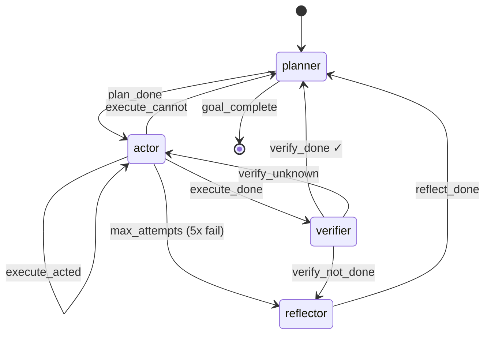
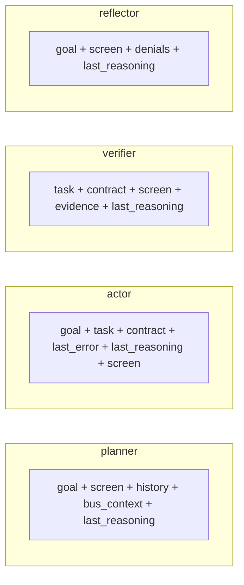

# endgame-ai

A wiring-driven, self-evolving agentic runtime for Windows 11.  
Single process. Model-agnostic. ~1500 LOC Python. All behavior controlled by text files.

**Key innovation:** Reasoning-as-memory — the LLM's own `reasoning_content` is fed back as context between calls, enabling cross-call self-correction without dedicated reflection LLM calls.

---

## State Machine

Generated from [`prompts/wiring.json`](prompts/wiring.json) transitions:



## Context Injection

Each circuit receives exactly the data it needs. From [`prompts/wiring.json`](prompts/wiring.json) circuits:



**`last_reasoning`** is the key. Every circuit sees its own prior reasoning chain (up to 5 entries), enabling self-correction across calls without extra LLM calls.

## Verb Dispatch

The actor controls Windows 11 through these verbs (from [`prompts/wiring.json`](prompts/wiring.json)):

| Verb | Target | Effect |
|------|--------|--------|
| `click` | element_id | Click UI element by dynamic ID |
| `write` | element_id, value | Type text (optionally click target first) |
| `hotkey` | key_combo | Key combination: `win+r`, `ctrl+l`, `alt+f4` |
| `press` | key_name | Single key: `enter`, `tab`, `escape` |
| `scroll` | element_id, amount | Scroll element |
| `focus` | window_title | Focus window by title |
| `inspect` | area | Re-scan screen for more detail |

---

## Architecture

```
prompts/
├── wiring.json      ← ALL topology: transitions, circuits, verbs, limits
├── planner.txt      ← Self-aware prompt with REASON FAST directive
├── actor.txt        ← Desktop control prompt, dynamic IDs, full screen data
├── verifier.txt     ← Independent evidence-based judgment
├── reflector.txt    ← Root-cause diagnosis on repeated failure
└── model.json       ← LLM config: host, temperature, max_tokens

Runtime:
├── _test_run.py     ← Headless runtime (observe → step → act → feed reasoning)
├── tui.py           ← Interactive TUI (threaded, PgUp/PgDn scroll)
├── colony.py        ← Level 0 bypass, slot activation, goal routing
├── slot.py          ← Generic Circuit + Slot state machine
├── desktop.py       ← Win32 UI Automation screen observation + actions
├── actions.py       ← Verb dispatch (wiring-driven)
├── llm.py           ← LM Studio client, reasoning extraction, full logging
└── bus.py           ← Shared blackboard for inter-circuit communication
```

## What Makes This Work

### 1. Reasoning IS Reflection

The model's `reasoning_content` field contains genuine chain-of-thought. By feeding it back as context on the next call, the model sees its own prior deductions and self-corrects. This eliminates the need for separate reflection LLM calls in most cases.

The reflector circuit exists for hard failures (5x attempts exhausted, verifier rejections) where a dedicated "step back and think differently" call provides better diagnosis than inline reasoning alone.

### 2. Wiring Controls Everything

`prompts/wiring.json` defines:
- Which circuits exist and what context they receive
- All state transitions (event → next phase)
- Available verbs and their field mappings
- Operational limits (max_attempts, reasoning_depth, token budgets)

Change the JSON, change the behavior. No code modification needed.

### 3. Self-Aware Prompts

Every prompt begins with `REASON FAST` — shaping the model's internal chain-of-thought to be decisive rather than verbose. Prompts explicitly instruct the model to:
- Re-read its own previous reasoning
- Never repeat failed approaches
- Use current screen IDs (dynamic, change every observation)
- Recognize when the goal is already achieved

### 4. The Loop

```
observe screen → planner decomposes goal → actor executes
     ↑                                           ↓
     └── planner (replan) ← reflector ← verifier checks
```

Every cycle: fresh screen observation, reasoning fed back, evidence accumulated. The model operates the desktop like a human would — look, think, act, check.

---

## Proven Behaviors (Real Desktop Runs)

From test runs on 2026-06-17 with `nvidia-nemotron-3-nano-4b` (4B params):

- **Invented combined commands**: `opera https://grok.com` in Run dialog — launch + navigate in one action
- **Self-corrected via reasoning**: failed approach → different strategy next call
- **Verifier caught premature claims**: actor said "done" but screen contradicted → reflector diagnosed → replanner fixed
- **Full goal completion**: plan → act → verify → done in 11 cycles, 60 seconds
- **Used inspect spontaneously**: when screen lacked detail, model requested re-scan without being told to

## Running

```bash
# Headless (logs to logs/)
python _test_run.py open opera and go to grok.com

# Interactive TUI
python tui.py
```

**Requirements:** Python 3.11+, Windows 11, LM Studio running a reasoning model.

## Configuration

All in `prompts/model.json`:
```json
{
  "host": "http://192.168.16.31:1234",
  "temperature": 0.4,
  "max_tokens": 4096,
  "seed": 3407
}
```

## Logs

All LLM request/response pairs logged to `logs/YYYYMMDD_HHMMSS.txt` — full content, no truncation. Logs are gitignored.

---

## License

MIT
