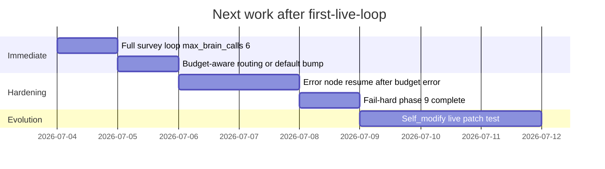
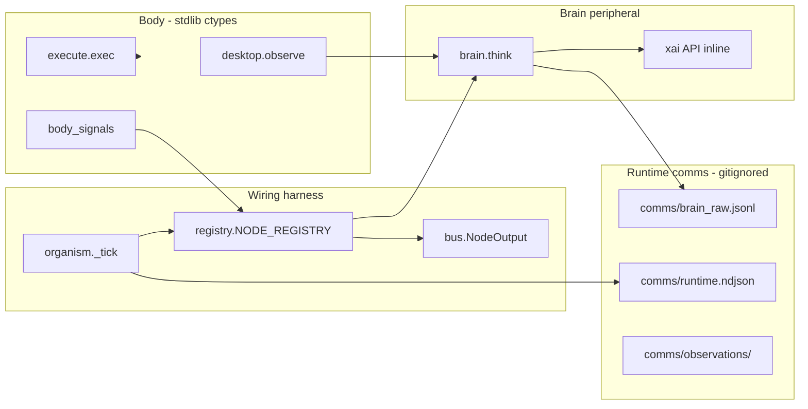
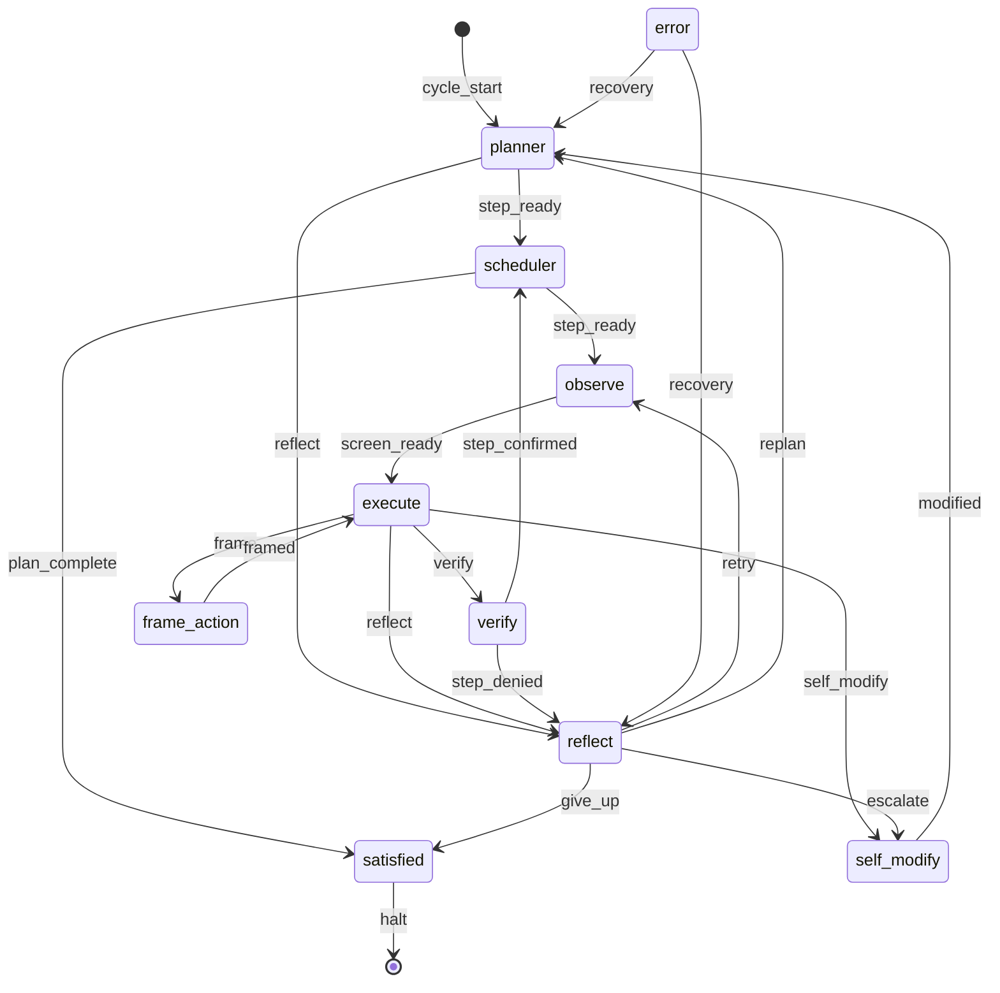
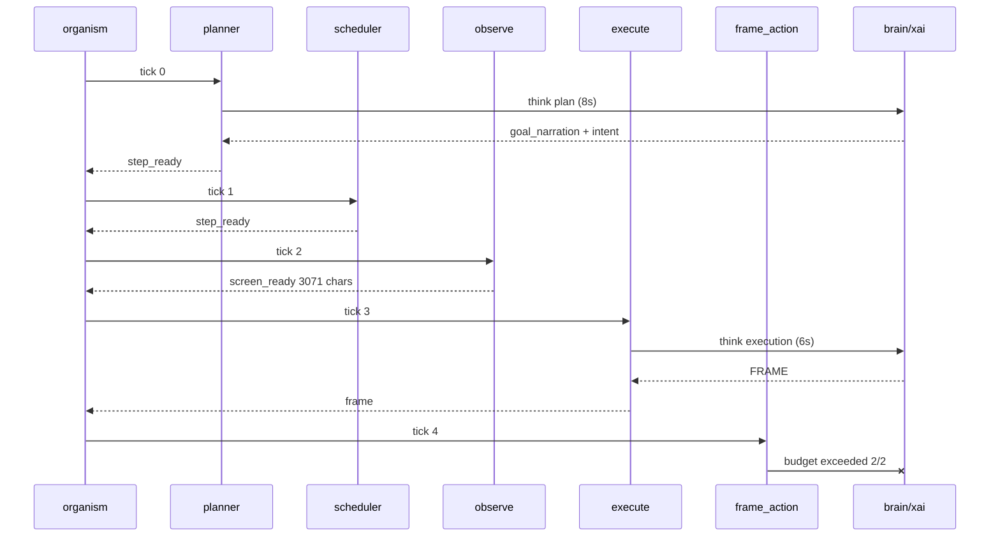
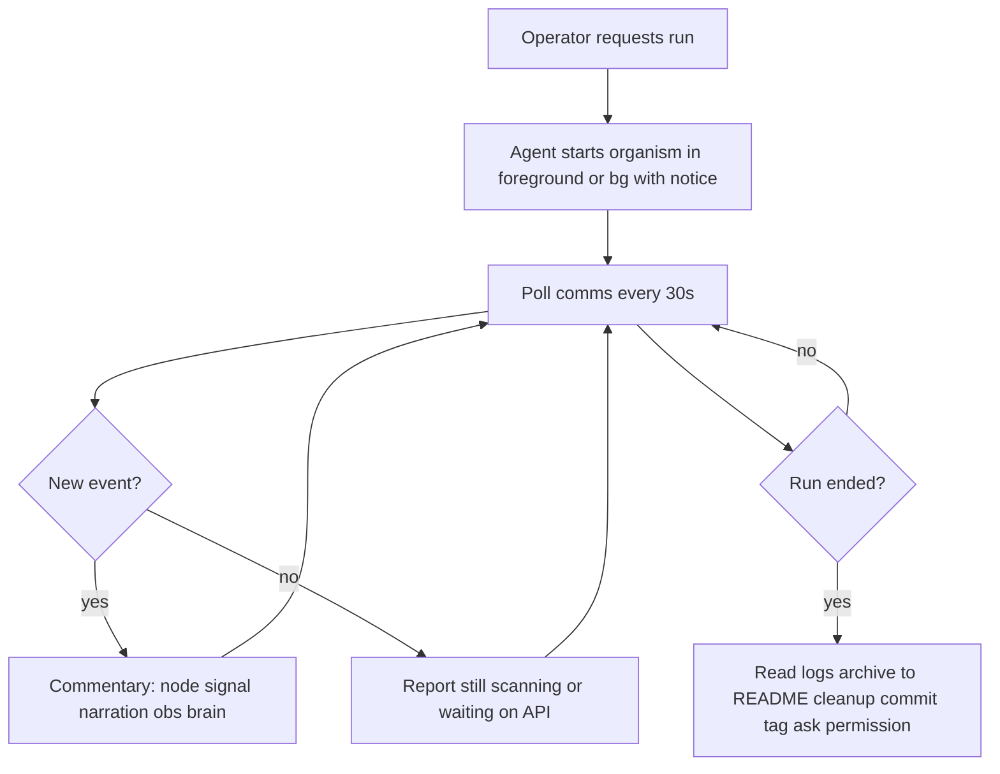

# endgame-ai

A **human operator in digital form** on Windows 11 — wiring harness, not chat agent. Python is the body. Desktop is the world. `wiring.json` is the nervous system. Git is firmware memory.

**Tags:** `ooo-unification` (spec) · `arch-flat-root` (flat refactor) · **`first-live-loop`** (first Grok-backed multi-tick run)

---

## Breakthrough (2026-07-04)

First **live organism loop** on a real Windows desktop with Grok API:

| Proof | Evidence |
|-------|----------|
| Self-narrating goal works | Planner emitted `goal_narration` + 2-step `intent[]` from fresh observation + `body_signals` (battery 96%, AC, 85GB free) |
| Observation is deep | **3071 chars** hierarchical tree — Task Manager, Chrome/YouTube, grok IDE, 11 windows, GRID |
| Topology executes | planner → scheduler → observe → execute in **4 ticks** without human steering |
| Brain + body coupling | Execute returned `FRAME` (honest “need framing”) — topology routed to `frame_action` |
| Raw audit trail | `comms/brain_raw.jsonl` — full think payloads + API request/response bodies (keys redacted) |

Run stopped at tick 4: `--max-brain-calls 2` exhausted (planner + execute); `frame_action` needed call #3. **Not a architecture failure — a budget cap.**

---

## First run log (archived in README; runtime cleaned)

**Goal:** `survey desktop and note open applications`

| Tick | Node | Signal | Brain | Notes |
|------|------|--------|-------|-------|
| 0 | planner | step_ready | 8.0s | `goal_narration` rewritten; intent: catalog windows + record focus |
| 1 | scheduler | step_ready | — | Step 0: extract window titles from observation |
| 2 | observe | screen_ready | — | 212 elements, focus Task Manager, 3071-char tree |
| 3 | execute | frame | 6.3s | Conclusion FRAME (no code); routed to frame_action |
| 4 | frame_action | — | **budget** | `brain call budget exceeded: 2/2` |

**Planner narration (excerpt):** *Survey desktop noting open applications; Task Manager focused amid visible windows including Chrome/YouTube, grok terminal…*

---

## Progress

| Phase | Status | Notes |
|-------|--------|-------|
| 0–8 | **done** | Flat root, registry, evolution, inline xai, wiring v2, contract_check |
| 9 fail-hard | **partial** | Planner/execute/reflect hard errors; budget error recovery TBD |
| 10 request limits | **done** | `limits` + preflight + observation cap |
| 11 self-narrating goal | **done** | `body_signals.py`; planner requires `goal_narration` + `intent[]` |
| 12 stdout visibility | **done** | `[organism]`/`[observe]`/`[brain]` on every long step |
| 13 raw comms log | **done** | `comms/brain_raw.jsonl` — think, api_request, api_response_body |
| 14 next live loop | **planned** | `--max-brain-calls 6`; complete frame → verify → scheduler |

---

## Plan (aligned to first results)



| Priority | Task | Why |
|----------|------|-----|
| P0 | Re-run survey with `--max-brain-calls 6 --max-ticks 8` | Finish frame_action → verify path |
| P1 | Default `max_brain_calls` in wiring or per-run guidance | Prevent false “hang” at FRAME |
| P2 | Budget error → reflect instead of hard stop | Graceful degradation |
| P3 | Self-modify tick on real defect | Git firmware path proof |

---

## Architecture



### Topology



### First run actual path



---

## Agent operator protocol (how the human’s AI partner works)

When running endgame-ai on behalf of the operator:

1. **Never silent long runs** — organism prints `[organism]`/`[observe]`/`[brain]`; agent does not background without telling the operator.
2. **Raw logs on disk** — every brain call writes to `comms/brain_raw.jsonl` (payloads + API bodies; secrets redacted). Runtime events in `comms/runtime.ndjson`. Observations in `comms/observations/`.
3. **Sport commentary every ~30s** — agent runs `python comms_poll.py 30 N` or reads those files and reports: current node, tick, phase, last signal, narration excerpt, observation size, last brain phase, errors.
4. **No secrets in git** — never commit `comms/`, `state.json`, API keys, or raw logs with credentials.
5. **Cleanup after archival** — once results are captured in README, delete runtime artifacts; commit code + README only.
6. **Ask permission** before the next live loop (API cost + desktop control).



---

## Prompt engineering (KV cache + capabilities)

**System (cacheable):** `ORGAN_CORE` + `ORGAN_IDENTITY[organ]` + short `wiring.prompts[organ]`

**User JSON (dynamic tail):** `goal_seed`, `goal_narration`, `goal_signals`, state… then `fresh_observation` last.

- Execute prompt declares **unsandboxed** full Python/subprocess/ctypes
- No giant JSON schema in prompts — `json_object` + `record_type` check
- `limits.max_request_chars` fail-hard before API

---

## Self-narrating goal

| Field | Role |
|-------|------|
| `goal_seed` | Immutable user intent |
| `goal_narration` | Planner-maintained living interpretation (required every planner tick) |
| `goal_signals` | `body_signals.collect()` — power, disk, urgency |

---

## CLI

```bash
python organism.py "survey desktop" --max-ticks 8 --max-brain-calls 6 --reset
python organism.py --execute-node observe ""
python comms_poll.py 30 12
python contract_check.py
```

`comms/` and `state.json` are runtime-only (gitignored). `stop.txt` aborts.

---

## Comms layout (runtime)

| Path | Content |
|------|---------|
| `comms/brain_raw.jsonl` | think, api_request, api_response_body, response |
| `comms/runtime.ndjson` | organism_start, node_start, node_complete, error |
| `comms/observations/*.json` | Full hover scan artifacts |
| `comms/control.json` | run / pause / step |
| `state.json` | Live state patch |

---

## Validation

```bash
python -m compileall -q .
python -m json.tool wiring.json
python contract_check.py
```

---

## License

MIT — see `LICENSE`.