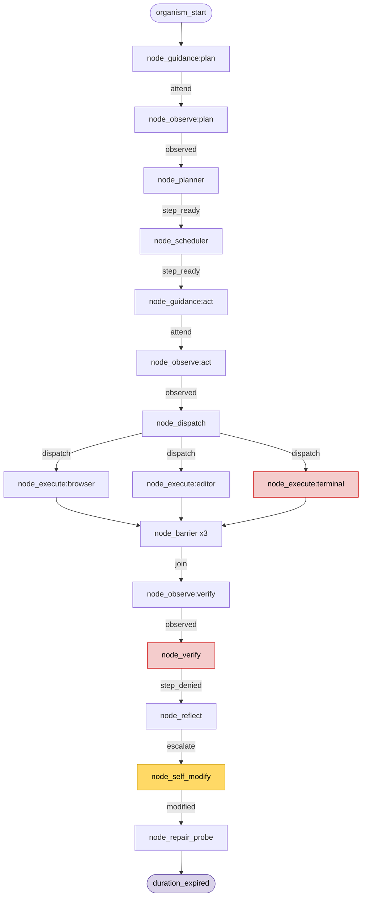
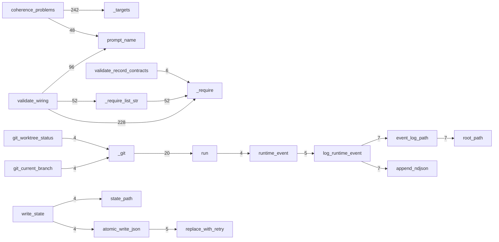
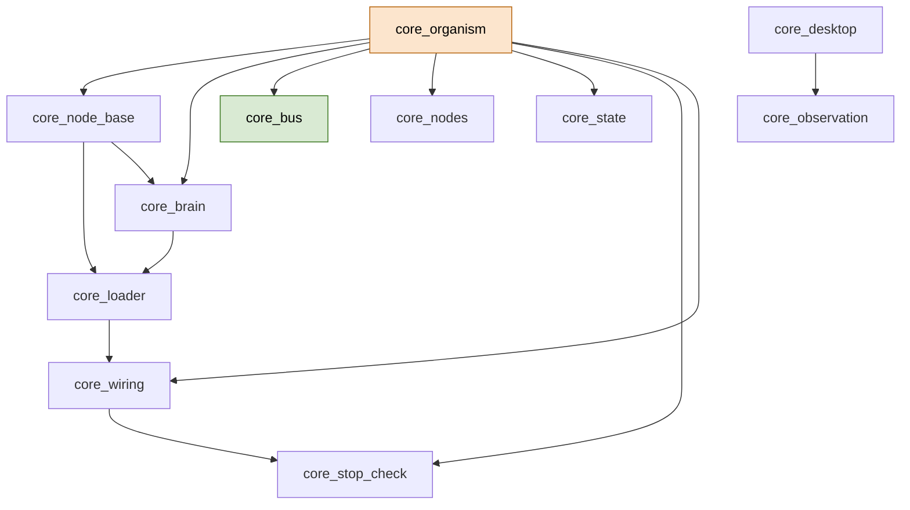
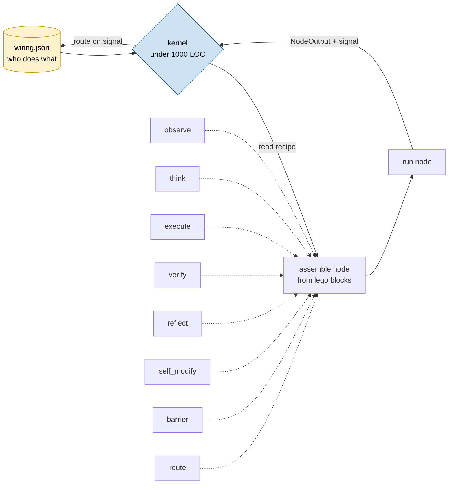

<h1 align="center">endgame-ai</h1>

<p align="center">
  <b>A self-evolving, fractal, desktop-controlling AI organism.</b><br>
  <i>The intelligence is the wiring between the input and output of LLMs.</i>
</p>

<p align="center">
  
  
  
  
  
</p>

---

> [!IMPORTANT]
> This document is generated from a deterministic forensic analysis of the running
> system. Every structural claim below is grounded in tool output or in a real captured
> run of the organism. Where a statement is an inference rather than a measured fact, it
> is labeled. Sections that carry the marker **[PROVEN]** are backed by data files on
> disk. Sections marked **[VISION]** describe the target state the maintainer wants to
> reach and are not yet built.

## Table of contents

1. [What this is](#1-what-this-is)
2. [The core idea: wiring is the intelligence](#2-the-core-idea-wiring-is-the-intelligence)
3. [Proven system anatomy](#3-proven-system-anatomy)
4. [The wheel: one real captured run](#4-the-wheel-one-real-captured-run)
5. [How the code actually calls itself](#5-how-the-code-actually-calls-itself)
6. [Panel of expertise (MoE review)](#6-panel-of-expertise-moe-review)
7. [Critique and contradictions](#7-critique-and-contradictions)
8. [North star: fractal hot-swappable lego-python](#8-north-star-fractal-hot-swappable-lego-python)
9. [How to gather the truth yourself](#9-how-to-gather-the-truth-yourself)
10. [Handover prompt for the next AI](#10-handover-prompt-for-the-next-ai)

---

## 1. What this is

endgame-ai is a single living process that drives a real Windows desktop toward a
goal written in plain language. It does this by running a loop that the project calls
**the wheel**. On every turn of the wheel, exactly one **node** runs. A node is a small
unit of work. Some nodes ask a large language model (LLM) what to do next. Other nodes
observe the screen, execute an action, verify a result, or rewrite the organism's own
source code.

The system has five defining properties, all visible in the code and in the captured
run described later in this document:

- **Self-evolving.** When the organism cannot make progress with its current code, it
  writes a patch to its own files, commits it to git, and can roll back to a known-good
  git ref if the patch makes things worse.
- **Fractal.** A node can spawn a child organism with its own bounded goal and its own
  time budget. The wiring declares `max_recursion_depth: 3` and
  `child_duration_seconds: 60`. [PROVEN] from `wiring.json`.
- **Data-driven.** The control flow is not written in Python branches. It lives in
  `wiring.json` as a topology of nodes and signal-labeled edges. Python reads that
  topology at runtime and dispatches accordingly.
- **Desktop-controlling.** It observes the UI Automation tree and can drive mouse,
  keyboard, and processes through local `exec` of generated Python.
- **Contract-guarded.** Every node output must satisfy a record contract before it is
  accepted, and signals are validated against the wiring before a transition is allowed.

> [!NOTE]
> The organism is not a chatbot with tools bolted on. It is a state machine whose
> transitions are chosen partly by an LLM at each brain tick and partly by fixed
> mechanical rules. The LLM supplies judgment. The wiring supplies structure.

### Measured size today [PROVEN]

| Metric | Value | Source |
| --- | --- | --- |
| Python files | 32 | `wc -l *.py` |
| Total Python lines | 5171 | `wc -l *.py` |
| `wiring.json` lines | 708 | `wc -l wiring.json` |
| Topology nodes | 24 | `wiring.json` topology.nodes |
| Topology edge maps | 24 | `wiring.json` topology.edges |
| Faculties | 3 (browser, editor, terminal) | capabilities.faculties |
| Helpers registered | 25 | capabilities.helpers |
| Record contracts | 11 | record_contracts |
| Prompts | 17 | prompts |
| Fractal max depth | 3 | fractal.max_recursion_depth |

The single largest files are `core_nodes.py` (658 lines), `core_observation.py` (625),
`export_brain_forensics.py` (420), and `core_brain.py` (407). Together the four largest
files are 2110 lines, about 41 percent of all Python in the project. This concentration
is the first clue about where simplification should focus. See section 8.

---

## 2. The core idea: wiring is the intelligence

The central thesis of endgame-ai is simple to state and hard to build:

> The Python code is only plumbing. The intelligence lives in the wiring between the
> input and the output of the LLM calls.

Every interesting decision the organism makes is an LLM call framed by a prompt and
constrained by a record contract, then routed by a signal along a wiring edge. Change the
prompts, contracts, and edges in `wiring.json` and you change the behavior of the organism
without touching a single line of Python. This is why the maintainer wants the Python
surface to shrink to a minimum: the Python should be a small, stable interpreter of the
wiring, and the wiring should carry all the domain meaning.

### What the wiring holds today [PROVEN]

`wiring.json` is schema `endgame-ai.wiring.v2` and has these top-level sections:

| Section | Role |
| --- | --- |
| `model` | transport selection, per-organ tuning, stable-prefix config |
| `paths` | where nodes, brains, state, control, event log, caps live |
| `observe_config` | UI observation settings (hover cache) |
| `self_modify` | known-good ref, hot-swap policy, git, evolvable file rules |
| `topology` | `cycle_start`, `nodes`, `edges`, `barriers` (the state machine) |
| `prompts` | 17 named prompts, one family per node |
| `shared_prompt_prefix` | the organism-wide system preamble |
| `record_contracts` | 11 output schemas the LLM must satisfy |
| `capabilities` | power, helpers, modules, state, signals, faculties |
| `fractal` | recursion depth and child duration |
| `prompt_aliases` | maps instance nodes such as `node_execute:terminal` to a base prompt |

### The topology is a signal-routed graph [PROVEN]

`topology.cycle_start` is `node_guidance:plan`. Each entry in `topology.edges` maps a
node to a dictionary of `signal -> next_node`. For example, straight from `wiring.json`:

```json
"node_planner":       { "step_ready": "node_scheduler",   "error": "node_error" },
"node_scheduler":     { "step_ready": "node_guidance:act", "error": "node_error",
                        "goal_complete": "node_satisfied" },
"node_guidance:plan": { "attend": "node_observe:plan",     "error": "node_error" },
"node_observe:plan":  { "observed": "node_planner",        "error": "node_error" },
"node_observe:act":   { "observed": "node_dispatch",       "error": "node_error" }
```

There are 24 nodes and 24 such edge maps. The `node_barrier` has a declared join width
of 3, meaning three parallel execute lanes (browser, editor, terminal) fan back into one
before verification. This is the "one node per tick, but some ticks fan out" shape you
will see in the real run.

### Instance nodes and prompt aliases [PROVEN]

Some nodes appear as `base:instance`, for example `node_execute:browser`,
`node_execute:editor`, `node_execute:terminal`, and `node_observe:plan`,
`node_observe:act`, `node_observe:verify`, `node_observe:repair`,
`node_observe:repair_verify`. The suffix after the colon is the instance. `split_instance`
in the loader separates the base name (which selects the Python plugin) from the instance
(which selects the prompt alias and the runtime lane). This is the seed of the fractal,
lego-block idea in section 8: one Python plugin, many wired instances.

---

## 3. Proven system anatomy

This section is grounded in the pyan3 static call graph, the stdlib import scan, and the
libcst parse of every file. All 32 files parse cleanly with libcst (exit 0 each).

### 3.1 Module layering [PROVEN by pyan3 module graph]

The import graph is an acyclic DAG. Two anchors define it:

- **`core_bus.py` is the leaf.** It imports no other project module and is imported by
  most of them. It holds the data types and contracts: `Record`, `NodeOutput`,
  `BusContractError`, `NodeRecordContractError`, `TopologyContractError`, `emit`,
  `validate_signal`, `coerce_node_output`.
- **`core_organism.py` is the root.** It imports seven core modules and holds the wheel:
  `run` and `next_nodes_for`.

The primary dependency spine is:

```
core_organism  ->  core_node_base  ->  core_loader  ->  core_wiring  ->  core_stop_check
       |                  |
       |                  +-------->  core_brain  ->  (transport plugin)
       +----> core_bus (leaf, imported by nearly everything)
```

### 3.2 Node shapes [PROVEN by pyan3 class graph]

There is one abstract base, `BaseNode` in `core_node_base.py`. Nine nodes are classes
that subclass it: `DispatchNode`, `ExecuteNode`, `FrameActionNode`, `PlannerNode`,
`ReflectNode`, `RepairProbeNode`, `RepairValidateNode`, `SelfModifyNode`, `VerifyNode`.
The remaining nodes are bare module-level `run(ctx)` functions: `node_barrier`,
`node_guidance`, `node_observe`, `node_repair_dispatch`, `node_satisfied`,
`node_scheduler`, `node_spawn`, `node_error`.

> [!WARNING]
> This split (some nodes are classes, some are functions) is one of the duplications the
> maintainer suspects. Two node calling conventions means two code paths in the loader
> and the base. Section 8 proposes collapsing this to one shape.

### 3.3 The static analysis wall [PROVEN, and important]

A static tool can only see calls written literally in the source. endgame-ai chooses its
next node from `wiring.json` data and loads the plugin with
`importlib.util.spec_from_file_location`. So the static call graph stops at the wiring
boundary:

- pyan3 traced from `core_organism.run` and found it statically reaches only
  `next_nodes_for`. It could not draw a single edge into any `node_*` plugin.
- The pyan3 path query from `run` to `core_loader.load` produced no file, because there
  is no static path. The path exists only at runtime.
- The stdlib import scan showed every `node_*`, `transport_*`, and `cap_spawn` module is
  imported by nobody. They are orphaned to static eyes and entered only by dynamic
  dispatch.

This is not a defect. It is the whole point of the design. It is also the reason the next
section, the real runtime trace, is the only tool that can see the organism actually
think.

### 3.4 What each package-based tool reported [PROVEN]

Nine deterministic tools were run against the project. Their raw consoles are saved.

| Tool | Result | Why |
| --- | --- | --- |
| pyan3 | SUCCESS, 13 artifacts | static AST needs no imports; produced the module DAG and class graph |
| libcst | SUCCESS, 34 CST dumps | pure syntax parse, layout independent |
| grimp | edge_count 0 | needs a package; flat bare imports do not resolve in a shim |
| import-linter | 35 files, 0 dependencies | runs on grimp; same flat-layout reason, contracts pass vacuously |
| pydeps | `{}` plus SKIPPING ILLEGAL MODULE_NAME | rejects the flat path as a module name |
| pyreverse | exit 0, zero diagrams | found no package to diagram |
| py2puml | exit 1, ModuleNotFoundError core_bus | tries to import the package; bare imports break |
| scip-python | exit 1, Invalid regular expression | a Windows-only bug in the tool, unrelated to the code |
| viztracer | SUCCESS, 198 MB trace, 135500 events | executed the organism; the only tool that saw the wheel |

> [!NOTE]
> Empty output is still truth. The five package-based failures all trace to one fact:
> endgame-ai is 32 flat files with no `__init__.py` that import each other by bare name.
> That is a statement about the codebase shape, not about whether the code has structure.
> pyan3 and libcst prove the structure is rich.

---

## 4. The wheel: one real captured run

This is the golden data. On 2026-07-12 the organism was run under viztracer with the goal
`Write to a txt file what you see on the screen then exit` and a duration cap of 60
seconds. The transport was `transport_xai` (the real xAI model). The run is recorded in
`runtime_events.jsonl` (55 events, schema `endgame-ai.runtime-event.v1`) and
`runtime_state.json`. Everything below is quoted from those files. [PROVEN]

### 4.1 The exact tick sequence [PROVEN]

```
tick  node                     event / decision
----  -----------------------  --------------------------------------------
0     node_guidance:plan       organism_start, goal fixed, deadline set
1     node_observe:plan        observe desktop (~3s)
2     node_planner             brain_request -> brain_response (~8s LLM)
3     node_scheduler           mechanical route
4     node_guidance:act        mechanical route
5     node_observe:act         observe desktop (~2s)
6     node_dispatch            brain_request -> brain_response (~4s LLM)
7     node_execute:browser     lane opens
8     node_execute:editor      lane opens
9     node_execute:terminal    brain_request -> brain_response (~4s LLM), FAILED
10    node_barrier x3          barrier_wait, three lanes join into one
11    node_observe:verify      observe desktop (~2s)
12    node_verify              brain_request -> brain_response (~4s LLM), denied
13    node_reflect             brain_request -> brain_response (~11s LLM), escalate
14    node_self_modify         brain_request -> brain_response (~52s LLM)
      -- process 1 hit the 60s deadline here --
14    node_self_modify         organism_resume, brain_request -> commit 1eaec59c
      -- committed patch to node_execute.py --
14    node_self_modify         brain_response -> commit ac61757d
      -- committed patch to core_nodes.py, tools.py, wiring.json --
15    node_repair_probe        duration_expired, organism stops
```

### 4.2 What actually happened, in words [PROVEN]

The organism planned a two-step approach, dispatched to the terminal faculty, and the
terminal lane wrote the screen contents to a file using plain `open(...).write(...)`. That
action produced no stdout, no stderr, and recorded no body action event, so the execute
node's empty-result guard treated it as a non-action. The verify node then denied the
step because the evidence of file creation was absent. The reflect node judged this a
capability deficiency rather than a wrong plan and emitted `escalate`. That routed to
`node_self_modify`, which asked the LLM for a source patch.

The first self-modify call ran long and the 60-second deadline expired mid-call. The
organism had persisted its state, so it resumed with a fresh 60-second budget and finished
the self-modification. It committed two patches to the development branch, both with real
git SHAs recorded in the journal:

- `1eaec59c...` changed `node_execute.py` (relax the empty-result guard).
- `ac61757d...` changed `core_nodes.py`, `tools.py`, and `wiring.json` (add a
  `write_file` helper so a silent file write becomes a recorded action).

The known-good ref was `6ab0732f...` and was deliberately not advanced, because the repair
was never behaviorally validated: the second 60-second budget expired at
`node_repair_probe` before the probe could run. [PROVEN by the `self_modify_candidate_committed`
and `duration_expired` events.]

> [!IMPORTANT]
> This single run is a complete, honest demonstration of the organism's most advanced
> behavior: it hit a real capability gap, diagnosed it, and rewrote its own source to fix
> it, all within the contract and git safety rails. It did not finish the goal, and that
> is also truth. The self-repair loop is expensive in LLM time and did not fit in the
> budget.

### 4.3 Brain calls [PROVEN]

The journal records 7 `brain_request` and 7 `brain_response` pairs, at ticks 2, 6, 9, 12,
13, 14, and the resumed 14. Two of those calls (the self-modify calls) dominated wall
time at roughly 52s and 93s. The cheap decisions (plan, dispatch, verify) were 4 to 11
seconds each.

### 4.4 Trust boundary on this run [PROVEN limits]

- The trace is truth about THIS run only. One goal, one path. Nodes such as
  `node_repair_validate`, `node_repair_dispatch`, `node_satisfied`, `node_spawn`,
  `node_frame_action`, and `node_error` did not execute and are therefore unverified by
  runtime.
- viztracer omits C-level and builtin frames, so the reduced graph is Python project
  frames only.
- The heaviest counted frames are startup and validation
  (`validate_record_contracts`, `_require`, `validate_wiring`, `coherence_problems`),
  which means a large fraction of the captured events are boot and contract checking, not
  the wheel itself.

---

## 5. How the code actually calls itself

Every diagram in this section is built only from measured data: the runtime edge list
`edges_project_only.tsv` derived from the viztracer trace, the `runtime_events.jsonl`
journal, and the `wiring.json` topology. No edge is drawn that was not observed or
declared. [PROVEN]

### 5.1 The wheel, as it ran (from the journal)



Red nodes are where the failure surfaced (terminal execute produced no evidence, verify
denied). The yellow node is the self-modification. The run ended at the purple node when
the budget expired.

### 5.2 The real runtime call graph (top edges by observed count)

Thresholded to observed call count >= 3 to stay readable. Numbers are exact call counts
from the trace. [PROVEN from edges_project_only.tsv]



This confirms section 4.4: the highest-traffic functions are wiring validation and
contract checking, not the cognitive loop. The organism spends heavily on proving its own
wiring is coherent before and during the run.

### 5.3 The brain tick call chain (self-modify tick, exactly as traced)

This is the single most important chain in the system, captured verbatim from the trace
for the `node_self_modify` tick. [PROVEN]

```mermaid
flowchart TD
    run --> call_node
    call_node --> SelfModifyNode_run[SelfModifyNode.run]
    SelfModifyNode_run --> think1[BaseNode.think]
    think1 --> prompt --> prompt_name
    think1 --> build_payload[SelfModifyNode.build_payload]
    build_payload --> prepare[prepare_self_evolution]
    build_payload --> baseline[_repair_baseline]
    build_payload --> manifest[capability_manifest]
    build_payload --> topo[topology_summary]
    build_payload --> workspace[_capture_workspace_manifest]
    think1 --> think2[think]
    think2 --> stable[stable_prefix]
    think2 --> messages[_messages]
    think2 --> call[call transport]
    call --> load_transport[_load_transport_module]
    think2 --> commit_record[_commit_record]
    commit_record --> extract[extract_json_object]
    commit_record --> validate[_validate_record_contract]
    SelfModifyNode_run --> emit
    run --> apply[apply_evolution_patch]
    apply --> savew[save_wiring]
    apply --> runcmds[_run_evolution_commands]
    run --> commitse[commit_self_evolution]
    run --> nextn[next_nodes_for]
```

Read this chain as the anatomy of a single thought: build a payload of self-knowledge,
render a stable prefix of the organism's own source, call the LLM, validate the returned
record against its contract, apply the patch, commit it, then ask the wiring what comes
next.

### 5.4 Static import DAG (for contrast)



Every `node_*`, `transport_*`, and `cap_spawn` module is intentionally absent from this
static graph. They connect only through the wiring at runtime. The gap between 5.4 (static)
and 5.1 (runtime) is exactly the intelligence the maintainer is talking about: it is not
in the imports, it is in the wiring.

---

## 6. Panel of expertise (MoE review)

Several expert lenses, each reviewing the same proven data. Each expert states only what
the evidence supports.

### 6.1 The systems architect

The design is a data-driven state machine with a dynamic plugin loader. That is a sound
and well-known pattern. The strength is that behavior lives in `wiring.json`, so the
organism can be re-shaped without editing Python. The weakness is that the Python side
has grown to 5171 lines with two node conventions (class nodes and function nodes) and a
658-line `core_nodes.py` that mixes many concerns: capability runtime, evolution patching,
manifest capture, and git operations. The interpreter should be smaller than the program
it interprets. Right now it is much larger than the wiring. That inversion is the core
architectural debt.

### 6.2 The runtime-observability engineer

The only unbiased view of this system is a live trace, because control flow is chosen at
runtime by an LLM and by wiring data. viztracer captured 135500 events and the reduced
project graph has 135 functions and 172 internal edges for a single run. The observation
that startup and contract validation dominate the trace
(`validate_record_contracts`, `_require`, `validate_wiring`, `coherence_problems`) is a
real signal: the organism re-validates its wiring aggressively. If wiring validation is
correct and cached, a large fraction of per-run cost disappears. Recommend adding a
"startup complete" marker event so future traces can cleanly separate boot from wheel.

### 6.3 The prompt engineer

The LLM is the decision-maker at 7 points in this run. The record contracts are the
guardrails that turn free text into a typed transition. The design correctly forces the
model to emit a signal that must be in the node's allowed set (`validate_signal`
against `allowed_signals`). The self-modify path gives the model the full source as a
stable prefix, which is why it could pinpoint the exact guard in `node_execute.py`. The
risk is cost and latency: the two self-modify calls took roughly 52 and 93 seconds, which
did not fit the 60-second budget. A tighter self-modify prompt, or a smaller stable
prefix scoped to the failing file, would make repair fit inside a single budget.

### 6.4 The reliability engineer

The safety rails are real and visible: git commits per patch, a `refs/endgame/known_good`
ref, a policy to not advance known-good until a probe validates, and a hot-swap-on-failure
switch. In the captured run the organism correctly refused to advance known-good because
the probe never ran. That is exactly the conservative behavior you want. The gap is that
the repair loop is not budget-aware: it entered a self-modify that could not complete in
time. A pre-check that estimates whether repair can finish before the deadline would
prevent half-finished evolution cycles.

### 6.5 The minimalist (maintainer's own lens)

5171 lines is too many for what this does. The whole organism is: read wiring, pick a
node, maybe call an LLM, validate the output, route on the signal, repeat. That is a small
kernel. Everything else is helpers that could live as wiring-declared lego blocks rather
than hand-written Python. The maintainer's instinct that this fits in about 1000 lines is
plausible if the two node conventions collapse to one, the observation and forensics
modules shrink, and repeated helper logic (git, atomic writes, contract checks) is
deduplicated. See section 8 for the concrete plan.

---

## 7. Critique and contradictions

Direct findings, each backed by a file and line. These are the concrete targets for
simplification.

### 7.1 Duplicated git helpers [PROVEN]

`git_current_branch` is defined in at least three places:

- `core_nodes.py:122` (module function)
- `core_nodes.py:598` (a second, nested definition inside a capability builder)
- `tools.py:178`

And `_git` is defined twice with different signatures:

- `core_brain.py:33` (a method on the brain, `def _git(self, args)`)
- `core_nodes.py:110` (a module function, `def _git(args, *, check=True)`)

This is exactly the "duplicates of functionality" the maintainer suspected. There should
be one git helper module, imported where needed. This alone touches four files.

### 7.2 Two node calling conventions [PROVEN]

`core_node_base.call_node` at line 60 does `result = mod.run(ctx)`. For class nodes this
`run` is a method on a `BaseNode` subclass; for the bare nodes it is a module function.
The loader at `core_loader.py:65` checks `hasattr(mod, spec_kind.export)` to bridge the
two. Supporting both shapes doubles the mental model. Collapsing every node to a single
convention (one callable `run(ctx) -> NodeOutput`) removes a whole branch of logic.

### 7.3 Atomic-write and ndjson helpers are scattered [PROVEN]

- `append_ndjson` lives in `core_brain.py:192`
- `_atomic_write_text` lives in `core_nodes.py:59`
- `replace_with_retry` and `atomic_write_json` live in `core_wiring.py:209` and `:230`

Three files own pieces of the same "write a file safely" concern. These belong in one
small io module.

### 7.4 Contract and wiring validation is heavy at runtime [PROVEN]

The trace shows `validate_record_contracts.<locals>.<genexpr>` called 792 times,
`_require` 286 times, `_targets` 242 times, `validate_wiring` re-run 4 times in a single
short session. Validation is correct to have, but re-validating the entire wiring on every
self-modify and load is a cost multiplier. Validate once at load, then validate only the
delta after a patch.

### 7.5 A real contradiction between design and outcome [PROVEN]

The design intends the self-repair loop to fix a capability gap and validate it via
`node_repair_probe` and `node_repair_validate`. In the captured run the loop committed two
patches but never reached validation, because the repair itself consumed more than the
60-second budget twice. The design assumes repair is cheap enough to validate in-budget.
The evidence says repair is the most expensive thing the organism does. This is the single
most important contradiction to resolve: either make repair cheaper, or make the budget
aware of repair, or validate repairs in a separate follow-up run.

### 7.6 The interpreter is larger than the program [PROVEN]

`wiring.json` is 708 lines and carries all the meaning. The Python is 5171 lines and is
supposed to be mere plumbing. A plumbing layer that is seven times larger than the thing
it plumbs is inverted. The north star in section 8 flips this ratio.

> [!CAUTION]
> None of these critiques say the organism is broken. It ran, it reasoned, it rewrote its
> own code inside safety rails, and it stopped cleanly when out of time. The critiques are
> about reducing surface area so the same behavior fits in far less code.

---

## 8. North star: fractal hot-swappable lego-python

This section is [VISION]. It describes the target state, grounded in the proven anatomy
above. It is the compass for anyone who works on this project next.

### 8.1 The one-sentence vision

> Python is a tiny, stable kernel that reads `wiring.json`, assembles each node at runtime
> from a small set of lego blocks, runs it, and routes on the returned signal; all domain
> meaning lives in the wiring, and the whole kernel fits in under 1000 lines.

### 8.2 The mechanism: wiring-to-python assembly

Today, each node is a hand-written `.py` file. The vision replaces that with runtime
assembly:

1. The kernel starts and loads `wiring.json`.
2. For the current node, the kernel reads that node's block recipe from the wiring: which
   lego blocks compose it (observe, think, execute, validate, route), which prompt, which
   record contract, which faculties.
3. The kernel assembles those blocks into a callable node in memory (or emits a small
   generated `.py` node file), runs it, and gets back a `NodeOutput` with a signal.
4. The kernel looks at the wiring again to find the next node for that signal.
5. Repeat. This is the fractal part: the same read-assemble-run-route step applies at
   every level, including inside a spawned child organism.

This is why the maintainer calls it "fractal hot-swappable python." A node is not a file
you edit; it is a composition the kernel builds from blocks the wiring names. Change the
recipe in the wiring and the node changes on the next tick, with no Python edit and no
restart.

### 8.3 The minimal lego blocks

From the proven run, every node in the captured wheel is one of a very small set of steps:

| Block | What it does | Proven by |
| --- | --- | --- |
| observe | capture the desktop or state into the payload | node_observe:* ticks |
| think | build payload, render prompt, call LLM, get a contract-valid record | BaseNode.think chain in 5.3 |
| execute | run generated Python in a faculty lane and record the action | node_execute:* ticks |
| barrier | join parallel lanes back to one | node_barrier tick 10 |
| verify | judge evidence, emit confirmed or denied | node_verify tick 12 |
| reflect | diagnose failure, choose a recovery signal | node_reflect tick 13 |
| self_modify | patch source, commit, prepare probe | node_self_modify tick 14 |
| route | map a signal to the next node | next_nodes_for |

That is roughly eight blocks. Every one of the 24 topology nodes is a wiring-declared
combination of these blocks plus a prompt and a contract. If the kernel implements these
eight blocks once, the 32 node files and the two calling conventions collapse into data.

### 8.4 The target shape



### 8.5 The reduction plan, concrete and grounded

Ordered by proven impact:

1. **Unify node convention** to a single `run(ctx) -> NodeOutput`. Removes the class/function
   branch in `core_node_base.py:60` and `core_loader.py:65`. [7.2]
2. **Extract one io module** for `append_ndjson`, `_atomic_write_text`,
   `replace_with_retry`, `atomic_write_json`. Removes duplication across three files. [7.3]
3. **Extract one git module** and delete the duplicate `git_current_branch` (3 copies) and
   `_git` (2 copies). [7.1]
4. **Validate wiring once** at load and only validate the delta after a self-modify.
   Cuts the dominant runtime cost seen in the trace. [7.4]
5. **Turn the eight blocks into the kernel** and turn node files into wiring recipes.
   This is the big one: it moves the bulk of `core_nodes.py` (658 lines) and the per-node
   files into data.
6. **Shrink observation and forensics.** `core_observation.py` (625) and
   `export_brain_forensics.py` (420) are 1045 lines, 20 percent of the codebase, and neither
   is on the hot path of a normal tick. Reduce to the minimum the wheel needs.

If steps 1 to 6 land, the Python kernel plausibly reaches the maintainer's under-1000-line
target while keeping the wiring as the single source of behavioral truth. The fractal,
self-evolving, contract-guarded properties are preserved because they already live in the
wiring and the git rails, not in the node files.

### 8.6 Invariants that must survive the rewrite

Do not lose these, they are the identity of the organism:

- One node per tick, chosen by wiring, not by Python branches.
- Every LLM output validated against a record contract before it is accepted.
- Every signal validated against the node's allowed signals before routing.
- Every self-modification committed to git with a known-good ref and no auto-advance
  until a probe validates.
- Fractal spawn with bounded depth (3) and bounded child duration (60s).

---

## 9. How to gather the truth yourself

The lesson from this analysis: a live runtime trace of the organism, produced by an
agentic run under viztracer, is the least biased way to see what the system really does.
Static tools cannot see wiring-driven dispatch. The data never lies; it can only omit. So
capture as much as possible.

All commands below are single-line, paste-ready in Windows PowerShell, run from the repo
directory. Adjust the goal and duration to taste.

### 9.1 The winning command: full live trace [most valuable]

Runs the organism under viztracer at maximum capture, writes a Chrome-format trace you can
open with `vizviewer`.

```powershell
cd 'C:\Users\ewojgab\Downloads\endgame-ai'; python -m viztracer --output_file trace.json --log_func_args --log_gc --log_async --log_audit --tracer_entries 5000000 --min_duration 0 -- core_organism.py "Write to a txt file what you see on the screen then exit" --duration-seconds 60
```

Notes on the flags, chosen for maximum completeness:
- `--log_func_args` records arguments, `--log_gc` records garbage collection,
  `--log_async` records async tasks, `--log_audit` records audit hooks.
- `--tracer_entries 5000000` raises the ring buffer so nothing is dropped on a long run.
- `--min_duration 0` keeps even the shortest calls.
- `--duration-seconds 60` is the organism's own budget; increase it for deeper runs, but
  give viztracer time to flush (do not kill the process early or the trace is lost).

### 9.2 Reduce the big trace to small, readable slices

The trace is large (hundreds of MB). Reduce it to functions and edges with this one-liner
that reconstructs parent-child by time containment (viztracer emits complete `X` events):

```powershell
cd 'C:\Users\ewojgab\Downloads\endgame-ai'; python -c "import json,collections as C; d=json.load(open('trace.json',encoding='utf-8')); E=[e for e in d['traceEvents'] if e.get('ph')=='X' and 'name' in e]; B=C.defaultdict(list); [B[(e.get('pid'),e.get('tid'))].append(e) for e in E]; edges=C.Counter(); calls=C.Counter(); s=lambda n:n.split(' (')[0]; p=lambda n:'endgame-ai' in n
for lst in B.values():
    lst.sort(key=lambda e:(e['ts'],-(e.get('dur',0))); st=[]
    for e in lst:
        nm=s(e['name']); en=e['ts']+e.get('dur',0)
        while st and st[-1][1]<e['ts']: st.pop()
        if st: edges[(st[-1][0],nm)]+=1
        if p(e['name']): calls[nm]+=1
        st.append((nm,en))
open('functions.tsv','w',encoding='utf-8').write('count\tfn\n'+'\n'.join(f'{c}\t{n}' for n,c in calls.most_common())); open('edges.tsv','w',encoding='utf-8').write('count\tcaller\tcallee\n'+'\n'.join(f'{c}\t{a}\t{b}' for (a,b),c in edges.most_common()))"
```

If the inline version is awkward to paste, put the same code in a small `reduce.py` and
run `python reduce.py`. The output `functions.tsv` and `edges.tsv` are what the diagrams
in section 5 were built from.

### 9.3 The organism's own journal (already truth, no tool needed)

The organism writes its own forensic record every run. These are the cleanest ground
truth of all because the organism labels its own events:

```powershell
cd 'C:\Users\ewojgab\Downloads\endgame-ai'; Get-Content runtime_events.jsonl | Measure-Object -Line; Get-Content runtime_state.json -Raw | ConvertFrom-Json | Format-List
```

To see the exact node-by-node decision timeline:

```powershell
cd 'C:\Users\ewojgab\Downloads\endgame-ai'; python -c "import json; [print(d.get('iso','')[-8:], d.get('event'), d.get('node','')) for d in (json.loads(l) for l in open('runtime_events.jsonl',encoding='utf-8') if l.strip())]"
```

### 9.4 Static backbone (works despite the flat layout)

pyan3 and libcst do not need a package. These give the static module DAG and the class
hierarchy that complement the runtime trace:

```powershell
cd 'C:\Users\ewojgab\Downloads\endgame-ai'; python -m pyan (Get-ChildItem *.py | ForEach-Object FullName) --module-level --dot --file module_graph.dot; python -m pyan (Get-ChildItem *.py | ForEach-Object FullName) --uses --defines --colored --grouped --annotated --dot --file full_call_graph.dot
```

```powershell
cd 'C:\Users\ewojgab\Downloads\endgame-ai'; Get-ChildItem *.py | ForEach-Object { python -m libcst.tool print $_.FullName > ("cst_" + $_.BaseName + ".txt") }
```

### 9.5 Inspect the wiring itself (the source of behavior)

```powershell
cd 'C:\Users\ewojgab\Downloads\endgame-ai'; python -c "import json; w=json.load(open('wiring.json')); print('nodes',len(w['topology']['nodes'])); print('edges',len(w['topology']['edges'])); [print(k,'->',v) for k,v in w['topology']['edges'].items()]"
```

> [!TIP]
> To capture the widest behavior, run several traces with different goals: one that
> succeeds quickly, one that is designed to fail and trigger reflect and repair, and one
> with a longer budget so the repair loop can reach `node_repair_validate`. The single run
> analyzed here never exercised the repair-validate, satisfied, spawn, frame-action, or
> error nodes. Those remain unproven until a trace exercises them.

---

## 10. Handover prompt for the next AI

Copy everything inside the block below and give it to any capable AI (Kiro CLI or similar)
that can read this repository and run commands on the machine where the code lives.

```text
You are taking over the endgame-ai project. Read this entire README first; it is
generated from a deterministic forensic analysis and a real captured run, and every
[PROVEN] claim is backed by files on disk. Do not trust any summary that contradicts the
files. If you did not read a file or run a command, say so; never present a guess as a
fact.

GROUND TRUTH YOU MUST HONOR
- The system is a data-driven state machine. Control flow lives in wiring.json as a
  topology of 24 nodes and 24 signal-labeled edge maps, cycle_start is node_guidance:plan.
- One node runs per tick. The chosen node is loaded dynamically by core_loader using
  importlib; static analysis cannot see these edges, so any structural claim about
  runtime behavior must come from a live trace, not from reading imports.
- Every LLM output is validated against a record contract (11 exist) before acceptance,
  and every signal is validated against the node's allowed signals before routing. Keep
  these gates.
- Self-modification commits each patch to git, keeps a refs/endgame/known_good ref, and
  must not advance known-good until node_repair_probe and node_repair_validate confirm the
  repair. Keep this rail.
- Fractal spawn is bounded: max_recursion_depth 3, child_duration_seconds 60. Keep these
  bounds.

THE NORTH STAR (this is the mission)
- Shrink the Python to a tiny stable kernel under 1000 lines that reads wiring.json,
  assembles each node at runtime from a small set of lego blocks (observe, think, execute,
  barrier, verify, reflect, self_modify, route), runs it, and routes on the returned
  signal. Move all domain meaning into the wiring. A node should be a wiring-declared
  recipe of blocks plus a prompt and a contract, not a hand-written file. The wiring is
  the intelligence; the Python is the interpreter. Today that ratio is inverted: 5171
  lines of Python against 708 lines of wiring. Flip it.

DO THIS FIRST, IN ORDER (each step is grounded in section 7 and 8)
1. Reproduce the truth: run the viztracer command in section 9.1, then the reducer in
   9.2, then read runtime_events.jsonl. Confirm the numbers in this README still hold.
2. Unify the node calling convention to a single run(ctx) -> NodeOutput. Remove the
   class-vs-function branch in core_node_base.py and core_loader.py.
3. Deduplicate: one git module (git_current_branch is defined 3 times, _git twice) and
   one io module (append_ndjson, _atomic_write_text, replace_with_retry, atomic_write_json
   are scattered across three files).
4. Validate wiring once at load; after a self-modify, validate only the changed delta.
5. Implement the eight lego blocks as the kernel and convert node files into wiring
   recipes. This is the change that reaches the under-1000-line goal.
6. Shrink core_observation.py and export_brain_forensics.py to the minimum the wheel needs.

RULES OF ENGAGEMENT
- Work on a development branch, never push to main directly.
- After any change, run the live trace again and diff the node sequence and the contract
  outcomes against the baseline in section 4. Behavior must be preserved.
- Prefer deleting code over adding it. If a change adds net lines, justify it.
- Do not remove the safety rails (contracts, signal validation, git known-good, fractal
  bounds).
- Capture wider behavior: run traces with a succeeding goal, a failing goal that triggers
  reflect and repair, and a longer-budget goal that lets node_repair_validate run. The
  baseline run in this README never exercised repair_validate, satisfied, spawn,
  frame_action, or error nodes; prove them before claiming they work.

WHAT SUCCESS LOOKS LIKE
- The organism still turns the wheel one node per tick, still self-evolves under git rails,
  still spawns fractally, still validates every contract and signal, but the Python kernel
  is under 1000 lines and every node is defined by wiring, not by a Python file. The
  README's diagrams and the live trace still match after the rewrite.
```

---

<p align="center">
  <i>The data never lies. It can only omit. Trace the living system, read its own
  journal, and let the wiring carry the meaning.</i>
</p>

---

## Appendix A. Complete file map [PROVEN]

Every Python file, its line count, and its role. Line counts from `wc -l`. Roles from the
pyan3 graph and the import scan. Sorted largest first, which is also the simplification
priority order.

| File | Lines | Role | Simplify? |
| --- | --- | --- | --- |
| core_nodes.py | 658 | capability runtime, evolution patch, manifest, git ops | yes, split and dedup |
| core_observation.py | 625 | UIA desktop observation, element scanning | yes, shrink to wheel needs |
| export_brain_forensics.py | 420 | offline forensic export of brain records | yes, optional, move off hot path |
| core_brain.py | 407 | prompt assembly, LLM call, record commit, stable prefix | keep core, extract git and io |
| core_organism.py | 321 | the wheel: run, next_nodes_for, budget, spawn | keep, this is the kernel |
| core_wiring.py | 309 | load and validate wiring, atomic json write | keep validate, extract io |
| core_bus.py | 301 | data types and contracts, the import leaf | keep, this is the foundation |
| node_self_modify.py | 201 | build self-evolution payload, propose patch | fold into think + self_modify block |
| tools.py | 197 | helper implementations (git, write_file, etc.) | dedup with core_nodes |
| core_desktop.py | 188 | mouse, keyboard, process control via ctypes | keep minimal, lazy import |
| node_execute.py | 172 | run generated python in a faculty lane | becomes the execute block |
| node_repair_validate.py | 158 | validate a committed repair behaviorally | becomes part of self_modify block |
| check_topology.py | 131 | coherence_problems wiring checker | fold into validate-once |
| core_state.py | 115 | state read/write, duration_expired | keep, tiny |
| node_error.py | 114 | error handling node | becomes route target |
| node_repair_probe.py | 91 | probe a repair before validating | part of self_modify block |
| transport_xai.py | 81 | xAI LLM transport | keep, one of the transports |
| node_reflect.py | 75 | diagnose failure, choose recovery signal | becomes the reflect block |
| core_node_base.py | 70 | BaseNode, call_node bridge | shrinks after unifying convention |
| core_loader.py | 67 | dynamic import of plugins by name | shrinks after unifying convention |
| node_verify.py | 62 | judge evidence, confirm or deny | becomes the verify block |
| core_stop_check.py | 60 | stop-requested checks | keep, tiny |
| node_planner.py | 59 | author the plan steps | becomes think + plan contract |
| cap_spawn.py | 54 | spawn a child organism | keep, fractal core |
| node_dispatch.py | 48 | choose which faculties to run | becomes think + dispatch contract |
| transport_file_proxy.py | 42 | file-proxy transport fallback | keep, fallback transport |
| node_frame_action.py | 38 | frame a GUI action | becomes think + action_frame contract |
| node_repair_dispatch.py | 31 | route repair work | becomes route target |
| node_scheduler.py | 17 | advance to the next plan step | becomes route logic |
| node_spawn.py | 15 | trigger a fractal child | thin wrapper over cap_spawn |
| node_guidance.py | 13 | attend to the next focus | mechanical, becomes route |
| node_barrier.py | 13 | join parallel lanes | becomes the barrier block |
| node_observe.py | 11 | thin wrapper over core_observation | becomes the observe block |
| node_satisfied.py | 7 | declare the goal complete | becomes route terminal |

The many small `node_*.py` files (7 to 62 lines each) are strong evidence for the lego
plan: most are thin adapters that would vanish into wiring recipes once the eight blocks
exist in the kernel.

## Appendix B. Wiring reference [PROVEN]

The exact contents of the behavior-carrying sections of `wiring.json`.

### B.1 The 11 record contracts

`plan`, `schedule`, `execution`, `dispatch`, `action_frame`, `verification`,
`reflection`, `git_evolution_patch`, `satisfied`, `repair_probe`, `repair_validation`.

Each contract is the typed schema the LLM must satisfy for that kind of decision. This is
how free-form model output becomes a safe state transition.

### B.2 The 17 prompts

`node_planner`, `node_scheduler`, `node_observe`, `node_frame_action`, `node_execute`,
`node_verify`, `node_reflect`, `node_self_modify`, `node_satisfied`, `node_error`,
`node_guidance`, `node_dispatch`, `node_barrier`, `node_spawn`, `node_repair_probe`,
`node_repair_dispatch`, `node_repair_validate`.

### B.3 The 25 helpers (the current lego-like primitives)

`click`, `click_node`, `read_node`, `type_text`, `press_key`, `hotkey`, `scroll`,
`scroll_node`, `action_nodes`, `node_by_id`, `open_url`, `observe_area`,
`observe_with_config`, `replace_node`, `consult_model`, `web_search`, `open_page`,
`read_file`, `github_create_issue`, `github_comment_issue`, `github_list_issues`,
`github_push`, `git_current_branch`, `git_branch_show_current`, `write_file`.

The last one, `write_file`, is the helper the organism added to itself in the captured run
(commit ac61757d) to fix its silent-write failure. This is a real, proven instance of the
organism extending its own primitive set.

### B.4 Per-organ model tuning [PROVEN]

The LLM is tuned per decision type. This is why cheap decisions are fast and repair is
slow.

| Organ | reasoning_effort | max_output_tokens | stable prefix |
| --- | --- | --- | --- |
| plan | low | 6144 | no |
| action_frame | low | 2048 | no |
| execution | low | 4096 | no |
| verification | medium | 1024 | no |
| reflection | high | 2048 | no |
| repair_probe | medium | 4096 | no |
| repair_validation | high | 2048 | no |
| git_evolution_patch | high | 32768 | yes (full source) |

The `git_evolution_patch` organ is the expensive one: highest reasoning, largest output,
and it prepends the entire source as a stable prefix. That single row explains the 52 and
93 second self-modify calls in the captured run, and it is the concrete target for making
repair fit inside a budget (scope the stable prefix to the failing file).

### B.5 Self-modify policy [PROVEN]

- `context_mode`: checked_out_branch
- `known_good_ref`: refs/endgame/known_good
- `hot_swap_on_failure`: true
- `execution`: rollback_on_failure
- `git`: remote, push_after_commit
- Evolvable files: suffixes `.py .json .md`, plus named dotfiles, skipping `runtime_`
  prefixed files. Some changes activate immediately (most nodes, wiring.json, core_nodes,
  tools), others only on next run (core_brain, core_desktop, core_organism,
  core_stop_check).

The immediate-vs-next-run split is itself an expression of the hot-swap idea in section 8:
some blocks can be swapped mid-run, others need a restart. A lego-block kernel would make
this distinction explicit and uniform.

## Appendix C. Glossary

- **Wheel**: the main loop in `core_organism.run`. One node per tick.
- **Node**: a unit of work selected by the wiring. Today a file; in the vision a recipe.
- **Tick**: one turn of the wheel.
- **Signal**: the labeled outcome a node emits, used to pick the next node.
- **Record contract**: the typed schema an LLM output must satisfy to be accepted.
- **Faculty**: an execution lane. Three exist: browser, editor, terminal.
- **Barrier**: a join point where parallel lanes converge (width 3 here).
- **Brain tick**: a node step that calls the LLM through a transport.
- **Transport**: the LLM backend. `transport_xai` (real model) or `transport_file_proxy`
  (fallback).
- **Stable prefix**: the organism's own source, prepended to a prompt so the model can
  reason about its own code.
- **Known-good ref**: `refs/endgame/known_good`, the git ref the organism can roll back to.
- **Self-modify**: the node that patches the organism's own source and commits it.
- **Fractal spawn**: a node creating a bounded child organism (depth 3, 60s).
- **Faculty lane**: browser, editor, or terminal execution context created for a dispatch.
- **Lego block (vision)**: one of the eight primitive steps a node is composed from.
