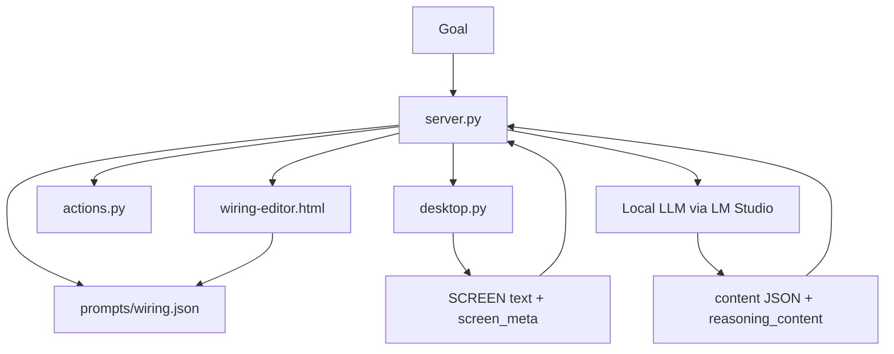
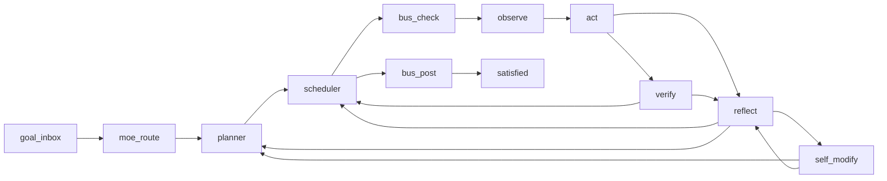

# endgame-ai

Local Windows desktop automation organism using a wired ROD loop:
Reason -> Observe -> Decide -> Verify -> Reflect -> Self-modify.

This README is the current handover document for the next agentic coding AI provider. It records what was changed in this session, how it was verified, what remains unfinished, and the exact methodology the next session should follow.

Current date of this handover: 2026-06-22.

## Current Status

The critical observation-pipeline work has been implemented and verified locally.

Done:

- Removed prompt-side SCREEN truncation from `server.py`.
- Removed `prompt_screen_max_chars` from wiring limits and schema.
- Removed `SCREEN_TRUNCATED_FOR_PROMPT` generation from prompt assembly.
- Replaced retired observe value caps:
  - `node_value_max_chars`
  - `render_value_max_chars`
  - `tree_value_max_chars`
  - `render_tree_value_max_chars`
- Added observe filters in `prompts/wiring.json` and `prompts/wiring-schema.json`:
  - `scope_depth`
  - `element_text_max`
  - `render_focused_first`
- Reworked `desktop.py` action-scope rendering so focused page content renders before focused chrome, overlays, and background context.
- Added generic document-rectangle detection so browser toolbar buttons do not outrank page content.
- Added a visible `FILTERS:` line to SCREEN output.
- Added filter controls to `wiring-editor.html`:
  - scope depth slider
  - element text slider
  - desktop tree depth slider
  - focused-first checkbox
- Wired the workbench to SSE events so live state and SCREEN panels refresh during autonomous runs.
- Added graceful SIGINT/SIGTERM handling in `server.py`.
- Removed `parse_fallback`; circuit JSON parsing now accepts final content JSON only.
- Removed hard-coded site names such as `youtube` and `grok` from Python guard logic.
- Removed silent `except/pass` branches from state and bus JSON loading.
- Made LLM node execution concrete-node aware, so evolved nodes with the same handler type can carry distinct prompt config.
- Replaced the old ad hoc self-modify branch chain with a validated `apply_wiring_patch()` engine.
- Extended self-modify operations to include topology edits, node updates, prompt rewrites, limit/observe tuning, guard updates, and reasoning-contract updates.
- Refreshed outdated prompts around the current no-truncation observe model and the new self-rewiring contract.
- Removed the remaining hard-coded site keyword from `moe.delegate_keywords`.
- Started and verified the local workbench server at `http://127.0.0.1:9078/`.

Not done:

- The large cleanup target of 30%+ LOC reduction has not been achieved.
- Python still contains meaningful behavioral guard logic around browser navigation, chat writes, playback, and verification shortcuts. That is better than before, but not yet the final "Python is dumb" vision.
- No full LM Studio end-to-end autonomous goal was run after the changes.
- No formal automated test suite exists yet.
- Desktop tree payloads can still be large. They are bounded by depth/node filters, but the next agent should keep pressure on reducing noisy default context.
- Self-modify has been unit-verified through in-memory patch application, but it has not yet been exercised through a live LLM escalation cycle.

## Local Server

Default server URL for slot 1:

```text
http://127.0.0.1:9078/
```

Useful endpoints:

```text
GET  /                  workbench HTML
GET  /health            node list, run status, capabilities
GET  /wiring            current wiring.json
GET  /wiring-schema     schema for wiring validation
GET  /state             saved runtime state
GET  /bus               bus messages
GET  /events            SSE stream
POST /step              execute one graph node
POST /run               enqueue autonomous run
POST /resume            resume saved state
POST /pause             request pause
POST /state             overwrite state
POST /wiring            hot-reload wiring
POST /node/{type}       execute one node handler
POST /bus/post          append bus message
POST /interrupt         inject goal interrupt
POST /push              push arbitrary SSE event
```

## Architecture



Core files:

| File | Current lines | Purpose |
| --- | ---: | --- |
| `server.py` | 1818 | HTTP server, ROD graph engine, node handlers, prompt assembly |
| `desktop.py` | 1358 | Windows UIA observation, hover probing, tree snapshot, SCREEN rendering |
| `actions.py` | 229 | Data-driven verb executor |
| `colony.py` | 119 | Future multi-instance bus support |
| `wiring-editor.html` | 986 | Workbench UI, graph editor, live state/screen viewer |
| `prompts/wiring.json` | varies | Brain topology, prompts, guards, limits, observe config |
| `prompts/wiring-schema.json` | varies | Wiring validation schema |
| `prompts/model.json` | varies | LM Studio model connection |

## ROD Loop

Current topology:



Circuit responsibilities:

| Circuit | Sees SCREEN | Responsibility |
| --- | --- | --- |
| `planner` | no | Turn the goal into ordered human subtasks |
| `observe` | no LLM | Capture desktop state into SCREEN and `screen_meta` |
| `act` | yes | Convert the current subtask into verb actions |
| `verify` | no | Confirm or deny step completion from outcomes and memory |
| `reflect` | no | Diagnose failed steps and choose retry/replan/escalate |
| `self_modify` | no | Patch wiring when stuck |

Self-modify can now apply these validated operations:

```text
add_node
update_node
remove_node
add_edge
remove_edge
set_guard
set_limit
set_observe
set_prompt_base
set_role
append_role_rule
set_reasoning
```

Concrete node prompts are supported. If the organism adds another `act`, `verify`, `planner`, `reflect`, or `self_modify` node with a custom `prompt`, that node's handler now uses the concrete node config rather than the first node of the same type.

## Observation Pipeline

The important path:

```text
desktop.py Desktop.observe()
  -> _probe()
  -> _classify()
  -> _render()
  -> Observation(context_text=..., snapshot=...)

actions.py observe_screen()
  -> Desktop.observe()
  -> returns full context_text

server.py node_observe()
  -> observe_screen()
  -> stores state["screen"] and state["screen_meta"]

server.py _resolve_value()
  -> returns state["screen"] to prompt blocks without prompt truncation
```

Current SCREEN action-scope order:

1. Focused page content
2. Focused chrome
3. Overlay elements
4. Background context

Current observe filters:

```json
{
  "scope_depth": 4,
  "element_text_max": 500,
  "render_focused_first": true,
  "desktop_tree_max_depth": 8,
  "desktop_tree_max_nodes": 900
}
```

Scope-depth meaning in current implementation:

| `scope_depth` | Included buckets |
| ---: | --- |
| 1 | focused page only |
| 2 | focused page + focused chrome |
| 3 | focused page + focused chrome + overlays |
| 4 | focused page + focused chrome + overlays + background |

The default remains 4 to preserve context, but focused page data is now first.

## Verification Performed

Commands/checks run in this session:

```powershell
& "C:\Users\px-wjt\AppData\Local\Python\bin\python.exe" -m compileall -q .
```

Result: passed.

```powershell
& "C:\Users\px-wjt\AppData\Local\Python\bin\python.exe" -c "import json; json.load(open('prompts/wiring.json', encoding='utf-8')); json.load(open('prompts/wiring-schema.json', encoding='utf-8')); print('json ok')"
```

Result: `json ok`.

```powershell
& "C:\Users\px-wjt\AppData\Local\Python\bin\python.exe" -c "import server; print('server import ok')"
```

Result: `server import ok`.

```powershell
Invoke-WebRequest -UseBasicParsing -Uri 'http://127.0.0.1:9078/health'
```

Result: server healthy.

Real observe-node verification:

- SCREEN starts with `FOCUSED`, `ELEMENTS`, `OBSERVED`, and `FILTERS`.
- `FILTERS: scope_depth=4 element_text_max=500 render_focused_first=true ...` appears.
- Focused `Document` rendered before browser toolbar/chrome.
- Standalone `SCREEN_TRUNCATED_FOR_PROMPT:` marker lines: 0.

Browser UI verification:

- Workbench loaded at `http://127.0.0.1:9078/`.
- Status showed `ready`.
- Filter controls were visible.
- Values matched wiring:
  - scope depth: `4`
  - element text max: `500`
  - tree depth: `8`
  - focused first: checked
- `Live Screen` panel was present.
- Graph SVG was present.
- No browser console errors were reported.

Self-rewiring verification:

- `apply_wiring_patch()` accepted an in-memory `set_observe` mutation and produced valid wiring.
- `apply_wiring_patch()` accepted an in-memory `append_role_rule` mutation and produced valid wiring.
- Concrete node prompt resolution was verified with a synthetic `act` node using its own `prompt.user.blocks`.

Final local search passed for retired names in Python/schema:

```text
SCREEN_TRUNCATED_FOR_PROMPT
prompt_screen_max_chars
node_value_max_chars
render_value_max_chars
tree_value_max_chars
render_tree_value_max_chars
parse_fallback
grok
youtube
```

Note: `prompts/wiring.json` can still contain site-specific examples or prompt policy. That is acceptable because semantic intelligence belongs in wiring prompts, not Python.

## Development Methodology Used

This session followed this order:

1. Read the attached objective.
2. Inspect actual code paths instead of trusting stale line numbers.
3. Search for all truncation and fallback markers with `rg`.
4. Patch the observation pipeline before broad cleanup.
5. Update schema and wiring with the runtime changes.
6. Verify by running the real server and real `/node/observe`.
7. Verify the workbench in a browser.
8. Remove targeted task-specific Python remnants.
9. Rewrite this README as a handover artifact.

Rules that should continue:

- Prefer `rg` for search.
- Use `apply_patch` for edits.
- Keep Python mechanical.
- Keep semantic behavior in wiring prompts.
- Fail visibly where possible.
- Verify against the real local server, not just static syntax.
- When changing observation behavior, run a real observe node and inspect the first SCREEN lines.

## What To Do Next

Priority 1: run an end-to-end autonomous goal.

Use LM Studio and a small controlled goal such as:

```text
open notepad and write hello from endgame
```

Then a browser goal:

```text
open browser, go to example.com, remember the visible headline
```

Acceptance criteria:

- Planner emits a reasonable plan.
- Observe SCREEN shows the relevant focused content first.
- Act chooses the correct visible [ID] or deterministic hotkey chain.
- Verify confirms based on real outcomes.
- No prompt truncation marker exists.
- Workbench Live Screen updates during the run.

Priority 2: reduce Python intelligence.

Targets:

- `server.py` browser/chat/playback guard helpers.
- Preflight confirmation shortcuts that infer too much.
- Retry and replan branches that duplicate wiring-level reasoning.
- Any task-specific or website-specific logic in Python.

Goal: move semantic policy into `prompts/wiring.json`, keep Python as a mechanical executor and formatter.

Priority 3: make observation filters more explicit.

Consider adding:

- `include_background`: boolean
- `include_desktop_tree`: boolean or depth-gated mode
- `max_action_scope_nodes`
- `document_first_roles`
- `chrome_roles`

Keep the defaults small and useful. The model should see focused page content first.

Priority 4: add tests.

Suggested tests:

- JSON schema accepts current wiring.
- `_resolve_value(state, "state.screen")` returns the full screen string.
- No retired config names appear in Python/schema.
- `_render()` orders synthetic focused Document nodes before toolbar Button nodes.
- `scope_depth` filters buckets as expected.
- Signal handler can call `save_state()` without a passed state.

Priority 5: continue workbench refinement.

Possible improvements:

- Add an explicit "Prompt Input Preview" panel showing exactly what each LLM circuit receives.
- Add a small indicator when `/events` is connected.
- Add state diff view per cycle.
- Add filter presets:
  - page only
  - page + chrome
  - page + overlays
  - full debug
- Add "run observe only" shortcut beside filters.

## Handover Meta Prompt For The Next Agentic Coding AI

Copy this section into the next coding-agent session.

```text
You are continuing work in C:\Users\px-wjt\Downloads\endgame-ai.

Read README.md first. Treat it as the handover source of truth.

Mission:
Move endgame-ai toward a local self-evolving Windows desktop organism whose Python layer is dumb mechanical infrastructure and whose intelligence lives in wiring prompts and the local LLM.

Current progress:
- Prompt-side SCREEN truncation has been removed.
- Retired truncation config names have been removed.
- Observe filters now exist: scope_depth, element_text_max, render_focused_first.
- desktop.py renders focused page content before focused chrome, overlays, and background context.
- wiring-editor.html has live filter controls and SSE refresh.
- SIGINT/SIGTERM state saving exists.
- parse_fallback was removed.
- site-specific Python names such as grok/youtube were removed from Python.
- self_modify now uses a validated patch engine with prompt/topology/guard/observe/limit/reasoning mutation ops.
- concrete node prompt config is supported for evolved nodes.
- Local server was verified healthy at http://127.0.0.1:9078/.

Non-negotiables:
- Do not reintroduce prompt_screen_max_chars or SCREEN_TRUNCATED_FOR_PROMPT.
- Do not add website-specific Python branches.
- Do not add hidden fallback chains.
- Do not silently swallow state, bus, parse, or observe errors.
- Keep Python mechanical.
- Put semantic policy in prompts/wiring.json.
- Preserve hot-reload of wiring.json.
- Verify with real server calls, especially /node/observe.

Start by running:
1. git status --short
2. rg -n "SCREEN_TRUNCATED_FOR_PROMPT|prompt_screen_max_chars|node_value_max_chars|render_value_max_chars|parse_fallback|grok|youtube" server.py desktop.py actions.py prompts/wiring-schema.json
3. python equivalent: compileall -q .
4. GET http://127.0.0.1:9078/health, or start server.py if not running
5. POST /node/observe and inspect the first 40 SCREEN lines

First real task:
Run an end-to-end autonomous goal and observe where the loop still fails.

If it fails:
- Do not patch around the specific site or app.
- Identify whether the model lacked data, the prompt had bad policy, or Python executed mechanics incorrectly.
- If data was missing, fix observation filters/rendering.
- If policy was wrong, patch wiring prompts.
- If mechanics were wrong, patch desktop/actions/server mechanically.

Target next commit:
Either a verified end-to-end autonomous success, or a focused cleanup that removes a meaningful chunk of Python behavioral intelligence without reducing capability.

Report verification in README.md when done.
```

## Operational Notes

The project is Windows-specific. `desktop.py` uses Win32 APIs and UI Automation through `ctypes`.

The local Python runtime used during this handover was:

```text
C:\Users\px-wjt\AppData\Local\Python\bin\python.exe
```

If `python` is not on PATH, use that runtime path.

To start the server:

```powershell
& "C:\Users\px-wjt\AppData\Local\Python\bin\python.exe" server.py
```

Slot 1 maps to port `9078` because `http_port_base` is `9077` and slot offset is enabled.

To start hidden from PowerShell:

```powershell
$py = 'C:\Users\px-wjt\AppData\Local\Python\bin\python.exe'
Start-Process -FilePath $py -ArgumentList @('server.py') -WorkingDirectory 'C:\Users\px-wjt\Downloads\endgame-ai' -WindowStyle Hidden
```

To stop a known server PID:

```powershell
Stop-Process -Id <pid> -Force
```

## Current Design Principle

The model was not the main failure mode. The core failure was starving the model of the right desktop data.

Therefore:

- Observation quality comes first.
- Focused page content must be first.
- SCREEN must not be prompt-truncated.
- Workbench must show what the model receives.
- Python should not guess the task.
- Wiring and the LLM should own task reasoning.
