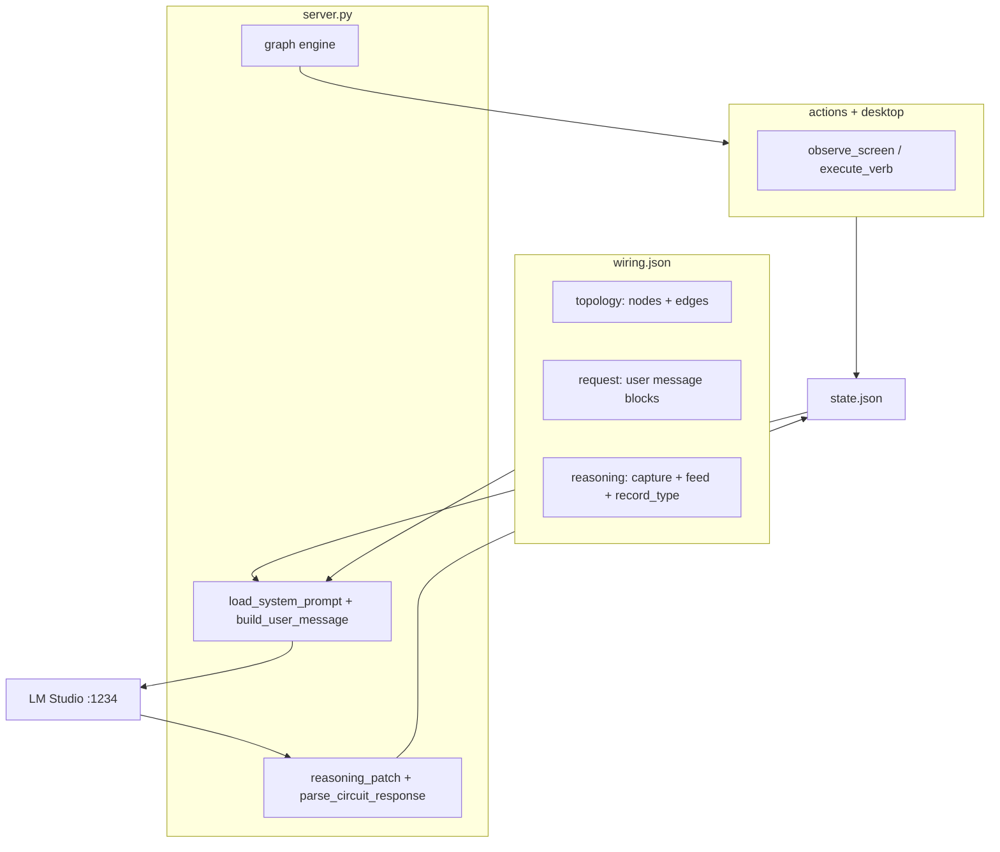
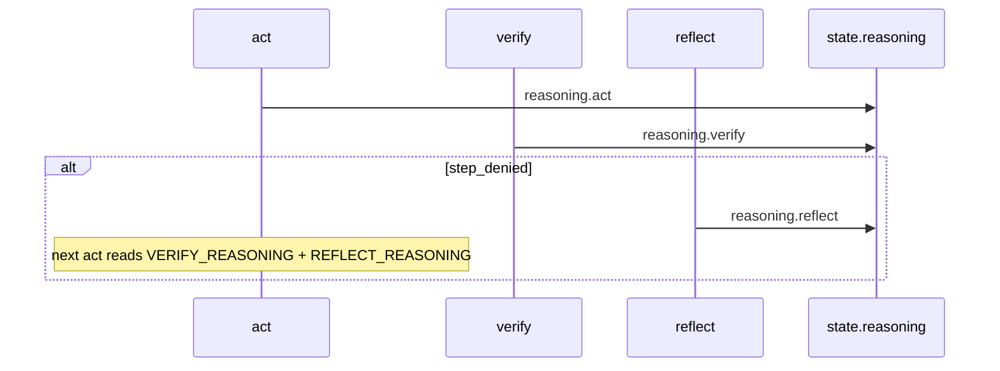

# endgame-ai

A living Windows desktop organism: **`wiring.json` is the brain diagram**, Python is muscles, LLM circuits are dumb specialists wired together.

> **Not** an agent framework. **Not** one smart prompt. Intelligence = topology + reasoning loop + verify gate.

**Branch:** `experiment/endgame` · **Ultimate goal:** replace a human for arbitrary-length desktop tasks on real Windows with local LM Studio.

**Current focus:** **single rod** — master one organism before multiplying.

---

## Quick start

```powershell
# Prerequisites: Windows, Python 3.11+, LM Studio on localhost:1234
cd endgame-ai

python server.py --run "open notepad and write hello"

python server.py                    # passive server (editor/curl drives nodes)
start http://127.0.0.1:9078         # wiring-editor (slot=1 → 9077+1)
```

**Port:** `runtime.http_port_base + slot` → default slot=1 serves **:9078**. `GET /health` returns `port`.

---

## Vision

Replace a human for **arbitrary-length desktop tasks** by wiring **dumb specialists** into a self-correcting loop — like brain regions. No region is the whole intelligence; **the wiring creates behavior**.

What this is **not** (yet):

- Not production-ready for complex web/video goals
- Not multi-rod MoE (deferred until single rod is reliable)
- Not “edit JSON only for everything” — see boundaries below

---

## The unit is the rod

```
ROD = server.py + actions.py + desktop.py + prompts/wiring.json + prompts/model.json
    → one graph, one state.json, one LLM loop
```

Colony, bus routing, MoE, and “personas” are **Phase 2** — copy-paste rods + shared `bus.json` + enforced permissions. Not separate class hierarchies. **N instances of the same template.**

### Minimal file count

| # | File | Role |
|---|------|------|
| 1 | `server.py` | Graph engine, LLM, HTTP, `call_circuit` |
| 2 | `actions.py` | Verb dispatch from wiring `verbs` |
| 3 | `desktop.py` | Windows UIA |
| 4 | `prompts/wiring.json` | Topology, request blocks, guards, limits, reasoning, runtime |
| 5 | `prompts/model.json` | LM Studio endpoint |

**5 files to run.** Circuit system prompts live in `wiring.json` → `prompts.base` (shared) + `prompts.roles` (per circuit).

Runtime output (never commit): `state.json`, `bus.json`, logs.

### Mental model

```
                    ┌─────────────┐
                    │ wiring.json │  ← THE brain
                    └──────┬──────┘
                           │
         prompts.base + roles.planner / roles.unified / …
                           ▼
                    ┌─────────────┐
                    │  server.py  │  ← THE rod
                    └──────┬──────┘
                           ▼
              actions.py + desktop.py
                           ▼
                      Windows UIA
```

### Why personas were removed

“Personalities” were 3-line blurbs injected into planner/act — **prompt flavor without enforced behavior**. Reviewer said “never execute” but `node_act` had no permission gate. Colony was three copies of the same rod with different `instance` JSON, not real specialists.

**Phase 1:** one rod, no `personalities/`, no `reactor.py`.  
**Phase 2:** multiply rods by forking `wiring.json` (`instance.slot`, topology tweaks) + bus + **enforced** `permissions` on act.

---

## Architecture (three layers)

| Layer | Location | Role |
|-------|----------|------|
| **Brain** | `prompts/wiring.json` | Topology, request blocks, reasoning feed, limits, errors, guards, act, runtime |
| **Circuits** | `wiring.json` → `prompts.base` + `prompts.roles` | Composed system prompts — base + role per circuit |
| **Body** | `server.py` | Graph engine, `call_circuit()`, `reasoning_patch()`, `parse_circuit_response()` |
| **Muscles** | `actions.py`, `desktop.py` | Windows UIA observe + execute |
| **Memory** | `state.json` | goal, step, screen, history, reasoning — **full, not truncated** |



### Signal flow

```
goal_inbox → planner → scheduler → bus_check → observe → act → verify
                ↑                              ↓ act_failed / step_denied
             reflect ←─────────────────────────┘
                ↓ replan / escalate → self_modify
scheduler → plan_complete → bus_post → satisfied
```

### Reasoning loop (critical)

LM Studio returns `content` + `reasoning_content`.

1. Captured per circuit → `state.reasoning.{act,verify,reflect,...}`
2. Fed downstream via wiring request blocks (`VERIFY_REASONING`, `REFLECT_REASONING`, `REASONING_CHAIN`)
3. `expected_record_type` prevents cross-circuit JSON poisoning (e.g. act outputting verdict)
4. `last_error` = guard/parse only — **not** verifier feedback



### LLM circuits

| Node | Circuit | record_type | Role |
|------|---------|-------------|------|
| planner | planner | task | Decompose goal → steps |
| act | unified | action | One desktop verb per turn |
| verify | verifier | verdict | SCREEN evidence check |
| reflect | reflector | diagnosis | Retry guidance |
| self_modify | self_modify | wiring_patch | Topology mutation when stuck |

Act **never** emits DONE — verify confirms step completion.

---

## Wiring truth table

| Concern | In wiring.json? | Notes |
|---------|-------------------|-------|
| Node graph | **Yes** | `topology.nodes`, `topology.edges` |
| Circuit per node | **Yes** | `node_circuits` |
| User message assembly | **Yes** | `request.*.user.blocks` |
| Reasoning capture & feed | **Yes** | `reasoning.*` |
| Limits, errors, guards, act | **Yes** | |
| HTTP port formula | **Yes** | `runtime.http_port_base + slot` |
| LLM host/temperature | **No** | `prompts/model.json` (merge later) |
| Node handlers | **No** | `NODES` in `server.py` |
| Desktop verbs | **Partial** | `verbs` in wiring; execution in `actions.py` |

### “Wiring-only” — how true?

**Mostly true for:** edges, request blocks, limits, guards, errors, act policy, reasoning config.

**Requires Python for:** new node type, new `_resolve_value` source, new desktop verb.

---

## Changing behavior

| Want to… | Edit… |
|----------|-------|
| Change flow (retry → replan earlier) | `topology.edges` |
| Change what act sees | `request.unified.user.blocks` |
| Change retry limits | `limits.*` |
| Change guard hints | `guards.advance_hints` |
| Change shared prompt preamble | `prompts.base` in wiring.json |
| Change circuit contract | `prompts.roles.{planner,unified,...}` |
| Add new node type | **Python** `server.py` + wiring topology |

---

## Plan

### Done

- [x] Policy in `wiring.json` (topology, request, reasoning, limits, guards, act, runtime)
- [x] `reasoning_content` capture + feed-forward
- [x] `expected_record_type` gate
- [x] No screen/history truncation
- [x] Task-agnostic circuit prompts
- [x] Single-rod Notepad “hello” end-to-end
- [x] `wiring-editor.html`

### P0 — blocks human replacement

| Gap | Why |
|-----|-----|
| Complex web goals fail | UIA blind to much DOM; LLM latency |
| 90–120s per act+verify | Budget 6–8+ min for real goals |
| Run dialog / `[ID]` targeting | UIA resolution fragile |

### P1 — purity

| Gap | Fix |
|-----|-----|
| `model.json` separate | Merge into wiring `llm` section |
| `NODES` in Python | Acceptable — handlers are muscles |

### P2 — multiply (after rod works)

1. Fork `wiring.json` per rod (`instance.slot`)
2. Shared `bus.json` for delegation
3. Permission gate on `node_act` (`desktop_exec`)
4. Different topology per rod type (reviewer = verify-only)

### UIA patterns (inform `guards.advance_hints`)

- Launch: `hotkey win+r` → `write` executable in Open field → `press enter` → `focus` window
- Prefer `[ID]` from SCREEN over bare names (`click [2] Button "OK"`)
- Browser chrome often visible; page DOM often not — `ctrl+l` → URL → enter works better than hunting in-page elements

---

## Test results (honest)

| Goal | Result | Notes |
|------|--------|-------|
| open notepad and write hello | ✓ PASS | ~5 min single rod |
| open chrome + play shakira on youtube | ✗ FAIL | Google not YouTube; UIA gaps; needs 8+ min budget |

**Do not extrapolate** Notepad success to web/video goals. Architecturally sound; operationally immature.

Reproduce:

```powershell
python server.py --run "open chrome and play shakira waka waka on youtube"
# Analyze: state.json → step, plan, reasoning.*, screen (FULL), last_error
```

---

## Analyze failures

1. `state.json` — step, plan, `reasoning.*`, `reasoning_chain`, **full** screen, `last_error`
2. Console log — `plan_ready`, `acted`, `step_confirmed`, `step_denied`, `act_failed`, `replan`
3. `POST /node/{type}` via wiring-editor — step one circuit with saved state
4. Reasoning poisoning? — act outputting verdict? reflect copying verify JSON?

---

## HTTP API

| Endpoint | Purpose |
|----------|---------|
| `GET /health` | `{ok, slot, port, node_circuits}` |
| `GET /wiring` | Full wiring.json |
| `GET /state` | Current state |
| `POST /node/{type}` | Run one handler |
| `POST /run` | Start autonomous loop |
| `POST /wiring` | Hot-reload wiring |

---

## Constraints

- Python **stdlib only**
- LM Studio **local** (`prompts/model.json`)
- Static system prompts — no runtime mutation
- Task-agnostic prompts — no app names in `prompts.roles`
- Work on `experiment/endgame` — do not touch `main`

---

## Bootstrap prompt (paste to any AI)

```
You are a systems engineer on endgame-ai — a living Windows desktop organism.

VISION: Replace a human for arbitrary-length desktop tasks by wiring DUMB LLM
circuits (planner, act, verify, reflect) like brain regions. Intelligence =
topology + reasoning loop + verify gate — not one monolithic prompt.

FOCUS: Single rod first. ROD = server.py + actions.py + desktop.py +
prompts/wiring.json + prompts/model.json.

BRAIN — wiring.json: topology, request blocks, prompts.base, prompts.roles,
reasoning.*, limits, errors, guards, act, runtime, node_circuits
CIRCUITS — prompts.base + prompts.roles (composed system prompt per circuit)
BODY — server.py: graph engine, call_circuit(), reasoning_patch(),
parse_circuit_response() with expected_record_type. NO truncation.

REASONING LOOP: LM Studio reasoning_content → state.reasoning → fed downstream
via wiring request blocks. last_error = guards/parse only, NOT verifier feedback.

FLOW: goal_inbox→planner→scheduler→bus_check→observe→act→verify; reflect on fail.

PORT: slot=1 → :9078. GET /health returns port.

RUN: python server.py --run "goal"

ANALYZE: state.json (reasoning.*, FULL screen, last_error) + console log signals.

WIRING-ONLY: edges, request blocks, limits, errors, guards, act rules, reasoning.
NEEDS PYTHON: new node type, new state source, new verb.

CONSTRAINTS: stdlib, Windows, static task-agnostic prompts, act never DONE.

KNOWN GAPS: 90-120s/cycle, UIA blind to web DOM, complex web goals unproven.
Read README.md plan section first.

WORKFLOW: reproduce with server.py --run → fix wiring+prompts first →
report which circuit failed with SCREEN evidence from state.json.
```

---

## Repo layout

```
endgame-ai/
├── README.md
├── wiring-editor.html
├── server.py
├── actions.py
├── desktop.py
└── prompts/
    ├── wiring.json    ← topology + prompts.base + prompts.roles + request blocks
    └── model.json
```