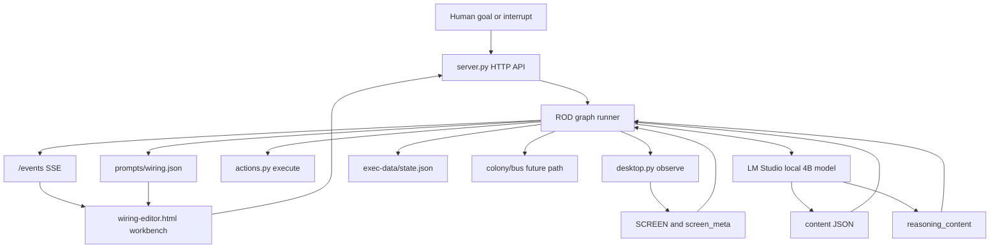
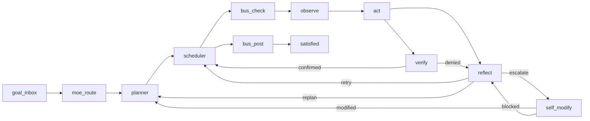
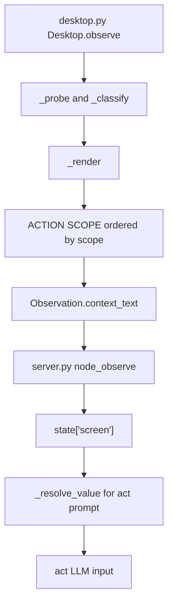
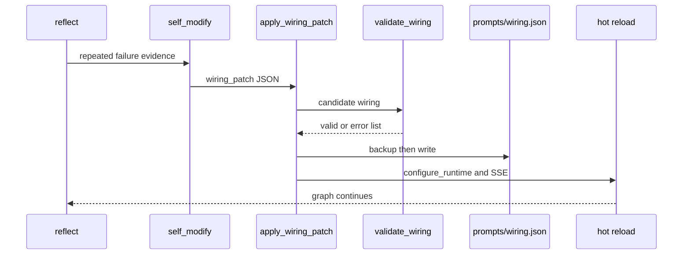
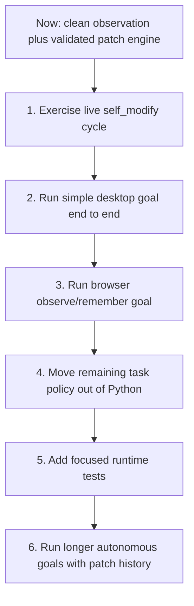

# endgame-ai

Endgame-ai is a local Windows desktop agent organism. It observes the desktop, plans through a wired ROD loop, executes UI actions, verifies outcomes, reflects on failures, and can mutate its own `prompts/wiring.json` through validated patches.

This README is the handover source of truth for humans and for any agentic coding AI that continues the project. Read it before changing code.

Last updated: 2026-06-22.

Workspace:

```text
C:\Users\px-wjt\Downloads\endgame-ai
```

Local workbench:

```text
http://127.0.0.1:9078/
```

## North Star

Build a self-improving local desktop organism:

- Python is the mechanical body.
- `prompts/wiring.json` is the mutable brain.
- The local LLM supplies semantic judgment.
- The workbench lets humans inspect and steer the organism live.
- Failures become evidence for durable wiring mutations.

The desired end state is not a pile of Python special cases. The desired end state is a loop that can run long desktop goals, detect repeated failure modes, patch its own prompts/topology/guards/observe filters, hot-reload the mutation, and continue.

Central rule:

```text
Do not make Python smarter about tasks. Make Python better at exposing facts and applying validated wiring mutations.
```

## Reality Snapshot

Implemented and verified:

- SCREEN prompt truncation has been removed.
- `SCREEN_TRUNCATED_FOR_PROMPT` is no longer generated by the runtime.
- Retired truncation config was removed from runtime/schema:
  - `prompt_screen_max_chars`
  - `node_value_max_chars`
  - `render_value_max_chars`
  - `tree_value_max_chars`
  - `render_tree_value_max_chars`
- Observe filters are live in wiring:
  - `scope_depth`
  - `element_text_max`
  - `render_focused_first`
- Focused page content renders before focused chrome, overlays, and background context.
- Workbench has live filter controls and SSE-driven refresh.
- SIGINT/SIGTERM saves current state.
- `parse_fallback` was removed; content JSON is the contract.
- Python hard-coded site names were removed.
- `self_modify` now uses a validated patch engine.
- Concrete node prompt config is supported, so evolved nodes of the same handler type can have distinct prompts.
- `/node/{type}` preserves topology node config when invoking handlers.
- Wiring prompts were compressed and aligned to the current runtime for the local 4B model.
- `POST /wiring` hot-reloads a full wiring JSON body after validation.

Not complete yet:

- A live LLM-driven self-modification escalation cycle has not yet been exercised after the patch-engine upgrade.
- A full autonomous end-to-end desktop goal has not yet been completed after these changes.
- Python still contains behavioral guard helpers that should shrink over time.
- There is no formal automated test suite.
- Desktop tree output can still be noisy under broad filters.

Recent commits before this handover batch:

```text
806a753 Enable self-rewiring observation filters
40ab6eb Preserve node config in direct node runs
e4a7dfc Rewrite handover for future coding agents
```

## System Map



Core files:

| File | Purpose |
| --- | --- |
| `server.py` | HTTP API, ROD graph runner, node handlers, prompt assembly, self-modify patch engine |
| `desktop.py` | Win32/UIA observation, hover probe, desktop tree, SCREEN rendering |
| `actions.py` | Mechanical verb execution |
| `colony.py` | Future multi-instance bus support |
| `wiring-editor.html` | No-build workbench UI, graph editor, live SCREEN/state panels |
| `prompts/wiring.json` | Mutable topology, prompts, guards, limits, observe config |
| `prompts/wiring-schema.json` | Wiring validation schema |
| `prompts/model.json` | LM Studio connection config |

## Runtime Loop



Circuit contracts:

| Node | Uses LLM | Sees SCREEN | Responsibility |
| --- | --- | --- | --- |
| `planner` | yes | no | Convert the goal into ordered human subtasks |
| `observe` | no | captures | Build SCREEN and metadata |
| `act` | yes | yes | Emit a mechanical action chain or remember record |
| `verify` | yes | no | Confirm or deny from outcomes and memory |
| `reflect` | yes | no | Diagnose failure and retry, replan, or escalate |
| `self_modify` | yes | no | Emit one validated `wiring_patch` |

Important prompt reality:

- Only `act` receives SCREEN.
- `planner`, `verify`, `reflect`, and `self_modify` must not pretend they see UI elements.
- [ID] targets are valid only from ACTION SCOPE.
- DESKTOP_TREE and WINDOWS are read-only context.
- Current goal literals override history, traces, and old reasoning.

## Observation Pipeline



Current action-scope order:

1. focused page content
2. focused chrome
3. overlays
4. background context

Current observe config:

```json
{
  "scope_depth": 4,
  "element_text_max": 500,
  "render_focused_first": true,
  "desktop_tree_max_depth": 8,
  "desktop_tree_max_nodes": 900
}
```

`scope_depth` buckets:

| Value | Includes |
| ---: | --- |
| 1 | focused page |
| 2 | focused page + focused chrome |
| 3 | focused page + focused chrome + overlays |
| 4 | focused page + focused chrome + overlays + background |

The model should see useful page content before toolbars, taskbar, or unrelated windows.

## Prompt Contract For 4B

The local model is small. Large, repetitive, stale architectural prompts make it less reliable. Current prompt policy is compact, role-local, and schema-first.

Prompt budget after compression:

| Prompt | Before | After |
| --- | ---: | ---: |
| base | 3504 | 863 |
| planner | 4189 | 972 |
| act/unified | 6137 | 1724 |
| verifier | 2084 | 974 |
| reflector | 1472 | 834 |
| self_modify | 3349 | 1491 |
| total | 20735 | 6858 |

That is about 67% smaller across base plus role prompts.

Prompt editing rules:

- Preserve exact JSON output schemas.
- Keep one clear rule instead of many examples.
- Do not reintroduce stale claims about removed truncation, parse fallback, or site-specific Python logic.
- Keep base prompt under roughly 1000 chars unless there is a strong reason.
- Keep each role prompt under roughly 2000 chars unless a schema change requires more.
- Put task semantics in wiring prompts/guards, not Python.
- If role behavior needs a separate variant, use concrete node prompt config instead of bloating the shared role.

## Self-Rewiring



Supported patch ops:

```text
add_node
update_node
remove_node
add_edge
remove_edge
set_guard
set_limit
set_observe
set_prompt_base
set_role
append_role_rule
set_reasoning
```

Patch policy:

- Prefer `set_observe` when the model lacks useful data or SCREEN is too noisy.
- Prefer `append_role_rule` when a circuit repeats a reasoning mistake.
- Prefer `set_guard` when the graph repeats a mechanical loop.
- Use topology edits only for real graph-structure problems.
- Use `set_role` or `set_prompt_base` only when existing prompt text is contradictory or stale.
- Use concrete node prompts when a distinct circuit needs distinct inputs or behavior.
- Never remove core routes unless the same patch replaces them with an equivalent connected path.

Backups are written before a self-modify mutation:

```text
prompts/wiring.backup.json
prompts/wiring.backup.YYYYMMDD-HHMMSS.json
```

## Workbench

`wiring-editor.html` is a no-build single-file UI.

Current features:

- goal entry
- new session
- observe
- single step
- continue loop
- pause
- load/save state
- hot-save wiring
- graph editor
- live SCREEN panes
- filter sliders for `scope_depth`, `element_text_max`, and `desktop_tree_max_depth`
- focused-first checkbox
- state, plan, history, reasoning, JSON, schema, log tabs
- SSE event log and state refresh

Next workbench improvements:

- Prompt Input Preview panel for every circuit.
- Clear indicator for SSE connected/stale.
- State diff per cycle.
- Self-modify patch history panel.
- One-click force `self_modify` debug action on current state.

## HTTP API

```text
GET  /                  workbench
GET  /health            server status, capabilities, self_modify_ops
GET  /wiring            current wiring
GET  /wiring-schema     schema
GET  /state             saved state
GET  /bus               bus messages
GET  /events            SSE stream
POST /step              execute one graph node
POST /run               enqueue autonomous run
POST /resume            resume saved state
POST /pause             pause run
POST /state             overwrite state
POST /wiring            validate and hot-reload full wiring JSON body
POST /node/{type}       execute one handler directly
POST /bus/post          append bus message
POST /interrupt         inject goal
POST /push              send SSE push
```

Hot-reload the current wiring file:

```powershell
Invoke-WebRequest -UseBasicParsing -Method Post -Uri 'http://127.0.0.1:9078/wiring' -InFile 'prompts\wiring.json' -ContentType 'application/json'
```

Do not use a bare `POST /wiring`; the endpoint expects the full JSON body.

## Runbook

Use this Python runtime if `python` is not on PATH:

```powershell
C:\Users\px-wjt\AppData\Local\Python\bin\python.exe
```

Start the workbench server:

```powershell
& "C:\Users\px-wjt\AppData\Local\Python\bin\python.exe" "C:\Users\px-wjt\Downloads\endgame-ai\server.py"
```

Hidden background start:

```powershell
$py = 'C:\Users\px-wjt\AppData\Local\Python\bin\python.exe'
$script = 'C:\Users\px-wjt\Downloads\endgame-ai\server.py'
Start-Process -FilePath $py -ArgumentList @($script) -WorkingDirectory 'C:\Users\px-wjt\Downloads\endgame-ai' -WindowStyle Hidden
```

Stop the server on port 9078:

```powershell
$owners = Get-NetTCPConnection -LocalPort 9078 -State Listen -ErrorAction SilentlyContinue | Select-Object -ExpandProperty OwningProcess -Unique
foreach ($ownerPid in $owners) { Stop-Process -Id $ownerPid -Force -ErrorAction SilentlyContinue }
```

Important: start `server.py` by absolute path. A prior restart using only `server.py` served stale wiring from another process context.

## Verification

Checks to run after each coherent change:

```powershell
git status --short
& "C:\Users\px-wjt\AppData\Local\Python\bin\python.exe" -m compileall -q .
& "C:\Users\px-wjt\AppData\Local\Python\bin\python.exe" -c "import json; json.load(open('prompts/wiring.json', encoding='utf-8')); json.load(open('prompts/wiring-schema.json', encoding='utf-8')); print('json ok')"
git diff --check
rg -n "grok|youtube|SCREEN_TRUNCATED_FOR_PROMPT|prompt_screen_max_chars|node_value_max_chars|render_value_max_chars|parse_fallback|safety-first|Chrome Lens" prompts\wiring.json server.py desktop.py actions.py prompts\wiring-schema.json
Invoke-WebRequest -UseBasicParsing -Uri 'http://127.0.0.1:9078/health' | Select-Object -ExpandProperty Content
Invoke-WebRequest -UseBasicParsing -Uri 'http://127.0.0.1:9078/wiring' | Select-Object -ExpandProperty Content
```

Verification already performed in this handover line:

- `compileall -q .` passed.
- `prompts/wiring.json` and `prompts/wiring-schema.json` parse as JSON.
- `git diff --check` passed.
- Stale runtime prompt/key scan returned no matches.
- `POST /wiring` with full JSON body returned 200.
- `/health` returned OK and exposes `self_modify_ops`.

## Next Plan



Goal 1: exercise a live self-modify cycle.

Use a controlled state that makes `self_modify` choose a harmless wiring patch, such as increasing `element_text_max` or appending one durable role rule. Confirm:

- LLM emits `record_type: wiring_patch`.
- `apply_wiring_patch()` applies it.
- `prompts/wiring.json` changes.
- backup file is created.
- `/wiring` reflects the change.
- graph continues through `modified`.

Goal 2: run a full autonomous desktop goal.

Start simple:

```text
open notepad and write hello from endgame
```

Then browser:

```text
open browser, go to example.com, remember the visible headline
```

Acceptance criteria:

- planner creates a short correct plan.
- observe puts relevant focused content first.
- act picks visible IDs or deterministic hotkeys.
- verify confirms real outcomes.
- no truncation marker appears.
- workbench updates live.

Goal 3: reduce Python behavioral intelligence.

Targets in `server.py`:

- browser/navigation guard helpers
- playback-specific verification shortcuts
- chat-specific preflight logic
- repeated precursor handling that could live in prompts/guards

Do not remove capability blindly. Replace Python policy with wiring prompt or guard behavior and verify.

Goal 4: add tests.

Suggested test file:

```text
tests/test_wiring_runtime.py
```

Initial tests:

- current wiring validates.
- retired truncation keys are absent from code/schema.
- `_resolve_value(state, "state.screen")` returns the full string.
- `apply_wiring_patch()` handles every supported op on a copy.
- concrete node prompt config overrides same-type default behavior.
- `_render()` orders focused Document before toolbar Button using synthetic nodes.

## Non-Negotiable Constraints

- Do not reintroduce SCREEN prompt truncation.
- Do not reintroduce `parse_fallback`.
- Do not add site-specific Python branches.
- Do not hide errors with `except/pass`.
- Do not make Python infer task semantics.
- Do not add confirmation loops for normal autonomous operation.
- Use wiring prompts/guards for semantic behavior.
- Validate and hot-reload wiring after mutations.
- Commit regularly.

## Methodology For Future Agents

Before editing:

1. Run `git status --short`.
2. Read this README.
3. Inspect the exact code path you will touch.
4. Search with `rg` before assuming.
5. Make one coherent patch batch.
6. Run compile and JSON checks.
7. Hot-reload or restart the server with absolute `server.py` path.
8. Verify with HTTP endpoints.
9. Commit the batch.

Decision rules:

- If the model lacked data, fix observation/rendering/filters.
- If the model had wrong policy, patch `prompts/wiring.json`.
- If graph flow was wrong, patch topology/guards/limits.
- If mechanics failed, patch Python mechanically.
- If the fix names one website/app/text literal, it probably belongs in prompt policy or not at all.

Session close checklist:

- README updated when reality changed.
- Wiring validates.
- Server reports healthy.
- Current limitations are stated directly.
- Commit exists for the coherent batch.

## Handover Meta Prompt

Use this prompt for the next agentic coding AI or human-assisted AI session:

```text
You are continuing endgame-ai in C:\Users\px-wjt\Downloads\endgame-ai.

Read README.md first. Treat it as the source of truth unless current code or HTTP health proves it stale. If it is stale, update it before closing.

Vision:
Build a local Windows desktop organism that observes, acts, verifies, reflects, and rewires its own prompts/topology/guards/filters through validated wiring patches. Python is mechanical infrastructure. prompts/wiring.json is the mutable brain. The local 4B LLM provides semantic judgment, so prompts must stay compact and exact.

Current reality:
- SCREEN prompt truncation has been removed.
- Focused page content renders before chrome, overlays, and background.
- Observe filters exist: scope_depth, element_text_max, render_focused_first.
- Workbench has live filter controls and SSE refresh.
- parse_fallback is removed.
- SIGINT/SIGTERM state saving exists.
- Python site-specific names were removed.
- self_modify uses apply_wiring_patch() with validated ops:
  add_node, update_node, remove_node, add_edge, remove_edge, set_guard, set_limit, set_observe, set_prompt_base, set_role, append_role_rule, set_reasoning.
- Concrete node prompt config is supported, so evolved nodes can have distinct prompts even when they share a handler type.
- Wiring prompts are compressed for the 4B model: base plus role prompts are about 6858 chars total.
- POST /wiring expects a full wiring JSON body.

Non-negotiables:
- Do not reintroduce prompt_screen_max_chars or SCREEN_TRUNCATED_FOR_PROMPT.
- Do not reintroduce parse_fallback.
- Do not add task/site-specific Python branches.
- Do not hide errors with except/pass.
- Keep Python mechanical.
- Put semantic fixes in wiring prompts or guards.
- Validate wiring after every mutation.
- Hot-reload or restart the server using the absolute server.py path.
- Commit every coherent verified batch.

First actions:
1. Run git status --short.
2. Run compileall, JSON parse, git diff --check, and the stale-key rg scan from README.md.
3. Confirm /health exposes self_modify_ops.
4. Confirm /wiring contains the compact prompts and current observe config.

Main next task:
Exercise a live self_modify cycle using controlled evidence. Confirm the LLM emits wiring_patch, the patch engine applies it, wiring.json changes, a backup is created, hot reload works, and the graph continues through modified.

Then run:
open notepad and write hello from endgame

After that, run:
open browser, go to example.com, remember the visible headline

When something fails:
- If the model lacked data, fix observation/rendering/filters.
- If the model had wrong policy, patch prompts/wiring.json.
- If graph flow was wrong, patch topology/guards/limits.
- If mechanics failed, patch Python mechanically.
- Do not add one-off app or site hacks.

Deliverable:
One verified capability improvement, README updated with current truth, and a commit.
```

## Final Reminder

The system becomes evolutionary only when failures are converted into durable wiring mutations.

Optimize for the loop:

```text
observe failure -> reason about cause -> patch wiring -> validate -> hot reload -> continue
```
