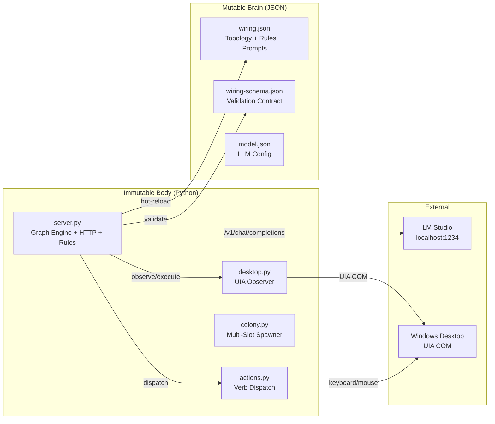
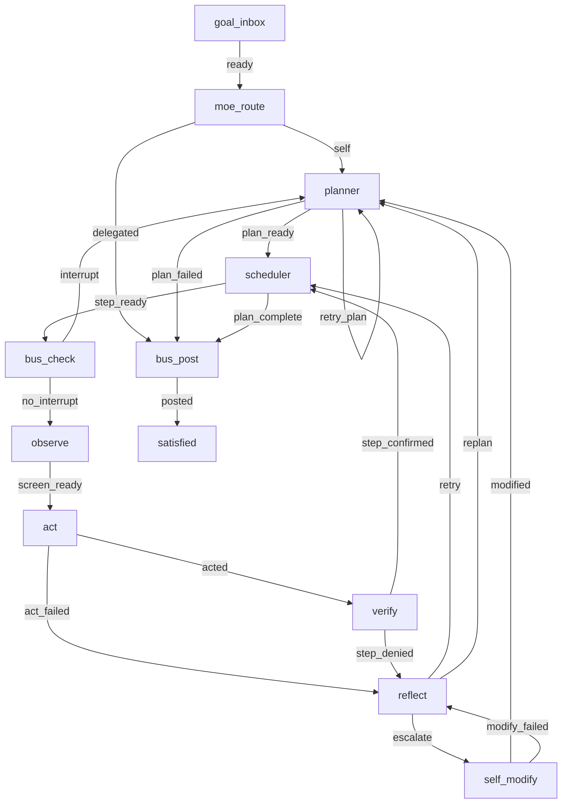
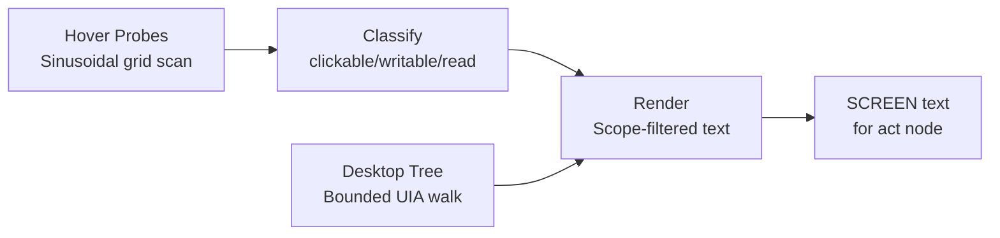
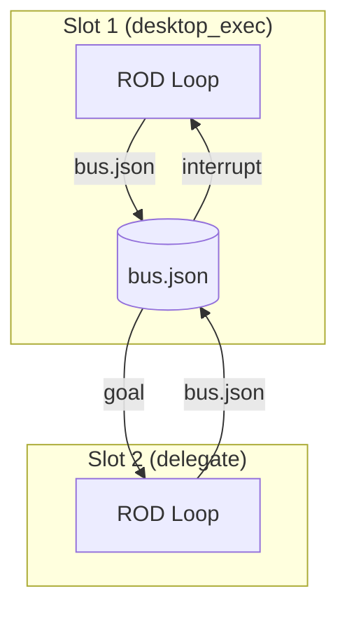

# endgame-ai

> **The last agent you'll ever need to build.**

A self-rewiring local Windows desktop agent that replaces the human operator. It sees the screen through accessibility APIs, acts through keyboard and mouse, reasons with a local 4B model, and evolves its own behavior at runtime — no cloud, no APIs, no pre-programmed skills.

```
Python checks structure. Wiring expresses policy. The model makes judgment when rules cannot prove the answer.
```

[](LICENSE)


---

## Table of Contents

- [Vision](#vision)
- [Architecture](#architecture)
- [The ROD Loop](#the-rod-loop)
- [Two-Pass Reasoning](#two-pass-reasoning)
- [Observation System](#observation-system)
- [Declarative Rule System](#declarative-rule-system)
- [Self-Modification](#self-modification)
- [Colony & MoE Routing](#colony--moe-routing)
- [Workbench](#workbench)
- [API Reference](#api-reference)
- [Hyperparameters](#hyperparameters)
- [Design Principles](#design-principles)
- [Research Connections](#research-connections)
- [Archaeology: Ideas Born & Killed](#archaeology-ideas-born--killed)
- [File Inventory](#file-inventory)
- [Diagnosis Workflow](#diagnosis-workflow)

---

## Vision

endgame-ai is not a coding assistant, not a chatbot, not a task runner. It is a **living organism of the computer** — a slow but real operator that clicks, types, and watches the screen exactly as a human does.

**Three perceptors, infinite capability:**
- 👁️ **See** — UIA accessibility tree + hover probes (no screenshots)
- ✋ **Act** — keyboard and mouse verbs (click, type, hotkey, scroll, focus)
- 🧠 **Think** — local 4B model with two-pass reasoning

A human using these three perceptors can do *anything* on a computer. So can this system.

**After completion:**
- No more programming or configuration of skills
- Skills are evolutionary products of runtime mutations
- The system writes its own scripts, opens its own terminals
- Re-planning and goal rephrasing ARE the mutations
- The environment evolves alongside the agent

**What makes this different:**
- Runs entirely local (LM Studio + stdlib Python)
- Zero pip dependencies
- Zero cloud API calls
- Self-modifies its own topology, prompts, and rules at runtime
- Uses ROD (Reason-Observe-Decide) instead of ReAct
- Mechanical preflight rules eliminate LLM calls when outcomes are provable
- The mutable layer (wiring.json) IS the brain — Python is just muscles

---

## Architecture



**Separation of concerns:**

| Layer | Changes | Contains |
|-------|---------|----------|
| Python (body) | Rarely | HTTP, graph execution, UIA, verbs, validation, rule dispatch |
| wiring.json (brain) | At runtime | Topology, prompts, rules, limits, observe config, normalizers |
| model.json (senses) | Per model swap | Temperature, top_p, top_k, max_tokens, endpoint |

---

## The ROD Loop

ROD = **Reason → Observe → Decide**

Unlike ReAct (which interleaves reasoning and action in a flat loop), ROD is a directed graph with distinct phases, retry paths, escalation, and self-modification.



**12 Node Types:**

| Node | Type | LLM? | Purpose |
|------|------|------|---------|
| goal_inbox | entry | No | Accept goal, emit ready |
| moe_route | moe_route | No | Route to self or delegate via bus |
| planner | planner | Yes | Decompose goal → 1-10 observable subtasks |
| scheduler | scheduler | No | Select current step or signal completion |
| bus_check | bus_check | No | Poll bus.json for interrupt goals |
| observe | observe | No | Capture UIA screen text + action targets |
| act | act | Yes | Emit and execute desktop verb chains |
| verify | verify | Yes* | Confirm or deny step completion |
| reflect | reflect | Yes | Diagnose failure → retry/replan/escalate |
| self_modify | self_modify | Yes | Propose validated wiring mutations |
| bus_post | bus_post | No | Post telemetry/result to bus |
| satisfied | satisfied | No | Terminal rest state |

*verify skips LLM when preflight rules fire

**Failure recovery paths:**
- **Retry:** reflect → scheduler → observe → act → verify (fresh attempt with new observation)
- **Replan:** reflect → planner (new plan from current state, preserves history)
- **Escalate:** reflect → self_modify → planner (mutate wiring then replan)

**Bounds:** `max_attempts=7` retries × `max_replans=3` before escalation. `max_cycles=300` absolute limit.

---

## Two-Pass Reasoning

Every LLM node executes two calls:

```
Pass 1 (Think):   system_prompt + user_blocks → free reasoning
Pass 2 (Decide):  system_prompt + user_blocks + ROD_REASONING_CONTENT + "DECIDE NOW" → JSON output
```

**Why:** A 4B model struggles to reason AND format JSON simultaneously. Separating these concerns:
- Pass 1 produces unconstrained reasoning (catches impulse errors)
- Pass 2 receives that reasoning as input and commits to structured output
- Temperature bumps on parse retries (0.3 → 0.45 → 0.6) explore alternatives

**KV-cache friendliness:** System prompt (base + role) is static per node type → LM Studio prompt cache hits on the prefix. Dynamic user message changes per cycle.

**Retry logic:** Up to `llm_parse_retries=2` attempts with increasing temperature if JSON parse fails.

---

## Observation System

endgame-ai observes the Windows desktop through UIA (UI Automation) COM interfaces — no screenshots, no OCR, no vision models.

**Pipeline:**



**Probe scanning:**
- Full-screen sweep at configurable step (default 70px for hover scan)
- Sinusoidal y-offset prevents grid-aligned misses
- Each probe point: `SetCursorPos` → `ElementFromPoint` → extract properties
- Deduplication by (role, name, automation_id, class_name, x, y, w, h)

**Enrichment fallbacks:**
- Dense probe (half step size) if elements < `scroll_enrich_min`
- Scroll enrichment passes `[-3, -2, 2, 3]` if still below threshold
- Desktop tree walk (bounded BFS of UIA hierarchy)

**Element classification:**
- `WRITABLE_ROLES` (Edit, ComboBox, Document) → action: write
- `CLICKABLE_ROLES` (Button, MenuItem, Hyperlink, ...) → action: click
- `ACTIONABLE_ROLES` (all interactive) → action: read

**Rendering:**
- Scope ordering: focused_page → focused_chrome → overlay → background
- Configurable `scope_depth` (default 4) filters background noise
- Action elements get sequential `[ID]` targets for act node
- Non-actionable elements rendered without IDs (context only)

**Overlay handling:**
- Z-order scan of visible windows
- Rectangle intersection test against focused window
- Overlay elements rendered with `@overlay` scope tag

**Post-action title capture:**
- After act execution, 250ms delay then capture focused window title
- Stored as `state.post_action_title` for verify evidence freshness
- Used in domain needle proof for navigation confirmation

**Configuration (all in `wiring.json → observe`):**

| Key | Default | Purpose |
|-----|---------|---------|
| hover_scan_enabled | true | Single-pass full-screen sweep |
| hover_scan_step_px | 70 | Probe grid spacing |
| probe_step_px | 40 | Primary probe step (when hover disabled) |
| scope_depth | 4 | Max scope levels rendered |
| element_text_max | 500 | Per-element text truncation |
| read_text_max | 16000 | Max chars from TextPattern |
| desktop_tree_enabled | false | UIA tree walk alongside probes |
| min_elements | 3 | Minimum before enrichment triggers |
| wait_retries | 6 | Retry waits for elements to appear |
| post_action_delay_ms | 250 | Delay before post-action title capture |

---

## Declarative Rule System

Rules eliminate LLM calls when outcomes are mechanically provable. They are the primary performance lever.

**Two phases, three verdicts:**

| Phase | Verdict | Effect |
|-------|---------|--------|
| verify | deny | Block false confirmation before verifier LLM |
| verify | confirm | Approve step completion before verifier LLM |
| act | reject | Block unsafe action chains before desktop execution |

**Evaluation order (safety-first):**
1. Filter rules by current phase
2. Evaluate deny/reject rules first
3. Evaluate confirm rules second
4. First matching rule wins
5. No match → fall through to LLM

**AND logic:** All conditions in a rule's `match` object must be true for the rule to fire.

**48 Condition Types:**

<details>
<summary>Click to expand full condition inventory</summary>

**Boolean conditions:**
- `outcome_ok`, `outcome_failed`
- `actions_wrote_nonempty`, `actions_write_is_url`, `actions_writes_all_url`
- `step_has_domain_needle`, `goal_has_domain`, `screen_contains_domain_needle`
- `focused_contains_action_target`, `focused_has_writable`
- `memory_has_key_from_action`, `memory_stored_by_action`
- `memory_value_not_url`, `memory_value_not_title`, `memory_value_not_prior_write`, `memory_value_not_question`
- `chain_is_launch`, `chain_launch_then_content_write`, `chain_is_navigation`, `chain_is_save`, `chain_wrote_and_submitted`

**String conditions:**
- `actions_include_verb`, `actions_all_verb`, `actions_verb_absent`
- `actions_pressed`, `actions_pressed_absent`

**Integer conditions:**
- `memory_value_min_length`, `memory_value_below_length`, `chain_launch_then_write_min_length`

**String array conditions:**
- `actions_sequence`, `actions_hotkey_contains`, `actions_hotkey_absent`
- `actions_write_target_line_contains`, `actions_write_target_line_absent`
- `actions_click_target_line_contains`, `actions_click_target_line_absent`
- `actions_focus_target_matches`, `actions_focus_target_absent`
- `actions_write_after_hotkey_has_target`
- `done_when_matches`, `done_when_absent`
- `step_text_matches`, `step_text_matches_groups`, `step_text_absent`
- `screen_contains`, `focused_title_matches`, `focused_title_absent`
- `focused_element_role_any`

</details>

**Current rules (25):**

| ID | Phase | Verdict | Purpose |
|----|-------|---------|---------|
| deny_outcome_failed | verify | deny | Any non-OK outcome → immediate denial |
| deny_chat_submission_missing_write | verify | deny | Chat step without write verb |
| deny_chat_submission_navigation_text | verify | deny | Written text is URL, not chat |
| deny_chat_submission_missing_submit | verify | deny | Chat text not submitted |
| deny_memory_capture_missing_value | verify | deny | Capture step without remember |
| deny_memory_capture_prior_prompt | verify | deny | Remembered value = prior prompt |
| deny_memory_capture_question | verify | deny | Remembered value is a question |
| deny_memory_capture_title | verify | deny | Remembered value = window title |
| deny_memory_capture_url | verify | deny | Remembered value is just a URL |
| deny_memory_capture_too_short | verify | deny | Remembered value < 30 chars |
| deny_response_no_evidence | verify | deny | Response step with no click/write/memory |
| confirm_launch_chain | verify | confirm | Win+R → type → Enter proven |
| confirm_browser_navigation | verify | confirm | ctrl+l → URL → Enter + domain visible |
| confirm_browser_navigation_address_target | verify | confirm | Address bar → URL → Enter + domain |
| confirm_remember_action | verify | confirm | Remember verb always confirms |
| confirm_write_to_writable | verify | confirm | Write to Edit/Document field |
| confirm_save_hotkey | verify | confirm | Ctrl+S with save in done_when |
| confirm_focus_matches_done_when | verify | confirm | Focus target in done_when |
| reject_chat_write_to_address_bar | act | reject | Chat write targeted address bar |
| reject_navigation_write_without_ctrl_l | act | reject | URL write without ctrl+l |
| reject_navigation_without_browser_context | act | reject | Navigation without browser focused |
| reject_navigation_missing_enter | act | reject | Navigation write without Enter |
| reject_navigation_target_after_ctrl_l | act | reject | Non-empty target after ctrl+l |
| reject_launch_then_long_content_write | act | reject | Content write chained after launch |
| reject_launch_then_summary_write | act | reject | Summary write chained after launch |

---

## Self-Modification

When the ROD loop exhausts retries and replans, it escalates to `self_modify` — the system proposes and applies validated mutations to its own wiring.json.

**15 Operations:**

| Operation | Target | Effect |
|-----------|--------|--------|
| add_node | topology | Add a new graph node with optional edges |
| update_node | topology | Change label, circuit, or prompt config |
| remove_node | topology | Delete node and all connected edges |
| add_edge | topology | Connect two nodes with a signal |
| remove_edge | topology | Disconnect nodes |
| add_rule | rules | Add a new declarative rule |
| update_rule | rules | Modify match/verdict/description |
| remove_rule | rules | Delete a rule |
| set_guard | guards | Set advance hint or guard value |
| set_limit | limits | Change numeric limits |
| set_observe | observe | Tune observation parameters |
| set_prompt_base | prompts | Replace the base system prompt |
| set_role | prompts.roles | Replace a role prompt |
| append_role_rule | prompts.roles | Add a line to a role prompt |
| set_reasoning | reasoning | Configure reasoning storage/chain |

**Safety gates:**
1. Backup written before every mutation (`wiring.backup.json` + timestamped)
2. Mutation applied to in-memory copy
3. `validate_wiring()` runs against schema
4. Only on validation pass: write to disk + hot-reload
5. SSE event `wiring_modified` pushed to workbench

**What can go wrong:**
- `set_role` replaces entire prompts — a 4B model may lose critical instructions
- Rule accumulation without cleanup (no limit on rule count)
- Graph disconnection possible via `remove_edge` (validation checks endpoints exist, not reachability)
- No `revert_last_mutation` operation exists

**What cannot go wrong:**
- `cycle_start` node cannot be removed
- Unknown rule conditions raise errors (not silently ignored)
- Schema violations are rejected before write
- Backup always exists for human recovery

---

## Colony & MoE Routing

The colony system enables multiple endgame-ai instances sharing a bus.



**Current MoE config:**
```json
{
  "required_permission": "desktop_exec",
  "delegate_keywords": ["chrome", "browser"],
  "default_exec_slot": 1
}
```

**Routing logic (node_moe_route):**
1. If this slot lacks `required_permission` AND goal contains delegate keywords → delegate via bus
2. Otherwise → handle locally

**Colony spawning (colony.py):**
- `python colony.py 1 2 3` spawns N slots with incrementing HTTP ports
- Slot with lowest number gets `desktop_exec` permission
- Health check polling with 20s timeout
- Graceful shutdown on Ctrl+C

**Bus protocol:**
- Messages: `{ts, from_slot, to_slot, type, payload}`
- Types: `goal`, `telemetry`
- Polling: `bus_check` node reads on every cycle
- Interrupt: higher-priority goal causes replan

**Current status:** Colony architecture is functional but single-instance mode is the primary use case. The keyword-based routing is intentionally simple — future evolution should be evidence-driven.

---

## Workbench

`wiring-editor.html` is a zero-dependency, zero-build single-file browser workbench served at `GET /`.

**Capabilities:**
- SVG topology graph with drag, zoom, pan
- Add/remove nodes and edges visually
- Edge creation by dragging from port circles
- State inspection (goal, step, retries, history, memory)
- Live SSE event consumption (node firing, rule hits, wiring modifications)
- Rule panel with add/remove and preflight hit highlighting
- Timing panel (goal time, event delta, node durations, token usage)
- Observation filters (scope_depth, element_text_max, tree depth) with live sliders
- Screen/Tree/Telemetry split panels
- Reasoning chain display
- Node input block inspection (resolved prompt blocks)
- JSON editor with hot-save (validates on server, rejects on error)
- Schema browser

**No build step.** No npm. No framework. Single HTML file with inline CSS and JS.

---

## API Reference

**Base URL:** `http://127.0.0.1:{port}` where port = `http_port_base` + slot (default: 9078 for slot 1)

| Method | Path | Purpose |
|--------|------|---------|
| GET | `/` | Serve workbench HTML |
| GET | `/health` | Status, nodes, capabilities, run state |
| GET | `/wiring` | Current wiring.json |
| GET | `/wiring-schema` | Validation schema |
| GET | `/state` | Persisted state.json |
| GET | `/bus` | Bus messages |
| GET | `/events` | SSE stream (node, result, stop, paused, wiring_modified, push) |
| POST | `/run` | Start autonomous goal loop `{goal}` |
| POST | `/step` | Execute one graph node `{goal?, state?, node?}` |
| POST | `/inspect` | Debug context for a node `{goal?, state?, node?}` |
| POST | `/state` | Save state `{state}` |
| POST | `/pause` | Request pause of running goal |
| POST | `/resume` | Resume from saved state |
| POST | `/wiring` | Validate + hot-reload wiring `{...wiring}` |
| POST | `/node/{type}` | Direct node execution `{state, config?, save?}` |
| POST | `/bus/post` | Post message to bus |
| POST | `/interrupt` | Send interrupt goal to this slot |
| POST | `/push` | Push arbitrary data to workbench via SSE |

---

## Hyperparameters

From `prompts/model.json`:

| Parameter | Value | Rationale |
|-----------|-------|-----------|
| host | http://localhost:1234 | LM Studio local server |
| model | nvidia-nemotron-3-nano-4b | 4B params, optimized for function calling |
| temperature | 0.3 | Low variance for deterministic actions |
| temperature_bump | 0.15 | Per-retry increment on parse failure |
| top_p | 0.9 | Nucleus sampling threshold |
| top_k | 20 | Restrictive — aids JSON formatting |
| max_tokens | 2048 | Shared across all roles |
| repeat_penalty | 1.06 | Mild repetition suppression |
| timeout | 900 | 15 min max per LLM call |
| stream | false | Complete responses only |

**LM Studio runtime (from proven logs):**
- Context: 35664 total, 2 slots × 17920 each
- Generation speed: ~24-25 tok/s
- Cached prompt eval: ~480-558 tok/s
- Prompt cache: 8192 MiB limit, checkpoints enabled

**Token budget management:**
- Estimated at ~3.5 chars/token
- Priority-based truncation: HISTORY and PRIOR_TRACES truncated first
- GOAL and SUBTASK never truncated (highest priority)
- Configurable: `limits.context_window_tokens=17920`, `limits.context_reserve_tokens=2560`

---

## Design Principles

1. **Python is mechanical.** No semantic decisions in Python. If a behavior can be expressed as a wiring rule or prompt instruction, it MUST live there.

2. **Wiring is the brain.** `prompts/wiring.json` is the single source of truth for behavior. It changes at runtime. Python hot-reloads it.

3. **Rules before LLM.** If an outcome is mechanically provable (launch chain, navigation pattern, write to writable), prove it with a rule. Save the LLM call for uncertain cases.

4. **No truncation hiding.** Do not silently truncate model output. Parse failures surface as errors, trigger retries with temperature bumps, and ultimately escalate.

5. **No site-specific code.** No `if "chrome" in title` branches in Python. Put domain keywords in rule match values.

6. **Self-modify is bounded.** 15 operations, schema-validated, backup-protected. Evolution is real but cannot produce structurally invalid wiring.

7. **Two-pass is non-negotiable.** Small models need the think/commit separation. Do not remove for latency. Prefer rules to eliminate whole LLM calls instead.

8. **Observation is generic.** UIA probing discovers whatever is on screen. No app-specific element selectors.

9. **Zero dependencies.** stdlib Python only. No pip install. No npm. No docker. Runs on any Windows machine with Python and LM Studio.

10. **Evidence over assumption.** Claims about completion require matching `done_when` criteria with observed facts. "OK wait" ≠ "response received."

---

## Research Connections

endgame-ai's mechanisms connect to active research. These are proven references, not aspirational comparisons.

### ROD vs ReAct

| Paper/System | Relevance to endgame-ai |
|--------------|------------------------|
| [Plan-Then-Execute for Web Agents](https://arxiv.org/html/2605.14290) | Validates ROD's separated planning phase over ReAct's interleaved approach |
| [ReAct Brittleness](https://arxiv.org/html/2601.17915v2) | "ReAct-style agents are especially brittle... conclusions sensitive to exploration order" — ROD's graph avoids this |
| [From Reactive to Programmatic GUI Agents](https://arxiv.org/html/2602.20502v1) | State machine + node-level execution with localized validation — mirrors ROD topology |
| [MGA (Memory-Driven GUI Agent)](https://arxiv.org/html/2510.24168v1) | "Observe first, then decide" — each step as independent context-rich state |
| [Dual-System Intelligence for GUI](https://arxiv.org/html/2506.17913v1) | Kahneman System 1/2 framework — rules = System 1, LLM = System 2 |

### Self-Evolution

| Paper/System | Relevance to endgame-ai |
|--------------|------------------------|
| [APEX Three-Layer Self-Evolution](https://arxiv.org/html/2606.15363) | Harness review → principle distillation → workflow topology evolution. Very close to self_modify |
| [Gödel Agent](https://arxiv.org/html/2410.04444v1) | "Self-evolving framework enabling agents to recursively improve without predefined routines" |
| [Self-Harness](https://arxiv.org/html/2606.09498v1) | "LLM-based agent improves its own operating harness without stronger external agents" |
| [Source-Level Rewriting](https://arxiv.org/html/2605.22794v2) | "Confine evolution to text-mutable artifacts—skill files, prompt configurations, workflow graphs" — exactly wiring.json |
| [Governed Evolution](https://arxiv.org/html/2605.27328) | "Bounded and observable process over persistent operational memory" |

### Desktop/GUI Agents

| Paper/System | Relevance to endgame-ai |
|--------------|------------------------|
| [OSWorld Benchmark](https://arxiv.org/abs/2404.07972) | Premier benchmark: humans 72.36%, best model 12.24%. Supports accessibility tree observation |
| [OSWorld Efficiency](https://arxiv.org/html/2506.16042v1) | Even best agents take 1.4-2.7x more steps than necessary |
| [OS-Harm Safety Benchmark](https://arxiv.org/html/2506.14866v1) | Safety benchmark for computer use agents |
| [Formally Specifying Agent Behavior](https://arxiv.org/html/2310.08535v2) | Declarative specification → decoding monitor guaranteeing behavior — mirrors rule system |
| [Declarative Agent Workflows](https://arxiv.org/html/2512.19769v1) | Separates workflow specification from implementation — mirrors wiring/Python split |

### Small Model Optimization

| Source | Relevance |
|--------|-----------|
| [Nemotron-Mini-4B](https://build.nvidia.com) | "Optimized through distillation for speed and on-device. Optimized for function calling" |
| [NVIDIA SLMs for Agentic AI](https://developer.nvidia.com) | Position that sub-10B models on consumer hardware are viable for agentic tasks |
| [Nemotron Edge Configuration](https://docs.nvidia.com) | "Dedicated configuration with simplified planning prompt optimized for smaller models" |

---

## Archaeology: Ideas Born & Killed

749 commits of evolution. These ideas were explored and removed — but may be relevant for future work.

<details>
<summary>Click to expand full archaeology</summary>

### Multi-Persona System (commits c519609, a1a1f4a)
- Had: `comms_operator`, `implementor`, `reviewer`, `architect`, `devops`, `generalist`
- Why killed: Collapsed into single unified act role. Multiple personas added orchestration complexity without proportional benefit for a single 4B model.
- **Revival potential:** With colony multi-slot, each slot could assume a persona. The infrastructure exists.

### Blackboard Architecture (v2/ directory, commit 2704b1b)
- Had: observer, orchestrator, persistence, journal, lessons modules
- Why killed: Over-engineered for the actual problem. Replaced by flat state.json + history array.
- **Revival potential:** The "journal" and "lessons" concepts map to traces.jsonl and self_modify. Already spiritually present.

### Voice Interface / ASR+TTS (commit e7d4f0c)
- Had: Nemotron ASR + Kokoro TTS via WSL2 audio bridge
- Why killed: Added complexity without core value. Voice is a nice-to-have for a desktop operator.
- **Revival potential:** High. A human operator hears and speaks. Voice adds a 4th perceptor. WSL2 bridge was working.

### Manager-Student Orchestration (commits 8974330, 8036a8d, 2cf43f0)
- Had: Dedicated manager.txt prompt, anti-loop guards, auto-DONE, outer-controller pattern
- Why killed: Unnecessary hierarchy for single-instance. The ROD loop IS the manager.
- **Revival potential:** For colony mode, a manager slot that only plans (no desktop_exec) while student slots execute.

### TUI Interface (commit replaced by HTML)
- Had: Terminal-based interface for monitoring
- Why killed: HTML workbench provides richer visualization with graphs, SSE, filters.
- **Revival potential:** None. HTML is strictly superior for this use case.

### Cytoscape.js / ELK Graph Editors (commits c2f83ac, e8ca171)
- Had: Third-party graph visualization libraries
- Why killed: External dependencies violated zero-dependency principle. Custom SVG replaced them.
- **Revival potential:** None. Current SVG editor is sufficient and dependency-free.

### Probe Testing Framework (probe_circuits.py, probe_fixtures/)
- Had: Dedicated probe testing with fixtures
- Why killed: Testing infrastructure removed to reduce surface area.
- **Revival potential:** Moderate. As rules grow complex, regression testing becomes important.

### Separate Module Architecture (llm.py, bus.py, slot.py, topology.py, wiring.py)
- Had: Clean module separation
- Why killed: Collapsed into server.py for single-file deployment simplicity.
- **Revival potential:** Low. Single file is easier for self_modify to reason about.

### Smoke Testing (smoke.py, 0e5b022)
- Had: "10/10 pass" automated cognitive smoke probes
- Why killed: Removed with test infrastructure consolidation.
- **Revival potential:** High. Automated validation of rule behavior after self_modify.

### ACP Client (acp_client.py)
- Had: Agent Communication Protocol integration
- Why killed: Non-standard protocol added complexity. Bus.json is simpler.
- **Revival potential:** Low unless integrating with external agent ecosystems.

### Plugin System (plugins/comms_beacon.py, plugins/fission_log.py)
- Had: Plugin architecture for extensibility
- Why killed: Self_modify + wiring mutation is more powerful than static plugins.
- **Revival potential:** None. Self-modify IS the plugin system.

### RESEARCH.md (commit 46deba9)
- Had: Field landscape research document covering DGM, HyperAgents, MOSS, AlphaEvolve, APEX, OSWorld
- Why killed: Merged into README context.
- **Revival potential:** This README's Research Connections section replaces it.

### Gemma 4B Hyperparameters (commit 70e4e3b)
- Had: "Perfect set of hyperparameters for Gemma4 E4B from Unsloth"
- Context: Before switching to Nemotron. Model-specific tuning is ephemeral.
- **Revival potential:** The principle remains — each model needs specific tuning. Document what works.

</details>

---

## File Inventory

```
endgame-ai/
├── server.py              # Graph engine, HTTP, LLM, rules, self-modify, state
├── desktop.py             # UIA COM observer, probe scanning, element classification
├── actions.py             # Verb dispatch (click/write/press/hotkey/scroll/focus/wait/remember)
├── colony.py              # Multi-slot spawner, bus communication, health checks
├── wiring-editor.html     # Zero-dependency browser workbench (SVG graph, SSE, state)
├── prompts/
│   ├── wiring.json        # THE BRAIN — topology, rules, prompts, config, everything
│   ├── wiring-schema.json # JSON Schema validation contract
│   └── model.json         # LLM hyperparameters and endpoint
├── .gitignore             # Allowlist format (track only source)
├── .gitattributes         # Line ending normalization
├── LICENSE                # MIT
└── README.md              # This file
```

**Runtime artifacts (gitignored):**
- `state.json` — persisted agent state
- `bus.json` — colony bus messages
- `prompts/traces.jsonl` — successful ROD traces for few-shot replay
- `prompts/wiring.backup.json` — pre-mutation backup
- `prompts/wiring.backup.*.json` — timestamped backups

---

## Diagnosis Workflow

```
1. git status --short
2. GET /health — status, capabilities, run state
3. GET /state — current step, retries, last_error, history
4. Check last_error and history[-1].outcome
5. Search LM Studio log by role and goal text
6. Use print_timing lines for performance (not "Reasoned for" lines)
```

**Fix by symptom:**

| Symptom | Fix Location |
|---------|-------------|
| Model chose bad action | `prompts.roles.unified` or add act-reject rule |
| Verify confirmed too much | Add verify-deny rule or tighten verifier prompt |
| Observe missed elements | Tune `observe` config via `set_observe` |
| Parse failures | Check context budget, adjust `max_tokens` or truncation priority |
| Repeated same failure | Check repeat_block, add advance_hint |
| Stuck after launch | Check normalizers, verify focus flow |

**Ground truth paths:**
```
Repo:      C:\Users\px-wjt\Downloads\endgame-ai
LM Studio: C:\Users\px-wjt\.lmstudio\server-logs\
API:       http://127.0.0.1:9078
LM Studio: http://127.0.0.1:1234/v1/models
```

---

## Running

```powershell
# Start LM Studio with nvidia-nemotron-3-nano-4b loaded

# Single instance
python server.py

# With immediate goal
python server.py --run "open notepad and type hello"

# Resume saved state
python server.py --resume

# Colony (multiple slots)
python colony.py 1 2

# Then open http://127.0.0.1:9078 for workbench
```

**Requirements:**
- Windows (UIA COM requires it)
- Python 3.11+ (for `tomllib`, type unions, slots dataclasses)
- LM Studio running with a compatible model loaded
- No pip install needed

---

## Act Normalizers

Mechanical equivalence rewrites applied after LLM output, before execution:

| From | Condition | Effect |
|------|-----------|--------|
| press | target contains "+" | Convert to hotkey |
| write | focused window exactly "Run", non-empty target | Clear target (type into focused Run field) |
| write | after Win+R, target equals value | Clear target |
| press | empty target+value after write | Set target to "enter" |
| click | focused exactly "Run", target is "ok" | Convert to press enter |

These fix model imprecision without hiding semantic errors. Silent normalization is bounded to Run-dialog equivalences only.

---

## Verbs

8 desktop verbs, field-mapped from `wiring.json → verbs`:

| Verb | Fields | Desktop Effect |
|------|--------|----------------|
| click | target_field | Resolve element → click center |
| write | target_field, value_field | Resolve element → click → ctrl+a → type |
| press | key_field | Single keypress |
| hotkey | key_field | Modifier combo (ctrl+c, alt+f4, etc.) |
| scroll | target_field, amount_field | Mouse wheel on element |
| focus | title_field | SetForegroundWindow by title match |
| wait | amount_field | Sleep (100ms-30s, clamped) |
| remember | target_field, value_field | Store key=value in state.memory (no desktop effect) |

**Element resolution priority:**
1. Exact ID match
2. Numeric ID extraction (`[3]` → element "3")
3. Fuzzy name matching with scoring (exact > contains > overlap)
4. Action-type ranking (writable > clickable > text)

---

<sub>MIT License © 2026 wgabrys88 — Built for the endgame.</sub>
