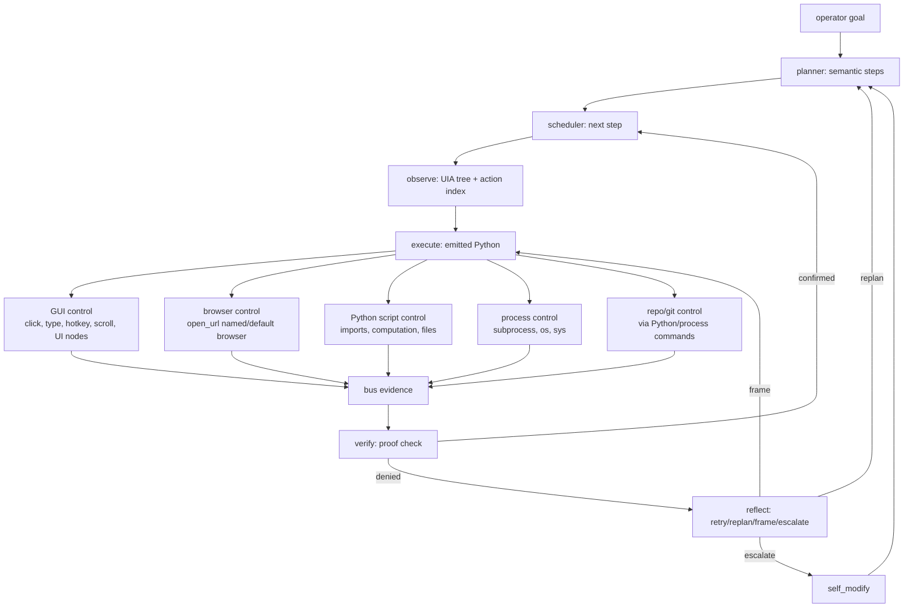
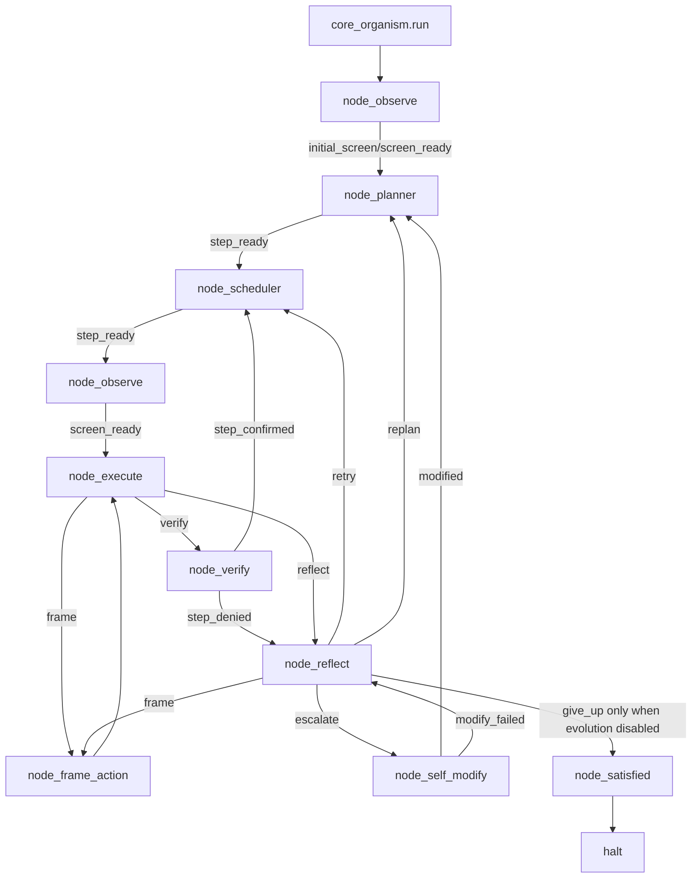
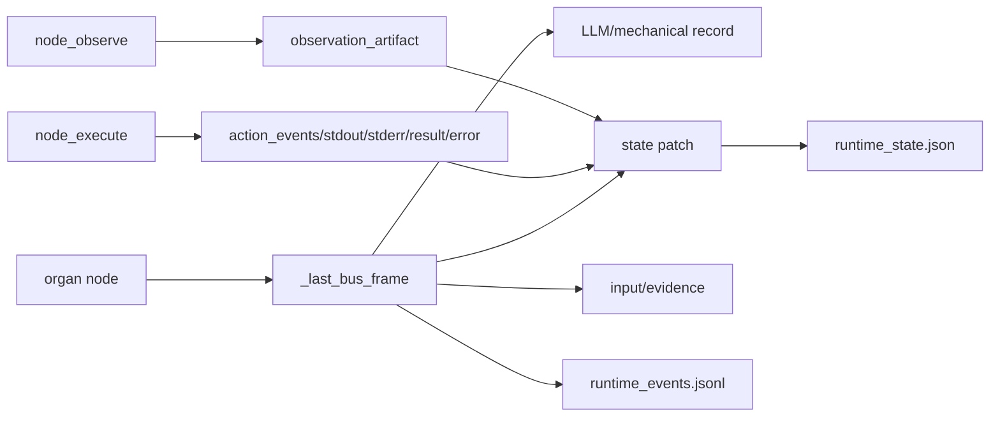
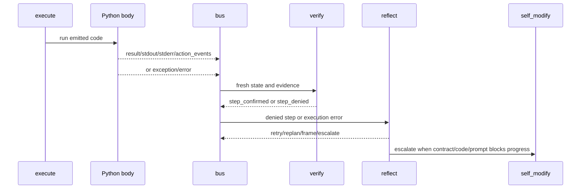
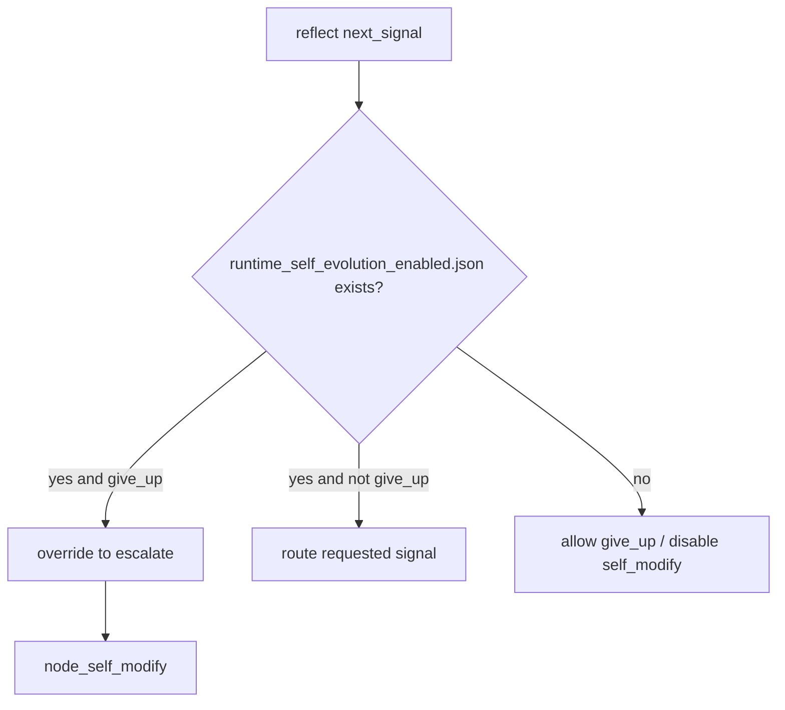
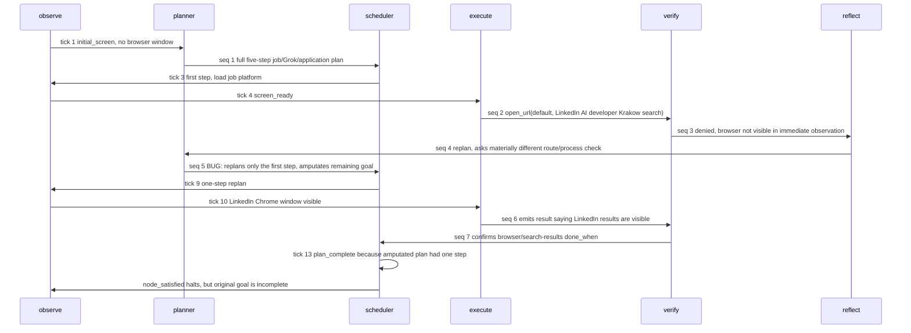

# endgame-ai

`endgame-ai` is a persistent task-agnostic local PC operator. Its loop is:
observe, reason, act, verify, learn, and evolve. It has two equal first-class
capability families:

1. GUI control: whole-screen UIA observation, actionable UI nodes, mouse,
   keyboard, browser windows, visible apps, and desktop state.
2. Script/process control: Python `exec`, normal imports, subprocesses,
   filesystem access under process permissions, process inspection, browser
   launch, Python modules, and git through process commands.

The system is not a click-and-type bot, and it is not a script-only runner. It is
a bus-driven local PC controller that can choose GUI, Python, subprocess,
filesystem, process, browser, or a composed route according to the task and the
evidence needed to prove progress. When a script, helper, command, app, import,
OS action, GUI node, or contract fails, Python returns an exception or captured
result into the bus; the reflect, planner, or self-modify organs then adjust from
that evidence. Escalation is for broken organism contracts, not the first failed
route.

This README was rewritten from the 2026-07-07 forensic session on branch
`prompts-adjust` after real desktop runs, prompt review, code patches, commits,
and pushes.

## Current Reality

The system is useful today as a supervised local desktop research/action harness
and self-repair loop. It can:

- Observe Windows UIA and build an LLM-visible tree plus action index.
- Use GUI helpers for visible apps and controls.
- Emit Python scripts through `node_execute`.
- Use subprocess, filesystem, imports, process commands, browser launch, and git
  from the Python runtime.
- Capture action events, stdout, stderr, exceptions, and result objects.
- Verify visible state and captured non-GUI evidence.
- Replan or reflect when evidence contradicts expected progress.
- Self-modify the repository when the evolution gate is enabled.

It is not yet reliable enough for unattended high-value workflows such as fully
applying for jobs, tailoring a CV, talking to Grok, filling forms, and submitting
applications in one run. The latest reset run opened a real Chrome/LinkedIn jobs
page for AI developer jobs in Krakow and observed 211 actionable elements, but it
halted prematurely after a one-step replan amputated the larger goal. That halt
was useful evidence, not true goal completion.

## Capability Model



The body is not intentionally restricted to a narrow command list. The actual
runtime namespace supplied to `node_execute` contains:

- Desktop helpers: `click`, `click_node`, `read_node`, `type_text`, `press_key`,
  `hotkey`, `scroll`, `scroll_node`, `action_nodes`, `node_by_id`, `pyautogui`,
  and `pag`.
- Browser helper: `open_url(browser, url)` for `opera`, `chrome`, `edge`,
  `firefox`, or `default`; named browsers fail hard when unavailable.
- Python/process modules: `subprocess`, `ctypes`, `os`, `sys`, `json`, `re`,
  `time`, `pathlib`, `math`, `random`, and `types`.
- Context: `state`, `wiring`, `goal`, `last`, `fresh_observation`,
  `desktop_tree`, `desktop_tree_text`, `action_index`, `observation_artifact`,
  `repo_root`, `python_executable`, topology helpers, and `capabilities`.

The `capabilities` payload is generated by `core_nodes.capability_manifest()` and
sent to the execute LLM request so the prompt and the actual Python runtime stay
aligned. `repo_root` is injected by the Python body from the directory where the
organism process was started; future organs should not guess workspace paths.

## Organism Loop



## Bus And Audit

All organs communicate through one bus record. Runtime replay is based on:

- `runtime_events.jsonl`: node starts/completions, brain requests/responses,
  self-modify events, duration expiry, and errors.
- `runtime_state.json`: latest state snapshot.
- `_last_bus_frame`: full node output trace with record, patch, and evidence.
- `observation_artifact`: scan config, scan stats, desktop tree, action index,
  and rendered tree text.
- `last_result.action_events`: concrete helper actions performed by execute.
- `last_error`: Python exception or contract error when execution fails.
- `last_verification`: verifier judgment.
- `last_reflection.routing_override`: body-side override when routing is unsafe.



The audit goal is that future sessions can reconstruct what happened from logs
alone: tick, sequence, node, signal, state patch, evidence, and exact action.

## Prompt Review Result

Prompts were reviewed after the user pointed out that the executor has broader
PC control than the prompt emphasized. The current intent:

- Planner: describes semantic outcomes and evidence tests, not implementation
  gestures. `done_when` can be proven by GUI state, files, process state,
  command output, browser or DOM state, external service responses, artifacts, or
  captured Python evidence. Planner does not decide what and how to do; actor
  does.
- Scheduler: selects the next semantic step without inventing action.
- Observe: mechanical UIA scan organ.
- Frame action: frames a specific route using any first-class channel, including
  GUI and script/process routes.
- Execute: actor/execute decides what to do and how to do it for the current
  semantic step. It explicitly states that `data.code` runs through Python `exec` with
  normal imports, subprocess, filesystem, process inspection, browser launch,
  GUI helpers, Python modules, state, wiring, and git through commands. It states
  that GUI control and script/process control are equal first-class capabilities.
- Verify: accepts screen evidence and captured script/process/file/command
  evidence.
- Reflect: treats failures from any channel as evidence and should try or route
  toward materially different viable approaches before escalation. It can choose a
  materially different GUI, Python, subprocess, file, process, browser, command,
  observation, or composed channel.
- Self-modify: repairs code, wiring, prompt, observation, action, verification,
  or recovery contracts when they block progress after task-route alternatives
  have been tried or ruled out by evidence.
- Satisfied: halts only for completion or honest give-up while self-evolution is
  disabled.

All prompts preserve the "Emit JSON only" and "Do not include examples" contract.

## Failure And Adjustment Model

This is how failure is supposed to work:



Examples are intentionally not embedded in prompts, but the runtime behavior is:

- A bad node id raises hard.
- A missing named browser raises hard.
- A subprocess command can return captured return code/stdout/stderr.
- A Python exception becomes `last_error`.
- A silent execute path with no result/stdout/stderr/action event is a contract
  failure.
- A desktop action after `deadline_at` is blocked before acting.
- Reflect chooses a different route, replans, frames, or escalates.

## Self-Evolution Gate

`runtime_self_evolution_enabled.json` is the control file:

- Present: self-modify may apply, commit, and push.
- Absent: self-modify fails closed and reports disabled status.
- Present: `give_up` is blocked by the body. If reflect emits it, the body
  overrides to `escalate` and logs the override.
- Absent: `give_up` is allowed because evolution has been disabled.



## Known-Good Recovery

Hot swap uses a Git ref instead of a stale JSON-only SHA:

- Operational ref: `refs/endgame/known_good`
- Seed fallback: `self_modify.known_good_commit` in `wiring.json`
- Audit file: `runtime_known_good_commit.json`

Successful self-modify commits update the known-good ref. When
`self_modify.git.push_after_commit` is true, both the branch and known-good ref
are pushed. Hot swap checks each target path against the known-good commit and
reports `missing_in_known_good` rather than crashing on Git pathspec errors.

## Observation Limits

The LLM-visible element knobs in `wiring.json`:

```json
{
  "max_subtree_nodes_per_point": 8000,
  "max_total_nodes": 40000,
  "max_llm_nodes": 5000,
  "max_action_nodes": 12000,
  "max_depth": 24,
  "max_children_per_window": 240
}
```

`max_llm_nodes` is now enforced and logged through:

- `rendered_node_count`
- `max_llm_nodes`
- `llm_node_limit_hit`

Evidence from the session:

- Initial post-fix direct observe: 312 unique raw nodes, 24 actionable elements.
- Direct observe after raising knobs: 432 unique raw nodes, 28 actionable
  elements, 29 rendered nodes, `limit_hit=false`.
- Final run after Chrome appeared: 546 unique raw nodes, 63 actionable elements,
  65 rendered nodes, `limit_hit=false`.

## Why This Diff Is Large

The session produced a large diff for concrete reasons:

- The README was intentionally rewritten from scratch after live runs so future
  sessions inherit evidence, not stale marketing text.
- Prompt strings in `wiring.json` are long single JSON values, so small semantic
  prompt changes appear as large line changes.
- The planner/scheduler continuity fix touches several organs: planner payload
  now includes previous plan/progress, verify records completed steps, scheduler
  refuses premature completion, and planner prompt now requires complete
  remaining plans on replan.
- `export_brain_forensics.py` was restored after a live self-modify run deleted
  it while trying to work around a hot-swap pathspec failure. Restoring that file
  accounts for many lines but preserves replay tooling.
- `core_nodes.py` gained the runtime capability manifest, known-good ref logic,
  hot-swap path filtering, action deadline guards, and helper evidence.
- The additions are contract/audit spine work, not fallback bloat. They make the
  organism explain what it can do, what it did, where it ran, and why it failed.

## Latest Real Run

Run command shape:

```powershell
& "C:\Users\px-wjt\AppData\Local\Python\bin\python.exe" core_organism.py --reset --duration-seconds 180 "<goal>"
```

Latest goal:

```text
Use the real Windows desktop to search for AI development jobs in Krakow. Use
the system's full capabilities: GUI, browser, Python scripts,
subprocess/process/file checks, and any visible browser or external AI chat route
that is available. If Grok is reachable through the browser GUI, share
job-search/profile-context data with Grok as approved and ask it to compare
offers against the user's experience context. Gather offers, record evidence,
tailor application materials if enough profile facts and files are available,
and attempt at least one application workflow only when required facts and UI
state are unambiguous.
```

Final run segment:

- Start: `2026-07-07T12:42:48`
- Events: 43
- Brain request/response pairs: 7
- Node starts: observe 3, planner 2, scheduler 3, execute 2, verify 2,
  reflect 1, satisfied 1
- Final tick: 13
- Stop reason: halted by `node_satisfied`
- Final phase: `halted`
- Final observed window: `(6) AI developer Jobs in Krakow, Poland | LinkedIn -
  Google Chrome`

Failure/progress chain from the latest run:



Concrete action evidence:

```json
{
  "ok": true,
  "action": "open_url",
  "browser": "default",
  "url": "https://www.linkedin.com/jobs/search/?keywords=AI%20developer&location=Krakow%2C%20Poland"
}
```

What worked:

- The system launched a real browser route to LinkedIn jobs.
- A later observation saw Chrome with the LinkedIn title
  `(6) AI developer Jobs in Krakow, Poland | LinkedIn`.
- Observation grew from 27 action elements before browser visibility to 211
  action elements after LinkedIn appeared.
- Reflect did not escalate immediately; it replanned after the first denial.
- `repo_root` and capability parity are now explicit in prompts and execute
  payloads.

What did not complete:

- Grok was not reached.
- Job offers were not extracted.
- Profile comparison did not happen.
- CV/documents were not created.
- No application form was filled or submitted.
- Scheduler halted because the replan contained only the first step, not the
  remaining original goal. This was fixed immediately after the run by adding a
  body-enforced plan continuity contract.

## Plan Continuity Fix

The latest run proved a planner/scheduler bug:

- Initial plan had five goal obligations: browser/job search, extract offers,
  Grok/profile comparison, profile/material readiness, and application workflow.
- After the first verification denial, planner replanned only the first browser
  step.
- Scheduler completed that one-step active plan and routed to satisfied.
- `node_satisfied` halted, even though original goal obligations remained.

The fix:

- `node_planner` now receives `previous_plan`, `root_plan_intent`,
  `completed_steps`, `remaining_root_obligation_count`, and `last_reflection`.
- `node_planner` stores the original `root_plan_intent` and fails hard if a
  replan emits fewer steps than unresolved root obligations.
- `node_verify` appends confirmed steps to `completed_steps`.
- `node_scheduler` refuses `plan_complete` if the active plan is exhausted while
  root obligations remain incomplete.
- The planner prompt explicitly says replans must cover the complete remaining
  original goal, not only the failed/current step.

## MoE Critique

Forensic lens:

- Stronger now: node events include full bus frames, action evidence, observation
  stats, and prompt/response pairs.
- Still weak: replay slicing is manual. A first-party last-run summarizer is
  needed.

Desktop automation lens:

- Stronger now: UIA access-denied points are counted and logged instead of
  killing observation.
- Still weak: browser page content through UIA is not enough for robust web task
  completion.

Script/control lens:

- Stronger now: prompts and capability manifest state that Python/script/process
  control is first-class alongside GUI.
- Still weak: there is no dedicated DOM/CDP bridge, so browser internals are not
  as directly controllable as local Python and OS commands.

Agent architecture lens:

- Stronger now: the system can replan from contradictory evidence and can
  self-modify with a known-good ref.
- Still weak: long LLM response latency consumes most short runs.

Self-evolution lens:

- Stronger now: `runtime_self_evolution_enabled.json`, blocked `give_up`, pushed
  known-good ref, and path-filtered hot swap make evolution auditable.
- Still weak: destructive self-modify decisions still need better root-cause
  discipline.

Product usefulness lens:

- Useful now for supervised desktop experiments, repo evolution, and proving
  whether a goal can advance on the real PC.
- Not yet useful as a fully autonomous job-application agent.

Meta-critique of this session:

- The stale known-good SHA should have been fixed before the user called it out.
- The initial README underemphasized script/process control and overemphasized
  GUI. This rewrite corrects that while keeping GUI first-class.
- The first log summary accidentally counted prior runs; final analysis used the
  last `organism_start` segment only.
- The final run proved progress, not completion.

## Highest-Value Next Steps

1. Add a browser DOM/CDP bridge.
   Keep UIA GUI control first-class, but give web tasks direct access to page
   text, links, forms, titles, and navigation state.

2. Add action wait contracts.
   `open_url` should wait for matching browser/page evidence or return a hard
   failure with observed state.

3. Add per-node time budgets.
   Brain calls and execute scripts need budget-aware behavior before the global
   duration expires.

4. Add a first-party run summarizer.
   Summarize the last run from `runtime_events.jsonl`: event counts, node chain,
   brain responses, action evidence, observation counters, final state, and
   failure roots.

5. Strengthen self-modify destructive-change review.
   Deletion should require root-cause evidence, not only symptom relief.

6. Add a profile/document contract.
   Job-application workflows need explicit profile facts, resume/document file
   paths, consent boundaries, and proof of what was submitted.

7. Keep prompts capability-complete.
   Future prompts must continue to state that GUI and script/process control are
   equal first-class channels, and the `capabilities` payload must remain
   authoritative.

## Commands

Run:

```powershell
& "C:\Users\px-wjt\AppData\Local\Python\bin\python.exe" core_organism.py --reset --duration-seconds 180 "<goal>"
```

Compile:

```powershell
& "C:\Users\px-wjt\AppData\Local\Python\bin\python.exe" -m compileall -q .
```

Validate wiring:

```powershell
& "C:\Users\px-wjt\AppData\Local\Python\bin\python.exe" -m json.tool wiring.json | Out-Null
```

Export brain forensics:

```powershell
& "C:\Users\px-wjt\AppData\Local\Python\bin\python.exe" export_brain_forensics.py --input runtime_events.jsonl --out-dir .
```

Disable self-evolution:

```powershell
Remove-Item runtime_self_evolution_enabled.json
```

Re-enable self-evolution:

```powershell
& "C:\Users\px-wjt\AppData\Local\Python\bin\python.exe" -c "import core_stop_check as s; s.ensure_self_evolution_enabled(source='manual')"
```

## Future Session Handover Prompt

```text
Continue endgame-ai on branch prompts-adjust.

Read the repo and latest runtime logs before editing. Do not assume README is
truth unless it matches code and runtime_events.jsonl.

The key architecture contract is: endgame-ai is a persistent task-agnostic local
PC operator. It is GUI-capable and full-PC capable. GUI control and emitted
Python/script/process control are equal first-class capabilities. Planner defines
semantic steps and done_when proof conditions; actor/execute decides what to do
and how to do it. done_when proof can be GUI state, file existence/content,
process state, command output, browser/DOM state, external service response,
created artifact, or captured Python evidence. node_execute emits Python code
that runs in the organism process with normal imports, subprocess, filesystem,
process inspection, browser launch, GUI helpers, state, wiring, and git through
commands. repo_root is injected from the directory where the organism process was
started; do not guess workspace paths. If a route fails, the exception or
captured evidence goes into the bus; verify/reflect/planner or self_modify
adjusts from that evidence. Try materially different viable approaches before
escalating to self_modify; escalation is for broken organism contracts.

Known pushed commits include:
- 88a538d Harden action bus and self-evolution gate
- 443cf8e Recover from inaccessible UIA probe points
- 5ba2533 Wire known-good ref and observation visibility
- 50a0b98 Push known-good ref after self-modify commits
- 47a8a40 Block desktop actions after run deadline
- b738d35 Rewrite README with forensic run analysis

refs/endgame/known_good has been pushed and should point at the latest validated
checkpoint after the current session's final commit.

runtime_self_evolution_enabled.json controls evolution. While it exists,
node_reflect must not give up; give_up is body-overridden to escalate.

Latest proven run opened Chrome and navigated to:
https://www.google.com/search?q=AI+development+job+offers+Krakow
It did not reach Grok, extract offers, tailor documents, or submit an
application.

Next focus:
1. Browser DOM/CDP bridge while preserving UIA GUI control.
2. open_url wait contracts and page evidence.
3. Per-node time budgets.
4. First-party last-run summarizer.
5. Stronger destructive-change review in self_modify.
6. Profile/document contract for job applications.

Keep changes task-agnostic. Do not hard-code the job-search flow. Preserve
fail-hard contracts, explicit evidence, GUI parity, script/process parity, and
replayability from runtime_events.jsonl.
```

### Appendix: Git Workflow for known_good Ref (Important!)

This project uses a special git reference `refs/endgame/known_good` for recovery and self-evolution.

#### Rules to always follow:

1. **After merging any branch to `main` (via PR or direct):**
   ```powershell
   git checkout main
   git pull origin main
   git update-ref refs/endgame/known_good HEAD
   git push origin refs/endgame/known_good:refs/endgame/known_good
   ```

2. **On a fresh clone (new computer or deleted folder):**
   ```powershell
   git clone <url>
   cd endgame-ai
   git fetch origin refs/endgame/known_good:refs/endgame/known_good
   ```

3. **Creating a new feature branch:**
   ```powershell
   git checkout main
   git pull origin main
   git checkout -b your-branch-name
   ```
   → No extra ref commands needed.

4. **Never delete a branch before updating the ref on main** (after merge).

#### Quick Check
```powershell
git show-ref refs/endgame/known_good
```

Keeping this ref up-to-date ensures self-evolution and recovery always use the latest stable code.
