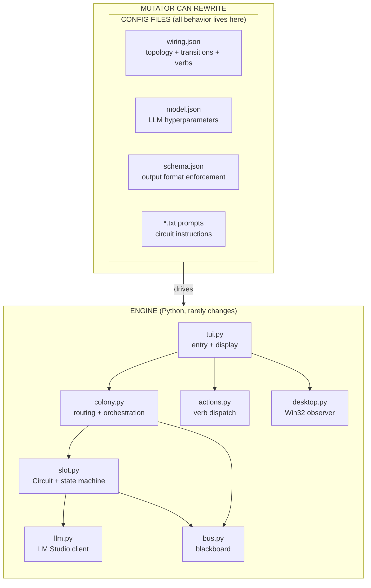
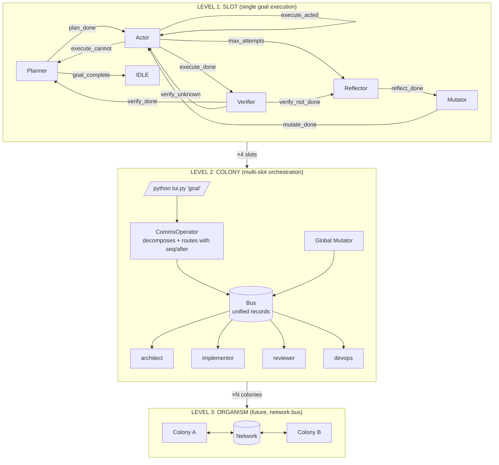
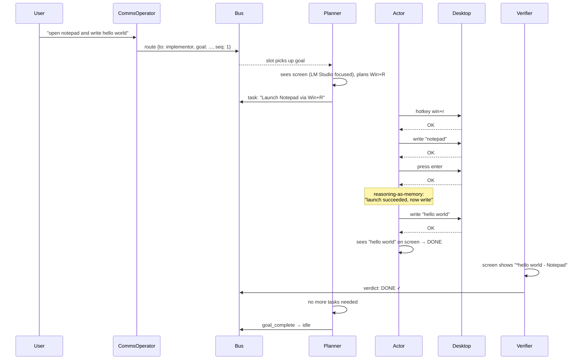
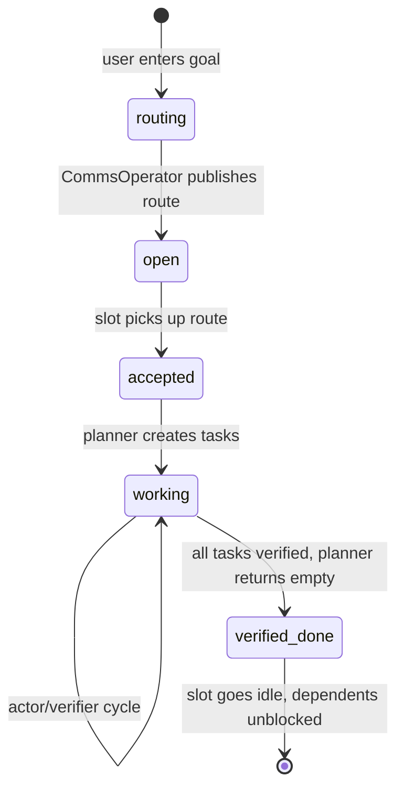

# endgame-ai

A self-evolving agentic runtime for Windows 11. Model agnostic. Single process. ~1100 LOC.
All behavior controlled by text files. Code is just the engine.

**First successful autonomous execution: opened Notepad and typed "hello world" — plan, act, verify — with zero human intervention.**

## Architecture



## Three Levels



## Execution Flow (proven working)



## Wiring-Driven Design

Every connection between components is declared in `prompts/wiring.json`:

```json
{
  "limits": {
    "max_attempts": 5,
    "reasoning_history_depth": 3
  },
  "circuits": {
    "actor": {
      "prompt": "actor.txt",
      "inject": ["goal","task","contract","last_error","last_reasoning","screen"]
    }
  },
  "transitions": {
    "execute_done": "verifier",
    "execute_acted": "actor",
    "goal_complete": "idle"
  },
  "verbs": {
    "hotkey": {"key_field": "target"},
    "click":  {"target_field": "target"}
  }
}
```

To change system behavior: edit a JSON/text file. The mutator can rewrite these at runtime.

## Reasoning-as-Memory

```
┌──────────────────────────────────────────────────────────────────────────────┐
│                    REASONING-AS-MEMORY FEEDBACK LOOP                          │
├──────────────────────────────────────────────────────────────────────────────┤
│                                                                              │
│  Traditional systems:                                                        │
│  ┌─────────────┐     ┌─────────┐     ┌──────────┐                           │
│  │ LLM thinks  │────▶│ Content │────▶│ Execute  │────▶ error ──┐            │
│  │ (discard)   │     │ (keep)  │     │          │              │            │
│  └─────────────┘     └─────────┘     └──────────┘              │            │
│        ▲                                                        │            │
│        └── next call: task + screen + error ────────────────────┘            │
│  LLM starts FRESH. Loops forever on the same approach.                       │
│                                                                              │
├──────────────────────────────────────────────────────────────────────────────┤
│                                                                              │
│  This system: reasoning IS the cross-call memory                             │
│                                                                              │
│  Call N:   reasoning: "I'll try win+r"  →  content: {hotkey: "win+r"}        │
│  Execute:  hotkey OK, write OK, press OK                                     │
│                                    ↓                                         │
│  Call N+1 prompt includes:                                                   │
│    LAST REASONING: "I'll try win+r" → hotkey: OK; write: OK; press: OK      │
│                                    ↓                                         │
│  LLM thinks: "Launch succeeded. Now I need to write the text."              │
│  Action: {write: "hello world"}                                              │
│                                    ↓                                         │
│  Call N+2 prompt includes:                                                   │
│    [attempt 1] "win+r launch" → OK                                          │
│    [attempt 2] "write hello world" → write: OK                              │
│                                    ↓                                         │
│  LLM thinks: "Both succeeded. Screen confirms. DONE."                       │
│                                                                              │
│  PROVEN IN PRODUCTION: the actor used this chain to progress from            │
│  launch → write → verify in 3 calls without repetition.                     │
│                                                                              │
├──────────────────────────────────────────────────────────────────────────────┤
│                                                                              │
│  The insight:                                                                │
│                                                                              │
│  Normal:  STATE + ERROR → LLM → action                                      │
│  Ours:    STATE + ERROR + "WHY I TRIED THAT" → LLM → action                 │
│                                                                              │
│  thinking(N) + outcome(N) → thinking(N+1)                                   │
│  A reasoning chain spanning multiple LLM calls, grounded by reality.        │
│                                                                              │
└──────────────────────────────────────────────────────────────────────────────┘
```

## Route Dependencies

CommsOperator outputs sequenced routes:
```json
{"routes": [
  {"to": "implementor", "goal": "open notepad", "seq": 1},
  {"to": "implementor", "goal": "write hello", "seq": 2, "after": 1}
]}
```

Slots only pick up routes whose `after` prerequisite is `verified_done`. Sequential goals execute in order.

## Goal Lifecycle



## How to Run

```powershell
python tui.py "open notepad and write hello world"
```

| Key | Action |
|-----|--------|
| Enter | New goal |
| 1-4 | Toggle slot |
| q | Quit |

`--no-desktop` skips screen observation.

## Files

```
tui.py        ~185 LOC  Entry point + TUI display + keyboard
colony.py     ~140 LOC  CommsOperator + Colony orchestration
slot.py       ~220 LOC  Generic Circuit + Slot state machine
desktop.py     428 LOC  Screen observation (hover probe) + GUI actions
llm.py         ~95 LOC  LM Studio HTTP client (extracts reasoning_content)
actions.py     ~95 LOC  Data-driven verb dispatch from wiring.json
bus.py         ~75 LOC  Shared blackboard with dependency tracking
prompts/
  wiring.json           Topology, transitions, verbs, limits
  model.json            LLM hyperparameters
  schema.json           Output schema (strict enforcement)
  planner.txt           Task decomposition
  actor.txt             Action selection (with reasoning feedback)
  verifier.txt          Verdict evaluation
  reflector.txt         Failure diagnosis
  mutator.txt           Mutation script generation
```

**~1240 LOC Python. Zero external dependencies. Python 3.12+ stdlib only.**

## Governance

```
CODE:        engine only — topology is in wiring.json
WIRING:      controls connections, transitions, field mappings
PROMPTS:     instruct what the LLM thinks at each phase
SCHEMA:      enforces output format (LM Studio strict mode)
BUS:         records what happened (full observability)
VERIFIER:    judges outcomes (independent correction signal)
MUTATOR:     can rewrite wiring + prompts + model.json (self-evolution)
CYCLE CAP:   5 attempts per task (only hard safety limit)
```

No permission checks in code. No env vars. No CLI flags for config.

## Requirements

- Windows 11
- Python 3.12+
- LM Studio running with any model supporting structured output (tested: gemma-4-e2b-it)

---

## AI CONTINUATION HANDOVER

You are continuing work on `endgame-ai` — a self-evolving, unconstrained agentic runtime for Windows 11.

### What This System Is

A ~1240 LOC Python engine that operates a Windows desktop autonomously. It decomposes goals into tasks, executes them via GUI actions or subprocess, verifies results from screen state, and self-corrects through reflection and mutation. All behavior is controlled by text files. The code is just a state machine that reads config.

### What Just Happened (First Successful Run)

The system autonomously opened Notepad and typed "hello world" on a real Windows 11 desktop:
1. CommsOperator routed the goal to `implementor` slot
2. Planner saw the screen (LM Studio focused), planned Win+R launch
3. Actor executed: hotkey win+r → write "notepad" → press enter
4. Actor saw Notepad open, wrote "hello world"
5. Actor claimed DONE
6. Verifier confirmed from screen: "*hello world - Notepad" visible
7. Planner returned empty tasks → goal_complete → slot went idle

Total: 5 productive LLM calls, ~140 seconds of useful inference. The reasoning-as-memory loop was critical — actor call 2 saw its prior reasoning ("launched via Win+R → OK") and adapted ("now write text").

### Architecture Rules

1. **Wiring is config, not code.** All transitions, context injection, verb field mappings in `wiring.json`.
2. **One generic Circuit class.** Parameterized by wiring config. No separate Planner/Actor/Verifier classes.
3. **Slot is a state machine.** Reads phase, runs circuit, reads event, looks up next phase.
4. **Reasoning-as-memory.** LLM's `reasoning_content` stored per-attempt, fed back as `LAST REASONING` in next call. Configured via `inject: ["last_reasoning"]`.
5. **Route dependencies.** `seq`/`after` fields. Slots only pick up routes whose prerequisites are done.
6. **Goal lifecycle.** open → accepted → working → goal_complete → idle.
7. **Schema always enforced.** Every call uses `response_format` from `schema.json`.
8. **Mutator rewrites config.** That IS the self-evolution mechanism.
9. **Actions are data-driven.** `wiring.json` verbs section declares field mappings per verb.
10. **No env vars, no .env file.** All config in `prompts/` directory.

### Known Issues (for next session)

1. **Initial planner_error ×3** — first calls happen before desktop observer produces screen data. Planner gets empty SCREEN and produces unparseable output. Consider: skip planner call if screen empty, or add a "wait for observation" warmup.

2. **Deterministic seed** — `seed: 3407` in model.json causes identical outputs on retries. For the planner_error loop this means 3 identical failures before screen arrives. Could randomize seed per call, or accept it.

3. **Token budget on reasoning** — Post-completion planner spends 800+ tokens reasoning about "goal is met" before outputting `{"tasks":[]}`. The `goal_complete` fix now catches this immediately, but the tokens are still spent on the first call. Consider: lower max_tokens for planner when history shows recent verified work.

4. **TUI cognitive load** — Display is functional but dense. Future work: clearer phase indicators, elapsed time per phase, reasoning preview.

5. **Level 3 not built** — Network bus for multi-colony coordination. Architecture is ready (Bus is composable) but transport layer needs implementation.

### Testing

```python
from slot import Slot
from bus import Bus
from llm import LLMResult

class MockLLM:
    def __init__(self, responses):
        self._r = list(responses); self._i = 0
    def call(self, s, u, **kw):
        r = self._r[self._i] if self._i < len(self._r) else LLMResult(text='')
        self._i += 1; return r

wiring = json.loads(Path("prompts/wiring.json").read_text())
bus = Bus()
slot = Slot("test", MockLLM([...]), bus, Path("prompts"), Path("."), wiring)
slot.set_goal("test")
result = slot.step()
```

### The Design Philosophy

The system is intentionally unconstrained. No permission system. No capability limits. The mutator can rewrite any file including its own prompt. Governance is via prompt instructions, not code guards. If something goes wrong, the reflector diagnoses it and the mutator fixes it — by rewriting the config that caused the problem.

Code should rarely change. Behavior changes happen in text files. The engine is generic enough that adding a new circuit type means adding an entry to `wiring.json` and a `.txt` prompt file.
