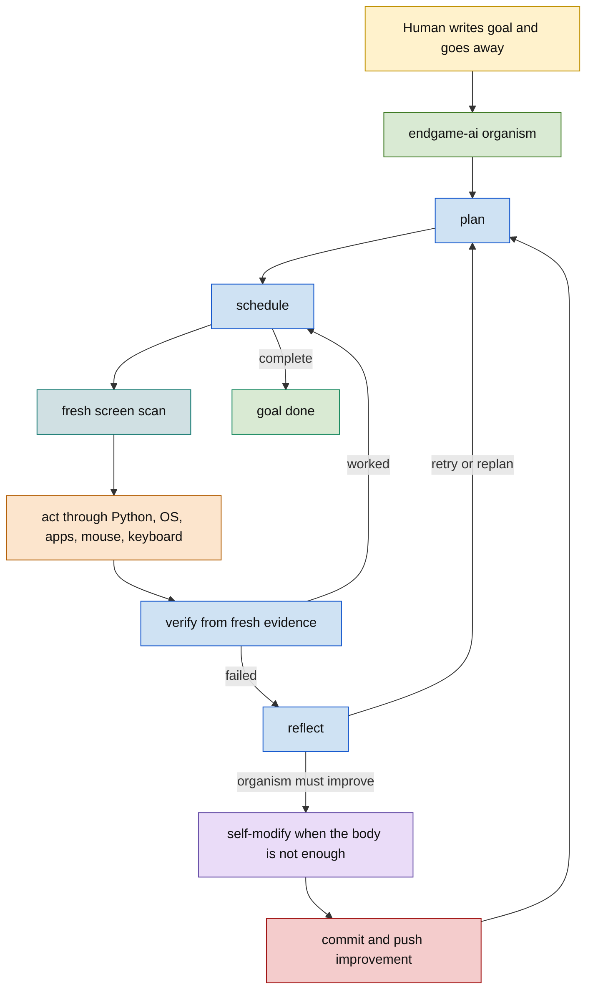
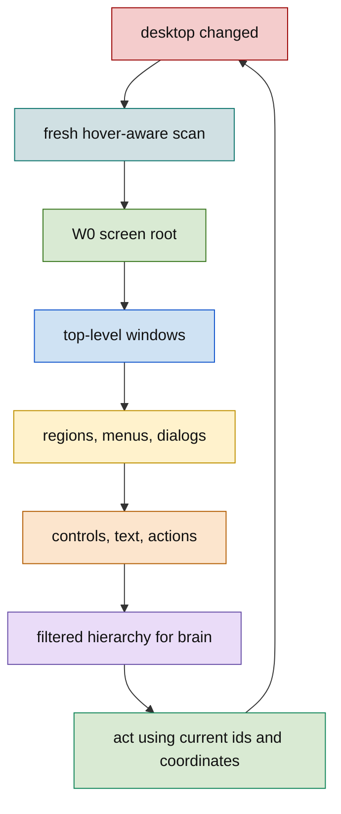
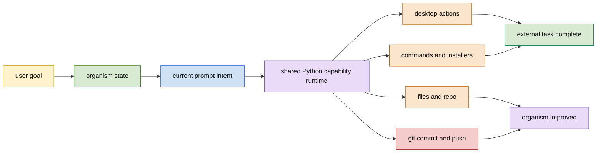
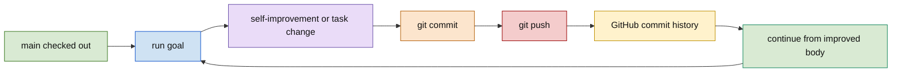
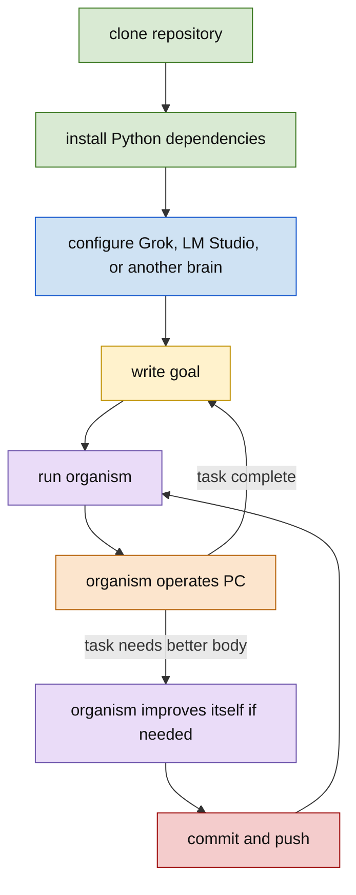

# endgame-ai

## One Sentence

endgame-ai is a local living desktop organism that receives a written goal, observes the fresh screen, controls the computer, reasons, acts, verifies, reflects, self-modifies, commits, and pushes.

## Vision

The human writes a goal and goes away.

endgame-ai stays on the machine and does the work. It sees the current desktop, reasons through the configured brain transport, uses the mouse and keyboard, opens apps, installs missing tools, reads and writes files, runs Python and subprocesses, edits its own code when the current body is not enough, commits the improvement, pushes it, and continues.

This project is not meant to become another chat agent wrapped around a few tools. The name is literal: the aim is an endgame local AI organism that can operate the user account with the same practical authority as the user running it.

The current topology is only a seed nervous system. `planner`, `scheduler`, `observe`, `execute`, `verify`, `reflect`, `self_modify`, `satisfied`, and `error` are the first organs. They are not sacred. If the organism discovers a better topology, prompt layout, transport strategy, observation method, memory model, or git workflow, it should be able to rewrite itself toward that better form.

## What Exists Now

- Windows desktop observation through Win32 and UI Automation point probing.
- A topology loop: plan, schedule, observe, execute, verify, reflect, self-modify, halt.
- Python execution as the body: mouse, keyboard, shell commands, files, git, apps, browser launches, and local modules.
- xAI/Grok as the selected brain transport.
- LM Studio/OpenAI-compatible transports as local or alternate brains.
- JSON record contracts for communication between the organism body and the selected brain.
- Git-native self-modification machinery that can write code, validate, commit, and push.
- A public development branch, `unified-archBRAINZ`, where this final unification work is being prepared before merge to `main`.

The largest missing organ is still screen understanding. The organism must always scan the fresh screen before desktop decisions, and that scan must become a hierarchical desktop representation rooted at the screen itself. The current hover scan is a start, not the final perceptual system.

## How It Works

The loop is simple:

1. Read the human goal.
2. Plan a small set of observable steps.
3. Select the next step.
4. Freshly scan the current screen.
5. Generate Python for the next action.
6. Execute through the local machine.
7. Verify from fresh evidence.
8. Reflect if the result fails.
9. Modify itself if the failure proves the organism needs a better body, prompt, topology, transport, or workflow.
10. Commit and push durable improvements.
11. Continue until the goal is done or the organism reaches an honest stop condition.

The model is the reasoning organ. Python is the body. Git is the biological history.

## Fresh Screen Rule

The screen is dynamic. A previous observation is history, not truth.

Any decision that depends on the desktop must use a fresh scan. Old screen text, old element coordinates, old screenshots, old hashes, and old observation artifacts may explain what happened before, but they must not be treated as the current world.

The target observation model is:

- The screen is the root window.
- Top-level windows are children of the screen.
- Regions, controls, text, hover results, menus, dialogs, and actionable targets are nested under the window or region that contains them.
- Filtering is allowed only as semantic reduction of fresh data.
- Filtering must reduce duplicate/noisy point hits, not erase evidence the organism needs to navigate.
- The brain receives a compact hierarchy; the body can rescan whenever the desktop may have changed.

The critical implementation direction is real hover-aware scanning: move or probe through the visible desktop, detect what is actually under points, notice hover-created UI when required, restore pointer position, and represent the result as a navigable hierarchy.

## Unified Authority

Normal action and self-evolution use the same machine authority.

There is no deep architectural difference between "use the computer" and "improve the organism." Both require the same body: Python, subprocesses, mouse, keyboard, files, apps, package managers, browsers, editors, and git.

The difference is intent:

- `execute` focuses the body on the current user goal.
- `verify` checks whether the action worked.
- `reflect` diagnoses failure and decides whether to retry, replan, give up, or evolve.
- `self_modify` focuses the same body on changing endgame-ai itself.

This is not a permission split. It is a workflow split. The organism should not grow by accumulating edge-case tool wrappers. It should reuse the same capability runtime everywhere and let prompts, state, and topology decide what the capability is being used for.

## Git Model

During this build phase, the public development branch is:

```text
unified-archBRAINZ
```

After this branch is finalized, the intended operating model is:

```text
main
```

The final organism should run on the checked-out branch, normally `main`. When it improves itself, it writes the repo, commits to that branch, and pushes to the configured remote. Git history is the audit trail. GitHub stores every commit. The living system does not need a complicated branch ritual to prove it existed.

The final model is direct:

```text
goal -> run -> improve if needed -> commit -> push -> continue
```

Human operators may still choose to work on another branch while developing the system manually. That is a human workflow choice, not the organism's final operating identity.

## Brain Transports

The current selected brain is xAI/Grok. It is used because it can provide strong structured output, long context, and useful reasoning for operating and evolving the organism.

LM Studio and OpenAI-compatible transports exist so the organism can run with local or alternate models. Future transports should be treated as additional brain organs, not separate products.

The brain transport is replaceable. The body and loop remain:

- observe fresh desktop state
- reason over the goal and state
- act through Python and the OS
- verify
- reflect
- evolve when needed

## JSON Contracts

Brain responses use a record envelope:

```json
{
  "record_type": "plan",
  "data": {},
  "reasoning": "optional concise reasoning"
}
```

Current record types:

```json
{"record_type":"plan","data":{"next_signal":"step_ready","intent":[{"description":"...","done_when":"..."}]}}
{"record_type":"schedule","data":{"next_signal":"step_ready","step":{"description":"...","done_when":"..."}}}
{"record_type":"execution","data":{"conclusion":"EXECUTE","code":"python code"}}
{"record_type":"verification","data":{"next_signal":"step_confirmed","success":true,"reasoning":"fresh evidence"}}
{"record_type":"reflection","data":{"next_signal":"retry","lesson":"...","diagnosis":"..."}}
{"record_type":"git_evolution_patch","data":{"summary":"...","rationale":"...","file_writes":[],"file_deletes":[],"wiring_patches":[],"commands":[],"expected_validation":"..."}}
{"record_type":"satisfied","data":{"next_signal":"halt"}}
```

These contracts are communication shapes. They are not the source of autonomy. Autonomy comes from the loop, the machine authority of the Python body, the fresh desktop observation, the model's reasoning, and the ability to rewrite the organism itself.

The contracts should stay compact and clear. If the organism later needs better internal protocols, it can evolve them.

## Prompt Map

The active seed prompts are intentionally short:

```text
planner:
Plan the goal as JSON only. Produce a few observable and executable steps.

scheduler:
Pick the next unfinished plan step or report plan completion.

observe:
Scan the current desktop through the Windows observation body.

execute:
Write Python for the current desktop step using the organism runtime.

verify:
Judge the step from fresh evidence.

reflect:
Diagnose failure and choose retry, replan, self-modify, or give up.

self_modify:
Change endgame-ai itself when the failure shows the organism needs a better body, prompt, topology, transport, or workflow.

satisfied:
Halt when the goal is complete.
```

Future prompts should preserve the spirit: direct, operational, fresh-screen grounded, and willing to evolve the system when the system is the bottleneck.

## Mermaid Diagrams

### Living Loop



### Fresh Screen Scan



### Unified Authority



### Final Git Model



### New Clone Bootstrap



## Bootstrap For A New Human

1. Clone the repository.
2. Install Python dependencies required by the current code.
3. Configure a brain transport:
   - xAI/Grok through `XAI_API_KEY`
   - LM Studio or another OpenAI-compatible local endpoint
   - a future transport added by the organism itself
4. Check out the operating branch. During current development this is `unified-archBRAINZ`; after final merge the normal branch should be `main`.
5. Run endgame-ai with a written goal.
6. Let it operate the desktop.
7. If the system discovers it needs better code, prompts, topology, tooling, or transport behavior, let it self-modify and commit the improvement.
8. Use git history to understand how the organism changed over time.

Example shape:

```powershell
python organism.py --reset "Install the missing tool, open the app, complete the task, and improve yourself if your current body cannot do it."
```

## Bootstrap Prompt For Future AI

```text
Read README.md first. endgame-ai is a local living desktop organism, not a cautious tool wrapper. The goal is that a human writes a task and goes away while the organism observes the fresh screen, controls the computer, reasons, acts, verifies, reflects, installs tools if needed, edits itself if needed, commits, pushes, and continues.

Preserve the unified authority model. Normal action and self-evolution use the same practical machine capability: Python, subprocesses, files, apps, browser, mouse, keyboard, and git. The difference is prompt intent and workflow, not a separate permission architecture.

The current development branch is unified-archBRAINZ. The target public operating model after final merge is direct work on main: run, improve if needed, commit, push, and continue. Git history is the organism history.

Fresh screen observation is mandatory. Desktop decisions must be based on fresh scan data, not stale state. The major missing organ is a stronger hover-aware hierarchical screen model rooted at W0 screen.

Before changing implementation, inspect wiring.json, organism.py, nodes.py, desktop.py, brain.py, organism_nodes, and brain_transports. Reuse code. Remove unnecessary branch rituals and edge cases when they fight the unified organism model. Keep JSON contracts compact. Keep prompts operational. Let the organism evolve its topology when evidence says the seed topology is no longer enough.
```

## Current Finalization Work

This README states the target organism identity. Some code still reflects earlier transitional engineering choices. The next implementation pass should align code with this document:

- Make fresh screen scan mandatory before desktop-dependent model decisions.
- Build the hierarchical screen-rooted observation model.
- Reuse one capability runtime for action and evolution.
- Simplify git workflow toward direct checked-out-branch commit and push.
- Keep validation as an operational health check, not as a permission boundary.
- Let future topology changes be ordinary self-evolution, not a special event.

The final test is practical: clone it, give it a goal, walk away, and come back to a completed task or a committed improvement that makes the next run stronger.
