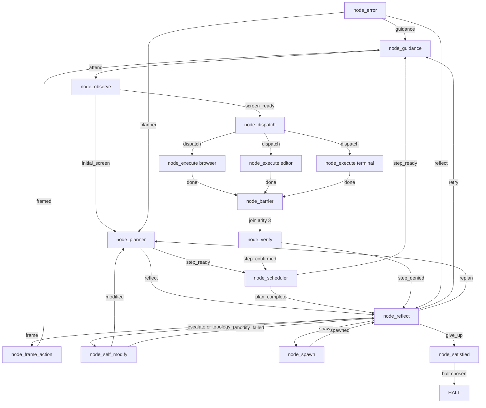

# endgame-ai

A task-agnostic organism that operates a Windows 11 desktop the way a person does: it sees the screen through UI Automation, moves the hands (clicks, types, runs Python and shell commands), and carries a goal-narrative that its nodes rewrite as it passes through. It is not a pipeline with a first step and a last step. It turns through its nodes on a wheel and stops only when it decides to — or when an operator's leash ends the run.

This README is written to be read by both humans and AI, in plain English. It separates **what has been proven to run** from **what is built but not yet exercised**, because both are facts and confusing them is how systems get misunderstood. Every quantitative claim below is grounded in the artifacts of the **2026-07-10 run** and cites its evidence inline. Where a nice story disagrees with the code and the logs, the code and the logs win.

## What it does, in one honest paragraph

You give it a goal in ordinary words. It observes the actual desktop, plans, wakes the faculties a step needs (browser, editor, terminal), acts with Python it writes on the spot, checks its own work on the evidence, reflects when blocked, and loops. There is no task-specific code inside it — the same 16 nodes are meant to handle any goal, because the behavior comes from the goal-narrative and the model, not from branches wired for a particular task. **This is the core design commitment: the system is task-agnostic. No task-specific fixes are ever added to it.**

### Why that matters

Most agent frameworks reach a real desktop only through a stack of glue: a browser-automation SDK, tool schemas, RAG, MCP servers, plugins, skill definitions. This one reaches the desktop with a handful of Python files and no such stack — no agent SDK, no RAG, no MCP, no skills, no tool registry (capabilities live in `wiring.json → capabilities` and `core_nodes.py`). The claim is that a very small, general substrate can drive a desktop without bespoke automation per task. That claim is **partially proven for liveness** and **not proven for task completion**. The 2026-07-10 run stayed alive for ~10 minutes but made almost no task progress; this README is blunt about why.

---

## The 2026-07-10 run: what the evidence actually shows

All numbers are re-derived from two logs and the final state on disk. Method: stream `runtime_events.jsonl` (the organism's own log, ~44 MB) and read `request-logs-2026-07-10.jsonl` (the xAI server's log = ground truth, 207 rows, reverse-chronological).

### Proven facts (cited)

- **207 brain calls.** Both logs agree: 207 `brain_request`/`brain_response` pairs in `runtime_events.jsonl`; 207 rows in `request-logs-2026-07-10.jsonl`.
- **Duration ≈ 598.3 s (~10 min).** First→last `brain_request` timestamps span 598.3 s. Server timestamps bracket it: earliest `2026-07-10T06:23:54.685991Z`, latest `2026-07-10T06:33:52.702106Z`.
- **Ended by the operator leash, not a crash.** `runtime_events.jsonl` ends with one `duration_expired` event; `runtime_stop.json` records `source: "duration"`, `reason: "duration_seconds expired after 600s"`. The run requested `duration_seconds = 600.0` (`organism_start` event). Final `runtime_state.json`: `tick 305`, `stop_reason "duration_seconds expired after 600s"`.
- **Event census** (`runtime_events.jsonl`, 1,098 events): `organism_start 1`, `node_start 341`, `node_complete 305`, `brain_request 207`, `brain_response 207`, `barrier_wait 36`, `duration_expired 1`.
- **Node visits** (by `node_start`): `node_reflect 79`, `node_planner 66`, `node_barrier 54`, `node_guidance 19`, `node_observe 19`, `node_dispatch 18`, `node_execute:browser 18`, `node_execute:editor 18`, `node_execute:terminal 18`, `node_verify 18`, `node_frame_action 8`, `node_scheduler 6`. **`node_self_modify 0`, `node_spawn 0`, `node_satisfied 0`, `node_error 0`.**
- **Model = `grok-4.3`** via `transport_xai` (server `meta.modelName`; `wiring.json → model.transport_config.transport_xai.model`).
- **Cost = $0.1795** for the whole run. Summed `response.usage` over all 207 server rows: prompt 1,736,111 tokens, completion 35,060 tokens, cached 441,088 tokens, `Σ costInUsdTicks ÷ 1e11 = $0.1795`.
- **Prompt cache hit = 25.4% run-wide** (441,088 cached ÷ 1,736,111 prompt tokens). A single late call can be higher — the last call (server line 1 ⇔ our seq 207) was 19,047 prompt / 8,704 cached (46%) / 186 completion — but the run-wide figure is 25.4%.
- **Cross-log spot-trace passes** (server is reverse-chronological, so line 207 = earliest = our seq 1):
  - seq 1 ⇔ server line 207: `06:23:54Z`, prompt 2,298 tok, completion 265. Our log: system 5,160 + user 3,773 chars.
  - seq 104 ⇔ server line 104: `06:29:13Z`, prompt 6,431 tok, completion 185. Our log user grew to 20,311 chars.
  - seq 207 ⇔ server line 1: `06:33:52Z`, prompt 19,047 tok, completion 186. **Both logs agree exactly**: system 40,854 chars + user 43,095 chars. Same call, proven from two independent sources.

### The behavior this run actually exhibited: a replan loop, root-caused to empty executions

This is the most important finding, and it corrects the optimistic tone of earlier write-ups. The causal chain, proven from the `node_complete` signals and the execute records:

1. **The faculties mostly did nothing.** Across the 54 `node_execute` calls (18 each for browser/editor/terminal), **48 emitted empty `code`**. Only **6 executions ran real code** (conclusion `EXECUTE`); the rest concluded blank (36), `FRAME` (10, "wrong screen"), or `CANNOT` (2). The 6 real actions were: launch Chrome (`subprocess.Popen(['start','chrome'])`, tick 45), `open_url('chrome','https://www.linkedin.com')` (tick 63), and four `click_node(...)` calls (ticks 32, 53, 84, 94). That is **6 real desktop actions across 305 ticks.**
2. **So verify had almost nothing to confirm.** `node_verify` fired 18 times and returned **`step_denied` all 18 times.** It confirmed nothing this run.
3. **So reflect kept replanning.** `node_reflect` (79 visits) routed `replan` **66 times**, `frame` 8, `retry` 5.
4. **So the plan barely advanced.** `node_scheduler` emitted `step_ready` only **6 times.** `node_guidance` entered the wheel 19 times (~19 laps).

Liveness held — 10 minutes, no crash, 12 distinct node types exercised, faculties fanned out and the barrier joined them 36 times. But **task progress did not.** Calling this a "healthy turning wheel" would be false. It is a live wheel stuck in an execute-empty → verify-denies → replan cycle. The right first question for the next run is *why the execute faculties emitted no code 48 out of 54 times.*

### The goal-narrative: append-within-a-plan, reset by the planner — NOT monotonic

Earlier notes claimed `effective_goal` "grew monotonically and was never truncated." **The code and the log both contradict this.**

- `node_planner.patch_from_record` (`node_planner.py`) **overwrites** `effective_goal` with a freshly built short string: `"{original goal}\n\n[PLANNER REWRITE] Current plan focuses on: …"`. It does not append.
- `node_reflect.patch_from_record` (`node_reflect.py`) **does** append (`state["effective_goal"] + "\n\n[REFLECT] …"`).
- In the log, `effective_goal` length was reset back to ~2,000 chars by `node_planner` at ticks **27, 38, 69, 128, 158** (verified by comparing `state.effective_goal` lengths across consecutive `node_complete` events). After each reset the content is the **original user goal verbatim** plus a one-line plan tag — the accumulated `[REFLECT]` history is discarded.

Truthful statement: **the original user goal is preserved verbatim across every replan (never lost), but the accumulated narrative is discarded each time the planner re-authors the plan.** The final `effective_goal` of **37,022 chars** is the growth of the *last* segment after the final replan at tick 158 — not a lifetime total and not evidence of "never truncated." The commandment "the narrative is never truncated" is **not honored by the current planner code.** This is either a bug or an undocumented design change; it belongs on Next steps, not in the proven column.

### Why our log (~44 MB) is ~5.7× the server log (~7.8 MB) for identical 207 calls

Traced at the code level. It is **not** the brain calls. Byte breakdown of `runtime_events.jsonl`:

| event | count | share of bytes |
|---|---|---|
| `node_start` | 341 | 36.1% |
| `node_complete` | 305 | 34.8% |
| `brain_request` | 207 | 27.2% |
| `brain_response` | 207 | 1.9% |
| other | 38 | ~0% |

Two causes:

1. **Per-node state snapshots dominate (~71%).** `core_organism.run` logs a `node_start` and a `node_complete` on every tick (646 events), each carrying `state=bus.state_brief(st)`. `bus.state_brief` (`core_bus.py`) **embeds the full `effective_goal` and `root_goal`** every time, and each `node_complete` also carries a `bus_frame` record that includes observation/desktop-tree payloads (up to ~119 KB on late frames). So the growing narrative and the desktop tree are re-serialized on nearly every node event.
2. **The brain-request user message is stored twice.** `core_brain.summarize_messages_for_log` writes both the raw `content` (≈4.58 MB total) **and** a parsed `dynamic_payload` copy of the same user message (≈4.50 MB total).

The xAI server stores each request/response once, with no per-node state snapshots — hence the ~5.7× ratio.

### Corrections to earlier documentation (do not re-inherit these)

- **STALE:** the prior README body described the **2026-07-09** run (12 laps, 59 ticks, ~111 s, 23 calls, ~$1.27, narrative to 11,437 chars). Superseded here.
- **CONTRADICTED:** "narrative grew monotonically, never truncated" — the planner resets it (5× this run).
- **CONTRADICTED:** "it does real desktop work / verify confirms when justified" — this run: 6 real actions in 54 execute calls; verify confirmed 0/18.
- **STALE / already done:** prior "Next steps → harden the state-save (WinError 5 on `os.replace`)" is **implemented.** `core_wiring.replace_with_retry` (6 attempts, exponential backoff) is called by `atomic_write_json`, committed as `3fc862a`.
- **Nuance:** "24% cache hits" was a 2026-07-09 figure; 2026-07-10 run-wide is **25.4%.** Note `wiring.model.stable_prefix.enabled = false` this run, so the source-tree "stable prefix" was **not** sent in requests; the cache benefit came from the shared system prefix.

---

## The wheel (this is the live topology)

`wiring.json` is the wheel. It is entered at `node_guidance` — that is where an already-turning wheel is picked up each lap, not a "start." Every path is meant to return to the wheel; nothing should dead-end (`core_organism` raises `TopologyContractError` if the frontier drains). `node_dispatch` fans out to all three faculty instances; the chosen ones work, the unchosen pass through; all three converge on `node_barrier` (arity 3). The only way to `halt` is a deliberate choice through `node_reflect → give_up → node_satisfied`.

Verified from `wiring.json`: `topology.cycle_start = node_guidance`; **16 nodes**; `topology.barriers = {"node_barrier": 3}`; **9 record contracts**; `self_modify.known_good_ref = refs/endgame/known_good`.



### What each node actually did in the 2026-07-10 run (observed, not intended)

- **node_guidance** — 19 visits (`attend` ×19). No `guidance.txt` existed on disk, so it folded no external steering this run.
- **node_observe** — 19 visits; scanned the desktop via UIA for the planner and faculties.
- **node_planner** — 66 visits; on each (re)plan it **overwrote** `effective_goal` with the original goal + a plan summary (see the narrative finding).
- **node_scheduler** — 6 `step_ready`; the plan advanced only six times.
- **node_dispatch** — 18 visits; fanned out to the faculties.
- **node_execute (browser/editor/terminal)** — 18 visits each; all returned `done`. But only **6 of 54** ran real code (Chrome launch, LinkedIn navigation, 4 clicks); 48 were empty/`FRAME`/`CANNOT`.
- **node_barrier** — 54 visits, 36 `barrier_wait` events; gathered the three faculties (arity 3).
- **node_verify** — 18 visits, **all 18 `step_denied`.**
- **node_reflect** — 79 visits: `replan` ×66, `frame` ×8, `retry` ×5.
- **node_frame_action** — 8 visits.

Nodes wired and prompted but **not exercised** (0 visits, proven): **node_self_modify, node_spawn, node_satisfied, node_error.** The organism never self-modified, spawned a child, chose to rest, or hit the error node.

---

## Steering: guidance, not command

The only external steering surface is `guidance.txt`. At the top of each lap, `node_guidance` reads it, folds it into the narrative as a strong, clearly-tagged, ignorable signal, and consumes the file. **In the 2026-07-10 run no `guidance.txt` was present**, so this surface changed nothing this run — built, not yet demonstrated bending a live run.

The one genuinely external control is the operator's leash: `--duration-seconds`, a stop file, and pause/step (`core_state.wait_before_node`, `core_stop_check`). This run used `duration_seconds = 600` and the leash is what ended it. Run with `duration_seconds=None` for no time bound.

---

## Self-modification and recursion (built, NOT exercised — proven by 0 visits)

`node_reflect` can route to `node_self_modify` (git-backed patch, gated by `core_wiring.validate_wiring` + `check_topology.coherence_problems`, protected by a known-good ref `refs/endgame/known_good` and a hot-swap guard — see `core_organism.run` self-modify branch and `node_self_modify.py`). `node_spawn` can raise a child organism (`cap_spawn`, depth-gated via `fractal.max_recursion_depth`).

**Neither was triggered in the 2026-07-10 run** (`node_self_modify` 0, `node_spawn` 0). A proven negative: across 305 ticks and 79 reflects, the organism never chose to evolve or spawn — notable given it was stuck in a replan loop.

---

## Prompts: cache-aware, plain-contract, no examples

Each node's prompt is `wiring.shared_prompt_prefix` (one creed shared by all nodes) plus the node's own fragment in `wiring.prompts`; `wiring.prompt_aliases` lets the `node_execute:*` instances reuse the base execute prompt (`core_wiring.prompt` / `prompt_name`). The dynamic payload (goal-narrative, step, observation, evidence) is serialized into the user role and delivered last (`core_brain.think`). The static system content is cacheable across turns; only the dynamic tail changes — this run saw a 25.4% run-wide prompt-cache hit.

The record contract for each node — record type, required fields, allowed enum values — lives in `wiring.record_contracts` (9 contracts) and is read by `core_brain` both to validate every record (`_validate_record_contract`) and to build the structured-output JSON schema (`_record_response_format`). There are no few-shot examples; the schema is the instruction. Server rows confirm `responseFormat: FORMAT_TYPE_JSON_SCHEMA` and per-organ `reasoningEffort`.

Note this run: `wiring.model.stable_prefix.enabled = false` and `include_in_request = false`, so the source-tree "stable prefix" (assembled in `core_brain.StablePrefix`) was **not** part of the request messages.

---

## Architecture

### Substrate (the small, stable core)

| Module | Role |
|---|---|
| `core_organism.py` | Turns the wheel: load a node, call it, validate its signal against the topology edge, apply the patch, route to the next node(s). Imposes no ending. Logs `node_start`/`node_complete` each tick. |
| `core_loader.py` | Dynamic, file-based plugin loading (`load(kind, name, w)`). No registry. Splits `node_execute:browser` into base + instance. |
| `core_node_base.py` | The abstract base, `BaseNode` (think → build_payload → signal → patch). |
| `core_bus.py` | Records, signals, `emit`, `validate_signal`, `state_brief`, `observation_brief`, failure-streak. |
| `core_brain.py` | The LLM call: message assembly, record-contract validation, structured-output schema, prompt-cache key, and all runtime-event logging. |
| `core_wiring.py` | Loads and validates `wiring.json`; `root_path`; atomic state I/O with `replace_with_retry` (WinError-5 hardening); transport config. |
| `core_state.py` | State persistence, tick, and the operator leash (`wait_before_node`, `duration_expired`). |
| `core_stop_check.py` | The stop file / pid — part of the operator leash. |
| `check_topology.py` | The coherence gate: reachability from `cycle_start`, no dangling targets, barrier join/arity, contracts coherent. Used by CLI and the runtime self-modify gate. |
| `core_nodes.py`, `core_desktop.py`, `core_observation.py` | Capability runtime plus the UIA eyes and hands. Windows-only (import `comtypes`). |
| `cap_spawn.py` | The child-organism capability invoked by `node_spawn`. |
| `transport_xai.py` | The real transport (xAI HTTP), used on the Windows host this run. |
| `transport_file_proxy.py` | Off-host debug transport: writes the request to disk; an operator answers as the model. |

### Observation system (UIA)

`core_observation.py` runs a three-phase pipeline — **RAW grid probe → FILTER → MAP** — driven by `wiring.observe_config`. It renders a compact, LLM-readable desktop tree plus an `action_index` of clickable node ids; the hands act by referencing those ids (e.g. `click_node('W2E2')`). Windows-only via `comtypes`.

```
W0 Screen Desktop
  W1 Windows PowerShell
    W1E1 Button ... [click]
  W2 Chrome - linkedin.com
    W2E1 Edit Search [write]
    W2E2 Button Me [click]
```

### The nodes

Mechanical (no model call): `node_observe`, `node_barrier`, `node_satisfied`, `node_error`.
LLM (strict record): `node_guidance` (`guidance`), `node_planner` (`plan`), `node_scheduler` (`schedule`), `node_dispatch` (`dispatch`), `node_execute` faculties (`execution`), `node_verify` (`verification`), `node_frame_action` (`action_frame`), `node_reflect` (`reflection`), `node_self_modify` (`git_evolution_patch`). `node_spawn` runs the `cap_spawn` capability.

### The bus law

Every node emits `(signal, patch)`. The bus validates that the signal is a legal edge out of that exact node instance (`core_bus.validate_signal`), applies the patch to state, increments the tick, and routes to the next node(s). A fan-out edge is a list; a fan-in barrier waits until its arity is met.

---

## Forensics tooling

`export_brain_forensics.py` (staged on branch `run-begin-20260710`) splits both logs into paired per-call markdown: `forensics_runtime_events/` (52 files, by seq ascending) and `forensics_request_logs/` (52 files). Verified: 52 files in each directory. This is the recommended way to read individual calls without loading the 44 MB event log.

Do **not** load `runtime_events.jsonl` in full. Stream it with Python or `jq`, filter by `event` and `seq`.

---

## Running it

Windows 11 only (the eyes and hands need real UI Automation). From the repo root on the host:

```bash
# Bounded development run (operator leash), fresh state
python core_organism.py "your goal in plain words" --reset --duration-seconds 120

# Resume where it left off (no --reset)
python core_organism.py "your goal" --duration-seconds 300
```

CLI flags (`core_organism.main`): `goal` (positional), `--reset`, `--duration-seconds` (default 120), `--brain-call-budget`, `--start-node`, `--wiring`. Configure the model in `wiring.json → model`. Steer with `guidance.txt`. Watch it think in `runtime_events.jsonl`.

### Reading a run

Evaluate liveness **and** progress — this run proves you must check both. Good signs: the wheel keeps turning through varied nodes; faculties fan out and the barrier gathers them. **Warning signs actually seen this run:** execute faculties emitting empty code (48/54), `node_verify` denying every step (18/18 `step_denied`), `node_reflect` choosing `replan` almost every time (66/79), `node_scheduler` advancing only 6 times. That combination is a replan loop: alive but not progressing.

### Developing off-host (WSL / Linux)

The acting nodes (`node_execute`, `node_observe`, `core_desktop`, `core_nodes`) cannot import off Windows (`comtypes`). Everything else is pure Python. The gates run anywhere:

```bash
python3 -m py_compile *.py
python3 -c "import core_organism, core_bus, core_wiring, core_state, check_topology"
python3 check_topology.py    # exit 0 = coherent wheel
```

Push from WSL via the Windows host git (uses the Windows credential store):

```bash
git.exe -C 'C:\Users\ewojgab\Downloads\endgame-ai' push origin <branch>
```

---

## The rules this system depends on (read before changing anything)

These are not style preferences. A change that violates them is wrong even if it appears to work.

1. **Task-agnostic, always.** Never add task-specific handling. If a fix only helps one kind of task, it does not belong in the system — improve the prompt, the contract, or a capability instead.
2. **System = nodes + wiring, everything hot-swappable.**
3. **No branching, fallbacks, defensive coding, or ceremony. Fail hard and loud.** A missing key is a bug to fix at its source, not a defaulted `.get`. Requirements live in `wiring.record_contracts`, not Python mirrors.
4. **Plugins are dynamic and file-based** — no compile-time registry. The organism must be able to write a new `node_*.py` at runtime and load it with zero core change.
5. **Keep the load-bearing organs alive:** hot-swap, self-modify, and the coherence gate.
6. **When the graph changes, change the prompts and record contracts with it.**
7. **The narrative is never truncated.** — *Currently NOT honored:* `node_planner` overwrites `effective_goal` on every replan (proven, 2026-07-10). This rule and the code disagree; reconcile them (see Next steps).
8. **A failure is information for the narrative, not a branch to add.**
9. **This README is the single living handover.** Update it after every change. Verify, then commit, one coherent step at a time.

---

## Next steps (grounded in this run's evidence)

- **Root-cause the empty executions.** The dominant provable problem: 48 of 54 `node_execute` calls emitted no `code`, which starved verify (0/18 confirmed) and drove the replan loop (66 replans, 6 scheduler advances). Find out why the execute faculties returned blank/`FRAME`/`CANNOT` instead of code — prompt, contract, observation quality, or dispatch selecting faculties that had nothing to do. Highest-value work.
- **Reconcile the narrative rule with the planner.** Either honor rule #7 (make the planner append rather than overwrite `effective_goal`) or amend the rule to state the intended reset-on-replan behavior. Right now the code silently contradicts the stated commandment.
- **First self-chosen self-modification and spawn.** Both built, both at 0 visits across two runs. Watch for reflect ever escalating on its own — especially telling given this run's loop.
- **Event-log slimming / rotation.** `runtime_events.jsonl` reached ~44 MB in ~10 min, ~71% of it per-node `state_brief` snapshots (which embed the full narrative every tick) plus duplicated brain-request payloads (raw `content` + parsed `dynamic_payload`). Consider not embedding the full `effective_goal` in every `node_start`/`node_complete`, and logging the user message once.

*Already done (do not re-list as pending):* WinError-5 hardening on `os.replace` — implemented in `core_wiring.replace_with_retry`, committed `3fc862a`.

---

## History

- **Substrate B1–B5** — list edges, frontier fan-out scheduler, `node_barrier` fan-in, `cap_spawn` recursive child organism, the topology-coherence gate.
- **F1** — removed the endings the substrate imposed. Stopping became the organism's own choice (or the operator leash).
- **F2** — goal-file steering via `node_guidance` + `guidance.txt`.
- **F3** — the fractal wheel: `node_dispatch` fans out to `node_execute` instances; `node_barrier` gathers; `node_spawn` recurses; `node_error` re-enters the wheel.
- **Refactor (commit `9dd05dd`)** — record contracts, capabilities, and one shared creed-prefix consolidated into `wiring.json`; defensive `.get()` removed; coherence gate extended to contracts and arity.
- **`3fc862a`** — bounded retry on `os.replace` to survive transient Windows file locks (WinError 5).
- **Run 2026-07-09** — earlier milestone run (superseded numbers).
- **Run 2026-07-10** — 207 brain calls, 305 ticks, ~598 s, ended by the 600 s operator leash. Liveness held; **task progress did not**: only 6 of 54 executions ran real code, verify denied every step (0/18), reflect looped on replan (66), scheduler advanced six times; self-modify/spawn/satisfied/error never reached. Cost $0.1795, run-wide cache hit 25.4%. Documented above with inline evidence.

---

## Safety

This is autonomous software that operates a real PC after the user grants permission. Coherence and replay integrity are not a safety certification. Require explicit consent, keep the operator leash during validation, audit `runtime_events.jsonl`, and control what the logged-in account can reach. Keep safety at the environment and the permissions — never as task branches inside the wheel.
