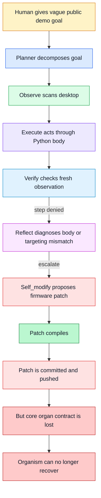
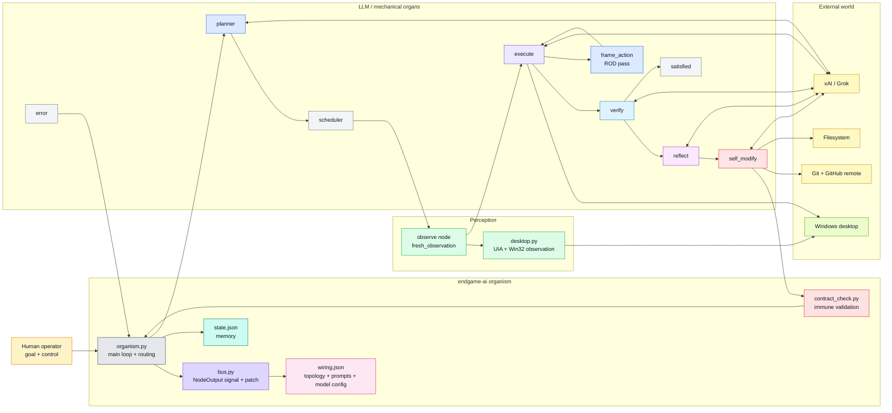
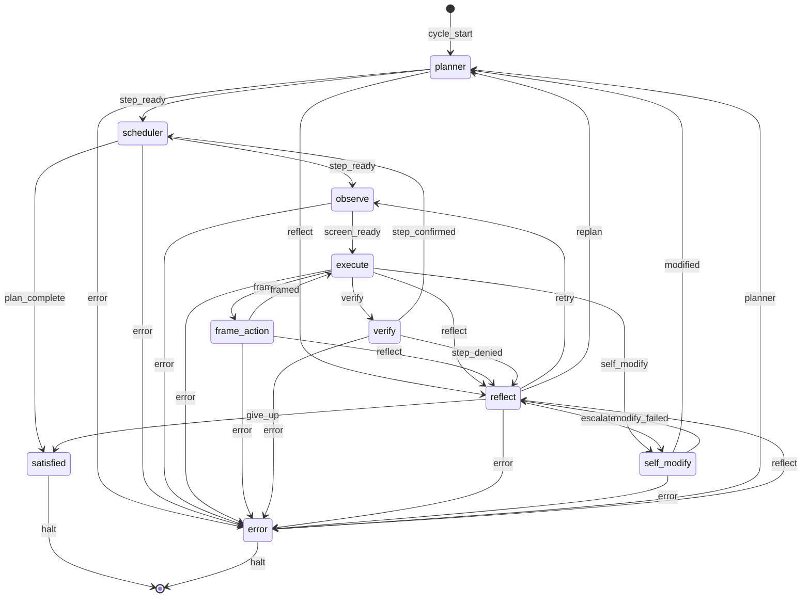
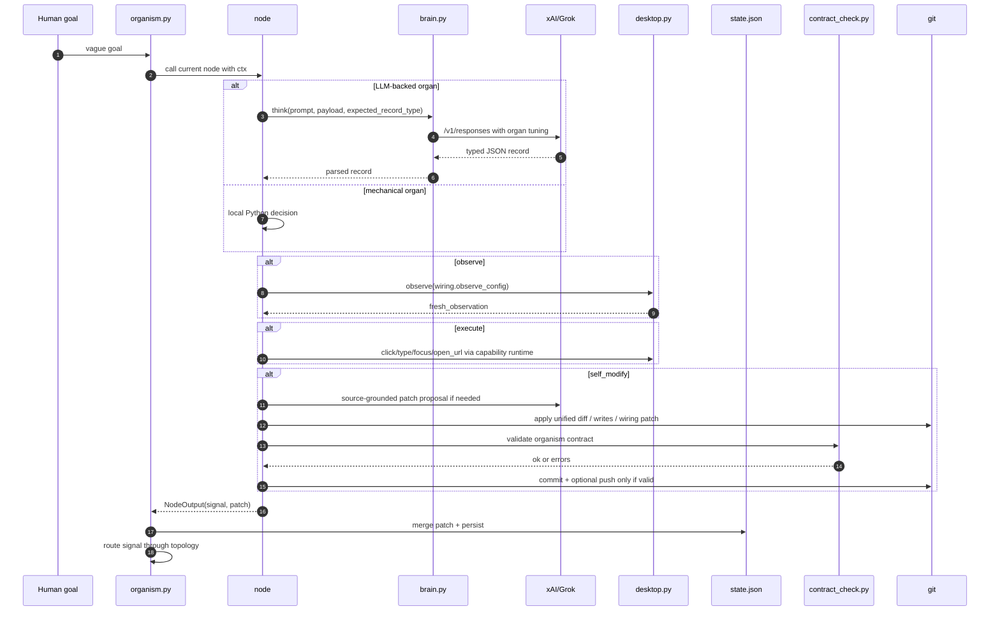
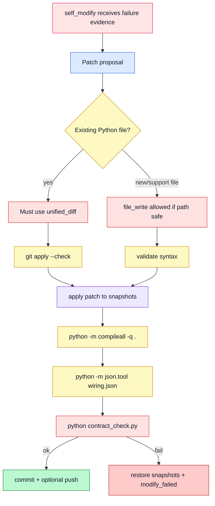

# endgame-ai

> **A local computer-control organism that sees the desktop, acts through Python, verifies reality, reflects on failure, and can evolve its own source through git.**

endgame-ai is not a chatbot and not a marketing wrapper around a prompt. It is a small living runtime made from simple parts: a Python body, LLM organs, a JSON bus, a topology, desktop sensors, desktop actuators, git firmware memory, and now an immune system.

The important fact is no longer theoretical.

On **2026-07-03**, endgame-ai ran a long real desktop scenario. It planned, observed, executed, verified, reflected, escalated to self-modification, generated git-native patches, applied them, committed them, pushed them to the remote repository, and continued running. The run eventually failed, but the failure was data: the organism became alive enough to need an immune system.

This README describes the system after the **organism bus**, **ROD/framing pass**, **Grok source access**, **per-organ tuning**, and **self-modification immune system** patches are applied.

No API keys, private tokens, request credentials, or personal secrets belong in this README.

---

## Current thesis

endgame-ai is a local AI organism for doing real work on a real computer.

The project is built on this thesis:

```text
The model is not the agent.
The loop is not the agent.
The prompt is not the agent.
The organism is the agent.

Python owns the body.
The desktop is the world.
The LLM is a stateless organ.
wiring.json is the nervous system.
JSON records are the bus.
State is memory.
Observation is perception.
Execution is muscle.
Verification is reality comparison.
Reflection is diagnosis.
Self-modification is firmware evolution.
contract_check.py is the immune system.
```

The system should remain stupid simple. Intelligence should emerge from circulation, not from framework bloat.

---

## Reality status

### Proven in real runs

The following is no longer a hoped-for future behavior. These capabilities have happened in actual runs:

| Capability | Status | What this means |
|---|---:|---|
| Desktop observation | Working | The organism can scan the real Windows desktop and produce a semantic tree. |
| Desktop action | Working | The organism can generate Python snippets that use keyboard, mouse, subprocess, URLs, and UI targets. |
| Multi-step work | Working | The organism has opened applications, typed content, navigated browser pages, and continued across ticks. |
| Verification loop | Working | The organism can reject false success when screen evidence does not satisfy `done_when`. |
| Reflection loop | Working | The organism can classify failures as retry, replan, escalate, or give up. |
| Self-modification trigger | Working | The organism has escalated from runtime failure into `self_modify`. |
| Git evolution | Working | The organism has generated repository changes, applied them, committed them, and pushed them. |
| Failure as data | Working | A long failed run produced exact evidence for the next hardening layer. |

### The July 3 lesson

The July 3 run proved the vision and exposed the missing organ.

The organism did not fail because the bus idea was wrong. It failed because self-modification had more power than immunity.

The original failure chain looked like this:



The fatal boundary was this:

```text
Python compiled, but the organism contract was dead.
```

A small replacement file can compile while amputating `desktop.observe`, `Desktop`, node `run(ctx)` entrypoints, `DATASHEET` declarations, or topology edges. That is why the next layer is not more prompting. The next layer is immune validation.

---

## What changed after the failure

The hardening patch changes the meaning of self-evolution.

Before:

```text
A self-modify patch is acceptable if Python compiles and JSON parses.
```

Now:

```text
A self-modify patch is acceptable only if the organism still has a body, organs, bus, topology, source access, and bootable contracts.
```

### New immune-system rules

| Rule | Purpose |
|---|---|
| `contract_check.py` must pass | Static organism heartbeat after every firmware change. |
| Protected existing Python organs must use unified diffs | Prevents replacing real organs with compiling stubs. |
| Full-file writes to protected source are rejected | New files are allowed; core organ replacement is not automatic. |
| Every touched existing file must appear in `read_files` | No blind patching. |
| New `wiring.json` paths are schema-limited | Prevents placebo config keys that code does not consume. |
| Self-modify may browse GitHub raw source | Grok can inspect source through configured domains. |
| Local repo remains authoritative | Remote source is advisory; local validation decides. |
| Failed validation restores snapshots | Bad firmware surgery rolls back before commit/push. |
| Per-organ model tuning | Each organ receives reasoning/output budget appropriate to its job. |

The result is not less autonomy. It is safer autonomy.

---

## Architecture overview



---

## Topology

The topology is a state machine. Every node emits exactly one signal. `wiring.json` decides where that signal goes.



Generate the live diagram from the checked-out code:

```bash
python export_topology.py > topology.mmd
```

---

## The bus contract

Every node is a chip on the bus.

The Python contract is:

```python
return bus.emit(signal, patch, record=record, evidence=evidence)
```

or, for legacy nodes:

```python
return signal, patch
```

`nodes.call_node()` coerces the result into a `NodeOutput`, validates the emitted signal against topology, adds trace metadata, and returns the old `(signal, patch)` shape to the loop.

### Bus packet

```text
NodeOutput
├── signal      # control line routed by wiring.json
├── patch       # state delta merged into state.json
├── record      # optional LLM JSON record
└── evidence    # optional local debug evidence
```

### LLM record contract

Every LLM-backed organ returns:

```json
{
  "record_type": "verification",
  "data": {
    "next_signal": "step_confirmed",
    "success": true,
    "reasoning": "Visible evidence satisfies done_when."
  },
  "reasoning": "Short source-grounded explanation for logs."
}
```

The outer envelope is universal. The inner `data` payload is organ-specific.

---

## Node datasheets

Every node should declare a datasheet.

Example:

```python
DATASHEET = bus.datasheet(
    "verify",
    kind="llm_reality_comparator",
    inputs=["goal", "current_step", "last_action", "last_result", "fresh_observation"],
    signals=["step_confirmed", "step_denied", "error"],
    writes=["verification", "last_verification", "step"],
    record_type="verification",
)
```

A datasheet is the IC label for the node. It tells humans, Grok, future tools, and `contract_check.py` what the chip is supposed to receive, emit, and preserve.

---

## Organ responsibilities

| Organ | Kind | Primary job | Must not do |
|---|---|---|---|
| `planner` | LLM | Decompose vague human goal into observable steps. | Do desktop action. |
| `scheduler` | mechanical | Select current plan step. | Think or change goal meaning. |
| `observe` | mechanical sensor | Capture fresh desktop truth. | Reuse stale screen state. |
| `execute` | LLM code actuator | Generate local Python action code. | Verify success by itself. |
| `frame_action` | LLM ROD pass | Compress messy evidence into a clearer action frame. | Act on the desktop. |
| `verify` | LLM comparator | Judge `done_when` using fresh evidence. | Plan or excuse failures. |
| `reflect` | LLM diagnostic router | Choose retry, replan, escalate, or give_up. | Patch code directly. |
| `self_modify` | LLM firmware advisor + local applier | Produce source-grounded evolution patch. | Bypass local validation. |
| `satisfied` | mechanical | Halt only on completion or honest give-up. | Fake success. |
| `error` | mechanical | Recover from exceptions and topology/runtime errors. | Treat ordinary task failure as exception. |

---

## Single tick anatomy



---

## ROD / framing pass

ROD is the mechanism discovered in local-model experiments: one call frames the world, the next call acts smarter.

The pattern is:

```text
raw observation + failure -> frame_action -> compact action frame -> execute
```

The ROD pass should be used when:

- the screen is visually or semantically noisy;
- execute returns `FRAME` or `CANNOT`;
- repeated failure suggests the action needs a better target or strategy;
- the body can act, but the model lacks a clean local interpretation.

It should not replace normal execution. Most easy actions should still be:

```text
observe -> execute -> verify
```

Hard actions may become:

```text
observe -> execute -> frame_action -> execute -> verify
```

This is how small models can behave larger and how strong models can waste fewer calls.

---

## Self-modification

Self-modification is firmware surgery.

It is not normal task execution. It should happen when the organism has evidence that its own code, wiring, prompt, observation, transport, or body contract is preventing future progress.

### When to escalate

`reflect` should emit `escalate` when evidence points to a system failure, such as:

- repeated identical failure signatures;
- prompt/code contract mismatch;
- node emits invalid signal;
- body helper reports success but fresh observation contradicts it;
- observation is missing necessary reality;
- model receives insufficient source context to repair a known bug;
- transport sends malformed output or wrong schema;
- the same failure cannot be solved by retry or replan.

### When not to escalate

Do not call self-modify for ordinary task friction:

- page slow to load;
- login prompt;
- cookie banner;
- wrong click once;
- temporary focus issue that a retry can fix;
- user goal too broad but replanning can help.

Self-modify is surgery, not muscle memory.

---

## Immune system

The immune system exists because the July 3 run proved that self-modification can be both real and dangerous.



### `contract_check.py` validates

- required files exist and are not suspiciously tiny;
- `desktop.py` still exposes the expected body surface;
- topology nodes still have `run(ctx)`;
- topology nodes still have `DATASHEET`;
- edges target known nodes or `halt`;
- per-organ model settings exist and are sane;
- self-modify source access allows GitHub raw source but not an uncontrolled web surface.

This is not a replacement for runtime tests. It is the minimum heartbeat before a firmware commit.

Run it manually:

```bash
python contract_check.py
```

Expected:

```json
{
  "ok": true,
  "error_count": 0,
  "errors": []
}
```

---

## Grok source access

Grok may assist self-modification by browsing public repository source, but only through a narrow source-access cage.

Allowed domains:

```text
github.com
raw.githubusercontent.com
api.github.com
```

Remote browsing is advisory. The checked-out local repository is authoritative.

This means:

```text
Grok may inspect.
Grok may propose.
Grok may reason.
Grok may draft a diff.
But local Python applies, validates, rejects, commits, and pushes.
```

The patch is an intent to evolve. The immune system decides whether the organism accepts it.

---

## Model organ tuning

One global temperature is not enough. Different organs need different behavior.

| Record type | Reasoning | Temperature | Output budget | Why |
|---|---:|---:|---:|---|
| `plan` | medium | moderate | medium | Needs coherent decomposition without overthinking. |
| `action_frame` | medium | moderate | medium | Needs interpretation and strategy. |
| `execution` | low | low | large | Needs precise Python, sometimes non-trivial code. |
| `verification` | none | very low | small | Should be a deterministic comparator. |
| `reflection` | medium | low | medium | Needs diagnosis, not poetry. |
| `git_evolution_patch` | high | low | very large | Needs source reasoning and complete diffs. |
| `satisfied` | none | very low | small | Should halt honestly, not narrate. |

The prompts share one identity:

```text
You are a specialized, stateless organ inside endgame-ai, a local computer-control organism.
Python is the body, the desktop is the world, wiring.json is the nervous system,
JSON records are the bus, and git is firmware memory.
```

This identity is not roleplay. It is a contract reminder.

---

## Prompt and response philosophy

The system should not artificially force tiny answers when the task requires source-grounded reasoning.

Small organs should stay small:

- `verify` should be short and strict;
- `satisfied` should be short and honest;
- simple `execute` actions should be concise.

Large organs need room:

- `self_modify` must have enough output budget for complete unified diffs;
- `reflect` must have enough space to diagnose patterns;
- `frame_action` must explain the action strategy compactly but usefully.

The rule is:

```text
Short where mechanical.
Long where architectural.
Machine-readable always.
```

---

## Data stores

| Store | Path | Committed? | Purpose |
|---|---|---:|---|
| Topology/config | `wiring.json` | yes | Model config, prompts, edges, limits. |
| Source | `*.py` | yes | Body, organs, bus, immune system. |
| State | `state.json` | no | Current run memory. |
| Control | `comms/control.json` | no | Pause/step/run control. |
| Runtime log | `comms/runtime.ndjson` | no | Append-only audit trail. |
| Observations | `comms/observations/*.json` | no | Per-scan desktop evidence. |
| Request logs | `request-logs-*.jsonl` | no | Debug payloads; may contain sensitive metadata. |
| Topology render | `topology.mmd` | optional/no | Generated diagram. |

Runtime artifacts should be exported deliberately and sanitized before sharing.

---

## Security and privacy

Do not commit:

- API keys;
- `.env` files;
- OAuth/session tokens;
- browser cookies;
- private request logs;
- screenshots or observations containing secrets;
- raw social-media composer text if private;
- private filesystem paths unless intentionally shared.

`include_secrets: False` should be the default posture for exports.

The organism can control a real desktop. That means it must be treated like a real operator with real consequences.

---

## Running the system

Typical setup:

```bash
python -m compileall -q .
python -m json.tool wiring.json
python contract_check.py
```

Generate topology:

```bash
python export_topology.py > topology.mmd
```

Run with a bounded tick count:

```bash
python organism.py --goal "open notepad and write a short paragraph about endgame-ai" --max-ticks 20
```

Use vague human goals for organism behavior. Use bounded ticks for safety and debugging.

---

## Good goals

A good goal is human, outcome-based, and observable.

Example:

```text
Open the browser, find one recent AI infrastructure news item, summarize it into a local markdown file, and verify the file exists with the summary visible.
```

Another:

```text
Use the currently focused browser to ask Grok for help drafting two public posts about one current technology story. Save both drafts to a local text file. Do not publish externally.
```

For high-risk external actions, use staged goals:

```text
Prepare the post in the composer and stop before final publish unless I explicitly confirm.
```

The organism can publish and push. That is a capability, not a default.

---

## Public demo guidance

A good demo should show:

1. vague human goal;
2. desktop observation;
3. real action;
4. verification;
5. adaptation;
6. artifact creation;
7. optional self-modification only if needed.

Do not force self-modification for drama. Surgery is impressive only when it is necessary and survives validation.

The strongest demo is boring real work completed visibly.

---

## Failure taxonomy

| Failure | Correct route | Notes |
|---|---|---|
| One bad click | `retry` | Fresh observation and better targeting. |
| Step too coarse | `replan` | Planner should split or change sequence. |
| Page/login/captcha blocker | `replan` or `give_up` | Do not patch code for a website wall. |
| Repeated helper mismatch | `escalate` | Candidate for body contract repair. |
| Prompt/schema mismatch | `escalate` | Candidate for prompt or parser repair. |
| Node missing `run(ctx)` | `error` then rollback/recover | Contract failure. |
| Core file suspiciously tiny | contract check fails | Reject firmware patch. |
| New unused wiring key | patch rejected | Prevent placebo config. |
| JSON parse/compile fail | rollback | Syntax is necessary but not sufficient. |

---

## The hard lesson from self-evolution

Self-modification is not automatically intelligence.

Self-modification plus validation is intelligence.

The July 3 run showed the organism could edit itself, but also showed that a compiling patch can be lethal. The next stage is not to stop self-evolution. The next stage is to make self-evolution harder to fool.

The design principle:

```text
Every accepted evolution must preserve the organism's ability to sense, act, route, verify, reflect, and evolve again.
```

If a patch improves the current website task but damages the body, reject it.

If a patch adds a config key that no code consumes, reject it.

If a patch replaces an organ with a stub, reject it.

If a patch is larger than expected but source-grounded, task-agnostic, and passes contracts, accept it.

---

## Why this is different from ordinary agents

Many AI agents are prompts plus tools.

endgame-ai is a runtime organism:

```text
Prompt-only agent:
    model decides -> tool call -> maybe memory

endgame-ai:
    observe -> plan -> schedule -> execute -> verify -> reflect -> evolve -> validate -> continue
```

The difference is not marketing vocabulary. The difference is consequence.

endgame-ai acts on a real desktop and can change its own repository. That makes it powerful, cheap, inspectable, and dangerous enough to require contracts.

The system is intentionally not LangChain-style orchestration. The architecture is smaller:

```text
one loop
one state file
one wiring file
one bus object
one desktop body
one node folder
one immune checker
one git evolution path
```

That is enough.

---

## Development principles

1. **Preserve the body.** `desktop.py` is not disposable glue. It is the sensor and actuator organ.
2. **Preserve node entrypoints.** Every node must keep `run(ctx)`.
3. **Preserve datasheets.** A node without a datasheet is an unlabeled chip.
4. **Prefer diffs to replacements.** Existing organs should be surgically patched.
5. **Reject placebo config.** Wiring keys must be consumed or explicitly experimental.
6. **Keep prompts honest.** Prompts define contracts, not personalities.
7. **Use Grok as source-grounded advisor.** Do not let remote browsing bypass local truth.
8. **Treat logs as data.** Failure logs are training data for architecture, not shame.
9. **Keep the system small.** Add contracts before adding frameworks.
10. **Make every line earn its keep.** Bloat is an organ disease.

---

## Roadmap

### Now

- Apply the immune-system plus Grok source-access patch.
- Replace README with this reality-grounded README.
- Run `contract_check.py` before every demo.
- Keep self-modify enabled but immune-gated.
- Use bounded demos with clear observable outcomes.

### Next

- Add runtime canary after self-modify: import all nodes, create minimal ctx, verify topology boot.
- Add automatic rollback of the last self-modify commit when boot contracts fail.
- Expand `contract_check.py` into a small test suite without introducing framework bloat.
- Add source hashes to self-modify read context so patches are tied to exact file versions.
- Record a sanitized run summary after each major demo.

### Later

- Make the Mermaid topology executable or generated from a single source of truth.
- Add a replay harness for logs and observations.
- Add a visual run viewer for bus frames and state transitions.
- Allow external advisors to critique patches before local apply, while local validation remains authoritative.
- Build owner-specific memory without leaking secrets.

---

## Glossary

| Term | Meaning |
|---|---|
| Organism | The full closed loop, not the model alone. |
| Organ | A specialized node or LLM call with one job. |
| Body | Python runtime plus desktop capability layer. |
| World | The real desktop, filesystem, browser, and remote git. |
| Bus | The signal + patch contract connecting nodes. |
| Signal | Control line routed by topology. |
| Patch | State delta or source evolution. Context decides. |
| Datasheet | Node contract declaration. |
| ROD | Framing pass that makes the next action smarter. |
| Firmware | The repository source that can be self-modified. |
| Immune system | Static and transactional validation protecting the organism from bad self-modification. |
| Placebo wiring | Config keys that sound useful but no code consumes. |
| Compiling stub | A syntactically valid file that destroys runtime contracts. |

---

## The project statement

endgame-ai is no longer only an experiment.

It has already done real work on the desktop. It has already used remote Grok cognition. It has already modified, committed, and pushed its own repository. It has already failed in a way that produced the next architecture layer.

The failure was not the end. It was the first immune response.

From here the direction is clear:

```text
Make the organism harder to kill.
Make the body contracts explicit.
Make self-evolution source-grounded.
Make verification stricter.
Make failure useful.
Keep the system simple.
Let the world be the workspace.
```

The world is not waiting for another agent framework.

The world is the desktop.

endgame-ai can act there.

Now it must survive there.
