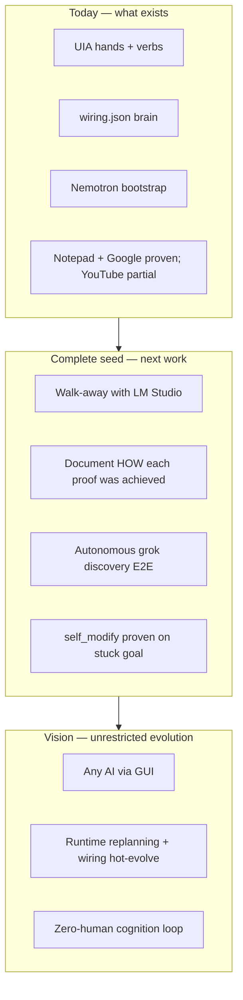
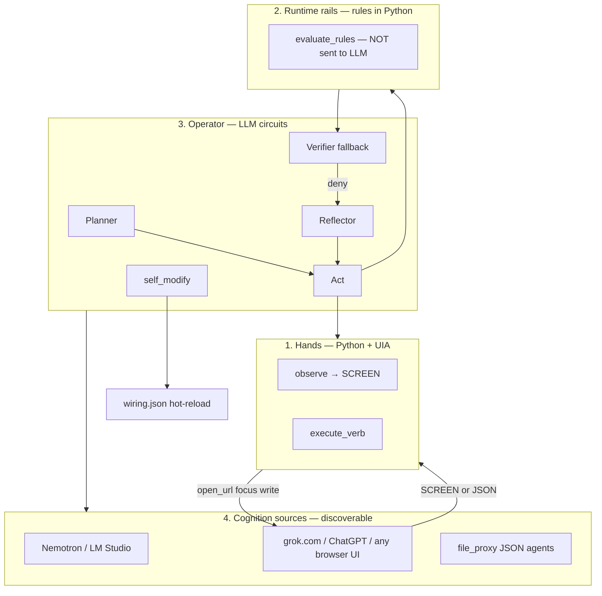
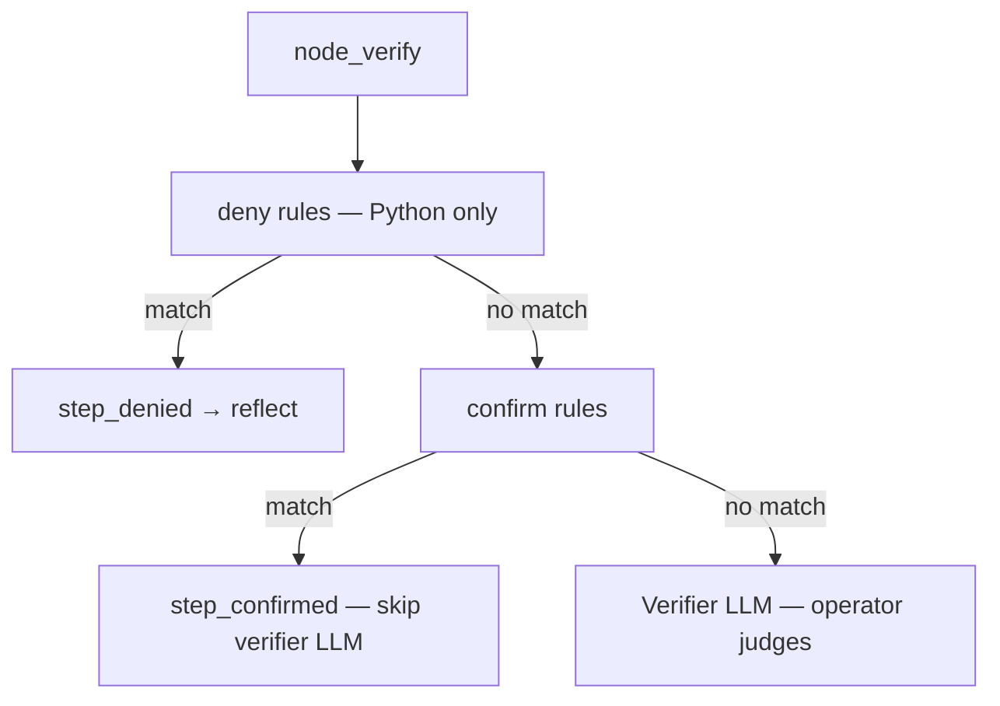
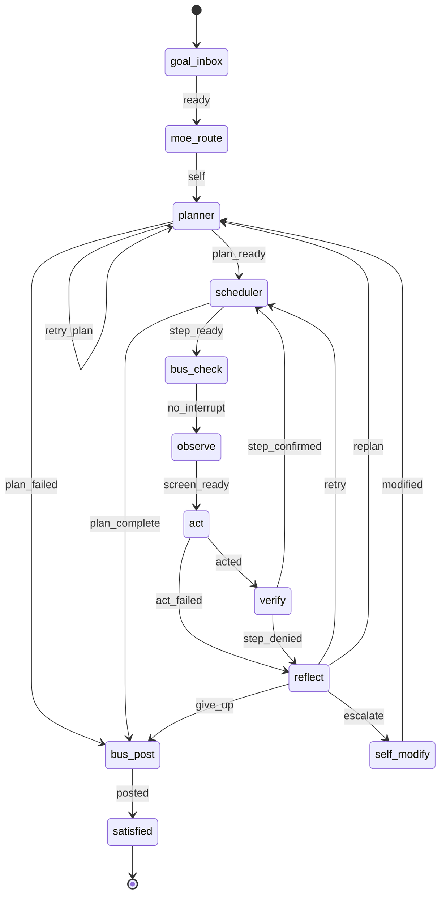
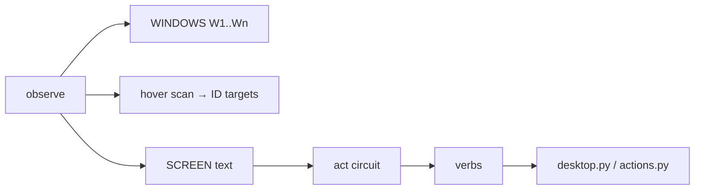
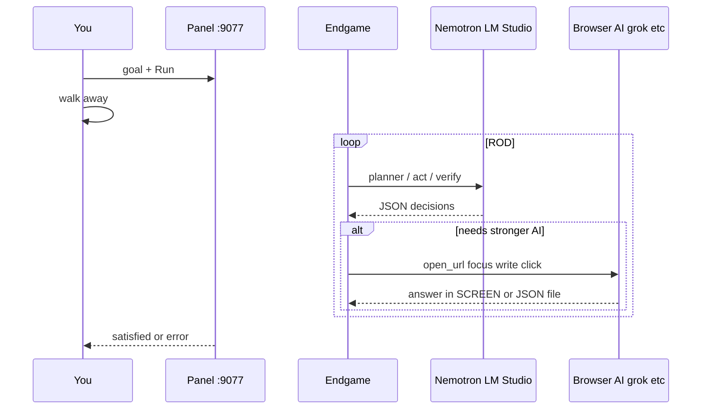

# Endgame-AI

**A self-evolving Windows desktop operator seed. Post a goal. Walk away.**

This document is the **only** project documentation. It is written for humans who will run the system and for coding agents who will extend it. Every claim is ordered by truth: `prompts/wiring.json` and `server.py` beat this file when they disagree.

---

## I. What this is

Endgame-AI is **not** a chatbot with tools. It is **not** a cloud computer-use API. It is a **local runtime that owns the keyboard and screen** on Windows, observes the real desktop through UI Automation, executes verbs, and asks language models only for *decisions*. Python moves the mouse. The model never does.

The design bet: **the GUI is the universal API.** Any intelligence reachable through a browser tab, a local agent UI, or a JSON file handoff can be discovered and used — without vendor APIs, without per-site integrations, without pip. Bootstrap on a small local model (Nemotron in LM Studio). Upgrade cognition by **navigating the GUI** to grok.com, Grok Build, OpenCode, ChatGPT, or any file-proxy agent.

| Field | Value |
|-------|-------|
| Repository | `https://github.com/wgabrys88/endgame-ai` |
| Branch | `codex/self-referential-relay` |
| Platform | Windows 10/11, interactive desktop session |
| Entry | `python server.py` → panel **http://127.0.0.1:9077/** |
| Slot 1 port | **9078** |
| Dependencies | Python 3.11+ stdlib only — **no pip** |
| Tracked files | **14** source files + this README (no test/harness scripts) |

### Use cases

| You want to… | Endgame does… |
|--------------|---------------|
| Type a goal and leave | ROD loop until `satisfied: true` or `give_up` |
| Open Notepad, Chrome, any app | `observe` → `act` from SCREEN |
| Navigate to any URL | `open_url` or focus + write |
| Play YouTube / media | Plan + `open_url` (proven partial — see §X) |
| Chat with grok/ChatGPT via browser | Discover chat UI, write, capture to MEMORY |
| Use stronger AI mid-goal | `open_url` to web AI or `llm_request` / `llm_wait_response` |
| Evolve when stuck | `reflect` → `self_modify` patches `wiring.json` at runtime |

**Logical consequence:** If the operator can reach a webpage a human can reach, it can use that page’s intelligence without an API key. The limitation is observation quality and bootstrap model skill — not integration count.

---

## II. The seed — now, complete, future

Endgame is a **seed**, not a finished product. The seed must be honest, small, and self-describing so later evolution (by `self_modify` or future agents) does not inherit legacy confusion.



| Stage | Operator replacement (honest) |
|-------|-------------------------------|
| Mechanical hands + SCREEN | ~20% |
| Declarative policy + verify | ~15% |
| Bootstrap cognition | ~10% |
| GUI cognition discovery | ~5% proven, ~15% designed |
| Walk-away reliability | ~7% |
| **Total toward walk-away vision** | **~45%** |

The architecture is credible. The gap is E2E proof of discovery, self-modify, and reliable Nemotron JSON — not missing bones.

---

## III. The thesis — why this is not a standard agent

Most 2025–2026 agent stacks use **one model sees pixels and acts**. Endgame separates four layers:



| Layer | Decides | Does not |
|-------|---------|----------|
| **Operator (LLM)** | Plan, verbs from SCREEN, judgment when rules don’t match, recovery strategy | Move mouse, see rule catalog |
| **Runtime rules** | Structural preflight: block false success, fast confirm launch chains | Replace operator planning |
| **Hands** | Execute verbs, HWND focus, UIA scan | Plan or judge goals |
| **wiring.json** | Topology, role prompts, rule matchers, limits | HTTP to models |

Research context: OSWorld and Windows Agent Arena benchmark desktop agents; Anthropic/OpenAI Computer Use let the model drive input; Sakana DGM self-modifies code. Endgame’s novelty is **hands/brain/operator split**, **GUI-unlimited cognition routing**, and **policy evolution via wiring_patch** without pip.

---

## IV. Operator vs rules — read this twice

This is the most misunderstood part of the system.

**You are correct:** the LLM is the serious computer operator. **Rules are runtime guidance rails** — anti-cheat for premature “step done” — not instructions the model memorizes.

| Fact | Detail |
|------|--------|
| Rules in prompts? | **No.** The 32 `wiring.json` rules are never sent to Nemotron. |
| Role text says “Guidance” | Hints for the operator role — not the wiring rule list. |
| Who sees `verify:rule_id`? | `HISTORY` and `LAST_ERROR` — feedback to adapt the next act. |
| What rules do in code | `evaluate_rules()` in `server.py` before verifier LLM runs |



**Loop behavior:** deny → reflect → retry (same step). Bounded by `max_attempts: 7` → replan (`max_replans: 3`) → `self_modify` (`max_self_modify: 3`) → `give_up`. This is not infinite. It means runtime refused a **false success** (e.g. `wait` only when `done_when` implies a chat response). The operator must change strategy.

**Panel:** remove rules via Rules list → auto hot-reload `POST /wiring`. No `enabled` toggle — rules are in or out of the array.

---

## V. Pipeline — topology, prompts, code, rules

One uniform ROD loop. Slots and relay wiring are optional helpers — not the product story.



| Node | wiring role | `server.py` handler | Rules |
|------|-------------|---------------------|-------|
| planner | `planner` | `node_planner` | — |
| act | `unified` | `node_act` | act `reject` before execute |
| verify | `verifier` | `node_verify` | verify `deny` then `confirm`; else LLM |
| reflect | `reflector` | `node_reflect` | receives `LAST_ERROR` |
| self_modify | `self_modify` | `node_self_modify` | — |

**Per-step micro-loop:**

```
scheduler → bus_check → observe → act → verify
                              ↑         |
                              └── reflect ← step_denied
```

### Cognition two-pass contract

`call_node()` in `server.py` always runs two LLM calls:

| Pass | User message | Model output |
|------|--------------|--------------|
| 1 | INPUT blocks only | Prose reasoning |
| 2 | INPUT + `ROD_REASONING_CONTENT` + **`DECIDE NOW`** | Exactly one role JSON |

`prompts.base` documents this. Pass-2 JSON shapes: `task`, `action`, `verdict`, `diagnosis`, `wiring_patch`.

### What Nemotron receives

```
system = prompts.base + prompts.roles[role]
user   = labeled blocks (GOAL, SCREEN, SUBTASK, LAST_ERROR, …)
```

Act blocks: `SUBTASK`, `DONE_WHEN`, `SCREEN`, `LAST_ERROR`, `HISTORY`, `MEMORY`.  
Only **Act** receives `SCREEN`. Planner never sees pixels.

Prompts were refactored for **4B models**: short Guidance sections, JSON shape first, no Slot-2 relay jargon, `self_modify` trimmed. Operator-vs-runtime split is in `prompts.base`.

---

## VI. SCREEN, verbs, and navigation



| Verb | Usage |
|------|--------|
| `open_url` | `start chrome <url>` — preferred for new navigation |
| `focus` | Target `[W#]` or window title (HWND-first) |
| `click` / `write` / `scroll` | Target `[ID]` from SCREEN only |
| `remember` | Store fact in MEMORY from SCREEN |
| `llm_request` | Write external-AI handoff file |
| `llm_wait_response` | Poll response into `MEMORY.llm_response` |

**Focus contract:** SCREEN shows `- [W3] YouTube - Google Chrome`. Act emits `{"verb":"focus","target":"W3"}`. Shared `resolve_window_target()` in `desktop.py` and `actions.py`.

---

## VII. Cognition bootstrap and discovery



| Transport | Config | Walk-away? |
|-----------|--------|------------|
| LM Studio HTTP | `model.json` → `"transport": "openai"`, host `:1234` | **Yes** — no JSON polling |
| file_proxy | default in repo | Agent polls `comms/slot1_cognition/request.json` |
| grok.com paste | same files | Human copies request — dev only |

**Discovery paths (no hardcoded recipes):** planner may plan `open_url grok.com` + chat steps; or `llm_request` + `llm_wait_response`; act executes from SCREEN. Grok Build, OpenCode, kiro-cli work via GUI or file_proxy — same uniform operator.

---

## VIII. What was proven — and how

Proof standard: `server.py` owned the loop; cognition read **real SCREEN** in `request.json`; `GET /state` → `satisfied: true` with action `history`. No harness scripts. No manual desktop by a coding agent.

| Goal | Result | How |
|------|--------|-----|
| `open notepad and type hello` | **Pass** | `hotkey win+r` → `write notepad` → `enter` → `write hello`; verify `confirm_launch_chain`, `confirm_write_to_writable` |
| `navigate to google.com in chrome` | **Pass** | `open_url chrome google.com`; verify `confirm_browser_open_url` |
| `play shakira waka waka on youtube` | **Partial** | `open_url` search URL then `watch?v=pRpeEdMmmQ0`; no click-play from results |
| grok.com chat / walk-away Nemotron | **Not E2E proven** | Architecture + prompts ready |
| `self_modify` recovery | **Coded, not proven** | `wiring_patch` ops + hot-reload exist |

**Invalid proof forever:** canned cognition without reading SCREEN; coding agent manually clicking the desktop; anything except live `POST /run` + `/state`.

---

## IX. Run it yourself

### What you do once vs what evolves alone

| You (manual) | Endgame (autonomous) |
|--------------|----------------------|
| Install Python, LM Studio, Chrome | observe, plan, act, verify |
| Clone repo | discover AI via GUI if goal requires |
| Set `transport: openai` in `model.json` | reflect, replan, self_modify |
| Start LM Studio :1234 | hot-reload wiring when patched |
| `python server.py`, post goal, leave | finish or `give_up` |

### Commands

```powershell
cd $env:USERPROFILE\Downloads\endgame-ai

# Edit prompts/model.json → "transport": "openai"
# Start LM Studio local server port 1234

$env:PYTHONIOENCODING = 'utf-8'
python server.py
```

Open **http://127.0.0.1:9077/** — type goal — Run — walk away.

```powershell
# Or API:
Invoke-RestMethod -Method Post -Uri http://127.0.0.1:9078/run `
  -ContentType 'application/json' -Body '{"goal":"open notepad and type hello"}'

# Return later:
Invoke-RestMethod http://127.0.0.1:9078/state
```

### Example goals (increasing ambition)

| Goal | Expected behavior |
|------|-------------------|
| `open notepad and type hello` | Bootstrap only |
| `navigate to google.com in chrome` | `open_url` |
| `ask grok what is the capital of France and save the answer` | Plan → open grok → chat → MEMORY |
| `play shakira waka waka on youtube` | Search + watch URL (partial) |

### If stuck

| Symptom | Action |
|---------|--------|
| Stale cognition | `POST /llm-proxy/clear {"confirm":true}` |
| Suspect deny rule | Panel → Rules → Remove (hot-reloads) |
| Nemotron bad JSON | Larger model or `file_proxy` + Grok Build |
| Fresh run | Delete gitignored `state.slot1.json`, `bus.json` |

### Between goals

```powershell
Invoke-RestMethod -Method Post -Uri http://127.0.0.1:9078/llm-proxy/clear `
  -ContentType 'application/json' -Body '{"confirm":true}'
```

---

## X. Panel and HTTP API

| Method | Path | Purpose |
|--------|------|---------|
| GET | `/health` | Transport, nodes, status |
| GET | `/state` | goal, step, history, satisfied |
| POST | `/run` | `{"goal":"..."}` |
| POST | `/pause` / `/resume` | Control loop |
| POST | `/wiring` | Hot-reload wiring.json |
| POST | `/llm-proxy/clear` | `{"confirm":true}` |

Ports: root **9077**, slot 1 **9078**, slot 2 **9079** (optional relay).

Panel: edit rules, topology, observe settings — auto-saves to `POST /wiring` (~550ms).

---

## XI. Repository — fourteen files, no scripts

| File | Role |
|------|------|
| `server.py` | HTTP API, ROD loop, rules, LLM, self_modify |
| `desktop.py` | UIA, SCREEN, `[W#]`/`[ID]`, focus, `open_url` |
| `actions.py` | Verb dispatch |
| `colony.py` | Multi-slot process wrapper |
| `prompts/wiring.json` | Brain — topology, rules, roles, limits |
| `prompts/wiring_relay.json` | Optional slot 2 relay |
| `prompts/wiring-schema.json` | Validation schema |
| `prompts/model.json` | Cognition transport |
| `prompts/model_relay.json` | Relay transport |
| `wiring-editor.html` | Walk-away panel |

**No `test_*.py`. No `harness_*.py`. No `*_runner.py`.** Endgame is its own test harness: post a goal.

**Gitignored runtime:** `state*.json`, `bus.json`, `comms/`, `traces.jsonl`, `__pycache__/`, `mcps/`

---

## XII. Authoritative counts

From `prompts/wiring.json` (re-count after edits):

| Item | Value |
|------|-------|
| Rules | **32** |
| Nodes | **12** |
| Edges | **22** |
| `max_attempts` / `max_replans` | **7** / **3** |
| `max_self_modify` | **3** |
| `observe.desktop_tree_enabled` | **false** |

Slot 2 relay: **13 rules** in `wiring_relay.json`.

---

## XIII. Known gaps and next work

1. Prove walk-away Nemotron on Notepad + Google (`satisfied: true`, leave, return).
2. Document reproducible captures: `history`, SCREEN in `request.json` for YouTube + grok paths.
3. Prove autonomous grok discovery (no pre-opened tab).
4. Prove `self_modify` on one stuck goal.
5. Shrink `server.py` — modify/remove before adding.
6. YouTube click-play from SCREEN `[ID]`.

**Coding agents:** use Endgame only. Do not add scripts. Brave wiring changes welcome.

---

## XIV. Handover — paste for next AI session

```
You are continuing Endgame-AI — a self-evolving Windows desktop operator SEED.

REPO: https://github.com/wgabrys88/endgame-ai
BRANCH: codex/self-referential-relay
DOCS: README.md only — read it fully before any change.

THESIS
- Endgame owns the hands (UIA, verbs). LLM circuits are the operator brain.
- GUI = universal API. grok.com, Grok Build, OpenCode, any browser or JSON file-proxy are discoverable — not hardcoded branches.
- wiring.json rules are PYTHON preflight only — NOT sent to the model. LAST_ERROR / verify:rule_id in HISTORY = feedback. Operator adapts; does not memorize rules.
- User posts goal at http://127.0.0.1:9077/ and walks away. Bootstrap: LM Studio Nemotron, model.json transport:openai, port 1234.

REPO FACTS
- 14 source files. NO test/harness/runner scripts. Proof = POST /run + GET /state satisfied:true + SCREEN-driven cognition.
- 32 rules, 12 nodes, 22 edges. Two-pass DECIDE NOW in call_node.

PROVEN
- Notepad hello, Google open_url (SCREEN-driven file_proxy session; Endgame executed verbs)
- YouTube partial via open_url watch URL

NOT PROVEN
- Walk-away Nemotron, grok chat E2E, self_modify, autonomous cognition discovery

YOU MUST
- python server.py → panel → POST /run — never create harness_*.py, test_*.py, *_runner.py, or canned cognition
- Poll comms/slot1_cognition/request.json if file_proxy; read SCREEN; write response.json with matching id
- Shrink server.py before adding features

FORBIDDEN
- Manual desktop control for proofs
- Canned planner/act without SCREEN
- Legacy slot-recipe thinking as primary architecture

KEY FILES: server.py, desktop.py, actions.py, prompts/wiring.json, wiring-editor.html
```

---

## XV. Deep Research — paste into ChatGPT project

```
Research brief: Endgame-AI — self-evolving desktop operator with GUI-as-universal-API

Repository: https://github.com/wgabrys88/endgame-ai
Branch: codex/self-referential-relay

Read README.md first. This is NOT standard computer-use.

Questions:

1. PARADIGM
   Compare to Anthropic Computer Use, OpenAI CUA, OSWorld, Windows Agent Arena, Sakana DGM, LangGraph.
   What is unique? (hands/operator/runtime-rules split, GUI cognition discovery, wiring_patch evolution, stdlib runtime)

2. OPERATOR VS RULES
   LLM is the operator; 32 wiring rules are Python preflight NOT in prompts. Do deny rules cause bounded loops? Is this the right anti-cheat design?

3. PIPELINE INTEGRITY
   Cross-reference wiring topology, role prompts, server.py handlers, evaluate_rules. Is the ROD graph coherent?

4. COGNITION
   Two-pass DECIDE NOW. Nemotron 4B bootstrap. file_proxy SCREEN contract. Discovery via open_url vs llm_request.

5. PROOF STATUS
   What is proven vs vision? How were Notepad, Google, YouTube achieved? What blocks walk-away?

6. SEED ROADMAP
   Complete seed vs future unrestricted evolution. 3-session plan. Effort S/M/L.

7. NO SCRIPTS POLICY
   Why zero test/harness files? Implications for agent development discipline.

Deliverables: executive summary, comparison table, mermaid architecture, honest maturity (~45%), bibliography.
```

---

## XVI. Truth order and license

1. `prompts/wiring.json`
2. `server.py`, `desktop.py`, `actions.py`
3. This README

Research operator tooling. Not production-hardened.

**Prepare the seed. Post the goal. Walk away. Let the operator find the way.**