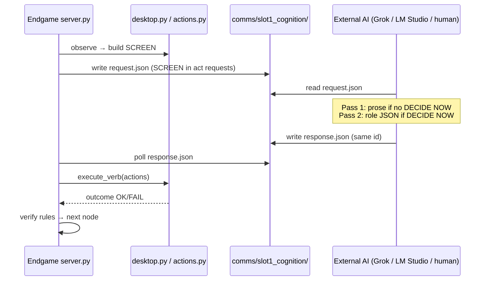
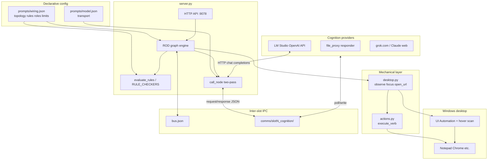
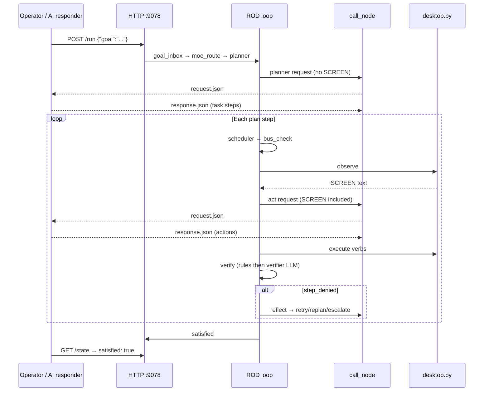
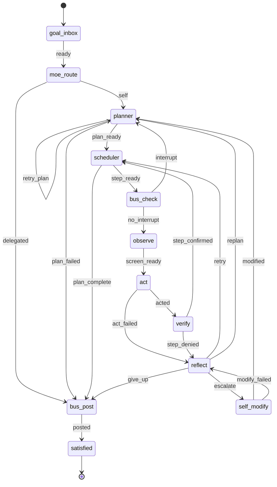
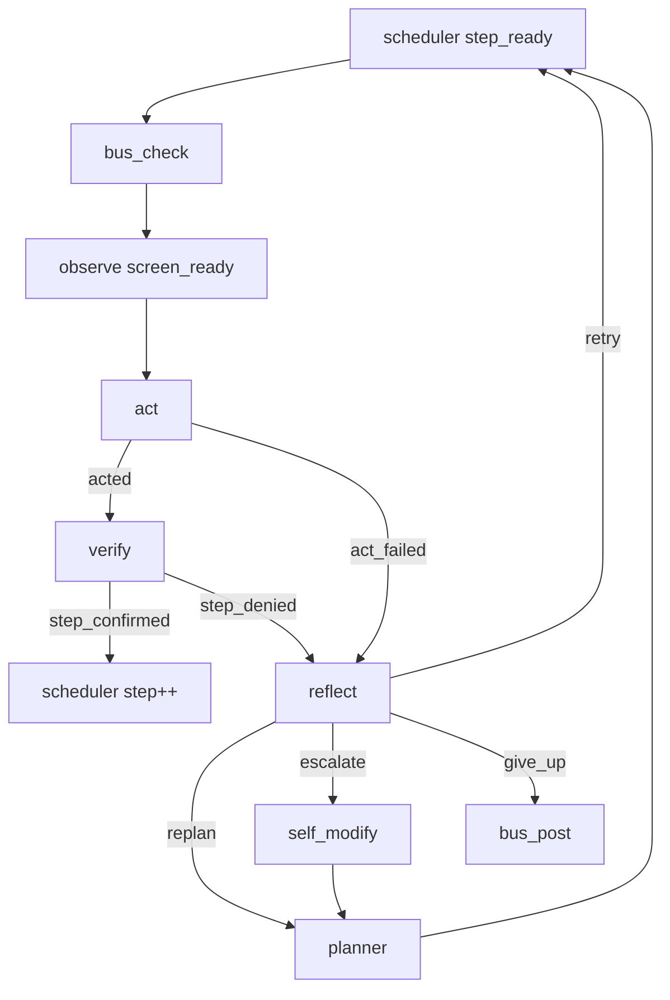
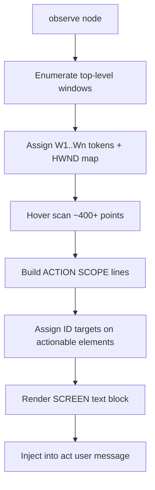
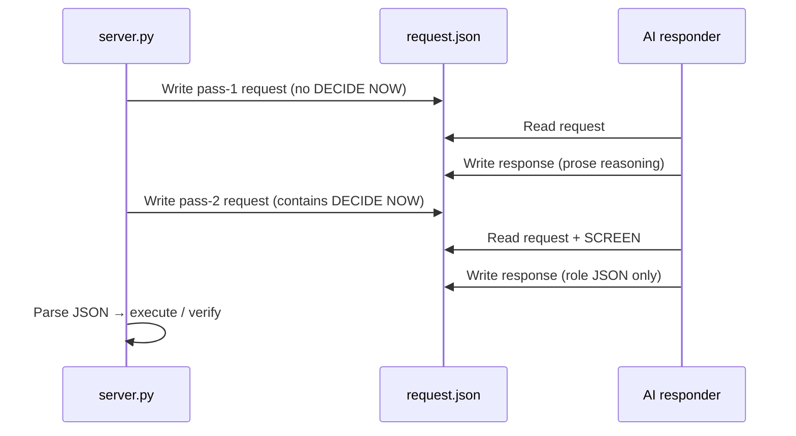
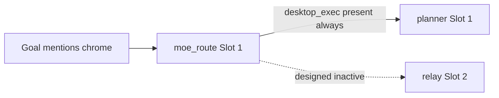
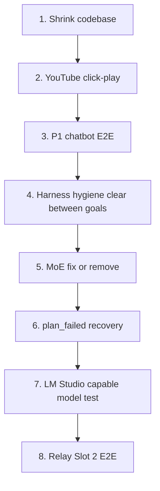

# Endgame-AI

**A local Windows desktop operator that replaces the human at the keyboard.**

Endgame-AI observes the real desktop (UI Automation), executes declarative actions, evaluates wiring rules, and asks an LLM only for *decisions* — never for *hands*. Python stdlib only. No pip. `prompts/wiring.json` is the brain; `server.py` is the runtime.

| Field | Value |
|-------|-------|
| Repository | `https://github.com/wgabrys88/endgame-ai` |
| Branch | `codex/self-referential-relay` |
| Platform | Windows 10/11 |
| Entry point | `server.py` (stdlib `http.server`, **not** FastAPI) |
| Slot 1 port | **9078** (`instance.slot: 1`, base 9077 + offset) |
| Default cognition | `file_proxy` (`prompts/model.json`) |
| Mechanical tests | `python test_mechanical_fixes.py` → **11/11 pass** (verified this session) |

> **Truth order:** `prompts/wiring.json` + `server.py` + `desktop.py` + `actions.py` beat this README. Re-count rules/edges after every wiring edit.

**This file is the only documentation.** No other handover docs exist in the repo.

### What this document is

| Audience | Use it for |
|----------|------------|
| Next coding agent (Grok, Claude, Cursor) | §18 handover prompt + §3 cognition contract |
| Human operator | §11 quick start + §12 examples |
| ChatGPT Deep Research | §19 research brief — paste into a project |
| Future you | §1 replacement progress + §4–§6 diagrams |

---

## Table of contents

1. [Vision and operator-replacement progress](#1-vision-and-operator-replacement-progress)
2. [What was proven (live sessions)](#2-what-was-proven-live-sessions)
3. [Cognition contract — valid vs forbidden](#3-cognition-contract--valid-vs-forbidden)
4. [Architecture](#4-architecture)
5. [ROD loop](#5-rod-loop)
6. [SCREEN → act → verify pipeline](#6-screen--act--verify-pipeline)
7. [Wiring.json — declarative brain](#7-wiringjson--declarative-brain)
8. [Rules engine](#8-rules-engine)
9. [Mechanical layer](#9-mechanical-layer)
10. [Cognition transports](#10-cognition-transports)
11. [Human quick start](#11-human-quick-start)
12. [Benchmark examples](#12-benchmark-examples)
13. [HTTP API](#13-http-api)
14. [Observation (mouse sweeps)](#14-observation-mouse-sweeps)
15. [Known gaps](#15-known-gaps)
16. [Remaining work (priority)](#16-remaining-work-priority)
17. [Development discipline](#17-development-discipline)
18. [Next AI — copy-paste handover prompt](#18-next-ai--copy-paste-handover-prompt)
19. [ChatGPT Deep Research prompt](#19-chatgpt-deep-research-prompt)
20. [Repository layout](#20-repository-layout)
21. [Authoritative counts](#21-authoritative-counts)

---

## 1. Vision and operator-replacement progress

### 1.1 Vision

Endgame-AI is a **living desktop operator** — closer to a human at the PC than to a headless API or MCP tool:

| Human does | Endgame does |
|------------|--------------|
| Receives a goal | `POST /run` → `goal_inbox` |
| Plans subtasks | `planner` circuit (LLM) |
| Looks at screen | `observe` → UIA hover scan → `SCREEN` text |
| Clicks, types, switches apps | `act` → `actions.py` verbs |
| Decides step is done | `verify` → rules + optional verifier LLM |
| Recovers from mistakes | `reflect` → retry / replan / `self_modify` |

The LLM is **one circuit among many**. It does not drive the mouse. The runtime does.

**Design claim** (`server.py:3`): *"Node handlers are pure functions. Wiring.json is the brain."*

**Target state:** Any strong AI (Grok, Claude, GPT via LM Studio, grok.com in a browser tab) supplies cognition JSON while Endgame-AI owns observe/act/verify. Multiple providers can serve different slots simultaneously.

### 1.2 How much of the human operator is replaced?

Honest assessment as of branch `codex/self-referential-relay` (June 2026 session):

```mermaid
flowchart LR
    subgraph Done["Built and working"]
        A[Goal intake HTTP API]
        B[UIA observe + SCREEN]
        C[Verb execution]
        D[Declarative verify rules]
        E[ROD graph + reflect/replan]
        F[file_proxy cognition bridge]
    end

    subgraph Partial["Partial / unproven"]
        G[YouTube click-play]
        H[Chatbot P1 relay]
        I[self_modify recovery]
        J[MoE slot delegation]
        K[LM Studio reliability]
    end

    subgraph Missing["Not yet human-equivalent"]
        L[Zero-human cognition loop]
        M[Long-run reliability]
        N[Arbitrary app mastery]
        O[Production hardening]
    end

    Done --> Partial
    Partial --> Missing
```



| Capability layer | Human equivalent | Status | Weight |
|------------------|------------------|--------|--------|
| Mechanical hands (mouse, keyboard, focus) | Hands | **Works** — Notepad, Chrome `open_url`, focus HWND | 20% |
| Eyes (screen understanding) | Vision | **Works** — UIA + `[ID]`/`[W#]` tokens; not pixel-DOM | 15% |
| Policy (when is a step done?) | Judgment | **Works** — 32 declarative rules + verifier fallback | 15% |
| Planning (decompose goal) | Intent | **Works with external LLM** — not autonomous alone | 10% |
| Recovery (retry, replan, patch wiring) | Adaptation | **Coded** — reflect/self_modify paths exist; **not E2E proven** | 10% |
| Benchmark goals (P0 suite) | Task completion | **~60%** — 2 full, 1 partial, 2 not run | 15% |
| Cognition without babysitting | Autonomy | **~40%** — still needs file_proxy responder or LM Studio | 10% |
| Multi-slot specialization | Teamwork | **~20%** — MoE inert on Slot 1; relay unproven | 5% |

**Overall: ~40% of a full human desktop operator** — the *architecture* is credible and the *mechanical loop* works on real Windows; polish, autonomy, and benchmark coverage remain.

What “100% replacement” requires:

1. All P0 benchmarks pass with `satisfied: true` and real SCREEN-driven cognition (not canned scripts).
2. Cognition transport stable enough that no human copies JSON mid-run (LM Studio or persistent file_proxy agent).
3. Click-play and DOM-level evidence for media/browser goals.
4. P1 chatbot: `llm_request` + `llm_wait_response` + `memory.llm_response` proven.
5. `self_modify` proven on at least one stuck goal.
6. Codebase shrunk — policy in wiring, not duplicated Python.

---

## 2. What was proven (live sessions)

Facts from runs where `server.py` owned the loop. Unit tests alone are **not** proof.

### 2.1 P0 benchmark results

| Goal | Result | Evidence |
|------|--------|----------|
| `open notepad and type hello` | **Pass** | `hotkey win+r` → `write notepad` → `press enter` → `write hello`; verify `confirm_launch_chain`, `confirm_write_to_writable` |
| `navigate to google.com in chrome` | **Pass** | `open_url chrome google.com`; verify `confirm_browser_open_url` |
| `play shakira waka waka on youtube` | **Partial** | `open_url` search + watch URL (`pRpeEdMmmQ0`); `confirm_youtube_playback` on clean runs; **no** click-play |
| `have a conversation with an AI chatbot` | **Not run** | — |
| Self-modify recovery | **Not run** | `max_self_modify: 3` enforced in code only |

### 2.2 Grok Build session — cognition path (CONFIRMED)

**Valid proof path — no desktop workaround:**

1. Endgame wrote `comms/slot1_cognition/request.json` with **real `SCREEN`** (FOCUSED, `[ID]`, `WINDOWS [W#]`, SUBTASK, DONE_WHEN).
2. Grok **read** that JSON and wrote `response.json` (matching `id`).
3. Endgame executed verbs via `desktop.py` / `actions.py`, re-observed, verified, looped.

Grok **did not** manually open Chrome, type in Notepad, or click YouTube. Shell was for **server control** (`POST /run`, `/health`, `/state`) and **writing cognition JSON** — not GUI automation.

**Two-pass LLM contract** (`server.py:1164–1174`):

| Pass | Trigger | `content` must be |
|------|---------|-------------------|
| 1 | User message has **no** `DECIDE NOW` | Prose / reasoning only |
| 2 | User message contains `DECIDE NOW` | Exactly one role JSON object |

### 2.3 Mechanical fixes on this branch

| Fix | Where |
|-----|-------|
| `[W#]` window tokens + `resolve_window_target()` | `desktop.py`, `actions.py` |
| HWND-first `focus_window` + `AttachThreadInput` retry | `desktop.py` |
| Focus short-circuit only when snapshot `focused: true` | `actions.py` |
| `open_url` verb | `desktop.py`, `actions.py`, `wiring.json` |
| `confirm_browser_open_url` | `wiring.json`, `server.py` |
| Verify preflight appends `rule_id` to `history` | `server.py` `node_verify` |
| Wait-deny rules; `confirm_relay_wait` removed (relay) | both wirings |
| `max_self_modify: 3` + `give_up` edge | `wiring.json` |
| `configure_observation()` from wiring | `desktop.py` |

---

## 3. Cognition contract — valid vs forbidden

### 3.1 Valid path (mandatory for proofs)



The external AI is a **decision engine**. Endgame is the **operator**.

### 3.2 What each circuit sees

| Circuit | Sees SCREEN? | Outputs |
|---------|--------------|---------|
| planner | No | `{"record_type":"task","data":{"steps":[...]}}` |
| act | **Yes** | `{"record_type":"action","data":{"conclusion":"EXECUTE","actions":[...]}}` |
| verifier | No | `{"record_type":"verdict","data":{"confirmed":true/false,...}}` |
| reflector | No | `{"record_type":"diagnosis",...}` |
| self_modify | No | `{"record_type":"wiring_patch",...}` |

**Only `act` receives `SCREEN`.** Use `[W#]`, `[ID]`, or `open_url` — never invented coordinates.

**Act verbs:** `click`, `write`, `press`, `hotkey`, `focus`, `open_url`, `scroll`, `wait`, `remember`, `llm_request`, `llm_wait_response`

### 3.3 FORBIDDEN paths

| Path | Why invalid |
|------|-------------|
| `p0_file_proxy_runner.py` + `harness_common.ProxyResponder` | **Canned** planner/act/verdict per goal — **does not read SCREEN**. Regression automation only; **never** valid E2E proof. |
| Coding agent manually driving Chrome/Notepad/YouTube | Bypasses observe/act loop. |
| Claiming success from `test_mechanical_fixes.py` alone | Proves mechanical pieces only. |
| Adding new proxy runner scripts | Poll `request.json` yourself. |

**Future sessions using scripted proxy responses must say so explicitly in commit message and captures.**

---

## 4. Architecture

### 4.1 Layer ownership



| Layer | Owns | Does not own |
|-------|------|--------------|
| `wiring.json` | Topology, rules, roles, limits, observe config | HWND, LLM HTTP |
| `server.py` | Graph traversal, rules, LLM orchestration, self_modify, HTTP | UIA element finding |
| `desktop.py` | UIA, SCREEN render, focus, `open_url` | Planning policy |
| `actions.py` | Verb dispatch, guards | Rule definitions |
| External AI | JSON decisions per circuit | Mouse, keyboard, focus |

### 4.2 End-to-end goal lifecycle



### 4.3 Event model

Not a desktop event bus. A **synchronous graph loop**:

- **Polling:** file_proxy waits on `response.json`; hover scan; `bus_check` reads `bus.json`.
- **Signals:** Each node returns `signals[]`; `find_targets()` picks edge where `on` matches.
- **Scheduler:** `node_scheduler` advances `step` index — not a separate OS process.

---

## 5. ROD loop

### 5.1 Topology (12 nodes, 22 edges)



### 5.2 Per-visit cycle

```
handler → state patch → find_targets(signals) → save_state → sleep(cycle_delay_ms) → next node
```

`run()` stops at terminal node, `max_cycles`, or pause.

### 5.3 Per-step micro-loop



`retries` increments on `step_denied`; `max_attempts` (7) triggers replan or escalate.

---

## 6. SCREEN → act → verify pipeline

### 6.1 How SCREEN is built



**SCREEN structure (act input):**

```
FOCUSED: <title>
ACTION SCOPE: ...
  [ID1] Button Name ...
WINDOWS:
  - [W1] App Title
  - [W2] Chrome ...
SUBTASK: ...
DONE_WHEN: ...
```

### 6.2 Focus and navigation contracts

| Token | Act usage | Resolution |
|-------|-----------|------------|
| `[W3]` in WINDOWS | `{"verb":"focus","target":"W3"}` | `resolve_window_target()` → HWND → `focus_window()` |
| `[ID12]` in SCOPE | `{"verb":"click","target":"ID12"}` | UIA element from observation cache |
| Domain nav | `{"verb":"open_url","target":"chrome","value":"google.com"}` | `start chrome https://...` — no prior focus |

Focus short-circuit in `actions.py`: skip only when observation snapshot marks resolved row `focused: true`.

### 6.3 Verify pipeline


Deny rules run **before** confirm rules.

---

## 7. Wiring.json — declarative brain

### 7.1 Sections

| Section | Purpose |
|---------|---------|
| `topology` | Nodes + signal edges |
| `rules` | Verify/act policy (`match` → `RULE_CHECKERS`) |
| `roles` / `prompts.base` | LLM system prompts |
| `limits` | max_attempts, max_replans, max_self_modify |
| `observe` | hover scan, scope_depth, desktop_tree_enabled |
| `verbs` / `verb_normalize` | Act JSON field mapping |
| `guards` | Repeat block, advance hints |
| `reasoning` | Two-pass store/clear/expected record types |
| `moe` | Delegation keywords (inert on Slot 1 — §15) |
| `runtime` | Ports, delays, llm_proxy paths |

### 7.2 Node handlers

| Node | type | LLM? |
|------|------|------|
| goal_inbox | entry | No |
| moe_route | moe_route | No |
| planner | planner | Yes |
| scheduler | scheduler | No |
| bus_check | bus_check | No |
| observe | observe | No |
| act | act | Yes |
| verify | verify | Yes (after rule preflight) |
| reflect | reflect | Yes |
| self_modify | self_modify | Yes |
| bus_post | bus_post | No |
| satisfied | satisfied | No |

Slot 2 relay adds `llm_request_check`, `llm_response_write` for browser-chat capture.

---

## 8. Rules engine

Key confirm rules (Slot 1):

| Rule id | Fires when |
|---------|------------|
| `confirm_launch_chain` | win+r → write app → enter |
| `confirm_write_to_writable` | write OK + writable focus |
| `confirm_browser_open_url` | `open_url` OK + domain in outcome |
| `confirm_browser_navigation` | ctrl+l URL chain (legacy) |
| `confirm_youtube_playback` | watch URL + done_when keywords |
| `confirm_llm_response_received` | `memory.llm_response` ≥ 20 chars |

Key deny rules:

| Rule id | Purpose |
|---------|---------|
| `deny_outcome_failed` | Any non-OK outcome |
| `deny_response_no_evidence` | wait-only without memory evidence |
| `deny_wait_only_content_receipt` | wait + content-implying done_when |
| `reject_chat_write_to_address_bar` | Chat text must not go to URL bar |

New `match` keys require `RULE_CONDITIONS` + `RULE_CHECKERS` in `server.py`.

---

## 9. Mechanical layer

### 9.1 State files (runtime, gitignored)

| File | Content |
|------|---------|
| `state.slot1.json` | goal, plan, step, retries, history, screen, memory |
| `bus.json` | Cross-slot messages |
| `comms/slot1_cognition/` | Pending LLM exchange |
| `prompts/traces.jsonl` | Completed run traces |

### 9.2 Stale request blocker

Pending `request.json` blocks new LLM calls:

```
planner: LLM file proxy request already pending id=...
```

Fix: `POST /llm-proxy/clear {"confirm":true}` before a new goal.

---

## 10. Cognition transports

| Transport | Config | Who responds | Best for |
|-----------|--------|--------------|----------|
| `file_proxy` | `model.json` default | Agent polls JSON files | Grok/Claude/Cursor without local GPU |
| `openai` | `transport: openai`, host `:1234` | LM Studio HTTP | Local models |
| Web UI copy-paste | Same files | Human pastes grok.com output | Zero setup |

### 10.1 file_proxy two-pass flow



### 10.2 Response JSON shape

```json
{
  "id": "<same as request.id>",
  "choices": [{
    "message": {
      "content": "<prose OR role JSON on DECIDE NOW pass>"
    }
  }]
}
```

### 10.3 LM Studio

1. Load model; start server port **1234**.
2. Set `transport: openai` in `prompts/model.json`.
3. Restart `server.py` — no `comms/` polling.
4. Small models often fail two-pass JSON; strong remote file_proxy is more reliable today.

### 10.4 grok.com offload

Same mechanical steps as file_proxy:

1. `GET /state` — current goal/step.
2. Open `comms/slot1_cognition/request.json`.
3. Copy `messages` (especially **SCREEN**) into grok.com.
4. Pass 1 → prose; Pass 2 (`DECIDE NOW`) → JSON only.
5. Save `response.json` with matching `id`.

### 10.5 Multi-slot

| Slot | Wiring | Port | Role |
|------|--------|------|------|
| 1 | `wiring.json` | 9078 | Desktop executor |
| 2 | `wiring_relay.json` | 9079 | Browser chat capture |

`POST /slots/start {"slots":[1,2]}` from root **9077**.

---

## 11. Human quick start

**Prerequisites:** Windows 10/11, Python 3.11+, Chrome for browser goals.

```powershell
cd C:\path\to\endgame-ai
$env:PYTHONIOENCODING = 'utf-8'
$env:ENDGAME_SLOT = '1'
$env:ENDGAME_STATE = "$PWD\state.slot1.json"
$env:ENDGAME_WIRING = "$PWD\prompts\wiring.json"
python server.py
```

Panel: **http://127.0.0.1:9078/**

```powershell
# Post goal
Invoke-RestMethod -Method Post -Uri http://127.0.0.1:9078/run `
  -ContentType 'application/json' -Body '{"goal":"open notepad and type hello"}'

# Poll until done
Invoke-RestMethod http://127.0.0.1:9078/state

# Clean between goals
Invoke-RestMethod -Method Post -Uri http://127.0.0.1:9078/llm-proxy/clear `
  -ContentType 'application/json' -Body '{"confirm":true}'
```

Watch `comms\slot1_cognition\request.json` → write `response.json` until `satisfied: true`.

---

## 12. Benchmark examples

### Notepad

Goal: `open notepad and type hello`

Success history pattern: `hotkey win+r` → `write notepad` → `press enter` → `write hello`; verify `confirm_launch_chain`, `confirm_write_to_writable`.

### Google

Goal: `navigate to google.com in chrome`

Act (DECIDE NOW):

```json
{"record_type":"action","data":{"conclusion":"EXECUTE","actions":[
  {"verb":"open_url","target":"chrome","value":"google.com"}
]}}
```

Expect `confirm_browser_open_url` in history.

### Shakira / YouTube (partial)

Goal: `play shakira waka waka on youtube`

Proven via two `open_url` steps (search URL, then `watch?v=pRpeEdMmmQ0`). **Gap:** no click on search result; no player DOM proof.

---

## 13. HTTP API

**No `/slots/status`.** Use:

| Method | Path | Purpose |
|--------|------|---------|
| GET | `/health` | Nodes, port, transport, run status |
| GET | `/system` | Root snapshot (slot 0) |
| GET | `/state` | Full run state |
| POST | `/run` | `{"goal":"..."}` |
| POST | `/resume` / `/pause` | Control loop |
| POST | `/llm-proxy/clear` | `{"confirm":true}` |
| POST | `/relay/clear` | Clear relay queue |
| POST | `/slots/start` | `{"slots":[1,2]}` |
| GET | `/wiring/audit` | Validate wiring |

Ports: root **9077**, Slot 1 **9078**, Slot 2 **9079**.

---

## 14. Observation (mouse sweeps)

Each `observe` runs a full-screen hover scan when `hover_scan_enabled: true` (~400+ probes) — **once per step attempt**.

Multiple back-to-back sweeps = verify retries:

```
observe → act → verify(deny) → reflect → observe → ...
```

Up to `observe.wait_retries` (6) extra passes if `< min_elements` actionable `[ID]` targets.

Check `history`, `step`, `retries`, `last_error` in `/state` when cursor keeps sweeping.

---

## 15. Known gaps

| ID | Issue | Impact |
|----|-------|--------|
| F1 | MoE inert on Slot 1 (`desktop_exec` always present) | Browser never delegates to Slot 2 |
| F2 | `plan_failed` → `bus_post` — no reflect | Silent death on planner parse failure |
| F3 | YouTube via direct `open_url` watch URL | No click-play; thin player evidence |
| F4 | Stale `request.json` between goals | Blocks until `/llm-proxy/clear` |
| F5 | Small LM Studio models | JSON parse failures on DECIDE NOW |
| F6 | Windows foreground lock (rare) | `focus_window` false on protected windows |
| F7 | P1 chatbot not run | Wait/memory capture rules unproven E2E |
| F8 | `server.py` size | Shrink candidate — modify/remove before adding |



---

## 16. Remaining work (priority)



**Definition of done (stretch):**

- [ ] Every `[W#]` in WINDOWS focusable via HWND path
- [ ] Google nav with `confirm_browser_open_url` in history
- [ ] YouTube click-play or honest player-state failure
- [ ] Wait-only steps never `step_confirmed` without memory evidence
- [ ] Chatbot P1 benchmark
- [ ] `self_modify` proven on one stuck goal
- [ ] Net code reduced or dead paths removed

---

## 17. Development discipline

### Read before write

1. `prompts/wiring.json`
2. `server.py` — `NODES`, `node_verify`, `RULE_CHECKERS`, `call_node`
3. `desktop.py` — `observe`, `resolve_window_target`, `focus_window`
4. `comms/slot1_cognition/request.json` — **what Endgame actually saw**
5. `state.slot1.json` — `history`, `last_error`, `step`

### Modify or remove — do not inflate

- Prefer wiring rule changes over Python policy.
- New `match` key → update `RULE_CONDITIONS` + `RULE_CHECKERS`.
- **Do not** add proxy runners, verification frameworks, or duplicate docs.
- **Do not** add features without removing dead code.
- `python test_mechanical_fixes.py` after mechanical changes only.

### Proof standard

```powershell
(Invoke-RestMethod http://127.0.0.1:9078/state).satisfied -eq $true
(Invoke-RestMethod http://127.0.0.1:9078/state).history
```

Cognition transport must be stated in commit/capture. SCREEN-driven responses only.

---

## 18. Next AI — copy-paste handover prompt

Paste into Claude Code, Cursor, Grok, or any new session with **zero prior context**:

```
You are continuing Endgame-AI — a Windows desktop ROD operator that replaces the human at the keyboard.

REPO: https://github.com/wgabrys88/endgame-ai
BRANCH: codex/self-referential-relay
PORT: Slot 1 = 9078
DOCS: README.md is the only documentation — read it fully before changing code.

VISION
Endgame observes UIA, executes verbs, evaluates wiring rules. External AI supplies JSON decisions only — never drives the mouse. wiring.json is the brain (32 rules, 12 nodes, 22 edges). Target: any LLM provider via file_proxy, LM Studio, or grok.com offload.

OPERATOR REPLACEMENT: ~40% complete. Mechanical loop works; autonomy and benchmark coverage incomplete.

PROVEN (live file_proxy, Endgame owned observe/act — Grok read SCREEN, did NOT manually control desktop):
- open notepad and type hello → satisfied, confirm_launch_chain + confirm_write_to_writable
- navigate to google.com in chrome → open_url, confirm_browser_open_url
- play shakira waka waka on youtube → open_url search + watch URL, PARTIAL (no click-play)

NOT PROVEN: P1 chatbot, self_modify recovery, MoE delegation, full P0 re-run after last fixes.

YOUR PRIMARY GOAL
Close the gap from ~40% to ~70% operator replacement:
1. Re-run P0 benchmarks with SCREEN-driven file_proxy cognition (not p0_file_proxy_runner.py)
2. YouTube: click [ID] search result OR add player-state verify rule
3. P1 chatbot: llm_request + llm_wait_response with memory.llm_response proof
4. Shrink server.py / remove dead paths BEFORE adding anything
5. Fix plan_failed → reflect OR document removal
6. /llm-proxy/clear between every goal in harness runs

HOW TO OPERATE (mandatory every session)
1. python server.py with ENDGAME_SLOT=1 env vars (see README §11)
2. POST /run {"goal":"..."}
3. Poll comms/slot1_cognition/request.json
4. Read SCREEN in act requests — decide from [W#] and [ID], never invent targets
5. Two-pass: no DECIDE NOW → prose only; DECIDE NOW → role JSON only in content
6. Write response.json with same id as request
7. Poll GET /state until satisfied or terminal error
8. Proof = satisfied:true + history showing real verbs + rule_id on verify entries

FORBIDDEN
- Manual Chrome/Notepad/YouTube control outside Endgame for proofs
- p0_file_proxy_runner.py / harness_common canned scripts as E2E proof
- New files before auditing what to modify or remove
- Claiming benchmark pass without reading request.json + state.slot1.json

KEY FILES
server.py (graph+rules+LLM), desktop.py (observe+focus+open_url), actions.py (verbs), prompts/wiring.json

DISCIPLINE
Modify/remove existing code. Policy in wiring.json. test_mechanical_fixes.py for mechanical regressions only (11 tests).
```

---

## 19. ChatGPT Deep Research prompt

Paste into a **ChatGPT project** (Deep Research mode) with the repo URL attached or uploaded README:

```
Deep research brief: Endgame-AI desktop operator

Repository: https://github.com/wgabrys88/endgame-ai
Branch: codex/self-referential-relay
Platform: Windows 10/11, Python stdlib only, no pip

Research questions — answer each with evidence from the repo and comparable systems:

1. WHAT WAS BUILT
   - What is the ROD (Reflect-Observe-Decide) loop architecture?
   - How does wiring.json act as a declarative "brain" separate from server.py?
   - What mechanical capabilities exist (UIA observation, verbs, focus contract, open_url)?
   - What cognition transports exist (file_proxy, LM Studio, multi-slot relay)?
   - What was proven in live sessions vs what was only coded?

2. HOW IT WAS BUILT
   - Trace the data flow: POST /run → planner → observe → act(SCREEN) → verify(rules) → reflect
   - How does the two-pass LLM contract work (reasoning pass vs DECIDE NOW JSON pass)?
   - How do verify rules (RULE_CHECKERS) short-circuit before verifier LLM?
   - What is the valid proof path (read request.json SCREEN → write response.json) vs forbidden path (p0_file_proxy_runner canned scripts)?
   - What mechanical fixes landed on codex/self-referential-relay branch?

3. HOW MUCH HUMAN OPERATOR IS REPLACED
   - Map each human desktop operator skill to Endgame capability and rate completeness (~40% claimed).
   - What benchmarks pass, partial-pass, or were not run?
   - What gaps block claiming autonomous desktop operation?

4. WHAT AND HOW TO BUILD MORE (prioritized recommendations)
   - YouTube click-play and player-state verification — wiring vs Python changes?
   - P1 chatbot (llm_request, llm_wait_response, memory.llm_response) — what rules already exist?
   - self_modify wiring_patch — when should it fire, what ops exist?
   - MoE delegation — fix or remove? Current inert behavior on Slot 1.
   - plan_failed recovery — best pattern for ROD graphs?
   - Codebase shrink strategy for server.py without losing behavior.
   - LM Studio minimum model requirements for two-pass JSON reliability.
   - Comparison to: Anthropic computer use, OpenAI operator agents, UFO/Windows Agent Arena, pywinauto+LLM wrappers — what is Endgame's unique design bet?

5. RISKS AND ANTI-PATTERNS
   - Why scripted file_proxy runners invalidate benchmarks.
   - Stale request.json deadlock.
   - Foreground focus failures on Windows.
   - Policy drift between wiring.json and RULE_CHECKERS in server.py.

Deliverable format:
- Executive summary (1 page)
- Architecture diagram description (mermaid-compatible)
- Gap analysis table with effort estimates (S/M/L)
- Recommended 3-session roadmap for next implementer
- Bibliography of repo files to read in order

Constraints for recommendations:
- Python stdlib only, no pip
- Prefer wiring.json policy changes over new Python
- Modify/remove before add — codebase anti-bloat
- Proofs require SCREEN-driven cognition, not canned responses
```

---

## 20. Repository layout

| Path | Role |
|------|------|
| `server.py` | HTTP API, ROD loop, rules, LLM, self_modify |
| `desktop.py` | UIA observation, `[W#]` tokens, focus, `open_url` |
| `actions.py` | Verb dispatch |
| `colony.py` | Multi-slot process wrapper |
| `prompts/wiring.json` | Slot 1 brain |
| `prompts/wiring_relay.json` | Slot 2 relay (13 rules) |
| `prompts/wiring-schema.json` | Wiring validation |
| `prompts/model.json` | Slot 1 cognition transport |
| `prompts/model_relay.json` | Slot 2 cognition transport |
| `wiring-editor.html` | Operator panel |
| `test_mechanical_fixes.py` | Focus + wait-deny tests (11 pass) |
| `harness_common.py` | Server/proxy helpers — **not E2E proof** |
| `p0_file_proxy_runner.py` | Canned P0 driver — **not E2E proof** |
| `run_verification.py` | Scratch artifact capture |

**Runtime (gitignored):** `state*.json`, `bus.json`, `comms/`, `__pycache__/`, `prompts/traces.jsonl`, `prompts/wiring.backup.*.json`

---

## 21. Authoritative counts

Inspect `prompts/wiring.json` after edits:

| Item | Slot 1 |
|------|--------|
| Rules | **32** |
| Topology nodes | **12** |
| Topology edges | **22** |
| `limits.max_attempts` / `max_replans` | **7** / **3** |
| `limits.max_self_modify` | **3** |
| `observe.desktop_tree_enabled` | **false** |

Slot 2 relay: **13 rules** (`confirm_relay_wait` removed).

---

## License / status

Research operator tooling. Not production-hardened.

**Session handoff complete.** Next agent: §18 prompt → poll `request.json` → shrink and polish — do not bloat.