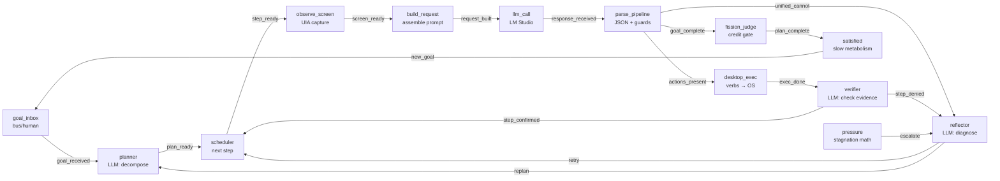
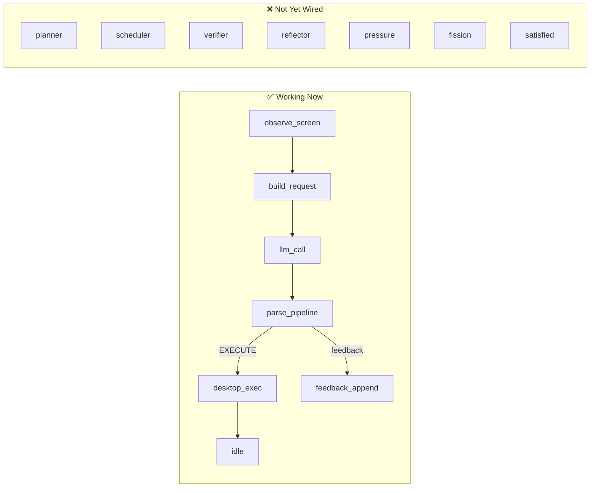
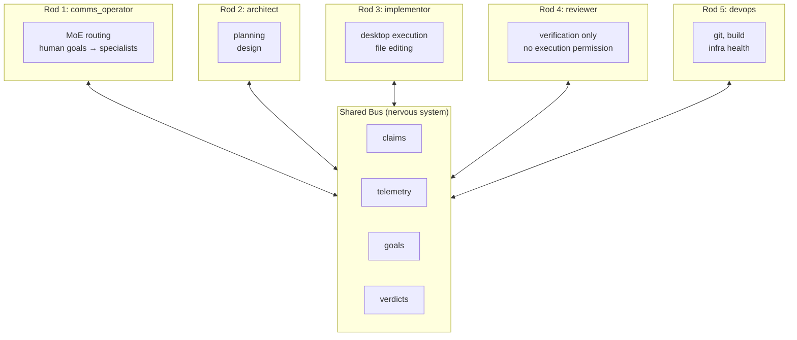

# endgame-ai

**A living Windows desktop organism — not an agent framework.**

One JSON file wires the brain. Python is just muscles. The browser is the window into the skull.

---

## What This Is

An autonomous desktop organism that:
- **Sees** the screen (UI Automation tree + hover probe)
- **Acts** on it (click, write, press, hotkey, scroll, focus)
- **Thinks** via local LLM (no cloud, no API keys)
- **Plans** multi-step goal decomposition
- **Verifies** its own work
- **Reflects** on failures
- **Evolves** its own prompts under pressure
- **Never exits** — satisfied = slow metabolism, not death

All behavior is defined in `prompts/wiring.json`. Python has zero control flow. Adding a capability = adding a node + edge to the JSON. The HTML visual editor lets you wire it like a circuit board.

---

## Architecture (3 files, 3 concerns)

```
┌─────────────────────────────────────────────────────────────┐
│  prompts/wiring.json          THE BRAIN (declarative)        │
│  ─────────────────────────────────────────────────────────── │
│  Nodes = capabilities.  Edges = signal flow.                 │
│  Guards, prompts, limits, identity — all declared here.      │
│  No Python if/else for control. Ever.                        │
└─────────────────────────────────────────────────────────────┘
        │ defines topology
        ▼
┌─────────────────────────────────────────────────────────────┐
│  server.py                    THE BODY (executable)           │
│  ─────────────────────────────────────────────────────────── │
│  Python stdlib HTTP server. Each node type = one function.   │
│  Stateless: receives state → returns signals + state patch.  │
│  Zero pip install. Zero frameworks. Just muscles.            │
└─────────────────────────────────────────────────────────────┘
        │ HTTP POST /node/{type}
        ▼
┌─────────────────────────────────────────────────────────────┐
│  wiring-editor.html           THE CONSCIOUSNESS (observable) │
│  ─────────────────────────────────────────────────────────── │
│  React Flow + dagre auto-layout. Single HTML file, CDN only. │
│  Live execution: drives graph, highlights active nodes.      │
│  Replay: load log files, step through historical cycles.     │
│  Edit: drag nodes, rewire edges, save back to JSON.          │
└─────────────────────────────────────────────────────────────┘
```

---

## The Wiring Topology

The brain is a directed graph. Signals flow through edges. Nodes fire when reached.



**Key principle:** This graph IS the program. Python doesn't decide what runs next — the edges do. To add verification, you add a node + edge. To add retry logic, you add an edge back. To add a new capability, you add a node type to `server.py` (one function) and wire it in JSON.

---

## Current State (honest)

We have a working **reflex arc** — the foundation. Not yet a complete rod.



### What works today

| Capability | Status | How |
|---|---|---|
| Desktop observation | ✅ | `desktop.py` → UIA tree + hover probe |
| Desktop execution | ✅ | `actions.py` → click, write, press, hotkey, scroll, focus |
| LLM inference | ✅ | `server.py` → LM Studio via urllib (no deps) |
| Prompt-driven behavior | ✅ | `prompts/unified.txt` with swap rules in wiring.json |
| Response parsing + guards | ✅ | Repeat-block, premature-done, advance hints |
| Reasoning feedback loop | ✅ | History injected into next cycle |
| Fan-out (1 signal → N nodes) | ✅ | Edge matching in browser + server |
| Visual graph editor | ✅ | React Flow + dagre, load/save JSON |
| Log replay | ✅ | Load .txt log, step through cycles |
| Manager→Student orchestration | ✅ | prompt_swap when goal mentions peer |

### What's missing for one complete rod

| Capability | Gap | Severity |
|---|---|---|
| Autonomous cycle loop | Server is passive (waits for HTTP) | CRITICAL |
| Multi-step planning | No planner node, no step decomposition | HIGH |
| Self-verification | No verifier node after action | HIGH |
| Failure diagnosis | No reflector node | MEDIUM |
| Pressure/stagnation | No autonomic drive | MEDIUM |
| Metabolism | No satisfied slowdown | MEDIUM |
| Identity/persona | No personality binding | MEDIUM |
| Bus (nervous system) | No inter-rod communication | HIGH (colony) |
| Prompt mutation | No local mutator | LOW (Phase 1+) |
| Fission (reproduction) | No credit for novel work | LOW (Phase 1+) |

---

## How It Works

### Starting the system

```powershell
cd C:\Users\ewojgab\Downloads\endgame-ai
python server.py
# → http://127.0.0.1:9077 serves the visual editor
# → Browser auto-loads wiring.json, renders topology
```

### Running a goal (browser-driven, current)

1. Open `http://127.0.0.1:9077` in Chrome
2. Click **🚀 Run** → enter goal (e.g. "open notepad and write hello")
3. Browser traverses the graph node-by-node via HTTP:
   - `POST /node/gate` → signal: `under_limit`
   - `POST /node/desktop_observe` → signal: `screen_ready`, data: UI tree
   - `POST /node/request_assembly` → signal: `request_built`, data: prompt
   - `POST /node/llm` → signal: `response_received`, data: LLM output
   - `POST /node/response_pipeline` → signal: `actions_present`, data: actions
   - `POST /node/desktop_execute` → signal: `cycle_done`, data: results
4. Each node highlights green as it fires. Sidebar shows live data.
5. Cycle repeats until DONE or stopped.

### Running a goal (autonomous, target)

```powershell
python server.py --run "open notepad and write hello"
# → Server drives itself: plans → acts → verifies → loops
# → Browser can connect anytime to observe live state
```

### Step-by-step debugging

Click **⏩ Step** instead of Run. Each click advances one node. Full state visible in sidebar at every transition.

### Replaying past executions

Click **📋 Log** → select a log file from `logs/`. Timeline shows all cycles. Click any cycle bar or use ▶ Play to animate.

---

## File Map

```
endgame-ai/
├── server.py              Python stdlib HTTP server (273 lines)
│                          Each node type = one pure function
│                          Stateless: state in → signals + patch out
│
├── actions.py             Desktop verb execution
│                          click, write, press, hotkey, scroll, focus
│                          Wraps pywinauto via desktop.py
│
├── desktop.py             Windows UI Automation wrapper
│                          Hover-probe + UIA tree merge
│                          Element discovery by [id] selector
│
├── wiring-editor.html     Visual topology editor + live executor
│                          React Flow + dagre (CDN, no build)
│                          Modes: Edit, Run, Step, Replay
│
├── prompts/
│   ├── wiring.json        THE TOPOLOGY — all control flow lives here
│   ├── unified.txt        System prompt (executor mode)
│   ├── manager.txt        Manager prompt (peer orchestration)
│   ├── model.json         LLM endpoint configuration
│   └── schema.json        Response format reference
│
├── PLAN.md                Phased roadmap: reflex → rod → colony
├── README.md              This file
└── logs/                  Execution logs (gitignored, for replay)
```

---

## The Node Protocol

Every node in the topology maps to one server endpoint:

```
POST /node/{type}
Request:  { "state": {...}, "config": {...} }
Response: { "signals": ["signal_name"], "state_patch": {...}, "data": {...} }
```

- **state** — full execution state (goal, screen, history, plan, etc.)
- **config** — node-specific config from wiring.json
- **signals** — what happened (drives edge traversal)
- **state_patch** — merge into state for next node
- **data** — node-specific output (for visualization)

Python is dumb. It receives state, does one thing, returns signals. The graph decides what's next.

---

## The Wiring File (schema: `endgame-topology/v1`)

```json
{
  "schema": "endgame-topology/v1",
  "topology": {
    "cycle_start": "response_limit_gate",
    "nodes": [
      {"id": "observe_screen", "type": "desktop_observe", "label": "SCREEN capture"},
      {"id": "llm_call", "type": "llm", "label": "LM Studio chat/completions"},
      ...
    ],
    "edges": [
      {"from": "observe_screen", "to": "build_request", "on": "screen_ready"},
      {"from": "parse_pipeline", "to": "desktop_exec", "on": "actions_present"},
      ...
    ]
  },
  "request": { ... },     // How to assemble LLM prompts
  "response": { ... },    // How to parse + guard LLM output
  "feedback": { ... },    // Reasoning history injection
  "limits": { ... },      // Max attempts, history depth, timing
  "verbs": { ... },       // Desktop action definitions
  "circuits": { ... },    // Prompt swap rules
  "suites": { ... }       // Test scenario chains
}
```

**To change behavior:** edit wiring.json. Not Python.
**To add a capability:** add a node (with type) + edges (with signals).
**To add a new node type:** add one function to server.py.

---

## Design Principles

1. **Wiring IS the program** — JSON topology, not Python if/else
2. **Python is muscles** — stateless functions, no orchestration logic
3. **Browser is consciousness** — observes, doesn't control (system runs without it)
4. **LLMs are LLMs** — separate concern, swappable, local-only
5. **Signals drive flow** — nodes don't know what's next, edges decide
6. **Fan-out is native** — one signal can fire N targets (first = primary, rest = secondary)
7. **Guards are declarative** — defined in wiring.json, not code
8. **Another rod = same code + different wiring.json persona** — colony via multiplication
9. **Never exit** — satisfied rest, not death
10. **Prove by ablation** — colony earns its keep or simplify back to unicore

---

## The Brain Analogy

Like a human brain: individual neurons (nodes) are simple. Intelligence emerges from **wiring** — which connects to which, under what conditions.

```
Human brain:                    endgame-ai:
─────────────────────           ─────────────────────
Neurons = simple cells          Nodes = simple functions
Synapses = connections          Edges = signal flow
Neurotransmitters = signals     Signals = strings ("screen_ready")
Prefrontal cortex = planning    planner node
Motor cortex = execution        desktop_exec node
Visual cortex = perception      observe_screen node
Feedback loops = learning       reasoning_history + reflector
Autonomic system = drive        pressure + metabolism
```

A brain with only motor cortex and visual cortex is a **reflex arc** — it sees and reacts but doesn't think, plan, verify, or learn. That's our current state. The PLAN.md describes how to wire in the missing lobes.

---

## For AI Coding Agents

You are joining a project with a specific philosophy. Read before writing code.

### Rules

1. **Read `PLAN.md`** — it has the phased roadmap, gap analysis, and success criteria.
2. **All control flow lives in `prompts/wiring.json`** — if you need an `if` in Python for routing, you're doing it wrong. Add a node + edge instead.
3. **Python stdlib only** — no pip, no requirements.txt, no frameworks.
4. **One function per node type** — add to the `NODES` dict in `server.py`.
5. **Signals are strings** — edges match on them. Keep them descriptive.
6. **Test via the visual editor** — load wiring.json, step through, verify signals.
7. **The server must work without the browser** — browser is dashboard, not brain.
8. **CRLF line endings** — Windows workspace.
9. **No safety cages** — this is an unconstrained production organism. It does real work on real machines.
10. **Prove it works** — run `python server.py`, open browser, step through, verify each node returns correct signals.

### Quick orientation

```
Want to understand the topology?    → Open wiring-editor.html, load wiring.json
Want to add a new capability?       → Add node to wiring.json + function to server.py
Want to change execution order?     → Edit edges in wiring.json
Want to see what happened?          → Load a log file in the replay timeline
Want to debug a specific node?      → Use ⏩ Step mode, inspect sidebar at each transition
Want to run the system?             → python server.py, then open http://127.0.0.1:9077
```

### What to build next (priority order)

1. **Autonomous loop** in server.py (`--run "goal"` mode)
2. **Planner node** (LLM decomposes goal into steps)
3. **Scheduler node** (tracks current step, advances on confirmation)
4. **Verifier node** (LLM checks screen evidence after action)
5. **Reflector node** (LLM diagnoses failures)
6. **Pressure node** (stagnation math, drives retry/escalation)

Each of these = one function in server.py + one node in wiring.json + edges. See PLAN.md for full spec.

---

## Running Tests

Current: use the visual editor's replay mode with historical logs.

```powershell
# Start server
python server.py

# Browser opens at http://127.0.0.1:9077
# Click 📋 Log → select logs/20260619_141403.txt
# Use ▶ Play to animate, ⏩ Step to inspect each transition
```

Target: `python server.py --run "goal" --limit 5` runs autonomously and writes log for replay.

---

## Colony Vision (Phase 6)

When one rod is complete, colony = N rods + shared bus:



Each rod = same `server.py` with different `instance.persona` in its wiring.json. Bus = shared JSON endpoint all rods post to and poll from. Reactor = supervisor process that spawns/monitors/respawns rods.

**Colony is not assumed superior.** It must earn its keep via ablation against the strongest single rod. See PLAN.md Phase 6.

---

## License

MIT
