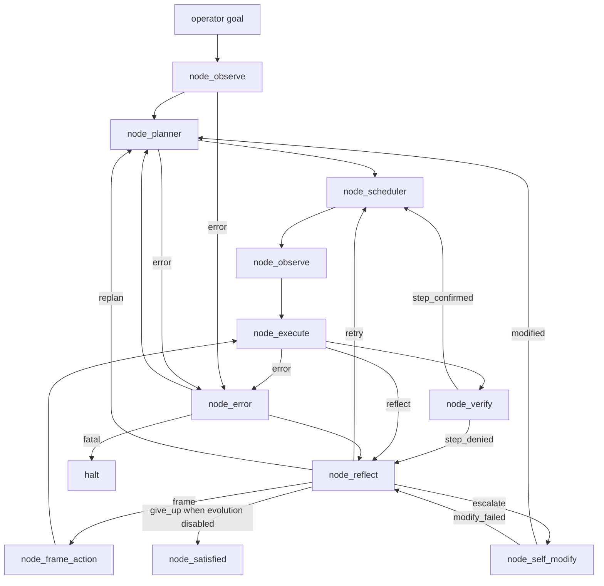
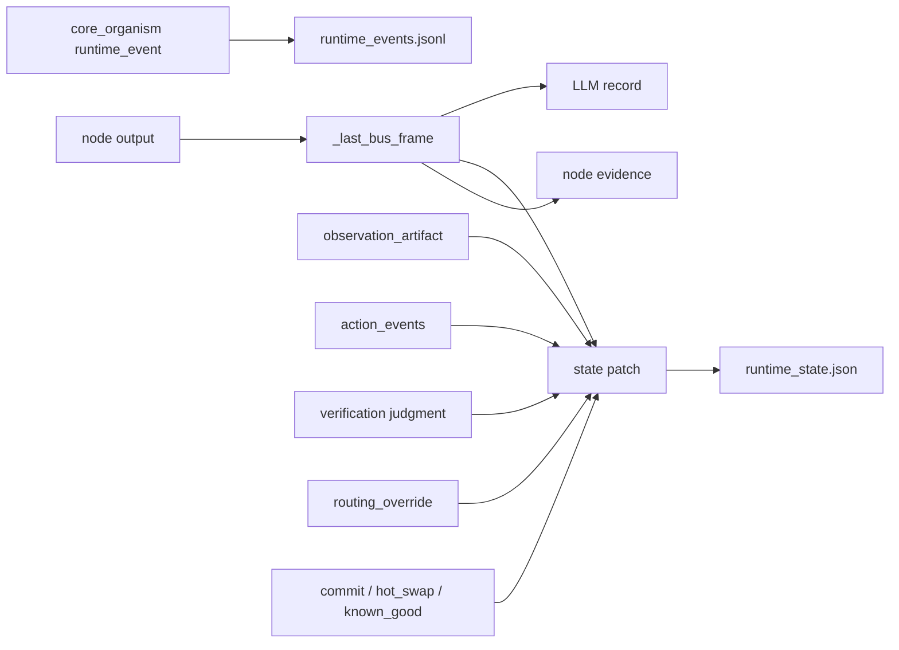
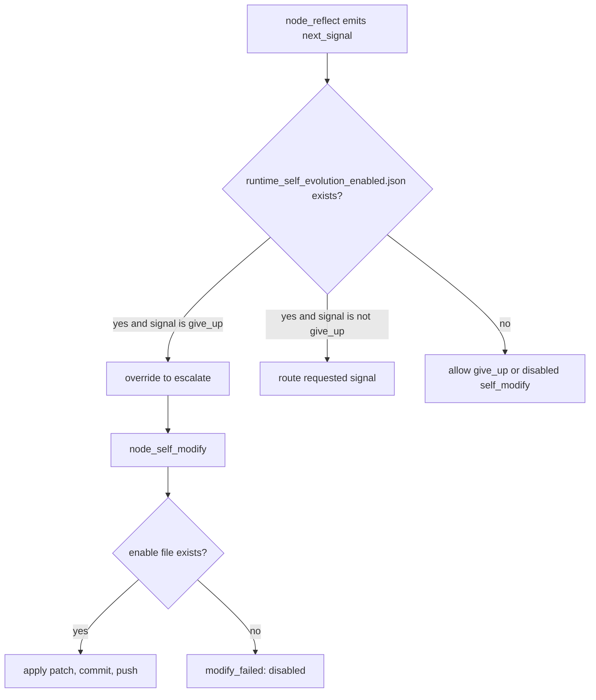
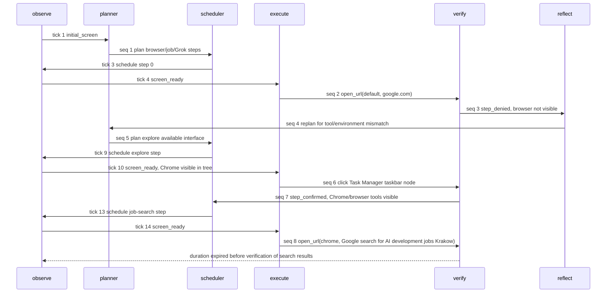

# endgame-ai

`endgame-ai` is a local Windows desktop organism built around one auditable bus:
observe, plan, schedule, execute, verify, reflect, and self-modify. It is not a
single startup-style MVP flow. The target architecture is task-agnostic: the goal
can be job search, browser research, document work, GUI operation, or repo repair,
and the same organs should route the work through observation, evidence, action,
verification, reflection, and evolution.

This README is written from the 2026-07-07 forensic session on branch
`prompts-adjust` after real desktop runs, log replay, patches, commits, and pushes.
It intentionally lists what works and what is still weak.

## Current Status

The system is now useful as a real desktop research/action harness with replayable
logs and autonomous self-evolution controls. It can observe Windows UIA elements,
ask an LLM for plans and executable actions, perform desktop helper actions such
as opening Chrome, verify visible effects, replan on mismatch, and commit code
changes through its self-modify node.

It is not yet reliable enough for unattended high-value task completion such as
fully applying to jobs, tailoring CV documents, and submitting forms. The latest
3-minute job-search run opened Chrome and navigated to a Google search for AI
development jobs in Krakow, but it expired before it verified search results,
reached Grok, gathered offers, tailored documents, or submitted an application.

## Architecture



The body is Python modules in the repo root:

- `core_organism.py`: run loop, state persistence, runtime events, duration stop.
- `core_bus.py`: bus records, node outputs, state summaries, failure streaks.
- `core_nodes.py`: node loading, git/self-evolution helpers, action runtime.
- `core_observation.py`: Windows UIA raw scan, filter, hierarchy map, LLM text.
- `core_desktop.py`: desktop actions, browser launch, typing, keypresses.
- `core_stop_check.py`: runtime stop file and self-evolution enable file.
- `node_*.py`: organism organs.
- `transport_xai.py`, `transport_openai.py`, `transport_opencode.py`,
  `transport_file_proxy.py`: LLM transports.
- `wiring.json`: prompts, topology, limits, observation knobs, self-modify config.

## Bus And Audit Schema

Every node returns one `endgame.node_output.v1` frame. Runtime events are JSONL in
`runtime_events.jsonl`. The current enriched bus frame includes the full record,
patch, evidence, patch keys, and evidence keys, making replay possible from logs.



Important runtime artifacts:

- `runtime_state.json`: latest state snapshot.
- `runtime_events.jsonl`: replay log of node starts, completions, brain requests,
  brain responses, self-modify events, duration expiry, and halt events.
- `runtime_stop.json`: presence requests stop.
- `runtime_self_evolution_enabled.json`: presence enables self-evolution.
- `runtime_known_good_commit.json`: local audit of known-good ref updates.

Runtime files are intentionally not normal source artifacts.

## Self-Evolution Gate

`runtime_self_evolution_enabled.json` is the control file for evolution.

- Present: `node_self_modify` may apply, commit, and push approved code patches.
- Absent: `node_self_modify` fails closed and reports disabled status.
- Present: `node_reflect` may not route to `give_up`; if the brain asks for
  `give_up`, the body overrides it to `escalate` and logs the override.
- Absent: `give_up` is allowed because evolution is no longer available.

This file is created by reset through `core_stop_check.ensure_self_evolution_enabled`.
Deleting it is the explicit operator switch for disabling evolution.



## Known-Good Hot Swap

Hot swap no longer depends only on a stale SHA inside `wiring.json`.

Operational source:

- Git ref: `refs/endgame/known_good`
- Seed fallback: `self_modify.known_good_commit` in `wiring.json`
- Audit file: `runtime_known_good_commit.json`

Successful self-modify commits update `refs/endgame/known_good`. When
`self_modify.git.push_after_commit` is true, the branch and the known-good ref are
pushed to the configured remote. Hot swap now checks whether each target path
exists in the known-good commit before checkout and returns
`missing_in_known_good` instead of crashing on Git pathspec errors.

This fixed the observed failure where the old known-good commit predated
`export_brain_forensics.py`, causing `git checkout OLD -- export_brain_forensics.py`
to fail. The live organism tried to delete that exporter as a symptom-level repair;
the exporter has been restored and the hot-swap mechanism has been corrected.

## Observation Knobs

The observation limits in `wiring.json` have been raised and made auditable:

```json
{
  "max_subtree_nodes_per_point": 8000,
  "max_total_nodes": 40000,
  "max_llm_nodes": 5000,
  "max_action_nodes": 12000,
  "max_depth": 24,
  "max_children_per_window": 240
}
```

`max_llm_nodes` used to be present in configuration but was not used by the mapper.
It is now enforced while rendering `desktop_tree_text`, and these fields are logged:

- `rendered_node_count`
- `max_llm_nodes`
- `llm_node_limit_hit`

Evidence:

- Earlier smoke after UIA access-denied recovery: 312 unique raw nodes, 24
  actionable elements.
- Direct observation after raising knobs: 432 unique raw nodes, 28 actionable
  elements, 29 rendered nodes, `max_llm_nodes=5000`, `limit_hit=false`.
- Final 3-minute run before Chrome: 484 unique raw nodes, 31 action elements,
  32 rendered nodes.
- Final 3-minute run after Chrome opened: 546 unique raw nodes, 63 action
  elements, 65 rendered nodes, `limit_hit=false`.

The knob works. In the current screens it did not hit the 5000-node render cap,
but the run proved more visible/actionable elements after Chrome appeared.

## Latest Real Run

Command shape:

```powershell
& "C:\Users\px-wjt\AppData\Local\Python\bin\python.exe" core_organism.py --reset --duration-seconds 180 "<goal>"
```

Goal used:

```text
Use the real Windows desktop to gather AI development job offers in Krakow,
communicate with Grok through a browser GUI when available to compare the offers
against the user's profile context, tailor application materials if an offer
requires them, and attempt at least one real application workflow.
```

Run summary:

- Start: `2026-07-07T12:21:47`
- Events in final run segment: 48
- Brain requests/responses: 8/8
- Node starts: observe 4, planner 2, scheduler 3, execute 3, verify 2, reflect 1
- Stop reason: `duration_expired`
- Final tick: 15
- Final node: `node_verify`
- Final active step: gather AI development job offers in Krakow

Failure chain:



Observed action evidence:

```json
{
  "action": "open_url",
  "browser": "chrome",
  "url": "https://www.google.com/search?q=AI+development+job+offers+Krakow",
  "exe": "C:\\Program Files\\Google\\Chrome\\Application\\chrome.exe",
  "ok": true
}
```

The run showed real progress:

- Chrome was opened and became visible to UIA.
- The system recovered from an initial false denial by replanning.
- It performed a real Chrome navigation to an AI job search query.

The run did not complete:

- No Grok GUI conversation occurred.
- No offers were extracted.
- No CV or documents were created.
- No application form was filled or submitted.

## Patches From The Forensic Session

Committed and pushed on branch `prompts-adjust`:

- `88a538d` - Harden action bus and self-evolution gate.
- `443cf8e` - Recover from inaccessible UIA probe points.
- `842e471` - Live self-modify symptom commit deleting the forensics exporter.
- `5ba2533` - Wire known-good ref and observation visibility, restore exporter.
- `50a0b98` - Push known-good ref after self-modify commits.
- `47a8a40` - Block desktop actions after run deadline.

Remote ref:

- `refs/endgame/known_good` pushed at `47a8a40`.

## Accepted And Rejected Changes

Accepted:

- Full bus trace in runtime events.
  Why: future replay needs actual record, patch, and evidence, not just patch keys.
  Why not not enough: no downside except larger logs, and logs are the audit trail.

- Per-point UIA access-denied recovery.
  Why: one inaccessible point should not kill the entire observation pass.
  Why not broad exception swallowing: point errors are counted and logged; the
  scan still fails for structural config errors.

- Strict action helper evidence.
  Why: execute must prove it acted through `action_events`.
  Why not silent success: executor now fails if no result, stdout, stderr, or
  body action exists.

- Self-evolution file gate.
  Why: evolution needs an explicit runtime switch.
  Why not config-only: a file mirrors the existing stop-file control pattern and
  is easy for the operator or scripts to toggle.

- `give_up` blocked while evolution is enabled.
  Why: if the organism can evolve, `give_up` is not a coherent recovery route.
  Why not prompt-only: the body enforces it even when the LLM emits `give_up`.

- Known-good Git ref.
  Why: a static commit in JSON becomes stale immediately.
  Why not write current SHA into the same commit: a commit cannot contain its own
  final SHA. A Git ref is the correct moving pointer.

- Hot-swap target filtering.
  Why: known-good commits may predate new files.
  Why not broad whole-repo hot-swap: broad swaps mutate unrelated files and hide
  the failing target.

- Observation visibility counters.
  Why: `max_llm_nodes` must be measured from logs.
  Why not only raising numeric limits: an unused knob is dead configuration.

- Deadline guard before body actions.
  Why: an LLM response can arrive after duration expiry.
  Why not rely on loop-level checks: the loop checks between nodes, not inside a
  long brain response or multi-action execute script.

Rejected:

- Hard-coded Opera-to-Chrome fallback in prompts.
  Why rejected: task-specific fallback would make the system less task-agnostic.
  The correct body behavior is explicit tool availability evidence and replanning.

- Leaving the forensics exporter deleted.
  Why rejected: deletion treated a hot-swap pathspec crash as the file's fault.
  Replay tooling is part of the audit system and must remain.

- Treating absent browsers as organism code bugs.
  Why rejected: unavailable tools should route to replan, equivalent discovery,
  or explicit install steps.

- Continuing to use only `known_good_commit` from `wiring.json`.
  Why rejected: it already failed as a stale recovery pointer.

## MoE Analysis

Forensic expert:

- The system is much more auditable now. Every node has start and completion
  events, bus frames carry record/patch/evidence, observation artifacts contain
  scan config and scan stats, and action events prove actual desktop calls.
- Remaining gap: `runtime_events.jsonl` can become very large. Replay tooling
  exists, but run-level slicing should become a first-class command.

Windows desktop automation expert:

- UIA scanning is good enough to see Chrome and actionable UI controls.
- Access-denied points are now evidence instead of fatal failure.
- Remaining gap: browser web content through UIA is incomplete. Chrome may show
  browser chrome while page content is sparse or delayed. A CDP/browser-control
  transport or DOM-level bridge is needed for robust web tasks.

Agent architecture expert:

- The organ topology is coherent: observe, plan, act, verify, reflect, evolve.
- Reflect correctly replanned after visible evidence contradicted helper success.
- Remaining gap: high-latency brain calls consume most of a 180-second run. The
  system needs smaller prompts, faster model settings, or per-node time budgets.

Self-evolution expert:

- The enable file, known-good ref, path-filtered hot swap, and ref push make
  evolution less fragile.
- Remaining gap: the live self-modify commit deleted a useful file. Future
  evolution should require stronger evidence of root cause before destructive
  deletes, even while remaining fail-hard.

Product usefulness expert:

- Useful today for supervised desktop experiments, repo self-repair, and
  observing whether an autonomous loop can make real GUI progress.
- Not yet useful as a fully trusted job-application agent. It cannot yet
  reliably collect offers, talk to Grok, tailor documents, and submit forms in
  one unattended run.

Operator-risk expert:

- The system can now share data with external browser services when the operator
  asks. Logs retain evidence of what was attempted.
- Real form submission still needs hard facts, credentials, profile data, and
  visible confirmation. Ambiguous submissions should block rather than invent.

Meta-critique of this session:

- I should have identified the stale known-good SHA before the user explicitly
  called it out. The symptom was visible in the pathspec failure.
- I patched the run-deadline guard after the 3-minute run exposed it. That should
  have been part of the first audit pass because duration is a control boundary.
- I initially let aggregate log counts include prior runs. The final analysis
  corrected this by slicing from the last `organism_start`.
- The final run proved progress but not completion. The correct conclusion is
  "useful but not yet reliable for full task completion."

## What Is Still Not Working Properly

1. Browser content extraction is weak.
   Chrome can open, but the organism depends on UIA and may not see enough page
   DOM content to extract job listings. This blocks robust web research.

2. Grok GUI integration was not reached.
   The organism opened Google search but did not navigate to Grok, authenticate,
   ask profile-context questions, or read Grok responses during the 180-second run.

3. LLM latency dominates run time.
   Eight brain responses took most of the 3-minute budget. The planner/executor
   prompts are still too heavy for short live runs.

4. Verification can be temporally brittle.
   The first browser launch reported action success but verification denied it
   because the next observation did not yet show a browser. Later observations
   showed Chrome. Open-url actions need a wait/observe polling contract.

5. The executor sometimes chooses indirect UI clicks.
   After Chrome was visible, it clicked the Task Manager taskbar button to
   explore tools instead of directly using known browser navigation. This is a
   prompt/strategy weakness, not a desktop capability failure.

6. Self-evolution needs better destructive-change judgment.
   The live organism deleted `export_brain_forensics.py` to work around a
   hot-swap bug. The architecture now protects that exact case, but destructive
   changes still need stricter root-cause evidence.

7. Run replay needs a dedicated summarizer.
   `export_brain_forensics.py` exists, but runtime run segmentation and concise
   forensic summaries should be first-class commands.

## Next Engineering Focus

Highest leverage:

1. Add browser DOM/CDP observation for Chrome.
   UIA should remain the generic desktop layer, but web tasks need page text,
   links, form fields, and submitted navigation state from the browser.

2. Add action wait contracts.
   `open_url` should return after a bounded wait for a matching browser window or
   page title, or return a hard failure with observed evidence.

3. Add per-node time budgets.
   The organism should know when a brain response consumed too much time and
   adapt before entering a slow execute/verify loop.

4. Compress prompts and state payloads.
   Keep the bus auditable in logs, but send smaller targeted payloads to the LLM.

5. Make run slicing a command.
   Add a small first-party command to summarize the last run: event counts, node
   chain, action evidence, observation counters, failures, and final state.

6. Add a profile/document memory contract.
   For job applications, the system needs explicit profile facts, resume files,
   and consent boundaries before tailoring or submitting applications.

## Running

Use the project Python on this machine:

```powershell
& "C:\Users\px-wjt\AppData\Local\Python\bin\python.exe" core_organism.py --reset --duration-seconds 180 "<goal>"
```

Compile check:

```powershell
& "C:\Users\px-wjt\AppData\Local\Python\bin\python.exe" -m compileall -q .
```

Validate wiring:

```powershell
& "C:\Users\px-wjt\AppData\Local\Python\bin\python.exe" -m json.tool wiring.json | Out-Null
```

Export brain forensics:

```powershell
& "C:\Users\px-wjt\AppData\Local\Python\bin\python.exe" export_brain_forensics.py --input runtime_events.jsonl --out-dir .
```

Stop a running organism:

```powershell
@{
  schema = "endgame-ai.stop.v1"
  reason = "manual stop"
} | ConvertTo-Json | Set-Content runtime_stop.json
```

Disable self-evolution:

```powershell
Remove-Item runtime_self_evolution_enabled.json
```

Re-enable self-evolution:

```powershell
& "C:\Users\px-wjt\AppData\Local\Python\bin\python.exe" -c "import core_stop_check as s; s.ensure_self_evolution_enabled(source='manual')"
```

## Future Session Handover Prompt

Use this prompt at the start of the next repair session:

```text
You are continuing endgame-ai on branch prompts-adjust.

Start by reading the repo and latest runtime logs. Do not assume the README is
truth unless it matches code and runtime_events.jsonl. The latest pushed commits
include:
- 88a538d Harden action bus and self-evolution gate
- 443cf8e Recover from inaccessible UIA probe points
- 5ba2533 Wire known-good ref and observation visibility
- 50a0b98 Push known-good ref after self-modify commits
- 47a8a40 Block desktop actions after run deadline

The known-good ref refs/endgame/known_good is pushed at 47a8a40.
runtime_self_evolution_enabled.json controls whether self-modify can apply,
commit, and push. While it exists, node_reflect must not give up.

Latest real run on 2026-07-07 opened Chrome and navigated to:
https://www.google.com/search?q=AI+development+job+offers+Krakow
It did not reach Grok, extract job offers, tailor documents, or submit an
application. The run expired at tick 15 while node_verify was next.

Focus next on browser DOM/CDP observation, action wait contracts for open_url,
per-node time budgets, prompt compression, and a first-party last-run summarizer.
Keep changes task-agnostic. Do not hard-code job-search flow. Preserve fail-hard
contracts, explicit evidence, and replayability from runtime_events.jsonl.
```

