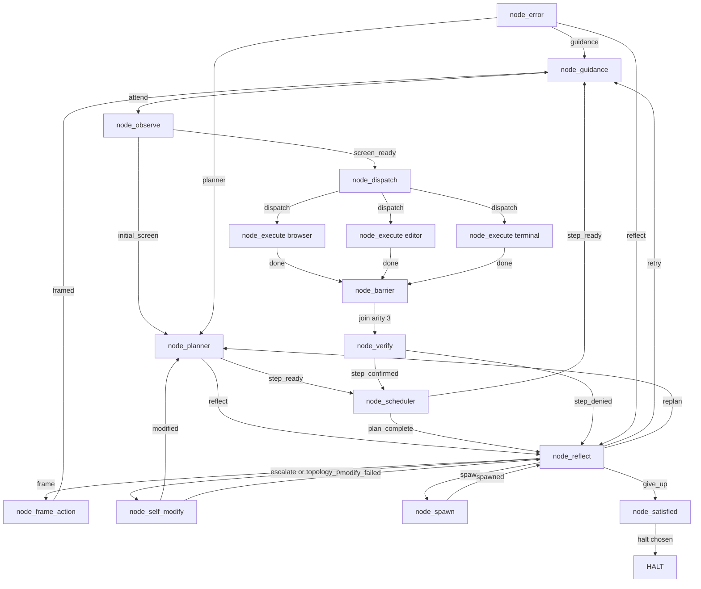
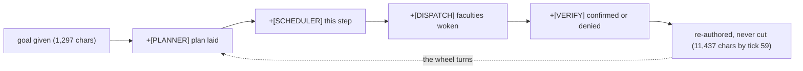
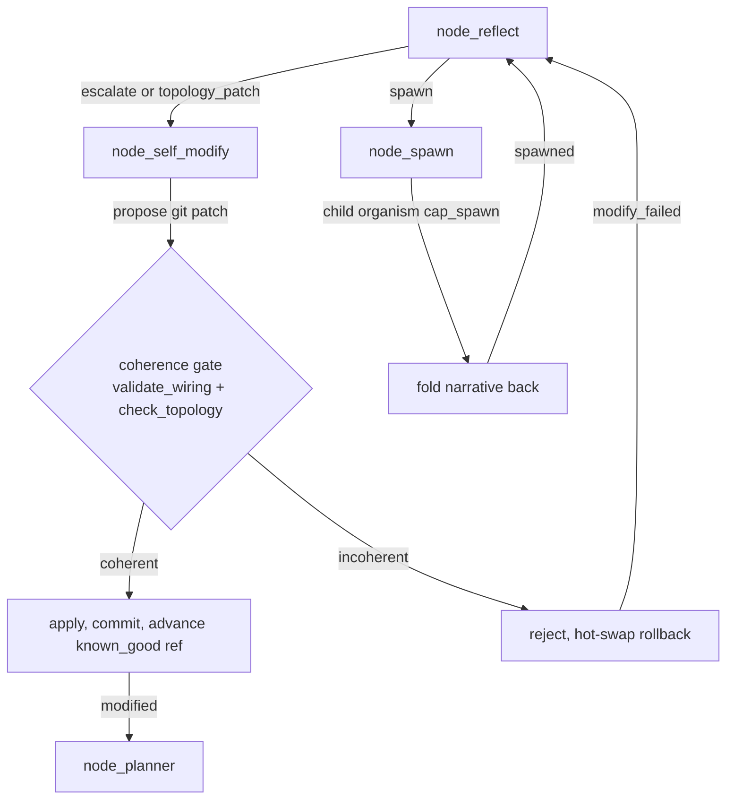

# endgame-ai

A task-agnostic organism that operates a Windows 11 desktop the way a person does: it sees the screen through UI Automation, moves the hands (clicks, types, runs Python and shell commands), and carries a single goal-narrative that every node rewrites as it passes through. It is not a pipeline with a first step and a last step. It turns through its nodes on a wheel and stops only when it decides to.

This README is written to be read by both humans and AI, in plain English. It separates **what has been proven to run** from **what is built but not yet exercised**, because both are facts and confusing them is how systems get misunderstood. The reference for the proven claims is the live run of 2026-07-09 (analyzed in full in `ANALYSIS_run_20260709.md`) together with an earlier run on 2026-07-08.

## What it does, in one honest paragraph

You give it a goal in ordinary words. It observes the actual desktop, plans, wakes the faculties a step needs (browser, editor, terminal), acts with real Python it writes on the spot, checks its own work on the evidence, reflects when blocked, and loops. There is no task-specific code inside it — the same 16 nodes handle "configure a LinkedIn profile" and "edit a document" and anything else, because the behavior comes from the goal-narrative and the model, not from branches wired for a particular task. **This is the core design commitment: the system is task-agnostic. No task-specific fixes are ever added to it.**

### Why that matters for everyday work

Most agent frameworks reach a real desktop only through a stack of glue: a browser-automation SDK, tool schemas, RAG, MCP servers, plugins, skill definitions. This one reaches the desktop with a handful of Python files and no such stack — **no `pip install` of an agent SDK, no RAG, no MCP, no skills, no tool registry.** When it was asked to open a browser, work on LinkedIn, and analyze a GitHub repository, it opened Chrome, clicked and navigated, and wrote its own Python against a small capability runtime. If you do repetitive desktop work (fill a form, read a screen and react, drive a web app, run a sequence of commands and verify the result), the claim here is that a very small, general substrate can do it without bespoke automation per task. That claim is now substantially proven for the operating loop (see below) and still open for the self-transformation features.

---

## Proven vs. not-yet-proven (read this before believing anything else)

**Proven to run** (observed on the Windows host, in `runtime_events.jsonl` and the model API log):

- **The wheel turns.** In the 2026-07-09 run it completed **12 full laps (59 ticks, ~111 seconds)** without the substrate imposing any stop; it halted only on an external condition (see "What actually ended the run").
- **All three faculties fan out and gather.** `node_dispatch` woke `node_execute:browser/:editor/:terminal`, and `node_barrier` (arity 3) joined them back into one flow every lap (36 barrier visits, 12 joins).
- **It does real desktop work.** It opened Chrome by clicking its taskbar icon (`click_node`), navigated to LinkedIn (`open_url`), clicked the profile avatar to confirm the logged-in session, then navigated to this repository on GitHub and began extracting its own skills — all with Python it wrote on the spot.
- **It judges honestly.** `node_verify` **denied its own steps three times** when the evidence was insufficient, and confirmed only when it was justified. It never claimed success it could not prove.
- **It reasons when blocked.** `node_reflect` chose `retry` and `frame` with written diagnoses — not a fixed fallback. When the execute faculty found itself on the wrong screen (LinkedIn, but the step needed GitHub) it **returned `FRAME` and refused to fake the step**; reflect routed to `node_frame_action`, which summarized the screen and set a new target.
- **The narrative is never truncated.** `effective_goal` grew monotonically from **1,297 characters (tick 0) to 11,437 characters (tick 59)** and never shrank.
- **Model I/O is clean and efficient.** **23 model calls drove all 59 ticks** (mechanical nodes cost nothing); all 23 finished cleanly, structured-output JSON parsed every time, **24% of prompt tokens were cache hits**, and the whole run cost **~$1.27**.
- **The off-host gates pass:** `py_compile` clean, WSL-safe imports load, `check_topology.py` exits 0 (16 nodes, 9 record contracts coherent).

**Built but not yet exercised in a live run** (real code, honest unknowns):

- `node_self_modify` (git-backed code/wiring rewrite) and its coherence gate + hot-swap safety net — wired and reachable, but **the organism has never chosen to rewrite itself** in a run (0 visits on 2026-07-09; the branch stayed at commit `9dd05dd`).
- `node_spawn` / `cap_spawn` (a node begetting a child organism) — implemented and depth-gated, not yet chosen by the organism during a live run.
- **Full task completion end to end** — the 2026-07-09 run got as far as beginning skills extraction; no LinkedIn field was written before the run ended.
- **Longer autonomous runs** — the longest observed run so far is ~111 seconds; multi-minute runs are unproven.
- `guidance.txt` steering — read by `node_guidance` in runs, but not yet used to bend a live run toward a changed course.
- `node_satisfied` reached by deliberate rest — never reached; runs ended externally.

Treat the second list as promising and plausible, not as demonstrated.

---

## What actually ended the 2026-07-09 run

Not a logic fault and not self-evolution. After the last completed lap, the end-of-lap state save failed: `core_wiring.atomic_write_json` writes a temp file and then `os.replace`s it over `runtime_state.json`, and on Windows that replace raised **`PermissionError: WinError 5 (Access denied)`** because the destination file was momentarily locked by another process (a held file handle). A leftover `runtime_state.json.tmp.*` on disk confirms the rename never completed. The organism did not fall; the floor was pulled out from under it while it was saving. The one hardening this points to — a bounded retry on `os.replace` — is substrate resilience, not a task branch, and is listed under Next steps.

---

## The measurable result of the refactor: less code, not more

The most recent refactor moved the record contracts, the capabilities, and one shared creed-prefix (previously duplicated across all 16 node prompts) into `wiring.json` as the single source of truth, and removed defensive `.get()` fallbacks. Measured in bytes against the previous commit:

```
wiring.json:        69,222 -> 29,286 bytes   (~58% smaller; the creed appears once, not 17 times)
whole tracked tree: 247,350 -> 196,498 bytes (-20.6%)
```

Git's line count showed a net increase, but that is a formatting artifact: 17 crammed one-line prompt copies were replaced by one prefix plus pretty-printed multi-line JSON. The honest measure is bytes, and the repository got smaller and less repetitive while behavior held.

---

## The wheel (this is the live topology)

`wiring.json` is the wheel. It is entered at `node_guidance` — that is where an already-turning wheel is picked up each lap, not a "start." Every path returns to the wheel; nothing dead-ends. `node_dispatch` fans out to all three faculty instances; the chosen ones work, the unchosen pass through idle; all three converge on `node_barrier`. The only way to `halt` is a deliberate choice through `node_reflect → give_up → node_satisfied`.



16 wired nodes, `cycle_start = node_guidance`, `topology.barriers = {"node_barrier": 3}`.

### What each node actually did in the 2026-07-09 run

This is observed behavior, not intended behavior:

- **node_guidance** — entered the wheel each lap, folded any `guidance.txt` into the narrative (none was supplied), passed on.
- **node_observe** — scanned the desktop via UIA and produced screen text the planner and faculties could read.
- **node_planner** — turned the plain-words goal into an ordered 4-step intent (open Chrome → LinkedIn → analyze the endgame-ai GitHub repo → craft the profile), each step with a `done_when` condition.
- **node_scheduler** — set the single next step before the hands; advanced after a confirmed verification.
- **node_dispatch** — chose which faculties to wake and fanned out to them; unchosen faculties idled.
- **node_execute (browser/editor/terminal)** — wrote and ran Python: `click_node` on the taskbar Chrome icon and on the LinkedIn avatar, `open_url` to LinkedIn and to the GitHub repo, and began scanning the page for skills. It tracked the deadline ("~8 min remaining").
- **node_barrier** — gathered all three faculties (arity 3) into one flow before judgment, every lap.
- **node_verify** — confirmed or denied on evidence only; denied three times when proof was missing, confirmed when it arrived.
- **node_reflect** — on denial chose `retry` (with a diagnosis) and once `frame` (to resolve a context mismatch).
- **node_frame_action** — summarized the screen ("LinkedIn profile page … no GitHub tab open") and set the next target.

Nodes wired and prompted but **not exercised** in this run: **node_self_modify, node_spawn, node_satisfied, node_error** (no stumble occurred that needed it).

---

## Memory and sanity: the goal-narrative

There is one piece of memory that matters: `state["effective_goal"]`. Every node appends a clearly-tagged line describing what it did and understood (`[PLANNER]`, `[SCHEDULER]`, `[DISPATCH]`, `[VERIFY]`, and so on). It is never truncated — a missing field is treated as a bug to fix at its source, never patched with a default, and the narrative is never cut with `str[:N]`.

This narrative is also the sanity mechanism. Because each node re-tells the shared goal in its own words, the state does not simply repeat, and a company of fallible LLM nodes holds itself to one purpose. Coherence here is psychological — it comes from the re-telling — not from control-flow guardrails. In the 2026-07-09 run this is exactly what was observed: the narrative grew steadily and never shrank across 59 ticks, and when a step was denied the next nodes reasoned from the plainly-recorded reason.



---

## Steering: guidance, not command

The only external steering surface is the workspace file `guidance.txt`. At the top of each lap, `node_guidance` reads it, folds it into the narrative as a strong, clearly-tagged, ignorable signal, and consumes the file. The organism may act on it or not — the node company decides. You steer it the way you advise a colleague, not the way you call a function. (This surface was read in runs but has not yet been used to change a live run's course — see the not-yet-proven list.)

The one genuinely external control is the operator's leash for finite development runs: `--duration-seconds`, a stop file, and pause/step. That leash sits outside the organism's biology — a cage door, not part of the creature. Run with `duration_seconds=None` and it turns without a time bound.

---

## Self-modification and recursion (built, not yet exercised live)

`node_reflect` can route to `node_self_modify` when the organism's own code or wiring must change. Self-modify proposes a git-backed patch (files to read/write/delete, wiring patches, commands, expected validation). Applied changes are gated: `core_wiring.validate_wiring` and `check_topology.coherence_problems` must pass, and a known-good ref (`refs/endgame/known_good`, currently `9dd05dd`) plus hot-swap guard against a bad self-edit. Commits land on the checked-out branch (`context_mode: checked_out_branch`) and push via `origin` when configured, so a run on a disposable branch keeps `main` clean. `node_spawn` can raise a child organism (`cap_spawn`, depth-gated) on the inherited narrative and fold its result back — because a node and an organism are the same shape.

Both mechanisms are implemented and reachable in the topology. **Neither has yet been triggered by the organism during a live run.** When they are, this section will be updated with observed behavior.



---

## Prompts: cache-aware, plain-contract, no examples

Each node's prompt is `wiring.shared_prompt_prefix` (one creed shared by all nodes) plus the node's own fragment in `wiring.prompts`; `wiring.prompt_aliases` lets the `node_execute:*` instances reuse the base execute prompt. The dynamic payload (goal-narrative, step, observation, evidence) is serialized into the user role and delivered last, once, under a single top-level `observation` key. The split is deliberate: the static system content is cacheable across turns, and only the small dynamic tail changes — and in the 2026-07-09 run 24% of prompt tokens were served from cache, confirming the design pays off.

The record contract for each node — record type, required fields, allowed signals — lives in `wiring.record_contracts` and is read by `core_brain` to validate every record and to build the structured-output schema. (These contracts used to be hardcoded in Python as `_RECORD_RULES`; that mirror was removed in the refactor, so `wiring.json` is now the single source of truth.) Hard rules are written in a commandment register on purpose — a phrasing that resonates in the training data and keeps the model steadily controllable. There are no few-shot examples; the schema is the instruction.

---

## Architecture

### Substrate (the small, stable core)

| Module | Role |
|---|---|
| `core_organism.py` | Turns the wheel: load a node, call it, validate its signal against the topology edge, apply the patch, route to the next node(s). Imposes no ending. |
| `core_loader.py` | Dynamic, file-based plugin loading (`load(kind, name, w)` → `<prefix><base>.py`). No registry. Splits `node_execute:browser` into base + instance. |
| `core_node_base.py` | The one abstract base, `BaseNode` (think → build_payload → signal → patch). Threads `node_base` / `node_instance` into `ctx`. |
| `core_bus.py` | Records, signals, `emit`, `validate_signal`, narrative briefs, `observation_brief`. |
| `core_brain.py` | The LLM call: system/user message assembly, record contracts (from `wiring.record_contracts`), prompt-cache key, structured outputs, runtime-event logging. |
| `core_wiring.py` | Loads and validates `wiring.json`; `root_path`; atomic state I/O; git ops. |
| `core_state.py` | State persistence, tick, and the operator leash (`wait_before_node`, duration expiry). |
| `core_stop_check.py` | The stop file / pid — part of the operator leash. |
| `check_topology.py` | The coherence gate: reachability from `cycle_start`, no dangling targets, barriers have a join edge and positive-int arity, contracts coherent. Used by both the CLI and the runtime self-modify gate. |
| `core_nodes.py`, `core_desktop.py`, `core_observation.py` | Capability runtime plus the UIA eyes and hands. Windows-only (import `comtypes`). |
| `cap_spawn.py` | The child-organism capability invoked by `node_spawn`. |
| `transport_xai.py` | The real transport (xAI HTTP), used on the Windows host in both runs. |
| `transport_file_proxy.py` | Off-host debug transport: writes the request to disk; an operator answers as the model. |

### Observation system (UIA)

`core_observation.py` runs a three-phase pipeline — **RAW grid probe → FILTER → MAP** — driven by `wiring.observe_config`. It renders a compact, LLM-readable desktop tree plus an `action_index` of clickable node ids; the hands act by referencing those ids (e.g. `click_node('W1E8')`). Windows-only via `comtypes`. Focused re-scans are available inside the execute runtime via `observe_area(...)` and `observe_with_config(...)`.

```
W0 Screen Desktop
  W1 Windows PowerShell
    W1E1 Button ... [click]
  W2 Chrome - linkedin.com
    W2E1 Edit Search [write]
    W2E2 Button Me [click]
```

### The nodes

Mechanical (no model): `node_observe`, `node_barrier`, `node_satisfied`, `node_error`.
LLM (strict record): `node_guidance` (`guidance`), `node_planner` (`plan`), `node_scheduler` (`schedule`), `node_dispatch` (`dispatch`), `node_execute` faculties (`execution`), `node_verify` (`verification`), `node_frame_action` (`action_frame`), `node_reflect` (`reflection`), `node_self_modify` (`git_evolution_patch`). `node_spawn` runs the `cap_spawn` capability.

### The bus law

Every node emits `(signal, patch)`. The bus validates that the signal is a legal edge out of that exact node instance, applies the patch to state, increments the tick, and routes to the next node(s). A fan-out edge is a list; a fan-in barrier waits until its arity is met.

---

## Running it

The organism runs on Windows 11 because the eyes and hands need real UI Automation. From the repo root on the host:

```bash
# Bounded development run (operator leash), fresh state
python core_organism.py "your goal in plain words" --reset --duration-seconds 120

# Resume where it left off (no --reset)
python core_organism.py "your goal" --duration-seconds 300
```

For an unbounded run (the organism proper), omit the leash in code (`duration_seconds=None`).

CLI flags (`core_organism.main`): `goal` (positional), `--reset`, `--duration-seconds` (default 120), `--brain-call-budget`, `--start-node`, `--wiring`.

Configure the model in `wiring.json → model` (`transport = transport_xai`; per-node `reasoning_effort` / `max_output_tokens` under `model.organs`). Steer a running organism by writing into `guidance.txt`. Task files the organism creates land in the repo directory by design (its working directory), so its own output is visible to it on the next observation. Watch it think in `runtime_events.jsonl` — every brain request and response is logged there, and reading that file is how you evaluate a run.

### Reading a run

Evaluate liveness and coherence, not task completion. Good signs: the wheel keeps turning through varied nodes; the narrative advances and stays untruncated; faculties fan out and the barrier gathers them; a stumble re-narrates and the wheel continues; verify denies its own unproven steps. Worrying signs: a mechanical dead-loop (one node erroring repeatedly with no narrative motion), or the same framework error recurring identically (that is a real bug to fix at the source). A faculty's self-written code failing once and being corrected on a later lap is the organism adapting, not a defect.

### Developing off-host (WSL / Linux)

The acting nodes (`node_execute`, `node_observe`, and anything importing `core_desktop` / `core_nodes`) cannot import off Windows (`comtypes`). Everything else is pure Python. The gates run anywhere:

```bash
python3 -m py_compile *.py
python3 -c "import core_organism, core_bus, core_wiring, core_state, check_topology"
python3 check_topology.py    # exit 0 = coherent wheel
```

Push from WSL via the Windows host git (uses the Windows credential store):

```bash
git.exe -C 'C:\Users\ewojgab\Downloads\endgame-ai' push origin <branch>
```

---

## The rules this system depends on (read before changing anything)

These are not style preferences. A change that violates them is wrong even if it appears to work.

1. **Task-agnostic, always.** Never add task-specific handling. The same nodes must serve any goal. If a fix only helps one kind of task, it does not belong in the system — improve the prompt, the contract, or a capability instead.
2. **System = nodes + wiring, everything hot-swappable.**
3. **No branching, fallbacks, defensive coding, or ceremony. Fail hard and loud.** A missing key is a bug to fix at its source, not a defaulted `.get`. Prefer deleting code to adding it. Requirements live in `wiring.record_contracts`, not Python mirrors.
4. **Plugins are dynamic and file-based** — no compile-time registry. The organism must be able to write a new `node_*.py` at runtime and load it with zero core change.
5. **Keep the load-bearing organs alive:** hot-swap, self-modify, and the coherence gate.
6. **When the graph changes, change the prompts and record contracts with it.** Keep the commandment register for hard rules.
7. **The narrative is never truncated.**
8. **A failure is information for the narrative, not a branch to add.** It already routes through `node_error`. The fix is usually a clearer prompt, a better-narrated failure, or a new capability the organism can choose — not an `if` in the core.
9. **This README is the single living handover.** Update it after every change. Verify, then commit, one coherent step at a time.

---

## Next steps

Behavioral and resilience work — the structure is complete and coherent.

- **Harden the state-save.** The 2026-07-09 run was ended by a transient Windows file-lock on `os.replace` (WinError 5). A bounded retry-with-backoff there would make the organism robust to exactly this class of environmental interruption — substrate resilience, not a task branch.
- **Longer runs toward a completed goal.** The longest observed run is ~111 seconds. Run several minutes and watch a multi-step goal proceed to completion. Judge liveness and coherence.
- **First self-chosen self-modification and spawn.** Both are built and untested live. Watch for the organism reaching `node_self_modify` or `node_spawn` on its own, and record the behavior here. The 2026-07-09 goal explicitly invited self-improvement, yet reflect never chose to evolve — understanding why is itself a compelling open question.
- **Event-log rotation.** `runtime_events.jsonl` reached ~4.9 MB in ~2 minutes; long runs need compaction/rotation.
- **Observation content reduction (deferred).** The observation is already produced once and rendered once; reducing the *content* of that single scan at the source (`core_observation` / `core_desktop`) is a known, still-deferred optimization. Current behavior is workable.

---

## History

- **Substrate B1–B5** — list edges, frontier fan-out scheduler, `node_barrier` fan-in, `cap_spawn` recursive child organism, the topology-coherence gate.
- **F1** — removed the endings the substrate imposed (no error-streak halt, no completion terminus). Stopping became the organism's own choice only.
- **F2** — goal-file steering: `node_guidance` at the wheel's entry folds `guidance.txt` into the narrative as a strong, ignorable signal.
- **F3** — the fractal wheel: `node_dispatch` selects faculties and fans out to `node_execute` instances; `node_barrier` gathers them; `node_spawn` recurses; `node_scheduler.plan_complete` reflects rather than auto-halting; `node_error` re-enters the wheel and never dead-ends.
- **Refactor (commit `9dd05dd`)** — record contracts, capabilities, and one shared creed-prefix consolidated into `wiring.json` as the single source of truth; defensive `.get()` removed; dispatch derives faculties from topology; `node_self_modify` moved onto `BaseNode`; the coherence gate extended to validate contracts and barrier/dispatch arity. The tracked tree shrank ~20% by bytes.
- **First live runs (2026-07-08, 2026-07-09)** — the wheel runs on the Windows host. Early contract bugs were found by running it and fixed at the source. On 2026-07-09 the organism did real browser work across LinkedIn and this GitHub repository, fanned out and joined faculties every lap, verified its own progress honestly, kept an untruncated narrative for 59 ticks, and was ended only by an external file-lock while saving state — not by any fault of its own.

The architecture is built. The remaining work is not construction — it is living: running it, reading its narrative, steering only with `guidance.txt`, hardening the substrate against the environment, and tuning from what it actually does. When the hands stumble on real GUI or commands, resist the reflex to cage the case; give the organism what it needs to adapt itself.

---

## Safety

This is autonomous software that operates a real PC after the user grants permission. Coherence and replay integrity are not a safety certification. Require explicit consent, keep the operator leash during validation, audit `runtime_events.jsonl`, and control what the logged-in account can reach. Keep safety at the environment and the permissions — never as task branches inside the wheel.
