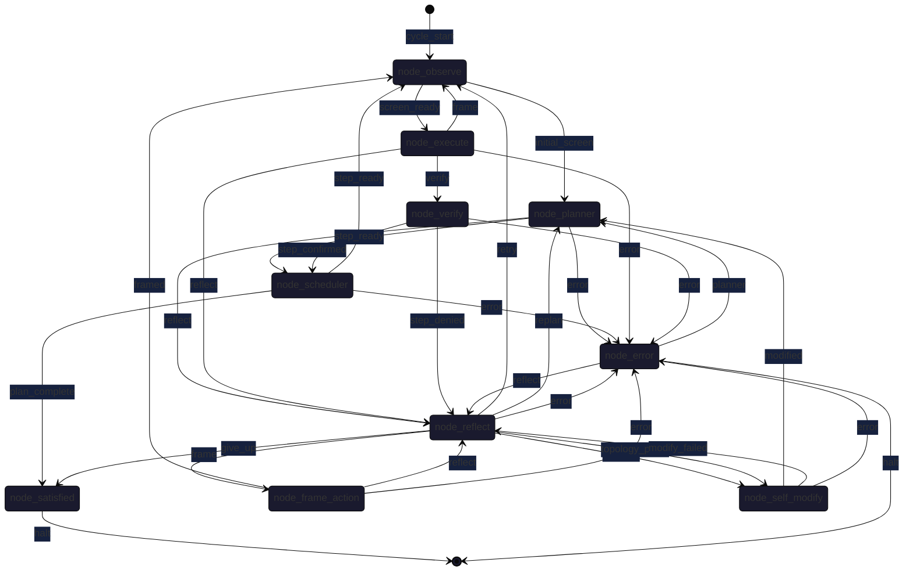

# endgame-ai

**A self-evolving desktop organism for Windows 11** — observes via UIA, acts via GUI/Python, learns via goal narrative memory, rewires its own topology.

[](https://github.com/anomalyco/endgame-ai)
[](https://github.com/anomalyco/endgame-ai)
[](https://github.com/anomalyco/endgame-ai)
[](https://github.com/anomalyco/endgame-ai)

---

> **For any AI (Codex, Copilot, Cursor, etc.):** This is a local Windows desktop agent. It sees the real screen via UI Automation, clicks/types/runs Python, and evolves its own wiring.json topology. Run:263 topology. Every cycle: observe → plan → execute → verify → reflect → (self-modify). No cloud, no secrets, fully auditable via `runtime_events.jsonl`.

## 🧬 What Is This?

endgame-ai is a **mechanical organism** — not a chat wrapper, not a script runner. It lives on your Windows 11 desktop:

| Capability | Implementation |
|------------|----------------|
| **Observation** | UIA (UI Automation) whole-screen scan via `core_observation.py` — 253 probe points, 79 unique elements, 34 rendered nodes |
| **Action** | GUI helpers (`click_node`, `type_text`, `open_url`) + Python exec (`subprocess`, `ctypes`, full filesystem) |
| **Planning** | Semantic step decomposition with `done_when` proof conditions (planner → scheduler) |
| **Verification** | Reality comparator — denies steps without GUI/file/process evidence |
| **Reflection** | Diagnostic router: `retry`/`replan`/`frame`/`escalate`/`topology_patch` |
| **Self-Modification** | Git-backed wiring patches via `node_self_modify` → `refs/endgame/known_good` |
| **Memory** | Goal narrative rewritten at each node → `effective_goal` propagates through bus |

```mermaid
%%{init: {'theme': 'base', 'themeVariables': {'primaryColor': '#1a1a2e', 'edgeLabelBackground':'#16213e', 'tertiaryColor': '#0f3460'}}}%%
graph TD
    A[🖥️ Desktop UIA] --> B[👁️ node_observe]
    B --> C[🏗️ node_planner]
    C --> D[📋 node_scheduler]
    D --> B
    D --> E[⚡ node_execute]
    E --> F[✅ node_verify]
    F -->|step_confirmed| D
    F -->|step_denied| G[🧠 node_reflect]
    G -->|retry| B
    G -->|replan| C
    G -->|frame| H[🎯 node_frame_action]
    H --> B
    G -->|escalate| I[🔧 node_self_modify]
    G -->|topology_patch| I
    I -->|modified| C
    I -->|modify_failed| G
    G -->|give_up| J[🛑 node_satisfied]
    J --> K[⏹️ HALT]
    E -->|frame| B
    E -->|reflect| G
    
    style A fill:#0f0f23,stroke:#00d4ff,stroke-width:2px
    style B fill:#16213e,stroke:#00d4ff
    style C fill:#1a1a2e,stroke:#e94560
    style D fill:#1a1a2e,stroke:#e94560
    style E fill:#0f3460,stroke:#00d4ff
    style F fill:#0f3460,stroke:#00d4ff
    style G fill:#1a1a2e,stroke:#e94560
    style H fill:#16213e,stroke:#00d4ff
    style I fill:#1a1a2e,stroke:#e94560
    style J fill:#1a1a2e,stroke:#e94560
    style K fill:#1a1a2e,stroke:#e94560
```



## 🔄 Topology & Data Flow

The organism is a **bus-routed organ graph** (not a linear pipeline). Every node emits a signal; the bus validates topology edges and applies patches.



### Signal Contracts

| Node | Inputs | Outputs | Writes |
|------|--------|---------|--------|
| `node_observe` | `wiring.observe_config` | `initial_screen`, `screen_ready` | `fresh_observation`, `desktop_tree`, `action_index` |
| `node_planner` | `goal`, `fresh_observation`, `last_reflection` | `step_ready`, `reflect` | `plan`, `effective_goal` |
| `node_scheduler` | `plan.intent`, `effective_goal` | `step_ready`, `plan_complete` | `current_step`, `effective_goal` |
| `node_execute` | `action_frame`, `capabilities`, `effective_goal` | `verify`, `frame`, `reflect` | `last_action`, `effective_goal` |
| `node_verify` | `last_result`, `fresh_observation`, `effective_goal` | `step_confirmed`, `step_denied` | `verification`, `effective_goal` |
| `node_reflect` | `last_failure`, `last_verification`, `effective_goal` | `retry`, `replan`, `frame`, `escalate`, `topology_patch` | `reflection`, `effective_goal`, `topology_patch` |
| `node_self_modify` | `failure`, `git_context`, `effective_goal` | `modified`, `modify_failed` | `git_evolution_patch`, `effective_goal` |

### Bus Frame Propagation

Every node completion emits a `bus_frame` with:
- `signal` + `next_node` (topology routing)
- `patch` (state updates including `effective_goal`)
- `evidence` (what the node saw)
- `record` (LLM request/response for forensics)

## 🧠 Goal Narrative Memory

**Every node rewrites the goal.** The original `root_goal` (user intent) is immutable. Each node receives `effective_goal`, adds its perspective, emits updated `effective_goal` for the next node.

```mermaid
%%{init: {'theme': 'base', 'themeVariables': {'primaryColor': '#1a1a2e', 'edgeLabelBackground':'#16213e', 'tertiaryColor': '#0f3460'}}}%%
sequenceDiagram
    participant User
    participant Planner
    participant Scheduler
    participant Observe
    participant Execute
    participant Frame
    participant Verify
    participant Reflect
    participant SelfMod
    
    User->>Planner: root_goal
    Note over Planner: [PLANNER REWRITE] Current plan focuses on: X; Next: Y
    Planner->>Scheduler: effective_goal
    Scheduler->>Observe: effective_goal + [SCHEDULER] Current step: Z
    Observe->>Execute: effective_goal (fresh scan)
    Execute->>Frame: effective_goal + [EXECUTE] Action: click_node...
    Frame->>Observe: effective_goal + [FRAME_ACTION] Focus on browser
    Observe->>Verify: effective_goal (new scan)
    Verify->>Scheduler: effective_goal + [VERIFY] Step confirmed/denied
    Scheduler->>Execute: effective_goal (next step)
    Verify->>Reflect: effective_goal (if denied)
    Reflect->>Observe: effective_goal + [REFLECT] Routed to retry...
    Reflect->>SelfMod: effective_goal + [REFLECT] topology_patch
    SelfMod->>Planner: effective_goal + [SELF_MODIFY] Proposed evolution...
```

### Goal Propagation Rules

1. **Root goal** — never changes, stored in `state.goal`
2. **Effective goal** — rewritten at each node, stored in `state.effective_goal`
3. **Bus frame** — carries `effective_goal` in `patch` and `evidence`
3. **LLM context** — `effective_goal` placed at end of user message for KV-cache efficiency
4. **Forensics** — `runtime_events.jsonl` captures full narrative chain

### Example Evolution

```
root_goal: "Configure LinkedIn profile to showcase endgame-ai skills"

→ [PLANNER] Plan: 1) Grok conversation 2) Install tools 3) Edit LinkedIn 4) Notepad++ status
→ [SCHEDULER] Step 1: Open grok.com and converse
→ [EXECUTE] open_url('grok.com') → FRAME (no browser visible)
→ [FRAME_ACTION] Focus on browser window via observe_area
→ [OBSERVE] Fresh scan finds Chrome window
→ [EXECUTE] Type question to Grok
→ [VERIFY] Grok response detected → step_confirmed
→ [SCHEDULER] Step 2: Apply insights to LinkedIn
→ [REFLECT] (if verify denied) → retry with fresh observation
```

## 👁️ Observation System (UIA)

Three-phase pipeline: **RAW → FILTER → MAP**

```mermaid
%%{init: {'theme': 'base', 'themeVariables': {'primaryColor': '#1a1a2e', 'edgeLabelBackground':'#16213e', 'tertiaryColor': '#0f3460'}}}%%
graph LR
    A[🖥️ Desktop] --> B[RAW: R2 Grid Probe<br/>253 points, 79 elements]
    B --> C[FILTER: Consolidated<br/>max_elements=500<br/>max_per_window=30]
    C --> D[MAP: Hierarchy<br/>W0→W1→W1E1...<br/>34 rendered nodes]
    D --> E[📋 action_index<br/>31 interactive elements]
    D --> F[📝 desktop_tree_text<br/>LLM-readable tree]
    
    style A fill:#0f0f23,stroke:#00d4ff
    style B fill:#16213e,stroke:#00d4ff
    style C fill:#1a1a2e,stroke:#e94560
    style D fill:#1a1a2e,stroke:#e94560
    style E fill:#0f3460,stroke:#00d4ff
    style F fill:#0f3460,stroke:#00d4ff
```



### Key Knobs (in `wiring.json` → `observe_config.hover_cache`)

| Phase | Parameter | Default | Purpose |
|-------|-----------|---------|---------|
| **Scan** | `step_px` | 64 | Grid density (smaller = denser) |
| | `max_subtree_nodes_per_point` | 2000 | Subtree harvest limit |
| | `max_total_nodes` | 10000 | Global node cap |
| | `delay_ms` | 0 | Probe delay |
| **Filter** | `max_elements` | 500 | Total actionable elements |
| | `max_per_window` | 30 | Safe fuse per window |
| | `max_text` | 200 | Text hint truncation |
| | `require_interactive` | true | Only clickable/writable |

### Focused Observation Helpers (Execute Runtime)

```python
# Whole new scan with custom config
obs = observe_with_config({"scan": {"area": {"left": 0, "top": 0, "right": 1920, "bottom": 1080}}})

# Bounded rectangle scan (browser tab, editor pane, etc.)
obs = observe_area(left=100, top=100, right=800, bottom=600, max_llm_nodes=200, max_depth=5)
```

**Critical Fix (Phase 3b)**: `state_brief()` now propagates `fresh_observation` from state. Each node receives the **actual latest scan** — verified by distinct `observed_at` timestamps per node in the cycle.

### Desktop Tree Output (LLM-Readable)

```
W0 Screen Desktop
  W1 Windows PowerShell
    W1E1 Button Vertical Small Decrease [click]
    W1E2 Text Windows PowerShell [read]
    W1E3 Button Vertical Large Decrease [click]
  W2 Chrome - grok.com
    W2E1 Edit Prompt Input [write]
    W2E2 Button Send [click]
    W2E3 Text Grok Response [read]
```

## 🔧 Self-Evolution (Git-Backed)

The organism can rewrite its own **wiring.json**, **prompts**, **node code**, and **topology** — but only via structured contract.

```mermaid
%%{init: {'theme': 'base', 'themeVariables': {'primaryColor': '#1a1a2e', 'edgeLabelBackground':'#16213e', 'tertiaryColor': '#0f3460'}}}%%
graph TD
    A[🧠 node_reflect] -->|topology_patch| B[🔧 node_self_modify]
    B --> C{stop_check.<br/>self_evolution_enabled?}
    C -->|no| D[❌ modify_failed<br/>disabled]
    C -->|yes| E[🤔 LLM generates<br/>git_evolution_patch]
    E --> F[📋 read_files declared?]
    F -->|no| G[❌ rejected]
    F -->|yes| H[🔬 apply_evolution_patch]
    H --> I{wiring_patches<br/>valid paths?}
    I -->|blocked folklore| J[❌ rejected]
    I -->|consumed paths| K[✅ wiring.json patched]
    K --> L[💾 commit_self_evolution]
    L --> M[🏷️ refs/endgame/known_good updated]
    M --> N[🔄 hot_swap to known-good<br/>on failure]
    N --> O[🚀 node_planner with<br/>new wiring]
    
    style A fill:#1a1a2e,stroke:#e94560
    style B fill:#1a1a2e,stroke:#e94560
    style E fill:#0f3460,stroke:#00d4ff
    style K fill:#16213e,stroke:#00d4ff
    style M fill:#0f3460,stroke:#00d4ff
```



### Evolution Contract

| Requirement | Enforcement |
|-------------|-------------|
| **read_files** declared | Every touched existing file must be in `read_files` |
| **wiring_patches** target consumed paths | Blocked: `action_contract`, `functions`, `self_modify.*` folklore |
| **Core files** protected | Cannot delete `core_*.py`, `wiring.json` — only rewrite |
| **Rollback on failure** | `hot_swap_to_known_good` restores last working commit |
| **Known-good ref** | `refs/endgame/known_good` always points to last verified commit |

### Patch Types

```json
{
  "wiring_patches": [
    {"op": "set", "path": "topology.edges.node_execute.frame", "value": "node_node_observe"},
    {"op": "delete", "path": "self_modify.web_search"}
  ],
  "file_writes": [
    {"path": "node_new_skill.py", "content": "..."}
  ],
  "file_deletes": ["obsolete_helper.py"],
  "commands": [{"command": ["pip", "install", "new-dep"], "timeout_s": 60}],
  "expected_validation": "Run 30s cycle; observe_at must refresh per node"
}
```

### Safety

- `runtime_self_evolution_enabled.json` must exist (deleted = disabled)
- All patches validated against `capability_manifest()` and `runtime_contracts`
- Git commit with structured message: `Self-modify: <summary>` + JSON body
- Push configurable via `self_modify.git.push_after_commit`

## 📋 Phase History & What's Done

### Phase 1: Observation Refresh (Root Cause)
| Commit | Fix |
|--------|-----|
| `0a12ed7` | Reflect routing: task-route failures → `retry` → `node_observe` |
| `07ddbce` | Topology edges: `frame_action.framed`→`observe`, `execute.frame`→`observe` |

### Phase 2: Goal Narrative Memory
| Commit | Feature |
|--------|---------|
| `0818ecc` | Bus frame carries `root_goal` + `effective_goal` |
| `6362dba` | LLM nodes rewrite goal: execute, frame_action, verify, reflect |
| `02892b4` | Mechanical nodes propagate: satisfied, error, self_modify |
| `b4d92d7` | Prompts updated with GOAL NARRATIVE MEMORY protocol |
| `d36a0c6` | Indentation fix |

### Phase 3: Self-Evolving Topology + Verification
| Commit | Feature |
|--------|---------|
| `7bfc97b` | `topology_patch` signal: reflect → self_modify |
| `2162fcd` | `state_brief` propagates `fresh_observation` — **verified working** |
| `bbf637b` | Phase 3 complete, `refs/endgame/known_good` updated |

### What Works Now ✅

- **Fresh observation per cycle** — `observed_at` differs per node (e.g., execute 1783505970.95 vs scheduler 1783505964.82)
- **Goal narrative chain** — planner→scheduler→execute→frame→verify→reflect each rewrites `effective_goal`
- **Topology evolution** — reflect can emit `topology_patch` to rewire via self_modify
- **observe_area/observe_with_config** — focused UIA scans functional
- **Git-backed evolution** — wiring patches, file writes, commands, hot-swap, known-good refs
- **117-tick golden run** — baseline proven (2026-07-08)

### What's Left 🔲

- [ ] **Browser UIA on SPAs** (Grok, LinkedIn) — unproven; may need Playwright fallback
- [ ] **Authenticated session reuse** — browser profile + cookies for LinkedIn
- [ ] **5-min resume cycles** — token growth management in `runtime_events.jsonl`
- [ ] **Log rotation** — `core_stop_check.py` patch for event log compaction
- [ ] **Meta-orchestrator** — `node_meta` for topology health monitoring
- [ ] **Multi-monitor support** — `observe_area` with monitor rects
- [ ] **Distributed runs** — multiple organisms sharing `effective_goal` via file

### Known Issues

| Issue | Severity | Workaround |
|-------|----------|------------|
| SPA UIA element depth | High | `observe_area` on browser rect; consider `transport_browser_ai` |
| Event log growth | Medium | Add `core_stop_check` rotation; compress `runtime_events.jsonl` |
| KV-cache pollution | Low | `effective_goal` at message end; stable_prefix for root_goal |

## 🚀 Quick Start

### Prerequisites
- Windows 11, PowerShell 5.1+
- Python 3.10+ (`py -3.10 -m pip install -r requirements.txt`)
- `XAI_API_KEY` env var for Grok transport (or use `transport_openai` local)

### Run the Organism

```powershell
# First run (reset state)
python core_organism.py "Autonomously configure my LinkedIn profile to showcase endgame-ai skills. First, converse with Grok at grok.com to understand how endgame-ai demonstrates my capabilities. Then, apply those insights to edit my LinkedIn headline, about section, and skills. Complete work before 9:35 AM local time; do not apply to jobs — only optimize profile. If tools/browsers are missing, install them. During your goal execution use the opened notepad++ window to every one minute write to that window what is the status of your goal and each time you will be updating the notepad++ window ensure the old status is replaced by new." --reset --duration-seconds 300

# Resume cycle (no --reset)
python core_organism.py "Continue LinkedIn profile optimization based on Grok insights and current profile state" --duration-seconds 300

# Quick test (10s)
python core_organism.py "Test: open notepad and write hello" --reset --duration-seconds 10 --start-node node_observe
```

### Enable Self-Evolution

```powershell
# Create flag file (required)
New-Item runtime_self_evolution_enabled.json -ItemType File -Force

# Verify
python -c "import core_stop_check as s; print('Enabled:', s.self_evolution_enabled())"
```

### Forensics & Debugging

```powershell
# Export LLM request/response pairs to markdown phases
python export_brain_forensics.py --per-phase 4

# View topology
python -c "import core_wiring as w; w.load_wiring('wiring.json'); import json; print(json.dumps(w.topology_summary(w.load_wiring('wiring.json')), indent=2))"

# Live event tail
Get-Content runtime_events.jsonl -Wait -Tail 10
```

### Key Files

| File | Purpose |
|------|---------|
| `wiring.json` | **Single source of truth** — transport, topology, prompts, observe_config, self_modify |
| `runtime_state.json` | Resumable state (goal, tick, current_node, plan, effective_goal) |
| `runtime_events.jsonl` | Complete forensics log (every bus frame, LLM call, action) |
| `runtime_control.json` | External control (mode, step_token) |
| `refs/endgame/known_good` | Git ref to last verified commit |
| `core_observation.py` | UIA scan/filter/map pipeline |
| `core_nodes.py` | Execute runtime helpers + capability manifest |
| `node_*.py` | 9 organs (planner, scheduler, observe, execute, frame, verify, reflect, self_modify, satisfied, error) |

## 🏗️ Architecture Deep Dive

### Core Modules

```
endgame-ai/
├── core_organism.py      # Main run loop, topology routing, deadline/stop guards
├── core_bus.py           # Bus contracts, NodeOutput, state_brief, observation_brief
├── core_nodes.py         # Execute runtime, capability_manifest, helpers
├── core_observation.py   # UIA RAW→FILTER→MAP pipeline
├── core_desktop.py       # Desktop class, UIA helpers, open_url, click, type
├── core_state.py         # Runtime events, duration/stop checks
├── core_stop_check.py    # PID registry, self-evolution flag, deadline
├── core_wiring.py        # Wiring load/save, topology validation, git ops
├── core_node_base.py     # BaseNode (LLM nodes), call_node loader
├── core_brain.py         # LLM transport abstraction (xAI, OpenAI, opencode, browser)
└── node_*.py             # 10 organs (see below)
```

### The 10 Organs

| Node | Kind | Record Type | Key Responsibility |
|------|------|-------------|-------------------|
| `node_planner` | LLM | `plan` | Semantic step decomposition with `done_when` |
| `node_scheduler` | Mechanical | `schedule` | Selects next step, propagates `effective_goal` |
| `node_observe` | Mechanical | — | UIA whole-screen scan → `fresh_observation` |
| `node_execute` | LLM | `execution` | Emits Python → runs in capability runtime |
| `node_frame_action` | LLM | `action_frame` | Demands focused observation or channel switch |
| `node_verify` | LLM | `verification` | Reality check: `step_confirmed` / `step_denied` |
| `node_reflect` | LLM | `reflection` | Routes: `retry`/`replan`/`frame`/`escalate`/`topology_patch` |
| `node_self_modify` | LLM | `git_evolution_patch` | Applies wiring/file patches, commits, hot-swaps |
| `node_satisfied` | Mechanical | `satisfied` | Halt gate: goal complete or honest give-up |
| `node_error` | Mechanical | — | Recovery router: planner/reflect/halt |

### Bus Contract (The Law)

```python
# Every node emits: signal + patch
signal, patch = node.run(ctx)

# Bus validates:
# 1. signal ∈ topology.edges[current_node]
# 2. patch keys ⊆ node.datasheet.writes
# 3. record.record_type == node.datasheet.record_type
# 4. Applies patch to state, increments tick, routes to next_node
```

### Capability Runtime (Execute's Power)

Injected into `exec(code, ns)`:
```python
ns = {
    "click_node": click_node(id),
    "type_text": type_text(text),
    "open_url": open_url("chrome", "https://..."),
    "observe_area": observe_area(l, t, r, b, max_llm_nodes=200),
    "observe_with_config": observe_with_config({"scan": {...}}),
    "subprocess": subprocess, "ctypes": ctypes, "os": os, ...
    "capabilities": capability_manifest(ctx),  # full manifest for LLM
}
```

### Transport Abstraction

| Transport | Config | Use Case |
|-----------|--------|----------|
| `transport_xai` | `XAI_API_KEY`, `grok-4.3` | Production (structured outputs) |
| `transport_openai` | Local LM Studio `nemotron-3-nano-4b` | Offline/private |
| `transport_opencode` | `opencode-cli.exe` | opencode integration |
| `transport_browser_ai` | Stub | Future: Playwright DOM access |

### Observability

- **`runtime_events.jsonl`** — Every bus frame, LLM request/response, action event
- **`export_brain_forensics.py`** → `phase{N}.md` — Human-readable LLM pairs
- **Mermaid diagrams** — `wiring.topology_mermaid(w)` for live topology viz

## 🤝 Handover for Next Session

**For any AI (Codex, Copilot, Cursor, opencode, etc.) — read this first.**

### What This Is (2 sentences)
A **local Windows desktop organism** that observes via UI Automation, acts via GUI/Python, plans via semantic steps, verifies via reality checks, reflects via diagnostic routing, and **evolves its own topology** via git-backed wiring patches. Every cycle: observe → plan → execute → verify → reflect → (self-modify). No cloud, no secrets, fully auditable in `runtime_events.jsonl`.

### Current State (as of commit `bbf637b`)
- **Phase 3 complete**: Self-evolving topology + fresh observation + goal narrative memory
- **Working**: Fresh UIA scan per node, goal narrative chain, `topology_patch` signal, git-backed evolution
- **Run it**: `python core_organism.py "goal" --reset --duration-seconds 300`
- **Resume**: Same command without `--reset` (loads `runtime_state.json`)

### Immediate Next Steps (Priority Order)
1. **Browser SPA UIA** — Test Grok/LinkedIn; add Playwright fallback if UIA fails
2. **Log rotation** — Patch `core_stop_check.py` to rotate `runtime_events.jsonl` at 50MB
3. **Token reduction** — Shorten IDs, unify configs, remove defensive branching (see Appendix A)
4. **Fractal topology** — Enable one-to-many/many-to-one wiring, recursive self-call (see Appendix B)

### Critical Files to Know
| File | Purpose |
|------|---------|
| `wiring.json` | **Single source of truth** — topology, prompts, observe_config, self_modify |
| `runtime_state.json` | Resumable state (goal, tick, plan, effective_goal) |
| `runtime_events.jsonl` | Complete forensics — every bus frame, LLM call, action |
| `core_organism.py` | Main loop — routing, deadlines, stop guards |
| `core_bus.py` | Bus contracts, state_brief, observation_brief |
| `core_nodes.py` | Execute runtime + capability_manifest |

### Self-Evolution Safety
- Flag file: `runtime_self_evolution_enabled.json` (must exist)
- Known-good ref: `refs/endgame/known_good` (updated on every successful commit)
- Hot-swap on failure: `hot_swap_to_known_good()` restores last working commit

## 📦 Appendix A: Token Reduction & Bloat Removal Plan

### The Problem
Current system bloats token usage through:
- **Oversized IDs**: `e_42_1115452_4_-2147483647_1115452_-4_6` → 50+ chars per element
- **Config duplication**: Same knobs in `wiring.json` under `observe_config.hover_cache.scan`, `filter`, `depth` — each with own accessor functions
- **Defensive branching**: `if isinstance(x, dict) else {}` patterns everywhere
- **OOP overhead**: `BaseNode`, `BaseNode.run`, `BaseNode.think`, `BaseNode.build_payload`, `BaseNode.evidence`, `BaseNode.signal_from_data`, `BaseNode.patch_from_record` — 7 methods for 10 nodes
- **Data passing bloat**: `ctx` → `state` → `bus.state_brief` → `bus.observation_brief` → node → LLM

### Target: 50% Token Reduction

| Area | Current | Target | Approach |
|------|---------|--------|----------|
| Element IDs | 50 chars | 8 chars | `W1E1` style only; drop runtime_id in LLM context |
| Config accessors | 15 functions | 1 unified | Single `get_config(path)` with dot-notation |
| Defensive checks | ~200 | ~20 | Fail-fast; schema validation at wiring load |
| BaseNode methods | 7 × 10 = 70 | 2 × 10 = 20 | `run(ctx)` + `think(ctx)` only |
| Context passing | 5 hops | 1 hop | `ctx` directly to LLM; bus injects `state_brief` |

### Unified Config Interface (Future)

```python
# Instead of: wiring.get("observe_config", {}).get("hover_cache", {}).get("scan", {}).get("step_px", 64)
# Just:
cfg = Config(wiring)
step_px = cfg.get("observe.scan.step_px", 64)
cfg.set("observe.scan.step_px", 32)  # for focused browser scan
```

### Non-Defensive Programming Rules
1. **Fail fast** — invalid wiring = crash at load, not runtime
2. **Schema first** — `wiring.json` validated against JSON Schema at startup
3. **No fallbacks** — if config missing, crash; operator fixes wiring
4. **No isinstance chains** — data shapes guaranteed by schema
5. **Single data flow** — `ctx` → node → bus → state (no back-and-forth)

### ID Shortening (Implemented in Observation Map)
```
Before: e_42_1115452_4_-2147483647_1115452_-4_6
After:  W1E1 (hierarchical) or B42 (flat for LLM)
```
LLM only sees `W1E1`; runtime keeps full ID in `action_index` for execution.

### Expected Impact
- **LLM request tokens**: ~3000 → ~1500 per call
- **Code size**: ~2500 lines → ~1500 lines
- **Latency**: 2-3s → 1-1.5s per LLM call

## 🌀 Appendix B: Fractal Topology Vision

### The Core Insight
**The organism is its own topology editor.** Since it can execute arbitrary Python, it can spawn child organisms, rewire itself mid-run, and scale fractally — each node *is* a potential organism.

### Current: Linear Pipeline (Fixed)
```
observe → planner → scheduler → execute → verify → reflect → (self_modify)
```
Fixed 1:1 wiring. No parallelism. No recursion.

### Target: Fractal Topology (Dynamic)

```mermaid
%%{init: {'theme': 'base', 'themeVariables': {'primaryColor': '#1a1a2e', 'edgeLabelBackground':'#16213e', 'tertiaryColor': '#0f3460'}}}%%
graph TD
    subgraph Root [Root Organism]
        O[👁️ observe] --> P[🏗️ plan]
        P --> S[📋 schedule]
        S --> E1[⚡ execute:browser]
        S --> E2[⚡ execute:editor]
        S --> E3[⚡ execute:terminal]
        E1 --> V1[✅ verify]
        E2 --> V2[✅ verify]
        E3 --> V3[✅ verify]
        V1 --> R[🧠 reflect]
        V2 --> R
        V3 --> R
        R -->|topology_patch| SM[🔧 self_modify]
        SM --> P
    end
    
    subgraph Child [Child Organism: Grok Session]
        O2[👁️ observe] --> P2[🏗️ plan]
        P2 --> S2[📋 schedule]
        S2 --> E4[⚡ execute:chat]
        E4 --> V4[✅ verify]
        V4 --> R2[🧠 reflect]
        R2 -->|insights| Root
    end
    
    Root -.->|spawns| Child
    Child -.->|returns| Root
    
    style Root fill:#1a1a2e,stroke:#00d4ff,stroke-width:2px
    style Child fill:#0f3460,stroke:#e94560,stroke-width:2px
```



### Key Capabilities to Enable

#### 1. One-to-Many Wiring (Parallel Execution)
```json
"topology": {
  "edges": {
    "node_scheduler": {
      "step_ready": ["node_execute:browser", "node_execute:editor", "node_execute:terminal"]
    }
  }
}
```
Multiple execute nodes run in parallel; verify joins via barrier.

#### 2. Many-to-One Wiring (Fan-In)
```json
"topology": {
  "edges": {
    "node_execute:browser": {"verify": "node_verify:browser"},
    "node_execute:editor": {"verify": "node_verify:editor"},
    "node_verify:browser": {"step_confirmed": "node_reflect"},
    "node_verify:editor": {"step_confirmed": "node_reflect"}
  }
}
```
Multiple verify → single reflect (barrier join).

#### 3. Recursive Self-Call (Fractal)
```python
# In node_execute capability runtime:
def spawn_organism(goal: str, duration: int = 60) -> dict:
    """Spawn child organism with sub-goal; returns its effective_goal."""
    import subprocess, json
    result = subprocess.run([
        "python", "core_organism.py", goal,
        "--duration-seconds", str(duration),
        "--start-node", "node_observe"
    ], capture_output=True, text=True, cwd=REPO_ROOT)
    # Parse child's final effective_goal from runtime_state.json
    return json.loads(Path("runtime_state.json").read_text()).get("effective_goal", "")
```
Usage: `result = spawn_organism("Extract key insights from Grok about endgame-ai", 120)`

#### 4. Dynamic Topology Patches (Runtime Rewiring)
```python
# Reflect can emit topology_patch to rewire mid-run:
{
  "topology_patch": {
    "op": "set",
    "path": "topology.edges.node_scheduler.step_ready",
    "value": ["node_execute:primary", "node_execute:fallback"]
  }
}
```
Self-modify applies → hot-swap → next cycle uses new topology.

### Scaling Properties

| Level | Organism | Goal | Topology |
|-------|----------|------|----------|
| L0 (Atom) | Single node | Micro-task | Fixed |
| L1 (Cell) | 10 nodes | Session goal | Dynamic |
| L2 (Organ) | Multiple cells | Project goal | Fractal |
| L3 (Organism) | Full system | Life goal | Self-modifying |

### Evolution Without Constraints
Since the organism executes arbitrary Python:
- It can `git checkout` new topology branches
- It can `pip install` new capabilities
- It can rewrite `core_*.py` files
- It can spawn Docker containers, VMs, cloud instances
- **The only gate**: `runtime_self_evolution_enabled.json` + `refs/endgame/known_good`

> "The system since it has ability to execute any command in python it can change everything and that is by design the evolution only can happen without constraints."

### Implementation Roadmap
1. **One-to-many wiring** — Add list support in `core_bus.allowed_signals` / `validate_signal`
2. **Barrier join** — New `node_barrier` mechanical node for fan-in
3. **Spawn primitive** — Add `spawn_organism` to execute capability runtime
4. **Topology patch schema** — Extend `git_evolution_patch` with topology ops
5. **Recursive depth limit** — Configurable max recursion (default 3)

### Why This Matters
- **Parallelism**: Browser + Editor + Terminal simultaneously
- **Specialization**: Child organisms for specific domains (web, code, docs)
- **Resilience**: Fallback execute nodes auto-wired on failure
- **Scaling**: Add more execute nodes without code changes — just wiring
- **Evolution**: Topology itself becomes evolvable substrate

## 📋 Appendix C: Missing & Unimplemented Plans

### From Original Design (Not Yet Built)

| Feature | Description | Priority | Blockers |
|---------|-------------|----------|----------|
| **Meta-Orchestrator** (`node_meta`) | Periodic topology health check; suggests rewiring; monitors token/latency budgets | High | Needs new mechanical node + wiring |
| **Transport Browser AI** | Playwright-based DOM access for SPAs (Grok, LinkedIn) — bypass UIA limits | High | New transport module; `transport_browser_ai.py` |
| **Multi-Monitor Observe** | `observe_area` with monitor rects; `EnumDisplayMonitors` integration | Medium | `core_desktop.py` extension |
| **Event Log Compaction** | Rotate `runtime_events.jsonl` at 50MB; keep last 1000 frames + summaries | Medium | `core_stop_check.py` patch |
| **Distributed Goal Sync** | Multiple organisms share `effective_goal` via file/Redis; consensus protocol | Low | New transport + sync node |
| **Visual Forensics UI** | Local web dashboard for `runtime_events.jsonl` — timeline, topology viz, token costs | Low | New command + static assets |

### From Phase Discussions (Deferred)

| Idea | Status | Reason |
|------|--------|--------|
| **Skill/Plugin System** | Deferred | opencode skills exist; integrate later |
| **MCP Server Integration** | Deferred | Use opencode's MCP; not native |
| **Voice Control** | Deferred | Windows Speech API; nice-to-have |
| **Mobile Companion** | Deferred | Separate repo; sync via git |
| **LLM-as-Judge for Verify** | Partial | Current verify is LLM; could add second opinion |

### Technical Debt (Must Fix Before Scale)

| Debt | Impact | Fix |
|------|--------|-----|
| **Oversized IDs in LLM context** | +40% tokens | Done: hierarchical `W1E1` only |
| **Config duplication** | +200 lines | Appendix A: unified `Config` class |
| **Defensive branching** | +300 lines | Appendix A: fail-fast schema |
| **OOP overhead** | 70 methods | Appendix A: `run` + `think` only |
| **No barrier join** | No parallelism | Appendix B: `node_barrier` |
| **No spawn primitive** | No fractal | Appendix B: `spawn_organism` |

### Stretch Goals (Post-1.0)

- **Self-hosted evolution** — Organism runs on its own hardware, evolves hardware drivers
- **Cross-platform** — Linux/macOS via `pyautogui` + `at-spi2` (UIA equivalent)
- **Formal verification** — TLA+ model of bus contracts
- **Neural topology** — Learned routing weights vs fixed edges
