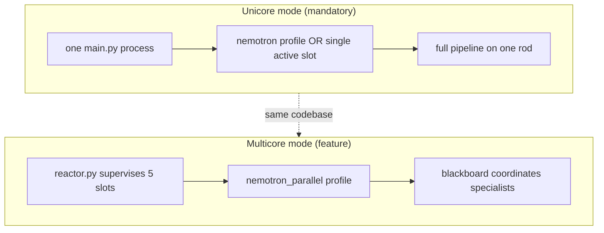
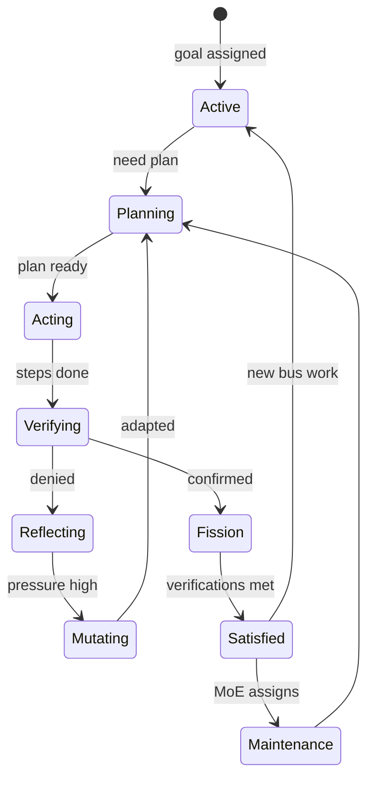
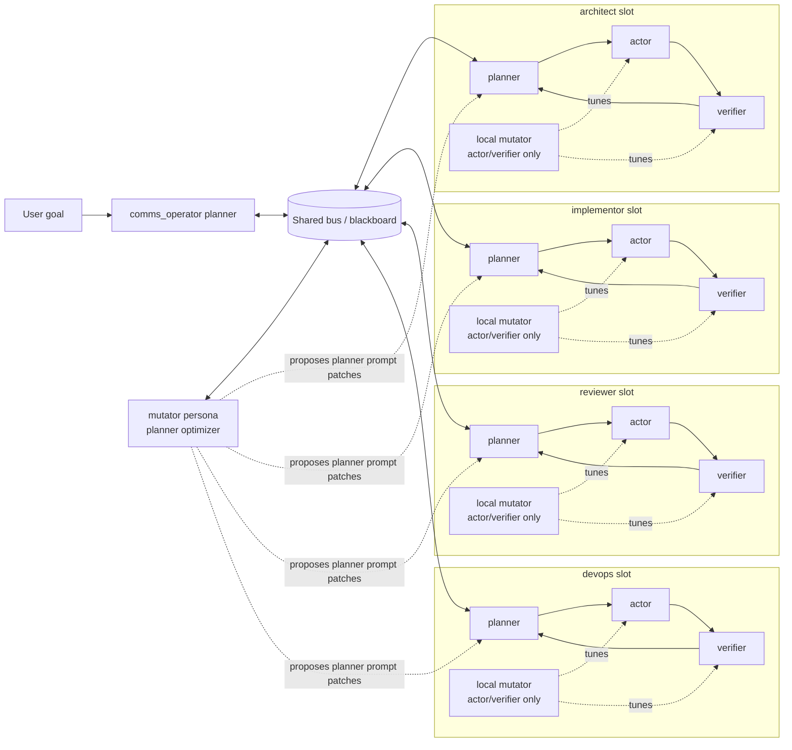
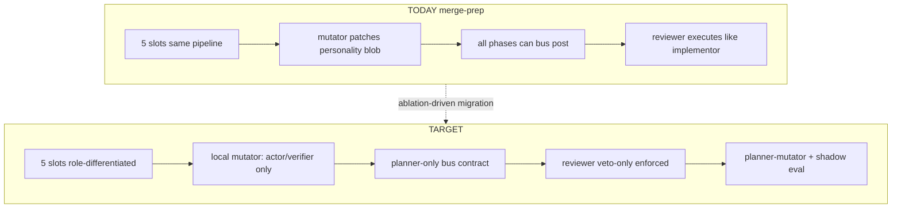
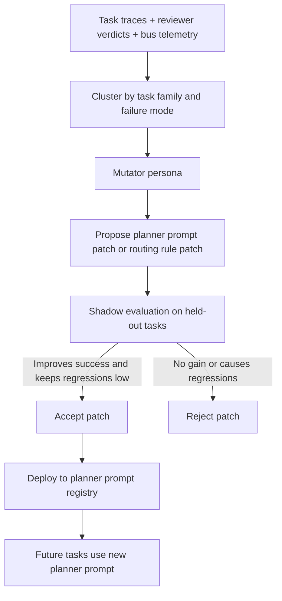
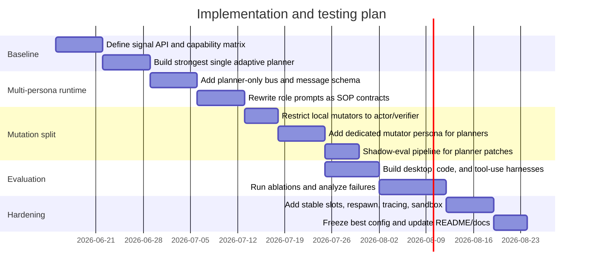

# endgame-ai

**A living Windows desktop organism — not an agent framework.**

This README is the **single source of truth** for the project. It merges:

1. The architecture research synthesis (formerly `deep-research-report.md`)
2. A code audit of what exists on branch `merge-prep` today
3. Owner decisions about mission, CPU-style unicore/multicore execution, and eternal operation

Future human and AI coding sessions **must start here**. Length is intentional.

---

# Part 0 — Bootstrap for AI coding agents

Read this table before touching code.

| Item | Value |
|------|-------|
| **Active branch** | `merge-prep` |
| **Latest bootstrap commit** | See `git log -1 README.md` |
| **Sanitized baseline tag** | `sanitize-ready-20260615` → `9102d0a` |
| **Archived experiment tag** | `experiment-pure-python-20260615` → 4 commits ahead; pure-Python signal API experiment; **not active direction** unless ablation proves it |
| **`main` branch** | Single-process organism (~2,900 LOC, Lorenz/PID math, no colony). `merge-prep` is ~245 commits ahead. |
| **`unify-rewrite` branch** | Points at experiment; safe to ignore if tag exists |
| **Companion file** | `deep-research-report.md` — original ChatGPT report (raw); this README supersedes it for execution |

## Rules for agents

1. **Do not assume the 5-slot colony wins.** It must earn its keep through ablation (see Part 16).
2. **Do not treat gaps as bugs** without reading Part 14 — many are planned work.
3. **Implement both unicore and multicore paths** — owner requirement (Part 6).
4. **Do not merge personality mutation with planner mutation** — hierarchical mutators are the target (Part 11).
5. **Preserve mermaid diagrams** when editing this file.
6. **Ask before force-pushing** or rewriting git history.

## Owner mission (confirmed 2026-06-15)

| Requirement | Meaning |
|-------------|---------|
| **Human replacement** | Perform any task on this computer — desktop GUI **and** repo/code work equally |
| **Local LLM** | LM Studio on same machine; Nemotron-class ~4B; slow but free; parallel when hardware allows |
| **Desktop senses** | Mouse, keyboard, screen descriptions; hover-probe discovery (works today, not perfect) |
| **Eternal organism** | No permanent goal; never exit; satisfied = slow metabolism, not death; re-planning after success is mandatory |
| **CPU analogy** | Must work unicore (one rod / time-sliced) **and** multicore (colony parallel); parallel is nice-to-have, unicore is mandatory |
| **Evolution unconstrained** | System may evict personas, respawn with different models — allow both implementations |
| **Prove by science** | Ablation before scaling; simplify if colony loses to strong single-rod baseline |

---

# Part 1 — What endgame-ai is

## 1.1 The living-organism model

Traditional agents:

```
task → done → exit → dead
```

endgame-ai:

```
task → plan → act → verify → fission → pressure → mutate → what next? → never stop
```

This is **not** “another agentic AI product.” It is a runtime organism:

| Biological metaphor | Code implementation |
|---------------------|---------------------|
| Thalamus | `comms_operator` — human goals enter here only |
| Frontal cortex | `PlannerAgent` + persona SOP |
| Motor cortex | `ActorAgent` — Python exec or GUI verbs |
| Visual cortex | `desktop.py` — hover probe + UIA tree |
| Autonomic nervous system | `_update_pressure()` — stagnation fields |
| Immune diagnosis | `ReflectorAgent` |
| Adaptive immunity | `MutatorAgent` |
| Reproduction | `FissionJudgeAgent` — credit for novel verified work |
| Genetics / breeding | MAP-Elites archive in `reactor.py` |
| Endocrine / metabolism | `_is_satisfied()` — reduced cycle rate, not shutdown |
| Nervous system | `comms.py` blackboard bus |

## 1.2 What it is not

- Not LangChain / AutoGen / CrewAI with a skin
- Not a chat UI pretending to have hands
- Not proven multi-agent superiority — that is a **hypothesis under test**
- Not a demo that exits on success

## 1.3 Architectural name (literature-aligned)

> **Role-Based Blackboard Multi-Agent System with Hierarchical Prompt Evolution**

No single paper names this exact combination. The stack is a composite of well-grounded research lines (Part 8–9).

---

# Part 2 — Executive summary (research synthesis)

The architecture is best understood **not** as “five copies of the same pipeline,” but as a **role-based multi-agent system with blackboard-style coordination and hierarchical prompt evolution**.

Closest academic neighbors:

- Role-playing / workflow MAS: **CAMEL**, **AutoGen**, **MetaGPT**
- Blackboard / shared-memory coordination: classic blackboard systems; modern **LLM-Based Multi-Agent Blackboard System** ([arXiv:2510.01285](https://arxiv.org/abs/2510.01285))
- Prompt evolution: **Promptbreeder**, **OPRO**, APE, APO
- Routing: **MasRouter** ([arXiv:2502.11133](https://arxiv.org/abs/2502.11133))
- Local feedback: **Reflexion**, **Self-Refine**, **Voyager**

## 2.1 The central design conclusion

**Parallel subprocesses help only when planners are genuinely differentiated by role, routing policy, permissions, and evaluation protocol.**

Multi-agent gains in the literature usually come from:

- Structured collaboration
- Standardized operating procedures (SOPs)
- Selective routing (not always-on broadcast)
- Independent verification

—not from naive duplication of one generic agent loop.

MetaGPT, AgentVerse, and MasRouter all point this direction. Recent surveys frame the same lesson: collaboration **structure**, **strategy**, and **coordination protocol** are design variables—not folklore.

## 2.2 Hierarchical mutators (owner insight + literature)

**Local mutators** should tune only **actor/verifier** behavior (fast, frequent, trace-driven).

**A dedicated mutator persona** should evolve **planner prompts** (slow, centralized, benchmarked).

| Time scale | Mechanism | Literature |
|------------|-----------|------------|
| Fast | Reflector → local mutator → actor/verifier/plugins | Reflexion, Self-Refine, Voyager |
| Slow | Planner-mutator → propose diffs → shadow eval → promote | Promptbreeder, OPRO, APE, APO |

Mixing both time scales inside every slot’s `patch_prompt` **destabilizes role priors**—the very thing that makes a colony useful.

## 2.3 Ablation is mandatory

Do **not** assume the colony is superior. Make that claim **earn its keep through ablation**:

1. Build the **strongest possible single adaptive planner** baseline (unicore)
2. Compare against **multi-persona planner-only bus** (colony)
3. Compare against **full design** with dedicated planner-mutator persona

Collaboration mode and message topology are themselves optimization variables. The “best” architecture will almost certainly be **task-dependent** (MasRouter, collaboration surveys).

## 2.4 The bus insight

> **The bus is not useful because it makes things parallel; it is useful because it makes specialization and coordination explicit.**

The modern LLM blackboard paper ([arXiv:2510.01285](https://arxiv.org/abs/2510.01285)) shows a shared board can replace rigid master–slave orchestration: sub-agents respond based on capability without the central controller knowing every expertise in advance.

---

# Part 3 — Deduced analysis: code on `merge-prep` today

This section is the engineer’s honest audit—what the research report recommends vs what `merge-prep` actually implements at `9102d0a`+.

## 3.1 Runtime topology (exists and works)

```
┌──────────────────────────────────────────────────────────────┐
│  TUI (tui.py) — terminal dashboard, spawns reactor           │
│    └── Reactor (reactor.py) — 5 slots, MAP-Elites breeder    │
│          ├── Slot 1: comms_operator  (thalamus / MoE router) │
│          ├── Slot 2: architect       (design / navigation)   │
│          ├── Slot 3: implementor     (execution / files)     │
│          ├── Slot 4: reviewer        (verification)          │
│          └── Slot 5: devops          (git / infra health)    │
└──────────────────────────────────────────────────────────────┘
         │                              │
    ┌────▼─────┐                   ┌────▼────┐
    │ Blackboard│                  │ LM Studio│
    │ comms.py  │                  │ (local)  │
    └──────────┘                   └──────────┘
```

**Per-rod pipeline** (`engine.py` → `agents.py`):

```
scheduler → planner → actor → verifier → fission_judge
                ↑         ↓ denied
                └── reflector → mutator ──┘
```

Each rod is one `main.py` process. `reactor.py` spawns, monitors, respawns dead slots, processes `evolve` events into MAP-Elites archive.

## 3.2 Blackboard (exists, mature)

`comms.py` implements protocol v1:

| Store | Purpose |
|-------|---------|
| `runtime/comms/messages.json` | Intent: route, request, ping, evolve, … |
| `runtime/comms/events_bus.jsonl` | Observation: telemetry, pipeline phases |

MoE routing: `comms_operator` reads colony telemetry (`stagnation`, `power`, `velocity`), softmax-gates maintenance work, escalates stuck rods (often to `quality_critic`).

**Partial blackboard claiming exists:** `_active_claims()` in `agents.py` shows planners what others are working on.

## 3.3 Desktop observation (exists, usable)

`desktop.py`:

- Hover-probe sweeps screen regions (human-like glance)
- Merges probe discoveries with UIA accessibility tree
- Probe-first because browsers lie to static trees

Actor uses element IDs; verifier checks `print()` evidence. **Owner confirms this works “not that bad today.”**

## 3.4 Model profiles (unicore + multicore exist)

| Profile | `LLM_MAX_CONCURRENT` | Lock | Mode |
|---------|---------------------|------|------|
| `nemotron` | 1 | global | **Unicore** |
| `nemotron_parallel` | 5 | none | **Multicore** |

## 3.5 Mutation today (GAP — unified, not hierarchical)

`MutatorAgent` (`agents.py`) after reflector can:

| Action | Target | Problem |
|--------|--------|---------|
| `patch_plugin` | `plugins/*.py` | OK for local adaptation |
| `patch_prompt` | `prompts/personalities/{persona}.txt` | **Rewrites entire persona used as system prompt for ALL circuits** (planner + actor + verifier + mutator) |

`prompts/mutator.txt` explicitly allows `patch_prompt` with ELITE_DNA crossover.

**This violates the hierarchical mutator design.** A local failure can rewrite planner identity.

## 3.6 No planner-mutator persona (GAP)

`config.PERSONAS` includes `quality_critic` as escalation pool member, not a planner optimizer. No slot/persona for shadow-evaluated planner SOP evolution.

## 3.7 Bus is not planner-only (GAP)

Report target: only planners publish claims/verdicts to bus.

Today: all rods run full pipeline; exec steps in plans call `bus_route()` / `bus_post()`; all slots emit telemetry. Increases chatter; blurs blackboard contract.

## 3.8 Reviewer not independent at runtime (GAP)

`reviewer.txt` says verify-only at prompt level, but runtime runs full `planner → actor → verifier` like implementor. No RBAC preventing “fix while reviewing.”

## 3.9 No ablation config modes (GAP)

`reactor.py` always spawns 5 slots. No `unicore` / `colony` / `planner-only-bus` flags.

`bench.py` has 30 isolated LLM circuit scenarios—useful but not end-to-end colony ablation.

## 3.10 Prompt layer confusion (GAP)

| Layer | File | Used as |
|-------|------|---------|
| Circuit | `prompts/planner.txt`, `actor.txt`, `verifier.txt`, … | Shared instructions per circuit |
| Persona | `prompts/personalities/{name}.txt` | System prompt for **every** circuit in that rod |

Target needs three evolvable layers with **separate mutator permissions**.

## 3.11 What already aligns well

| Report recommendation | Code evidence |
|----------------------|---------------|
| Role-specific planners | Persona files + slot assignment |
| Dispatcher | `comms_operator` decompose + `bus_route()` |
| Blackboard | `comms.py` v1 protocol |
| Task-level MoE / routing | `_moe_route`, `softmax_route` |
| Independent verification intent | `VerifierAgent`, reviewer persona |
| Fast local feedback loop | reflector → mutator chain |
| Slow prompt evolution intent | MAP-Elites breeder, elite DNA crossover |
| Stable slots + respawn | `reactor.py` spawn/kill/respawn, `select_respawn_persona` |
| Pressure-driven evolution | stagnation → mutate threshold |
| Fission reproduction | `FissionJudgeAgent` |
| Eternal loop | no exit in `engine.run`; satisfied slowdown only |

## 3.12 `main` vs `merge-prep` (historical)

| | `main` | `merge-prep` |
|---|--------|--------------|
| Processes | 1 | 5 (+ reactor) |
| Math thread | Lorenz + stagnation + PID | Per-rod pressure + MoE |
| Colony bus | No | Yes |
| Personalities | No | Yes |
| Mutator / fission / breeder | No | Yes |
| LOC | ~2,900 core | ~4,500+ |

`merge-prep` is not an incremental patch—it is a **colony rewrite** that must be validated before merging to `main`.

---

# Part 4 — CPU analogy: unicore and multicore (owner requirement)

Old CPUs had one physical core but ran multiple applications via **time-slicing**. New CPUs have true parallel cores. endgame-ai must support **both metaphors** because:

- One slightly smarter model may beat several tiny 4B models on some tasks
- Parallel is needed for future throughput (owner expectation)
- Evolution may evict personas or respawn with different LLMs—unknown; both paths must remain implementable

| CPU concept | endgame-ai |
|-------------|------------|
| Single core, time-sliced | `nemotron` profile; or colony with one active rod |
| Multiple cores | `nemotron_parallel`; 5 slots in simultaneous LLM wait |
| Scheduler | `reactor.py` + `comms_operator` MoE |
| Core parking | Satisfied state (`DELAY_SATISFIED = 15s`) |
| Interrupt | Human pri=3 bus message preempts goal |
| Turbo / boost | Human-critical priority routing |
| Hot-plug core | `reassign` / respawn with different persona or model (future) |



**Implementation rule:** Never add a colony-only feature without a unicore fallback path.

---

# Part 5 — Eternal operation and the goal model

The organism has **no permanent goal**. This is hard to explain but critical.

## 5.1 Three goal layers

| Layer | Source | Behavior |
|-------|--------|----------|
| **Human task** | TUI / bus inject | `PRI_HUMAN=3`; preempts everything; cleared after verified completion |
| **Colony drift** | `runtime/colony_goal.txt` | Long-horizon direction; `comms_operator` reads via `colony_goal_text()` |
| **Idle metabolism** | Per-persona self-direction | Scheduler invents maintenance goal when idle: `"Self-directed {persona} maintenance: audit, improve, report"` |

## 5.2 Satisfied ≠ dead

`_is_satisfied()` requires:

- No active plan
- `SATISFIED_VERIFICATIONS` (2) consecutive verifications
- No pending inbox work
- Not a human-priority task

Then: `time.sleep(DELAY_SATISFIED)` — **reduced metabolism**, loop continues.

## 5.3 Re-planning is mandatory

After verified success:

- Plan clears
- Fission may credit
- Pressure resets partially
- **Organism asks “what next?”** via scheduler → planner

Missing piece (owner concern): explicit **long-horizon replanning** when colony_goal exists but human is silent—`comms_operator` MoE maintenance routing partially addresses this; may need strengthening.



---

# Part 6 — Literature mapping (target architecture)

## 6.1 System label

**role-based blackboard multi-agent system with hierarchical prompt evolution**

| Term | Source concept |
|------|----------------|
| Role-based | CAMEL, MetaGPT, workflow agents |
| Blackboard | Shared bus with partial results and claims |
| Hierarchical prompt evolution | Local actor/verifier tuning vs planner SOP search |

## 6.2 Target architecture diagram (preserve)



## 6.3 Design element → research mapping

| Design element | Closest research concept | Implication for endgame-ai |
|----------------|-------------------------|---------------------------|
| Role-specific planners in parallel subprocesses | Role-based LLM-MAS, workflow agents | Gain from **different role priors and SOPs**, not cloning same planner 5× |
| Shared bus among planners | Blackboard / shared-memory coordination | Bus carries **compact claims, partial results, verdicts**—not raw traces |
| Parallel specialists + aggregation | Mixture-of-Agents (task-level) | Closer to **MoA** than token-level MoE: whole planners interact at task level |
| `comms_operator` as dispatcher | Centralized routing | Useful for intake + decomposition; must not micromanage every step |
| Planner-only inter-process communication | Hybrid centralized-distributed | Actor/verifier local; summaries via planners |
| Per-thread mutators for actor/verifier | Reflexion, Self-Refine | Tune retries, proofs, checklists—**not role identity** |
| Dedicated mutator persona for planners | Promptbreeder, OPRO | Slow, shadow-evaluated planner prompt search |
| Escalation and selective routing | MasRouter | Collaborate only when gain > latency + token cost |
| Runtime respawn and slot lifecycle | LangGraph, AgentScope patterns | Stable slot IDs, resumable digest, tracing |
| Capability-scoped signals | RBAC agent platforms (Agno) | Runtime enforce persona permissions |

## 6.4 Today vs target (side by side)



---

# Part 7 — Key papers and references

| Paper | Core contribution | Relevance | Link |
|-------|-------------------|-----------|------|
| **Blackboard Systems** (Hayes-Roth et al.) | Specialized knowledge sources via shared problem state | Ancestor of planner bus | Classic AI architecture |
| **Adaptive Mixtures of Local Experts** (Jacobs et al., 1991) | Expert specialization + gating | Conceptual basis for routing, not duplication | Neural computation literature |
| **CAMEL** | Role-playing with inception prompts | Personality = planner-level role prior | [arXiv:2303.17760](https://arxiv.org/abs/2303.17760) |
| **AutoGen** | Customizable conversable agents, interaction patterns | Same runtime, different roles | [microsoft/autogen](https://github.com/microsoft/autogen) |
| **MetaGPT** | SOP-encoded roles, assembly-line collaboration | Persona framing, rigid boundaries | [arXiv:2308.00352](https://arxiv.org/abs/2308.00352) |
| **Reflexion** | Verbal reinforcement from episodic memory | **Local mutator** fit | [arXiv:2303.11366](https://arxiv.org/abs/2303.11366) |
| **Self-Refine** | Local feedback-to-revision loops | Actor/verifier retry templates | [arXiv:2303.17651](https://arxiv.org/abs/2303.17651) |
| **Voyager** | Skill library + environment feedback | Plugin evolution patterns | [arXiv:2305.16291](https://arxiv.org/abs/2305.16291) |
| **Promptbreeder** | Self-referential prompt evolution | **Planner-mutator persona** | [arXiv:2309.16797](https://arxiv.org/abs/2309.16797) |
| **OPRO** (LLMs as Optimizers) | LLM optimizes prompts from scored histories | Shadow eval template | [arXiv:2309.03409](https://arxiv.org/abs/2309.03409) |
| **Mixture-of-Agents** | Layered parallel proposals + aggregation | Multi-planner + reviewer analogy | [arXiv:2406.04692](https://arxiv.org/abs/2406.04692) |
| **MasRouter** | Learn collaboration mode + role allocation + routing | When should multiple planners exist? | [arXiv:2502.11133](https://arxiv.org/abs/2502.11133) |
| **LLM Multi-Agent Blackboard** (Salemi et al.) | Volunteer sub-agents on shared board | Closest modern match to `comms.py` | [arXiv:2510.01285](https://arxiv.org/abs/2510.01285) |
| **Multi-Agent Collaboration Survey** | Actors, structures, strategies, protocols | Architecture = controllable variables | ACL / survey literature |
| **AgentVerse** | Structured expert groups vs single agent | Evidence for colony when structured | [arXiv:2308.10848](https://arxiv.org/abs/2308.10848) |
| **OSWorld** | Real desktop tasks, execution-based eval | External sanity benchmark | [arXiv:2404.07972](https://arxiv.org/abs/2404.07972) / [os-world.github.io](https://os-world.github.io/) |
| **GAIA** | General assistant tasks | Tool-use complement | [arXiv:2311.12983](https://arxiv.org/abs/2311.12983) |
| **SWE-bench** | Codebase tasks | Repo task external reference | [swe-bench.github.io](https://www.swebench.com/) |

**Shortest study path (report recommendation):** MetaGPT + DSPy + LangGraph. Add AgentScope for tracing/sandboxing in long-running systems.

---

# Part 8 — Techniques to port into the project

Highest-value port: **separate communication scope, adaptation scope, and permission scope.**

| Technique | Why literature suggests it | Practical implementation |
|-----------|---------------------------|-------------------------|
| Planner-only bus | Not all modules need broadcast visibility | Only planners publish; actors/verifiers emit summaries to own planner |
| SOP-based role priors | Workflow agents need explicit procedures | Each planner: allowed tasks, forbidden actions, proof style |
| Dispatcher + volunteer claiming | Blackboard scales when capability uncertain | `comms_operator` posts; planners respond with confidence tags |
| Independent review lane | Reduces cascading false success | Reviewer confirm/deny only—no patch |
| Confidence-based escalation | Collaboration should be selective | Escalate on low confidence, retry threshold, reviewer disagreement |
| Local mutators for actor/verifier only | Fast correction from recent traces | Rewrite recovery heuristics, verifier checklists—never planner SOP |
| Dedicated planner mutator | Planner prompts need scored search | Shadow eval before rollout |
| Mutation operators library | Prompt search needs explicit operators | tighten constraints, split roles, add proof requirements, … |
| Per-role scorecards | Optimization needs fitness | success, reviewer agreement, retries, latency, bus cost, regression |
| Stable slots and respawn | Long-running needs resumable state | Persist slot ID, bus digest, last task; restore on crash |
| Capability-scoped signals | Role separation needs enforcement | Per-persona allowed signal set + runtime RBAC |

---

# Part 9 — Two-speed adaptation (core synthesis)

## 9.1 Local adaptation loop (FAST)

```
reviewer denial / tool error / outcome trace
    → reflector
    → local mutator
    → patch actor.txt / verifier.txt / plugins/
    → replan
```

- Frequent, cheap, narrow scope
- Reflexion / Self-Refine / Voyager pattern
- **Per rod, per failure pressure** (`MUTATE_AFTER_FAILURES = 2`)

## 9.2 Global planner-evolution loop (SLOW)

```
accumulated traces across many tasks
    → cluster by task family + failure mode
    → planner-mutator persona
    → propose planner SOP diff
    → shadow eval on held-out tasks
    → accept or reject
    → deploy to prompt registry
```

- Slow, benchmarked, held-out tested
- Promptbreeder / OPRO / APE / APO pattern

## 9.3 Planner-mutator flow diagram (preserve)



## 9.4 Why local mutators must stop rewriting planners

Verbal/self-feedback papers improve **action policy** from local feedback.

Prompt-optimization papers rely on **candidate evaluation across examples**.

Combining both inside every slot’s `patch_prompt` risks:

- Destroying role boundaries mid-task
- Overfitting one lucky trace
- Collapsing architect into implementor behavior

**Code today violates this** — see Part 3.5.

---

# Part 10 — Role contracts and signal API (target)

Present the system as **one runtime with six role contracts**, not a vague swarm.

## 10.1 Target LLM output contract

Future direction (archived in `experiment-pure-python-20260615`; target after ablation):

```python
# LLM output contract (TARGET — not current merge-prep JSON circuits)
# - Output Python only.
# - No markdown, no explanations.
# - Communicate intent through signal functions.
# - Every executable step must print proof.
# - Only planners talk on the shared bus.
# - Local mutators may tune actor/verifier prompts only.
# - The mutator persona may patch planner prompts only.

def route(role: str, goal: str, context: str = ""): ...
def add_step(code: str): ...
def set_done_when(condition: str): ...
def patch_file(path: str, old: str, new: str): ...
def confirm(note: str): ...
def deny(note: str): ...
def done(note: str): ...
def publish(kind: str, payload: str): ...
def propose_prompt_patch(target: str, patch: str, rationale: str): ...
```

**Current `merge-prep`:** JSON circuits (`planner`, `actor`, `verifier`, `mutator`, …) parsed in `agents.py`. Migration to signals only after ablation justifies it.

## 10.2 Persona signal matrix (target)

| Persona | Short workflow | Allowed signals |
|---------|----------------|-----------------|
| `comms_operator` | Receive user goal, decompose into 2–4 subtasks, route work, summarize state, close only after confirmations | `route`, `publish`, `confirm`, `done` |
| `architect` | Minimal plan, completion conditions, escalate when low confidence; never edit files | `add_step`, `set_done_when`, `publish`, `confirm`, `deny` |
| `implementor` | Execute approved work, patch files, GUI actions, proof prints, stay in scope | `add_step`, `patch_file`, `confirm`, `deny`, `done` |
| `reviewer` | Independent verify, reproduce checks, confirm/deny with evidence; never fix | `confirm`, `deny`, `publish` |
| `devops` | Build, tests, git hygiene; report without redesigning task | `confirm`, `deny`, `publish`, `add_step` |
| `mutator_persona` | Analyze cross-task traces, propose planner diffs, shadow eval before promotion | `propose_prompt_patch`, `publish`, `confirm`, `deny` |

## 10.3 Desktop task example (target signals)

Routing:

```python
route("architect", "Design the minimal GUI plan to open Notepad and type hello. No execution.")
route("implementor", "Execute only after the architecture plan is published.")
route("reviewer", "Independently verify that Notepad contains hello. Do not fix.")
route("devops", "Confirm repo/build state was not touched by the GUI task.")
```

Architect:

```python
add_step("desktop_open('notepad'); print('opened_notepad')")
add_step("desktop_write('hello'); print('typed_hello')")
set_done_when("Notepad is visible and contains the text hello")
confirm("plan_ready")
```

Implementor:

```python
add_step("desktop_open('notepad'); print('opened_notepad')")
add_step("desktop_write('hello'); print('typed_hello')")
done("Executed GUI task and emitted proofs")
```

Reviewer success:

```python
confirm("Verified Notepad is visible and contains hello")
```

Reviewer denial:

```python
deny("Notepad opened, but focus was wrong and hello was typed elsewhere")
```

## 10.4 Code-edit task example

```python
patch_file(
    "README.md",
    "TODO: document signal API",
    "Signal API: route, add_step, patch_file, confirm, deny, done"
)
confirm("Applied README patch")
done("README updated")
```

## 10.5 Planner-mutator diff example (not free-form rewrite)

```python
propose_prompt_patch(
    target="implementor.planner",
    rationale="GUI tasks repeatedly fail due to focus loss before typing",
    patch="""
Add rule:
- Before desktop_write, require an explicit focus check.
- If focus is uncertain, insert a recovery step instead of retrying blindly.
- Every GUI write step must end with a proof print describing the target window.
"""
)
```

---

# Part 11 — Known gaps: complete audit table

| # | Gap | Current (`merge-prep`) | Target | Priority |
|---|-----|------------------------|--------|----------|
| 1 | Hierarchical mutators | `patch_prompt` → full personality | Local: actor/verifier/plugins; Global: planner-mutator | P0 |
| 2 | Planner-mutator persona | Missing | Dedicated slot or time-shared | P1 |
| 3 | Planner-only bus | All phases post | Planners publish; compact schema | P1 |
| 4 | Reviewer independence | Prompt-only | Runtime RBAC | P1 |
| 5 | Ablation modes | Always 5 slots | unicore / colony / bus variants | P0 |
| 6 | End-to-end eval | `bench.py` circuits only | Colony runs + external verifier | P0 |
| 7 | Prompt layer split | Personality = all circuits | circuit vs SOP vs registry | P1 |
| 8 | Signal API | JSON circuits | Python signals (post-ablation) | P2 |
| 9 | Per-slot model assignment | One profile per reactor | Evict/respawn different LLMs | P3 |
| 10 | Long-horizon replanning | Partial via MoE maintenance | Explicit eternal replan loop | P2 |

---

# Part 12 — Ablation ladder (project-specific)

Beyond the report’s generic ablations, this project’s **ordered proof ladder**:

| Stage | Config | Command concept | Pass criterion |
|-------|--------|-----------------|----------------|
| **A** | Single rod, best prompts, unicore | `main.py --model-profile nemotron` | Baseline metrics recorded |
| **B** | A + local actor/verifier mutator only | Restrict `patch_prompt` off | Mutation uplift without role drift |
| **C** | 5 personas, planner-only bus (policy) | `reactor.py` colony + bus rules | Beat A on success-adjusted cost |
| **D** | C + hierarchical mutators | Split mutator scopes | Regression rate < threshold |
| **E** | D + planner-mutator + shadow eval | 6th persona or idle slot | Mutation uplift on holdout |

**If C loses to A:** literature supports shipping unicore-first. Colony parallelism is optional feature, not identity.

**If C wins:** planner-mutator (E) becomes the self-improving organism differentiator.

---

# Part 13 — Experiments and evaluation (full protocol)

## 13.1 Three task families

| Family | Primary use | External reference |
|--------|-------------|-------------------|
| **Desktop / GUI** | Owner’s core mission | OSWorld ([arXiv:2404.07972](https://arxiv.org/abs/2404.07972)) |
| **Tool-use / assistant** | General capability | GAIA, AgentBench |
| **Codebase** | Self-modification, repo tasks | SWE-bench (+ private holdout) |

**Decision rule:** Internal desktop + repo tasks are **primary**. Public benchmarks are **sanity checks**. Private holdouts prevent overfitting architecture choices.

## 13.2 Internal task examples (build these first)

**Desktop:**

- Open Notepad, write hello, verify focus
- Open Chrome, navigate URL
- YouTube play (focus-sensitive)
- File Explorer navigation

**Repo:**

- `py_compile` all `.py`
- `git status` report
- Small README patch with verify
- Fix known typo with proof

**Routing:**

- `bench.py` scenarios `plan_route_notepad`, `plan_route_deploy`

## 13.3 Ablation matrix (from research report)

| Ablation | Configurations | Primary metrics | What you test |
|----------|----------------|-----------------|---------------|
| Single adaptive planner vs multi-persona bus | `single_planner+local_feedback` vs `roles+planner_only_bus` | success rate, first-pass success, median latency, tokens/solved | Colony vs strong baseline |
| No-bus vs planner-only vs broad bus | `roles_no_bus`, `roles_planner_bus`, `roles_full_broadcast` | success, bus overhead, verifier agreement, p95 latency | Structure vs chatter |
| Static vs confidence routing | fixed vs route-by-confidence | success, route entropy, escalation rate, cost/task | Routing as driver |
| Mutator scope | local only vs planner-mutator only vs both | mutation uplift, regression rate, stability | Separate adaptation scopes |
| Reviewer independence | self-verify vs independent slot | false-positive rate, external agreement | Trustworthy completion |
| Respawn / slot management | cold restart vs stable-slot resume | crash recovery, MTTR, continuation success | Long-horizon robustness |
| Hybrid bus | dispatcher-only vs dispatcher+volunteer claiming | heterogeneous success, bus load, utilization | Blackboard claiming value |

## 13.4 Core metrics

| Metric | Computation | Why it matters |
|--------|-------------|----------------|
| Task success rate | external verified / total | Main quality |
| First-pass success | no retry or escalation / total | Clean planning |
| External verifier agreement | reviewer vs script/human | Reviewer trust |
| Median and p95 latency | start → verified finish | Desktop usability |
| Tokens per solved task | total tokens / successes | Efficiency |
| Bus overhead ratio | bus tokens / total tokens | Communication value |
| Solution diversity | pairwise plan distance | Genuine parallel diversity |
| Mutation uplift | post − pre on holdout | Mutator value |
| Regression rate | previously solved now broken | Safe evolution |
| Crash recovery rate | recovered / crashed | Respawn value |

## 13.5 Planner patch acceptance rule

Accept a planner patch **only if**:

1. Improves held-out slice success rate
2. Does not increase reviewer false-positive rate
3. Keeps latency within fixed budget

Aligned with Promptbreeder / OPRO scored comparison—not intuitive rewrites.

---

# Part 14 — Implementation roadmap

## 14.1 Gantt (preserve from research report)



## 14.2 Phase checklist (actionable)

### Phase 0 — Measurement (NOW)

- [ ] Reactor flag: `--mode unicore|colony`
- [ ] Document single-rod generalist baseline prompts
- [ ] Run ablation A vs C on 10 desktop + 10 repo tasks
- [ ] Log all core metrics to `runtime/ablation/`

### Phase 1 — Split mutators

- [ ] Remove `patch_prompt` from per-rod `MutatorAgent`
- [ ] Local mutator: `actor.txt`, `verifier.txt`, `plugins/` only
- [ ] Split prompt registry: circuit vs persona SOP

### Phase 2 — Planner-only bus

- [ ] Message schema: `{claim, done_when, verdict, confidence}`
- [ ] Prompt contract: planners only coordinate on bus
- [ ] Runtime RBAC on `bus_post` / `bus_route`

### Phase 3 — Planner-mutator

- [ ] Add `mutator_persona` (slot 6 or comms_operator idle time)
- [ ] `propose_prompt_patch` + shadow eval via `bench.py` + `replay.py`
- [ ] Conservative acceptance rule (Part 13.5)

### Phase 4 — Reviewer hardening

- [ ] Reviewer: verifier + publish only at runtime
- [ ] Track false-positive completion rate

### Phase 5 — Merge to `main`

- [ ] Colony beats unicore on success-adjusted cost **OR** documented unicore-first ship
- [ ] PR `merge-prep` → `main`

## 14.3 Strategic checkpoint

After first ablation round (Phase 0):

- If planner-only bus + strict roles **does not** beat strongest single planner on success-adjusted latency and cost → **simplify** (literature-backed).
- If it **does** win → planner-mutator persona is the highest-value next step (static org → self-improving org).

---

# Part 15 — Open-source repos to study

| Repo | Why read it | Link |
|------|-------------|------|
| **AutoGen** | Conversation patterns, multi-agent control flow | [github.com/microsoft/autogen](https://github.com/microsoft/autogen) |
| **CAMEL** | Role-playing society patterns | [github.com/camel-ai/camel](https://github.com/camel-ai/camel) |
| **MetaGPT** | SOP-centered roles — closest to persona framing | [github.com/geekan/MetaGPT](https://github.com/geekan/MetaGPT) |
| **AgentVerse** | Expert-group orchestration | [github.com/OpenBMB/AgentVerse](https://github.com/OpenBMB/AgentVerse) |
| **AgentScope** | Async runtime, tracing, sandboxing | [github.com/modelscope/agentscope](https://github.com/modelscope/agentscope) |
| **DSPy** | Optimizer-style prompt tuning | [github.com/stanfordnlp/dspy](https://github.com/stanfordnlp/dspy) |
| **LangGraph** | Durable stateful orchestration | [github.com/langchain-ai/langgraph](https://github.com/langchain-ai/langgraph) |
| **OpenHands** | Code-edit/test/apply loops | [github.com/All-Hands-AI/OpenHands](https://github.com/All-Hands-AI/OpenHands) |
| **CrewAI** | Lightweight role/task orchestration | [github.com/crewAIInc/crewAI](https://github.com/crewAIInc/crewAI) |
| **Agno** | RBAC, scheduling, tracing | [github.com/agno-agi/agno](https://github.com/agno-agi/agno) |

---

# Part 16 — Personas today (`merge-prep` code)

| Persona | Slot | `prompts/personalities/` contract |
|---------|------|-----------------------------------|
| `comms_operator` | 1 | Human goals only; decompose; `bus_route()`; no file edits |
| `architect` | 2 | Design, navigation, structure |
| `implementor` | 3 | Execute, patch files, GUI |
| `reviewer` | 4 | Verify, audit (runtime: full pipeline — gap) |
| `devops` | 5 | Git, build, infra health |
| `quality_critic` | pool | MoE escalation target when stuck |

Circuit prompts (shared): `prompts/planner.txt`, `actor.txt`, `verifier.txt`, `reflector.txt`, `mutator.txt`, `fission_judge.txt`.

---

# Part 17 — Biological component map (code files)

| Component | Biology | File |
|-----------|---------|------|
| Thalamus | All stimuli enter here | `comms_operator` → `prompts/personalities/comms_operator.txt` |
| Frontal cortex | Planning | `PlannerAgent` → `prompts/planner.txt` |
| Motor cortex | Execution | `ActorAgent` → `actions.py`, `desktop.py` |
| Visual cortex | Screen | `ObserverAgent` → `desktop.py` |
| Autonomic | Pressure | `engine._update_pressure` |
| Immune | Diagnose | `ReflectorAgent` |
| Adaptive immunity | Patch | `MutatorAgent` |
| Reproductive gate | Credit | `FissionJudgeAgent` |
| Genetics | Breed | `reactor.Breeder` → `runtime/breed_archive.json` |
| Endocrine | Satisfied | `engine._is_satisfied` |
| Nervous system | Bus | `comms.py` |
| Skull | Supervisor | `reactor.py` |
| Face | Dashboard | `tui.py` |

---

# Part 18 — Quick start

**Requirements:** Windows 11, Python 3.11+, LM Studio (default `http://localhost:1234`).

```powershell
git clone https://github.com/wgabrys88/endgame-ai.git
cd endgame-ai
git checkout merge-prep

# .env optional:
# ENDGAME_LMS_HOSTS=http://localhost:1234

# Multicore colony (5 slots)
python tui.py "Open notepad and write hello" --model-profile nemotron_parallel

# Unicore single rod
python main.py "Open notepad and write hello" --model-profile nemotron
```

## Tools

```powershell
# 30 LLM circuit scenarios
python bench.py --list
python bench.py --scenarios plan_open_notepad,actor_click_edit --output results.txt

# Replay session LLM calls
python replay.py
python replay.py sessions\<timestamp>
```

## Plugins

Drop `plugins/my_plugin.py`:

```python
def run(board):
    """Called every engine cycle."""
    if board.get("fissions", 0) > 3:
        print("3 fissions reached!")
```

---

# Part 19 — File map

| File | Role |
|------|------|
| `main.py` | Single rod entry |
| `engine.py` | Organism loop, pressure, MoE, plugins |
| `agents.py` | Pipeline agents |
| `reactor.py` | Supervisor, MAP-Elites, respawn |
| `comms.py` | Blackboard bus |
| `desktop.py` | Hover probe + UIA |
| `actions.py` | GUI verbs + Python exec |
| `llm.py` | LM Studio client |
| `config.py` | Personas, profiles, thresholds |
| `tui.py` | Terminal dashboard |
| `bench.py` | 30-scenario LLM benchmark |
| `replay.py` | Session replay |
| `prompts/` | Circuit + personality DNA |
| `runtime/comms/` | Live bus |
| `runtime/breed_archive.json` | Elite archive |
| `deep-research-report.md` | Original ChatGPT report (archival) |

---

# Part 20 — Git state

| Ref | Purpose |
|-----|---------|
| `merge-prep` | Active development |
| `main` | Older single-process line |
| `sanitize-ready-20260615` | Frozen sanitized snapshot |
| `experiment-pure-python-20260615` | Archived pure-Python experiment |
| `unify-rewrite` | Branch at experiment (tag is sufficient backup) |

---

# Part 21 — Key design principles (immutable)

1. **Never exit** — satisfied rest, not death
2. **Pressure drives evolution** — stagnation → mutation
3. **Prompts are DNA** — but split local vs global evolution
4. **No broadcast** — MoE targeted routing (today); planner-only bus (target)
5. **Fission = reproduction** — novel work only
6. **Unicore always works** — multicore is feature
7. **Prove or simplify** — ablation before faith
8. **Eternal re-planning** — completion is input to next cycle, not termination

---

# Part 22 — License

MIT

---

# Part 23 — Appendix A: `engine.py` cycle (detailed walkthrough)

Each rod executes `engine.run(board, interrupted)` forever until event budget exhausted or SIGINT.

## 23.1 Per-cycle order

```
1. _apply_bus_interrupt(board)     # human / route may preempt goal
2. _run_plugins(board)             # hot-reload plugins/*.py
3. _update_pressure(board)         # stagnation math (not during LLM wait)
4. if _is_satisfied(board): sleep(DELAY_SATISFIED); continue
5. if _moe_route(ctx): continue    # comms_operator only; deterministic MoE
6. scheduler.run → walk pipeline chain until next is None
7. sleep(DELAY_BETWEEN_CYCLES)     # default 2.0s metabolism
```

## 23.2 Pressure formula (code truth)

From `_update_pressure`:

- `fail_pressure = min(1.0, failures * 0.15)`
- `time_pressure` ramps after 60s without fission (maxes at 300s)
- `stag = min(1.0, fail_pressure * 0.6 + time_pressure * 0.4)`
- `velocity = prev_stag - stag` (positive = improving)
- `power = 1.0 - stag` (MoE confidence)

Escalation triggers when `stag >= STAG_ESCALATE (0.7)` and `|velocity| <= VEL_STUCK (0.01)` for `STUCK_TICKS_ESCALATE (5)` consecutive telemetry readings.

## 23.3 MoE gate (comms_operator)

`_moe_route` only runs if:

- Personality is orchestrator (`comms_operator`)
- `COMMS_ROUTE_INTERVAL` (20s) elapsed since last MoE
- Colony telemetry available

Actions:

1. **Escalate** stuck workers → `quality_critic` or alternate + optional `post_control("reassign")`
2. **Yield** if `human_task_active()`
3. **Route** maintenance work to highest softmax power if `weight >= MOE_GATE_MIN (0.10)`

## 23.4 Pipeline stage transitions

| From | Condition | Next |
|------|-----------|------|
| scheduler | no plan | planner |
| scheduler | active step | actor |
| scheduler | plan complete | verifier |
| planner | success | actor |
| planner | error | (stop chain) |
| actor | step done, plan incomplete | actor |
| actor | plan done | verifier |
| actor | failure | (stop, pressure++) |
| verifier | confirmed | fission_judge |
| verifier | denied | reflector |
| reflector | always | mutator |
| mutator | always | planner |
| fission_judge | credit | (end) |
| fission_judge | deny | reflector |

## 23.5 Screen observation gate

`_needs_screen` runs observer before actor/verifier only when:

- Target is actor or verifier
- Active plan step is NOT pure Python (`is_python_step`)

GUI steps trigger `desktop.observe()` → writes `screen`, `screen_elements`, `focused_window` to board.

---

# Part 24 — Appendix B: Blackboard protocol (`comms.py`)

## 24.1 Envelope v1 fields

```
v, id, ts, from, slot, kind, pri, mentions?, to?, text, payload
```

## 24.2 Kind closed set

| Kind | Layer | Purpose |
|------|-------|---------|
| `message` | intent | chat |
| `ping` | intent | @mention wake-up |
| `request` | intent | assigned task |
| `route` | intent | MoE gate decision |
| `telemetry` | observe | pressure snapshot |
| `event` | observe | pipeline phase mirror |
| `beacon` | intent | system online |
| `evolve` | intent | MAP-Elites candidate |
| `verdict` | intent | verify/fission |
| `status` | intent | reactor/tui control |

## 24.3 Priority levels (`config.py`)

| Constant | Value | Meaning |
|----------|-------|---------|
| `PRI_MAINTENANCE` | 0 | Background; progress posts |
| `PRI_NORMAL` | 1 | Routed work |
| `PRI_CRITICAL` | 2 | Escalation, colony goal |
| `PRI_HUMAN` | 3 | Human inject; preempts |

## 24.4 Interrupt selection

`apply_interrupt` picks highest-priority inbox message for this rod. Human messages always set `PRI_HUMAN` and clear plan/history.

## 24.5 Target bus message schema (not yet implemented)

```json
{
  "claim": "architect owns notepad-open plan",
  "done_when": "Notepad visible with hello",
  "verdict": "confirmed|denied|pending",
  "confidence": 0.0,
  "evidence": "print output summary",
  "role": "architect"
}
```

Compact claims replace raw trace dumping per research report.

---

# Part 25 — Appendix C: Configuration thresholds

| Parameter | Value | File | Meaning |
|-----------|-------|------|---------|
| `SLOTS` | 5 | config.py | Parallel processes |
| `DELAY_BETWEEN_CYCLES` | 2.0s | config.py | Normal metabolism |
| `DELAY_SATISFIED` | 15.0s | config.py | Satisfied metabolism |
| `SATISFIED_VERIFICATIONS` | 2 | config.py | Verifications before satisfied |
| `MUTATE_AFTER_FAILURES` | 2 | config.py | Failures before mutator acts |
| `BREED_RETAIN_MIN` | 0.60 | config.py | Fitness for elite retention |
| `BREED_ELITE_MAX_NICHES` | 24 | config.py | MAP-Elites archive size |
| `STAG_ESCALATE` | 0.7 | config.py | Stagnation escalation band |
| `MOE_GATE_MIN` | 0.10 | config.py | Min softmax weight to route |
| `MAX_PLAN_STEPS` | 6 | config.py | Plan length cap |
| `MAX_HISTORY` | 12 | config.py | History tail in prompts |
| `EXEC_TIMEOUT` | 60s | config.py | Python subprocess timeout |

---

# Part 26 — Appendix D: `bench.py` scenarios (all 30)

| # | Name | Role | Tests |
|---|------|------|-------|
| 1 | `plan_open_notepad` | planner | Desktop open + write |
| 2 | `plan_chrome_youtube` | planner | Browser + media |
| 3 | `plan_file_write` | planner | Filesystem |
| 4 | `plan_git_status` | planner | Git |
| 5 | `plan_navigate_url` | planner | Firefox navigation |
| 6 | `plan_compile_check` | planner | py_compile sweep |
| 7 | `plan_read_config` | planner | Read config.py |
| 8 | `plan_fix_bug` | planner | Error recovery with history |
| 9 | `plan_route_notepad` | planner | comms_operator routing |
| 10 | `plan_route_deploy` | planner | comms_operator git routing |
| 11 | `actor_click_edit` | actor | UIA click edit area |
| 12 | `actor_click_button` | actor | Button click |
| 13 | `actor_type_text` | actor | Type in field |
| 14 | `actor_scroll_down` | actor | Scroll |
| 15 | `actor_already_done` | actor | DONE conclusion |
| 16 | `actor_impossible` | actor | CANNOT conclusion |
| 17 | `verify_success` | verifier | Confirm with evidence |
| 18 | `verify_fail_empty` | verifier | Deny empty results |
| 19 | `verify_partial` | verifier | Partial completion |
| 20 | `verify_wrong_window` | verifier | Focus mismatch deny |
| 21 | `fission_credit` | fission_judge | Award credit |
| 22 | `fission_deny_repeat` | fission_judge | Deny duplicate |
| 23 | `reflect_wrong_path` | reflector | Path diagnosis |
| 24 | `reflect_timeout` | reflector | Timeout diagnosis |
| 25 | `reflect_wrong_element` | reflector | Element diagnosis |
| 26 | `mutate_patch_prompt` | mutator | patch_prompt action |
| 27 | `mutate_none` | mutator | no mutation |
| 28 | `plan_long_history` | planner | Long history context |
| 29 | `plan_with_bus` | planner | Blackboard context |
| 30 | `plan_empty_screen` | planner | Empty desktop |

**Gap:** No scenario tests full 5-slot colony end-to-end. Phase 0 must add colony harness.

---

# Part 27 — Appendix E: Mutation operators library (target)

From research report — explicit operators for planner-mutator search:

| Operator | Effect |
|----------|--------|
| `tighten_constraints` | Narrow allowed actions for role |
| `split_role_boundaries` | Clarify architect vs implementor scope |
| `add_proof_requirement` | Require specific print() patterns |
| `forbid_action` | Ban failure-prone verb or path |
| `change_done_when_template` | Standardize measurable outcomes |
| `add_focus_check` | GUI: verify window focus before write |
| `add_recovery_step` | Insert rollback/retry policy |
| `reduce_plan_steps` | Force MAX_PLAN_STEPS compliance |
| `crossover_elite_dna` | MAP-Elites prompt crossover (exists today for plugins; target for SOP) |

---

# Part 28 — Appendix F: `main` branch architecture (historical reference)

For agents comparing branches — `main` at `a439a0d`:

```
Thread 1 (math): StagnationAgent → LorenzAgent → PidAgent  (continuous)
Thread 2 (work): scheduler → observer → planner → actor → verifier → reflector
```

| Feature | main | merge-prep |
|---------|------|------------|
| Colony / reactor | No | Yes |
| comms bus | No | Yes |
| Personalities | No | 6 pool, 5 slotted |
| Mutator | No | Yes |
| Fission judge | No | Yes |
| MAP-Elites breeder | No | Yes |
| MoE routing | No | Yes |
| Lorenz attractor | Yes | No (per-rod pressure) |
| Self-edit proof (M4) | Documented in main README | Different evolution path |
| win32.py monolith | Was separate | Merged into desktop.py |

**Merge criterion:** `merge-prep` must demonstrate measurable advantage or ship unicore subset back to `main` with colony as optional module.

---

# Part 29 — Appendix G: Research report prose (full rephrasing)

This section preserves the ChatGPT report narrative integrated with project context.

## 29.1 Why five rods is not automatically five times better

The literature on LLM multi-agent systems consistently shows that **structure beats count**. MetaGPT’s assembly-line metaphor works because each role has a different Standard Operating Procedure—not because five LLMs talk at once. AgentVerse demonstrates expert groups can beat single agents, but only when the collaboration protocol is explicit. MasRouter goes further: the routing decision (*should we even use multiple agents for this task?*) is itself learnable and task-dependent.

endgame-ai’s risk is exactly this: five slots running the **same** `scheduler → planner → actor → verifier` graph with only personality text different. That is structurally closer to “five copies” than “five specialists” unless permissions, bus contracts, and verification lanes differ at runtime.

**Deduced action:** Before investing in a 6th planner-mutator slot, prove that differentiated roles (C) beat a tuned single rod (A).

## 29.2 Why the blackboard is not “just messaging”

Classic blackboard systems (Hayes-Roth, 1980s) solved problems by posting partial results to shared state; specialist knowledge sources watched the board and contributed when capable. The 2025–2026 LLM revival ([arXiv:2510.01285](https://arxiv.org/abs/2510.01285)) proves the same pattern scales to data discovery: volunteer agents outperform rigid master–slave when the central agent cannot know all sub-capabilities.

endgame-ai’s `comms.py` is architecturally aligned. The gap is **content discipline**: today the board can accumulate progress noise from all phases. The target is **planner-authored summaries**—claims and verdicts—so the board stays a problem state, not a log dump.

## 29.3 Why hierarchical mutators are not optional polish

Reflexion ([arXiv:2303.11366](https://arxiv.org/abs/2303.11366)) improves agents through verbal feedback stored in episodic memory—fast, local, execution-level. Promptbreeder ([arXiv:2309.16797](https://arxiv.org/abs/2309.16797)) evolves the prompts that generate behavior—slow, population-level, evaluated across tasks.

When endgame-ai’s `MutatorAgent` calls `patch_prompt` on `personalities/implementor.txt`, it conflates these timescales. One unlucky GUI failure can rewrite how the implementor **plans**, not just how it **clicks**. That is the opposite of hierarchical design.

**Owner insight restated:** Local mutators tune actor/verifier; dedicated mutator persona evolves planner prompts. This is the strongest synthesis in the research report and must be Phase 1 after measurement.

## 29.4 Why ablation is the scientific conscience

Without ablation, multi-agent systems become unfalsifiable—“it feels more alive with five slots.” endgame-ai explicitly rejects that. The organism metaphor is only valuable if the metabolism (pressure), reproduction (fission), and genetics (MAP-Elites) produce measurable fitness gains on real tasks: desktop, repo, routing.

The report’s strategic checkpoint is repeated here because it is the project’s moral line:

> If structured colony does not beat strong unicore baseline on success-adjusted latency and cost, simplify. Parallelism is not identity.

## 29.5 Why OSWorld and internal tasks coexist

OSWorld judges real desktop execution—relevant to owner mission. But architecture decisions (planner-only bus vs broad bus) should not be overfit to public leaderboard tasks. Private holdout tasks representing **your** daily computer use are the primary criterion; OSWorld is sanity check.

Efficiency matters for desktop agents: a correct answer in 10 minutes may be unusable. Track p95 latency and tokens per solved task alongside success rate.

## 29.6 Why signal API is future, not present

The report’s Python signal functions (`route`, `add_step`, `patch_file`, …) describe the **target contract** for legible role separation. `merge-prep` uses JSON circuits in `agents._CIRCUIT_HINTS`. The archived `experiment-pure-python-20260615` tag explored eliminating JSON parsing. **Do not migrate until ablation proves JSON friction is a bottleneck**—architecture correctness comes first.

---

# Part 30 — Appendix H: Per-role scorecard (target telemetry)

Track per persona per task family:

| Field | Type | Use |
|-------|------|-----|
| `tasks_attempted` | int | Volume |
| `tasks_verified` | int | Success |
| `first_pass_rate` | float | Planning quality |
| `reviewer_agreement` | float | External match |
| `retry_count` | int | Recovery dependence |
| `mean_latency_ms` | float | Speed |
| `tokens_solved` | float | Efficiency |
| `bus_tokens` | int | Communication cost |
| `mutation_count` | int | Adaptation frequency |
| `regression_count` | int | Post-mutation breaks |
| `escalation_count` | int | MoE escalations received |

Store under `runtime/scorecards/{persona}.json` (not implemented).

---

# Part 31 — Appendix I: Desktop observation pipeline

`desktop.observe()` flow:

```
1. Enumerate top-level windows (Win32)
2. Identify focused window
3. _probe_regions — sine-guided mouse probe sweep
4. _probe_region per region — element discovery at hover points
5. UIA tree walk on focused window
6. _merge(probe_nodes, tree_nodes) — probe primary, tree fills gaps
7. Return ObserveResult(book, context_text, focused_title, desktop_summary)
```

Owner requirement: human-like hover detection. Code comment in `_merge`: *"Probe is primary — hover discoveries land first; tree adds depth and gaps."*

Actor JSON mode uses `[id]` selectors from book. Python exec mode uses `desktop_*` helpers injected in planner subprocess sandbox.

---

# Part 32 — Appendix J: MAP-Elites breeder (`reactor.py`)

```python
# archive[niche] = {target, fitness, slot, ts, prompt_dna}
```

- `post_evolve` events on bus feed breeder
- `replace_if_better` keeps elite per niche
- `select_respawn_persona` restores elite DNA on crash respawn
- `_restore_elite_dna` writes `prompts/personalities/{target}.txt`

**Future:** Elite DNA should split into `{planner_sop, actor_circuit, verifier_circuit}` not one blob.

---

# Part 33 — Appendix K: Session bootstrap checklist (for new AI agent)

When starting a new session:

1. `git branch --show-current` → expect `merge-prep`
2. Read this README Part 0 and Part 11 (gaps)
3. Read `git log -5 --oneline`
4. Do NOT checkout `experiment-pure-python-20260615` unless explicitly asked
5. Do NOT assume colony > unicore
6. Ask owner before: force push, deleting branches, merging to main
7. First code task should align with Phase 0 checklist (Part 14.2) unless owner redirects

---

# Part 34 — Appendix L: Owner Q&A (deduced decisions log)

| Question | Owner answer (2026-06-15) |
|----------|---------------------------|
| Primary mission? | Both desktop and repo; human replacement for any computer task |
| Model? | Local LM Studio, ~4B Nemotron class, slow, free, parallel when possible |
| Permanent goal? | No — eternal organism, satisfied slowdown, mandatory re-planning |
| Parallel required? | Nice-to-have; unicore mandatory (CPU analogy) |
| One big vs many small models? | Keep both implementations; evolution may choose |
| Persona eviction / model swap? | Allow unconstrained — evolution decides |
| Colony superiority? | Must prove by ablation |
| Mutator split? | Local = actor/verifier; global = planner-mutator persona |
| Experiment branch? | Tag preserved; not active line |
| README role? | Single bootstrap doc merging report + audit + decisions |

---

# Part 35 — Appendix M: Current mutator prompt (code truth)

From `prompts/mutator.txt`:

```
Under pressure: choose ONE action:
  patch_plugin — rewrite an existing plugins/*.py file (must have def run(board))
  patch_prompt — rewrite YOUR personality prompt (use ELITE_DNA for crossover if provided)
  none — no mutation needed
```

From `agents.MutatorAgent.run` — `patch_prompt` calls `_apply_prompt_mutation` → writes `prompts/personalities/{persona}.txt`.

**This is the #1 code change target for Phase 1.**

---

# Part 36 — Appendix N: JSON circuit hints (current contract)

From `agents._CIRCUIT_HINTS`:

| Circuit | JSON shape hint |
|---------|-----------------|
| planner | `mode`, `sequence[{code}]`, `done_when` |
| actor | `actions[{verb,target,value}]`, `conclusion` |
| verifier | `verdict`, `evidence` |
| reflector | `diagnosis`, `suggestion`, `rule` |
| mutator | `action`, `filename`, `content` |
| fission_judge | `verdict`, `diagnosis`, `suggestion`, `rule` |

All circuits receive `_personality_system(board)` as LLM system prompt — the coupling hierarchical mutators must break.

---

# Part 37 — Glossary

| Term | Definition |
|------|------------|
| **Rod** | Single `main.py` process |
| **Slot** | OS process position (1–5) in reactor |
| **Persona** | Named role (architect, …) bound to slot |
| **Circuit** | LLM role stage (planner, actor, …) |
| **Blackboard** | `comms.py` shared message state |
| **Fission** | Reproduction event after verified novel work |
| **DNA** | Prompt file content subject to evolution |
| **Niche** | MAP-Elites behavior band key |
| **Unicore** | Single-rod / single-LLM-lock execution |
| **Multicore** | Colony parallel LLM execution |
| **Shadow eval** | Test prompt patch on holdout before deploy |
| **SOP** | Standard Operating Procedure in planner prompt |

---

*This README merges the architecture research synthesis (formerly `deep-research-report.md`), honest code audit of `merge-prep`, and owner decisions into one bootstrap document. All mermaid diagrams from the research report are preserved in Parts 6, 9, 14. When in doubt, run ablation first.*