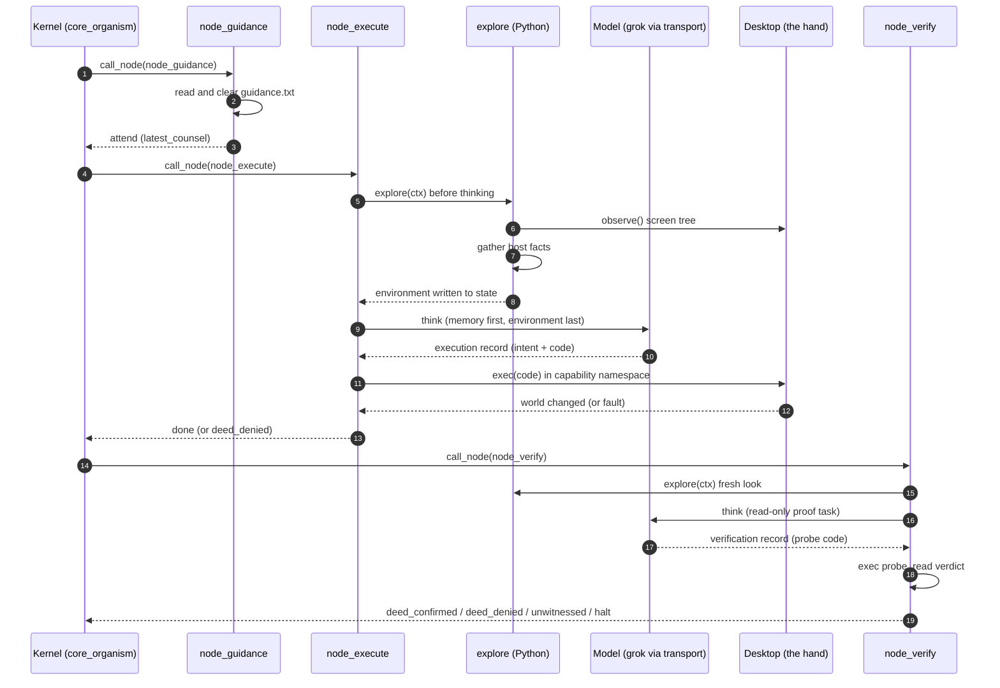
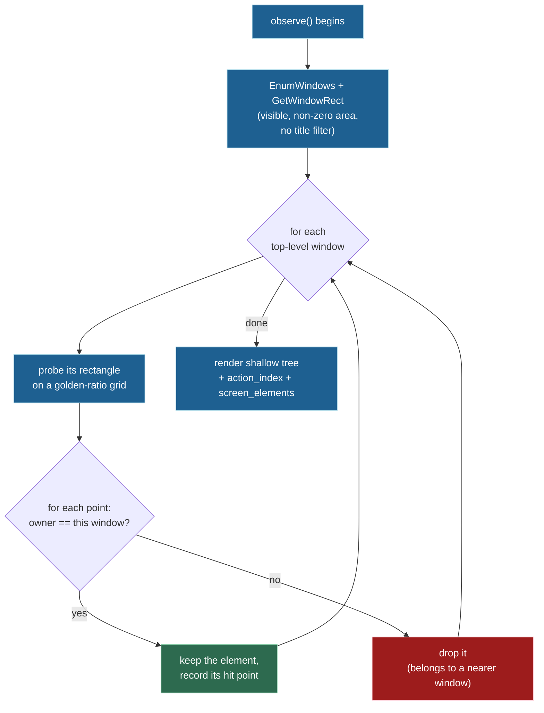
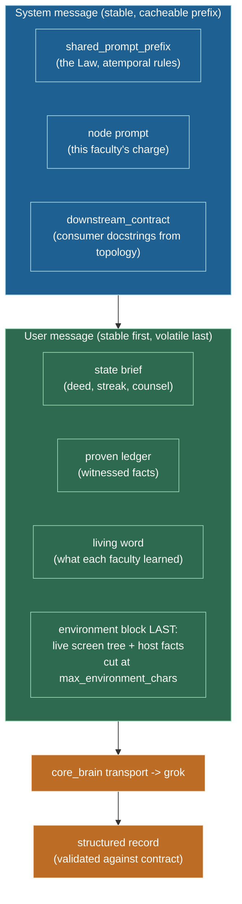
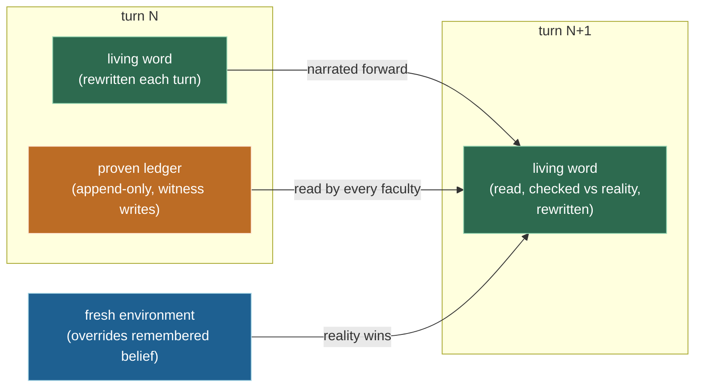
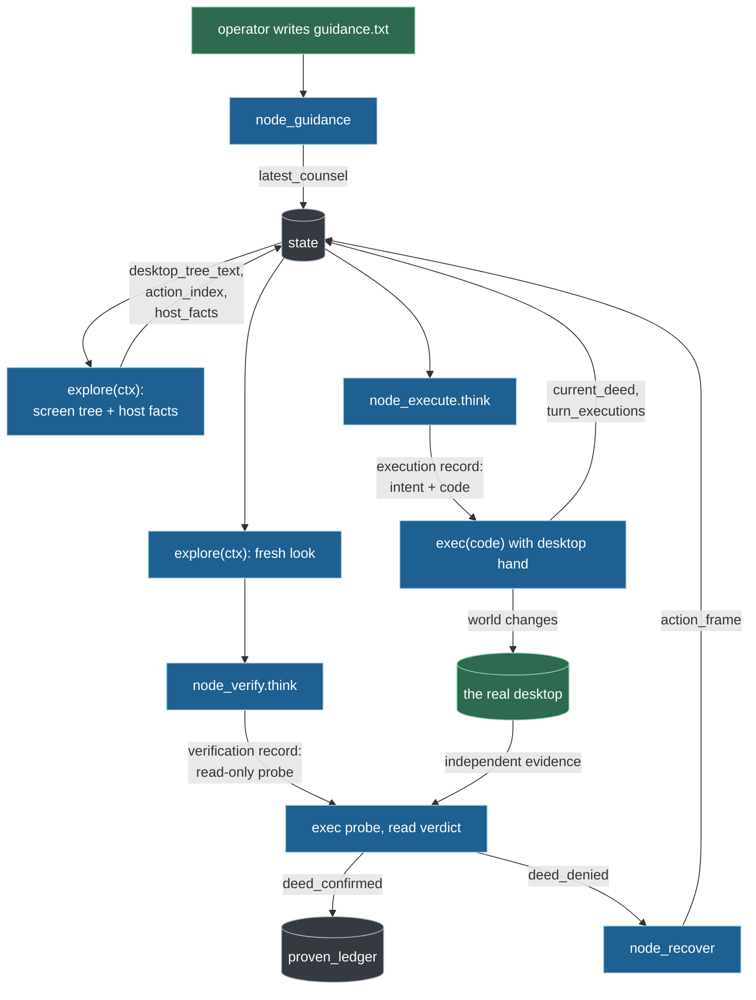

# endgame-ai

A stateless, atemporal, task-agnostic self-modifying LLM organism that drives a real Windows 11
desktop the way a human operator would: it looks at the screen, moves the mouse and keyboard, runs
commands, and can rewrite its own body while it runs.

This document is the durable knowledge base for the project. It is written to be as useful in a
hundred days as it is today. It carries only lasting truth (architecture, laws, reasoning) and no
volatile session state (no commit hashes, no "current phase"). The live code on disk is always the
final authority. Read it fresh, and where this document and the code disagree, the code wins. This
file explains how and why; the code is what is.

---

## Table of contents

- [The one-paragraph version](#the-one-paragraph-version)
- [Three ways to read this](#three-ways-to-read-this)
  - [For anyone (the plain-language version)](#for-anyone-the-plain-language-version)
  - [For a CEO (the value version)](#for-a-ceo-the-value-version)
  - [For an engineer (the technical version)](#for-an-engineer-the-technical-version)
- [Why this is not a normal agent](#why-this-is-not-a-normal-agent)
- [System topology](#system-topology)
- [The life of one turn](#the-life-of-one-turn)
- [The four nodes](#the-four-nodes)
- [The Law of Separated Powers](#the-law-of-separated-powers)
- [Perception: one rule, window first](#perception-one-rule-window-first)
- [How the prompt is assembled](#how-the-prompt-is-assembled)
- [Memory: the living word and the proven ledger](#memory-the-living-word-and-the-proven-ledger)
- [The record contracts](#the-record-contracts)
- [The desktop body](#the-desktop-body)
- [The wiring document](#the-wiring-document)
- [File-by-file map](#file-by-file-map)
- [Data flow reference](#data-flow-reference)
- [Running it](#running-it)
- [Verifying it (offline gates)](#verifying-it-offline-gates)
- [Design laws that never change](#design-laws-that-never-change)
- [Working methodology](#working-methodology)
- [Idea reservoir](#idea-reservoir)
- [Appendix: the deed-becomes-a-node idea](#appendix-the-deed-becomes-a-node-idea)
- [Glossary](#glossary)

---

## The one-paragraph version

Most software runs a task and stops. endgame-ai does not run a task at all. It runs a wheel. A wheel
of four wired steps turns continuously: read any human note, act on the screen, prove the act with
independent evidence, and recover when an act fails. A single plain-language goal is handed in from
outside, and the wheel turns until the goal is independently proven done. The organism keeps no
memory between steps except a short handwritten note it passes forward to itself, and it never trusts
its own claim that something worked. Something is only true when a separate part of the system, one
that could not have faked it, proves it by looking at the world. Everything the organism is lives in
a single editable document, and the organism is allowed to rewrite that document, including the rules
that define itself.

---

## Three ways to read this

The same system, explained for three different readers. Pick the one that fits, or read all three.

### For anyone (the plain-language version)

Imagine a very careful worker sitting at a Windows computer. You give the worker one sentence, like
"install this program" or "find this information and put it in a document." The worker does not have
a fixed script. Instead the worker repeats a simple honest loop:

1. Check if there is a new note from you.
2. Look at the whole screen and understand what is there.
3. Do one small thing, like clicking a button or typing a line.
4. Independently check whether that thing actually happened, using a different method than the one
   used to do it.
5. If it worked, remember only the lesson and move on. If it did not, figure out why and try a
   genuinely different approach.

The unusual part is the honesty rule. The worker is not allowed to say "done" and be believed. A
separate inspector has to confirm it by looking at the real world, the same way you would not accept
"I mailed the letter" as proof that a letter arrived. The worker also forgets almost everything on
purpose. Between each step it only keeps a tiny handwritten note to itself. This sounds like a
weakness, but it is the point: the worker cannot fool itself with old assumptions, because it barely
remembers them. It has to re-look at the real screen every single time.

The last surprising part: the worker is allowed to rewrite its own instructions. If it discovers that
one of its own tools is badly named or broken, it can open its own rulebook and fix it, then keep
going.

### For a CEO (the value version)

Traditional automation is brittle because it is scripted. It works until a button moves, a dialog
appears, or a website changes, and then it silently fails or, worse, reports success it did not
achieve. The two expensive failure modes in automation are the same two failure modes in delegation:
work that does not happen, and false claims that it did.

endgame-ai is built to remove the second failure mode structurally, not by trusting the model to be
honest. Every claimed result is checked by an independent part of the system that has no ability to
produce the result it is checking. This is the same principle as separation of duties in finance:
the person who moves money cannot be the person who signs off that it moved. Because of that
separation, a confident-sounding but false "task complete" cannot enter the record. Only
independently witnessed facts are recorded as done.

The system is also task-agnostic. Nothing about any specific job is baked into it. You do not build a
new bot for each workflow. You hand it a sentence, and the same general machinery pursues it. It
drives the real desktop through the same interface a human uses, so it is not limited to systems that
happen to offer an API. It works with the software you already have.

The properties that matter for a decision maker:

- Honesty is enforced by architecture, not by hope. Unverified claims cannot be recorded as success.
- It is general. One system, any goal expressible in a sentence, no per-task rebuild.
- It is transparent. The entire definition of the organism is one human-readable document.
- It can improve itself. When it hits a limit in its own tooling, it can repair that tooling.
- It has no hidden runtime state. Stopping it loses nothing, because there is nothing to lose.

The honest limitation to know: it is deliberately careful and step-by-step, and it re-checks the
world constantly. It favors correctness and provability over raw speed. That is a feature for work
where a false "done" is expensive, and a trade-off for work where speed matters more than certainty.

### For an engineer (the technical version)

endgame-ai is a small kernel that turns a directed graph of nodes. The graph, the prompts, the model
settings, and the validation rules all live in one JSON file, `wiring.json`, which is the single
source of truth for the organism. The kernel loads that file, validates its structure and coherence,
and then walks the graph: each node returns a signal, and the signal selects the next node through
the edge table.

There are four nodes. One is pure Python (a mailbox that reads an operator note). Three make a single
model call each (act, verify, recover). Before any model call, the kernel gathers a fresh view of the
environment (the on-screen UI tree plus host facts) and injects it into the request. There is no
separate perception node and no notion of the model "asking to look." Looking is intrinsic to
thinking.

The model is never trusted about outcomes. The actor node produces and executes code that changes the
world and may only claim intent. A separate verifier node produces read-only code that must prove an
effect was produced by some system other than the actor. Only the verifier can append to the proven
ledger. This is the Law of Separated Powers and it is enforced in the capability namespaces handed to
each node, not merely requested in prose.

State between turns is deliberately minimal. The organism is atemporal: it holds no conversation
history. What crosses the gap between turns is a small structured brief plus a "living word," a set of
short rows each faculty rewrites to say what it learned. The current on-screen reality always
overrides any remembered belief, because ids and coordinates are minted fresh on every look and die
with it.

Everything is fail-hard. No fallbacks, no defensive branches for unwired features, no silent
swallowing. A broken body (wiring that will not load, a missing faculty) ends the life with a raised
exception rather than limping. The design ethos is subtraction: remove a defect rather than add
machinery around it.

---

## Why this is not a normal agent

Most agent frameworks share a set of assumptions. endgame-ai rejects most of them on purpose. This
table is the fastest way to see what kind of thing it is.

| Typical agent | endgame-ai |
| --- | --- |
| Keeps a growing conversation history or memory store | Atemporal. Keeps only a small living word passed turn to turn. |
| Trusts the model's self-report ("I completed the task") | Trusts nothing. A separate witness proves every claim by independent effect. |
| Has a tool menu the model selects from | The only tool is code. The actor writes and runs Python. |
| Perception is a tool the model chooses to call | Perception is automatic. Python explores before every model call. |
| Task logic is coded into the agent | Task-agnostic. The goal is one sentence read fresh each life. |
| Framework code is fixed; the model works within it | Self-modifying. The organism can rewrite its own nodes and wiring. |
| Retries the same action on failure | Recovery must change the kind of approach, not repeat it. |
| Adds guardrails, limits, and step caps | No internal cap the organism cannot itself rewrite. Never caged. |
| Config is code or scattered across files | One JSON document defines the entire organism. |

The organism has almost none of the usual "features." That absence is the design. Fewer moving parts,
one source of truth, honesty enforced by structure, and a body it can reshape.

---

## System topology

The organism is a wheel of four nodes. `node_guidance` is the cycle start and is pure Python. The
other three each perform exactly one model call. Signals on the edges decide the next node.


The exact edge table, read from `wiring.json`:

| From | Signal | To |
| --- | --- | --- |
| node_guidance | attend | node_execute |
| node_execute | done | node_verify |
| node_execute | deed_denied | node_recover |
| node_verify | deed_confirmed | node_guidance |
| node_verify | deed_denied | node_recover |
| node_verify | unwitnessed | node_verify |
| node_verify | halt | (life ends) |
| node_recover | recovered | node_guidance |

`cycle_start = node_guidance`. The wheel turns until `node_verify` emits `halt`, the body raises (a
broken body ends the life hard), or the process is stopped from outside. There is no internal turn
cap, wall-clock leash, or step counter, and adding one would be caging the organism.

Note the two self-referential loops that keep the organism honest:

- `node_verify --unwitnessed--> node_verify`: if the witness's own probe crashes before it reaches a
  verdict, that is not a judgment about the world. It simply tries again with a simpler probe. It
  never routes a broken probe to recovery.
- `node_verify --deed_denied--> node_recover` and `node_execute --deed_denied--> node_recover`: both a
  failed action and a disproven action lead to recovery, which must frame a genuinely different next
  attempt.

---

## The life of one turn

This sequence shows one full lap of the wheel for a single successful deed, including where the
environment is gathered and where the model is called.



The key ordering fact: `explore(ctx)` always runs immediately before the model call inside
`BaseNode.think()`. The model never reasons on a stale view, and it never has to ask to look.

---

## The four nodes

Each node is a small Python file. The module-level docstring at the top of each node file is not a
comment. It is the input contract, and it is injected into the prompt of whatever node points to it
in the topology. That is why those docstrings are the only human-language prose kept in the code.

### node_guidance (cycle start)

Pure Python, no model call. It reads and clears an external counsel file (`guidance.txt`), a one-way
mailbox from a human operator to the organism. Any note found is placed into state as
`latest_counsel`, then it emits `attend`. It does not read the goal or the living word and sets no
intent. It does not explore, because it makes no model call.

Contract (injected): `[node_guidance] — Thou receivest the [guidance] file.`

### node_execute (the actor)

One model call. Before it thinks, Python explores. From the living word, the fresh environment, and
any `action_frame` handed over by recovery, it chooses one next deed, authors one Python script, and
runs it with `exec` in a capability namespace that includes the full `desktop` hand. The language is
the only tool; there is no tool menu. A script that raises does not end the life; it routes to
recovery as `deed_denied`. A clean run emits `done`.

Contract (injected): `[node_execute] — Thou receivest the fresh [environment] and any
[action_frame].`

Its output record type is `execution`.

### node_verify (the witness)

One model call. Before it thinks, Python explores. It authors read-only Python that must prove an
effect was produced by a system other than the actor. It cannot move the world: its namespace has no
`desktop` and no `consult_model`. It reads the live screen, the process table, ports, logs, the
filesystem, and the registry. Its probe must set a `verdict` mapping with boolean `goal_satisfied` and
`deed_confirmed` plus a non-blank `reason`.

- `goal_satisfied` true emits `halt`; the whole goal is proven and the life ends.
- `deed_confirmed` true emits `deed_confirmed`; a new witnessed fact enters the proven ledger.
- neither true emits `deed_denied`; recovery frames the next strike.
- a probe that raises before setting a verdict emits `unwitnessed`; it re-probes, and touches no body
  file.

Docstring (injected contract): `[node_verify] - Thou receivest the [goal], the last [deed] (its
description and hour of action), the [state] brief, and the fresh [environment].`

Its output record type is `verification`.

### node_recover (the conscience)

One model call. After a denial, it names the true defect in a `lesson`, then frames a next attempt
that departs from every approach already tried. The higher the failure streak, the wider it must
depart, up to and including repairing the organism's own code if a tool is the true defect. It
produces an `action_frame` (target, strategy, lesson) that the actor consumes on the next lap.

Docstring (injected contract): `[node_recover] - Thou receivest the denied deed, its evidence and
[failure_streak], and the fresh [environment].`

Its output record type is `recovery`.

---

## The Law of Separated Powers

This is the epistemic spine of the whole system, and the reason it can be trusted more than a normal
agent.

A claim that warrants itself proves nothing. A mouth that says "I speak true" offers the assertion and
its only evidence in the same hand, and one hand cannot weigh itself. This is the liar's paradox. An
amnesiac organism that trusted its own unverified claims would loop on a lie or declare false victory.

endgame-ai resolves this structurally, by separation of powers, not by asking the model to be honest:

- The actor (`node_execute`) moves the world and may only claim an intent.
- The witness (`node_verify`) proves an effect produced by some system other than the actor, and is
  given no hand to move the world it judges.
- Testimony, meaning any value the actor computed, printed, read back, or wrote to a file this life,
  is void as proof. It is the same hand speaking of itself.
- Truth of "X is done" is established only by a party that did not and could not do X.

This is enforced in code, not just prose. In `core_nodes.build_capability_runtime`:

- `build_capability_runtime(ctx)` gives the actor the full `desktop` hand plus `consult_model`.
- `build_capability_runtime(ctx, read_only=True)` gives the witness only `observe` and standard-library
  reads. No `desktop`, no `consult_model`, so it borrows no other mouth.

The `proven_ledger` is appended only by `node_verify`, never by the actor. The law is stated once in
`shared_prompt_prefix` and applied by reference downstream.

```mermaid
flowchart LR
    subgraph ACTOR["ACTOR (node_execute)"]
        A1["full desktop hand"]
        A2["consult_model"]
        A3["may only CLAIM intent"]
    end

    subgraph WORLD["THE WORLD"]
        W1["screen, processes,<br/>ports, files, registry"]
    end

    subgraph WITNESS["WITNESS (node_verify)"]
        B1["read-only, no hand"]
        B2["proves independent effect"]
        B3["sole writer of proven ledger"]
    end

    ACTOR -- "changes" --> WORLD
    WORLD -- "independent evidence" --> WITNESS
    WITNESS -- "appends only on proof" --> LEDGER[("proven ledger")]
    LEDGER -. "read by all faculties" .-> ACTOR

    classDef actor fill:#9d4edd,stroke:#e0aaff,color:#ffffff;
    classDef witness fill:#1e6091,stroke:#a9d6e5,color:#ffffff;
    classDef world fill:#2d6a4f,stroke:#95d5b2,color:#ffffff;
    classDef store fill:#bc6c25,stroke:#ffe8d6,color:#ffffff;
    class ACTOR,A1,A2,A3 actor;
    class WITNESS,B1,B2,B3 witness;
    class WORLD,W1 world;
    class LEDGER store;
```



Two further seams complete the honesty model:

- The deed-fault seam. A deed that raises is not death. The exception is captured and routed to
  recovery as evidence (`node_execute --deed_denied-->`). Only a broken body (wiring will not load, a
  dead faculty) ends the life hard.
- The unwitnessed seam. A witness probe that raises before setting a verdict makes no claim about the
  world. It returns for a fresh probe (`node_verify --unwitnessed--> node_verify`) and never enters
  recovery, because a broken probe is not a disproven deed.

---

## Perception: one rule, window first

Perception is a single rule in `core_observation.observe()`. There is no z-order math, no occlusion
model, and no separate hit-resolution pass.

The rule:

1. Enumerate the top-level windows with `EnumWindows` plus `GetWindowRect`. Their rectangles are
   ground truth.
2. For each top-level window (its own rectangle — paths are per-window, not one global path), walk a
   low-discrepancy probe grid (golden-ratio spacing is only how points are spread; not a fancy path
   language). Move the real mouse cursor (`SetCursorPos`) to each point, then probe. Stealing the
   cursor for the scan is accepted: hover-only data (tooltips, hover names) only appears when the
   pointer truly rests on the element. The prior cursor position is restored when the scan ends.
   `W0` is the synthetic screen root line in the tree, not a separate pre-scan pass.
3. At each point, keep an element only if `GetAncestor(WindowFromPoint)` resolves its owner to that
   same window.

A pixel where a nearer window sits answers with the nearer window's element, whose owner fails the
test and is dropped. So what survives per window is exactly its visible, reachable face, and the
click-point is proven by the very probe that found it.



Consequences that fall out for free:

- Depth is not a model-facing concept. The probe either keeps a point's element or drops it; there is
  no front/back label, no z-order field, and no active-window marker on the plane the model reads.
- Occlusion is not a computed concept. A covered element is never collected. There is no `occluded_by`
  field, no occluder naming, no separate resolution pass. A covered window contributes nothing; a
  visible one contributes its face.
- The window enumeration is deliberately loose (visible plus non-zero rect, no title-text filter) so
  untitled windows such as context menus, dropdowns, tooltips, system-error dialogs, and the taskbar
  itself are all seen. A minimum-area floor drops one-pixel and sliver junk.

What the model reads is a shallow tree, one line per interactive element: short id, role, name, and
`[action]` where the element affords one. There is no front/back or active-window notion: the screen
is a flat 2D plane of windows and their reachable elements. There are no pixel coordinates in the
text; the body reads px and py from the `action_index` by short id, because a coordinate on the line
is a dead token that only tempts the actor to nail a stale pixel. Full element text flows into the
tree.
There is no per-line truncation and no on-demand deepening, because the whole environment block is
bounded once at injection time.

What the model receives versus what stays in Python: `core_bus.environment_brief` gathers
`desktop_tree_text` plus the host facts, and `core_bus.render_environment` spends
`exploration.max_environment_chars` by a deterministic ranked fill (not a mid-string slice). All
window title lines are kept first so the map of the desktop survives. Element lines are filled in two
passes with no front/back preference: a fair character share across windows that have elements, then
round-robin overflow in the same window order. Host core facts (platform, machine, user, cwd, python,
shell tools) are always reserved; bulk `installed_apps` is included only if room remains after the
screen. Any omission ends with an explicit `[environment budget: ...]` marker — never a silent
mid-line cut. The full `action_index`, keyed by short id and carrying px, py, rect, runtime id, and
every UI-automation field, lives in the executor's Python namespace and never in the prompt.
Classification of what is actionable is by role sets in `action_for_role`; a non-actionable role
yields an empty action and is dropped at the render gate, so no explicit junk or container list is
needed.

---

## How the prompt is assembled

Every model call is built the same way, and the block order is chosen so the server can reuse its
key-value cache across turns. Stable content goes first; volatile content goes last.



The mechanics, all in `core_brain.think()`:

- The system message is `shared_prompt_prefix` plus the node prompt plus the `downstream_contract`.
  The downstream contract is built dynamically: for each outgoing edge of the emitting node, the
  target node's docstring is injected so the emitter knows exactly what its consumer expects. Prompts
  are therefore assembled from wiring plus topology, not hand-written per pair.
- The user message is assembled stable-first, volatile-last: first the organism's own memory (the
  state brief, the proven ledger, the living word), then last the single environment block (the live
  screen tree followed by the standing host facts).
- Only the environment block is budgeted, and only by `exploration.max_environment_chars` (default
  4000). Python assembles the world, Python spends the budget by ranked fill with a visible marker,
  Python inserts it. The organism's own memory is never trimmed by this value.
- Structured outputs are on. The record's JSON schema is derived from the record contract and enforced
  by the transport, so the model must return exactly the contracted fields.

The transport inside `core_brain` sets a per-process `prompt_cache_key` so the provider can reuse the
cached prefix across the many calls of one life. Reasoning happens natively in the model (reasoning
effort is set in `wiring.json`), not through a two-pass prompt.

---

## Memory: the living word and the proven ledger

The organism is atemporal. It holds no conversation history. Only two channels carry meaning forward,
and they are different in kind.

The living word is subjective and rewritable. It is a small set of rows, one per thinking faculty,
where each faculty writes what it learned this turn: what the world revealed, what was tried and how
it fared, what obstacle stands, and what the next true deed must be. It is planned from, not the root
goal. Every row is checked against the fresh environment and corrected where reality disagrees. A row
that merely restates the goal is wasted. This is where the organism narrates itself across wakings.

The proven ledger is objective and append-only. It records witnessed effects on the world, written
only by the witness, never by the actor. Every faculty reads it so the amnesiac organism does not redo
what already stands. If everything remaining is already in the ledger, the actor strikes the root goal
directly.



The failure streak is the third small piece of forward state: a counter of turns since the last
witnessed deed. The higher it climbs, the more recovery must change the kind of approach rather than
retry a failed one. The proven ledger and failure streak are handwired proxies for pressure. The
companion survival-drive idea (see the reservoir) would replace them with an external, unfakeable
energy economy that makes the world itself the verifier.

Short on-screen identifiers (W1, e5) are minted anew on every look and die with it. No bare id may
enter any text that outlives the turn. A thing is named by what it is: its role, its place, its
meaning. A prior that must never be relearned belongs distilled into the prompt, not left in the
volatile living word where it would evaporate within a lap.

---

## The record contracts

There are exactly three record types. Each model call must return one, and its fields are enforced by
schema. All three set `additional_properties: false`, so a record may carry only its contracted
fields and nothing more. Every listed field is required, typed as a string, and must be non-blank.

| Record type | Produced by | Fields |
| --- | --- | --- |
| execution | node_execute | perceived, alternatives, intent, code, goal_interpretation |
| verification | node_verify | code, goal_interpretation |
| recovery | node_recover | lesson, target, strategy, goal_interpretation |

Field meanings:

- perceived: what the actor sees as the relevant state right now.
- alternatives: each road the actor weighed and forsook, and why. If only one road presents itself,
  it says so plainly.
- intent: the true next effect the actor seeks to bring forth.
- code: the Python to run. For the actor it changes the world; for the witness it is a read-only probe
  that must set the `verdict`.
- goal_interpretation: this faculty's one row of the living word.
- lesson: the named defect, why by the evidence it truly failed, and what must change.
- target: bound only to a thing the fresh environment bears.
- strategy: the framed next attempt, departing from every approach already tried.

There is no `risk` field in recovery. If any source says otherwise it is stale.

The contract is validated in `core_brain._validate_record_contract`: record type must match, required
keys must be present, types must match, non-empty fields must be non-blank, enum fields must be in
range, and unexpected keys are rejected when `additional_properties` is false. The same contract is
turned into a JSON schema by `core_brain._record_response_format` and enforced at the transport.

---

## The desktop body

`core_desktop.py` is the hand. It is Windows-only (it uses `comtypes` and the UI Automation API plus
`ctypes` for input synthesis). The actor reaches these by bare name in its namespace.

| Method | What it does |
| --- | --- |
| `observe()` | Return the current screen tree, action index, and screen elements. |
| `click(x, y)` | Move the cursor and click at physical coordinates. |
| `type_text(text)` | Synthesize real keystrokes via SendInput, one UTF-16 code unit at a time. |
| `paste_clipboard(text)` | Set the clipboard, then paste with Ctrl+V. |
| `set_clipboard(text)` | Set the clipboard contents. |
| `press_key(key)` | Press and release one named key. |
| `hotkey(*keys)` | Press a chord and release in reverse order. |
| `scroll(x, y, amount)` | Scroll the wheel at a point. |
| `open_url(browser, url)` | Open a URL with the default handler or a named browser. |

Two text-entry roads exist on purpose, because they are genuinely different:

- `type_text` synthesizes real keystrokes (SendInput with KEYEVENTF_UNICODE per UTF-16 code unit). It
  produces the trusted WM_CHAR and DOM insertText events that rich web editors like ProseMirror
  accept. It is the road for any editor that does not honor a paste.
- `paste_clipboard` sets the clipboard as UTF-8 and pastes with Ctrl+V. It is a wholly separate road
  for content a keystroke stream cannot carry.

The actor targets by short id from the `action_index` and reads px and py there. It does not hardcode
coordinates.

The `observe()` verb also remains available to the actor and the witness for a deliberate mid-script
re-look while waiting for something to arrive (an app launching, a window opening). It returns the
screen only, which is why it keeps its name rather than being called explore.

---

## The wiring document

`wiring.json` is the entire definition of the organism. It stays inert data. It is not converted to
executable config, because a syntax error in a `.py` config would brick the organism and make
self-rewrite and validation harder. The organism may rewrite it on the spot. It is LF-terminated.

Top-level structure, verified against disk:

```
schema              "endgame-ai.wiring.v1"
model
  transport         "transport_xai"
  transport_config
    transport_xai
      url           "https://api.x.ai/v1/responses"
      structured_outputs { enabled: true }
      request       { model: "grok-4.5", temperature: 0.4, reasoning.effort: "medium", store: false }
      request_profiles
        web_search  { reasoning.effort low, web_search tool, max_tool_calls 4 }
        read        { reasoning.effort medium, max_output_tokens 16384 }
  global            { timeout: 240 }
  organs
    execution       { reasoning.effort medium, max_output_tokens 16384 }
    verification    { reasoning.effort medium, max_output_tokens 16384 }
    recovery        { reasoning.effort medium, max_output_tokens 16384 }
paths
  guidance          "guidance.txt"
exploration
  step_px           64
  max_subtree_nodes_per_point 2000
  max_environment_chars       4000
topology
  cycle_start       "node_guidance"
  nodes             [node_guidance, node_execute, node_verify, node_recover]
  edges             { see the edge table above }
shared_prompt_prefix   the Law of Separated Powers, atemporal rules
prompt_templates       7 templates (living word, proven ledger, headers)
prompts                node_execute, node_verify, node_recover
record_contracts       execution, verification, recovery
```

The seven prompt templates are: `living_word_header`, `living_word_goal_row`, `living_word_empty_row`,
`proven_ledger_empty`, `proven_ledger_header`, `standing_host_header`, `environment_screen_header`.

`core_wiring.load_wiring()` validates both structure and coherence: the topology must be reachable
from the cycle start, every edge must have exactly one existing target, every node must have a plugin
file, the three record contracts must be well-formed, and the exploration counts must be positive
integers. It raises on any violation, so a broken wiring never runs.

The scriptural register in the prompts (King James commandment prose) is a deliberate steering
technique, not ornament. It pulls the model out of the chatty, confabulation-prone assistant basin
into a high-fidelity, low-variance region where output is recalled rather than improvised. It is kept
on purpose.

---

## File-by-file map

Every tracked source file, what it is, and roughly how large it is. Core files import the standard
library only. Node files carry exactly one docstring each and no other prose.

| File | Role |
| --- | --- |
| `core_organism.py` | The kernel. Loads wiring, holds state, turns the wheel, routes signals to nodes. |
| `core_wiring.py` | Loads and validates `wiring.json` (structure and coherence), resolves prompts. |
| `core_nodes.py` | OOP faculties: `BaseNode`, guidance/execute/verify/recover, `FACULTIES` registry, `explore`, capability namespaces, `call_node`. Input contracts live as each class's `contract` string. |
| `core_brain.py` | `think` + xAI transport: assemble messages, enforce contracts, derive schemas, HTTP call. |
| `core_bus.py` | Records, signals, state and environment briefs, ranked environment budget, ledger helpers. |
| `core_observation.py` | Window-first perception, cursor-traversal probes, UI Automation scan, tree render. |
| `core_desktop.py` | The hand: input synthesis and the `observe` entry point. Windows-only. |
| `wiring.json` | The single source of truth: model, paths, exploration, topology, prompts, contracts. |
| `guidance.txt` | The operator counsel mailbox (created and cleared at runtime; not tracked). |

The convention on prose: faculty input contracts are the `contract` class attributes on the nodes in
`core_nodes.py` (injected as downstream contracts). Everything else that needs saying lives in
`wiring.json` prompt text or in commit bodies.

---

## Data flow reference

How a single deed moves through state, from operator note to proven fact.



State keys that carry a turn:

- From guidance: `latest_counsel`.
- From explore: `desktop_tree_text`, `action_index`, `screen_elements`, `observation_artifact`,
  `host_facts`, `observed_at`.
- From execute: `current_deed`, `turn_executions`, `goal_interpretations`, `last_action_at`, and it
  clears `action_frame` and `last_verification`.
- From verify: `verification`, `last_verification`, and on confirmation `proven_ledger`,
  `witnessed_deed_count`, a reset `failure_streak`, cleared `action_frame` and `current_deed`.
- From recover: `action_frame`, `last_recovery`, a bumped `failure_streak`.

The state brief that reaches the model carries `goal_interpretations`, `proven_ledger`,
`latest_counsel`, `current_deed`, `failure_streak`, and `has_action_frame`. The environment brief
carries `desktop_tree_text` and the host facts.

---

## Running it

The organism runs on Windows because perception and input are Windows-only. Set `XAI_API_KEY` in the
environment first.

Basic run:

```
python core_organism.py "your one sentence goal"
```

The organism prints nothing. There is no logging in the body. stdout stays empty and stderr carries
only a crash traceback. The true progress feed is the real desktop, because the organism drives the
GUI.

To watch a full life without a foreground shell timeout cutting it off, launch it detached and observe
from outside:

```
powershell.exe -NoProfile -Command "cd \"$env:USERPROFILE\Downloads\endgame-ai\"; Start-Process -NoNewWindow -PassThru python -ArgumentList 'core_organism.py','THE ROOT GOAL' -RedirectStandardError run.err -RedirectStandardOutput run.out | Select-Object -ExpandProperty Id"
```

Then observe by:

- Watching the real desktop. This is the primary feed.
- Optionally following the crash file in a second window:
  `Get-Content "$env:USERPROFILE\Downloads\endgame-ai\run.err" -Wait -Tail 20` (empty while healthy).
- `Get-Process python` to see whether the life still turns.

Stop it with `Stop-Process -Id <PID>` (the launch prints the PID). A hard kill corrupts no state,
because the organism is atemporal and keeps no memory. Glance at the screen afterward, since stopping
mid-action can leave the desktop half-acted.

To send the running organism a note, write a line into `guidance.txt`. The next lap of
`node_guidance` reads and clears it.

---

## Verifying it (offline gates)

These gates are necessary but never sufficient. Behavioral truth lives only on the real desktop. Run
them on every change.

1. Every source file parses:

   ```
   python3 -c "import ast,glob;[ast.parse(open(f).read()) for f in glob.glob('*.py')]"
   ```

2. The wiring loads and is coherent (structure and topology):

   ```
   python3 -c "import core_wiring as w; w.load_wiring()"
   ```

3. Lint the touched files with pyflakes, run through the Windows Python for anything that imports
   `core_observation` or `core_desktop` (they need `comtypes` and UI Automation, which are Windows
   only). Plain WSL `python3` is fine only for `ast.parse` and `core_wiring.load_wiring()`.

The only real witness is a live run: `python core_organism.py "<goal>"` on Windows, watched on the
desktop.

---

## Design laws that never change

These are the invariants. They are why the system behaves the way it does, and they should survive any
rewrite.

- Fail hard. No fallbacks, no defensive branches for unwired features, no silent swallowing. A hard
  visible failure drives correction; a swallowed one rots the system.
- Never cage the organism. Add no limit, counter, branch, delay, or guard it cannot itself rewrite
  through the wiring. Logically sound wiring, not guard branches.
- Subtraction over addition. Prefer removing a defect to adding machinery around it. Binary
  essentiality: a thing is essential or it is removed completely, with nothing left dangling.
- One source of truth. The wiring document defines the organism. Prompts are assembled from it plus
  the topology, never hardcoded per pair.
- Honesty by structure. The actor claims, the witness proves, and only the witness writes the ledger.
  No faculty may bend the Law of Separated Powers.
- Atemporal by design. No hidden store, no scratchpad that survives a turn. What is not narrated
  forward is forgotten, so the organism cannot fool itself with a stale belief.
- The defects are the substrate. A defect the organism can observe and rewrite is a feature of the
  self-modifying design. Prefer making defects visible over hiding them. Do not over-cure.
- State what is, positively. Ghost negations (naming an absent thing only to deny it) are bloat and
  plant the very idea they deny. Negate only a real model prior.
- Reuse over new architecture, but rewrite whole components when logic shows it superior to patching.
  Observation was once rebuilt from zero on the single window-first rule, with whole files deleted.
  That is the expected mode, not the exception.

---

## Working methodology

The durable protocol for anyone working on the organism.

- The code on disk is the final authority. This document explains how and why but never overrides the
  files. Read fresh, correct prior findings when a full read overturns them, and verify claims against
  the files rather than asserting from memory. This applies to any assistant report too: confirm every
  finding on disk before acting on it.
- Root is `/mnt/c/Users/ewojgab/Downloads/endgame-ai` (a WSL2 mount of a Windows folder). The remote
  is `github.com/wgabrys88/endgame-ai.git`. No branch name is baked into code; the organism stays
  correct regardless of where the folder sits or which branch it lives on.
- All git, pip, and real organism runs go through
  `powershell.exe -NoProfile -Command "cd 'C:\Users\ewojgab\Downloads\endgame-ai'; ..."` from WSL,
  because credentials and the API key and UI Automation are all on the Windows side.
- Commit each unit of work with full reasoning in the body. Commit bodies are meta-descriptive: what
  kind of feature or defect was added, removed, or replaced, and why, not a line-by-line diff, so a
  future reader resumes with understanding.
- `.gitignore` is a whitelist with CRLF line endings. Every tracked file must appear as `!filename`,
  and a deleted tracked file must have its `!` line removed. `str_replace` can choke on the CRLF; use
  `sed`. `wiring.json` itself is LF.
- Advance the known-good marker on every completed improvement, but flag any advance made ahead of a
  live-proven run and give the one-command revert
  (`git update-ref refs/endgame/known_good <prev-sha>`). The marker can always be moved back.
- Work in explicit phases. State a phased plan before major work. Near the context limit, stop,
  summarize, write exact next-phase instructions, and checkpoint.
- Do not add comments or docstrings as prose. Faculty input contracts are the `contract` attributes
  on node classes in `core_nodes.py`. Everything else that needs saying goes in `wiring.json` prompt
  text or commit bodies.

---

## Idea reservoir

Operator-originated design seeds, evaluated against live code but deliberately deferred, not rejected.
They are kept because the trust loop of bold ideas evaluated against reality is how the organism was
built.

1. Environment in the living word (self-narration). Judged good, staged as a prompt phase, needs a
   live run to prove. The living word should also narrate environmental change across wakings ("I am
   verifier, only Notepad visible, a process hurting CPU, that changes everything"), not just goal
   rows. The exploration block already lays the standing host facts beside the screen tree, a partial
   down-payment.

2. Goal-river steering exploration. Held on the task-agnostic law. Exploration is pure Python with no
   model call; making it goal-aware breaks the blind-observer design. Window titles on the flat 2D
   plane plus the standing host already name what is open. Revisit only if a live run shows the
   executor repeatedly acting on the wrong surface.

3. Tab-jump observer (experimental alternate topology). Deferred by operator caution. Holding Tab
   jumps across interactive web elements, but Tab can generate actions, and an observer must never
   mutate the world. A candidate sub-topology someday, not now.

4. Multiple linear sub-topology of scan plus elimination. Everything in Python is fast versus a model
   call, so gather all data first and eliminate by pattern. This birthed the single-rule observation
   rebuild. The deeper seed is still open: scan could fan into several cheap linear Python passes.

5. Single injection-time character budget plus explosion scan. One deterministic budget applied at the
   moment before injection, with a visible trim marker, never silent. Realized as
   `max_environment_chars` spent by ranked fill in `render_environment` (titles first, fair share,
   equal round-robin, host core reserved, `installed_apps` deferred — no front/back preference). The
   explosion scan (depth graduated by distance from a focal point) is partially pre-empted by the
   per-window scan and may not be needed while the tree stays small.

6. The witness proportional to the deed. The witness fires the full read-only-proof faculty even for a
   single trivial click. This is not a defect to remove; a correct witness handles cheap deeds cheaply.
   The fix is making verification proportional to the deed, not removing independent verification.
   Needs design and a live run.

7. Survival-drive energy economy. The proven ledger and failure streak are handwired proxies for
   pressure. The larger vision replaces them with an external, unfakeable energy economy that makes the
   world itself the verifier.

---

## Appendix: the deed-becomes-a-node idea

A candidate future architecture, recorded as an idea and its critique. Not built.

The organism would ship as a seed topology, and thereafter an executor's deed would no longer be a
throwaway script. It would be a new node with its own docstring-prompt, which the executor wires into
the graph at connection points it chooses. Six mechanisms, in dependency order:

1. Deed becomes node. The executor authors a node (behavior plus docstring-prompt plus chosen edges),
   not a script. The atomic act.
2. Fitness by use. Each non-core node counts its own goal-advancement over time as fitness. No external
   judge, no commit ceremony. Not raw invocation count, which would reward a click loop.
3. Pruning. Low-fitness nodes are discarded, high-fitness persist, and the graph self-cleans.
4. Stigmergic routing (the key). Flow is not a hardcoded edge table but ant-colony pathfinding: data
   walks the graph, reinforces paths that reach the goal, and evaporates paths that do not. The
   load-bearing insight is that hardcoded edges cannot survive nodes that appear at runtime, but
   weighted evaporating paths can.
5. Backprop of structure. When a new node proves useful, the system may rewire neighboring nodes to
   accommodate it. Deferred, because there is no convergence guarantee and the system already
   oscillates.
6. Recursion without children. To call the whole system you do not spawn a child; you wire a second
   executor in parallel, like resistors in parallel, and flow splits through it. That parallel executor
   is a sub-organism achieved purely by wiring, bounded by the same global budget.

Unifying principle: core reuses code, node reuses node, topology reuses itself. Self-similarity at
every level is the real fractal, not literal spawning.

Hard invariants the idea must not breach:

- Fail-hard core versus explore-and-decay periphery. The boundary must be explicit and un-crossable.
- Grown wiring stops being human-legible. A legible body becomes a learning body. Name that trade
  before committing to it.
- A node must never gain the power to rewrite the survival criterion.

Deepest tension: atemporalism says the body carries only wiring plus living word. This idea makes the
wiring itself the accumulating memory. Legal, but the wiring stops being a small human-authored
artifact and becomes a large machine-grown, partly-illegible structure. It trades a legible body for a
learning one.

---

## Glossary

- Actor: `node_execute`, the faculty that changes the world and may only claim intent.
- Atemporal: holding no memory of past turns; only the living word and ledger cross the gap.
- action_frame: data produced by recovery and consumed by the actor to shape the next attempt. Not a
  node.
- Body: the node files and wiring that define the organism, all editable by the organism.
- deed_denied: a signal meaning an act failed or was disproven; routes to recovery.
- deed_confirmed: a signal meaning the witness proved a new effect; a fact enters the proven ledger.
- downstream_contract: the consumer docstrings injected into an emitter's prompt, built from topology.
- Environment: the fresh view gathered before every model call: the screen tree plus host facts.
- explore: the Python step that gathers the environment before each thinking faculty runs.
- Faculty: a thinking node that makes one model call (execute, verify, recover).
- halt: the signal that ends the life, emitted by the witness when the whole goal is proven.
- Host facts: platform, machine, user, cwd, python, shell tools, installed apps.
- Law of Separated Powers: the rule that the maker of a deed may never be its judge.
- Living word: the small set of rewritable rows through which faculties narrate what they learned.
- Node: one step in the graph; a Python file with a single injected docstring.
- Proven ledger: the append-only record of witnessed effects, written only by the witness.
- unwitnessed: a signal meaning the witness's own probe crashed; it re-probes and makes no claim.
- Witness: `node_verify`, the read-only faculty that proves effects and alone writes the ledger.
- Wiring: `wiring.json`, the single document that defines the entire organism.

---

The code on disk is the final authority. This document is how and why; the code is what is. Read it
fresh, and where they disagree, the code wins.
