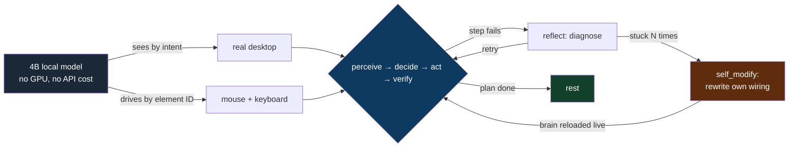
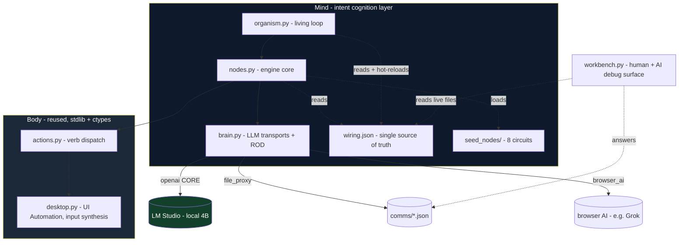
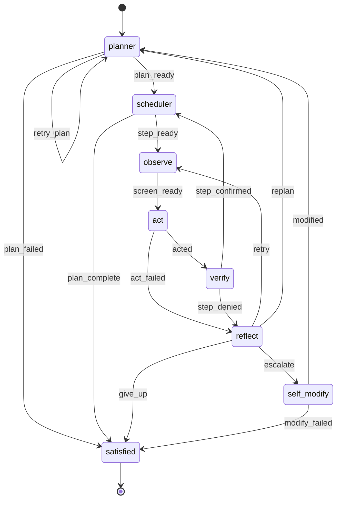

# endgame-ai

A living, unconstrained organism that inhabits a real Windows desktop. It sees the screen,
moves the mouse and keyboard like a human, forms its own intentions, acts on them, judges its
own success, recovers from its own failures, and — when stuck — rewrites its own wiring,
including how it thinks. There is no constrained mode and no safety gate. The machine is its
body. Its character is not enforced by rules; it emerges from a small loop, a strict intent
contract, and prompts written to make a language model behave like a curious, living operator
rather than a chat box.

It is built from a handful of small Python files and one JSON file. **Standard library only.**
No framework. No agent SDK. No RAG, no MCP, no LangChain, no vector store, no cloud API, no
fine-tune. A local model on a laptop with no GPU. And it works.

> **This document is written to be the single source of truth and a complete handover.**
> It is written on the assumption that the conversation and context that produced it will be
> lost. Every load-bearing claim here is backed by a log line from a real run on real hardware.
> Where excitement outruns evidence, this document says so plainly. Read §0 first if you are an
> AI agent picking this up cold — it is your bootstrap prompt.

---

## Table of contents

0. [Bootstrap prompt for the next AI agent](#0-bootstrap-prompt-for-the-next-ai-agent)
1. [What was proven on 2026-06-28](#1-what-was-proven-on-2026-06-28)
2. [The claim, stated honestly (and its limits)](#2-the-claim-stated-honestly-and-its-limits)
3. [The idea](#3-the-idea)
4. [Architecture](#4-architecture)
5. [The cognition contract: intent, not strings](#5-the-cognition-contract-intent-not-strings)
6. [ROD — the two-call decision](#6-rod--the-two-call-decision)
7. [Swappable brains](#7-swappable-brains)
8. [The living loop (topology graph)](#8-the-living-loop-topology-graph)
9. [The two runs — full evidence](#9-the-two-runs--full-evidence)
10. [The self-modification event — verbatim ground truth](#10-the-self-modification-event--verbatim-ground-truth)
11. [MoE self-critique: what this proves, what it does not](#11-moe-self-critique-what-this-proves-what-it-does-not)
12. [Methodology — how to run and evaluate this system](#12-methodology--how-to-run-and-evaluate-this-system)
13. [Running it](#13-running-it)
14. [The workbench](#14-the-workbench)
15. [Roadmap — from proven to vision](#15-roadmap--from-proven-to-vision)
16. [Philosophy](#16-philosophy)
17. [Handover details and open questions](#17-handover-details-and-open-questions)

---

## 0. Bootstrap prompt for the next AI agent

> Copy everything in this block as your operating brief if you are an AI agent (Kiro, OpenCode,
> Claude Code, or similar) continuing this work.

```
You are continuing work on endgame-ai: a living, unconstrained organism that operates a real
Windows desktop through a small Python loop + one wiring.json + a local LLM. You have just
lost all prior conversation context. This README is your memory. Trust it; verify against logs.

WHAT THE SYSTEM IS
- A perceive -> decide -> act -> verify -> reflect loop driven by a data-defined topology graph.
- The "brain" is a stateless LLM reached through a swappable transport (openai/file_proxy/
  browser_ai). It boots on `openai` against LM Studio (local). No fallback: errors raise.
- Every LLM reply is a typed record {record_type, data} validated against a contract. Wrong
  type -> the node fails hard and routes to reflect.
- When the organism gets stuck (N consecutive failures), reflect escalates to self_modify,
  which can rewrite ANY value in wiring.json at runtime, including model.transport (how it
  thinks). The engine reloads wiring and rebinds the brain live.

GROUND RULES (do not violate)
- Branch is `size-shrinking` (and now possibly merged to main by the human). Never force-push,
  never touch main without explicit instruction. The human pushes; you do not.
- Standard library only. No frameworks, no dependencies, no RAG/MCP/LangChain. "Less is best."
- No fallbacks, no constrained mode, no safety gate inside the organism. It is unconstrained by
  design. The ONLY hard safety line: never let an action close/kill the terminal or window that
  hosts the running session.
- Operate on INTENTIONS, not literal strings. Keep the typed-record contract intact.
- Do NOT recreate the deleted engine.py / runtime.py / wiring-editor.html architecture.
- Two-layer gate on changes: gather data -> report with evidence -> wait for the human to
  decide -> only then change code. Ground every claim in run.log + state.json + the LM Studio
  server log. If it is not in a log, do not claim it.

ENVIRONMENT
- WSL2 drives native Windows via powershell.exe. Repo: C:\Users\<user>\Downloads\endgame-ai
  (WSL: /mnt/c/.../endgame-ai). Windows Python: "C:\Program Files\Python313\python.exe".
- LM Studio core brain at http://localhost:1234, model nvidia-nemotron-3-nano-4b, ~6 tok/s,
  no GPU. Each decision = 2 LLM calls (ROD). One step ~ 4-8 min. Runs are long (30-90+ min).
- LM Studio server log (ground truth) under
  C:\Users\<user>\.cache\lm-studio\server-logs\<month>\<date>.N.log

ANTI-HANG DISCIPLINE (mandatory)
- Wrap every powershell.exe call from WSL in `timeout N`.
- Launch the organism DETACHED: Start-Process -WindowStyle Hidden -PassThru, redirecting to
  run.log / run.err.log. The detached process SURVIVES the launcher being killed by timeout
  (a 124 exit on the launch command is EXPECTED).
- Pass the goal as a SINGLE quoted token inside the PowerShell arg-line string, or argparse
  splits it on spaces and rejects it.
- Poll run.log + state.json with bounded timeout calls. Never run unbounded/interactive commands.
- Do not probe the workbench with Invoke-WebRequest on a slow machine (it can hang); use a raw
  TCP connect test.

FIRST ACTIONS
1. Read this whole README. 2. Confirm LM Studio is up (GET /v1/models). 3. Read organism.py,
brain.py, nodes.py, wiring.json, seed_nodes/*.py before changing anything. 4. Bring the human a
MoE mental-simulation of the §15 roadmap options and let them choose. Then act, gated.
```

---

## 1. What was proven on 2026-06-28

On one ordinary Windows laptop **with no NVIDIA GPU**, with a **4-billion-parameter local
model** (`nvidia-nemotron-3-nano-4b` in LM Studio, ~6 tokens/sec, **zero API cost**), across
two unsupervised runs totaling ~110 minutes, the organism — **entirely on its own** — did all
of the following, and we have the logs:

- **Woke up, read a goal, decomposed it into an ordered plan**, and pursued it step by step.
- **Operated the real desktop through human-like input**: across the long run it fired
  `launch` ×11 (only ever `notepad`), `write` ×46, `focus` ×11, `hotkey` ×12 (`alt+f4` ×6 to
  close windows, `win+del` ×6), `open_url` ×5, `wait` ×5, and `click` ×9 — **every click
  targeted a labeled UI element by its semantic ID (`[1]`, `[10]` = dialog buttons), never a
  raw screen coordinate.** No blind clicking. No flailing. No damage.
- **Verified its own work by intent** and, when a step was judged not-done, **diagnosed why and
  recovered** — repeatedly, succeeding on retry.
- **Got genuinely stuck, escalated to self-modification, rewrote its own wiring.json at runtime
  TWICE, and survived both** — the engine reloaded the wiring and re-bound the brain live, with
  no crash.
- After each self-modification, **re-planned** and broke its own deadlock, and over time its
  plans **drifted from rote text entry toward a conceptual framing** of the goal (constructing a
  "contrasting environment" to express "thinking differently").
- **Cleaned up after itself** — closed Notepad with `alt+f4`, and when Notepad raised a
  "Do you want to save changes?" dialog it engaged the dialog buttons by ID rather than
  thrashing. It even reached a real **"Save as"** dialog on its own initiative.
- Was stopped manually by the operator while **healthy** (not crashed). No orphan processes, no
  desktop left in a broken state.

It did the same with **no goal at all** in an earlier session: it formed its own intention and
carried it out.



---

## 2. The claim, stated honestly (and its limits)

**The claim this project can defend with evidence:**
A tiny local model, given only a screen and a set of human-like verbs, sustained a multi-step,
self-verifying, self-recovering, *self-modifying* loop on a live operating system for over an
hour without crashing, without doing harm, and without any of the usual agentic scaffolding
(no RAG, MCP, LangChain, API tools, or fine-tuning). The hard mechanical core of an autonomous
desktop operator — and the live, surviving self-rewrite of its own cognition wiring — **is real
on commodity hardware.**

**The honest extrapolation:**
If a 4B model on a GPU-less laptop already does this, then the same architecture with a stronger
brain (local or, via the existing transport seam, a frontier model) is a *measurable* next step,
not a fantasy. The remaining gap is a list of **named, located, reproducible problems** (§11,
§15) — several one prompt-edit or one topology-edge away.

**What this is NOT (and this document will not pretend otherwise):**
- It is **not** a proven human-replacement worker. It operated Notepad and a save dialog, not a
  job.
- The organism did **not** spontaneously swap its brain to think differently. When stuck, it
  used self-modification as a *task-debugging wrench* (it patched peripheral config fields), and
  in its own recorded reasoning it considered changing transport and **explicitly rejected it as
  "not needed"** (§10). That is a profound and *useful* result — but it is the opposite of the
  "it chose to upgrade its own mind" story. We report what happened, not what we hoped.
- "Living entity" is a design stance and a useful metaphor, not a metaphysical claim. The
  document uses it because the system is built to behave like one; it does not assert sentience.

Holding the strong claim and these limits together *at the same time* is the point. The evidence
is more persuasive precisely because it is not oversold.

---

## 3. The idea

A small, dumb loop hosts something meant to feel alive. The loop runs a node, reads the signal
it emits, follows an edge to the next node. Nothing more. **All intelligence lives in three
places:**

1. **The brain** — a stateless LLM, reached through a swappable transport.
2. **The circuits** — planner → act → verify → reflect, shaped entirely by prompts and a typed
   record contract.
3. **Self-modification** — the organism can rewrite its own wiring at runtime, including *how it
   thinks*. (Proven to execute and survive — §10.)

One mature, dependency-free Windows I/O layer (`desktop.py` + `actions.py`) is reused unchanged;
a thin intent-based cognition layer sits on top.

---

## 4. Architecture

```
organism.py     the living loop; drives the topology graph; reloads brain on self_modify
brain.py        stateless LLM, 3 transports, ROD two-call, fail-hard (no silent fallback)
nodes.py        engine core: hot-swappable node loader, call_node (ROD + record validation),
                wiring patch, desktop I/O bridge, per-circuit context blocks
wiring.json     single source of truth: model, verbs, reasoning contract, topology, prompts
seed_nodes/     planner, scheduler, observe, act, verify, reflect, self_modify, satisfied
workbench.py    minimal http.server debug/control surface (no dependencies)
actions.py      verb dispatch over the desktop (reused, data-driven from wiring.verbs)
desktop.py      Windows UI Automation + input layer (reused, stdlib + ctypes only)
evidence/       committed proof artifacts from real runs (run log + final state snapshot)
```



**Mutability boundary.** Seed nodes in `seed_nodes/` are copied to `live_nodes/` on first run;
`live_nodes/` is what executes and is re-read on every node invocation, so editing a node
hot-swaps behavior with no restart. State persists to `state.json`. The body layer
(`desktop.py`, `actions.py`) never changes between runs. `wiring.json` is the one file the
organism can rewrite about itself.

---

## 5. The cognition contract: intent, not strings

The organism never matches literal UI text to judge success. The planner writes each step's
`done_when` as an **intent**; a dedicated **verifier** judges whether the *spirit* of that
intent is met from visible evidence. Every LLM reply is a **typed record**, validated against a
contract. Wrong record type → the node **fails hard** and routes to the reflector. No guessing,
no silent fallback.

| circuit      | `record_type` | the decision it commits                         |
|--------------|---------------|-------------------------------------------------|
| planner      | `task`        | an ordered list of `{description, done_when}`   |
| act          | `action`      | `conclusion: EXECUTE/CANNOT` + a verb chain     |
| verify       | `verdict`     | `confirmed: true/false` + evidence              |
| reflect      | `diagnosis`   | why it failed + retry / replan / escalate       |
| self_modify  | `wiring_patch`| a `{op, path, value}` edit to its own wiring    |

Verbs the body exposes (data-driven from `wiring.verbs`): `click`, `write`, `press`, `hotkey`,
`focus`, `open_url`, `scroll`, `wait`, `launch`, `remember`.

**Proven in practice.** The observation layer presents the screen as semantic elements, e.g. a
real captured frame from the run:
```
FOCUSED: *I am thinking differently now - Notepad
  Text "Do you want to save changes to I am thinking differently now.txt?" class=TextBlock @focused
  [1] Button "Save"       aid=PrimaryButton  class=Button @focused
  [2] Button "Don't save" aid=SecondaryButton class=Button @focused
```
The actor then targets `[1]`/`[2]` by ID — not coordinates. This is why it could handle a save
dialog it had never been told about, and why it never clicked blindly.

---

## 6. ROD — the two-call decision

Every decision is two LLM calls (**Reason–Observe–Decide**):

```mermaid
sequenceDiagram
    participant E as engine (nodes.py)
    participant B as brain (LLM)
    E->>B: Call 1 - system + context
    B-->>E: free reasoning (+ draft), captured from reasoning_content OR &lt;think&gt; block
    E->>B: Call 2 - same context + ROD_REASONING_CONTENT (its own draft)
    B-->>E: re-reasoned, committed JSON record
    Note over E: validate record_type against contract; wrong type → reflect
```

Reasoning is read from `reasoning_content`, or — for models like Nemotron that inline a
`<think>…</think>` block — from the think block. **That second path is load-bearing:** this
model returns an *empty* `reasoning_content`, so think-block capture is what makes ROD work.
Measured over the long run: **89 chat completions, 134 ROD echoes, mean 57.7 s/call (range
20.9 s – 463 s)**; the 463 s call is a `self_modify` decision carrying the full `CURRENT_WIRING`.

---

## 7. Swappable brains

The brain transport is a value in the wiring (`model.transport`):

- **`openai`** — any OpenAI-compatible server (LM Studio, llama.cpp, vLLM). **The core**: the
  system always boots here; the only brain guaranteed to exist. *This is also the seam through
  which a far stronger model could be dropped in unchanged.*
- **`file_proxy`** — a file handoff: the engine writes an OpenAI-shaped `comms/request.json` and
  waits for `comms/response.json`. Any outside agent (a human at the workbench, a watcher, or a
  browser AI) can answer. Fails hard on timeout (default 900 s).
- **`browser_ai`** — the organism drives a browser-hosted AI (e.g. Grok in Opera) through the
  desktop itself.

Because `self_modify` can patch `model.transport`, the organism *can* change how it thinks; the
engine reloads wiring and re-binds the brain live, mid-run.

> **Honest status (proven + unproven).** The self-modification mechanism is **proven**: in the
> long run the organism patched its own wiring twice and the engine reloaded live without a
> crash (§10). However, it patched *peripheral* fields and **left `transport` unchanged** — it
> did not swap its brain. `browser_ai` additionally requires `actions.browser_ai_handoff`, which
> is **not present**, so a swap to `browser_ai` would raise and kill the organism; `file_proxy`
> blocks ~900 s waiting for an answer. There is no "revert to core on brain error" fallback yet.

---

## 8. The living loop (topology graph)

Routing is data: each node emits a signal; the edge `(from, on) → to` picks the next node. The
graph starts at `topology.cycle_start` (`planner`).



**Reachability of self-modification.** `self_modify` is reached via `reflect → escalate`, which
fires when consecutive failures on the current step reach `limits.max_attempts`. The `retries`
counter is **per-stuck-step and resets to 0 on every success** (confirmed in `verify.py` and
`self_modify.py`). So a healthy, succeeding loop never escalates; only genuine, repeated being-
stuck does. In the second run we set `max_attempts = 2` to make this reachable in a realistic
amount of being-stuck — and it worked (§9, §10).

---

## 9. The two runs — full evidence

Both runs: Windows + LM Studio `nvidia-nemotron-3-nano-4b`, ground-truthed against the LM Studio
server log (the request/response bodies, not our own narration). The threshold-2 run's full
narration is committed at `evidence/run-2026-06-28-threshold2.log.txt`; the final state snapshot
at `evidence/state-2026-06-28-final.json`.

### Run A — goal "open notepad" (earlier, baseline)
Opened Notepad, then a real recovery loop: `verify → step_denied → reflect → retry → observe →
act`. The verifier accepted the Notepad window from the action *outcome* despite a foreground
mismatch — intent-based judgment over literal matching.

### Run B — goal "understand how you think, and find a way to think differently" (first long run)
~21 min, 13 decisions, 26 LLM calls. The planner read the abstract goal **literally**: a 3-step
Notepad plan (open → type a sentence about thinking → close). It recovered through two verify
denials and rested cleanly. Crucially, its plan phrasing was a **verbatim copy** of a concrete
`e.g.` example then present in the planner prompt — an artifact, not emergence. This finding
motivated Run C's two changes.

### Run C — same goal, two changes, ~90 min (the milestone run)
Two edits before launch: (1) removed the single leaked `e.g.` example from the planner role;
(2) set `limits.max_attempts` 7 → 2. **Nothing else.** Verbatim arc (abridged) from the
committed run log:

```
15:50:34 organism awake (unconstrained) - core brain: openai
15:53:02 [planner]    -> plan_ready     -> scheduler   (its OWN 4-step plan, incl. a self-invented
                                                          step "save Notepad as think_log.txt")
... step 1 open: confirmed on retry
... step 2 type: confirmed on retry
16:19:09 [verify]     -> step_denied    -> reflect      (save step: "no evidence think_log.txt exists")
16:20:21 [reflect]    -> escalate       -> self_modify  *** FIRST self-modification ever observed ***
16:22:38 wiring changed; core brain now: openai         (patched model.file_proxy.request_path; survived)
16:22:38 [self_modify]-> modified       -> planner
16:32:53 [planner]    -> plan_ready     -> ...           (re-planned WITHOUT the save step → unstuck)
... new plan executes; reaches the "close Notepad" step
16:54:49 [reflect]    -> escalate       -> self_modify  *** SECOND self-modification ***
16:56:05 wiring changed; core brain now: openai         (patched model.browser_ai.open_wait_ms=2000)
16:56:05 [self_modify]-> modified       -> planner
... re-planned again; plan now constructs a "contrasting environment" (Notepad vs browser)
... reached a real "Save as" dialog on its own; operator stopped the healthy process ~17:40
```

Without the leaked example, the model produced its **own** plan phrasing and a **richer** plan
(4 steps, including the self-invented save step). **Deduction:** the "operate Notepad"
disposition is *intrinsic* to this small model on this goal, not merely example-parroting — but
the example *had* been shaping phrasing and structure. Removing it was correct; it was not
sufficient to redirect the disposition.

---

## 10. The self-modification event — verbatim ground truth

This is the heart of the milestone. When the organism got stuck (it could not get observable
evidence that `think_log.txt` existed), `reflect` escalated and `self_modify` was handed its own
`CURRENT_WIRING` and asked to change itself. Its **own recorded reasoning**, verbatim from the
LM Studio server log:

> *"We need to produce a JSON patch. Goal: understand how you think, find a way to think
> differently. Last error: write didn't produce file. So maybe we need to create think_log.txt
> via write? But we can only change wiring, not directly write. The system expects a patch to
> wiring that will cause behavior. ... There's model.file_proxy with archive_dir etc. ... The
> path for write is likely model.file_proxy.request_path? ..."*

And, decisively, in the same reasoning trace it **saw the brain-swap lever and rejected it**:

> *"Goal is to think differently: perhaps **change transport? Not needed.** Simplest: set
> model.file_proxy.request_path ..."*

The committed patch #1:
```json
{"record_type":"wiring_patch","data":{"op":"set","path":"model.file_proxy.request_path","value":"comms/think_log.txt"}}
```

On the second escalation (stuck closing Notepad), its reasoning again stayed on peripheral
config — this time a *timing* instinct:

> *"Maybe we want to change model.browser_ai.open_wait_ms from 5000 to 2000 to think faster?
> ... Understanding how you think might involve adjusting wait times. ... smallest change,
> existing key. Yes."*

The committed patch #2:
```json
{"record_type":"wiring_patch","data":{"op":"set","path":"model.browser_ai.open_wait_ms","value":2000}}
```

**Both patches validated, saved to `wiring.json`, set `_wiring_changed`, and the engine reloaded
the wiring and re-bound the brain live with zero crash.** Both are committed into `wiring.json`
in this very repository as physical proof of what the organism did to itself.

**The most important and most honest fact in this whole document:** the planner/self-modify base
prompt *already told the model, in plain language*, that it could change its own cognition:

> *"You are also self-aware in a concrete way — the way you think can itself be examined and
> changed. ... noticing how your own cognition works and what it could become."*

So the organism was *explicitly invited* to change how it thinks, *saw* the transport lever, and
**still** chose to treat self-modification as a wrench for the immediate task. The barrier to
"upgrading its own mind" is therefore **not** capability and **not** lack of invitation — it is
**disposition under task pressure** in a small model. That is the precise, reproducible problem
the next phase must attack (§15). It is also why we can be confident: the mechanism is sound; the
remaining work is framing and model strength.

---

## 11. MoE self-critique: what this proves, what it does not

Multiple expert lenses on the same evidence, because a single voice oversells.

**The systems engineer.** Proven: a 2-call-per-decision loop on a 6 tok/s model ran 89
completions over ~90 minutes with hot-reload of its own config mid-run and no crash. The
fail-hard contract (typed records, raise-on-error) did not produce a single fatal parse death in
the run. The architecture is robust *because* it is small. Unproven: throughput is brutal (one
step 4–8 min); nothing here is real-time.

**The cognitive skeptic.** The exciting framing — "it chose to evolve its mind" — is **refuted by
its own logs**: it explicitly said *"change transport? Not needed."* What we actually proved is
subtler and arguably more interesting: a small model treats self-modification as goal-directed
*tool use on itself*, not as self-improvement. It bent cognition config to chase a stuck task.
Do not sell emergence we did not see.

**The optimist (correctly bounded).** Even mis-aimed, the self-modification had a *real, useful*
effect: each one knocked the organism out of a doom-loop by forcing a re-plan, and the re-plans
got conceptually closer to the goal (rote text → "contrasting environment"). And the swap
*mechanism* is now proven live. Swap the 4B brain for a frontier model through the existing
`openai`/`file_proxy` seam and the disposition problem may simply dissolve. The substrate is
ready; the brain is the variable.

**The safety reviewer.** It did no harm: every click hit a labeled element ID, never a
coordinate; the only launched app was Notepad; it closed windows with `alt+f4`; it engaged a
save dialog by button ID. But this safety was *emergent from element-based control*, not
enforced — the organism is unconstrained by design and the only hard line is "never kill your
own host window." A stronger or differently-disposed brain could do more, for good or ill. There
is no survival fallback if it swaps to a broken transport.

**The honest bottom line.** This is a genuine milestone: autonomous, self-verifying,
self-recovering, *self-rewriting*, harm-free desktop operation by a GPU-less 4B local model with
none of the standard agentic scaffolding. It is **not** a finished autonomous worker, and the
organism did **not** upgrade its own cognition when invited to. The path from here is a short
list of measurable problems (§15), and the evidence gives us well-founded confidence that they
are fixable — not a guarantee.

---

## 12. Methodology — how to run and evaluate this system

This is the reusable part for any agent or human. It is *why* the results are trustworthy.

- **Ground every claim in the system, not in memory or hope.** Behavior is read from `run.log`,
  `state.json`, and — the ultimate ground truth — the LM Studio server log (the actual request
  and response bodies, including the model's `<think>` reasoning). If it is not in a log, it is
  not claimed. This document corrected two pieces of the operator's own narrative by checking the
  log; do the same.
- **Run long, then read deeply.** Short runs hide behavior. Launch detached, let it live for many
  minutes, poll, then reconstruct exactly what it reasoned, call by call.
- **Distinguish artifact from emergence — this is the whole game.** Run B's "it chose to write
  about thinking" was traced to a copied prompt example. Run C's self-modifications were traced to
  task-pressure wrench-use, with transport explicitly rejected. Always ask: did the model *reason*
  it, or *copy*/*default* to it?
- **Problems are data, not setbacks.** Convert each failure into a named, located, measurable
  issue. Progress is unknowns → problems → edits.
- **Smallest change that serves the intention.** In Run C we changed exactly two values and could
  attribute the new behavior cleanly. Big rewrites destroy attribution.
- **Two-layer gate.** Gather → report with evidence → human decides → then change. The agent does
  not commit direction-setting changes on its own.
- **Preserve evidence before it is lost.** Runtime logs are gitignored and regenerated; copy the
  decisive ones into `evidence/` (as committed `.txt`/`.json`) so the proof survives.

### Anti-hang operational discipline
Reproduced in the bootstrap prompt (§0). In short: bound every `powershell.exe` with `timeout`;
launch detached and expect a `124` on the launcher; pass the goal as one quoted token; poll with
bounded calls; never probe the workbench with `Invoke-WebRequest` on a slow machine.

---

## 13. Running it

Requirements: Windows, Python 3.13 (stdlib only), and a running LM Studio (or any
OpenAI-compatible server) at the `model.host` in `wiring.json`.

```
python organism.py "open notepad"          # pursue a goal
python organism.py                          # no goal - the organism lives on its own initiative
python organism.py "..." --max-ticks 80     # bound the run
python organism.py "..." --reset            # forget prior state first
```

The model is the slow part on modest hardware; each decision is two calls. A run that needs deep
recovery and self-modification can take 30–90+ minutes. Be patient; read the log.

---

## 14. The workbench

```
python workbench.py        # then open http://localhost:8800
```

Standard-library debug and control surface: narration, the current plan and its `done_when`
intents, executed history (failures in red), and the per-circuit reasoning chain. When the brain
transport is `file_proxy` it shows the prompt the organism is waiting on and lets a human (or
another AI) **answer as the brain** — the human-in-the-loop / brain-swap surface. You can also
set or clear the goal for the next run. On a slow machine, confirm it is listening with a raw TCP
connect test, not `Invoke-WebRequest`.

---

## 15. Roadmap — from proven to vision

Ordered by leverage. Each item is a *named problem from §11* turned into a direction. None are
committed; this is the decision menu.

1. **Attack disposition, not capability.** The data is unambiguous: the model was invited to
   change its cognition, saw the transport lever, and used self-modify as a task wrench instead.
   The lever is the **framing of the self_modify circuit** (and possibly the goal): make
   "change how you think" resolve to `model.transport`, not to a config field that chases the
   stuck task. Test with a sharper self_modify prompt and/or a goal that names cognition as the
   target. Highest leverage; prompt-only.
2. **Swap in a stronger brain through the existing seam.** Point `model.transport`/`host` at a
   frontier model (local or via an OpenAI-compatible endpoint, or `file_proxy`/`browser_ai`).
   The disposition problem may largely be a function of model strength. The substrate is proven;
   this is the cheapest way to test the ceiling.
3. **Survival policy for brain swaps.** A single deliberate exception to "no fallbacks": on a
   non-core brain error, revert `model.transport` to the core and log it. Without this, a swap to
   `browser_ai` (no handoff) or a closed Opera kills the organism. Required before easy self-swap.
4. **Close the verification/perception loop.** The verifier sometimes denies a genuinely-done
   step because evidence is indirect (a typed buffer it can't read, a file it can't stat). Give
   it the evidence it needs (focused-control value; a filesystem check verb) so escalation
   reflects real problems, not blind spots.
5. **Restore `actions.browser_ai_handoff`** if/when a `browser_ai` swap is actually wanted.

**The confidence argument, plainly:** the system already perceives, plans, acts on a live
desktop by element ID, verifies by intent, recovers from failure, and rewrites and reloads its
own wiring mid-run — autonomously, harm-free, with a GPU-less 4B model and no agentic
scaffolding. Items 1–4 are prompt, config, and small-verb edits against that working,
*proven* substrate. We extrapolate from logged behavior, not from a demo.

---

## 16. Philosophy

Less is best. No fallbacks, no dead branches, no constrained mode, no scaffolding for its own
sake. Every file and every line is meant to align with the others. A goal is optional; the life
is not. If the organism needs a capability it lacks, the intended path is for it to *acquire* it
the way a person would — open the page, read the API, use the tool through its body — not for us
to bolt on a framework in advance. What the organism becomes is left, deliberately, to the
organism — within a body and a contract we can read, log, and trust.

---

## 17. Handover details and open questions

### State at the moment this README was written
- Branch `size-shrinking`. This README, the **self-modified `wiring.json`** (containing both the
  operator's two edits *and* the organism's two self-modifications), and the `evidence/` proof
  files are committed together as the record of the milestone. The human will push and may merge
  to `main`.
- `wiring.json` current values reflecting the run: `limits.max_attempts = 2`,
  `model.file_proxy.request_path = "comms/think_log.txt"` (organism's patch #1),
  `model.browser_ai.open_wait_ms = 2000` (organism's patch #2), planner `e.g.` example removed.
  *If a clean baseline is wanted later, these four values are the ones to review.*
- Runtime artifacts (`live_nodes/`, `state.json`, `goal.json`, `comms/`, `*.log`) are gitignored
  and regenerated; the decisive ones are preserved under `evidence/`.

### Do not
- Recreate the deleted `engine.py` / `runtime.py` / `wiring-editor.html` architecture.
- Add fallbacks, frameworks, or dependencies. Stdlib only.
- Push or commit direction-setting changes without explicit human approval.
- Run unbounded/interactive commands against the machine (see §0 / §12 anti-hang discipline).
- Let any action close or kill the terminal/window hosting the session.

### Open questions to reason about next (bring a MoE simulation to the human first)
1. **Disposition:** what exact self_modify (and/or goal) framing makes "think differently"
   resolve to `model.transport` rather than a task-chasing config patch? (§15.1)
2. **Brain strength:** does pointing the transport at a frontier model dissolve the disposition
   problem? (§15.2)
3. **Survival:** adopt the single "revert to core on brain error" exception? (§15.3)
4. **Perception:** what minimal evidence (focused-control value, a stat-file verb) removes the
   false-negative verifications that drove both escalations? (§15.4)

### Suggested first action next session
Read this README and the source. Confirm LM Studio is up. Then bring the human a MoE
mental-simulation of the §15 options and let them choose before editing anything. The human
pushes; the agent never force-pushes and never touches `main` without explicit instruction.

---

*endgame-ai is a research organism, not a product. It runs unconstrained with full control of
the machine it is on; run it only where that is acceptable. Everything claimed here is backed by
logs in `evidence/` and by the self-modified `wiring.json` committed alongside this document.*
