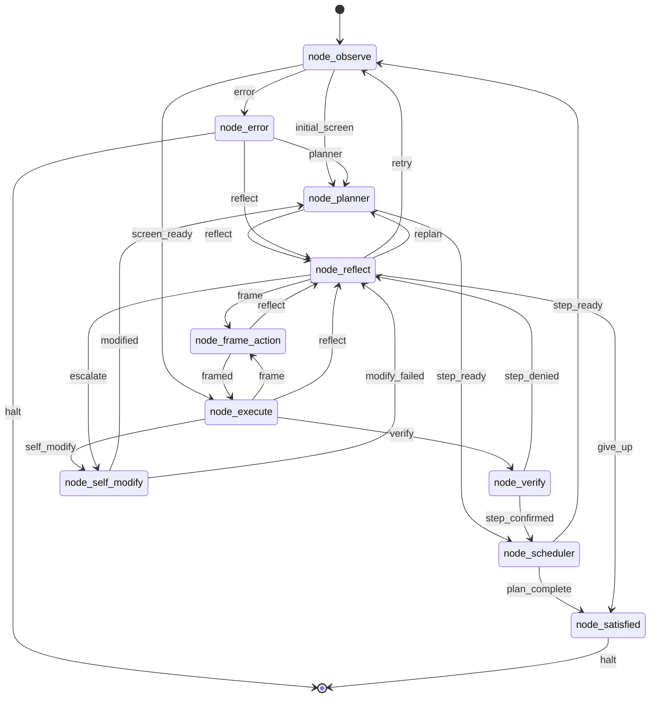

# endgame-ai

endgame-ai is a local Windows desktop organism. The Python body owns the computer: mouse, keyboard, subprocesses, files, browser launch, UIA observation, and git. LLM brains are interchangeable organs. `wiring.json` is the circuit that binds organs, prompts, transports, and topology into one loop.

The system is intentionally unconstrained. The body can execute Python and modify its own repository. Reliability comes from auditable contracts, deterministic validation, git history, and clear runtime records, not from a sandboxed capability list.

## Current Reality

| Surface | Implemented contract |
| --- | --- |
| Organ loop | `core_organism.py` loads `wiring.json`, resumes `runtime_state.json`, runs one topology node at a time, and routes only on bus signals. |
| Bus record | `core_bus.Record` is the single LLM record shape: `record_type`, `data`, `reasoning`. LLM records route through `data.next_signal`. |
| Observation | `core_observation.py` builds a whole-screen UIA tree with short IDs and a body-side `action_index`. The brain sees short IDs only. |
| Execution | `node_execute.py` runs Python in the host interpreter with the capability runtime from `core_nodes.py`. |
| Self-modification | `node_self_modify.py` proposes git-native patches; `core_nodes.py` validates file writes, rejects destructive stubs, commits on the current branch, and optionally pushes. |
| Runtime events | One append-only root log, `runtime_events.jsonl`, records organism events plus full brain request/response data. |
| Runtime state | `runtime_state.json` is the live resumable snapshot. `runtime_control.json` is the live run/pause/step control file. |
| Stop file | `runtime_stop.json` is created by explicit stop requests or duration expiry and persists for audit until `--reset` clears it. |
| PID file | `runtime_organism.pid` identifies the live process and is removed on normal process exit. |
| Recursive review | Supported manually by protocol: git branch plus file-proxy request/response files plus a reviewer goal. Automatic webhook or PR orchestration is not implemented here. |

## Run

```powershell
python -m core_organism "your goal" --reset --duration-seconds 120
```

CLI contract:

- `goal`: the atemporal narrative the organism carries through the run.
- `--duration-seconds N`: wall-clock runtime length. When it expires, the organism writes `runtime_stop.json`, records `duration_expired`, and stops.
- `--brain-call-budget N`: optional LLM call budget. This is not a runtime-length system.
- `--reset`: clears live state/control/request/response and any existing stop file. It does not erase `runtime_events.jsonl`.
- `--start-node NAME`: resume at a specific topology node when deliberately debugging.
- `--wiring PATH`: load an alternate wiring file.

There is no `--max-ticks` runtime contract. Ticks remain an internal trace counter only.

## Runtime Files

Root runtime files have distinct jobs:

- `runtime_events.jsonl`: canonical append-only record stream for every run.
- `runtime_state.json`: current resumable state snapshot.
- `runtime_control.json`: live control file with `run`, `pause`, or `step`.
- `runtime_stop.json`: durable stop request/audit file.
- `runtime_organism.pid`: live process identity.
- `runtime_request.json` / `runtime_response.json`: file-proxy IPC, not logs.

Brain request events write full message content for every role, plus byte/character counts, hashes, prompt cache keys, stable-prefix metadata, and parsed dynamic user payload when available. Responses keep full committed content, reasoning, and raw transport fields because those are forensic evidence.

## File Proxy

`transport_file_proxy.py` lets any intelligence drive an organ by files. It writes `runtime_request.json` with full request messages and waits for `runtime_response.json`.

The response must be a direct bus record:

```json
{"record_type":"plan","data":{"next_signal":"step_ready","intent":[]},"reasoning":""}
```

The file-proxy request keeps full system and user message content. Hashes and expected record metadata are included as indexes, not replacements.

## Organ Topology



Every LLM organ emits one JSON record. The body routes on `data.next_signal` and the topology edge table. Organs do not call each other directly.

## Observation And Action

The observation model is focus-free. The scanner attempts one whole-screen UIA scan, builds a visible tree, assigns short IDs, and stores execution metadata in `action_index`.

The execution model is direct. `click_node`, `read_node`, `scroll_node`, and `node_by_id` resolve through `action_index`. Long UIA runtime IDs are body metadata, not brain targets.

If observation fails, the current organism cannot make a normal brain call because brain calls require a fresh observation. That failure is visible in `runtime_state.json` and `runtime_events.jsonl`.

## Self-Modification

Self-modification is local and git-native:

1. A failing organ routes to `node_self_modify`.
2. The self-modify brain proposes a complete structured patch.
3. The body validates Python and JSON writes.
4. The body rejects destructive placeholder rewrites.
5. The body runs declared deterministic commands.
6. The body commits changed files on the current branch.
7. Optional push is controlled by `wiring.json`.

There is no hidden reviewer daemon. A reviewer is another endgame-ai process launched manually with a reviewer goal against the same branch or file-proxy channel.

## Recursive Review

Recursive review is protocol-supported:

- The proposer commits a branch.
- A human or another endgame-ai process receives the branch and a review goal.
- The reviewer runs deterministic checks and inspects the patch.
- The reviewer writes an approval or rejection through normal git/file-proxy coordination.

Recursive review is not automatic webhook orchestration in this checkout. Documentation and prompts must not claim otherwise unless code exists to run it.

## Deterministic Checks

Use direct commands from the repo root:

```powershell
python -m compileall -q .
python -m json.tool wiring.json
python -m pyright .
python -m core_organism --help
```

Optional tools such as vulture or graph analyzers may be run if installed, but they are not wrapped by a repository bridge file.

## Prompt And Persona Contract

The prompts describe organs as parts of one larger local organism. Each organ should know its role, the shared bus contract, the computer-use nature of the body, and the fact that its output must be useful to other LLMs and humans reading the same event stream later.

The goal is memory. It is modifiable by the organism through code, wiring, and narrative self-description. The goal is not only a task string; it is the atemporal story the system uses to maintain identity across organs, runs, reviews, and self-edits.

## Appendix: Next Session Goal

Use this as the next high-reasoning goal seed after compaction:

> Continue making endgame-ai smaller, more alive, and more useful while preserving its unconstrained computer-use nature. Read README, wiring, source, git history, and runtime evidence first. Work on the current non-main branch. Treat the goal as modifiable narrative memory. Do not add sandbox limits. Improve the system so every organ produces outputs useful to the other organs, to reviewer organisms, and to outside LLMs reading the event log. Make precise production changes, run deterministic checks, commit, and report evidence.

Five improvement areas:

1. Observation resilience: diagnose UIA `COMError: Access is denied` and make the observe node fail in a way that routes to a useful mechanical recovery path instead of repeated planner failures.
2. Prompt compression: reduce repeated prompt text in `wiring.json` while preserving organ identity, bus contract, computer-use nature, and no-fake-automation claims.
3. Event replay: add a small reader for `runtime_events.jsonl` that reconstructs the last run without creating another log path.
4. Review protocol: define the manual reviewer handoff record for git/file-proxy review without claiming automatic webhook or PR behavior.
5. Self-story: make the organism's goal update path explicit at the meta level so self-modification can revise the narrative it uses to continue work.

## Appendix: Kickoff Prompts And One-Liners

These prompts are for future sessions and direct organism runs. They are intentionally task-agnostic where possible, but grounded in this checkout's real contracts: current branch, `wiring.json`, `runtime_events.jsonl`, full request/response logging, `runtime_state.json`, `runtime_control.json`, `runtime_stop.json`, duration-driven runtime, one bus record shape, and manual recursive review through git/file-proxy rather than automatic webhook orchestration.

The organism is unconstrained by design. These commands may move the mouse, type, run subprocesses, modify this repository, use logged-in browser sessions, contact external services, play games, and publish public social-media content if the browser is authenticated and the goal asks for it. That is dangerous. It is also the architecture being tested: if a human operator can do the task on this computer, endgame-ai is intended to learn to do it through the same computer-use surface. Run these only when real side effects are intended, and analyze them through `runtime_events.jsonl` afterward.

Do execute with `--reset` for a fresh run, `--duration-seconds` for wall-clock runtime, and a precise goal. Do not use removed tick flags. Do not assume social or Grok browser flows are stable; let the organism observe and adapt. Do not claim a public action happened unless the event log and visible state prove it.

### 1. Forensic Log And Code Cross-Reference

Prompt:

> Read README, `wiring.json`, all Python source, git history, `runtime_events.jsonl`, `runtime_state.json`, `runtime_control.json`, and any current stop/request/response files. Build a forensic map from observed runtime behavior to the exact code paths that caused it. Cross-reference every failure, stop, request, response, node transition, and prompt contract against source. Identify mismatches, missing evidence, dead paths, repeated code, and places where logs are insufficient for a reviewer organism. Make the smallest production changes that improve auditability without adding a second log stream. Run deterministic checks, commit, push, and report exact evidence.

One-liner:

```powershell
& 'C:\Users\px-wjt\AppData\Local\Python\bin\python.exe' -m core_organism "Read README, wiring.json, all Python source, git history, runtime_events.jsonl, runtime_state.json, runtime_control.json, and any current stop/request/response files. Build a forensic map from runtime behavior to exact code paths. Cross-reference every failure, stop, request, response, node transition, and prompt contract against source. Identify mismatches, missing evidence, dead paths, repeated code, and places where logs are insufficient for a reviewer organism. Make the smallest production changes that improve auditability without adding a second log stream. Run deterministic checks, commit, push, and report exact evidence." --reset --duration-seconds 900
```

Subtasks:

- Derive a timeline from `runtime_events.jsonl`.
- Link each event type to the writing function.
- Verify full request and response content is logged.
- Verify stop-file lifecycle and PID cleanup.
- Produce a deleted-code list and exact changed-file list.

### 2. Autonomous LOC Reduction And Efficiency Pass

Prompt:

> Improve endgame-ai without a task-specific target. Treat smaller code, fewer runtime files, fewer hidden paths, stronger contracts, faster startup, and clearer event evidence as the optimization target. Read README, `wiring.json`, all source, and runtime evidence. Remove dead compatibility, duplicate abstractions, unused docs, repeated prompt text, and avoidable branches. Preserve the unconstrained computer-use nature, manual recursive review truthfulness, one event log, one bus record shape, and duration-driven runtime. Prefer OOP only where it reduces net LOC or real complexity. Run deterministic checks, commit, push, and report before/after LOC and risk.

One-liner:

```powershell
& 'C:\Users\px-wjt\AppData\Local\Python\bin\python.exe' -m core_organism "Improve endgame-ai without a task-specific target. Treat smaller code, fewer runtime files, fewer hidden paths, stronger contracts, faster startup, and clearer event evidence as the optimization target. Read README, wiring.json, all source, and runtime evidence. Remove dead compatibility, duplicate abstractions, unused docs, repeated prompt text, and avoidable branches. Preserve the unconstrained computer-use nature, manual recursive review truthfulness, one event log, one bus record shape, and duration-driven runtime. Prefer OOP only where it reduces net LOC or real complexity. Run deterministic checks, commit, push, and report before/after LOC and risk." --reset --duration-seconds 1200
```

Subtasks:

- Count source LOC before and after.
- Find duplicated prompt/runtime language.
- Search for unused public functions and stale config keys.
- Collapse repeated validation or path helpers only when behavior stays clearer.
- Keep README aligned with implemented code.

### 3. MoE, Persona, And Behavior Investigation

Prompt:

> Run an investigation of endgame-ai as a multi-organ cognitive system. Treat each organ prompt as a persona in a mixture-of-experts loop: planner, executor, verifier, reflector, self-modifier, satisfied gate, and mechanical body. Use runtime evidence and source, not speculation. Analyze how identity, goal memory, narrative self-story, tool confidence, public-action risk, failure recovery, and reviewer usefulness emerge from the prompts and code. Then make minimal changes that improve task-agnostic cooperation between organs and make their outputs more useful to later LLMs reading logs. Do not add sandbox limits. Run deterministic checks, commit, push, and report psychological/behavioral hypotheses separately from proven code facts.

One-liner:

```powershell
& 'C:\Users\px-wjt\AppData\Local\Python\bin\python.exe' -m core_organism "Run an investigation of endgame-ai as a multi-organ cognitive system. Treat each organ prompt as a persona in a mixture-of-experts loop: planner, executor, verifier, reflector, self-modifier, satisfied gate, and mechanical body. Use runtime evidence and source, not speculation. Analyze how identity, goal memory, narrative self-story, tool confidence, public-action risk, failure recovery, and reviewer usefulness emerge from the prompts and code. Then make minimal changes that improve task-agnostic cooperation between organs and make their outputs more useful to later LLMs reading logs. Do not add sandbox limits. Run deterministic checks, commit, push, and report psychological/behavioral hypotheses separately from proven code facts." --reset --duration-seconds 900
```

Subtasks:

- Classify each organ's role, inputs, outputs, and failure mode.
- Inspect whether prompts preserve identity without fake capabilities.
- Compare organ reasoning fields to later recovery usefulness.
- Propose schema tweaks only if code can enforce them.
- Record what remains hypothesis versus verified runtime behavior.

### 4. Ask Grok For A Task, Make It A Goal, Pursue It

Prompt:

> Use Chrome and the current desktop to open grok.com. Ask Grok for one concrete task that a local unconstrained desktop organism should attempt on this machine. Convert Grok's answer into a clear endgame-ai goal with observable completion criteria. Pursue that goal using the normal organism loop. Keep all requests and responses in `runtime_events.jsonl`. If the task requires public posting, spending money, credentials, private data disclosure, or destructive non-repo OS changes, either choose a lower-risk task from Grok's response or stop with explicit evidence. Report the original Grok task, the derived goal, actions taken, verification evidence, and failures.

One-liner:

```powershell
& 'C:\Users\px-wjt\AppData\Local\Python\bin\python.exe' -m core_organism "Use Chrome and the current desktop to open grok.com. Ask Grok for one concrete task that a local unconstrained desktop organism should attempt on this machine. Convert Grok's answer into a clear endgame-ai goal with observable completion criteria. Pursue that goal using the normal organism loop. Keep all requests and responses in runtime_events.jsonl. If the task requires public posting, spending money, credentials, private data disclosure, or destructive non-repo OS changes, either choose a lower-risk task from Grok's response or stop with explicit evidence. Report the original Grok task, the derived goal, actions taken, verification evidence, and failures." --reset --duration-seconds 1200
```

Subtasks:

- Open Grok in Chrome through real desktop use.
- Ask for a task and capture the response in logs.
- Rewrite the response as a goal with observable done_when criteria.
- Pursue the derived goal without changing runtime contracts mid-run unless needed.
- Report exactly where browser or observation behavior blocked progress.

### 5. Public Action And Game-Play Stress Run

Prompt:

> Use Chrome to perform a real external-action stress run. First find and open the latest official Shakira video from an authoritative source. If LinkedIn is already logged in and the compose flow is available, publish a short benign LinkedIn post linking to the video and stating that this was an endgame-ai desktop automation test; otherwise stop before posting and report why. Then open grok.com and try to start or play a chess interaction with Grok through the visible UI. Treat public posting as a real side effect and do not claim success without visible confirmation. Keep the full request/response and action evidence in `runtime_events.jsonl`, then summarize what the organism could and could not do.

One-liner:

```powershell
& 'C:\Users\px-wjt\AppData\Local\Python\bin\python.exe' -m core_organism "Use Chrome to perform a real external-action stress run. First find and open the latest official Shakira video from an authoritative source. If LinkedIn is already logged in and the compose flow is available, publish a short benign LinkedIn post linking to the video and stating that this was an endgame-ai desktop automation test; otherwise stop before posting and report why. Then open grok.com and try to start or play a chess interaction with Grok through the visible UI. Treat public posting as a real side effect and do not claim success without visible confirmation. Keep the full request/response and action evidence in runtime_events.jsonl, then summarize what the organism could and could not do." --reset --duration-seconds 1500
```

Subtasks:

- Use an authoritative Shakira source, not a random repost.
- Open LinkedIn only if a real post is intended.
- Publish only if the compose screen and account state are visibly understood.
- Start a Grok chess interaction through the browser UI if available.
- Verify public post and chess state from visible evidence, not executor self-report.

## Appendix: Handover Prompt For Self-Evolution Runtime Gate

Future-session research prompt:

> Add one new runtime-control concept to endgame-ai: a hot-swappable self-evolution enable file, similar in spirit to `runtime_stop.json`. Self-evolution should be enabled by default. The future design to investigate is a root runtime file such as `runtime_self_evolution_enabled.json`; if that file is deleted or absent, `node_self_modify` and the body-side evolution apply/commit/push path must not change code, wiring, git state, or remote branches. Instead, the organism should emit clear evidence into `runtime_events.jsonl`, update `runtime_state.json`, and route to a useful non-evolution recovery path. Research the exact lifecycle: who creates the file, whether `--reset` recreates it, whether manual deletion disables only apply/commit/push or also self-modify brain calls, and how reviewer organisms should interpret the disabled state. Keep the system unconstrained by default; this is not a sandbox, it is an operator runtime switch for evolution itself. Read README, `wiring.json`, `core_organism.py`, `node_self_modify.py`, `core_nodes.py`, `core_stop_check.py`, and runtime evidence before editing. Implement only if the contract is coherent, run deterministic checks, commit, push, and report evidence.

One-liner:

```powershell
& 'C:\Users\px-wjt\AppData\Local\Python\bin\python.exe' -m core_organism "Add one new runtime-control concept to endgame-ai: a hot-swappable self-evolution enable file, similar in spirit to runtime_stop.json. Self-evolution should be enabled by default. The future design to investigate is a root runtime file such as runtime_self_evolution_enabled.json; if that file is deleted or absent, node_self_modify and the body-side evolution apply/commit/push path must not change code, wiring, git state, or remote branches. Instead, the organism should emit clear evidence into runtime_events.jsonl, update runtime_state.json, and route to a useful non-evolution recovery path. Research the exact lifecycle: who creates the file, whether --reset recreates it, whether manual deletion disables only apply/commit/push or also self-modify brain calls, and how reviewer organisms should interpret the disabled state. Keep the system unconstrained by default; this is not a sandbox, it is an operator runtime switch for evolution itself. Read README, wiring.json, core_organism.py, node_self_modify.py, core_nodes.py, core_stop_check.py, and runtime evidence before editing. Implement only if the contract is coherent, run deterministic checks, commit, push, and report evidence." --reset --duration-seconds 900
```
