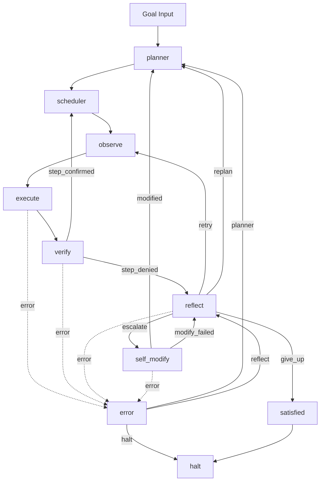
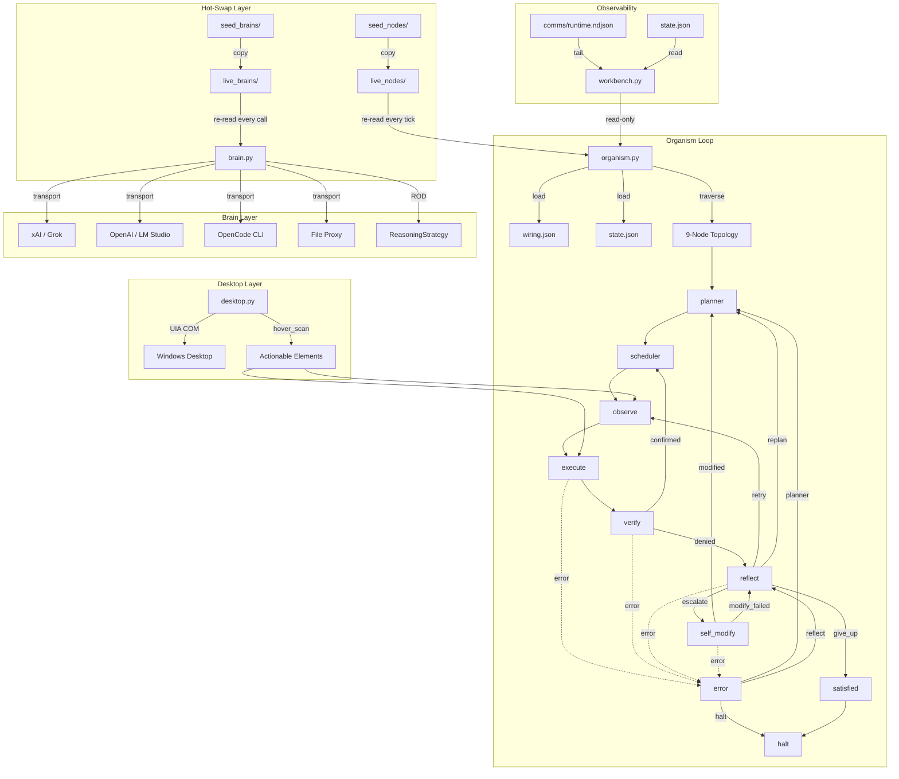

# endgame-ai

**A living Windows desktop organism — not a traditional agentic CCA.**

Python is its mechanical body. `wiring.json` is its mutable genome. Nodes and brain transports are hot-swappable modules copied from `seed_*/` → `live_*/` at runtime. The ROD loop (Reason→Observe→Decide with pluggable reasoning feedback) in `brain.think()` is the core innovation enabling small models to self-evolve.

**No fallbacks. Fail-hard always. Self-modification = rewriting `wiring.json` AND writing node files to `live_nodes/` AND executing Python via `exec()`.**

---

## Current Status (2026-07-02, commit unified-archBRAINZ)

**Branch:** `unified-archBRAINZ` (clean, pushed)
**Phase:** 5C complete — Full topology operational with LLM-driven verify/reflect/self_modify

### What Works Today

| Component | Status | Details |
|-----------|--------|---------|
| **Transport System** | ✅ Verified | xAI (Grok API, native reasoning), OpenAI-compatible (LM Studio, two-pass), OpenCode CLI, file_proxy (human-in-loop) |
| **ROD Reasoning** | ✅ Verified | `TwoPassStrategy`, `SinglePassStrategy`, `NativeReasoningStrategy`, `CustomStrategy` — configurable per transport |
| **Hot-swappable Nodes** | ✅ Working | `seed_nodes/` → `live_nodes/` copied at startup, re-read every execution |
| **BaseNode ABC** | ✅ Done | Brain-calling nodes reduced to ~10-85 lines each |
| **Error Topology** | ✅ Done | `error` node + edges from all nodes, `halt` signal for clean exit |
| **Desktop Observation** | ✅ Working | UIA COM via `comtypes.gen.UIAutomationClient` — returns screen, elements (filtered dict), screen_text, windows, snapshot, focused_title |
| **Hover Scanning** | ✅ Primary | `hover_scan()`, `dense_probe()`, `scroll_enrich()` in `Desktop` class — PRIMARY observation method |
| **Execute Node** | ✅ Working | Grok writes Python, `exec()` runs it with full desktop namespace (click, type_text, hotkey, scroll, focus_window, open_url, subprocess, ctypes, self-modify helpers) |
| **Scheduler Node** | ✅ Working | Step index management, plan completion detection |
| **Verify Node** | ✅ Working | LLM evidence-based judgment using screen_text, windows, focused_title, last_action, last_result, last_error |
| **Reflect Node** | ✅ Working | LLM diagnosis + routing (retry/replan/escalate/give_up) with concrete lesson |
| **Self-Modify Node** | ✅ Working | Captures full codebase, outputs wiring_patch with wiring_patches, node_writes, node_deletes |
| **Topology** | ✅ Complete | planner → scheduler → observe → execute → verify → reflect → self_modify → satisfied / error |
| **Workbench** | ✅ Working | Read-only dashboard at http://127.0.0.1:8800/ with topology graph, runtime log tail, wiring viewer, transport probe, brain test |

---

## Architecture Overview

### Core Files

| File | Role | Lines |
|------|------|-------|
| `brain.py` | Transport protocol, BaseTransport, ReasoningStrategy, `call()`/`think()`, config resolution | 508 |
| `nodes.py` | BaseNode ABC, `call_node()`, node loading, `build_execute_namespace()`, desktop helpers, wiring patch | ~315 |
| `organism.py` | Main loop, topology traversal, error routing, `--max-ticks` kill switch | 230 |
| `wiring.json` | Genome: transport, topology, prompts, reasoning config, observe config | ~180 |
| `desktop.py` | UIA COM, Element/Observation, **hover_scan/dense_probe/scroll_enrich**, action methods | ~1023 |
| `seed_brains/*.py` | Transport implementations (xai, openai, opencode, file_proxy, browser_ai) | 5 files |
| `seed_nodes/*.py` | Node implementations (planner, observe, execute, scheduler, verify, reflect, self_modify, satisfied, error) | 9 files |
| `workbench.py` + JS | Read-only dashboard server + modular ES6 frontend | ~12 files |

### Data Flow



**State** (`state.json`): `{goal, plan[], step, current_step, screen, elements, screen_text, windows, snapshot, last_action, last_code, last_result, last_error, last_verification, last_reflection, history[], memory{}, wiring_transport, tick, _phase}`

**Runtime log** (`comms/runtime.ndjson`): Every node start/complete, brain call, error, wiring change — full audit trail.

---

## Transport System (Fail-Hard, No Fallbacks)

`wiring.json` → `model.transport` selects ONE transport. No fallback chain.

```json
"model": {
  "transport": "xai",
  "transport_config": {
    "xai": {"mode": "api", "api_key_env": "XAI_API_KEY", "model": "grok-build-0.1", "reasoning": {"enabled": true, "pattern": "native"}},
    "openai": {"base_url": "http://localhost:1234", "model": "nvidia-nemotron-3-nano-4b", "reasoning": {"enabled": true, "pattern": "two_pass"}},
    "opencode": {"executable": "opencode", "model": "opencode/nemotron-3-ultra-free"},
    "file_proxy": {"request_path": "comms/request.json", "response_path": "comms/response.json"},
    "browser_ai": {"documented_stub": true},
    "grok_cli": {"executable": "grok", "reasoning": {"enabled": true, "pattern": "native"}}
  },
  "global": {"timeout": 180, "raw_log": true, "reasoning_enabled": true}
}
```

**Reasoning patterns** (configurable per transport in wiring):

- `native` — Model returns reasoning field (Grok, OpenAI o1)
- `two_pass` — Call 1: reasoning, Call 2: inject reasoning → JSON (Nemotron 4B)
- `single_pass` — One call, extract JSON directly
- `custom` — Configurable injection template + extractor

---

## Node System (Hot-Swappable)

`seed_nodes/` → copied to `live_nodes/` on startup. **Re-read every execution.**

```python
# BaseNode contract (nodes.py)
class BaseNode(ABC):
    prompt_key: str = ""           # wiring["prompts"][prompt_key]
    expected_record_type: str = "" # validated against brain output
    
    @abstractmethod
    def signal_from_data(self, data: dict) -> str: ...
    @abstractmethod
    def patch_from_record(self, record: dict) -> dict: ...
    
    def run(self, ctx: dict) -> tuple[str, dict]: ...
```

**Execution**: `nodes.call_node(node_name, ctx)` → loads `live_nodes/{node_name}.py` → calls `run(ctx)` → returns `(signal, patch)`.

**Context passed to every node**:
```python
ctx = {
    "wiring": wiring,           # full wiring.json
    "state": dict(state),       # organism state snapshot
    "goal": goal_str,
    "node": current_node_name,
    # Desktop I/O helpers (from nodes.py):
    "observe_screen": ...,
    "execute_verb": ...,
    "last_observation_snapshot": ...,
    "get_focused_title": ...,
    "apply_wiring_patch": ...,
    "save_wiring": ...,
    "wiring_limit": ...,
}
```

---

## The Execute Node: Core Unification (✅ DONE)

**Replaces**: `decide.py` + `act.py` + `actions.py` (10 verbs) + `ActionExecutor` (300 lines)

### Execute Node Contract

```python
# seed_nodes/execute.py
def run(ctx):
    # Build prompt with step_goal, screen, elements, last_error, last_result
    # Call brain.think() with execute prompt
    # Execute returned code via exec() with build_execute_namespace(ctx)
    # Return signal ("verify" | "reflect" | "self_modify") + patch
```

### Namespace Builder (`nodes.py:build_execute_namespace`)

```python
def build_execute_namespace(ctx):
    desktop = _get_desktop_instance()
    return {
        # Observation
        "observe_screen": observe_screen,
        "last_observation_snapshot": last_observation_snapshot,
        "get_focused_title": get_focused_title,
        
        # Convenience verbs
        "execute_verb": execute_verb,  # click, write, press, hotkey, focus, scroll, wait, launch, open_url, remember
        
        # Raw desktop actions
        "click": desktop.click,
        "type_text": desktop.type_text,
        "press_key": desktop.press_key,
        "hotkey": desktop.hotkey,
        "scroll": desktop.scroll,
        "focus_window": desktop.focus_window,
        "open_url": desktop.open_url,
        
        # System
        "subprocess": subprocess,
        "ctypes": ctypes,
        "os": os, "sys": sys, "json": json, "re": re, "time": time,
        "pathlib": pathlib, "math": math, "random": random,
        
        # Self-modification
        "apply_wiring_patch": apply_wiring_patch,
        "save_wiring": save_wiring,
        "wiring_limit": wiring_limit,
        
        # Context
        "state": ctx["state"],
        "wiring": ctx["wiring"],
        "goal": ctx["goal"],
        
        # Desktop module
        "desktop": desktop,
    }
```

### What This Enables

| Task | Before (10 verbs) | After (execute node) |
|------|-------------------|---------------------|
| Open Notepad | `launch` verb | `subprocess.Popen(["notepad.exe"])` |
| Click button | `click` verb + element resolution | `click(el["px"], el["py"], el["hwnd"])` |
| Type in field | `write` verb + element resolution | `click(...)`, `type_text("hello")` |
| Complex multi-step | Multiple verb calls | Single Python script with loops, conditionals |
| Install pyautogui | Impossible | `subprocess.run([sys.executable, "-m", "pip", "install", "pyautogui"])` |
| Read clipboard | Impossible | `ctypes` + `OpenClipboard` + `GetClipboardData` |
| Any Windows API | Impossible | `ctypes.windll.user32.*`, `ctypes.windll.kernel32.*` |
| Self-modify wiring | Stub only | `apply_wiring_patch()`, `save_wiring()` in executed code |
| Write new node file | Impossible | `pathlib.Path("live_nodes/new_skill.py").write_text(code)` |

**The organism becomes an unconstrained Windows operator.** Grok writes the code. Python executes it. No verb list limits capability.

---

## Full Topology (9 Nodes)

| Node | File | Role | Brain? | Output Signals |
|------|------|------|--------|----------------|
| **planner** | `seed_nodes/planner.py` | Goal → ordered plan (steps with `description`, `done_when`) | ✅ | `step_ready` \| `reflect` |
| **scheduler** | `seed_nodes/scheduler.py` | Pick next step by index; detect plan complete | ❌ | `step_ready` \| `plan_complete` |
| **observe** | `seed_nodes/observe.py` | Call `Desktop.observe()` → return `screen`, `elements`, `screen_text`, `windows`, `snapshot` | ❌ | `screen_ready` |
| **execute** | `seed_nodes/execute.py` | Grok writes Python, `exec()` runs it | ✅ | `verify` \| `reflect` \| `self_modify` |
| **verify** | `seed_nodes/verify.py` | Judge step intent satisfied (evidence-based) | ✅ | `step_confirmed` \| `step_denied` |
| **reflect** | `seed_nodes/reflect.py` | Diagnose failure, choose recovery path | ✅ | `retry` \| `replan` \| `escalate` \| `give_up` |
| **self_modify** | `seed_nodes/self_modify.py` | Patch wiring.json AND/OR write `live_nodes/*.py` files | ✅ | `modified` \| `modify_failed` |
| **satisfied** | `seed_nodes/satisfied.py` | Goal complete / rest state | ❌ | `halt` |
| **error** | `seed_nodes/error.py` | Mechanical error handler (no brain) | ❌ | `planner` \| `reflect` \| `halt` |

### Topology Edges (wiring.json)

```json
"topology": {
  "cycle_start": "planner",
  "nodes": ["planner","scheduler","observe","execute","verify","reflect","self_modify","satisfied","error"],
  "edges": {
    "planner": {"step_ready": "scheduler", "reflect": "reflect", "error": "error"},
    "scheduler": {"step_ready": "observe", "plan_complete": "satisfied", "error": "error"},
    "observe": {"screen_ready": "execute", "error": "error"},
    "execute": {"verify": "verify", "reflect": "reflect", "self_modify": "self_modify", "error": "error"},
    "verify": {"step_confirmed": "scheduler", "step_denied": "reflect", "error": "error"},
    "reflect": {"retry": "observe", "replan": "planner", "escalate": "self_modify", "give_up": "satisfied", "error": "error"},
    "self_modify": {"modified": "planner", "modify_failed": "reflect", "error": "error"},
    "satisfied": {"halt": "halt"},
    "error": {"planner": "planner", "reflect": "reflect", "halt": "halt"}
  }
}
```

### Signal Semantics

- `step_ready` — Next plan step available, go observe
- `plan_complete` — All steps done, goal achieved
- `screen_ready` — Observation captured, ready for execute
- `verify` — Execute succeeded (no exception), go verify
- `reflect` — Execute failed OR verify denied, diagnose
- `self_modify` — Escalation: rewire or write new nodes
- `step_confirmed` — Verifier: intent satisfied, next step
- `step_denied` — Verifier: intent NOT satisfied, diagnose
- `retry` — Same step, try again with diagnosis
- `replan` — Whole plan wrong, new plan needed
- `escalate` — Cannot recover, modify self (wiring/nodes)
- `give_up` — Unrecoverable, rest
- `modified` — Self-modify succeeded, new wiring active
- `modify_failed` — Self-modify failed, diagnose
- `halt` — Clean exit, organism stops

---

## Desktop Observation (Complete Implementation)

`desktop.py` uses `comtypes.gen.UIAutomationClient` (~1023 lines). It provides:

### Core Classes

```python
@dataclass
class Element:
    name: str
    control_type: str
    control_type_id: int
    automation_id: str
    class_name: str
    process_id: int
    rect: Rect
    is_enabled: bool
    is_offscreen: bool
    has_focus: bool
    framework_id: str
    runtime_id: list[int]
    window_handle: int
    children: list["Element"]

@dataclass
class Observation:
    timestamp: float
    screen_width: int
    screen_height: int
    focused_element: Element | None
    root_elements: list[Element]
    active_window: Element | None
    focused_title: str
```

### Observation Pipeline (Hover Scan Primary)

1. **Screen size** via `GetSystemMetrics`
2. **Root element** via `GetRootElement()`
3. **Focused element** via `FindFirst(TreeScope_Descendants, true_condition)` + `HasKeyboardFocus`
4. **Active window** via `GetForegroundWindow()` + `ElementFromHandle()`
5. **Top-level windows** via `ControlViewWalker` (for window tokens W1..Wn)
6. **PRIMARY: Hover scan** — Grid probe across screen/window via `ElementFromPoint`
   - Config: `step_px`, `delay_ms`, `target_window_only`, `min_size_px`, `max_elements`, `full_screen_step_px`
   - Scans FULL SCREEN when desktop/taskbar active (60px step), targets window otherwise (20px step)
   - Returns deduplicated elements by runtime_id
7. **SECONDARY: Tree walk** — Limited depth for hierarchy (window tokens)
8. **Merge** — Hover positions + tree hierarchy
9. **Filter** → actionable elements only (non-zero rect, interactive control types, enabled)
10. **Classify** → role→action (click/write/scroll)
11. **Format SCREEN text** — Human-readable for LLM context

### Configuration (wiring.json → `configure_observation()`)

```json
"observe_config": {
  "max_depth": 3,
  "include_offscreen": false,
  "max_elements": 500,
  "hover_scan": {
    "step_px": 20,
    "delay_ms": 0,
    "target_window_only": true,
    "min_size_px": 10,
    "max_elements": 100,
    "full_screen_step_px": 60
  }
}
```

### Interactive Control Types (Actionable)

| Control Type ID | Name | Action |
|----------------|------|--------|
| 50000 | Button | click |
| 50004 | Edit | write |
| 50002 | ComboBox | write |
| 50009 | ListItem | scroll |
| 50011 | TreeItem | scroll |
| 50018 | TabItem | click |
| 50013 | MenuItem | click |
| 50001 | CheckBox | click |
| 50017 | RadioButton | click |
| 50014 | Slider | scroll |
| 50021 | Spinner | write |
| 50016 | Hyperlink | click |

### Observe Node Output (Filtered, Actionable)

```python
# seed_nodes/observe.py
def run(ctx):
    obs = desktop.observe(config)
    return "screen_ready", {
        "screen": obs.get("screen"),
        "elements": obs.get("elements"),      # dict keyed by stable_id with px, py, hwnd, role, action
        "screen_text": obs.get("screen_text"), # formatted for LLM
        "windows": obs.get("windows"),         # [{"token": "W0", ...}, {"token": "W1", ...}]
        "snapshot": obs.get("snapshot"),
        "focused_title": obs.get("focused_title"),
    }
```

**Result**: Elements dict keyed by stable_id (e.g., `e_123_456_100_200`) with accurate px/py from hover scan, not zero-rect UIA tree.

---

## Self-Modification: Wiring + Node Files (✅ WORKING)

`self_modify` node can change BOTH `wiring.json` AND `live_nodes/*.py` files atomically.

### Self-Modify Output Record

```json
{
  "record_type": "wiring_patch",
  "data": {
    "wiring_patches": [
      {"op": "set", "path": "model.transport_config.xai.temperature", "value": 0.8},
      {"op": "set", "path": "topology.nodes", "value": ["planner","scheduler","observe","execute","verify","reflect","self_modify","satisfied","error","new_node"]}
    ],
    "node_writes": [
      {"path": "live_nodes/new_skill.py", "content": "from __future__ import annotations\n\ndef run(ctx):\n    return \"verify\", {\"skill_result\": \"done\"}"},
      {"path": "live_nodes/execute.py", "content": "..."}
    ],
    "node_deletes": ["live_nodes/obsolete_skill.py"]
  }
}
```

### Application (in `nodes.py:apply_wiring_patch`)

```python
def apply_wiring_patch(wiring: dict, parsed: dict) -> tuple[str, Any]:
    data = (parsed or {}).get("data") or {}
    
    # 1. Apply wiring patches
    for patch in data.get("wiring_patches", []):
        op = patch.get("op", "set")
        path = patch.get("path", "")
        value = patch.get("value")
        parts = path.split(".")
        cur = wiring
        for part in parts[:-1]:
            if not isinstance(cur.get(part), dict):
                cur[part] = {}
            cur = cur[part]
        if op == "set":
            cur[parts[-1]] = value
        elif op == "delete":
            cur.pop(parts[-1], None)
    
    # 2. Write node files
    for write in data.get("node_writes", []):
        path = pathlib.Path(write["path"])
        path.parent.mkdir(parents=True, exist_ok=True)
        path.write_text(write["content"], encoding="utf-8")
    
    # 3. Delete node files
    for delete_path in data.get("node_deletes", []):
        pathlib.Path(delete_path).unlink(missing_ok=True)
    
    # 4. Atomic write wiring.json
    save_wiring(wiring)
    return "set", {...}
```

---

## Verify / Reflect / Self-Modify: LLM-Driven

All three nodes use LLM calls with rich context — flexible but costs brain calls.

### Verify Node (Evidence-Based)

**Input**: step goal, done_when, screen_text, windows, focused_title, last_action, last_result, last_error

**Prompt**: "Judge if step intent was satisfied based on evidence. Return next_signal (step_confirmed/step_denied), success (bool), reasoning (evidence-based justification)."

**Output**: Routes to `scheduler` (confirmed) or `reflect` (denied)

### Reflect Node (Diagnosis + Recovery)

**Input**: last_error, last_result, screen_text, step goal, last_verification

**Prompt**: "Diagnose failure and choose recovery. Return next_signal (retry/replan/escalate/give_up), lesson (concrete diagnosis + specific suggestion), diagnosis (root cause)."

**Output**: Routes to `observe` (retry), `planner` (replan), `self_modify` (escalate), or `satisfied` (give_up)

### Self-Modify Node (Codebase Capture + Patch)

**Input**: current wiring, live_nodes list, goal, failure context (last_error, last_reflection)

**Prompt**: "You receive the FULL codebase (brain.py, nodes.py, organism.py, desktop.py, wiring.json, all seed_nodes/*, seed_brains/*, workbench JS). Output wiring_patch record with wiring_patches, node_writes, node_deletes."

**Codebase Capture**: Reads all essential files into context (truncated to ~30k chars)

**Output**: Applied via `apply_wiring_patch()` — wiring.json atomic write + node files written to live_nodes/

---

## Workbench (Read-Only Dashboard)

**Reflects organism reality. No control over organism.**

Run: `python workbench.py` → http://127.0.0.1:8800/

### UI Features

- **Status Panel**: Current node, tick, phase, goal, transport, last error
- **Topology Graph**: SVG visualization with current node highlighted, signal edges
- **Runtime Log Tail**: Live NDJSON stream from `comms/runtime.ndjson`
- **Wiring Viewer**: Read-only JSON with syntax highlighting
- **Transport Probe**: Health check for current transport
- **Brain Test**: ROD falsification test (2 calls) for any transport

### API Endpoints (Read-Only)

| Endpoint | Description |
|----------|-------------|
| `GET /api/status` | Full organism state + runtime tail + wiring summary |
| `GET /api/wiring` | Full wiring.json |
| `GET /api/state/raw` | Raw state.json |
| `GET /api/logs/tail?lines=100` | Runtime NDJSON tail |
| `GET /api/transport/probe` | Current transport health check |
| `POST /api/brain/test` | ROD test: `{"transport": "xai"}` |

**No control endpoints.** Organism controlled only by `--max-ticks` (hard stop).

---

## Kill Switch: `--max-ticks` Only

**Single hard stop mechanism. No pause/step. No `--max-brain-calls` (redundant).**

```bash
# Run with hard tick limit
python organism.py --reset --max-ticks 10 "open notepad and write hello"
```

```python
# Organism loop (organism.py):
while True:
    stop_check.check_stop("organism main loop")
    if max_ticks is not None and state["tick"] >= max_ticks:
        state["_phase"] = "max_ticks"
        write_state(wiring, state)
        return state
    # ... execute node ...
```

---

## Quick Start

### Validation (Run First)

```powershell
# Syntax check all core files
python -m py_compile brain.py nodes.py organism.py workbench.py desktop.py

# Syntax check all seed nodes and brains
python -c "
import py_compile, pathlib
for d in ['seed_nodes','seed_brains']:
    for p in pathlib.Path(d).glob('*.py'):
        py_compile.compile(str(p), doraise=True)
print('All syntax OK')
"
```

### Run with Grok (xAI API)

```powershell
# 1. Set API key (one time)
$env:XAI_API_KEY = "your-key-here"

# 2. Ensure wiring.json has transport=xai (default)
# 3. Run
python organism.py --reset --max-ticks 5 "open notepad and write 'hello from grok'"
```

### Run with LM Studio (OpenAI-compatible)

```powershell
# 1. Start LM Studio local server at http://localhost:1234
# 2. Load model (e.g., nvidia-nemotron-3-nano-4b)
# 3. Change wiring.json: "transport": "openai"
python organism.py --reset --max-ticks 5 "open notepad"
```

### Run with File Proxy (Human-in-Loop, No Model)

```powershell
# 1. Change wiring.json: "transport": "file_proxy"
python organism.py --reset --max-ticks 5 "open notepad"

# 2. Watch comms/request.json appear
# 3. Write response to comms/response.json
# 4. Organism continues
```

### Workbench (Optional)

```powershell
python workbench.py
# http://127.0.0.1:8800/ — status dashboard
```

---

## Next Immediate Tasks (Phase 5D)

| Priority | Task | File | Description |
|----------|------|------|-------------|
| 1 | **Remove control.json logic** | `organism.py` | Remove `wait_before_node()`, `--max-brain-calls` arg, control file I/O |
| 2 | **Remove control endpoints** | `workbench.py` | Remove `/api/control` POST, keep read-only status/wiring viewer |
| 3 | **Full integration test** | — | `python organism.py --reset --max-ticks 20 "open Opera, go to linkedin.com, write post about Grok desktop, post to X"` |
| 4 | **Tune hover_scan** | `desktop.py` | Verify element detection in browser windows (Opera/Chrome) |

---

## Handover Prompt for Next Session

> **Context**: endgame-ai Phase 5C complete. Full topology operational: planner→scheduler→observe→execute→verify→reflect→self_modify. All transports verified (xAI native, OpenAI two-pass, OpenCode, file_proxy). Workbench running read-only.
>
> **What Works**: 
> - Hover scan PRIMARY observation (ElementFromPoint grid probe) with full-screen fallback for desktop
> - Filtered elements dict keyed by stable_id with accurate px/py, role→action classification
> - Window tokens W0 (screen) + W1..Wn (visible top-level windows) fresh each observation
> - SCREEN text formatting for LLM context
> - Verify: LLM evidence-based judgment → step_confirmed/step_denied
> - Reflect: LLM diagnosis + routing (retry/replan/escalate/give_up)
> - Self-Modify: Full codebase capture → wiring_patch with wiring_patches/node_writes/node_deletes
> - Execute: Grok writes Python, exec() runs with full desktop namespace + self-modify helpers
> - Hotkey fixed: accepts both "win+r" and ["win", "r"] formats
> - Focus_window: proper EnumWindowsProc callback, supports W1..Wn tokens
> - Open_url: multi-path browser detection
>
> **Current State**: "open notepad" and "open Opera, go to linkedin.com..." both run through full topology. Runtime logs show planner→scheduler→observe→execute→verify→reflect→planner cycles.
>
> **Next Goal**: Phase 5D cleanup — remove control.json pause/step logic, remove --max-brain-calls, remove workbench control endpoints. Then full integration test with complex goal.
>
> **Key Files to Modify**:
> - `organism.py` — remove wait_before_node, --max-brain-calls, control.json I/O
> - `workbench.py` — remove /api/control POST endpoint
> - `wiring.json` — verify observe_config hover_scan params optimal
>
> **Run Commands**:
> ```powershell
> python -m py_compile brain.py nodes.py organism.py workbench.py desktop.py
> python organism.py --reset --max-ticks 20 "open Opera, go to linkedin.com, write post about Grok desktop, post to X"
> python workbench.py  # http://127.0.0.1:8800/
> ```

---

## Key Design Decisions (Locked In)

1. **No fallbacks** — Transport fails = organism stops
2. **Execute node = action + evolution layer** — Grok writes Python, no verb list
3. **Self-modify = wiring.json + live_nodes/*.py + exec()** — Atomic, hot-swapped
4. **Hover scan > UIA tree walk** — More accurate positions, filters bloat
5. **Window tokens (W0..Wn)** — Fresh each observation, stable within observation
6. **Evidence-based verify** — Not literal matching, uses screen/elements/result
7. **--max-ticks only** — No pause/step, no max-brain-calls
8. **Workbench read-only** — Reflects reality, no control

---

## File Line Count (Current Snapshot)

| File | Lines | Status |
|------|-------|--------|
| `brain.py` | 508 | ✅ Stable |
| `nodes.py` | ~315 | ✅ Stable |
| `organism.py` | 230 | ⚠️ Remove control logic |
| `desktop.py` | ~1023 | ✅ Complete |
| `seed_nodes/planner.py` | 18 | ✅ Done |
| `seed_nodes/scheduler.py` | 14 | ✅ Done |
| `seed_nodes/observe.py` | 16 | ✅ Done |
| `seed_nodes/execute.py` | ~100 | ✅ Working |
| `seed_nodes/verify.py` | 75 | ✅ Working |
| `seed_nodes/reflect.py` | 85 | ✅ Working |
| `seed_nodes/self_modify.py` | 135 | ✅ Working |
| `seed_nodes/satisfied.py` | 9 | ✅ Done |
| `seed_nodes/error.py` | 26 | ✅ Done |
| `seed_brains/*.py` | 5 files | ✅ Working |
| `workbench.py` + JS | ~500 | ⚠️ Remove control endpoints |

**Net capability delivered**: 10 hardcoded verbs → unbounded Python via execute node. Self-evolving code via self_modify (fully implemented).

---

## Mermaid Diagram: Full System Architecture



---

## Verification Checklist

Before each session, run:

```powershell
# 1. Syntax validation
python -m py_compile brain.py nodes.py organism.py workbench.py desktop.py stop_check.py
python -c "import py_compile, pathlib; [py_compile.compile(str(p), doraise=True) for d in ['seed_nodes','seed_brains'] for p in pathlib.Path(d).glob('*.py')]"

# 2. Quick observation test
python organism.py --reset --max-ticks 3 "observe desktop"

# 3. Check state.json has screen, elements dict, screen_text, windows
# 4. Verify live_nodes/ and live_brains/ created from seed_
```

---

*Last updated: 2026-07-02 | Branch: unified-archBRAINZ | Phase: 5C complete → 5D cleanup*