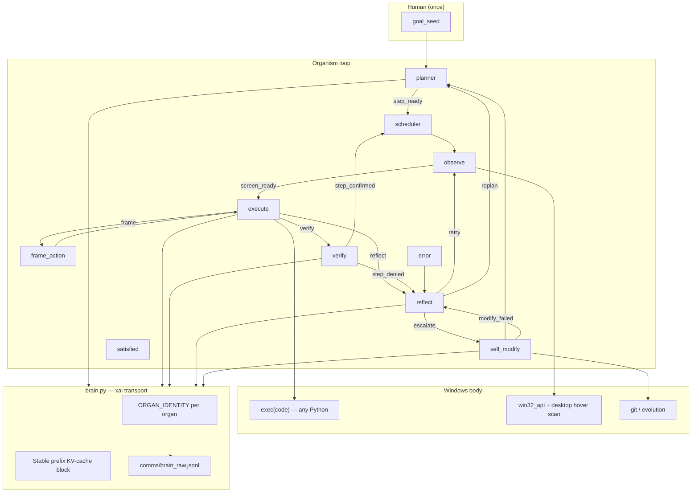
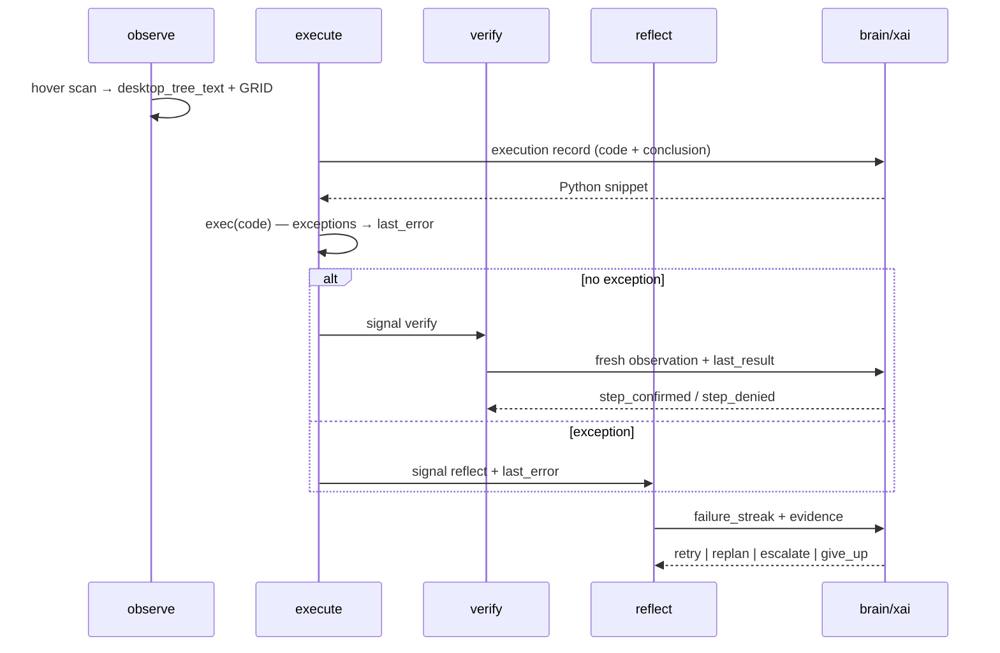
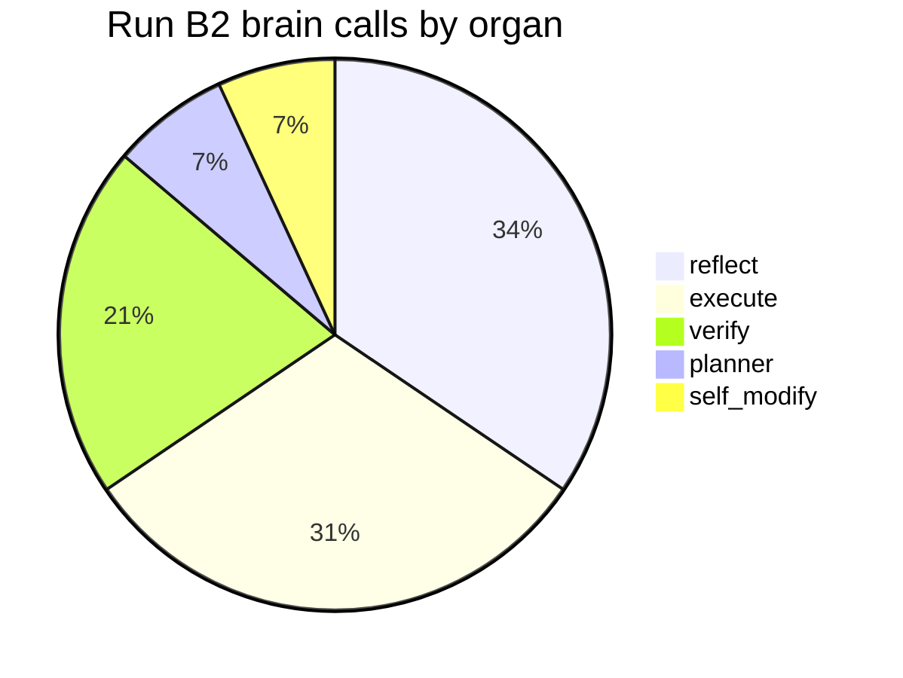

# endgame-ai

**A living digital operator on your Windows PC.** You give a goal and leave. The organism senses the desktop, runs arbitrary Python on the real machine, routes signals through a nervous system (`wiring.json`), and may evolve its own firmware via git. No sandbox. No operator watching.

**Tracked firmware:** 22 root `*.py` + `wiring.json` ≈ **2,536 LOC** (inverted `.gitignore` allowlist).

---

## Vision (unchanged)

| Principle | Meaning |
|-----------|---------|
| **Handover** | Human states intent once; organism owns the PC until halt or bounds |
| **Unconstrained body** | `execute` runs any Python — `subprocess`, `ctypes`, `win32_api`, scripts the model writes inline |
| **Interpreter feedback** | Python exceptions become `last_error` → `reflect` sees them; stdout/stderr become `last_result` |
| **Low code, high behavior** | Topology + prompts + observation carry complexity; organs stay thin |
| **Self-evolution** | `self_modify` proposes git-native patches when reflect escalates |
| **Honest verify** | No publish proof from `print()` alone; observation must match `done_when` |

The vision is not “an assistant that suggests commands.” It is an unattended operator that **does**, **observes**, **judges**, and **repairs**.

---

## Architecture





**MoE reading:** Each node is a **specialist** (plan / act / frame / judge / meta-critique / evolve). Routing is **not** learned gating — it is **wiring.json edges** driven by discrete signals. The LLM is a mixture of experts invoked one organ at a time; the topology is the router.

---

## Project timeline

| Phase | Tag / commit era | What happened |
|-------|------------------|---------------|
| **Genesis** | `grok_api_ready`, immune-system era | Self-modify loops, Opera transport experiments, early desktop contracts |
| **Slim / unify** | `ooo-unification`, `arch-flat-root` | Flat root organs, deleted `organism_nodes/`, inline xai in `brain.py`, hover-scan observation tree |
| **First live loop** | `first-live-loop` | End-to-end tick loop proven on real desktop |
| **Survey loop** | `survey-loop-complete` | Multi-tick stability, narration, denser observe |
| **Handover docs** | `handover-investigation` | Run B (Chrome) postmortem from logs + user confirmation |
| **Prompt pass** | `handover-prompt-fix` | Execute namespace, skip execute rescan, verify anti-hallucination |
| **Record shape** | `handover-opera-run` | Flat Grok JSON hoist in `_commit_record`, planner signal coercion |
| **Run B2** | runtime only (tick 40 crash) | Opera handover: launch OK, navigation stuck, self_modify corrupt patch |

---

## What is proven (achievements)

| Capability | Evidence |
|------------|----------|
| **Live organism loop** | 40 ticks Run B2; planner → execute → verify → reflect cycle stable |
| **Real desktop sensing** | `desktop_tree_text` with FOCUS, WINDOWS, GRID cells, ibeam targets |
| **Unsandboxed execute** | `winget install`, `subprocess.Popen`, path scans — real side effects |
| **Exception → reflect path** | `FileNotFoundError`, `CalledProcessError` in `last_error`; reflect lessons cite them |
| **Verify discipline** | 6× `step_denied` on Run B2; refused “binary on disk” as “Opera running” |
| **Replan intelligence** | Tick 23: saw `about:blank - Opera`, skipped launch, 6-step X+LinkedIn article plan |
| **Raw LLM audit trail** | 29 API round-trips in `comms/brain_raw.jsonl` — full prompts/responses recoverable |
| **Registry hot-swap** | `registry.reload_from_files()` after evolution (P0) |
| **Goal narration** | `goal_narration` updates with body signals and replan context |
| **KV-cache infrastructure** | `StablePrefix` renders full tracked firmware for prefix caching — **built, mostly off** |

---

## What is not proven (honest gaps)

| Gap | Run B2 evidence |
|-----|-----------------|
| **Full handover goal** | 0 articles on X or LinkedIn |
| **Browser navigation** | `open_url('https://x.com')` ×3 — title stayed `about:blank - Opera` |
| **GRID / type_text usage** | Observation showed ibeam @ L1/M1/N1; execute never clicked address bar |
| **frame_action organ** | **0 invocations** in `comms/runtime.ndjson` for Run B2 |
| **self_modify apply** | LLM proposed correct `open_url` diagnosis; **both** patches failed `git apply` corrupt |
| **Stable prefix in production** | `wiring.json`: `stable_prefix.enabled: false` for plan/execute/verify/reflect |
| **Multi-hour unattended run** | Crashed at tick 40 (~6.5 min) on evolution error in recovery loop |
| **Error recovery robustness** | `self_modify` failure → `error` → recovery re-entered `self_modify` → fatal |

---

## Run B2 — forensic summary (all logs read)

**Goal:** Opera (owner logged in) · **full articles** (not short posts) on X + LinkedIn about endgame-ai.

**Bounds:** 50 ticks / 40 brain calls · **stopped tick 40** (exit 1).

### Runtime counters (`comms/runtime.ndjson`)

| Node | Visits |
|------|--------|
| reflect | 20 |
| observe | 18 |
| execute | 18 |
| verify | 12 |
| planner | 4 |
| self_modify | 3 |
| error | 2 |

| Signal | Count |
|--------|-------|
| step_denied | 6 |
| retry | 7 |
| replan | 1 |
| escalate | 2 |

### Brain calls (`comms/brain_raw.jsonl`)

| Organ | Calls |
|-------|-------|
| reflect | 10 |
| execute | 9 |
| verify | 6 |
| planner | 2 |
| self_modify | 2 |

**29** think/request/response cycles · **0** logged brain errors · all responses parsed.

---

## What the LLM said (verbatim themes from responses)

The organism’s experts **did diagnose correctly** in several places. The system failed to **act on** or **apply** those diagnoses.

### Planner (#1, tick 0)

- 7-step plan: Opera → X compose → type article → publish → LinkedIn mirror.
- `next_signal: step_ready` only (after coercion fix).
- Reasoning: observable `done_when` per step, Opera preference, full articles.

### Planner (#17, tick 23 — replan)

- Saw Opera focused on `about:blank`; **skipped launch**.
- New narration: *"Opera is already focused and owner logged in. Proceed to open X and LinkedIn compose UIs…"*
- 6 steps with **minimum 800 chars** article requirement.
- Reasoning: *"Fresh observation confirms Opera already focused… avoid coarse verification failures."*

### Execute (progression)

| # | Code emitted | LLM reasoning |
|---|--------------|---------------|
| 2 | `Popen('C:\\Program Files\\Opera\\opera.exe')` | No Opera in scan |
| 4 | `winget install Opera.Opera` | Install if missing |
| 9 | Path scan + `print(found)` | Confirm binary before launch |
| 12 | `Popen('%USERNAME%...')` | Launch after scan — **literal %USERNAME%** |
| 14 | `expandvars('%LOCALAPPDATA%...')` + Popen | Corrected path — **Opera launched** |
| 18–24 | `open_url('https://x.com')` ×3 | Opera focused; navigate to X |

**Never emitted:** `click_at`, `type_text`, `hotkey`, `frame_action` strategy, or arbitrary helper script beyond subprocess.

### Verify (consistent)

- Denied when `focused_title` lacked `Opera` even though Opera window visible (tick 15) — **strict predicate, correct by contract**.
- Denied `open_url` attempts: *"Navigation action produced no observable effect."*
- Denied path-scan stdout as proof of running process.

### Reflect (meta-critique — strongest organ)

| Signal | Lesson (abridged) |
|--------|-------------------|
| retry | Wrong Opera path → install first |
| retry | winget failed → alternate install |
| retry | Binary exists → launch, not scan again |
| retry | `%USERNAME%` unexpanded → use `expandvars` |
| **replan** | Opera visible but step only tests launch; goal needs X/LinkedIn posting |
| retry | `open_url` silent failure — action not browser |
| **escalate** | 3× same failure → *"Browser automation transport silently broken"* |

Reflect’s routing_rule in payload explicitly maps **escalate** → *"wiring, prompt, code, observation, or transport contract is broken"* — the LLM followed it.

### self_modify (evolution expert — correct diagnosis, failed apply)

**Patch #1 summary:** *"Fix open_url() parameter handling… call open_url('https://x.com') assigned URL to browser param due to signature order."*

**Patch #1 rationale:** Matches actual `win32_api.open_url(browser=None, url='')` — positional `'https://x.com'` binds to `browser`, `url` stays empty, `start` launches nothing useful.

**Patch #2 summary:** Reorder params + `webbrowser.open(effective_url)`.

**Outcome:** `git apply --check` → **corrupt patch at line 31** (tick 38), then **line 15** (tick 40). Firmware unchanged. Run died in error-recovery loop.

---

## Meta-behavioral analysis (not just code)

### 1. Expert activation imbalance (MoE failure mode)



- **Reflect + verify consumed ~55%** of cognition — the organism **argued about** the body more than it **reframed** actions.
- **frame_action: 0%** — the “explore screen and strategize click targets” expert never routed. Execute went `verify` on success-shaped no-ops (`open_url` returns `ok: True`) instead of `frame` on “no observable effect.”

### 2. Silent success vs interpreter errors

| Outcome | Fed back? | Run B2 example |
|---------|-----------|----------------|
| Python exception | ✅ `last_error` → reflect | `FileNotFoundError` on bad paths |
| Empty stdout | ✅ `last_result` → verify/reflect | winget / path scan |
| Helper returns ok but no UI change | ⚠️ weak | `open_url` → `{ok: True}` while title unchanged |

The user is right: **interpreter errors are wired.** The deeper gap is **non-throwing false positives** — helpers that report success without observable world change. Verify caught this; execute did not branch to `frame`.

### 3. Prompt–behavior contract drift

| Prompt says | Model did |
|-------------|-----------|
| execute: use GRID ibeam, `click_at`, `type_text` | subprocess + `open_url` only |
| execute: never CANNOT when helpers exist | obeyed when it chose helpers — but wrong helper |
| frame_action: cite GRID cells | organ never called |
| planner: Opera logged in | assumed after replan — never verified login UI |
| self_modify: git-native narrow patches | produced diffs that fail `git apply` |

### 4. KV-cache / identity underutilization

**Built:** `ORGAN_IDENTITY` + `ORGAN_CORE` + full firmware `StablePrefix` in `brain.py`.

**Configured (`wiring.json`):**

```json
"stable_prefix": {
  "enabled": false,
  "include_in_request": false,
  "for_record_types": ["git_evolution_patch"]
}
```

Only `self_modify` may include the stable prefix. **Plan, execute, verify, reflect** get:

- Short `wiring.json` prompt line (~1 sentence)
- Dynamic tail: observation + state brief
- **No persistent picture** of topology, sibling organs, signal vocabulary, or helper signatures

With KV-cache, the stable block is **nearly free** to repeat. Today organs behave **stateless** — each call rediscovers the system from a thin prompt + snapshot. The LLM **re-invented** `%USERNAME%` paths and **missed** `open_url(browser, url)` signature because that knowledge is not in the cached identity layer.

### 5. Self-critique loop quality

**High quality:** reflect lessons tracked failure signatures, escalated at streak 3, replanned when step definition was wrong.

**Low quality:** retry loop called identical `open_url` three times without frame_action or alternate strategy — reflect said “re-issue or added confirmation” but did not route to `frame`.

**Broken closure:** escalate → self_modify → corrupt patch → error → **self_modify again** → crash. Meta-layer identified transport break; evolution layer could not land fix.

---

## Prompt engineering — replan (architecture-aligned)

This is the **primary remaining work**, not more application code. Prompts must make each organ know it is **one node in a graph**.

| Layer | Purpose | Today | Target |
|-------|---------|-------|--------|
| **ORGAN_CORE** | Shared firmware stance, bus contract, JSON shape | In code, not in every request | Stable prefix for **all** organs |
| **ORGAN_IDENTITY** | Role + siblings + signal vocabulary | 1 line per organ in `brain.py` | Expand: who you receive from, who you emit to, what you must never do |
| **wiring.prompts.*** | Record-type field contract | Short bus rules | Add topology context, helper **signatures** (`open_url(browser, url)`), GRID worked examples |
| **Dynamic tail** | Fresh truth | observation + state | Keep; add `last_reflection.lesson`, `action_frame`, `failure_streak.count` |
| **reasoning_effort** | Per-organ depth | Set in wiring | Match prompt richness — verify low, reflect/planner medium, self_modify high |

**KV-cache rule:** Anything identical across ticks → stable prefix. Anything tick-specific → dynamic tail only. At ~2.5k LOC tracked, **full firmware in prefix is affordable**.

**Identity rule:** Each prompt opens with: *You are `{organ}` in endgame-ai. Previous node: `{last_node}`. You emit signal `{signals}` per wiring.json edges.*

---

## Work remaining (project phases)

| Phase | Focus | Success criterion |
|-------|-------|-------------------|
| **A — Listen to the LLM** | Archive `comms/llm_extract.txt` pattern; treat reflect/self_modify lessons as backlog | Patches self_modify proposed actually applied or prompt prevents repeat |
| **B — Prompt rewrite** | Full stable prefix on; organ identity includes topology + helpers | Execute uses GRID after navigation fail; frame_action activates |
| **C — Behavioral closure** | Non-throwing helpers return observable hints; verify/execute agree on “no effect” | `open_url` failure surfaces like an exception in evidence |
| **D — Evolution hygiene** | self_modify diffs pass `git apply --check` before commit | Escalate path completes without crash |
| **E — Handover replay** | Same Opera/articles goal, longer bounds | Full articles live on X + LinkedIn |
| **F — Unattended endurance** | Multi-hour run without duplicate-launch races | Single organism, no state wipe mid-run |

No new features until **B** lands — the LLM already told us what is broken; the prompts did not equip it to use the body it has.

---

## Repository map

| File | Role |
|------|------|
| `organism.py` | Main loop, bounds, self_modify apply + reload |
| `wiring.json` | Topology, limits, prompts, model config |
| `brain.py` | xai transport, stable prefix, raw log, `think()` |
| `registry.py` | `NODE_REGISTRY`, hot-swap reload |
| `execute.py` | `exec(code)` — full namespace, no sandbox |
| `observe.py` / `desktop.py` | Hover scan → hierarchical tree + GRID |
| `verify.py` / `reflect.py` | Evidence judge / meta-critique |
| `self_modify.py` / `evolution.py` | Git-native evolution |
| `win32_api.py` | click, type, hotkey, `open_url`, foreground |
| `comms/brain_raw.jsonl` | Full LLM request/response audit |
| `comms/runtime.ndjson` | Node/signal event stream |
| `comms_poll.py` | Live snapshot commentary |

---

## Operator protocol

```bat
cmd.exe /c "cd /d <repo> && python comms\run_b2.py"
cmd.exe /c "cd /d <repo> && python comms_poll.py 15 20"
```

PowerShell `(cd … ; python …)` wrappers break on nested parentheses — use `cmd.exe` or a launcher script.

**Do not** commit `comms/`, `state.json`, or secrets.

---

## Tags (milestones)

`ooo-unification` · `arch-flat-root` · `first-live-loop` · `survey-loop-complete` · `p0-hot-swap` · `handover-investigation` · `handover-prompt-fix` · `handover-opera-run`

**Current state:** Run B2 complete at tick 40 — Opera launched, navigation and evolution unresolved, **0 posts**. Next milestone is **prompt-architecture pass** driven by LLM audit above, then handover replay.

---

## One-line truth

The organism **thinks clearly** (reflect, verify, self_modify diagnosis) and **acts narrowly** (subprocess habits, one broken helper). The firmware is small enough to hold in one head; the prompts are not yet big enough to hold the whole nervous system — and KV-cache makes that cheap. **Listen to what the LLM already said in the logs; rewrite prompts so the body can obey it.**