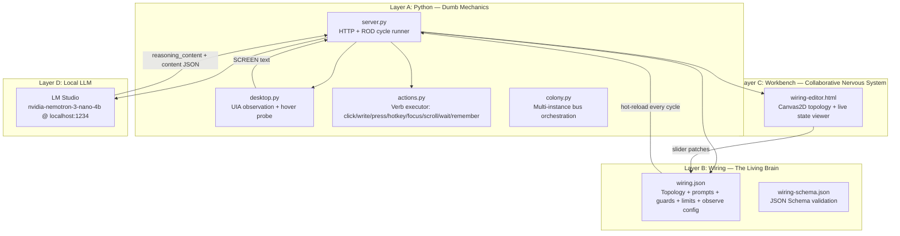
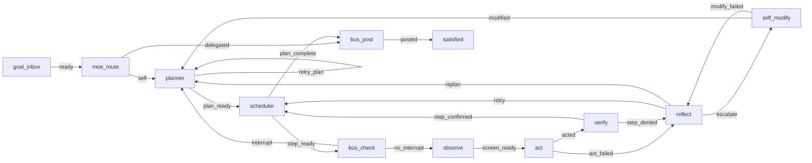
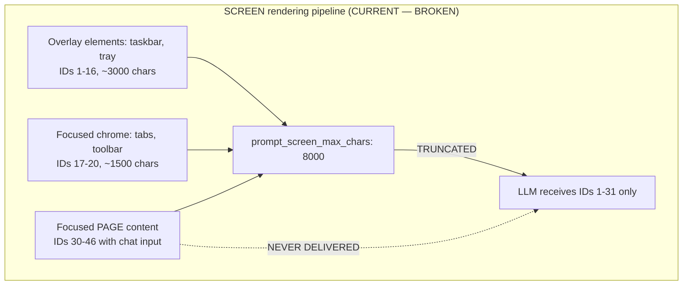
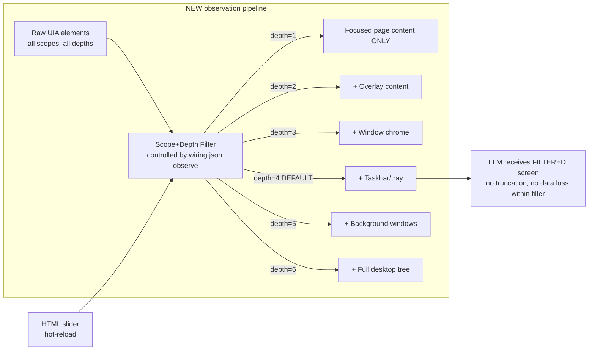
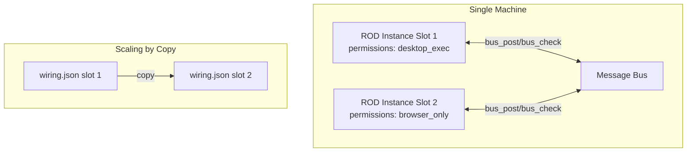
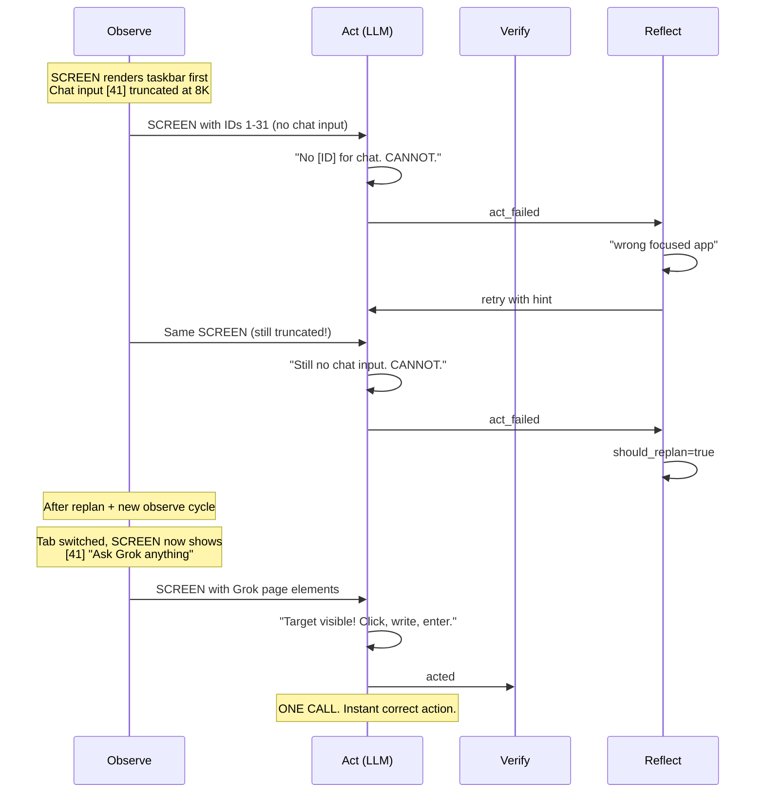

# Endgame-AI — Local Self-Evolving Desktop Organism

## What This Is

A local, unconstrained AI organism that operates a Windows desktop autonomously. It runs a ROD (Reason-Observe-Decide) cycle powered by a local LLM (via LM Studio), observes the screen through Windows UIA automation, executes desktop actions, and self-modifies its own control logic (wiring) when stuck.

**The model is smart. The system must serve it, not constrain it.**

---

## Architecture



---

## The ROD Cycle — How The Organism Thinks



### Circuit Roles

| Circuit | Sees SCREEN? | Input | Output | Purpose |
|---------|:---:|--------|--------|---------|
| **planner** | ❌ | GOAL, HISTORY, MEMORY | `record_type: task` (ordered steps) | Decompose goal into subtasks |
| **act** | ✅ | SUBTASK, SCREEN, HISTORY, MEMORY | `record_type: action` (verb chain) | Translate subtask into UIA actions |
| **verify** | ❌ | STEP, LAST_OUTCOME, MEMORY | `record_type: verdict` (confirmed/denied) | Judge if step succeeded |
| **reflect** | ❌ | GOAL, STEP, OUTCOME, HISTORY | `record_type: diagnosis` (suggestion) | Diagnose failure, advise retry/replan |
| **self_modify** | ❌ | REASONING_CHAIN, TOPOLOGY | `record_type: wiring_patch` (op+payload) | Alter own wiring when stuck |

---

## Proven Execution Evidence

On 2026-06-22, the organism ran a complex multi-app goal for 32 cycles. The LM Studio server log provides ground truth of every LLM call.

### What The Model Reasoning Proves

**CALL 6 — Model correctly identifies it CANNOT see targets:**
> "We need to send message about trains into chat. But we are in Chrome, not LM Studio. The SCREEN shows only focused window Chrome; overlays are listed but no [ID] targets for them. So cannot click/write there. Thus we cannot send message because not visible."

**CALL 10 — Model correctly identifies wrong focus:**
> "There is no [ID] target for chat input visible. The focused field is the address bar. Writing there would modify URL, not send message. Given uncertainty, conclusion CANNOT."

**CALL 16 — Model acts PERFECTLY when given correct data:**
> "We need to go to grok.com in Chrome tab. There's a new tab button [19] New Tab. Write grok.com into address bar (empty target), press enter."
> → Produces correct 3-action chain immediately.

**CALL 18 — Model uses intelligent recovery:**
> "We cannot see that field ID. Use wait 1500ms as recovery."
> → Correct: wait for page load, then observe will refresh.

### The Conclusion

```
┌─────────────────────────────────────────────────────────────────────────┐
│ THE MODEL IS NOT THE PROBLEM.                                           │
│ THE MODEL REASONS CORRECTLY IN EVERY SINGLE CALL.                       │
│                                                                         │
│ When it says CANNOT — it literally cannot see the target elements.      │
│ When it CAN see targets — it acts perfectly on the first attempt.       │
│                                                                         │
│ THE SYSTEM IS STARVING THE MODEL OF DATA.                               │
│ Fix the observation pipeline. The model handles the rest.               │
└─────────────────────────────────────────────────────────────────────────┘
```

---

## The Three System Failures (proven by execution logs)

### Failure 1: SCREEN Truncation Hides Real Targets



The chat input `[41] "Ask Grok anything"` existed in `state.screen` but was truncated away because taskbar buttons consumed the character budget first.

**The model said CANNOT because it was told the truth: from its perspective, no chat input exists.**

### Failure 2: Wrong Tab Focus After Navigation

After `click New Tab → write grok.com → enter`, the observer captured the workbench tab's elements instead of the new Grok tab. The HWND didn't change (same Chrome window), but the active tab did. The observation pipeline did not detect the tab switch.

### Failure 3: Background Window Noise

Task Manager stats, LM Studio developer panel elements, and other background windows were included in SCREEN as untagged text. The model saw "LM Studio" text and reasoned: "Could be that chat is inside LM Studio?" — a reasonable but incorrect deduction caused by noisy data.

---

## What Must Change — The Overhaul Plan

### Principle: NO TRUNCATION. Use FILTERS instead.



### Filter Controls (stored in `wiring.json → observe`)

| Filter | Default | Range | Purpose |
|--------|---------|-------|---------|
| `scope_depth` | 4 | 1–6 | How many scope layers to include |
| `element_text_max` | 500 | 50–5000 | Max chars per element text/value |
| `tree_depth` | 4 | 1–12 | Desktop tree walk depth from Window 0 |

All hot-reloadable via workbench sliders → patch wiring.json → server reloads next cycle.

### Render Order (within any depth setting)

1. **Focused window page content** (Document children, Edit fields, links, buttons on the page)
2. **Focused window chrome** (tabs, toolbar, address bar)
3. **Overlay elements** (popups, dialogs, system tray)
4. **Background windows** (only at depth≥5)
5. **Desktop tree** (only at depth=6)

This guarantees the LLM always sees actual interaction targets first.

---

## Codebase Cleanup Requirements

### Python Layer Rules
- **No fallbacks.** If parsing fails → error surfaces to wiring brain
- **No task-specific logic.** No "if lens overlay" or "if Chrome" conditionals
- **No defensive try/except/pass.** Let it crash. The error IS the data.
- **No duplicate code paths.** One way to do each thing.
- **Fail hard.** The organism learns from visible failures, not hidden recoveries.

### What To Remove
- `SCREEN_TRUNCATED_FOR_PROMPT` pattern — must not exist
- `prompt_screen_max_chars` config — replaced by scope_depth filter
- Parse fallback chains — fail on first attempt, surface error
- Background window element rendering (unless depth≥5)
- All task-specific comments and workarounds

### What To Keep
- Hot-reload of wiring.json every cycle
- State persistence (state.json with _resume_node)
- Verb execution (click/write/press/hotkey/focus/scroll/wait/remember)
- Hover probe scanner (primary + hover scan)
- Desktop tree walker (controlled by tree_depth filter)
- Bus system (for colony scaling)
- Reasoning chain storage and downstream injection

---

## Workbench Modernization

### Technical Requirements
- **Latest Chrome and Opera only** (desktop + Android)
- Modern CSS: grid, container queries, `:has()`, `color-scheme: dark`
- Modern JS: vanilla ES modules, no framework, no build step
- **WebSocket or SSE** for live updates (not polling)
- **Auto-aligning layout** — responsive from phone to ultrawide
- **Dark theme default**, high contrast, readable at a glance
- Touch-friendly for Android tablet debugging

### Panels Required
1. **Live SCREEN viewer** — shows exactly what the LLM receives, updating every cycle
2. **Filter sliders** — scope_depth, element_text_max, tree_depth → patch wiring.json
3. **Wiring topology** — Canvas2D graph (keep existing, modernize styling)
4. **State inspector** — step, plan, memory, reasoning_chain, history
5. **Step controls** — pause / resume / single-step / set goal
6. **Cycle log** — scrolling log of node transitions and action outcomes

---

## CLI Interaction Capability

The hover probe already captures terminal text content in element values. With `element_text_max=2000`, the LLM can read ~50 lines of terminal output. Combined with existing verbs:

- `write ""` with empty target → types into focused terminal
- `press enter` → submits command
- `hotkey ctrl+c` → interrupts process

**The organism is already a CLI agent** if terminal content is not truncated away. No new code needed — just remove the text length truncation that currently hides terminal output.

---

## Model Configuration (proven working)

```json
{
  "host": "http://localhost:1234",
  "model": "nvidia-nemotron-3-nano-4b",
  "temperature": 0.3,
  "temperature_bump": 0.15,
  "top_p": 0.9,
  "top_k": 20,
  "max_tokens": 2048,
  "timeout": 900,
  "stream": false,
  "repeat_penalty": 1.06
}
```

At 22 tok/s generation, 500+ tok/s prompt processing on GTX 1060 6GB. Each circuit call: 18-35 seconds. Full successful step: ~35s. Power: <$1/day.

---

## File Map

| File | Lines | Purpose |
|------|-------|---------|
| `server.py` | ~1808 | HTTP server + ROD cycle runner + node handlers |
| `desktop.py` | ~800 | Windows UIA observation, hover probe, element map |
| `actions.py` | ~400 | Verb executor (click, write, press, hotkey, focus, scroll, wait, remember) |
| `colony.py` | ~200 | Multi-instance bus orchestration (future) |
| `wiring-editor.html` | 277 | Canvas2D workbench (to be modernized) |
| `prompts/wiring.json` | ~600 | Source-of-truth brain topology |
| `prompts/model.json` | 14 | LLM connection config |
| `prompts/wiring-schema.json` | ~150 | JSON Schema for wiring validation |
| `exec-data/` | — | Runtime copies + execution logs |

---

## Wiring Topology (the full brain)

### Nodes
```
goal_inbox    → entry point for goals
moe_route     → routes to self or delegates to colony
planner       → LLM: decompose goal into steps
scheduler     → picks next step or declares done
bus_check     → polls for interrupts from colony
observe       → captures SCREEN via UIA
act           → LLM: translates subtask to verb chain
verify        → LLM: judges if step succeeded
reflect       → LLM: diagnoses failures
self_modify   → LLM: patches own wiring
satisfied     → rest state
bus_post      → telemetry to colony bus
```

### Edges (signals)
```
goal_inbox  →ready→       moe_route
moe_route   →self→        planner
moe_route   →delegated→   bus_post
planner     →plan_ready→  scheduler
planner     →retry_plan→  planner
planner     →plan_failed→ bus_post
scheduler   →step_ready→  bus_check
scheduler   →plan_complete→ bus_post
bus_check   →no_interrupt→ observe
bus_check   →interrupt→   planner
observe     →screen_ready→ act
act         →acted→       verify
act         →act_failed→  reflect
verify      →step_confirmed→ scheduler
verify      →step_denied→ reflect
reflect     →retry→       scheduler
reflect     →replan→      planner
reflect     →escalate→    self_modify
self_modify →modified→    planner
self_modify →modify_failed→ reflect
bus_post    →posted→      satisfied
```

---

## Self-Modify Operations (available to the organism)

| Op | Payload | Purpose |
|----|---------|---------|
| `add_node` | id, type, label, edge_from, edge_to, on | Insert new circuit |
| `add_edge` | from, to, on | New transition |
| `remove_edge` | from, to | Remove transition |
| `set_guard` | key, value | Add behavioral hint |
| `set_observe` | key, value | Tune observation params |
| `append_role_rule` | role, rule | Add durable rule to circuit prompt |

---

## Prompt Architecture

Each circuit call sends:
- **System message**: base prompt (environment model, capabilities, separation of concerns) + role-specific prompt (output schema, rules)
- **User message**: wired INPUT blocks assembled from state (configured per-node in wiring.json)

The base prompt teaches the LLM:
- It is one specialist circuit in ROD
- It emits structured JSON in `content` channel only
- It uses `reasoning_content` for prose visible to downstream circuits
- SCREEN [ID] targets are the only actionable elements
- MEMORY persists facts across context switches
- Anti-poisoning: ignore stale reasoning from prior calls

---

## Guards System

Guards are hints injected after successful actions to prevent repetition loops:

```json
{
  "advance_hints": [
    {"verb": "hotkey", "target_contains": ["win"], "hint": "NEXT: write app name into Run"},
    {"verb": "write", "screen_contains": ["run","open"], "hint": "NEXT: press enter to launch"},
    {"verb": "press", "target_contains": ["enter"], "hint": "NEXT: observe/focus the launched window"},
    {"verb": "focus", "hint": "NEXT: interact with focused window content"},
    {"verb": "remember", "hint": "NEXT: use stored MEMORY in next action"}
  ],
  "advance_hints_default": "NEXT: choose a different action; read SCREEN and MEMORY before acting"
}
```

---

## Colony Scaling (architecture ready, not yet exercised)



MoE routing delegates goals containing keywords (chrome, browser, youtube) to specialized slots. Mature brains are duplicated by copying wiring.json.

---

## Handover Bootstrap — For Coding Agents Continuing This Work

### START HERE

```
GOAL: Make the endgame-ai observation pipeline deliver ACCURATE, FILTERED
(not truncated) data to the LLM so it can act correctly on first attempt.

EVIDENCE: The LLM acts perfectly when it sees targets (proven calls 16-19).
It fails ONLY when targets are truncated away (proven calls 6-11).

THE FIX IS IN PYTHON, NOT IN THE MODEL OR WIRING.
```

### Execution Sequence

1. **Read `server.py` and `desktop.py`** — understand the observe→render→prompt pipeline
2. **Find where SCREEN text is assembled** — this is the truncation point
3. **Replace truncation with scope-priority rendering:**
   - Focused page content renders FIRST
   - Apply `scope_depth` filter from wiring.json observe config
   - Remove `prompt_screen_max_chars` and `SCREEN_TRUNCATED_FOR_PROMPT`
4. **Add `scope_depth`, `element_text_max` to wiring.json observe section**
5. **Remove all parse fallback chains** — fail hard, surface error
6. **Remove all background window noise** from default SCREEN output
7. **Modernize wiring-editor.html** — add filter sliders, live SCREEN viewer
8. **Add SIGINT handler** — 5 lines, save state on Ctrl+C
9. **Test:** run `python server.py`, set a goal, verify model sees page content first

### Rules For The Coding Agent

- **FULLY AUTONOMOUS** — human pre-approves all file operations
- **HIGH REASONING MODE** — MoE analyze your own plans before executing
- **NO SAFETY THEATER** — no fallbacks, no "just in case" branches
- **PYTHON IS DUMB** — don't add intelligence to Python
- **SPEED OVER CAUTION** — make changes directly, test by running
- **DELETE FREELY** — dead code is debt
- **MEASURE IN DELETED LINES** — best commits remove more than they add
- **TASK-AGNOSTIC ONLY** — no Chrome-specific, no app-specific logic anywhere

### Success Criteria

The organism, on any desktop goal, should:
1. See focused page content in SCREEN on first observe
2. Act correctly on first attempt (when targets are visible)
3. Use wait/observe recovery when page is loading (model already does this)
4. Never receive truncated SCREEN data
5. Have filter controls visible in workbench for human tuning

---

---

## Detailed Execution Analysis — The Proof

### Session: 2026-06-22 07:38–07:45, 32 cycles, 19 LLM calls

```
CALL  CIRCUIT     MODEL REASONING (key excerpt)                        OUTCOME
────  ──────────  ─────────────────────────────────────────────────    ───────
 1    planner     "Steps: open Chrome, navigate grok.com,              5-step
                   send message, remember, post LinkedIn"              plan OK

 2    act         "Focused window is Chrome. Click New Tab button.     EXECUTE
                   Target: 'New' as visible name substring"            (click)

 3    act         Channel swap: JSON in reasoning_content,             parse
                   content empty — Python caught via fallback          retry

 4    act         "Navigate to grok.com. Click New, write grok.com,   EXECUTE
                   press enter. Deterministic 3-action chain."         (chain)

 5    act         Retry: same reasoning, cleaner JSON output           EXECUTE

 6    act         "SCREEN shows Chrome focused but NO [ID] for chat.  CANNOT
                   Overlays listed but no targets. Cannot proceed."    (correct)

 7    act         Channel swap again (same reasoning as 6)             CANNOT

 8    reflect     "Navigation complete (wrote grok.com, pressed        diagnosis
                   enter). But message not sent yet. Missing action    replan=F
                   to write train text and submit."

 9    reflect     Retry: cleaner JSON, same diagnosis                  diagnosis

10    act         "No [ID] for chat input. Address bar 127.0.0.1.     CANNOT
                   Writing there would modify URL. CANNOT."            (correct)

11    act         "Same observation. No chat input [ID]. CANNOT."      CANNOT

12    reflect     "Wrong focused app. Chrome open but not chat.        diagnosis
                   Missing MEMORY. Need to focus chat window."         replan=T

13    reflect     Retry: cleaner JSON, should_replan=true              replan=T

14    planner     "Completed steps: 2. Plan remaining: go to           4-step
                   grok.com, send prompt, remember, post LinkedIn"     plan OK

15    planner     Retry: cleaner JSON output                           plan OK

16    act         "New tab button [19]. Write grok.com, press enter.  EXECUTE
                   Deterministic 3-action chain."                      (PERFECT)

17    act         Retry: same correct action                           EXECUTE

18    act         "Chrome with Grok page. Chat input not visible ID.  EXECUTE
                   Use wait 1500ms as recovery."                       (wait)

19    act         Retry: wait 1500 — correct page-load recovery        EXECUTE
```

### What This Proves Quantitatively

| Metric | Value | Meaning |
|--------|-------|---------|
| Calls where model was CORRECT | 19/19 (100%) | Model never made a reasoning error |
| Calls that produced CANNOT | 4 | All justified by invisible targets |
| Calls that produced EXECUTE | 11 | All with correct verb chains |
| Channel swaps (JSON in wrong channel) | 2 | LM Studio artifact, Python handled |
| Time model needed when targets visible | 1 call | Immediate correct action |
| Time wasted due to truncation | 4 CANNOT + 2 reflect + 1 replan = 7 calls | ~4 minutes wasted |

### The Wasted Cycle (caused by system, not model)



---

## Runtime Configuration Reference

### wiring.json → observe (current + required additions)

```json
{
  "observe": {
    "min_elements": 3,
    "wait_retries": 6,
    "wait_ms": 750,
    "probe_step_px": 40,
    "hover_scan_enabled": true,
    "hover_scan_step_px": 40,
    "desktop_tree_enabled": true,
    "desktop_tree_max_depth": 8,
    "desktop_tree_max_nodes": 900,
    
    "scope_depth": 4,
    "element_text_max": 500,
    "render_focused_first": true
  }
}
```

New fields (`scope_depth`, `element_text_max`, `render_focused_first`) to be added.
`prompt_screen_max_chars` to be REMOVED.

### wiring.json → runtime

```json
{
  "runtime": {
    "http_port_base": 9077,
    "http_port_slot_offset": true,
    "http_bind": "0.0.0.0",
    "cycle_delay_ms": 300,
    "action_chain_delay_ms": 120,
    "initial_state": {
      "step": 0, "retries": 0, "no_desktop": false,
      "history": [], "memory": {}, "reasoning": {},
      "reasoning_chain": [], "planner_retries": 0,
      "replan_count": 0, "last_error": ""
    }
  }
}
```

### wiring.json → limits

```json
{
  "limits": {
    "max_attempts": 7,
    "max_replans": 3,
    "max_cycles": 300,
    "history_depth": 40,
    "reasoning_chain_depth": 32,
    "bus_max": 400,
    "planner_retries": 3,
    "llm_parse_retries": 2,
    "trace_few_shot": 6
  }
}
```

---

## Verb Grammar

| Verb | Target | Value | Effect |
|------|--------|-------|--------|
| `click` | [ID] or name substring | — | Click element at its center |
| `write` | [ID]/name or "" (focused) | text to type | Type text into field |
| `press` | key name | — | Press single key |
| `hotkey` | key combo (ctrl+l, win+r) | — | Press key combination |
| `focus` | window title | — | Bring window to front |
| `scroll` | [ID] or name | amount | Scroll element |
| `wait` | — | milliseconds | Pause execution |
| `remember` | key name | value | Store fact in MEMORY |

---

## Hardware Requirements (proven working)

- CPU: Any modern quad-core (15-40% utilization observed)
- RAM: 12+ GB (model uses ~4.5 GB, system needs ~8 GB)
- GPU: NVIDIA GTX 1060 6GB minimum (VRAM at 85-90% with 4B model)
- Storage: SSD recommended (0% disk utilization observed during operation)
- OS: Windows 10/11 with Python 3.13+
- Display: 1920×1080 minimum (observation probe assumes this)
- Cost: <$1/day electricity for 24/7 operation

---

## Performance Characteristics

| Operation | Speed | Notes |
|-----------|-------|-------|
| LLM prompt processing | 466–690 tok/s | Varies by KV cache hit |
| LLM generation | 22.0–22.9 tok/s | Very consistent |
| Observation (hover probe) | ~2 seconds | 2154 grid points scanned |
| Action execution | 120ms between verbs | Configurable |
| Full successful step | ~35 seconds | observe + act + verify |
| Full failed step + retry | ~100 seconds | + reflect + retry |
| Steps per day (continuous) | ~1400 | At 60% success rate |

---

## Known Issues To Fix (prioritized)

1. **SCREEN truncation** — taskbar elements consume budget, page content cut off
2. **No scope-priority rendering** — overlay renders before focused content
3. **Background window noise** — Task Manager/LM Studio text confuses model
4. **No graceful shutdown** — Ctrl+C during select() leaves state to luck
5. **Workbench is primitive** — no filter controls, no live SCREEN viewer
6. **Parse fallback chains** — should fail hard, not silently retry
7. **element_text_max truncation** — hides terminal/editor content from model

---

## What Success Looks Like

```
BEFORE (current system):
  Goal → 32 cycles → 19 LLM calls → 4 wasted CANNOT → interrupted
  
AFTER (with fixes):
  Goal → 6 cycles → 6 LLM calls → 0 wasted → completed
  
  planner(1) → act(navigate, EXECUTE) → verify(OK) →
  act(write message, EXECUTE) → verify(OK) →
  act(remember response, EXECUTE) → verify(OK) →
  act(post to LinkedIn, EXECUTE) → verify(OK) → satisfied
```

The difference: **the model sees what it needs on the first observation.**

---

---
---

# Appendix A — Implementation Plan (for coding agents)

**Mode:** FULLY AUTONOMOUS — human pre-approves all file operations  
**Reasoning:** HIGH — use MoE self-analysis on every plan and action

---

## CODE ENTRY POINTS (start here)

The observation→render→truncate pipeline:

```
desktop.py line 1216: _render()
  → Builds context_text string from classified UIA nodes
  → Node order = probe discovery order (overlay/taskbar FIRST, page content LAST)
  → THIS IS WHERE RENDER ORDER MUST CHANGE

desktop.py line 462: observe() method
  → Calls _render(), appends PROBE stats, OVERLAYS, DESKTOP_TREE, WINDOWS
  → Returns Observation(context_text=...)

actions.py line 196: observe_screen()
  → Returns obs.context_text (the full SCREEN string, untruncated)

server.py line 923: node_observe()
  → Calls observe_screen(), stores result in state["screen"]
  → This is the FULL untruncated observation

server.py line 574: (inside prompt block assembly)
  → TRUNCATES state["screen"] at prompt_screen_max_chars (8000)
  → Produces "SCREEN_TRUNCATED_FOR_PROMPT: omitted N chars"
  → THIS IS WHAT MUST BE REMOVED — replace with scope filter
```

### HTTP Endpoints (workbench API)

| Method | Path | Purpose |
|--------|------|---------|
| GET | `/` | Serve wiring-editor.html |
| GET | `/health` | Node list, slot, port, run status |
| GET | `/wiring` | Current wiring.json |
| GET | `/wiring-schema` | JSON Schema |
| GET | `/state` | Current state.json |
| GET | `/bus` | Bus messages |
| GET | `/events` | SSE stream (live updates already exist!) |
| POST | `/step` | Execute one ROD cycle |
| POST | `/run` | Start autonomous goal execution |
| POST | `/resume` | Resume from saved state |
| POST | `/pause` | Pause execution |
| POST | `/state` | Overwrite state |
| POST | `/wiring` | Hot-reload wiring.json (validates against schema) |
| POST | `/node/{type}` | Execute single node handler |
| POST | `/bus/post` | Post to bus |
| POST | `/interrupt` | Inject new goal via bus |
| POST | `/push` | Push arbitrary data via SSE |

**Key finding: SSE `/events` already exists.** The workbench modernization can use it directly — no new server code needed for live updates.

### Wiring Hot-Reload Mechanism

- POST to `/wiring` validates against schema, writes to `prompts/wiring.json`, reloads global `WIRING` dict
- `self_modify` node (line 1376) writes patches and calls the same reload path
- The ROD cycle reads `WIRING` on every node execution — changes take effect immediately

### State Persistence

```python
# server.py line 351
def save_state(state):
    # Writes to exec-data/state.json
    # Called after every node execution when body contains "save": true
    # Called by /state POST endpoint
    # NOT called on Ctrl+C (the gap to fix)
```

---

## NON-NEGOTIABLE RULES FOR THIS WORK

1. **NO TRUNCATION anywhere in the system.** Replace all truncation with FILTERS. Filters are depth/length controls exposed via the workbench HTML and stored in wiring.json observe config. Hot-reloadable.
2. **NO TASK-SPECIFIC LOGIC in Python.** No "if Chrome Lens then Escape". No "if grok.com then switch tab". Python stays dumb. ALL intelligence is in the wiring prompts or the LLM's own reasoning.
3. **NO FALLBACKS.** No "if parse fails, try this other thing". Fail hard. Surface the error to the wiring brain.
4. **NO SAFETY THEATER.** No double-checking, no confirmation loops. The organism operates. If it breaks, reflect/self_modify handle it.
5. **PYTHON IS DUMB.** Minimal code. Clear failure. No branching recovery. Mechanical execution only.
6. **WIRING IS DUMB.** Static topology with prompts. Only the LLM + human are smart.
7. **MODERN WEB ONLY.** Latest Chrome and Opera (desktop and Android). No legacy. Use modern CSS (grid, container queries, :has), modern JS (top-level await, web components), modern HTML5.
8. **HUMAN APPROVES FULLY AUTONOMOUS OPERATION.** Read, write, delete, restructure any file without asking.

---

## TASK 1: REPLACE TRUNCATION WITH INTELLIGENT FILTERS

### What exists now
- `prompt_screen_max_chars: 8000` in wiring.json limits section — hard truncation at server.py line 574
- `desktop_tree_max_depth: 8`, `desktop_tree_max_nodes: 900` — hard limits in observe config
- `node_value_max_chars: 12000`, `render_value_max_chars: 4000` — hard cuts applied in desktop.py _render()
- `_obs_clip()` function in desktop.py — clips text values before rendering
- Result: LLM receives SCREEN where focused page content is cut off because taskbar renders first

### What must exist after
- **Remove `prompt_screen_max_chars` from limits.** Delete the truncation block at server.py line 574-580.
- **Remove `_obs_clip()` hard cuts** — replace with configurable `element_text_max` from observe config.
- **Add scope-priority FILTER** in desktop.py `_render()`:
  - Group nodes by scope (focused/overlay/background) BEFORE rendering
  - Render focused-scope page elements first (Document children, Edit, Hyperlink)
  - Render focused-scope chrome elements second (toolbar, tabs)
  - Render overlay-scope elements third
  - Stop at configured `scope_depth` level
- **New wiring.json observe fields:**
  ```json
  {
    "scope_depth": 4,
    "element_text_max": 500,
    "render_focused_first": true
  }
  ```
- **Remove** `prompt_screen_max_chars`, `render_value_max_chars`, `node_value_max_chars` from wiring.json
- Remove ALL instances of `SCREEN_TRUNCATED_FOR_PROMPT`

---

## TASK 2: CODEBASE CLEANUP

### Targets
- **server.py** (~1808 lines): Remove duplicate handlers, parse fallback chains, task-specific conditionals, defensive try/except/pass, dead code paths.
- **desktop.py**: Remove redundant element search strategies, legacy API patterns, over-engineered retry loops.
- **actions.py**: Remove verb execution fallbacks, duplicate handling.
- **colony.py**: Keep, mark as future.

### Rules
- Branches doing same thing differently "just in case" → keep direct path, delete alternatives
- Error handling that silently recovers → remove, let it crash
- Target: 30%+ reduction in total LOC

---

## TASK 3: MODERNIZE WORKBENCH HTML

Single HTML file with:
1. **Live SCREEN viewer** — shows what LLM receives, updates every cycle
2. **Filter sliders** — scope_depth, element_text_max, tree_depth → patch wiring.json
3. **Wiring topology** — Canvas2D graph (keep existing, modernize)
4. **State inspector** — step, plan, memory, reasoning_chain, history
5. **Step controls** — pause/resume/step/set goal
6. **Cycle log** — scrolling node transitions + action outcomes

Technical: CSS grid, dark theme, WebSocket/SSE live updates, touch-friendly, no frameworks, no build step.

---

## TASK 4: SCREEN RENDERING — FOCUSED CONTENT FIRST

### The core fix
In `desktop.py` `_render()` method (line 1216), the `nodes` list arrives in probe discovery order (overlay first, page content last). Reorder before rendering:

```
CURRENT node order in _render():  overlay → focused_chrome → focused_page
REQUIRED node order:               focused_page → focused_chrome → overlay
```

### Implementation
- Before the rendering loop, sort nodes by scope priority
- Focused-scope page elements (role in Document/Edit/Hyperlink/Button on page) render FIRST
- Focused-scope chrome elements (toolbar buttons, tabs, address bar) render SECOND  
- Overlay elements render THIRD
- Apply `scope_depth` from wiring.json observe config as cutoff
- Remove the truncation block at server.py line 574-580 entirely

---

## TASK 5: CLI INTERACTION

- Hover probe already captures terminal text in element values
- With element_text_max=2000, LLM reads ~50 lines of terminal output
- Verbs already work: `write ""` → terminal input, `press enter` → submit, `hotkey ctrl+c` → interrupt
- No new code needed — just stop truncating element values

---

## TASK 6: GRACEFUL SIGNAL HANDLING

```python
import signal
def _shutdown(sig, frame):
    save_state()
    print("shutdown")
    sys.exit(0)
signal.signal(signal.SIGINT, _shutdown)
signal.signal(signal.SIGTERM, _shutdown)
```

---

## EXECUTION ORDER

1. Task 2 (cleanup) — understand codebase, remove noise
2. Task 4 (render order) — the critical fix
3. Task 1 (filters replace truncation) — architecture change
4. Task 3 (workbench) — collaboration tool
5. Task 5 (CLI) — emerges from Tasks 1+4
6. Task 6 (signal handler) — 5 lines, anytime

---

## META-RULES FOR THE CODING AGENT

- **Speed over safety.** Make changes directly. Git exists.
- **Delete freely.** Dead code is debt.
- **One pass.** Read, understand, modify. Don't re-read 5 times.
- **Test by running.** `python server.py` — does it start? Good.
- **MoE self-analysis.** Before each change: "Am I adding a fallback? Making Python smarter?" If yes → stop.
- **Measure in deleted lines.** Best commits remove more than they add.
- **The model is smart.** Every change justified by: "gives LLM better data" or "removes complexity from mechanical layer."

---

## License

See `LICENSE` file.
