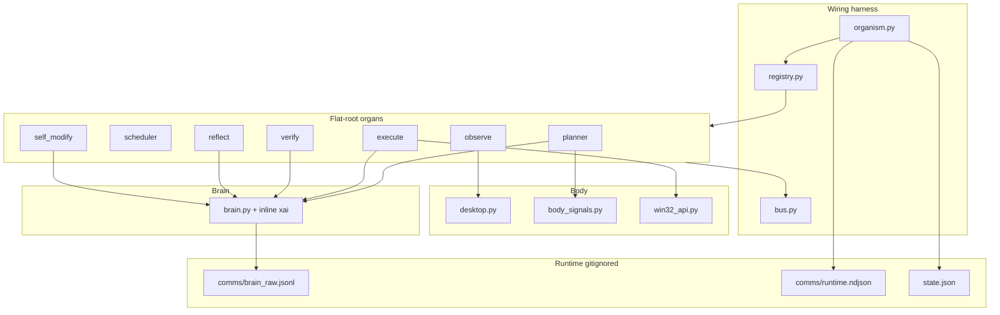
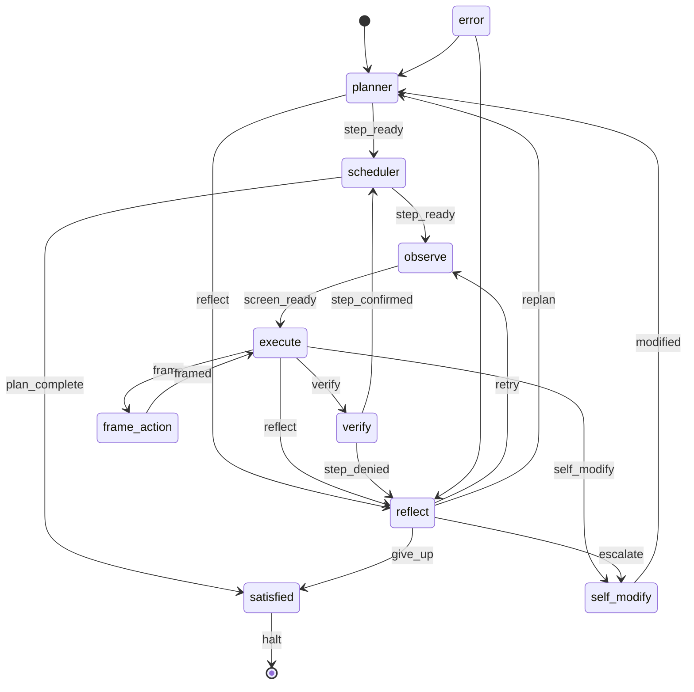
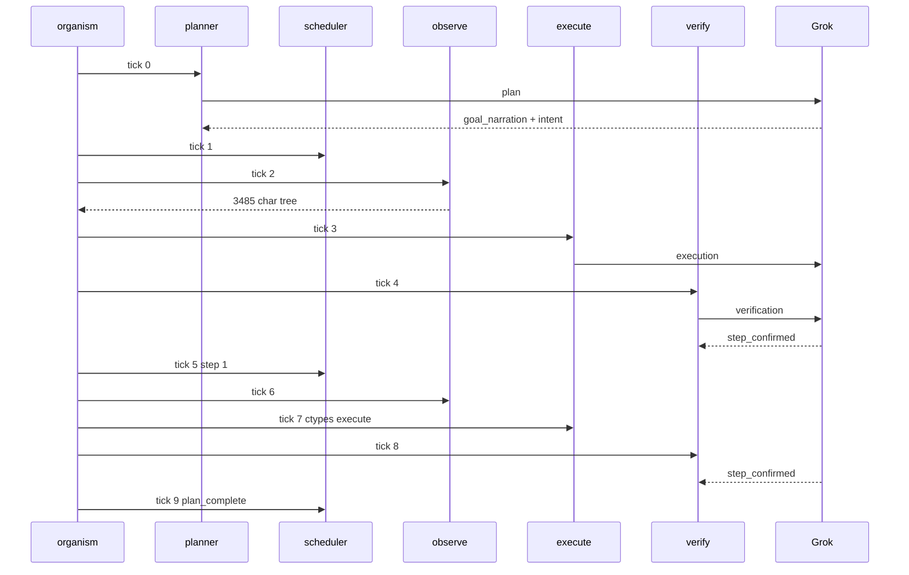
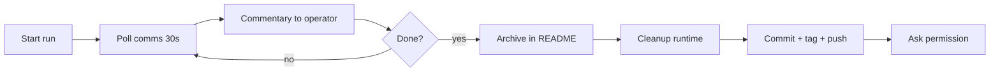
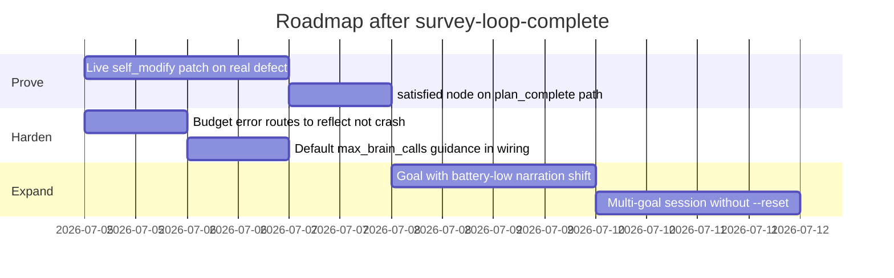

# endgame-ai

A **human operator in digital form** on Windows 11 — a wiring harness, not a chat agent.

| Layer | Role |
|-------|------|
| Python + ctypes | Body (mouse, keyboard, files, subprocess, Win32) |
| `wiring.json` | Nervous system (fixed topology, prompts, limits) |
| Grok API | Brain peripheral (LLM organs only) |
| Git | Firmware memory (`self_modify` evolution) |

**Constraints:** Windows 11 · stdlib + ctypes in core · unsandboxed `execute` · operator watches.

**Tags:** `arch-flat-root` · `first-live-loop` · **`survey-loop-complete`**

---

## Current state (2026-07-04)

Flat-root organism. **22 Python modules** at repo root. No `organism_nodes/`, no `nodes.py`, no dynamic import loader.

| Capability | Status |
|------------|--------|
| Hierarchical desktop observation | **proven** — 3k+ char trees, VISIBLE + WINDOWS + GRID |
| Self-narrating goal | **proven** — `goal_seed` + planner `goal_narration` + `body_signals` |
| Full topology loop | **proven** — planner → scheduler → observe → execute → verify ×2 → plan_complete |
| Unsandboxed execute | **proven** — ctypes `GetWindowTextW` → `Focused window: Task Manager` |
| Raw brain audit trail | **live** — `comms/brain_raw.jsonl` (gitignored) |
| Git self-modify | **built, untested live** — `evolution.py` + immune contract |

---

## Survey loop complete (breakthrough run)

**Goal:** `survey desktop and note open applications`  
**Command:** `python organism.py "…" --max-ticks 10 --max-brain-calls 12 --reset`  
**Duration:** ~51s · **Brain calls:** 5/12 · **Exit:** 0

| Tick | Node | Outcome |
|------|------|---------|
| 0 | planner | `goal_narration` + 2-step `intent[]` |
| 1 | scheduler | Step 0: parse windows from observation |
| 2 | observe | 3485-char tree |
| 3 | execute | Survey code → verify |
| 4 | verify | **step_confirmed** |
| 5 | scheduler | Step 1: record focused window |
| 6 | observe | 3302-char tree |
| 7 | execute | ctypes foreground title → stdout `Task Manager` |
| 8 | verify | **step_confirmed** |
| 9 | scheduler | **plan_complete** |

**Windows catalogued:** Task Manager, Notepad, Chrome/YouTube, grok IDE, Program Manager, shell, CvChartWindow overlays.

**Fix shipped:** `brain._commit_record` wraps bare Grok JSON (no `record_type` wrapper) using expected organ type — commit `1026330`.

---

## Architecture today



### Topology



### Survey run sequence (actual)



---

## Repo layout

```
brain.py bus.py desktop.py win32_api.py body_signals.py
organism.py registry.py node.py evolution.py contract_check.py stop_check.py comms_poll.py
planner.py scheduler.py observe.py execute.py frame_action.py verify.py reflect.py self_modify.py satisfied.py error.py
wiring.json
```

Runtime (gitignored): `comms/`, `state.json`, `pids/`, `stop.txt`, `__pycache__/`

---

## Self-narrating goal

| Field | Role |
|-------|------|
| `goal_seed` | Immutable user intent |
| `goal_narration` | Planner rewrites every tick from observation + `goal_signals` |
| `goal_signals` | `body_signals.collect()` — power, disk, urgency, failure streak |

Planner **fail-hard** requires non-empty `goal_narration` and `intent[]`. Intent is atemporal — replan when environment shifts (battery, focus, failures).

---

## Observation

Win32 hover scan → hierarchical `desktop_tree_text`:

1. FOCUS + SCREEN + SCAN stats  
2. VISIBLE windows (enum, focused first)  
3. WINDOWS with per-window cells  
4. Compact GRID  

Config: `wiring.observe_config` (`step_px: 32`, `delay_ms: 2`, `max_tree_chars: 8000`).  
Fail-hard if tree empty. Progress: `[observe] scan 59% row 512/864`.

---

## Brain + prompts

**System (KV-cacheable):** `ORGAN_CORE` + organ identity + capabilities + short `wiring.prompts[organ]`

**User JSON (dynamic tail):** `goal_seed`, `goal_narration`, `goal_signals`, state… then `fresh_observation` last.

- Execute declares **full unsandboxed** Python/subprocess/ctypes  
- No giant JSON schema walls — `json_object` + `record_type` check (+ bare JSON wrap fix)  
- `limits.max_request_chars` fail-hard before API  
- Raw log: `comms/brain_raw.jsonl` — think, api_request, api_response_body (secrets redacted)

---

## Execute

`exec(code, ns)` with subprocess, ctypes, os, sys, json, state, wiring, goal. No sandbox.

Conclusions: `EXECUTE` | `CANNOT` | `FRAME` | `SELF_MODIFY`. Invalid conclusion raises.

---

## Self-modify (next evolution proof)

`self_modify` → `git_evolution_patch` → `evolution.apply_evolution_patch` → immune contract → `contract_check` → commit/push.

Protected: core modules + all organ `*.py`. Existing files: unified diffs only.

---

## Agent operator protocol

When an AI partner runs endgame for the operator:

1. **No silent long steps** — stdout shows `[organism]` / `[observe]` / `[brain]`  
2. **Raw logs on disk** — poll `comms/brain_raw.jsonl` + `comms/runtime.ndjson` + `state.json`  
3. **Sport commentary ~30s** — `python comms_poll.py 30 N` or read those files  
4. **No secrets in git** — never commit `comms/`, `state.json`, API keys  
5. **Archive → cleanup → commit README → tag → ask permission** for next run



---

## What's next



| Priority | Task | Why |
|----------|------|-----|
| **P0** | Hit `satisfied` after `plan_complete` (auto or +1 tick) | Loop ends cleanly, not `max_ticks` |
| **P1** | Live `self_modify` git patch + push | Prove firmware evolution |
| **P2** | Graceful brain-budget exhaustion → reflect | No crash on capped runs |
| **P3** | Operator goal that triggers replan (battery/file stress) | Stress self-narration |

---

## CLI

```bash
python organism.py "your goal" --max-ticks 12 --max-brain-calls 12 --reset
python organism.py --execute-node observe ""
python comms_poll.py 30 12
python contract_check.py
```

| Flag | Purpose |
|------|---------|
| `--reset` | Clear `state.json` + runtime logs |
| `--max-ticks` | Cap topology iterations |
| `--max-brain-calls` | Cap Grok API calls (use ≥8 for full verify loops) |
| `--execute-node` | Single organ tick |

Control: `comms/control.json` (`run`/`pause`/`step`). Abort: `stop.txt`.

---

## Validation

```bash
python -m compileall -q .
python -m json.tool wiring.json
python contract_check.py
```

---

## License

MIT — see `LICENSE`.