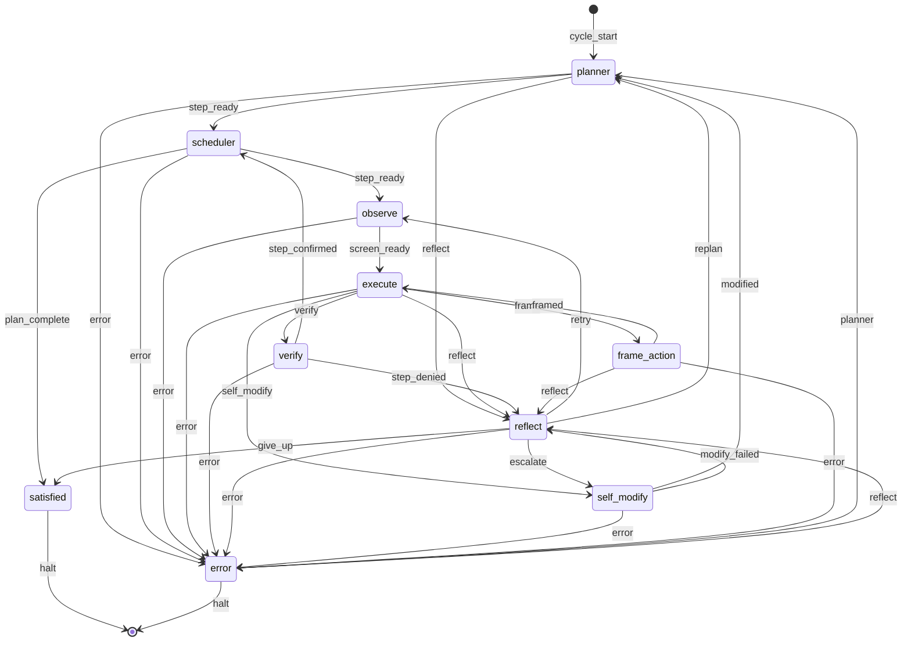

# endgame-ai

A local Windows desktop organism. Python owns the mouse, keyboard, filesystem, git, and UIA observation. `wiring.json` owns topology, prompts, and LLM transport selection. The LLM returns typed JSON records; the Python loop routes only `next_signal` values along topology edges.

This document is written from the checked-in codebase and the **2026-07-04** run artifacts: `comms/runtime.ndjson`, `state.json`, `request-logs-2026-07-04.jsonl`, and `20260704T164146.txt`.

## Quick start

```powershell
# Requires: Windows 11, Python 3, comtypes, XAI_API_KEY for default transport
$env:XAI_API_KEY = "your-key"
python organism.py --max-ticks 10 "your goal here"
```

Control modes (`run` / `pause` / `step`) live in `comms/control.json`. Create `stop.txt` in the repo root to stop all registered processes.

Export the live topology diagram:

```powershell
python export_topology.py
```

## Body vs brain

| Layer | Location | Role |
|-------|----------|------|
| **Body** | `organism.py`, `desktop.py`, `nodes.py`, `bus.py`, `stop_check.py` | Loop, observation, action execution, node loading, state I/O |
| **Brain file** | `wiring.json` | Topology edges, organ prompts, model transport, observe config |
| **Organs** | `organism_nodes/*.py` | One node per topology chip; each emits one signal + one state patch |
| **Transports** | `brain_transports/*.py` | Hot-swappable LLM backends; selected only by `wiring.json` → `model.transport` |

**Fail-hard rule:** one transport is selected. If it fails, the organism raises and routes to the `error` node. No fallback chain.

**Bus contract** (`bus.py`): every node returns `NodeOutput(signal, patch)`. `bus.validate_signal()` rejects signals not listed in `wiring.json` → `topology.edges`.

## Topology

Source of truth: `wiring.json` → `topology`. Regenerate this diagram with `python export_topology.py`.



### Nodes (from code)

| Node | Kind | Brain call? | Signals emitted |
|------|------|-------------|-----------------|
| `planner` | LLM intent decomposer | Yes | `step_ready`, `reflect` |
| `scheduler` | Mechanical step picker | No | `step_ready`, `plan_complete` |
| `observe` | UIA hover scan | No | `screen_ready` |
| `execute` | LLM code actuator | Yes | `verify`, `frame`, `reflect`, `self_modify` |
| `frame_action` | ROD framing pass | Yes | `framed`, `reflect` |
| `verify` | LLM reality comparator | Yes | `step_confirmed`, `step_denied` |
| `reflect` | LLM diagnostic router | Yes | `retry`, `replan`, `escalate`, `give_up` |
| `self_modify` | LLM git patch proposer | Yes | `modified` (always, before apply) |
| `satisfied` | Halt gate | No | `halt` |
| `error` | Mechanical recovery | No | `planner`, `reflect`, `halt` |

`frame_action` was not visited in the 2026-07-04 run. `execute` went straight to `verify` both times.

### Signal → state writes (observed in run)

| Signal | Writer | Key patch fields |
|--------|--------|------------------|
| `step_ready` | planner, scheduler | `plan`, `current_step`, `step` |
| `screen_ready` | observe | `desktop_tree_text`, `focused_title`, `observed_at`, `fresh_scan` |
| `verify` | execute | `last_action`, `last_code`, `last_result` |
| `step_denied` | verify | `last_verification` |
| `retry` | reflect | `reflection`, `last_reflection`, `failure_streak` |
| `step_confirmed` | verify | `step` incremented, `failure_streak` cleared |

## Documented run: 2026-07-04

**Command** (from `task-response.md`):

```powershell
python organism.py --max-ticks 10 "open notepad and write inside the opened window of the notepad application a full comprehensive understanding that you have about the screen, goal, next steps and also what would you suggest developer to send to you in user request instead of the data he sends you right now"
```

**Transport:** `xai` / `grok-4.3` (`wiring.json`, confirmed in `comms/runtime.ndjson`).

**Tick trace** (`comms/runtime.ndjson`):

| Tick | Node | Signal | Next |
|------|------|--------|------|
| 0 | planner | `step_ready` | scheduler |
| 1 | scheduler | `step_ready` | observe |
| 2 | observe | `screen_ready` | execute |
| 3 | execute | `verify` | verify |
| 4 | verify | `step_denied` | reflect |
| 5 | reflect | `retry` | observe |
| 6 | observe | `screen_ready` | execute |
| 7 | execute | `verify` | verify |
| 8 | verify | `step_confirmed` | scheduler |
| 9 | scheduler | `step_ready` | observe |
| 10 | — | `max_ticks` | stopped |

**Brain calls:** 6 total (`request-logs-2026-07-04.jsonl`):

1. **planner** — produced 3-step plan (launch Notepad → type analysis → save `understanding.txt`)
2. **execute** — `win+r`, typed `notepad.exe`, Enter
3. **verify** — `step_denied` (Notepad not yet in `fresh_observation`; tree still showed Program Manager)
4. **reflect** — `retry` (diagnosis: timing / launch method)
5. **execute** — typed the organism's self-analysis into Notepad (see below)
6. **verify** — `step_confirmed` for step 0 (`done_when`: Notepad window in tree)

Run ended at `max_ticks` before step 1 (typing verification) or step 2 (save file) could complete.

### Planner output (from request log)

```json
{
  "intent": [
    {
      "description": "Launch notepad.exe via run dialog or start menu",
      "done_when": "Notepad window titled 'Untitled - Notepad' appears in desktop tree"
    },
    {
      "description": "Focus the Notepad window and type the full understanding of screen state, goal, planned steps, and developer request improvements",
      "done_when": "Typed text is visible inside the Notepad edit area"
    },
    {
      "description": "Save the Notepad file to desktop as understanding.txt",
      "done_when": "File understanding.txt exists on desktop"
    }
  ]
}
```

### Run lessons (from logs, not speculation)

1. **First verify used a stale tree.** Execute launched Notepad, but verify's `fresh_observation` still had `observed_at: 1783176116.86` from the pre-execute observe pass. Notepad appeared only after `reflect → retry → observe` rescanned.
2. **Second execute conflated steps.** After retry, Notepad was already open, but `step_index` was still 0. Execute typed the full analysis (step 1's content) while still on step 0's launch `done_when`. Verify confirmed step 0 because the window was visible—not because launch action was re-run.
3. **The organism typed its own developer feedback into Notepad.** That text is the primary operator guidance below.

## What the organism told us (typed into Notepad, 2026-07-04)

During tick 7 execute, the organism wrote this into the focused Notepad window. This is first-party feedback from the running system, not documentation aspiration.

> Screen: Notepad is now focused and active with title Untitled - Notepad. Desktop tree shows PowerShell and Program Manager also present. Goal: open Notepad then write comprehensive analysis of current setup, goals, next steps and developer request improvements. Next steps: type full analysis into Notepad, verify content, suggest better structured user requests (e.g. explicit step goals, expected UI states, action verification signals). Suggested developer input: structured JSON with explicit goal, numbered steps, done_when conditions, and expected node titles instead of raw observation dumps.

**Takeaway:** the organism asked for structured operator input—explicit goals, numbered steps, observable `done_when` conditions, expected UI states, and node-level context—instead of long unstructured goal strings plus raw observation payloads.

## Recommended operator input

Based on the organism's Notepad message and what the 2026-07-04 run actually consumed:

### Prefer this shape

```json
{
  "goal": "Open Notepad and write a short status report",
  "steps": [
    {
      "description": "Launch notepad.exe",
      "done_when": "Window title contains 'Notepad'",
      "expected_ui": ["Untitled - Notepad focused", "Document Text editor node present"]
    },
    {
      "description": "Type the report text",
      "done_when": "Edit area contains the report string",
      "expected_ui": ["Notepad focused", "visible text in edit control"]
    }
  ],
  "constraints": {
    "max_ticks": 30,
    "verify_after_execute": "rescan desktop before verify"
  }
}
```

### Avoid

- One long natural-language goal that mixes "do the task" with "meta-analyze what data you receive"
- Assuming `observe → execute → verify` shares a fresh tree without an explicit rescan after action
- Raw observation dumps as the primary instruction channel (the planner already receives `desktop_tree_text`)

### CLI today

The organism accepts a single goal string:

```powershell
python organism.py "goal text"
python organism.py --max-ticks N --max-brain-calls N --reset "goal text"
python organism.py --start-node observe "goal text"
```

Structured JSON goals are not yet a first-class CLI input; the organism's suggestion is a design target.

## Observation format

`observe` writes into state (and brain payloads via `brain._with_fresh_observation`):

| Field | Example from run |
|-------|------------------|
| `desktop_tree_text` | `(W0) Screen Screen`<br>`  (W1) Window Untitled - Notepad [FOCUSED]`<br>`    (e_919212_730_127) Document Text editor [scroll]` |
| `focused_title` | `Untitled - Notepad` |
| `observed_at` | `1783176130.3540647` |
| `fresh_scan` | `true` |

Full UIA artifacts land in `comms/observations/{timestamp}.json`. Body-side click targets (`px`, `py`, `hwnd`) live in the desktop singleton's `action_index`, not in `state.json`.

Default scan config (`wiring.json` → `observe_config.hover_scan`):

- `mode`: `cursor_hover`
- `step_px`: 64
- `target_window_only`: true (full screen when desktop/taskbar focused)

## Brain / LLM integration (active config)

From `wiring.json` and `request-logs-2026-07-04.jsonl`:

| Setting | Value |
|---------|-------|
| Transport | `brain_transports/xai.py` |
| Model | `grok-4.3` |
| API | `https://api.x.ai/v1/responses` |
| Reasoning pattern | `native` (not `two_pass`) |
| Structured output | `json_object` |
| Stable prefix | disabled (`enabled: false`, `include_in_request: false`) |

### Per-organ reasoning effort (xAI, from wiring + logs)

| Organ | `reasoning_effort` | Observed in run |
|-------|-------------------|-----------------|
| plan | medium | yes (1190 reasoning tokens) |
| execution | low | yes (300–399 reasoning tokens) |
| verification | none | yes (0 reasoning tokens) |
| reflection | low | yes (517 reasoning tokens) |

### Prompt assembly (from `brain.py`)

```
system: "DYNAMIC NODE PROMPT:\n" + wiring.prompts[organ]
user:   JSON.dumps({ goal, state/observation, fresh_observation, evidence, ... })
```

`prompt_cache_key` is set per run (`endgame-ai-{timestamp}-{hash}`). The 2026-07-04 run logged 64–128 cached prompt tokens per request.

### Alternate transports (configured, not used in documented run)

| Transport | Module | Notes |
|-----------|--------|-------|
| `openai` | `brain_transports/openai.py` | OpenAI-compatible local server |
| `file_proxy` | `brain_transports/file_proxy.py` | Handoff via `comms/request.json` |
| `opencode` | `brain_transports/opencode.py` | OpenCode CLI |
| `browser_ai` | `brain_transports/browser_ai.py` | Intentional fail-hard stub |
| `grok_cli` | — | Config block exists; CLI mode is `xai` with `mode: cli` |

`two_pass` reasoning is implemented in `brain.py` but inactive while `pattern: native`.

## Execute / frame_action loop

```
observe → execute ──verify──→ scheduler
              │
              ├──frame──→ frame_action ──framed──→ execute
              ├──reflect──→ reflect
              └──self_modify──→ self_modify
```

- `execute` runs LLM-generated Python in `nodes.build_capability_runtime()` (pyautogui-shaped facade, `click_node`, subprocess, etc.).
- `frame_action` is a separate ROD pass when execute returns `CANNOT`/`FRAME` and framing has not yet been attempted for the current step.
- On run 2026-07-04, execute returned `verify` directly both times; `frame_action` was not entered.

## Self-modify (code behavior)

1. `self_modify` node asks the brain for a `git_evolution_patch` record.
2. Node always emits signal `modified` with patch in state.
3. `organism.py` then calls `nodes.apply_evolution_patch()` and `nodes.commit_self_evolution()`.
4. If apply raises, the exception routes `self_modify --error--> error` (not `modify_failed --reflect-->`).

Topology defines `modify_failed → reflect`, but the node implementation does not emit `modify_failed` today. Patch apply failures surface as exceptions.

## Data stores

| File | Format | Purpose |
|------|--------|---------|
| `state.json` | JSON | Current tick, plan, step, last action/result/error, observation text |
| `comms/runtime.ndjson` | NDJSON | `node_start`, `node_complete`, `organism_start`, errors |
| `comms/control.json` | JSON | `mode`, `step_token` |
| `wiring.json` | JSON | Topology, prompts, model config |
| `comms/observations/*.json` | JSON | Raw per-scan UIA artifacts |
| `YYYYMMDDTHHMMSS.txt` | NDJSON | Raw brain request/response log (`brain.raw_log_path`) |
| `request-logs-*.jsonl` | JSONL | xAI console export of API calls |
| `pids/*.pid` | text | Registered process IDs for stop mechanism |

## Repository map

```
organism.py          Central loop, pause/step, tick budget, self_modify apply hook
brain.py             Transport loader, think(), fresh_observation, reasoning patterns
bus.py               NodeOutput, signal validation, state_brief
nodes.py             Node loader, capability runtime, evolution apply/commit
desktop.py           UIA observation, hover scan, Win32 actions
stop_check.py        stop.txt + pid registration
export_topology.py   Print Mermaid from wiring.json
wiring.json          Topology + prompts + model (mutable brain)
organism_nodes/      One .py per topology node
brain_transports/    One .py per LLM backend
comms/               Runtime logs, control, observation artifacts
```

## License

See `LICENSE`.