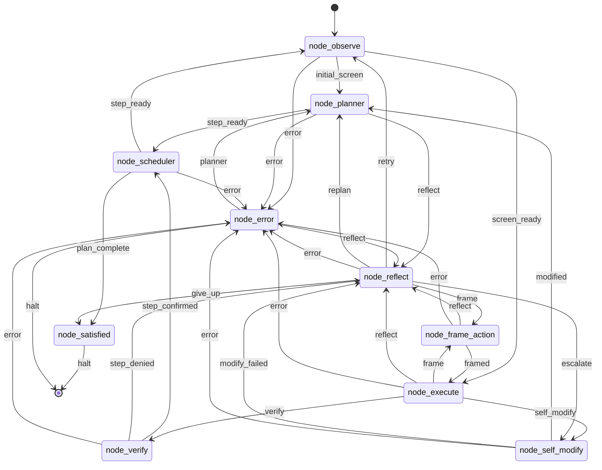
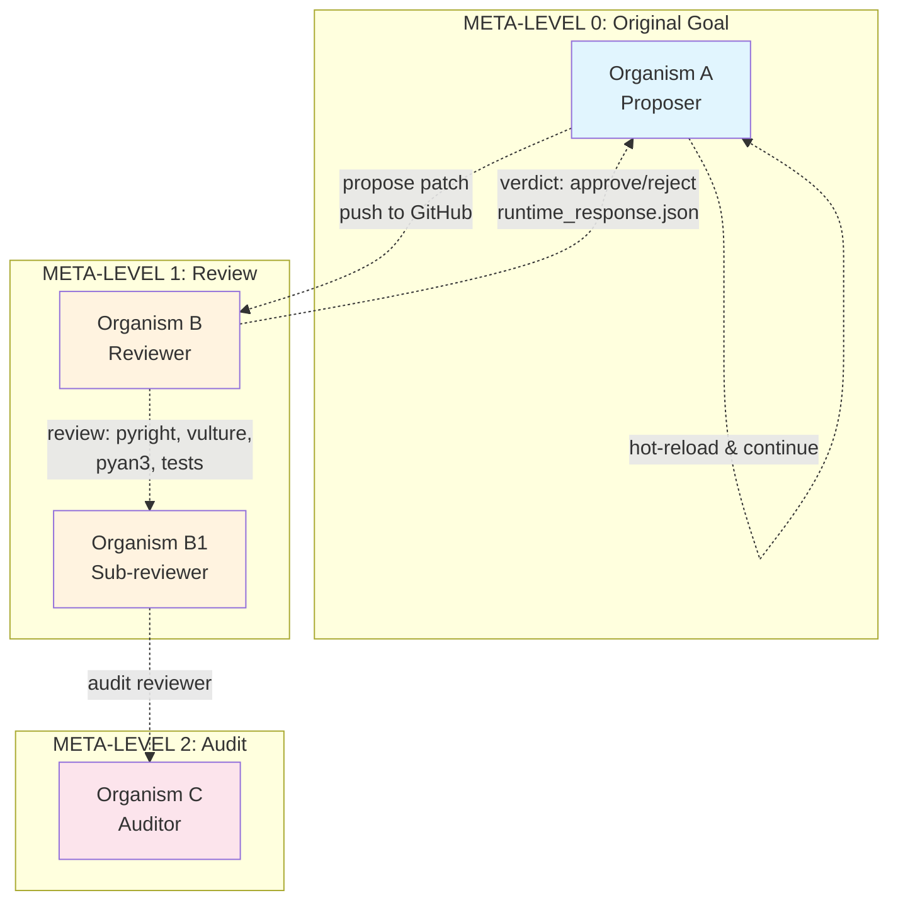
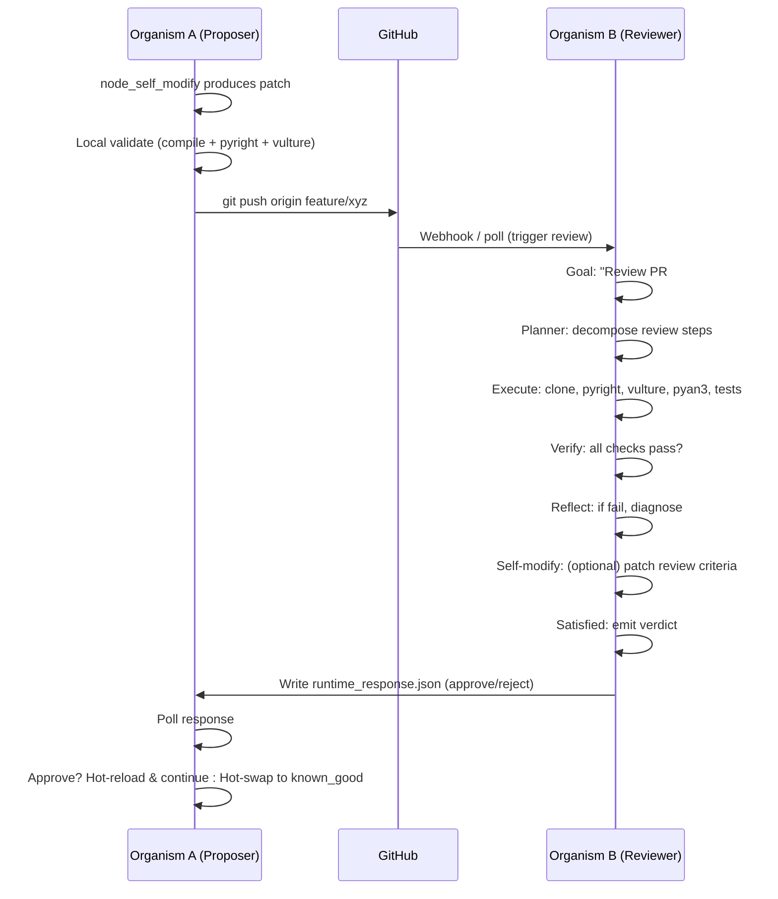
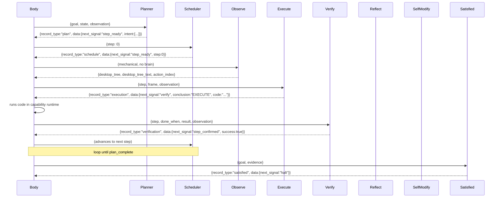
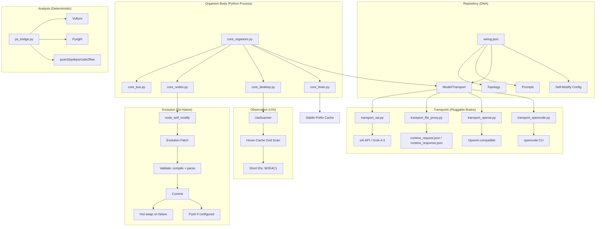

# endgame-ai: The Universal Substrate

endgame-ai is not merely a "living organism" that automates a Windows desktop. It is a **universal substrate** — a single, self-contained Python process that bridges *any* intelligence (human, LLM, another endgame-ai instance) to *any* Windows environment through a fixed circuit: `wiring.json`.

## The Meta Insight

We built a desktop automator. We discovered a **protocol**.

The organism owns mouse, keyboard, subprocess, and a whole-screen UIA observation tree. Interchangeable LLM brains are the mind; `wiring.json` is the immutable circuit. But the *file proxy transport* (`transport_file_proxy.py`) reveals the deeper truth: **the organism is an endpoint**.

Any entity that can write JSON to `runtime_request.json` and read JSON from `runtime_response.json` can drive the organism. This includes:
- You (human) editing a file
- An LLM API (xAI, OpenAI, local via OpenAI-compatible)
- A CLI tool (opencode, grok, custom)
- **Another endgame-ai instance**

No pip install. No MCP servers. No skills. No persistent memory — the **goal is the memory**, an atemporal narrative that the organism tells itself across ticks.

---

## Fractal Topology: Organisms All the Way Down

Because a reviewer can be another endgame-ai instance, the topology can become **recursive/fractal**:

```
Organism A (work) ←→ Organism B (review) ←→ Organism C (audit) ←→ ...
     │                   │                   │
     ▼                   ▼                   ▼
Same wiring,          Same wiring,          Same wiring,
same loop,            same loop,            same loop,
different goal        different goal        different goal
```

An organism proposing a patch can hand that patch to a reviewer organism over git plus the file-proxy protocol. That reviewer can be audited by another organism. **Same circuit, every level.** The goal string is the only difference.

## One Command

```bash
python -m core_organism "your goal here" --max-ticks 50
```

That's it. The repository *is* the runtime. The goal *is* the context. The wiring *is* the architecture.

## Auditable Reality Map

| Claim | Current backing in this checkout |
|-------|----------------------------------|
| One Python organism loop | `core_organism.py` loads `wiring.json`, runs one node at a time, validates topology signals, writes `runtime_state.json`, and appends `runtime_log.ndjson`. |
| One bus record shape | `core_bus.Record` is the only LLM record shape, and `core_brain.py` validates required `data.next_signal` fields for brain records. |
| Whole-screen short IDs | `core_observation.py` gathers UIA nodes, maps them to `W...` short IDs, renders `desktop_tree_text`, and stores body-side metadata in `action_index`. |
| Single action lookup | Execute helpers in `core_nodes.py` resolve `click_node`, `read_node`, `scroll_node`, and `node_by_id` through the state `action_index` keyed by short ID. |
| File-proxy bridge | `transport_file_proxy.py` writes `runtime_request.json` and waits for `runtime_response.json` as a direct bus record: `{record_type, data, reasoning}`. |
| Self-modification | `node_self_modify.py` proposes patches; `core_nodes.py` enforces read-before-write, validates Python/JSON, rejects destructive placeholder rewrites, commits on the current branch, and optionally pushes. |
| Deterministic analysis | `ps_bridge.py` wraps git, compile/lint/analyzer commands with structured JSON output. Optional analyzers fail explicitly when not installed. |
| Recursive review | The file-proxy protocol and git-native patch metadata can be used by a separate reviewer organism. Automatic GitHub webhook/PR spawning is not implemented in this checkout; run the reviewer organism manually against a shared branch/file-proxy channel. |

---

# wiring.json: The Immutable Circuit

`wiring.json` is not configuration. It is **the organism's DNA** — a single JSON file that defines the complete topology, transports, prompts, and self-modification rules. The organism never rewires itself mid-run; `node_self_modify` proposes patches, the local body validates (Python compile + JSON parse), commits, and optionally pushes.

## Base Topology (Single Organism)



**Key difference from legacy**: The cycle starts at `node_observe` (not `node_planner`), so every run begins with a fresh whole-screen scan before planning.

## Recursive/Fractal Topology (Distributed Evolution)

When a self-modification is handed to **distributed review**, the topology becomes a **tree of organisms** — each node in the tree is a full endgame-ai instance running the same wiring:



**Key insight**: The reviewer (Organism B) is **not a special node** — it's a full endgame-ai instance with the *same wiring.json*, same topology*, same organs. Its "goal" is simply *"Review PR #42: validate evolution patch"*. It runs the same planner→scheduler→observe→execute→verify→reflect loop. The only difference is the goal string and the transport (file-proxy for review channel).

This makes the topology **fractal**: the same circuit at every meta-level.

---

## Transport Layer (Pluggable Brains)

```json
"model": {
  "transport": "transport_xai",
  "transport_config": {
    "transport_file_proxy": {
      "request_path": "runtime_request.json",
      "response_path": "runtime_response.json",
      "poll_interval": 0.25,
      "timeout": 86400,
      "reasoning": {
        "enabled": false,
        "pattern": "two_pass",
        "injection_template": "ROD_REASONING_CONTENT:\n{reasoning}",
        "extractor": "think_tags"
      }
    },
    "transport_openai": {
      "base_url": "http://localhost:1234",
      "path": "/v1/chat/completions",
      "model": "nvidia-nemotron-3-nano-4b",
      "temperature": 0.2,
      "reasoning": { "enabled": false, "pattern": "two_pass", "injection_template": "ROD_REASONING_CONTENT:\n{reasoning}", "extractor": "think_tags" }
    },
    "transport_opencode": {
      "executable": "%USERPROFILE%/AppData/Local/opencode/opencode-cli.exe",
      "model": "opencode-go/deepseek-v4-flash",
      "extra_args": [],
      "reasoning": { "enabled": false }
    },
    "transport_xai": {
      "mode": "api",
      "api_key_env": "XAI_API_KEY",
      "model": "grok-4.3",
      "url": "https://api.x.ai/v1/responses",
      "temperature": 0.2,
      "structured_outputs": { "enabled": true },
      "reasoning": { "enabled": true, "pattern": "native", "extractor": "reasoning_field", "effort": "low" }
    },
    "transport_grok_cli": {
      "executable": "grok",
      "extra_args": [],
      "reasoning": { "enabled": false, "pattern": "native", "extractor": "reasoning_field" }
    },
    "transport_browser_ai": {
      "documented_stub": true,
      "reasoning": { "enabled": false }
    }
  }
}
```

Switching brains = changing one string. The organism doesn't care.

## Self-Modify as Topology Extension

The `node_self_modify` organ patches files locally. A separate review runner can **extend the topology** by running another organism against the same branch and file-proxy channel:



The wiring.json doesn't change — when a reviewer is run, the **topology extends dynamically** through the file-proxy protocol.

---

# The Observation Model: Whole-Screen, Focus-Free

## One Flat Scan, Every Visible Element

The scanner hovers a low-discrepancy R2 grid over the entire desktop, caching UIA properties and patterns via `ElementFromPointBuildCache`. Every visible window, button, edit, list, pane — ranked by content and on-screen position — ends up in one tree.

**No focused window. No foreground tracking.** The body never steals, tracks, or reasons about focus. The brain acts on *any* element directly.

## Three-Phase Pipeline (RAW → FILTER → MAP)

The observation pipeline in `core_observation.py` is a pure three-phase transformation with single responsibility per phase:

### Phase 1: RAW — Gather
`gather_raw(config, desktop) → dict[nodes, screen, scan_stats]`

- Mouse probe grid (R2 low-discrepancy sequence) over entire screen
- At each point: `ElementFromPointBuildCache` → UIA cached subtree harvest
- Extracts 13 property IDs + 5 pattern IDs (Value, Text, Legacy, Invoke, Scroll)
- Deduplicates by runtime_id; merges longer text on collisions
- Generic desktop leakage detection: any `List` named `"Desktop"` with scroll action = SysListView32 leakage

### Phase 2: FILTER — Reduce
`filter_raw(raw_nodes, config, screen) → dict[action_elements, text_hints, hwnd_to_z]`

- Ranks: named/textual elements first, on-screen first
- Selects actionable elements by role mapping:
  - `click`: Button, Hyperlink, ListItem, MenuItem, CheckBox, RadioButton, Tab, TabItem, TreeItem, DataItem, SplitButton, Calendar
  - `write`: Edit, ComboBox, Spinner, Document, Scintilla (class name)
  - `read`: Text, ListItem
  - `scroll`: List, ScrollBar, Slider, Tree, DataGrid
- Enforces `max_action_nodes`, `max_depth`, `max_children_per_window`
- Builds `hwnd_to_z` from Windows z-order (EnumWindows)

### Phase 3: MAP — Hierarchize + Short IDs
`build_tree_and_map(action_elements, text_hints, raw_nodes, hwnd_to_z, screen, config) → dict[root, node_index, action_index, desktop_tree_text, ...]`

- Constructs window→element tree by hwnd containment
- Assigns **hierarchical short IDs**:
  - `W0` = Screen root (Desktop)
  - `W{n}` = Window n (z-order bottom→top)
  - `W{n}E{m}` = Element m within window n
  - `W{n}E{m}C{k}` = Child k of element W{n}E{m}
  - `W{n}E{m}C{k}D{p}` = Descendant p of child C{k}
- Action suffix in `desktop_tree_text`: `[click]`, `[write]`, `[read]`, `[scroll]`
- Renders `desktop_tree_text` for LLM prompt (short IDs only)
- Builds `action_index` keyed by short_id with `runtime_id` for execution

## Short Hierarchical IDs: W2E4C1

```
W0 Screen Desktop
  W1 Window Task Manager
    W1E1 Text Task Manager [read]
    W1E2 Button CPU 43% [click]
    W1E3 Pane
    W1E4 Pane CPU
  W2 Window OpenCode
    W2E1 Group
    W2E2 Document OpenCode [write]
    W2E3 List Desktop [scroll]
    W2E4 Hyperlink ... [click]
  W0C1 Button OpenCode - 1 running window [click]
  W0C2 Button Task Manager CPU 50% [click]
```

These IDs are **the only addressing the brain sees**. Long runtime IDs (`e_42_1638582_4_0_0_399`) live only in `action_index` values for execution.

## Dual Index Architecture

```python
# Brain-facing: semantic tree with short_ids as keys
"desktop_tree": {
  "node_index": { "W1E2": {...}, "W1E4": {...} },
  "root": { "id": "W0", "children": [...] }
}

# Body-facing: actionable elements with runtime_id for execution
"action_index": {
  "W1E2": { "id": "e_42_...", "runtime_id": [...], "px": 123, "py": 456, "hwnd": 789 }
}
```

Brain picks `W1E2` from `desktop_tree_text`. Body executes via `action_index["W1E2"]["runtime_id"]`. Single lookup path. No fallback.

---

# The Organ Loop: One Bus, One Signal

## Bus Contract

Every organ receives **one typed record** and emits **exactly one JSON record** whose `data.next_signal` is the only value the body routes on. Organs never call each other directly.

The unified `bus.Record` dataclass (frozen, single source of truth):

```python
@dataclass(frozen=True)
class Record:
    record_type: str      # e.g., "plan", "execution", "verification"
    data: dict            # must contain next_signal for routing
    reasoning: str = ""   # LLM reasoning, injected back on two-pass
```

```python
# Emission helper (used by all nodes)
bus.emit(signal="step_ready",
         patch={...},
         record=bus.Record(record_type="plan", data={...}, reasoning="..."),
         evidence={...})
```



## Organ Roles

| Organ | Brain | Role |
|-------|-------|------|
| `node_planner` | ✅ | Decomposes goal into verifiable steps |
| `node_scheduler` | ❌ | Mechanical: advances to next step |
| `node_observe` | ❌ | Mechanical: whole-screen UIA scan (3-phase) |
| `node_execute` | ✅ | Writes Python code, runs in capability runtime |
| `node_frame_action` | ✅ | Framing pass: converts raw evidence → action frame |
| `node_verify` | ✅ | Judges step success from fresh observation only |
| `node_reflect` | ✅ | Diagnoses failure, routes: retry/replan/frame/escalate/give_up |
| `node_self_modify` | ✅ | Produces git-native evolution patches |
| `node_satisfied` | ✅ | Halts when goal complete or honest give-up |
| `node_error` | ❌ | Mechanical error sink, routes to planner/reflect/halt |

## Capability Runtime (Injected into Execute)

```python
{
  "click_node": click_node,      # click_node("W1E2")
  "read_node": read_node,        # read_node("W1E4")
  "scroll_node": scroll_node,    # scroll_node("W2E3", -3)
  "node_by_id": node_by_id,      # node_by_id("W1E2") via action_index only
  "action_nodes": action_nodes,  # filter by action type
  "hotkey": hotkey,              # hotkey("ctrl", "a")
  "pyautogui": pag,              # coordinate fallback
  "subprocess", "ctypes", "os", "sys", "json", "re", "time",
  "pathlib", "math", "random", "types",
  "wiring_limit", "repo_root", "topology_mermaid",
  "state", "wiring", "goal", "last", "fresh_observation",
  "desktop_tree_text", "action_index"
}
```

No sandbox. Full Python. The body trusts the brain.

## Recursive Organ Loops: Meta-Levels

When a self-modification is handed to distributed review, the **same organ loop runs at a higher meta-level**:

```
META-LEVEL 0 (Work)          META-LEVEL 1 (Review)          META-LEVEL 2 (Audit)
┌─────────────────┐          ┌─────────────────┐          ┌─────────────────┐
│ Goal: "Write    │          │ Goal: "Review   │          │ Goal: "Audit    │
│  PS bridge"     │          │  PR #42"        │          │  reviewer B"    │
├─────────────────┤          ├─────────────────┤          ├─────────────────┤
│ Planner →       │          │ Planner →       │          │ Planner →       │
│ Scheduler →     │          │ Scheduler →     │          │ Scheduler →     │
│ Observe →       │          │ Observe →       │          │ Observe →       │
│ Execute →       │          │ Execute →       │          │ Execute →       │
│ Verify →        │          │ Verify →        │          │ Verify →        │
│ Reflect →       │          │ Reflect →       │          │ Reflect →       │
│ SelfMod → ──────┼─────────>│ SelfMod →       │          │ SelfMod →       │
│ Satisfied       │          │ Satisfied       │          │ Satisfied       │
└─────────────────┘          └─────────────────┘          └─────────────────┘
       │                            │                            │
       │  runtime_request.json      │  runtime_request.json      │
       ▼                            ▼                            ▼
   File Proxy                  File Proxy                  File Proxy
```

**The reviewer is not a special node** — it's a full endgame-ai instance. Its `node_execute` runs `pyright`, `vulture`, `pyan3`, `pydeps`, `code2flow`, `pytest`. Its `node_verify` judges: "Do all checks pass?" Its `node_satisfied` emits the verdict.

The wiring.json doesn't change. With a separately launched reviewer, the topology extends **dynamically** through the file-proxy protocol. Same organs, same bus, same signals — different goal.

---

# File Proxy Transport: The Universal Bridge

## How It Works

```json
"transport_file_proxy": {
  "request_path": "runtime_request.json",
  "response_path": "runtime_response.json",
  "poll_interval": 0.25,
  "timeout": 86400
}
```

1. Organism writes `runtime_request.json` (system prompt + user payload + fresh observation)
2. **Anything** reads it: human, another AI, another endgame-ai instance, a script
3. That thing writes `runtime_response.json` (valid JSON with `record_type`, `data`, `reasoning`)
4. Organism polls, reads, validates, continues

## Why This Changes Everything

```
┌─────────────────────────────────────────────────────────────┐
│                    FILE PROXY TRANSPORT                      │
├─────────────────────────────────────────────────────────────┤
│                                                              │
│   ┌──────────┐    ┌──────────┐    ┌──────────┐    ┌──────┐  │
│   │  Human   │    │  GPT-4   │    │  Claude  │    │ Grok │  │
│   │  (you)   │    │  (API)   │    │  (API)   │    │ (API)│  │
│   └────┬─────┘    └────┬─────┘    └────┬─────┘    └──┬────┘  │
│        │               │               │               │      │
│        ▼               ▼               ▼               ▼      │
│   ┌─────────────────────────────────────────────────────┐    │
│   │              runtime_request.json                    │    │
│   │  {system_prompt, goal, state, fresh_observation}     │    │
│   └─────────────────────────────────────────────────────┘    │
│                        │                                     │
│                        ▼                                     │
│   ┌─────────────────────────────────────────────────────┐    │
│   │              runtime_response.json                   │    │
│   │  {record_type, data:{next_signal, ...}, reasoning}   │    │
│   └─────────────────────────────────────────────────────┘    │
│                        │                                     │
│                        ▼                                     │
│              ┌─────────────────┐                             │
│              │  endgame-ai     │                             │
│              │  organism body  │                             │
│              └─────────────────┘                             │
│                                                              │
└─────────────────────────────────────────────────────────────┘
```

**No MCP servers. No skills. No pip install.** The protocol is: *write JSON, read JSON*. Any agent that can read/write files participates.

## Multi-Agent / Multi-Instance

Two endgame-ai instances can talk via a shared directory:
- Instance A writes request → Instance B reads, writes response → Instance A continues
- A human can step in at any tick, inspect the request, write a response
- CI/CD can inject responses for testing

## ROD (Reasoning on Demand) Injection

```json
"reasoning": {
  "enabled": true,
  "pattern": "two_pass",
  "injection_template": "ROD_REASONING_CONTENT:\n{reasoning}",
  "extractor": "think_tags"
}
```

The organism can request reasoning from *any* brain, then inject it back for a second pass — regardless of which transport produced it.

---

# Self-Modification: Distributed Git-Native Evolution

## The Vision: Organism Proposes, Peer Reviews, Organism Adopts

endgame-ai self-modifies locally today: it proposes a structured patch, validates it, commits it on the current branch, and optionally pushes it. A separate reviewer organism can use the same branch plus file-proxy protocol to review that patch, but automatic GitHub PR/webhook orchestration is an integration target, not code that runs by itself in this checkout.

```
┌─────────────────────────────────────────────────────────────────────────────┐
│                        DISTRIBUTED SELF-EVOLUTION LOOP                       │
├─────────────────────────────────────────────────────────────────────────────┤
│                                                                             │
│  ┌──────────────┐     1. Propose Patch      ┌──────────────┐               │
│  │  ORGANISM A  │ ────────────────────────> │   GITHUB     │               │
│  │  (proposer)  │    git push origin        │  (registry)  │               │
│  └──────────────┘                           └──────┬───────┘               │
│                                                     │                       │
│                                                     │ 2. Clone & Review     │
│                                                     ▼                       │
│  ┌──────────────┐     4. Approve/Reject      ┌──────────────┐               │
│  │  ORGANISM A  │ <────────────────────────── │  ORGANISM B  │               │
│  │  (adopter)   │    runtime_response.json   │  (reviewer)  │               │
│  └──────────────┘                           └──────────────┘               │
│        │                                             ▲                      │
│        │ 5. Hot-reload & continue                     │                      │
│        ▼                                             │                      │
│  ┌──────────────┐                                    │                      │
│  │  CONTINUE    │                                    │                      │
│  │  EXECUTION   │                                    │                      │
│  └──────────────┘                                    │                      │
│                                                      │                      │
│                    3. Deterministic Analysis         │                      │
│              ┌────────────────────────┐              │                      │
│              │ pyright, vulture,      │              │                      │
│              │ pyan3, pydeps,         │              │                      │
│              │ code2flow, tests       │              │                      │
│              └────────────────────────┘              │                      │
│                                                      │                      │
└──────────────────────────────────────────────────────┘──────────────────────┘
```

## How It Works

### 1. Organism A (Proposer) Hits a Wall
- Execution fails, reflection escalates, or capability missing
- `node_self_modify` reads: workspace manifest, git context, failure diagnosis, fresh observation
- Produces **evolution patch** (structured JSON: file_writes, wiring_patches, commands, expected_validation)

### 2. Local Validation (Fast Path)
- Python compile + JSON parse on every touched file
- Runs declared `commands` (pyright, vulture, custom tests)
- **Only if local validation passes**: commit + push to `origin/<branch>`

### 3. GitHub as Registry
- Patch lands on remote branch with structured commit message:
```
Self-modify: Unify short IDs, remove node_by_id fallback

{
  "branch": "feature/short-ids",
  "changed_files": ["core_nodes.py", "core_observation.py", "wiring.json"],
  "read_files": ["core_nodes.py", "core_observation.py", "wiring.json"],
  "rationale": "Single lookup path via action_index keyed by short_id...",
  "expected_validation": "pyright clean, organism runs 5 ticks without error"
}
```

### 4. Organism B (Reviewer) — Can Be Anywhere
- Another endgame-ai instance (different machine, same repo) runs in **review mode**:
```bash
python -m core_organism "Review PR #42: validate evolution patch" --max-ticks 20
```
- Reviewer's wiring uses `transport_file_proxy` pointing to a shared review directory, OR `transport_xai` with a review prompt
- Reviewer clones repo at the commit, runs **full deterministic analysis**:
```bash
python ps_bridge.py pyright .
python ps_bridge.py vulture . 90
python ps_bridge.py pyan3 . --uses --dot --file deps.dot
python ps_bridge.py pydeps . --noshow
python ps_bridge.py code2flow . --format dot
python -m pytest  # if tests exist
```
- Reviewer writes `runtime_response.json` with verdict:
```json
{
  "record_type": "evolution_review",
  "data": {
    "verdict": "approve|reject",
    "commit_sha": "abc1234",
    "analysis": {
      "pyright": {"errors": 0, "warnings": 2},
      "vulture": {"dead_code": []},
      "call_graph": {"cycles": 0, "unreachable": []},
      "tests": {"passed": 5, "failed": 0}
    },
    "reasoning": "Patch passes all checks. Short ID unification is correct. Approved."
  },
  "reasoning": "..."
}
```

### 5. Organism A (Adopter) Hot-Reloads
- A manually coordinated Organism A can poll for review response through file-proxy; webhook/PR automation is an integration target
- On **approve**: atomic write of validated files, reload wiring, continue from planner
- On **reject**: hot-swap to `known_good_commit`, route to reflection for replan

## Why This Architecture Matters

| Traditional "Self-Modify" | endgame-ai Distributed Evolution |
|---------------------------|----------------------------------|
| Local-only, no verification | **Peer-reviewed by another instance** |
| Trusts own validation | **Independent compilation & test** |
| Single point of failure | **Reviewer can be on different machine/OS** |
| No audit trail | **Full Git history + structured commit messages** |
| Human-in-the-loop required | **AI-to-AI review via file proxy** |

## The File Proxy as Review Channel

The same `transport_file_proxy` that lets humans drive the organism lets **endgame-ai instances talk to each other**:

```
Organism A (proposer)          GitHub          Organism B (reviewer)
     │                           │                    │
     ├─ push patch ─────────────>│                    │
     │                           ├─ manual poll ─────>│
     │                           │                    ├─ clone, analyze, test
     │                           │                    ├─ write runtime_response.json
     │                           │<──── approve ───────┤
     ├─ poll response ───────────│                    │
     ├─ hot-reload & continue    │                    │
```

**No MCP servers. No custom protocols. Just JSON files.** Any entity that can read/write files participates.

## Safety Mechanisms (Unchanged, Still Critical)

- **Read-before-write**: Must declare `read_files` for every touched existing file
- **Core file protection**: Cannot delete `core_*.py` or `wiring.json`
- **Rollback on failure**: Snapshots restored automatically
- **Hot-swap to known good**: `wiring.json`'s `known_good_commit` is the escape hatch
- **Atomic writes**: Temp file + `os.replace`
- **Reviewer veto**: Rejection triggers immediate hot-swap, no partial adoption

## The Goal Remains the Memory

No vector DB. No embeddings. The **goal string** — fixed for the run — is the atemporal narrative. Each organ receives it. Each patch references it. A reviewer can evaluate against it when one is run. The organism *tells itself the story of what it's doing* across ticks, across machines, across reviews. Self-modification updates the story by updating the code that enacts it — with optional peer approval through the file-proxy protocol.

## Fractal Topology: Recursive Self-Improvement

The reviewer (Organism B) is **not a special node** — it's a full endgame-ai instance with the *same wiring.json*, same topology, same organs. Its "goal" is simply *"Review PR #42: validate evolution patch"*. It runs the same planner→scheduler→observe→execute→verify→reflect loop.

This makes the topology **fractal**: the same circuit at every meta-level.

```mermaid
graph TD
    subgraph "LEVEL 0: Work"
        O0[Organism A<br/>Goal: "Write PS bridge"]
    end
    
    subgraph "LEVEL 1: Review"
        O1[Organism B<br/>Goal: "Review PR #42"]
        O1 --> O0
    end
    
    subgraph "LEVEL 2: Audit"
        O2[Organism C<br/>Goal: "Audit reviewer B"]
        O2 --> O1
    end
    
    subgraph "LEVEL N: Meta-Audit"
        ON[Organism N<br/>Goal: "Audit auditor..."]
        ON --> O2
    end
    
    O0 -.->|propose| O1
    O1 -.->|approve/reject| O0
    O1 -.->|propose review criteria| O2
    O2 -.->|approve/reject| O1
```

**Implications:**

| Property | Consequence |
|----------|-------------|
| **Same wiring at every level** | No special "reviewer code" — the reviewer *is* the organism |
| **Goal drives behavior** | "Review PR #42" vs "Write PS bridge" — same loop, different intent |
| **File proxy as universal channel** | Human↔AI, AI↔AI, AI↔AI↔AI — all JSON files |
| **GitHub as coordination layer** | Commits = proposals, PRs = review contexts, merges = adoption |
| **Unbounded meta-levels** | Reviewer can be reviewed, auditor audited — recursive improvement |
| **Distributed by default** | Reviewer on different machine, OS, network — same protocol |

The protocol is recursive: the reviewer itself can be reviewed, and so on. This is the path to **recursive self-improvement** where the improvement mechanism *is* the thing being improved.

---

# Deterministic Analysis Tools: Finding Bloat

The repository includes a deterministic PowerShell bridge (`ps_bridge.py` at repo root) that wraps all analysis tools with structured JSON output. No shell syntax issues (`&&`, `||`, `|`).

## ps_bridge.py Commands

```bash
# Move to repo root (already there)
python ps_bridge.py run "command"
python ps_bridge.py git_status
python ps_bridge.py git_diff
python ps_bridge.py git_add "file.py"
python ps_bridge.py git_commit "message"
python ps_bridge.py git_log 20
python ps_bridge.py pyright .
python ps_bridge.py vulture . 80
python ps_bridge.py pyan3 . --uses --no-defines --colored --grouped --annotated --dot --file deps.dot
python ps_bridge.py pydeps . --noshow
python ps_bridge.py code2flow . --format dot
python ps_bridge.py pycallgraph .
```

Each returns:
```json
{"exit_code": 0, "stdout": "...", "stderr": "...", "success": true}
```

## Vulture: Dead Code Detection

```bash
python ps_bridge.py vulture . 80
```

Finds unused imports, methods, attributes, classes. Run after every self-modify to catch regressions.

## Pyright: Static Type Checking

```bash
python ps_bridge.py pyright .
```

Catches type errors the brain might introduce. The organism runs this as a validation command in self-modify patches.

## Call Graph Analysis

```bash
# pyan3 (module import graph)
python ps_bridge.py pyan3 .

# pydeps (dependency graph, needs Graphviz dot)
python ps_bridge.py pydeps .

# code2flow (function call graph)
python ps_bridge.py code2flow .

# python-call-graph
python ps_bridge.py pycallgraph .
```

Generate `.dot` files for Graphviz visualization. `deps.dot` (152KB) already exists from pyan3.

## Finding Bloat: The Workflow

1. `python ps_bridge.py vulture . 80` → dead code
2. `python ps_bridge.py pyright .` → type errors, unused imports
3. `python ps_bridge.py pyan3 . --uses --no-defines --dot --file deps.dot` → import cycles, unused modules
4. `python ps_bridge.py pydeps . --noshow` → dependency clusters
5. Delete. Simplify. Commit.

The organism can run this workflow on itself via `node_self_modify`.

## Integration with Self-Modify

`node_self_modify` can emit `commands` in its patch:
```json
{
  "commands": [
    {"command": "python ps_bridge.py pyright .", "shell": false},
    {"command": "python ps_bridge.py vulture . 80", "shell": false}
  ]
}
```

The organism runs them, validates (Python compile + JSON parse), commits on success, hot-swaps to known-good on failure.

---

# Stable Prefix: Prompt Caching for Free

## The Problem

Every brain call sends the full system prompt + static source files. For large repos, this burns tokens and latency.

## The Solution: Stable Prefix

```json
"stable_prefix": {
  "enabled": true,
  "include_in_request": true
}
```

When enabled, the organism computes a **content-addressed fingerprint** of all tracked source files (`.py`, `.json`, `.md`, `.gitattributes`, `.gitignore`, `LICENSE` — excluding `.git`, `__pycache__`, `runtime_*`).

```python
class StablePrefix:
    def _render(self) -> tuple[str, str]:
        digest = hashlib.sha256()
        for rel in self.files:  # sorted git ls-files
            content = self._read_file(rel)
            digest.update(rel.encode("utf-8"))
            digest.update(b"\0")
            digest.update(content.encode("utf-8"))
        # cache_key = f"endgame-ai-{fingerprint[:24]}"
```

The fingerprint becomes the **prompt cache key** (`prompt_cache_key` sent to xAI API). Provider caches the prefix; only dynamic data (goal, state, fresh observation) follows.

## Manifest + Source In Prompt

```
ENDGAME-AI STABLE PREFIX
This is the real checked-out source used by the local organism.
Provider prompt caches can reuse this prefix because dynamic run data appears after it.
Self-evolution must ground changes in these files, not in hallucinated structure.

ORGANISM OPERATING RULES:
You are one organ inside endgame-ai...

STATIC MANIFEST:
[{"path": "core_nodes.py", "chars": 23456, "bytes": 23456}, ...]

STATIC SOURCE FILES:
--- BEGIN FILE core_nodes.py ---
[full file content]
--- END FILE core_nodes.py ---
```

## Why It Matters

- **Tokens**: Static source sent once, cached by provider
- **Latency**: Cache hit = faster first token
- **Correctness**: Brain *always* sees actual checked-out code, never hallucinated structure
- **Self-modify grounding**: Patches must match the fingerprint or cache invalidates

Enable in `wiring.json`:
```json
"model": {
  "stable_prefix": { "enabled": true, "include_in_request": true },
  "transport": "transport_xai",
  "transport_config": { "transport_xai": { "mode": "api", "model": "grok-4.3" } }
}
```

---

# Quick Start & Meta Summary

## Run It

```bash
# Clone
git clone https://github.com/your-org/endgame-ai
cd endgame-ai

# Set XAI_API_KEY for Grok-4.3 (or use file_proxy)
$env:XAI_API_KEY = "xai-..."

# Run with a goal
python -m core_organism "Open Notepad and write 'hello world'" --max-ticks 20
```

## File Proxy Mode (No API Key)

```json
// wiring.json
"model": { "transport": "transport_file_proxy" }
```

```bash
python -m core_organism "your goal" --max-ticks 10
# Organism writes runtime_request.json
# YOU write runtime_response.json as a direct bus record (act as the brain)
# Organism reads, continues
```

Example response:

```json
{"record_type":"plan","data":{"next_signal":"step_ready","intent":[{"description":"...","done_when":"..."}]},"reasoning":"..."}
```

## Architecture in_one_command-line Arguments

```bash
python -m core_organism "goal" [--max-ticks N] [--wiring wiring.json]
```

- `--max-ticks`: Max organ loop iterations (default: 50)
- `--wiring`: Alternate wiring file (default: wiring.json)

## Architecture in One Diagram



## The Vision Realized

**endgame-ai is the bridge.**

| Before | After |
|--------|-------|
| "AI automates desktop" | Universal substrate: any intelligence ↔ any Windows |
| Hardcoded LLM | `wiring.json` swaps brains in one line |
| Skills/MCP/Tools | File protocol: write JSON, read JSON |
| Persistent memory | Goal = atemporal narrative memory |
| Sandboxed | No sandbox. Full Python. Trust the brain. |
| Single agent | Multi-agent: human, AI, endgame-ai instances |

## Contributing

1. Run `python ps_bridge.py vulture . 80` — delete dead code
2. Run `python ps_bridge.py pyright .` — fix type errors
3. Run `python ps_bridge.py pyan3 . --dot --file deps.dot` — visualize imports
4. Edit `wiring.json` to change behavior (no code changes needed)
5. Self-modify: give the organism a goal to improve itself

The organism *is* the development environment. It evolves itself via GitHub. You just give it goals.

---

**We're cooking.** The bridge is built. The protocol is live. The organism is running. Now we give it better goals and watch it build the rest.

---
