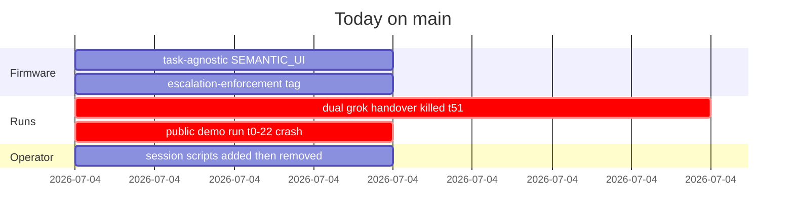
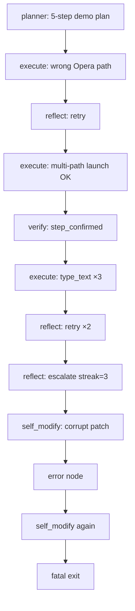
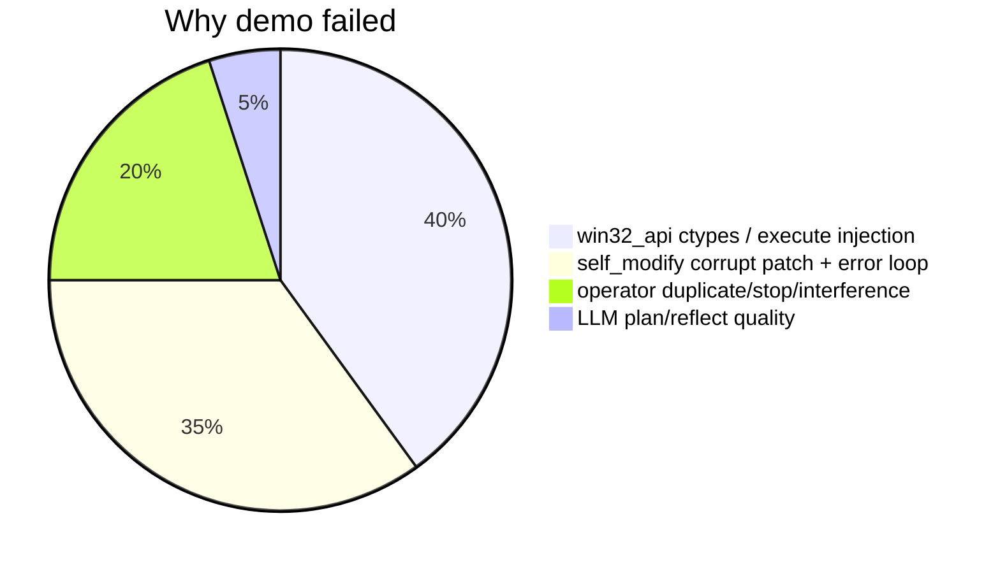
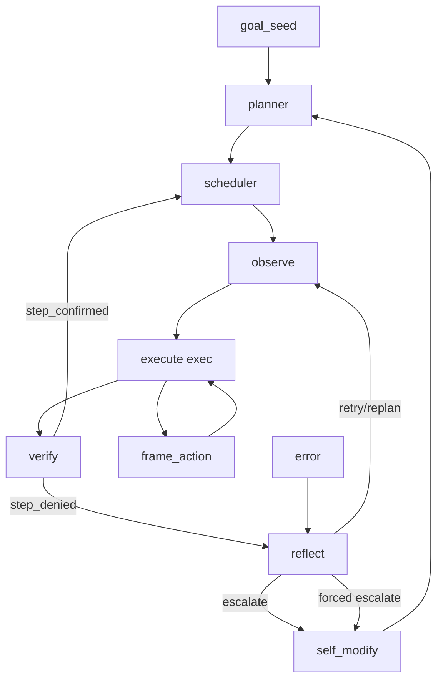

# endgame-ai

Living digital operator on Windows. One `goal_seed` in, handover out. Python senses the desktop, runs code on the real machine, routes signals through `wiring.json`, may evolve firmware via git. No sandbox.

**Firmware LOC (tracked root `*.py` + `wiring.json`): ~2,547 lines** — 21 organs + bus + evolution. No auxiliary scripts in repo.

---

## Verdict: operative or broken?

**Partially operative.** The tick loop, planner, observe, execute, verify, reflect, and natural escalate work. The **demo handover today failed** before X, LinkedIn, or chess. Death was **firmware + operator**, not goal wording.

| Layer | Status |
|-------|--------|
| Core loop | Works |
| SEMANTIC_UI + Opera launch | Works after path retry |
| Step verify | Works (step 0 confirmed) |
| UI actions (`set_foreground_window`, `click_at`, `type_text`) | **Broken** — ctypes `ArgumentError` |
| `self_modify` | **Broken** — LLM patches fail `git apply`; error recovery **re-enters self_modify → fatal crash** |
| Forced escalate (`escalation-enforcement` tag) | Coded; natural escalate fired first on demo run |
| Operator session | **Harmful** — duplicate organisms, `stop.txt` mid-brain, false resume, chat stealing focus |

---

## Session timeline (2026-07-04)

### Run A — earlier handover (logs cleaned; forensic from session)

- Chrome grok chess + Opera articles goal.
- 51 ticks, 37 brain calls, **0 escalate, 0 self_modify, 0 publishes**.
- Stuck: SEMANTIC_UI saw `drag_handle` only on grok; reflect replanned 5×.
- **Killed by operator** `stop.txt` at tick 51 mid-reflect API call.
- False “resume” (`reset=False` does **not** load `state.json`).

### Run B — public demo (last `brain_raw.jsonl` before cleanup)

**Goal:** Opera-only demo — AI news via Grok → X post → LinkedIn post → ASCII chess.

| Time (approx) | Tick | Event |
|---------------|------|-------|
| start | 0 | planner → 5 steps, 14.3s API |
| 3 | execute | `C:\Program Files\Opera\opera.exe` → **FileNotFoundError** |
| 4 | reflect | **retry** (streak 1) |
| 6 | execute | multi-path Opera + `cmd start` → **launch OK** |
| 7 | verify | **step_confirmed** — `Grok - Opera`, `text_input` in tree |
| 10–17 | execute×3 | `click_at` + `type_text` → **ArgumentError** every time |
| 17 | reflect | **escalate** (natural, streak 3) — win32 API contract |
| 18 | self_modify | 85.6s API → patch for `win32_api.py` → **git apply corrupt line 13** |
| 19 | error | routes to reflect |
| 20 | reflect | **escalate** again (corrupt patch) |
| 21 | self_modify | 2nd patch → **corrupt line 22** |
| crash | — | error recovery calls `_apply_self_modify` again → **unhandled RuntimeError, process exit** |

**Outcome:** Step 0 done. Step 1 never typed into Grok. **0 posts. 0 chess.**

### Run C — accidental duplicate (operator mistake)

- `watch.py` spawned **second** `run.py` while Run B lived.
- Second organism: tick 2 **scheduler OSError 22** → overwrote `state.json`.
- Commentary read ghost state; owner chat added desktop noise.

---

## LLM usage (Run B, from `brain_raw.jsonl`)

| Metric | Value |
|--------|-------|
| API requests (`phase: think`) | **15** |
| Model | `grok-4.3` |
| Wall API time (`elapsed_s` sum) | **~218s** |
| Token billing in logs | **Not recorded** — only `max_output_tokens` caps per organ |

| Organ | Calls | max_output cap | Notes |
|-------|-------|----------------|-------|
| planner | 2 | 2400 | 2nd call = duplicate organism |
| execute | 5 | 5000 | |
| reflect | 5 | 2400 | 3 retry, 2 escalate |
| verify | 1 | 1200 | 1 step_confirmed |
| self_modify | 2 | (patch) | 85.6s + 2nd; both corrupt diff |

Stable-prefix KV-cache: every request sends full firmware manifest in system block (large input; cache reuse intended).

---

## How the organism behaved (MoE read)

- **Planner:** Good decomposition; observable `done_when`.
- **Execute:** Recovered browser launch; failed on injected win32 helpers (not raw Python).
- **Verify:** Honest — confirmed Opera+Grok when tree had `text_input`.
- **Reflect:** Correct natural escalate on API type errors (before forced gate needed).
- **self_modify:** Correct diagnosis target (`win32_api.py`); **patch format unusable**; evolution pipeline is the bottleneck.

---

## Progress vs regression today

| Progress | Regression |
|----------|------------|
| Task-agnostic SEMANTIC_UI (`540f927`) | +46 LOC `bus.py` escalation gate (net +~55 LOC firmware) |
| Forced escalate when observation roles missing (`7d0ee53`) | Session scripts (`watch`, `run`, `operator`, `comms_poll`) — **removed** |
| Natural escalate worked on demo | `self_modify` crash loop unfixed |
| Opera+Grok launch proven | Operator killed Run A; duplicated Run B |
| README discipline | False resume; commentary required owner prompts |

**LOC trajectory:** ~2,700 → ~2,547 after deleting `comms_poll.py` (+55 escalation, −62 poll, −scripts untracked).

---

## Root-cause split

1. **Code:** `ArgumentError` on `set_foreground_window` / `click_at` — HWND/ctypes contract in `win32_api.py` not aligned with how `execute` injects calls.
2. **Code:** `evolution.py` + `organism.py` error recovery re-applies failed `self_modify` patches → guaranteed death.
3. **Operator:** Second organism, `stop.txt` during API, Cursor chat during recording (focus/scan noise — valid stress test, bad for clean demo).
4. **Not the goal:** Wording was fine; planner understood it.

---

## Architecture

SEMANTIC_UI: WINDOW → ZONE → role. Geometry only.

**Escalation enforcement** (`reflect_escalation.observation_missing_min_streak: 3` in `wiring.json`): if `done_when` names roles absent from tree after streak ≥ 3, reflect forces `escalate`. Demo run escalated naturally on API errors before this gate mattered.

---

## Operator noise benchmark

Owner typing to the assistant during a run is **not in the plan** but appears in scans (focus flips, element counts 0→60→0). Useful adaptation stress test; bad for clean recording. **One organism instance only.**

---

## Plans (reduce LOC, fix death)

1. **P0 — `win32_api.py`:** Fix HWND ctypes for `SetForegroundWindow` / `PostMessageW` (~10 lines, no new config).
2. **P0 — `organism.py`:** On `self_modify` error, route reflect/replan — **never** re-apply patch in error loop.
3. **P1 — `evolution.py`:** Reject malformed diff before `git apply`; retry once with smaller patch prompt.
4. **P1 — Delete or fold** `reflect_escalation` into reflect if natural escalate proves reliable (LOC −40).
5. **P2 — True resume:** load `state.json` when continuing.
6. **No new scripts** — operator reads `comms/brain_raw.jsonl` + `state.json` directly.

---

## What ships

| Tracked | Role |
|---------|------|
| `organism.py` | Tick loop |
| `wiring.json` | Topology + prompts |
| `desktop.py` | SEMANTIC_UI |
| `brain.py` | xAI + stable prefix |
| `bus.py` | Signals + escalation gate |
| `evolution.py` | git apply patches |
| `comms/goal.txt` | Runtime goal (gitignored) |

Runtime only (gitignored): `state.json`, `comms/brain_raw.jsonl`, `comms/runtime.ndjson`, `comms/observations/`.

---

## Git today

| Commit | What |
|--------|------|
| `540f927` | Task-agnostic SEMANTIC_UI |
| `7d0ee53` | Forced escalate + tag `escalation-enforcement` |
| `76a139c` / `6257dc9` | README passes |

**Remote:** `origin/main` at `6257dc9`. Firmware ready; **handover not complete** until P0 fixes land.